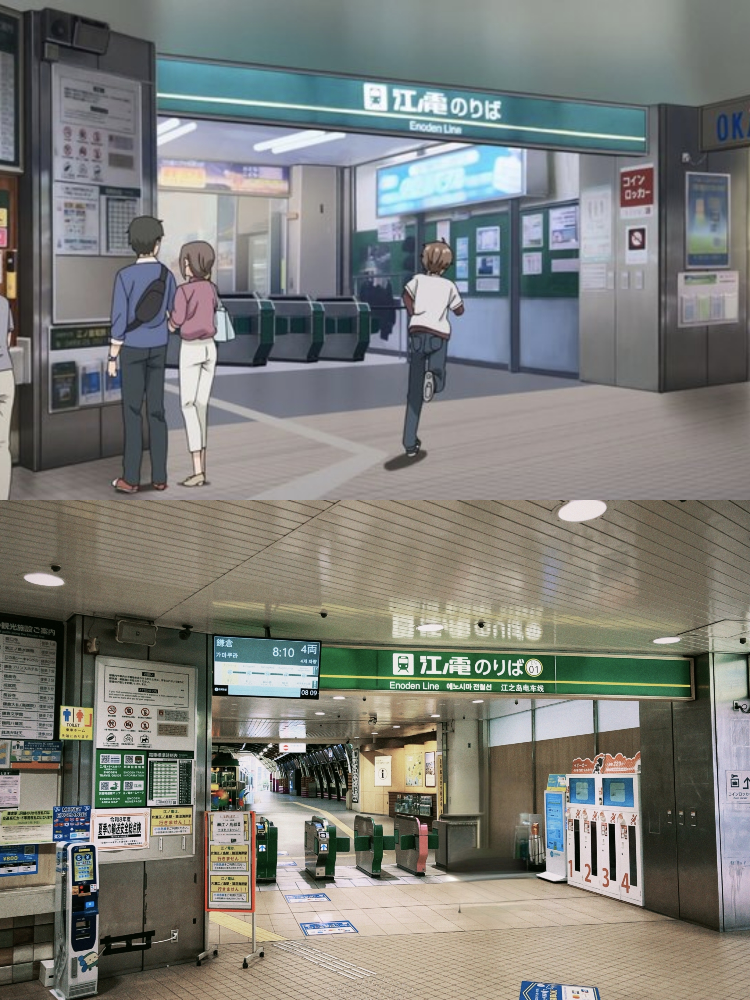
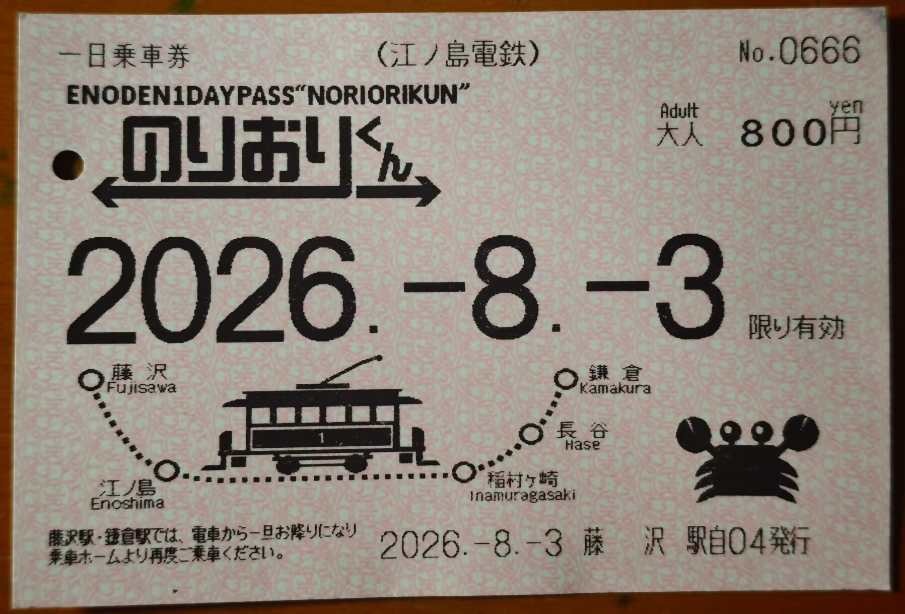
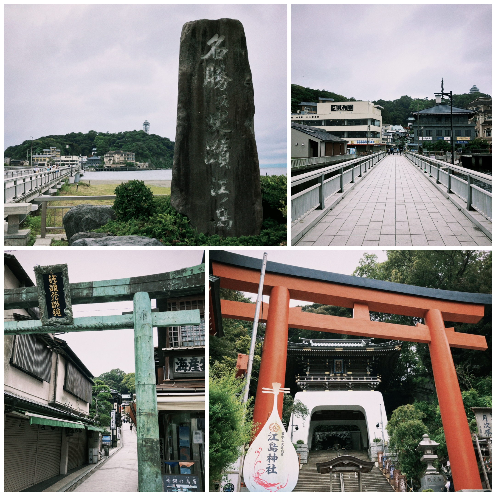
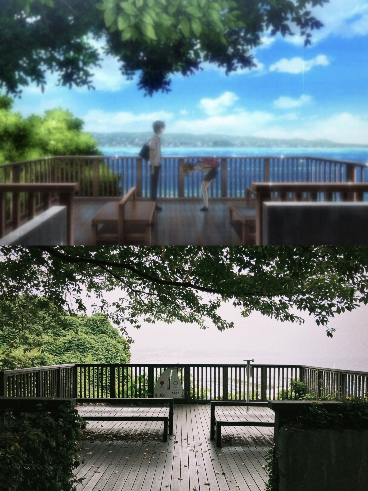
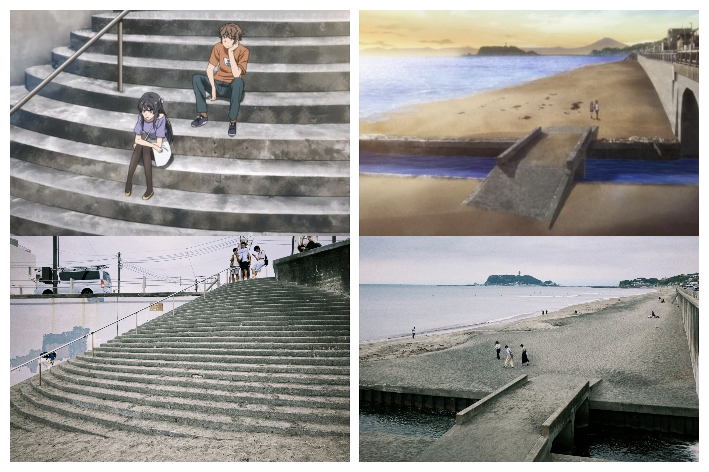
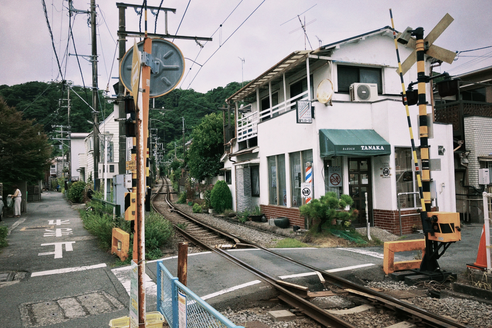
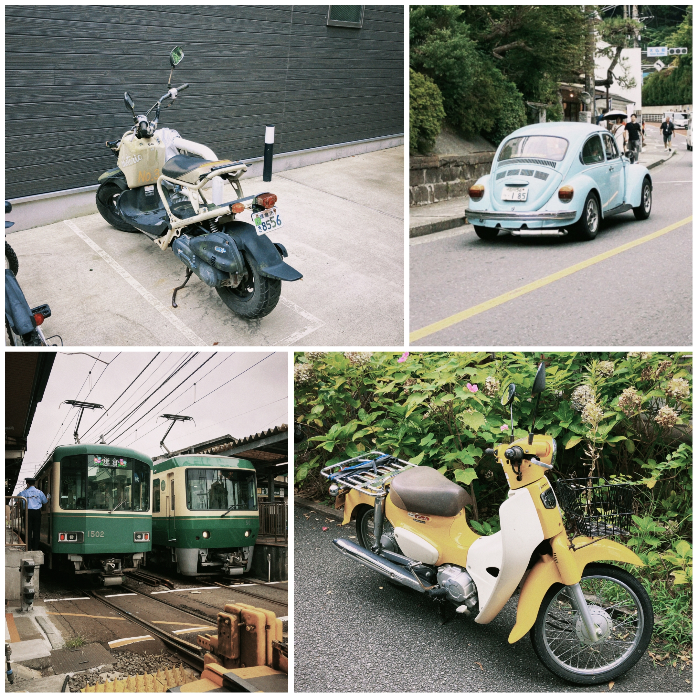
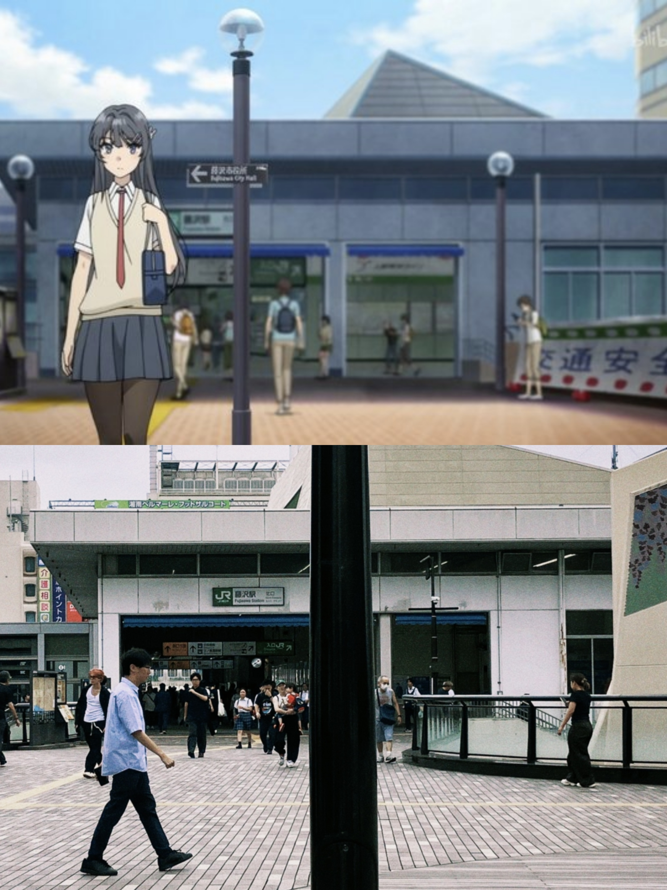
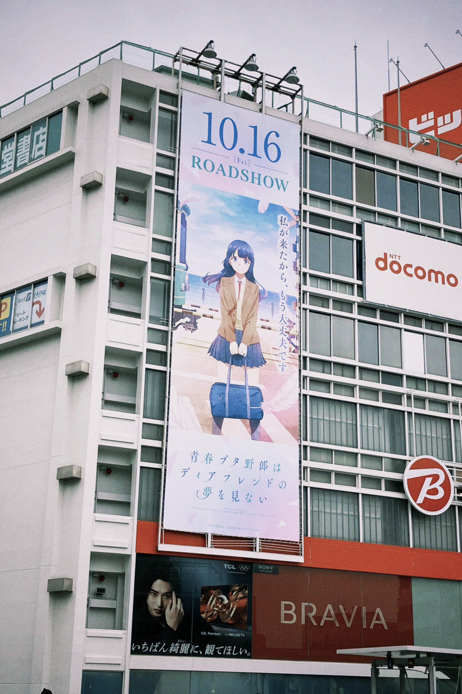
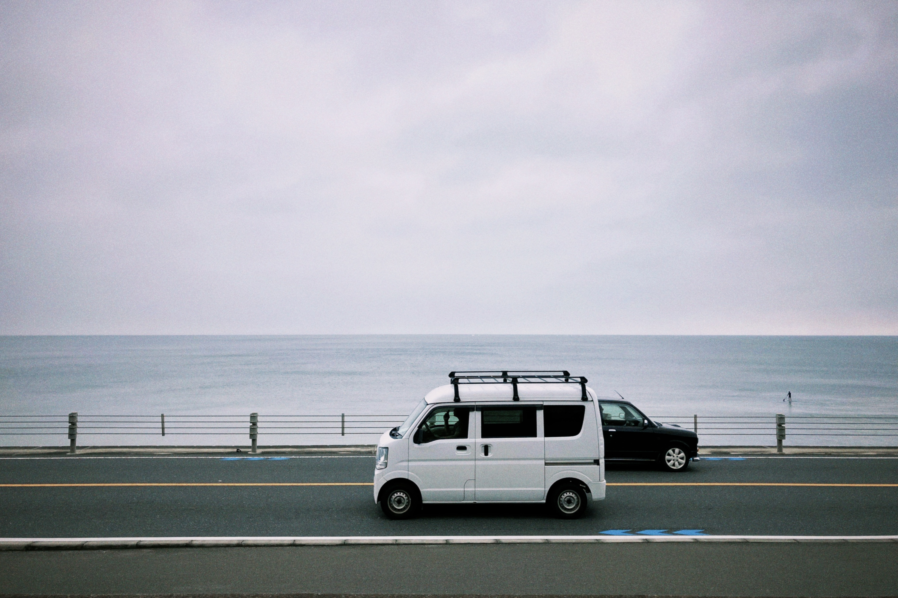

> 写于2026.8.3晚，修改于8.18-20。

高中的时候和朋友聊动漫，朋友极力推荐我看《青春猪头少年》系列，可惜那时候因为学业繁忙没有看，直到今年寒假才将动画化的所有部分从头到尾看了一遍。正好去年去过镰仓，看到咲太、麻衣、翔子他们走过我走过的路，去过我去过的景点的时候，忽然生出一种仿佛他们真的生活在现实中的感动<del>（唉唉二次元）</del>，于是决定这次无论如何一定要重新去一趟镰仓。

本来打算昨天前往，然而由于天气太热未能成行。晚上看天气预报说今天是阴天，很凉快，于是决定把本来去立川市巡礼《超时空辉夜姬》的计划放到以后，起了个大早前往镰仓。

到了藤泽站，从小田急线下来，就顺着南口的指示牌一路走到江之电的闸口。

在一旁的售票机上买了江之电的一日乘车券。我个人感觉这张日票很值，因为后面我坐着江之电在很多站上上下下，如果用IC卡的话每次上下车都得花七八块人民币。

电车里基本上都是当地的居民。坐了几站就到江之岛站，江之岛站前有两排铁鸟栖息在栏杆上，据说有位老奶奶一年四季都会给这些小鸟织不同的衣服。

大概因为时间比较早，去江之岛的人很少，路上只有三三两两的游客。走过长长的弁天桥，沿着参道一路往上，就到了江岛神社。

沿着江岛神社的台阶稍微爬一段路，就能看到咲太和朋绘的著名分手现场。

再往上走的地方去年已经去过，而且也没有其他巡礼画面了<del>（其实是懒得爬）</del>，于是回头到江之岛站坐江之电去七里滨。

七里滨的画面很多，因为学校和海滩都在这里。站内和站前就有几个很熟悉的场景。

学校离七里滨站很近，走出车站再左转过个铁路道口就到了。

看完学校，回头向海滨走，就能看到海滩。阴天把金黄色的沙滩褪成了灰色，但是灰蒙蒙的一片倒是别有一番风味。顺带一提，天气好的时候真的可以从海滩看到富士山，可惜今天能见度不是很高。

在海边吹了一会儿海风，然后启程前往去年没有去过的几个寺庙。路上走走停停，沿着铁路看看景色拍拍车，还买到了麻衣代言的同款桃汁气泡水<del>（虽然包装不一样）</del>。

这时候已经快中午了，路上的游客也渐渐多了起来。现在在路上很少见到大陆游客，但是欧美的游客比去年多了很多。

先去了极乐寺，是一座小小的寺庙。进门之后，窄窄的石板路掩映在两侧树木之间，很有曲径通幽的感觉。接着乘江之电往前坐一站，来到高德院，这里有一尊大佛像。《石纪元》开头千空用它准确定位了自己的位置，所以我对它印象深刻。

离开高德院后，坐江之电到镰仓站，下车之后沿着参道慢慢走到镰仓最气派的鹤冈八幡宫。这里也是咲太和麻衣去新年参拜的场所，比前面的寺院大多了，香火旺盛，有很多游客。

最后回到藤泽站，去JR北口补拍了一张照片。

正遗憾这次没看到多少《青春猪头少年》相关的东西，却在旁边的大楼上看到了10月要上映的系列最后一部剧场版《不会梦到亲爱好朋友》的海报。听说江之岛展望灯塔上有很多《青猪》相关的贴纸，但是这次没有去。

::music{src="/media/posts/kamakura/fukashigi-no-karte.mp3" title="不可思議のカルテ" artist="fox capture plan" album="Discovery" cover="/media/posts/kamakura/fukashigi-no-karte-cover.jpg"}

我很喜欢《青猪》的氛围。所谓“思春期症候群”，其实是那些难以言说的孤独、期待与不安，被夸张成了看得见的异常。作品里的人一边被它折磨，一边学着理解友情、爱情与亲情，也在理解别人的过程中重新认识自己。整部作品的感情基调就像片尾曲《不可思議のカルテ》：有悲伤，却并不消沉，结束之后仍会留下很长的余韵。

作为动画党，想到这个系列将在十月完结，还是有些舍不得。青春大概就是这样一段时期：我们已经开始认真面对人际关系和这个世界，却还没有足够的阅历去妥善处理随之而来的麻烦。有人走进大学后逐渐告别它，也总会有同龄人继续为学业、压抑的环境和人与人之间的距离烦恼。希望他们最终都能找到自己的答案，走出属于自己的“青春期症候群”。

> **后记｜2026.8.20**
>
> 我非常喜欢镰仓的氛围，在这个海滨小城吹风看景很惬意。这个地方是很多动漫的取景地，但在圣地巡礼之外也非常值得过来逛逛。去年去镰仓是大晴天，今年则是阴天，但各有各的美。晴天的镰仓是热烈的，金黄的沙滩和湛蓝的天空把海夹在中间，夕阳西下时仿佛置身于色彩绚丽的动漫里。而阴天的镰仓是内敛的，白色的天空与海平面在远处相交，在镰仓高校前站，还能看到柏油马路上的车在这个背景前来回奔流。这是一种语言和照片都难以传达的美丽感受。
> 
>
> 回国之后，把《青猪》的小说也全看完了。真是一部好作品，我宣布鸭志田一是神。
