# 第 2 章：Economic Models — Trade-offs and Trades

## 概述：经济学思维入门 (Overview: An Introduction to Economic Thinking)

今天的课程内容涵盖：

- 为什么 **模型 (Models)**——即对现实的简化表示——在经济学中扮演着至关重要的角色
- 两个简单但重要的模型：**生产可能性边界 (Production Possibility Frontier, PPF)** 和 **比较优势 (Comparative Advantage)**
- **循环流向图 (Circular-Flow Diagram)**，一个对经济体的图示化表达
- **实证经济学 (Positive Economics)** 与 **规范经济学 (Normative Economics)** 之间的区别
- 经济学家何时意见一致，以及他们为何有时会产生分歧

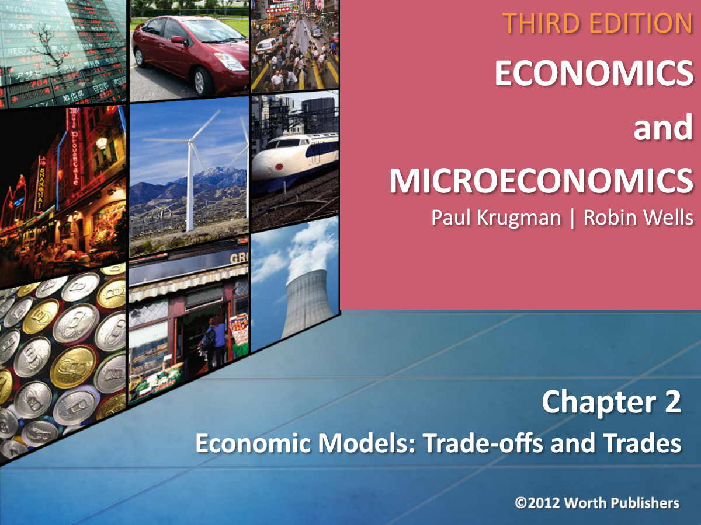

---

## 经济学中的模型 (Models in Economics)

> [!info] **定义：Economic Model**
> **模型 (Model)** 是对现实情境的简化表示，用于帮助我们更好地理解现实生活中的情况。

经济学家使用模型的方式包括：

- **创建一个真实但简化的经济体**——例如，研究香烟在二战战俘营中如何充当货币
- **在计算机上模拟经济体**——例如，税收模型、货币模型以及其他计算模拟

在使用模型时，经济学家力求将经济学尽可能地视为一门实验科学——**一次只允许一个变量发生变化**。这一点由一个至关重要的假设来体现：

 >[!info] **"其他条件不变"假设 (The "Other Things Equal" Assumption / Ceteris Paribus)**
> 在我们分析某一因素变化所带来的影响时，所有其他相关因素均保持不变。这一假设使我们能够将因果关系孤立出来进行分析。

> [!tip] **类比 (Analogy)**
> 正如**地图**是对世界的一种简化表示，帮助我们理解地理一样，**经济模型**也是一种简化表示，帮助我们理解现实世界的经济问题。

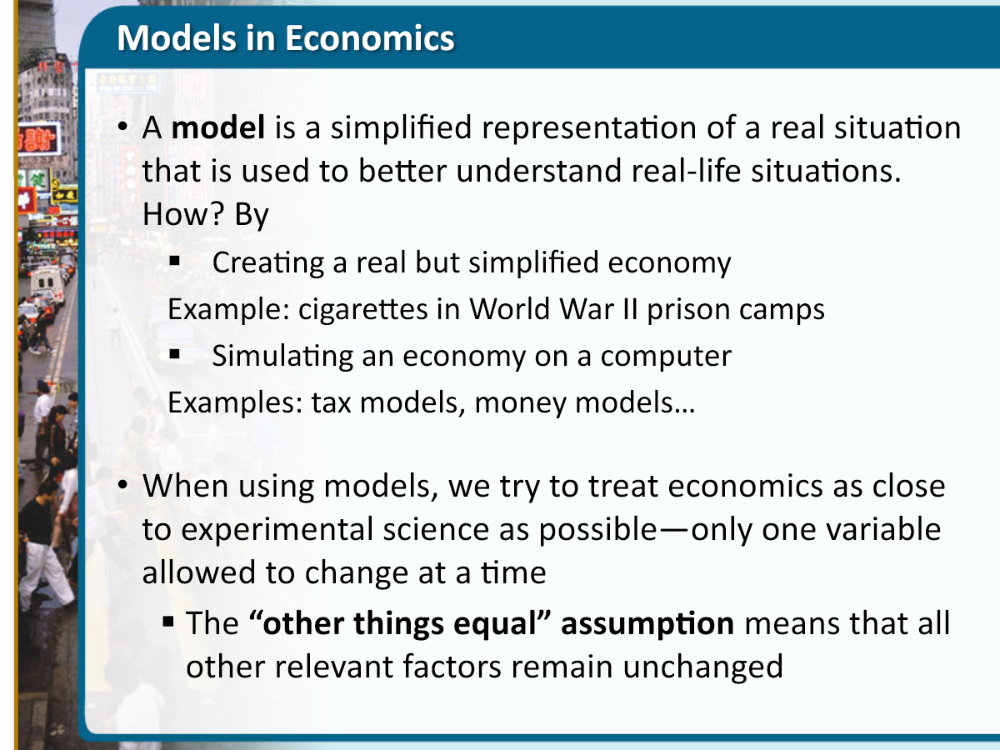

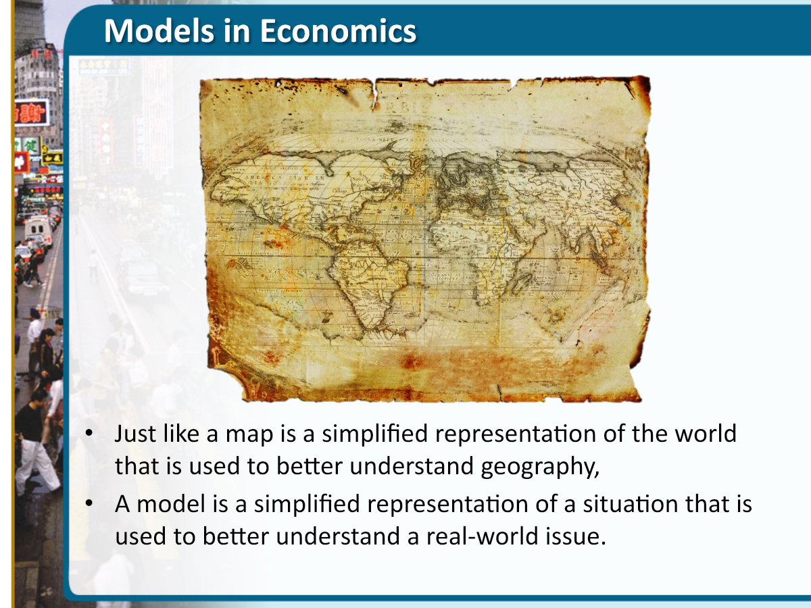

---

## 权衡取舍：生产可能性边界 (Trade-offs: The Production Possibility Frontier, PPF)

> [!info] **定义：Production Possibility Frontier (PPF)**
> **生产可能性边界 (Production Possibility Frontier, PPF)** 描绘了一个只生产两种商品的经济体所面临的权衡取舍。它展示了**在给定另一种商品产量的前提下，一种商品所能生产的最大数量**。

PPF 通过以下方式帮助我们更好地理解权衡取舍：
1. 考虑一个**只生产两种商品的简化经济体**
2. 用**图形**的方式展示这种权衡取舍

PPF 模型有助于回答以下关键问题：
- 我们能生产**多少**？
- 增加某种商品的生产会给我们带来**什么代价**？
- **是否值得从其他地方进口**该商品？

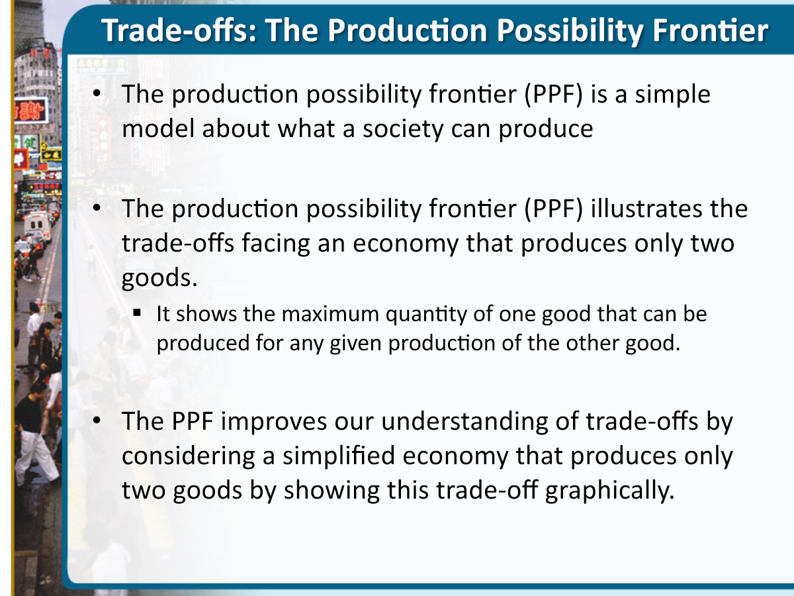

### 理解 PPF 图形 (Understanding the PPF Graph)

> [!note] **解读 PPF（图 2.1）**
> PPF 描绘了一个生产两种商品的经济体所面临的权衡取舍。以 Boeing 为例：
> - Boeing 能够生产的 **Dreamliners** 的最大数量取决于它制造的**小型喷气式飞机 (small jets)** 的数量，反之亦然。
> - **可行的生产区域**由曲线*内部或曲线上*的面积表示。
> - **点 C** → 可行但**没有效率**（资源未充分利用）
> - **点 A 和点 B** → 可行且**在生产上是有效率的 (efficient in production)**
> - **点 D** → 在给定的资源和技术条件下**不可行**

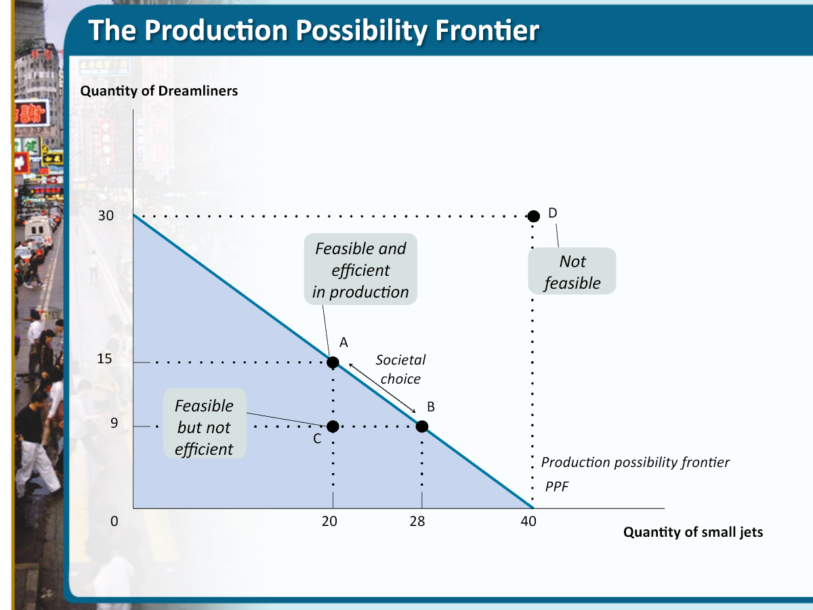

---

## 机会成本 (Opportunity Cost)

> [!info] **定义：Opportunity Cost**
> **机会成本 (Opportunity Cost)** 是为了获得某样商品而必须放弃的东西。

### Boeing 的生产可能性表 (Production Possibilities Schedule for Boeing)

| Dreamliners | Small Jets |
|:-----------:|:----------:|
| 30 | 0 |
| 15 | 20 |
| 14.25 | 21 |
| 13.5 | 22 |
| 12.75 | 23 |
| 12 | 24 |
| 9 | 28 |
| 0 | 40 |

从表中可以看出：
- **每架 Dreamliner** 的机会成本是 **1⅓ 架 small jets**
- **每架 Small Jet** 的机会成本是 **¾ 架 Dreamliner**

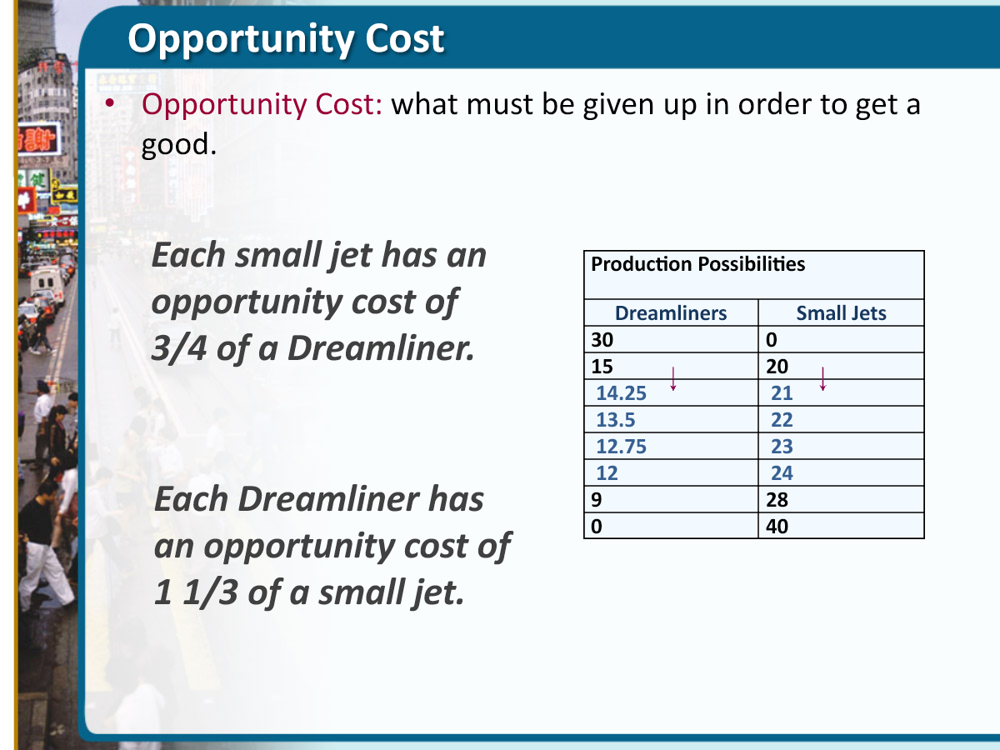

### 递增的机会成本 (Increasing Opportunity Cost)

> [!info] **Increasing Opportunity Cost**
> 随着某种商品的产量越来越大，**多生产一单位该商品的机会成本也随之增加**。这是因为越来越不合适的资源被重新配置去生产该商品。

PPF 的**向外凸出的形状 (bowed-out shape)** 反映了这种递增的机会成本：

> [!note] **解读图 2.2**
> - 要生产**前 20 架 small jets**，Boeing 必须放弃 **5 架 Dreamliners**（相对便宜）
> - 要再生产**额外的 20 架 small jets**，Boeing 必须再放弃 **25 架 Dreamliners**（代价大得多）
>
> 出现这种情况的原因是，最适合生产 Dreamliners 的资源被逐步转移去制造 small jets——每多生产一架 small jet，所放弃的 Dreamliners 数量就越多。

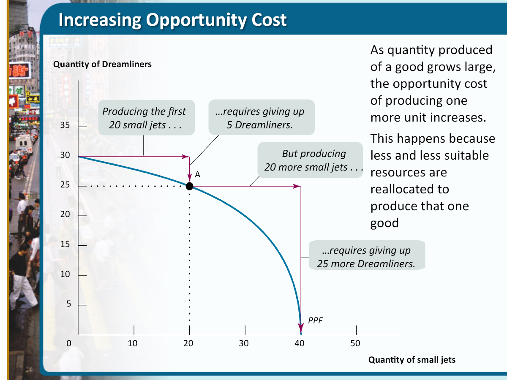

### 经济增长与 PPF (Economic Growth and the PPF)

> [!info] **Economic Growth**
> **经济增长 (Economic Growth)** 导致 **PPF 向外移动**，因为生产可能性得到了扩展。经济体现在可以生产更多的每一种商品。

> [!note] **解读图 2.3**
> 如果生产最初位于**点 A**（20 架 small jets 和 25 架 Dreamliners），在经济增长之后，它可以移动到**点 E**（25 架 small jets 和 30 架 Dreamliners）——*两种*商品都更多了。

经济增长有两个基本来源：
1. **生产要素 (factors of production) 的增加**——即土地 (land)、劳动 (labor)、资本 (capital) 和人力资本 (human capital) 等资源
2. **技术的进步 (improved technology)**

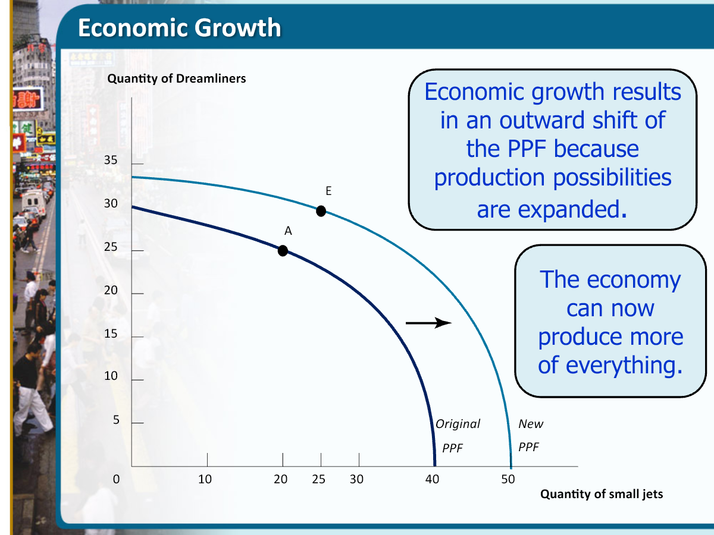

---

## 比较优势与贸易收益 (Comparative Advantage and Gains from Trade)

### 两个国家的生产可能性 (Production Possibilities for Two Countries)

让我们考虑两个国家：**美国 (United States)** 和 **巴西 (Brazil)**。每个国家都有一条**直线型的 PPF**（即不变的机会成本）。

> [!note] **美国的 PPF（图 2.4，左图）**
> 对美国而言，每架 small jet 的机会成本始终是 **¾ 架 large jet**。

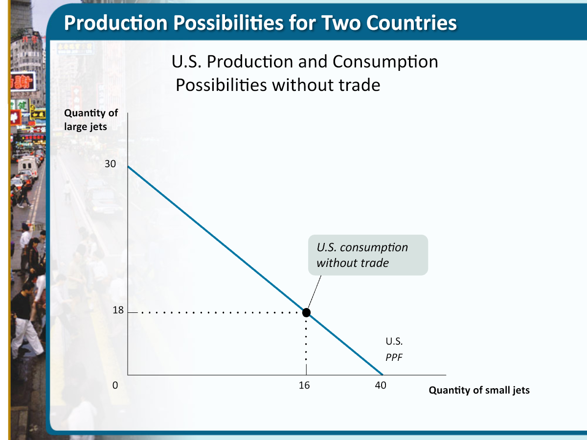

> [!note] **巴西的 PPF（图 2.4，右图）**
> 对巴西而言，每架 small jet 的机会成本始终是 **⅓ 架 large jet**。

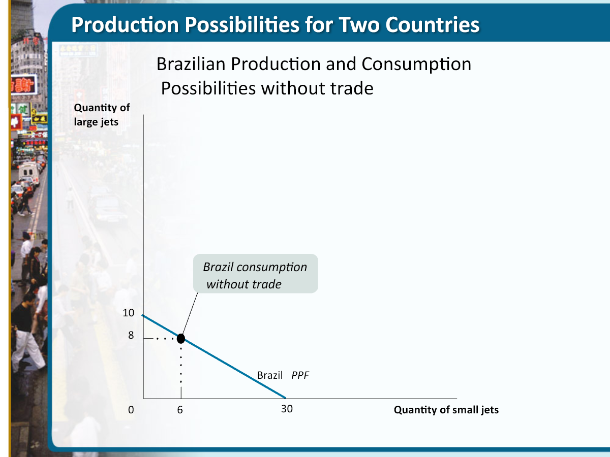

### 比较机会成本 (Comparing Opportunity Costs)

| | 美国的机会成本 (U.S. Opportunity Cost) | | 巴西的机会成本 (Brazilian Opportunity Cost) |
|:---|:---:|:---:|:---|
| **一架 small jet** | ¾ 架 large jet | **>** | ⅓ 架 large jet |
| **一架 large jet** | ⁴⁄₃ 架 small jets | **<** | 3 架 small jets |

巴西生产 small jets 的**机会成本更低**（⅓ vs. ¾ 架 large jet）。美国生产 large jets 的**机会成本更低**（⁴⁄₃ vs. 3 架 small jets）。

> [!info] **Comparative Advantage**
> 如果一个国家在生产某种商品时拥有**最低的机会成本**，那么该国在该商品的生产上具有**比较优势 (Comparative Advantage)**。

**当两个国家各自专门生产自己具有比较优势的商品，然后进行贸易时，双方都会变得更好：**
- **巴西**应当为两个国家制造 small jets → 它的机会成本仅为 ⅓ 架 large jet（而美国为 ¾ 架）
- **美国**应当为两个国家制造 large jets → 它的机会成本仅为 ⁴⁄₃ 架 small jets（而巴西为 3 架）

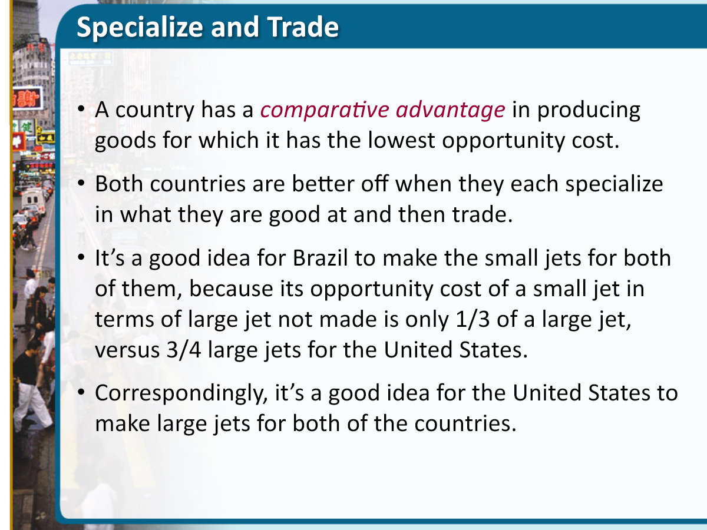

### 可视化贸易收益 (Visualizing Gains from Trade)

> [!note] **图 2.5：Comparative Advantage 与贸易收益**
> 通过专业化分工和贸易，两个国家可以生产**并消费**更多的两种商品：
> - 巴西专门生产 small jets（其比较优势所在）
> - 美国专门生产 large jets（其比较优势所在）
> - **结果：** 每个国家都可以比不进行贸易时消费更多的两种商品。

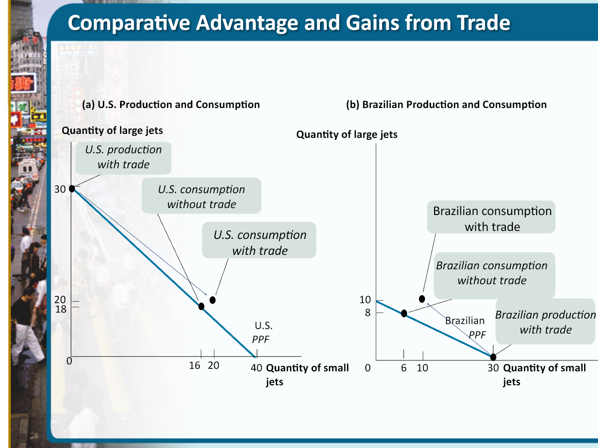

### 量化贸易收益 (Quantifying the Gains)

美国和巴西都从贸易中获得了收益：
- **美国的消费**：large jets 增加了 **2** 架，small jets 增加了 **4** 架
- **巴西的消费**：large jets 增加了 **2** 架，small jets 增加了 **4** 架

美国在生产 large jets 方面具有**比较优势 (comparative advantage)**，在生产 small jets 方面具有**比较劣势 (comparative disadvantage)**。

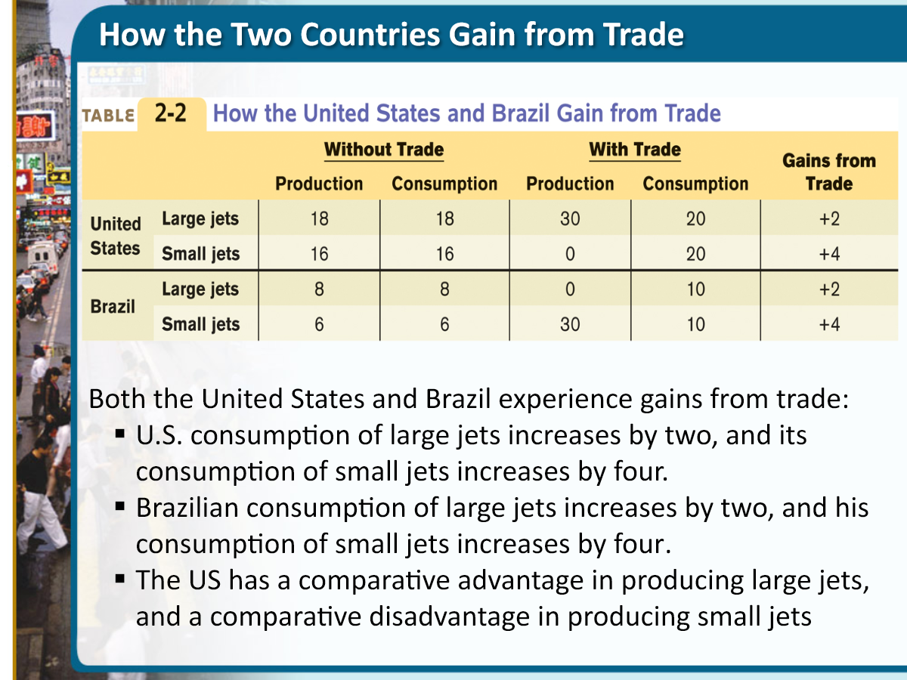

### 比较优势 vs. 绝对优势 (Comparative vs. Absolute Advantage)

> [!warning] **不要混淆 Comparative Advantage 和 Absolute Advantage！**
> 这是经济学中最常见的错误之一。

> [!info] **Absolute Advantage**
> 如果一个人（或国家）在某项活动中能够比别人做得更好——用同样的资源生产出更多的产出——那么他（或该国）就具有**绝对优势 (Absolute Advantage)**。

> [!info] **Comparative Advantage**
> 如果一个人（或国家）生产某种商品的**机会成本**比别人**更低**，那么他（或该国）就具有**比较优势 (Comparative Advantage)**。

**关键洞察：** 仅仅因为美国在*两种*商品上都能生产得更多（即在两种商品上都具有绝对优势），并不意味着我们不进行贸易会更好。要关注**机会成本**：既然巴西生产 small jets 的成本更低，美国*将会从*从巴西进口 small jets 中获益。

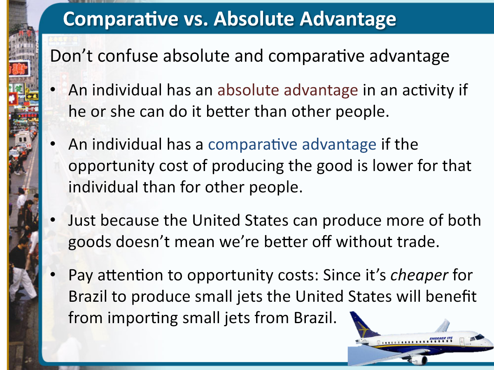

---

## 课堂练习：检验你的理解 (Class Exercise: Check Your Understanding)

> [!question] **练习题 (Practice Problem)**
> 假设在澳大利亚，一个工人收获 10 公斤苹果需要 **2 小时**，收获 10 公斤西红柿需要 **4 小时**。假设在巴西，一个工人收获 10 公斤苹果需要 **4 小时**，收获 10 公斤西红柿需要 **5 小时**。
>
> **以下哪个陈述是正确的？**
> - A. 巴西在生产西红柿方面具有比较优势
> - B. 巴西在生产苹果方面具有比较优势
> - C. 巴西在两种商品的生产上都具有绝对优势
> - D. 在这两个国家之间的贸易中，澳大利亚会获益而巴西会受损

> [!success] **答案：A — 巴西在生产西红柿方面具有比较优势。**
>
> **逐步解析：**
> 1. 在**澳大利亚**，收获 10 蒲式耳西红柿的机会成本是 **20 蒲式耳苹果**（西红柿 4 小时 ÷ 苹果 2 小时 = 2 倍时间 → 2 × 10 = 放弃 20 个苹果）
> 2. 在**巴西**，收获 10 蒲式耳西红柿的机会成本是 **12.5 蒲式耳苹果**（西红柿 5 小时 ÷ 苹果 4 小时 = 1.25 倍时间 → 1.25 × 10 = 放弃 12.5 个苹果）
> 3. **澳大利亚**在两种商品上都具有*绝对优势*（每种商品所需时间都更少），但在种植西红柿方面也表现出*更高的机会成本*（20 vs. 12.5 个苹果）
> 4. 因此，**巴西**在西红柿方面具有**比较优势**（机会成本更低）

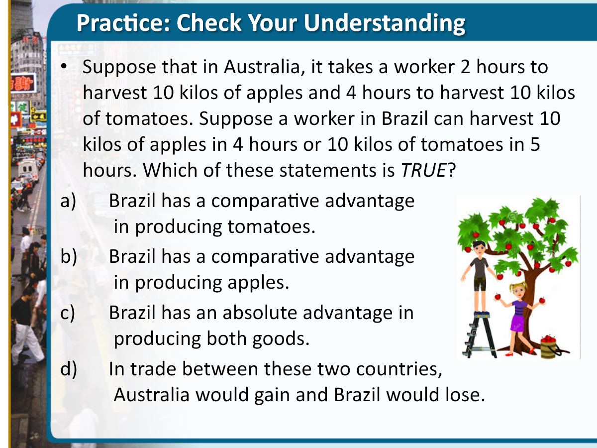

---

## 交易：循环流向图 (Transactions: The Circular-Flow Diagram)

> [!info] **The Circular-Flow Diagram**
> **循环流向图 (Circular-Flow Diagram)** 是对经济体中生产与交易的一种图示化表达。实物（商品、服务、劳动、原材料）的流动沿着**一个方向**进行，而用于支付这些实物的**货币**则沿着**相反的方向**流动。

### 逐步构建循环流向图 (Building the Circular-Flow, Piece by Piece)

循环流向图将两个关键的经济主体联系起来：

> [!info] **Households**
> **家庭 (Household)** 是一个人或一群共享收入的人。

> [!info] **Firms**
> **企业 (Firm)** 是生产商品和服务以供出售的组织。

**家庭 (Households)：**
- 拥有**生产要素 (factors of production)**
- 将其出租给企业以获取**收入**
- 使用收入来**购买和消费**商品和服务

**企业 (Firms)：**
- **雇用**生产要素
- 使用它们来**生产**商品和服务
- **出售**商品和服务以获得资金来支付家庭

### 两个关键市场 (Two Key Markets)

1. **商品与服务市场 (Markets for Goods and Services)**——企业将其生产的商品和服务出售给家庭
2. **要素市场 (Factor Markets)**——企业购买其生产所需的资源（即生产要素）

> [!important] **为什么 Factor Markets 很重要**
> 要素市场决定了经济体的**收入如何分配 (income is distributed)**——即生产成果如何在各种生产要素的所有者之间进行划分。

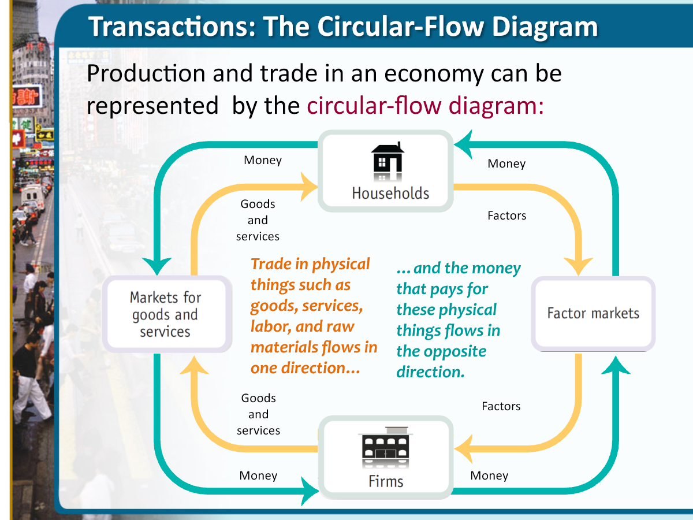

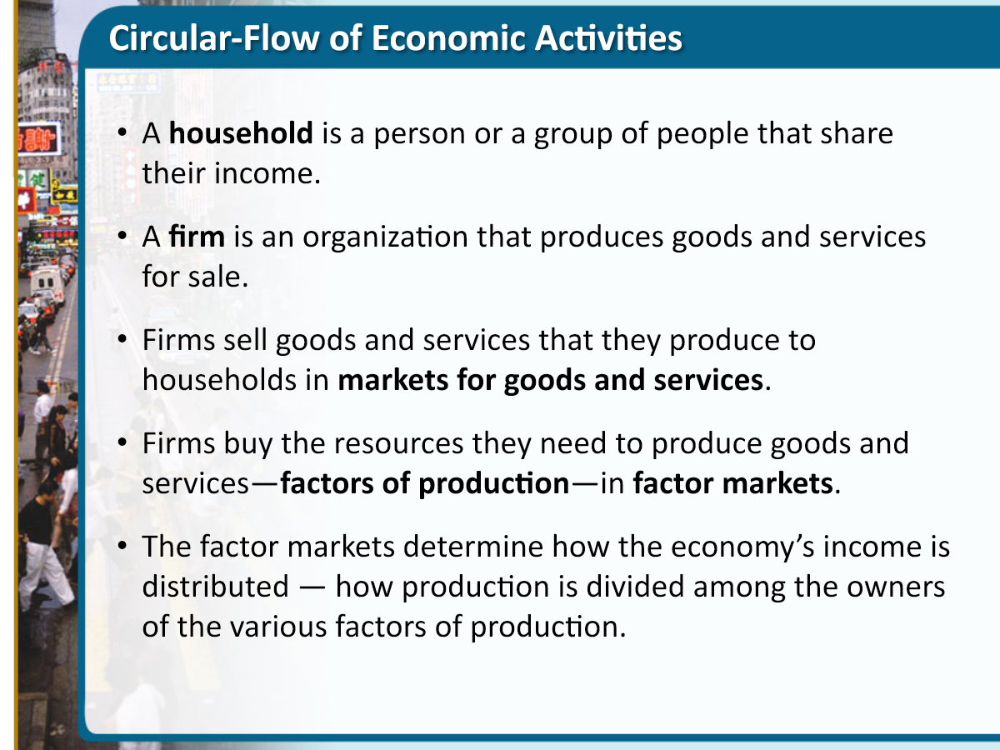

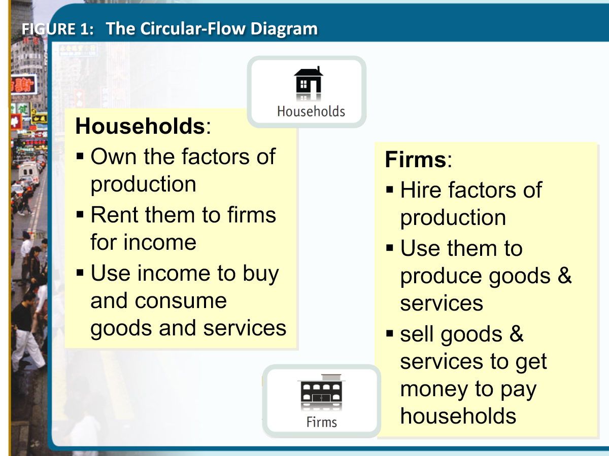

---

## 使用模型：实证经济学与规范经济学 (Using Models: Positive vs. Normative Economics)

> [!info] **Positive Economics**
> **实证经济学 (Positive Economics)** 是描述经济体**实际如何运作**的经济分析分支。
>
> - **预测 (Forecast)** 是对未来的简单预言，属于实证经济学的范畴。
> - **示例：** "如果政府对这个市场增税，生产数量将会下降。"

> [!info] **Normative Economics**
> **规范经济学 (Normative Economics)** 对经济体**应该如何运作**做出**规范性建议 (prescriptions)**。
>
> - **示例：** "政府在关注经济增长的同时，也应该同样关注环境退化问题。"

> [!important] **关键区别 (Key Distinction)**
> 经济学家可以为**实证性问题**找到**正确答案**，但对于涉及**价值判断 (value judgments)** 的**规范性问题**，通常无法做到这一点。

### 快速判断：实证还是规范？(Quick Check: Positive or Normative?)

| 陈述 (Statement) | 类型 (Type) |
|:---|:---|
| 超过 60% 的女性参与劳动力市场 | **实证 (Positive)** |
| 应该实施租金管制法，因为它们有助于实现住房的公平或公正 | **规范 (Normative)** |
| 社会应该采取措施终结枪支暴力 | **规范 (Normative)** |
| 吸烟者将增加的医疗成本转嫁给了整个社会 | **实证 (Positive)** |
| 单身母亲陷入贫困的可能性是已婚母亲的两倍以上 | **实证 (Positive)** |

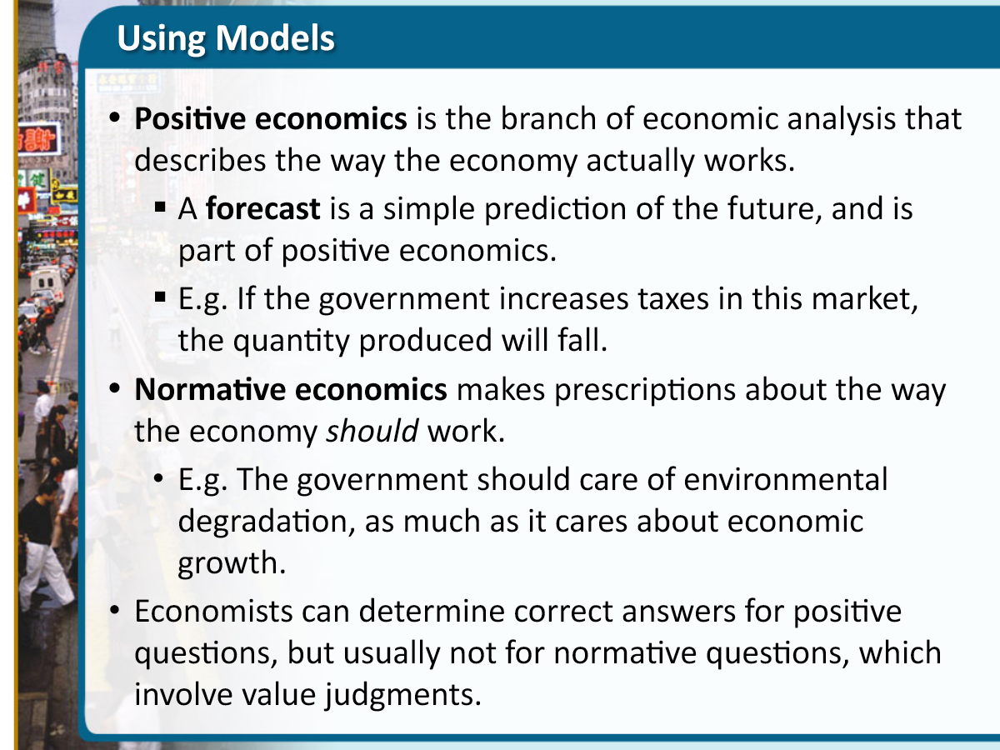

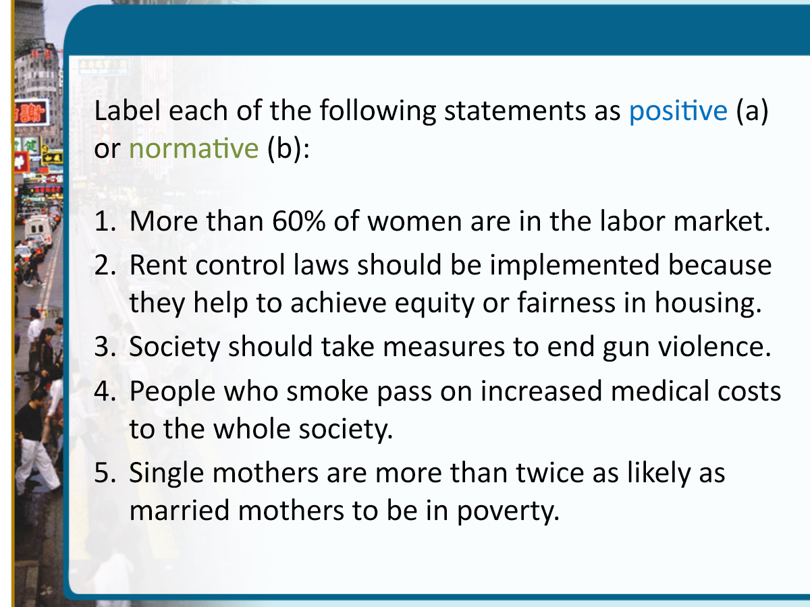

---

## 经济学家何时以及为何产生分歧 (When and Why Economists Disagree)

报纸往往倾向于**夸大**经济学家之间观点的差异。经济学家之间存在合法分歧的主要原因有两个：

### 1. 关于模型的分歧 (Disagreement about Models)
- 经济建模需要进行**简化假设 (simplifying assumptions)**
- 两位经济学家可以合理地就**哪些模型和简化方式更为恰当**产生分歧
- 在大多数情况下，这类争议**最终会得到解决**（尽管可能需要很长时间）

### 2. 关于价值观的分歧 (Disagreement about Values)
- 经济学家可能会就哪个更重要产生分歧：**收入不平等 (income inequality)** 还是**收入增长 (income growth)**
- 经济学常常**与政治纠缠在一起**
- 强大的利益集团会寻找并推广那些给出支持性意见的经济学家

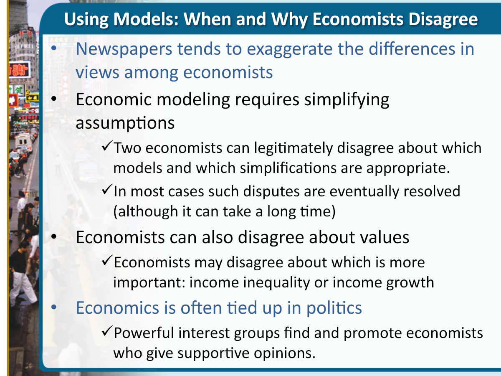

---

## 本章总结 (Chapter Summary)

### 1. 经济学中的模型 (Models in Economics)
几乎所有的经济学都建立在**模型**之上。经济模型中一个重要的假设是**"其他条件不变"假设 (the "other things equal" assumption / ceteris paribus)**，它允许我们在保持所有其他相关因素不变的情况下，分析某一因素变化所带来的影响。

### 2. 生产可能性边界 (The Production Possibility Frontier, PPF)
一个重要的经济模型是**生产可能性边界 (production possibility frontier)**。它说明了：
- **机会成本 (Opportunity cost)**——必须放弃的东西
- **效率 (Efficiency)**——在边界上生产 vs. 在边界内部生产
- **经济增长 (Economic growth)**——PPF 向外移动

经济增长有两个基本来源：
- **生产要素 (factors of production)** 的增加（土地、劳动、资本、人力资本）
- **技术的进步 (improved technology)**

### 3. 比较优势与贸易收益 (Comparative Advantage and Gains from Trade)
另一个重要模型是**比较优势 (comparative advantage)**，它解释了个人和国家之间贸易收益的来源。每个人在某种事物上都具有比较优势。

> [!warning] 这常常与**绝对优势 (absolute advantage)** 混淆——后者是指比任何人都更好地生产某种商品或服务的能力。关键在于**机会成本**，而非绝对的生产率。

### 4. 循环流向图 (The Circular-Flow Diagram)
在最简单的经济体中，人们进行**物物交换 (barter)**，即用商品和服务直接相互交换——而不是像现代经济体那样用货币进行交易。**循环流向图 (circular-flow diagram)** 将经济体内部的交易表示为家庭与企业之间商品、服务和货币的流动。这些交易发生在以下市场：
- **商品与服务市场 (markets for goods and services)**
- **要素市场 (factor markets)**

### 5. 实证经济学与规范经济学 (Positive vs. Normative Economics)
经济学家将经济模型用于：
- **实证经济学 (Positive economics)**，描述经济体*实际上如何运作*（通常涉及做出预测）
- **规范经济学 (Normative economics)**，规定经济体*应该如何运作*（涉及价值判断）

经济学家可以为实证性问题找到正确答案，但通常无法为规范性问题做到这一点。

### 6. 经济学家为何产生分歧 (Why Economists Disagree)
1. 他们可能就**在模型中采用哪些简化方式**产生分歧
2. 他们可能——和所有人一样——就**价值观**产生分歧

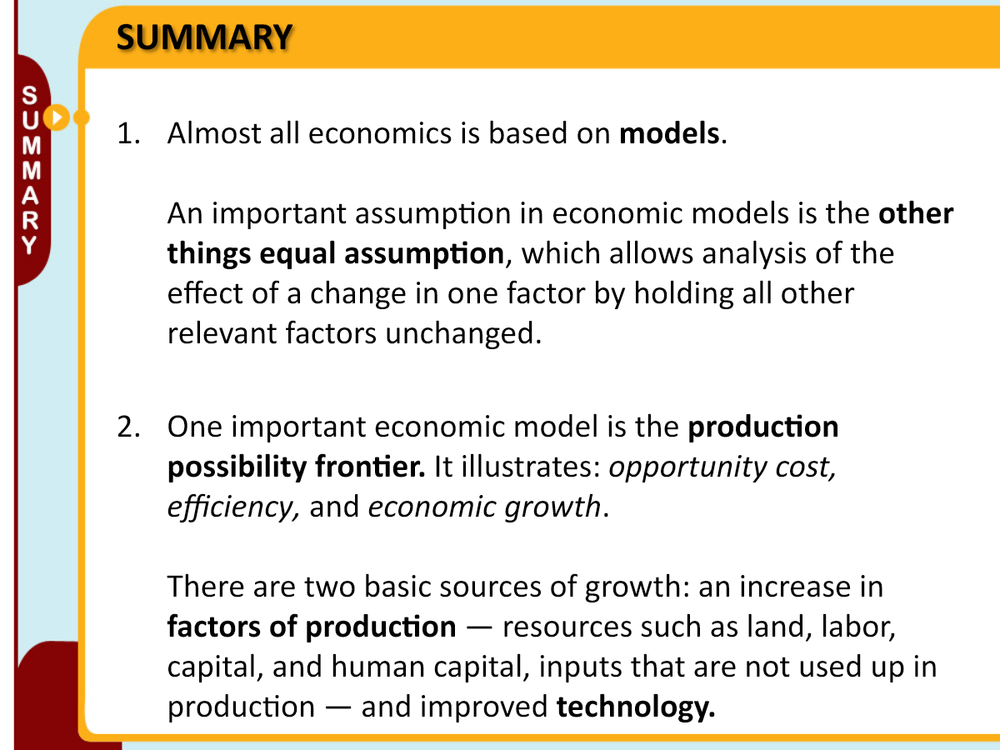

---

## 关键术语 (Key Terms)

| 术语 (Term) | 定义 (Definition) |
|:---|:---|
| **Model** | 对现实情境的简化表示，用于理解现实生活中的情况 |
| **Other things equal assumption** | 在分析某一变量时，所有其他相关因素均保持不变 (ceteris paribus) |
| **Production possibility frontier (PPF)** | 一张图，展示在给定另一种商品产量的前提下，一种商品所能生产的最大数量 |
| **Factors of production** | 用于生产商品和服务的资源（土地、劳动、资本、人力资本） |
| **Technology** | 生产商品和服务的技术手段 |
| **Comparative advantage** | 生产者因生产某种商品的机会成本最低而持有的优势 |
| **Absolute advantage** | 比其他人更好（更有效率）地生产某种商品或服务的能力 |
| **Barter** | 直接用商品和服务相互交换 |
| **Circular-flow diagram** | 将交易表示为商品、服务和货币流动的图示化表达 |
| **Household** | 一个或一群共享收入的人 |
| **Firm** | 生产商品和服务以供出售的组织 |
| **Markets for goods and services** | 企业将商品和服务出售给家庭的市场 |
| **Factor markets** | 企业从家庭购买生产要素的市场 |
| **Income distribution** | 总收入如何在各种生产要素的所有者之间进行划分 |
| **Positive economics** | 描述经济体实际如何运作的经济分析 |
| **Normative economics** | 规定经济体应该如何运作的经济分析 |
| **Forecast** | 对未来的简单预测 |
| **Specialization** | 专注于生产自己具有比较优势的商品 |
| **Equilibrium** | 经济力量达到平衡的状态 |
| **Efficient** | 在给定可用资源的情况下生产出最大可能的产出 |
| **Equity** | 经济成果分配中的公平性 |

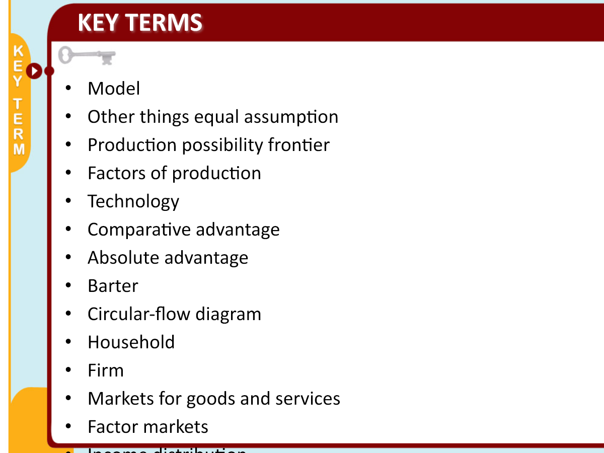
