# Monopolistic Competition and Product Differentiation

本章讨论一种介于完全竞争与垄断之间的市场结构：垄断竞争 (Monopolistic Competition)。它既有“竞争”的一面，即行业中存在许多企业、长期可以自由进入和退出；也有“垄断”的一面，即每家企业销售的产品并不完全相同，因此面对向下倾斜的需求曲线，并拥有一定的定价能力。

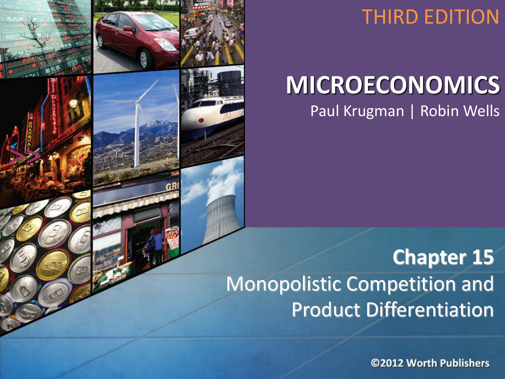
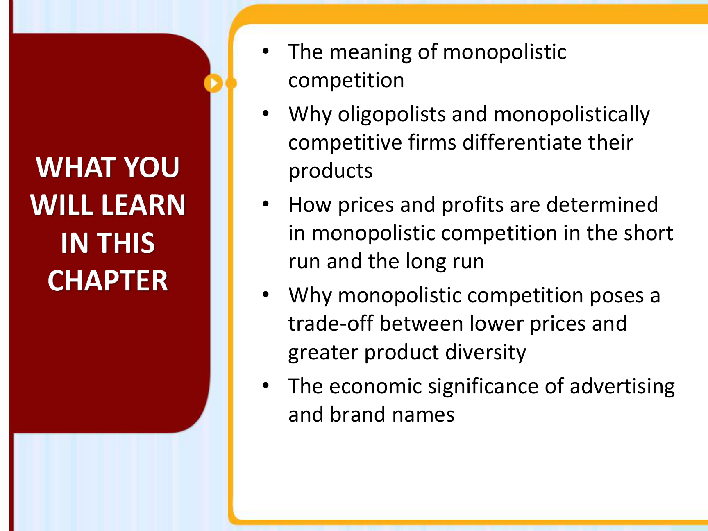

## 1. 四种市场结构与 Monopolistic Competition 的位置

市场结构可以按竞争强度从强到弱理解：完全竞争 (Perfect Competition) 位于竞争最强的一端，垄断 (Monopoly) 位于竞争最弱的一端；垄断竞争 (Monopolistic Competition) 和寡头 (Oligopoly) 则处在中间。垄断竞争通常是现实生活中最常见的市场结构，例如餐馆、咖啡店、理发店、服装品牌、加油站、快餐店等。

> [!info] 核心定义：垄断竞争 (Monopolistic Competition)
> Monopolistic Competition 是一种市场结构：行业中有许多相互竞争的生产者；每个生产者销售差异化产品 (Differentiated Product)；企业面对向下倾斜的需求曲线，因此不是价格接受者 (Price Taker)；长期存在自由进入和退出 (Free Entry and Exit)；长期均衡中企业获得零经济利润 (Zero Economic Profit)。

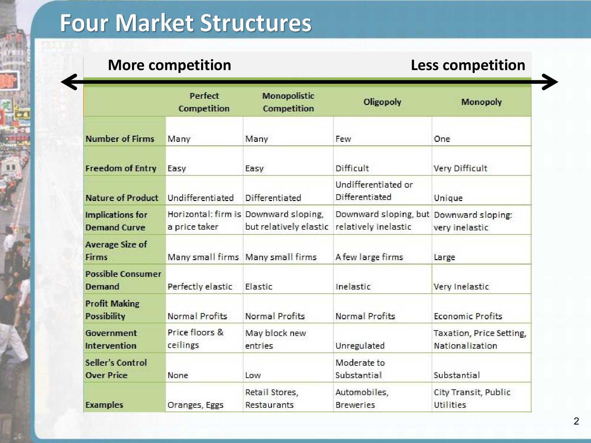
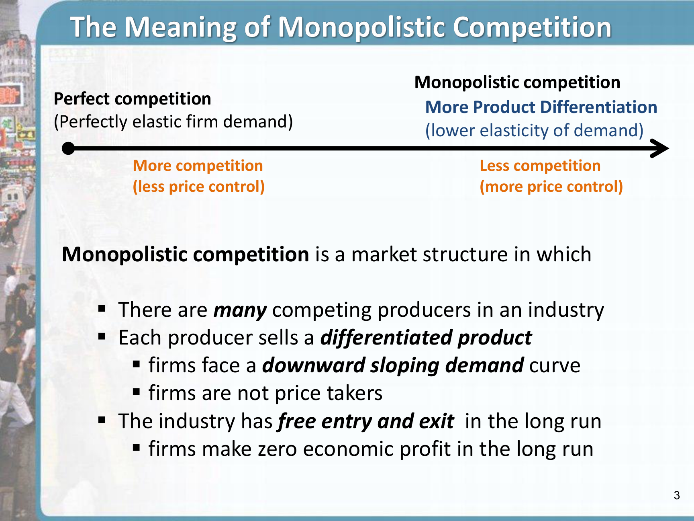

Monopolistic Competition 的关键不是企业完全没有竞争，而是每家企业通过产品差异化 (Product Differentiation) 让自己的产品“不完全等同于别人家的产品”。因此，消费者不会只根据价格选择商品，企业也就不必像完全竞争企业那样被动接受市场价格。

## 2. 产品差异化 (Product Differentiation)

> [!info] 核心定义：产品差异化 (Product Differentiation)
> Product Differentiation 指企业让自己的产品在消费者眼中不同于竞争者产品的过程。差异可以来自产品本身，也可以来自消费者的感知、位置便利性、品牌形象、质量层级或风格类型。

在 Oligopoly 中，Product Differentiation 可以降低竞争强度并帮助企业提高利润；但在 Monopolistic Competition 中，它更为关键。因为行业中企业数量很多，公开合谋 (Collusion) 或默契合作 (Tacit Cooperation) 几乎不可行，企业获得市场力量 (Market Power) 的主要方式就是让消费者认为自己的产品有独特性。

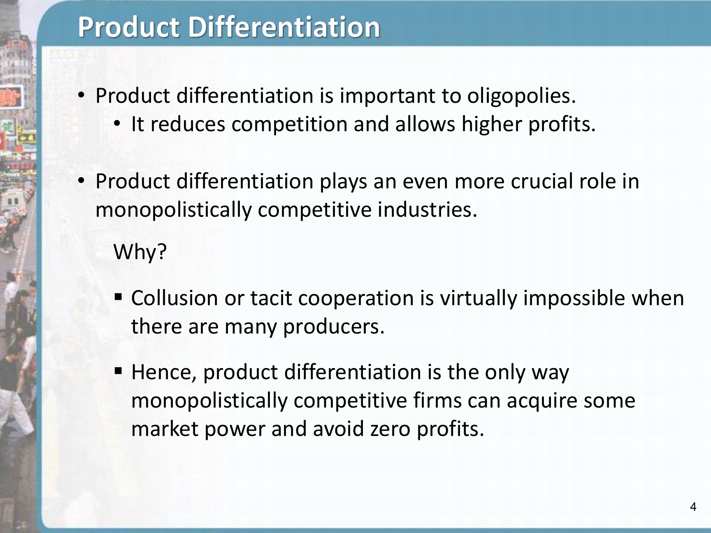
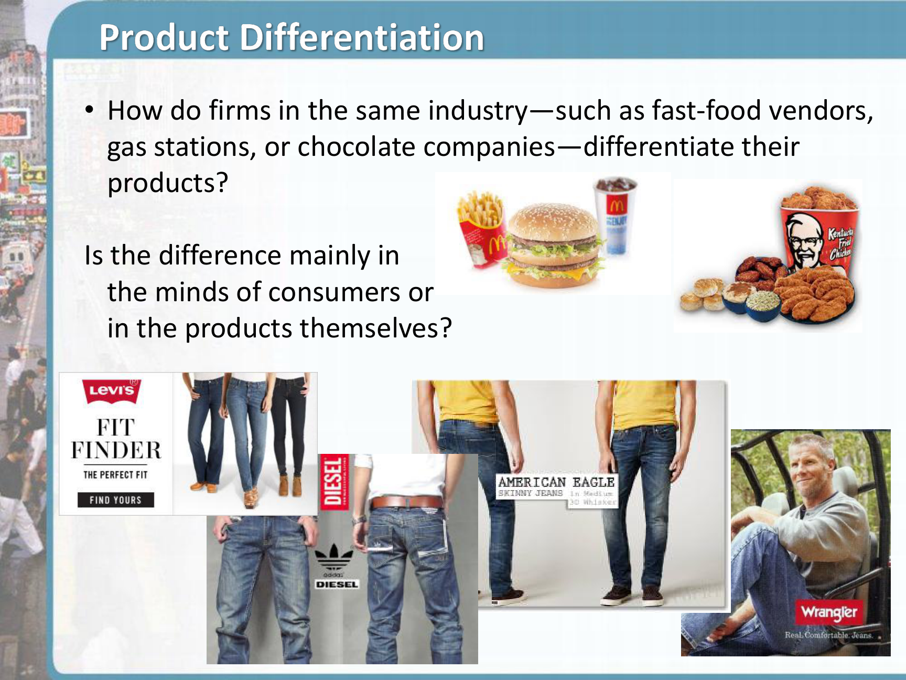

Product Differentiation 主要有三种形式：

| Form of Product Differentiation | 中文解释 | Example |
| --- | --- | --- |
| Differentiation by style or type | 按风格或类型区分 | sedans vs. SUVs |
| Differentiation by location | 按地理位置或便利性区分 | 离家近的 dry cleaner vs. 远但便宜的 dry cleaner |
| Differentiation by quality | 按质量层级区分 | ordinary chocolate vs. gourmet chocolate |

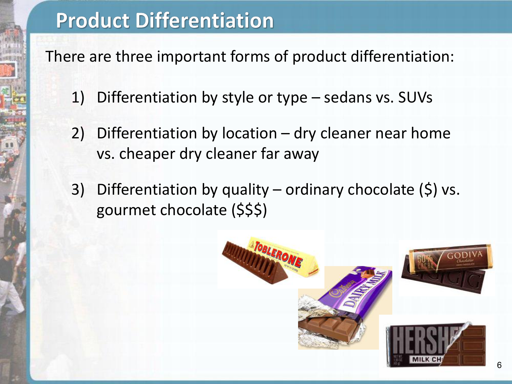

产品差异化行业有两个同时存在的特征。第一，卖方之间仍然竞争同一批消费者，因此新企业进入会减少既有企业在任何给定价格下能卖出的数量。第二，消费者从多样性 (Diversity) 中获得价值：即使价格更高，更多选择也可能提高消费者福利。

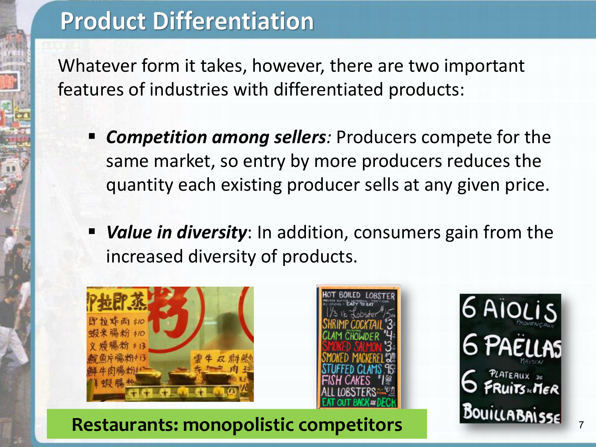

### Ford 与 GM 的案例：规模经济与多样性的冲突

Henry Ford 的早期策略是只提供单一车型和颜色，从而最大化规模经济 (Economies of Scale)，大幅降低汽车生产成本。1913 年移动装配线 (Moving Assembly Line) 让汽车变得更便宜，Ford 一度占据市场优势。但 Alfred P. Sloan 领导的 General Motors (GM) 选择提供多种车型、质量和价格层级。到 1930s，市场给出的答案很清楚：消费者愿意为多样化风格付费。

这个案例说明，最低成本并不总是消费者唯一关心的目标。Monopolistic Competition 的福利评价必须同时考虑成本效率与产品多样性。

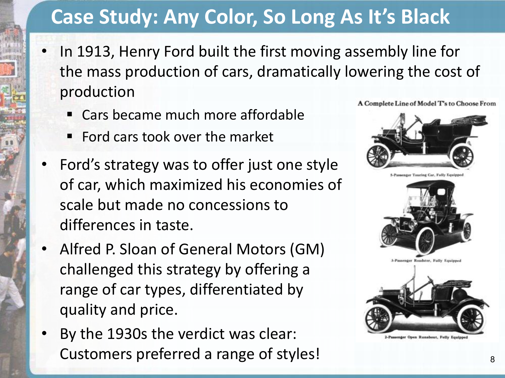

> [!question] 思考题
> 同一行业中的快餐店、加油站或巧克力品牌究竟是在产品本身上不同，还是主要在消费者心智中不同？经济学分析不要求二者只能选其一；只要差异影响需求弹性和消费者选择，它就会影响企业定价能力。

## 3. Monopolistic Competition 的短期均衡 (Short-Run Equilibrium)

Monopolistic Competition 这个名字本身就揭示了它的双重性质。一方面，每个企业销售独特产品，所以像垄断者一样面对向下倾斜的需求曲线 (Downward-Sloping Demand Curve)，具有有限的定价能力；另一方面，它又不像纯粹垄断者，因为行业中还有许多替代品，企业销量取决于其他企业的价格和产品选择。

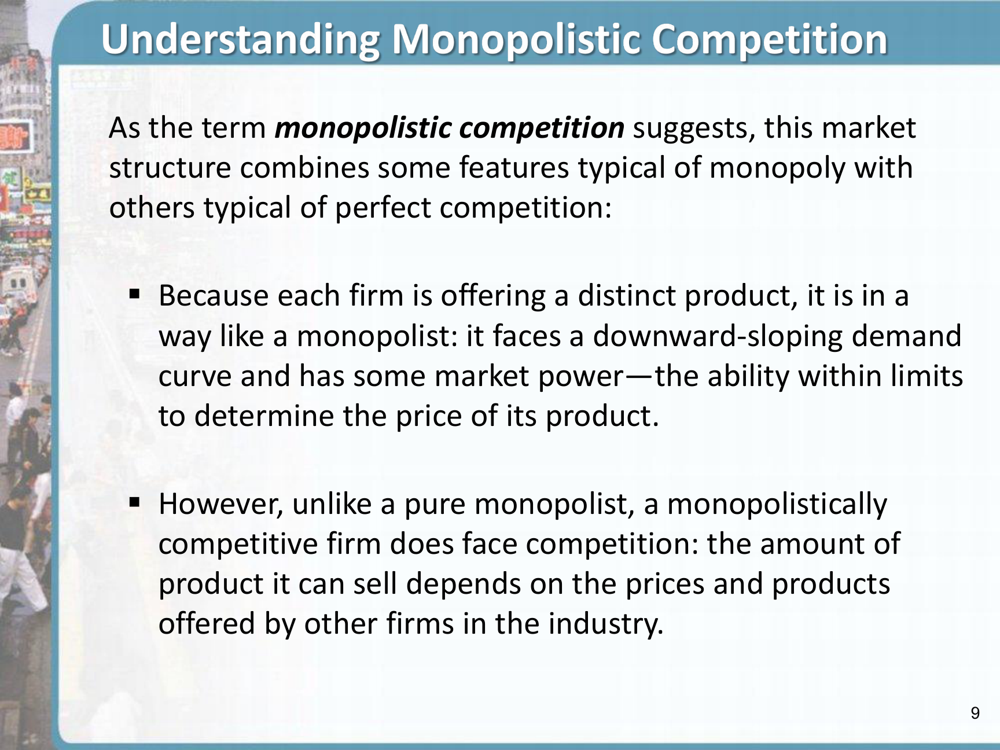

短期中，垄断竞争企业与垄断企业使用相同的利润最大化逻辑：选择边际收益等于边际成本的产量，即 MR = MC。由于需求曲线向下倾斜，边际收益 (Marginal Revenue, MR) 低于价格 (Price, P)，所以企业先在 MR = MC 处找到产量，再回到需求曲线上决定价格。

> [!warning] 考点：短期决策规则
> Monopolistically Competitive Firm 的短期利润最大化条件是 MR = MC。价格不是在 MC 曲线上读出，而是在对应产量的 Demand Curve 上读出。若 P > ATC，企业获得 Profit；若 P < ATC，企业承受 Loss，但只要继续生产比停产损失更小，就会选择亏损经营。

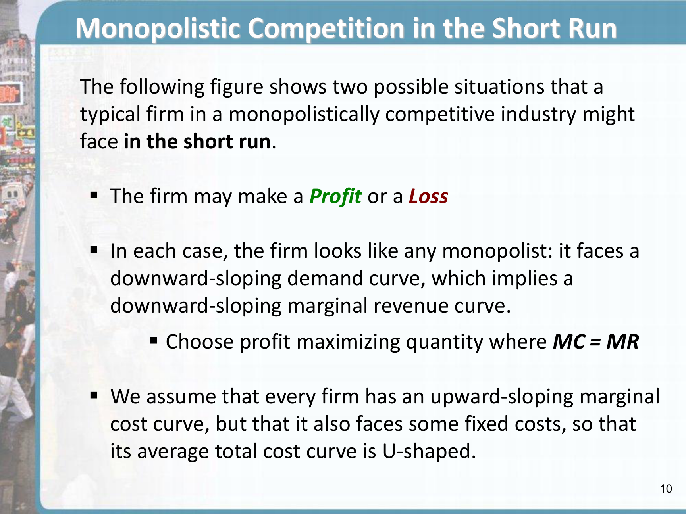
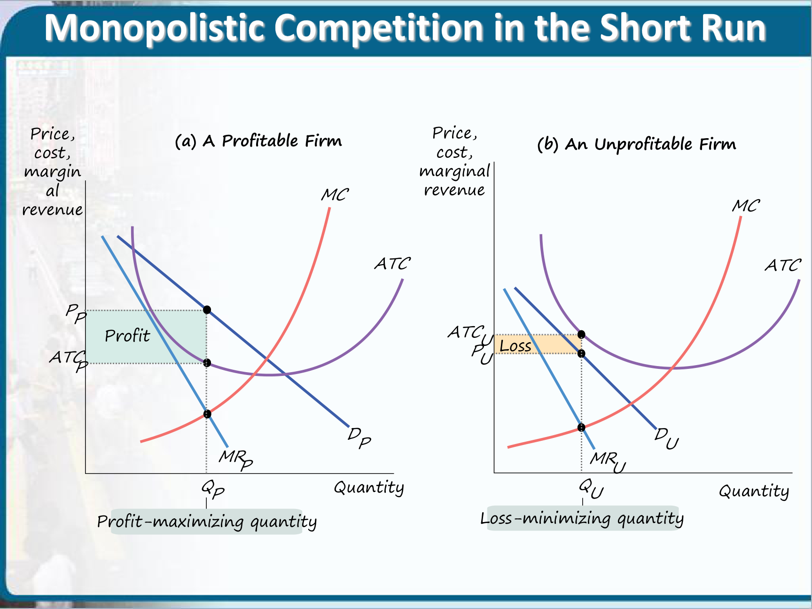
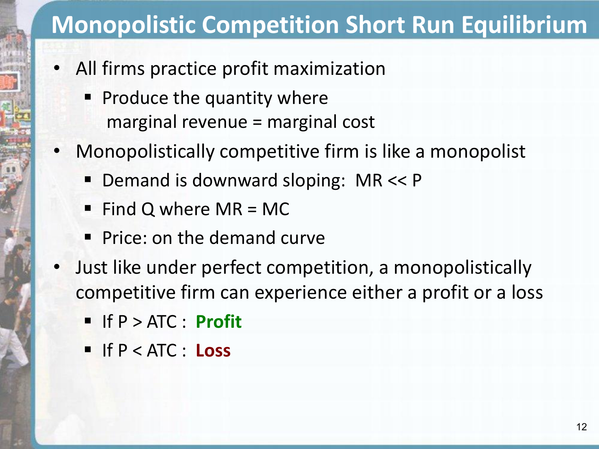

| Short-Run Outcome   | Condition             | Economic Meaning            |
| ------------------- | --------------------- | --------------------------- |
| Profit              | P > ATC               | 价格高于平均总成本，绿色利润矩形表示正经济利润     |
| Loss                | P < ATC               | 价格低于平均总成本，企业亏损但仍可能通过生产最小化损失 |
| Profit Maximization | MR = MC               | 企业选择使利润最大的产量                |
| Pricing             | Price on Demand Curve | 给定产量后，根据需求曲线确定消费者愿意支付的价格    |

## 4. 长期均衡：零利润均衡 (Zero-Profit Equilibrium)

长期中，自由进入和退出会消除短期利润或亏损。如果典型企业获得正经济利润，新企业会进入行业，既有企业的需求曲线和边际收益曲线向左移动，因为消费者被更多替代品分流；这会降低既有企业销量、价格和利润。相反，如果典型企业亏损，一些企业退出，剩余企业的需求曲线和边际收益曲线向右移动，亏损逐渐缩小。

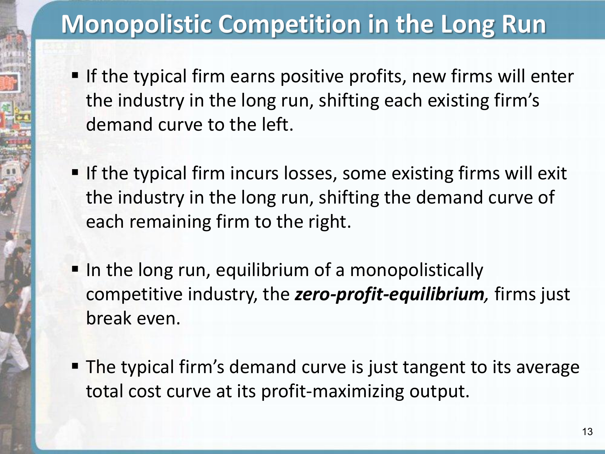
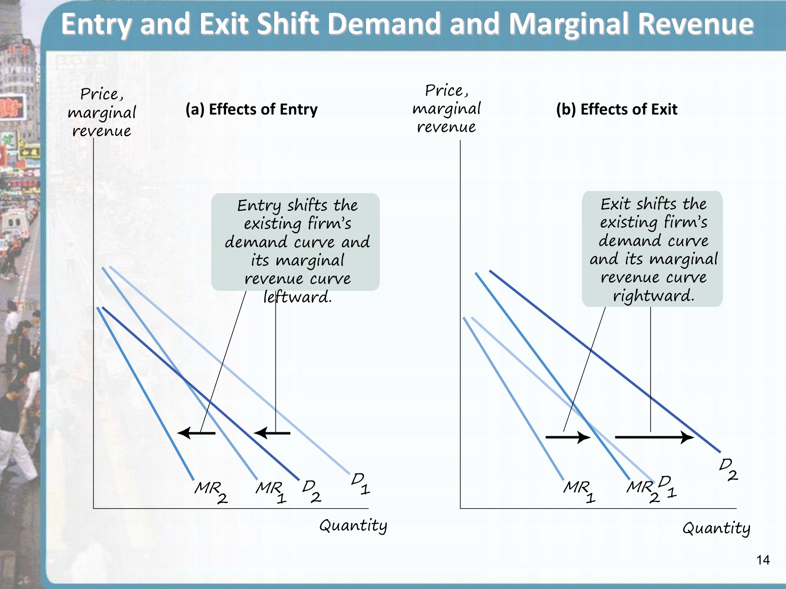
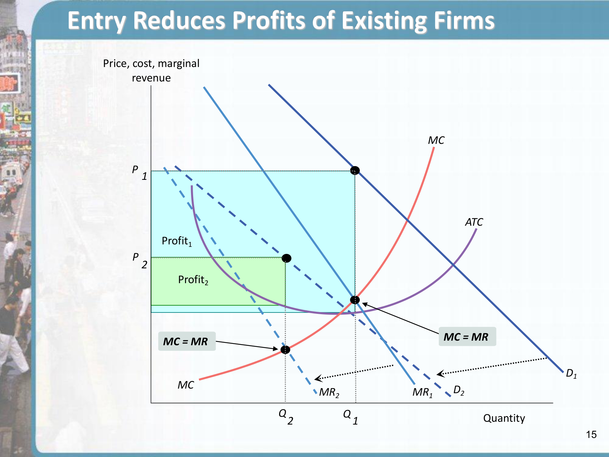

> [!info] 核心定义：零利润均衡 (Zero-Profit Equilibrium)
> Zero-Profit Equilibrium 是 Monopolistic Competition 的长期均衡状态：进入和退出停止，每家企业在利润最大化产量处刚好收支相抵，Price = Average Total Cost (ATC)，企业获得零经济利润。

在长期零利润均衡中，每家企业的需求曲线与平均总成本曲线 (Average Total Cost, ATC) 在利润最大化产量处相切 (Tangency)。这意味着企业像垄断者一样仍有向下倾斜的需求曲线，但又无法长期保留垄断利润。因此可以把垄断竞争企业理解为“没有长期垄断利润的垄断者”。

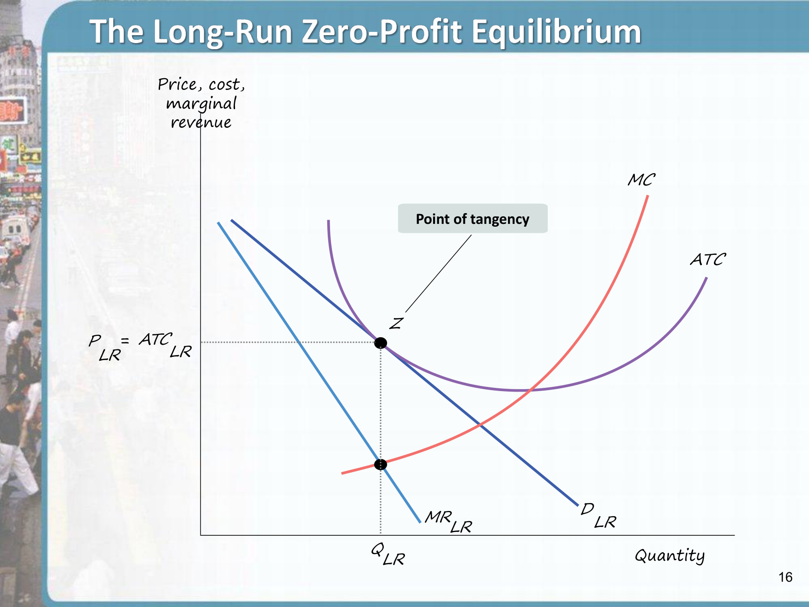

## 5. 与 Perfect Competition 的比较：Mark-up 与 Excess Capacity

与完全竞争相比，Monopolistic Competition 的长期均衡有两个重要特征。第一，价格高于边际成本，即 P > MC，因此存在 Mark-up。企业愿意在当前价格下多卖一单位，因为该价格高于生产该单位的边际成本；但如果要卖更多，企业必须降低所有单位的价格，所以它不会这样做。第二，企业产量低于使 ATC 最小化的产量，因此存在过剩产能 (Excess Capacity)。

> [!info] 核心定义：过剩产能 (Excess Capacity)
> Excess Capacity 指企业在长期均衡中生产的产量低于最小化 Average Total Cost 的产量。Monopolistic Competition 中企业没有在最低平均成本点生产，因此单位成本高于完全竞争中的类似企业。

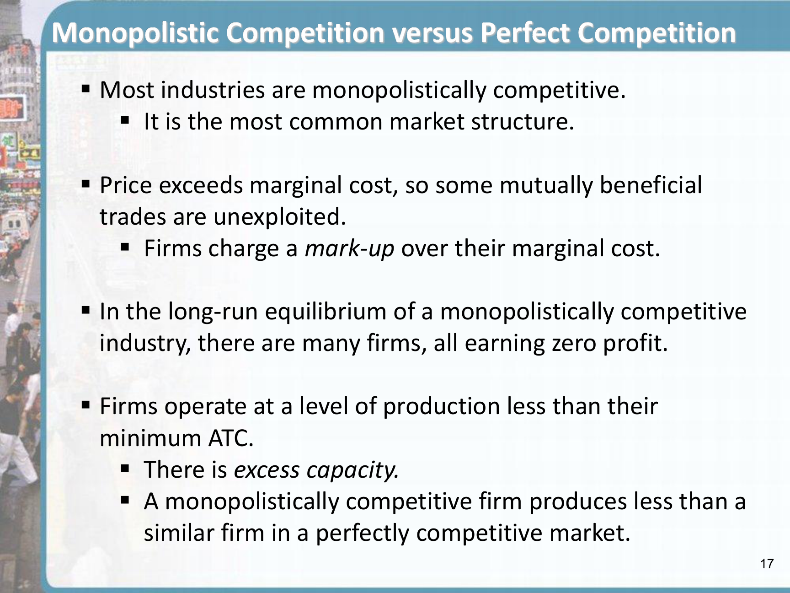
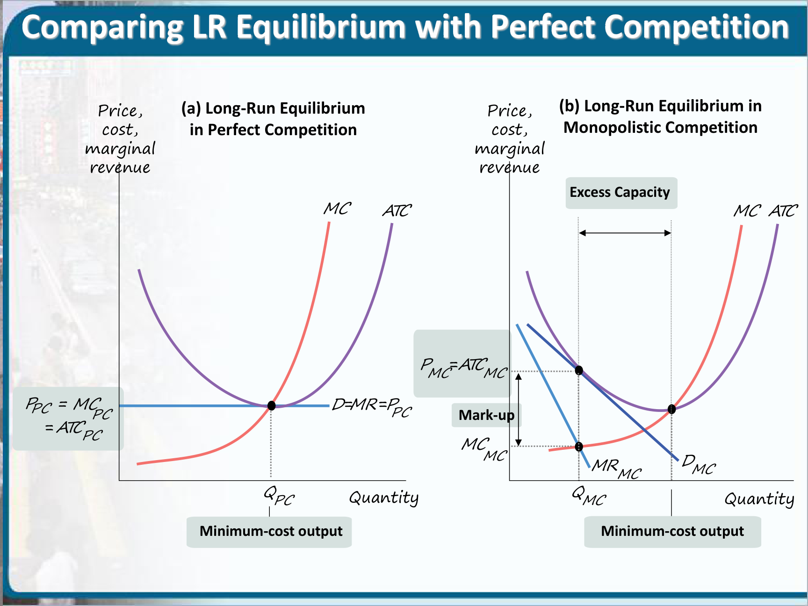

| Dimension       | Perfect Competition           | Monopolistic Competition      |
| --------------- | ----------------------------- | ----------------------------- |
| Firm Demand     | Perfectly elastic, D = MR = P | Downward-sloping Demand Curve |
| Long-Run Profit | Zero Economic Profit          | Zero Economic Profit          |
| Price and MC    | P = MC                        | P > MC, with Mark-up          |
| Output Level    | Minimum-cost output           | Below minimum-cost output     |
| Capacity        | No excess capacity            | Excess Capacity               |
| Product Variety | Homogeneous product           | Differentiated products       |

这也引出一个重要福利问题：Monopolistic Competition 是否低效率？从成本角度看，它价格更高、产量更少、P > MC，存在一些本可互利的交易没有发生。但从消费者选择角度看，更高价格的一部分代价可能被产品多样性带来的价值抵消。因此，Excess Capacity 不一定自动意味着社会福利更低，评价要看消费者对多样性的价值有多高。

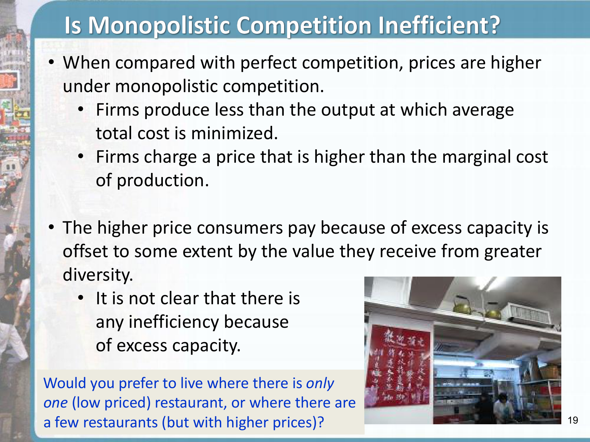

> [!question] 课堂思考
> 你更愿意住在只有一家低价餐馆的地方，还是有几家餐馆但价格略高的地方？这个问题对应 Monopolistic Competition 的核心权衡：Lower Prices vs. Greater Product Diversity。

## 6. Advertising：信息、操纵与市场力量

产品差异化讨论离不开广告 (Advertising) 和品牌名称 (Brand Name)。广告在不同产品中的重要性差异很大：高度差异化的消费品常把收入的 10-20% 用于广告；工业品广告较少；同质化商品几乎没有广告。完全竞争企业通常不做广告，因为它们可以按市场价格卖出全部产量；而销售差异化产品并且价格高于边际成本的企业，有强烈动机通过广告吸引买者、降低需求价格弹性 (Price Elasticity of Demand)，并维持更高 Mark-up。

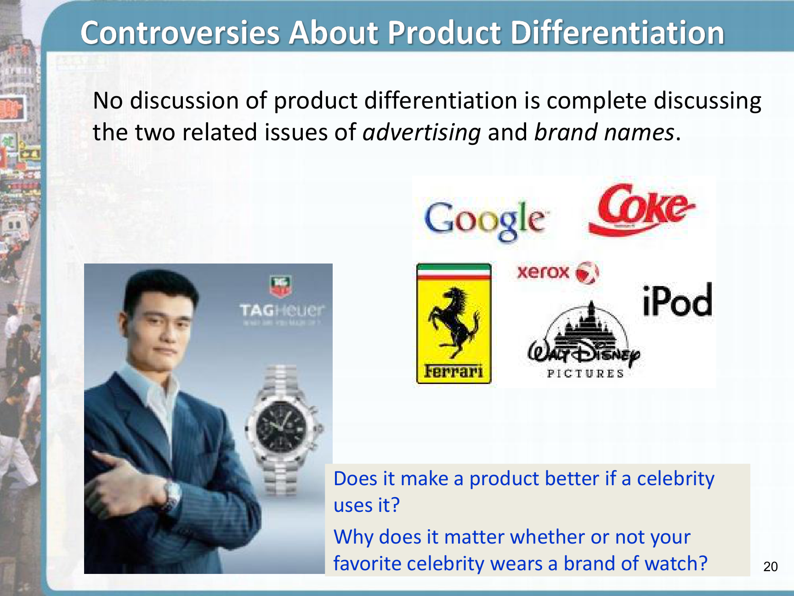
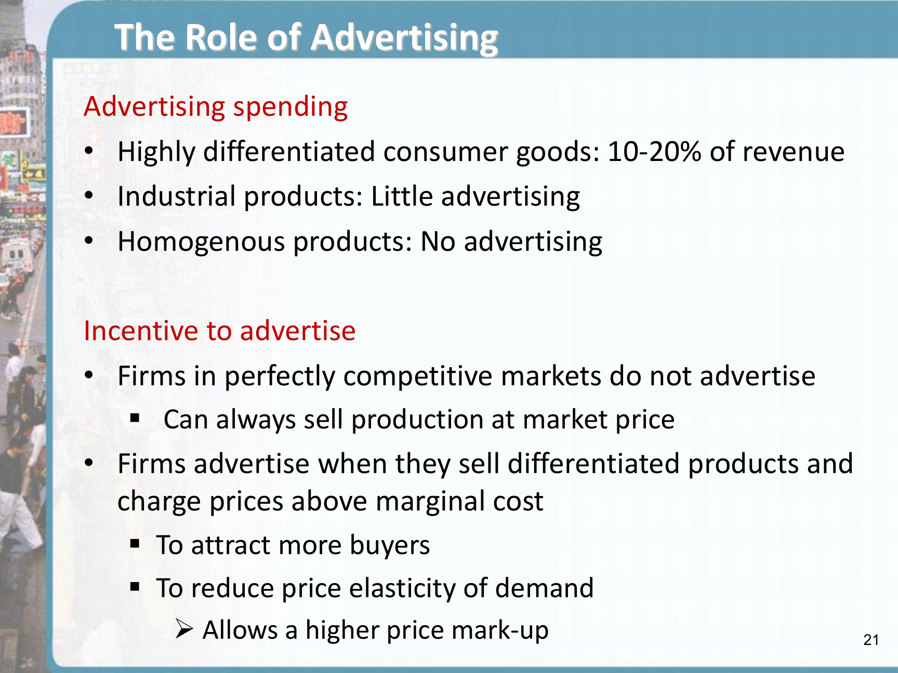

| Product Type | Advertising Spending | 经济含义 |
| --- | --- | --- |
| Highly differentiated consumer goods | 10-20% of revenue | 广告用于强化差异化和品牌忠诚 |
| Industrial products | Little advertising | 买方更专业，信息渠道更直接 |
| Homogenous products | No advertising | 产品无差异，广告难以带来市场力量 |

> [!info] 核心概念：Advertising 与 Price Elasticity of Demand
> 广告若能让消费者更偏好某一企业的产品，就会降低该企业需求的价格弹性 (Price Elasticity of Demand)，使需求曲线更不敏感，企业更容易收取高于边际成本的 Mark-up。若广告提供价格、质量和可得性信息，则可能让需求更有弹性并促进竞争。

广告的争议在于它既可能有价值，也可能浪费资源。批评者认为，广告操纵消费者偏好，制造原本不存在的欲望，夸大产品差异，培养品牌忠诚，从而阻碍竞争，使消费者不再关心相似商品之间的价格差异。支持者则认为，广告向消费者传递价格、质量、可得性等信息，帮助消费者更好选择，也能让新企业更容易进入市场，增强竞争。

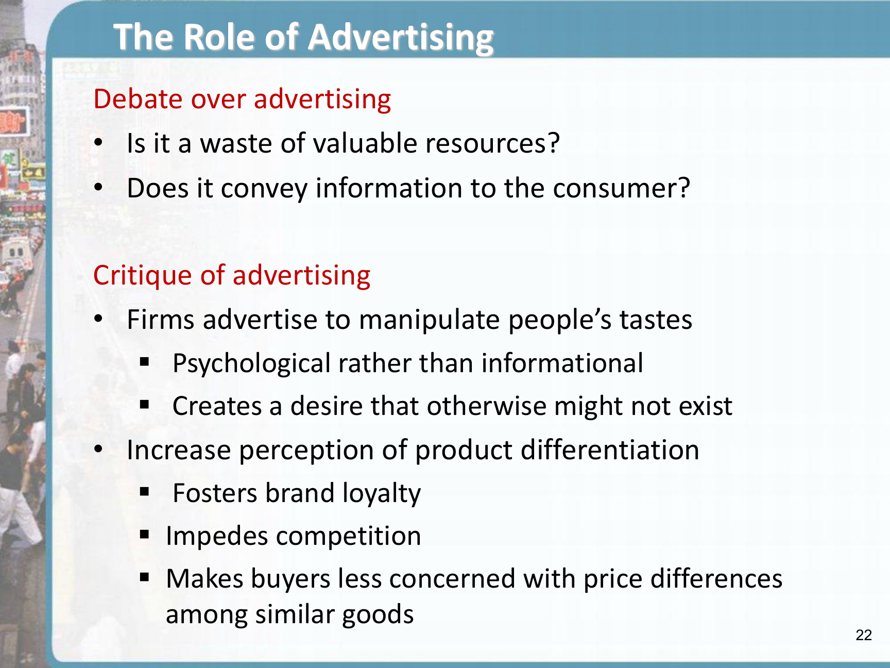
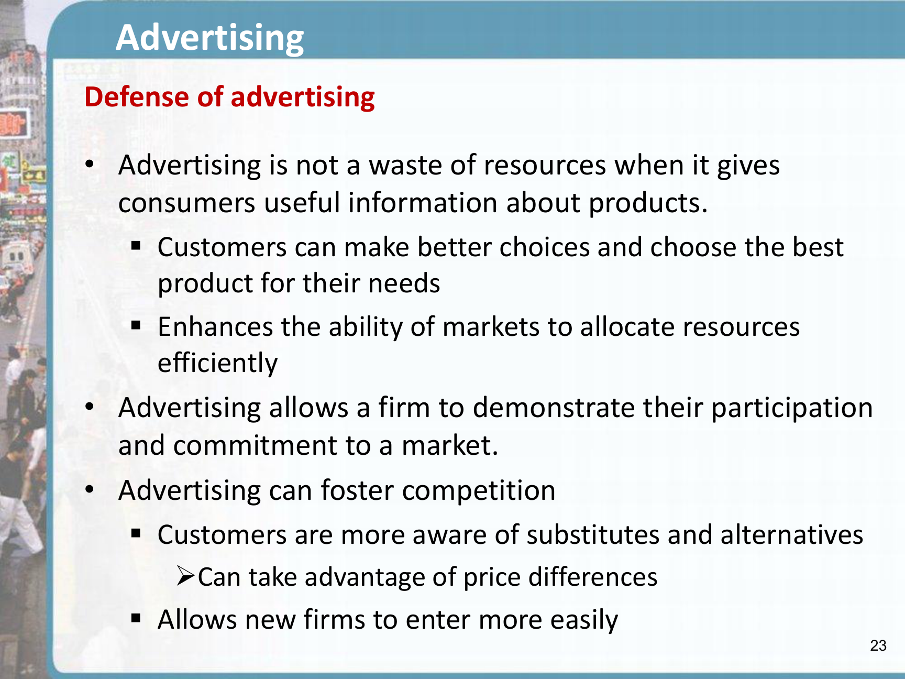
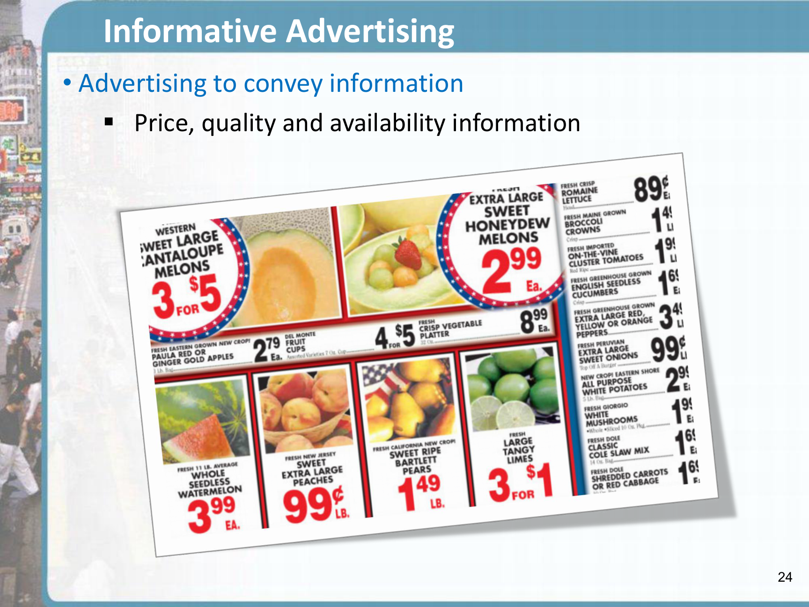

### 眼镜广告案例：Informative Advertising

1963 年，美国一些州开始允许验光师做广告。研究发现，禁止广告的州，一副眼镜平均价格约为 33 美元；不限制广告的州，平均价格约为 26 美元。原因是广告让消费者更容易发现价格更好的替代选择，增强竞争，并使企业面对的需求更有弹性。

| Policy Environment | Average Price Paid for Eyeglasses | Interpretation |
| --- | --- | --- |
| States that prohibited advertising | $33 | 消费者信息不足，价格较高 |
| States that did not restrict advertising | $26 | 广告提供替代选择信息，竞争增强 |

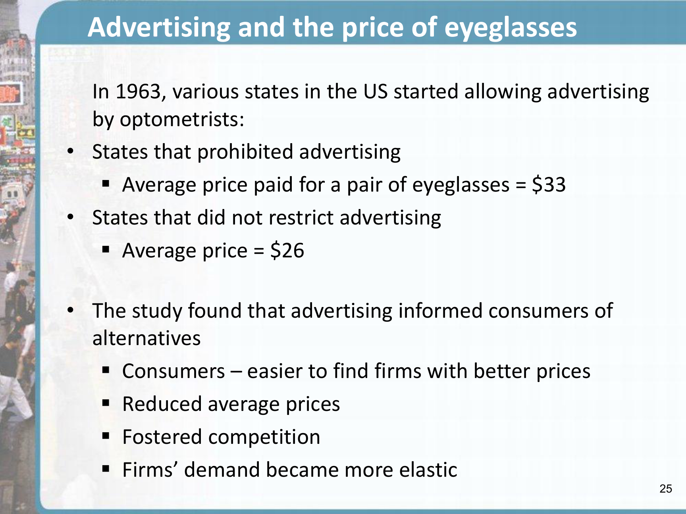

## 7. Brand Name：质量信号还是人为差异？

品牌名称 (Brand Name) 往往伴随大量广告支出和更高价格。批评者认为，Brand Name 为实际上差别不大的产品制造人为差异，使消费者因名人代言或品牌形象支付更高价格。支持者则强调，Brand Name 可以传递质量信息：如果企业愿意花大量资金建立品牌，消费者会推断企业预计长期经营并重视声誉；同时，企业为了保护品牌资产，也有动力维持高质量。

> [!info] 核心概念：昂贵信号 (Costly Signal)
> Costly Signal 指某种高成本行为本身传递信息。品牌广告的具体内容可能并不重要，关键是企业愿意为品牌投入大量资源，这可能向消费者暗示产品质量、企业承诺和长期经营预期。

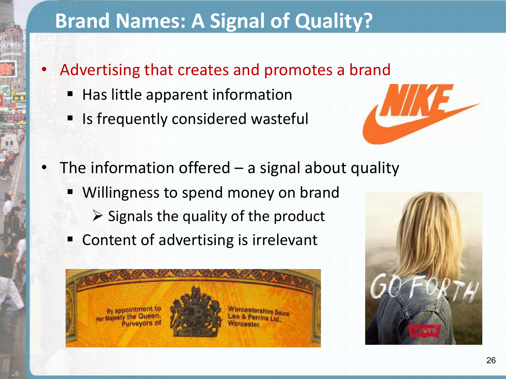
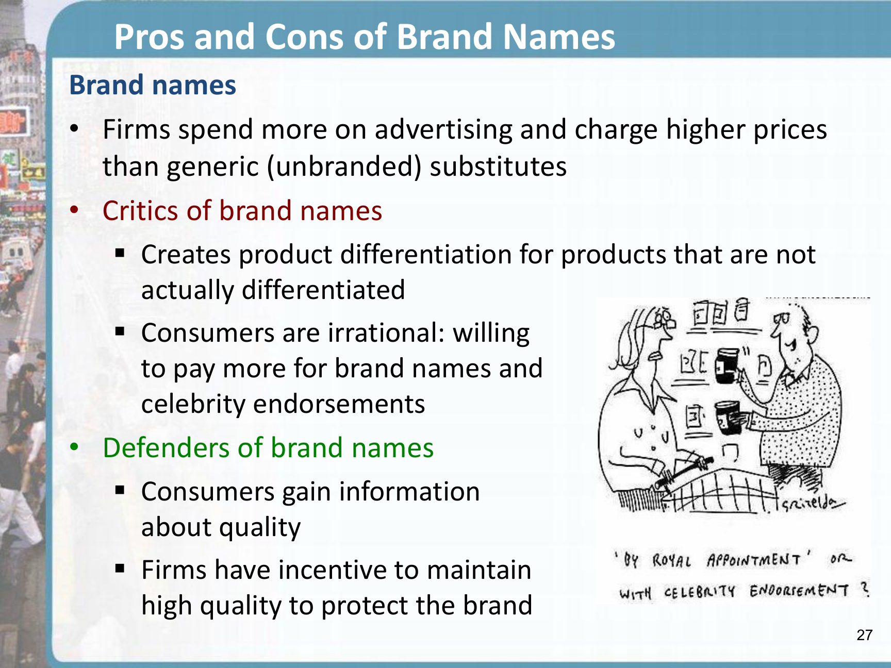
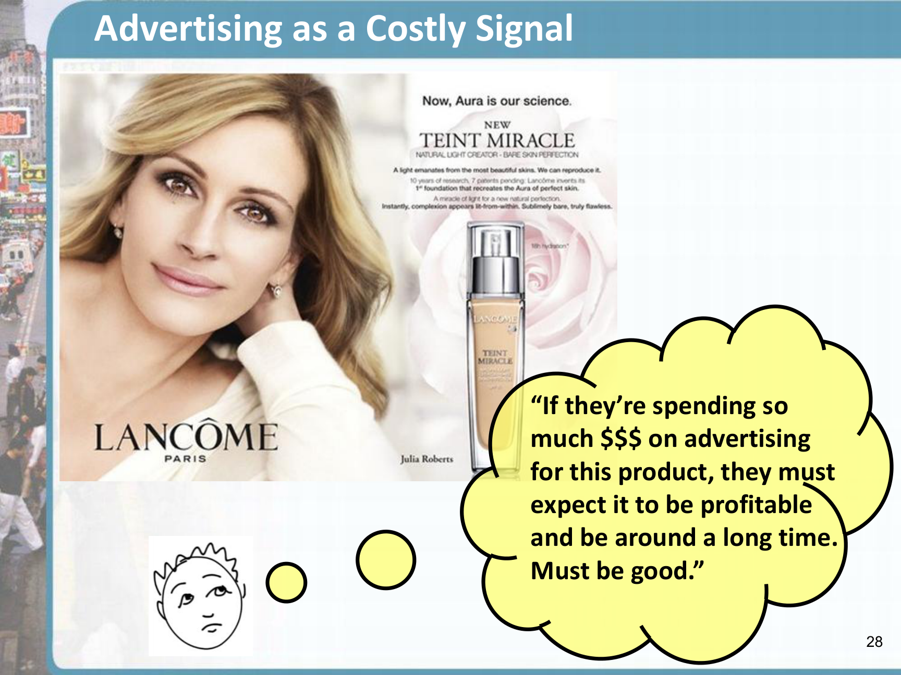

| View on Brand Names | Main Argument | Welfare Implication |
| --- | --- | --- |
| Critics | 品牌为实际差异很小的产品创造感知差异 | 可能浪费资源、提高价格、削弱竞争 |
| Defenders | 品牌提供质量信息并约束企业维持质量 | 可能降低消费者搜寻成本、改善选择 |

## 8. 社会福利：Between Perfect Competition and Monopoly

Monopolistic Competition 位于 Perfect Competition 和 Monopoly 之间，因此福利评价也处在二者之间。短期中，P > MC 带来类似垄断定价的 Deadweight Loss，一些本可提升福利的交易没有发生；企业还可能把资源用于纯粹制造差异化的广告。长期中，自由进入虽然消除经济利润，却可能导致过多企业进入，重复承担固定成本 (Duplication of Fixed Costs)，并让每家企业都在低于最低 ATC 的产量上生产。

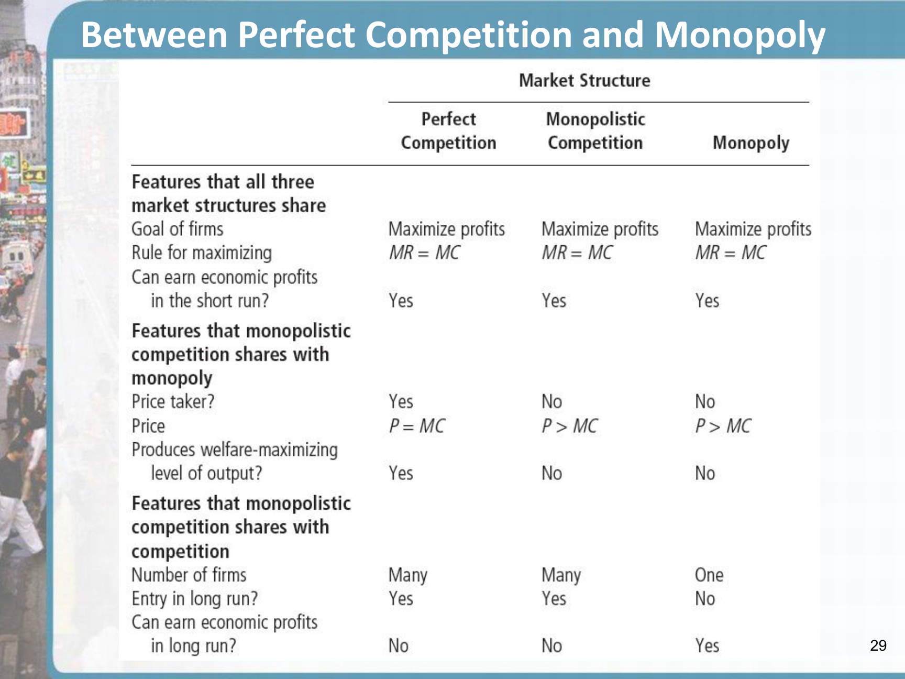
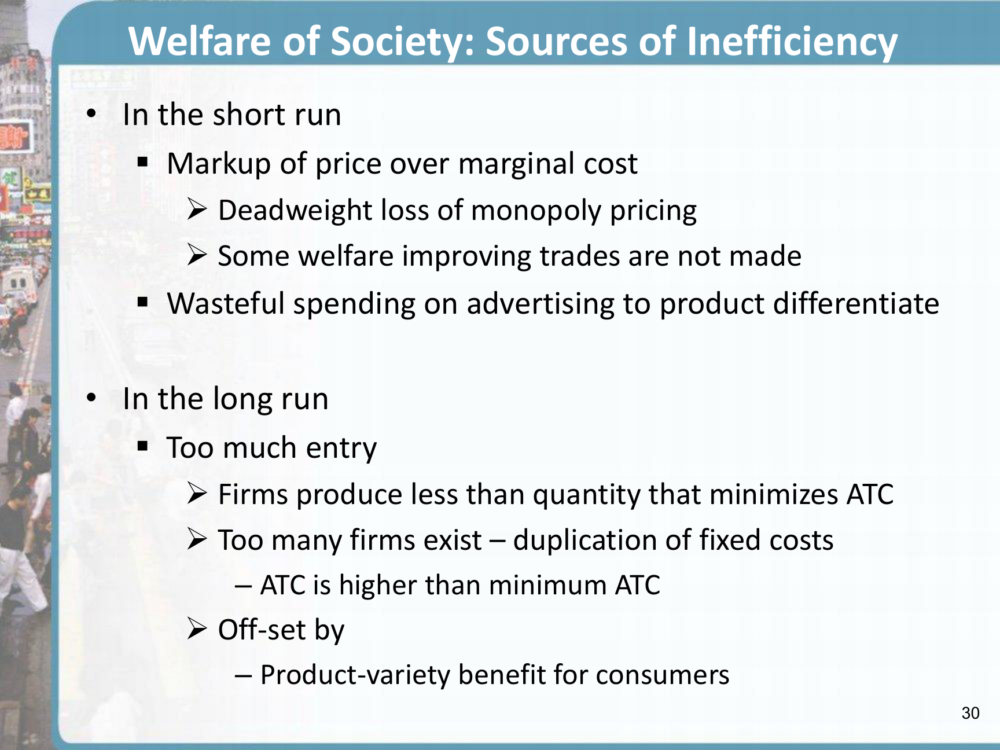

| Time Horizon | Source of Inefficiency | Explanation |
| --- | --- | --- |
| Short Run | Markup of price over marginal cost | P > MC 导致部分互利交易无法发生 |
| Short Run | Deadweight loss of monopoly pricing | 类似垄断定价带来的无谓损失 |
| Short Run | Wasteful advertising | 广告若只为制造市场力量，可能浪费资源 |
| Long Run | Too much entry | 进入过多导致固定成本重复 |
| Long Run | Excess capacity | 企业产量低于最小化 ATC 的产量 |
| Offset | Product-variety benefit | 消费者从产品多样性中获得补偿性收益 |

> [!warning] 考点：福利评价不要只看 Excess Capacity
> Monopolistic Competition 的价格和成本表现不如 Perfect Competition，但它提供更丰富的产品选择。考试中若问是否低效率，需要同时写出 P > MC、Excess Capacity、Deadweight Loss，以及 Product-variety benefit 对这些成本的抵消。

## 9. 本章总结

Monopolistic Competition 是由许多企业、差异化产品和长期自由进入退出构成的市场结构。Product Differentiation 可以按风格或类型、位置、质量等方式实现，是企业获得 Market Power 的核心来源。短期中，企业像垄断者一样按照 MR = MC 选择产量，并可能获得 Profit 或承受 Loss；长期中，进入与退出推动企业达到 Zero-Profit Equilibrium，需求曲线与 ATC 曲线在利润最大化产量处相切。

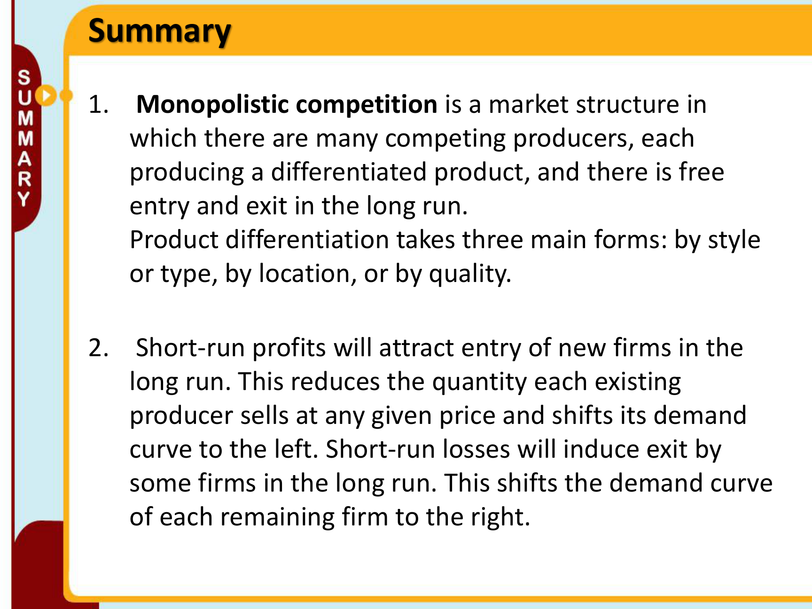

长期均衡下，企业虽然获得零经济利润，但仍有 P > MC 的 Mark-up，并且存在 Excess Capacity。Advertising 和 Brand Name 既可能提供有价值信息、促进竞争，也可能操纵偏好、制造人为差异并浪费资源。现实中二者通常兼具经济价值与经济浪费两面。

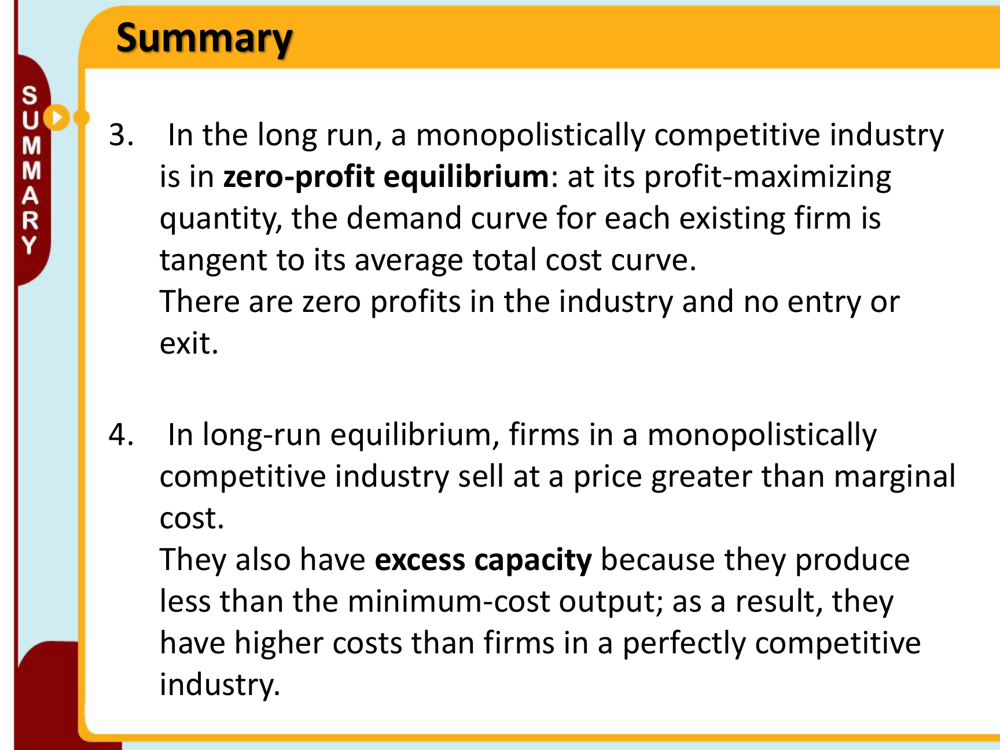
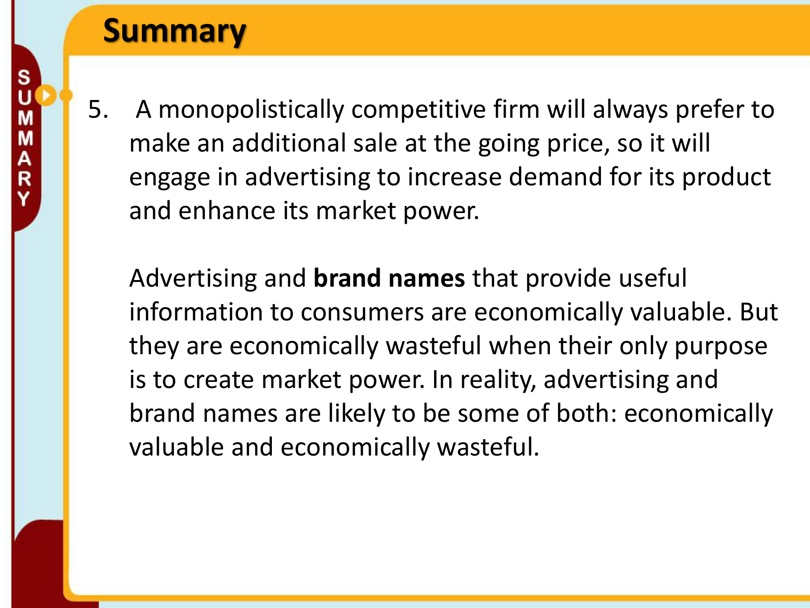

## 10. Key Terms

| Term | 中文对应 | 记忆要点 |
| --- | --- | --- |
| Monopolistic Competition | 垄断竞争 | 多企业、差异化产品、长期自由进入退出 |
| Product Differentiation | 产品差异化 | 企业获得 Market Power 的核心方式 |
| Differentiated Product | 差异化产品 | 消费者认为与其他产品不完全相同 |
| Downward-Sloping Demand Curve | 向下倾斜的需求曲线 | 企业有一定定价能力 |
| Marginal Revenue (MR) | 边际收益 | 垄断竞争企业中 MR < P |
| Marginal Cost (MC) | 边际成本 | 利润最大化条件为 MR = MC |
| Average Total Cost (ATC) | 平均总成本 | 长期零利润均衡中 P = ATC |
| Zero-Profit Equilibrium | 零利润均衡 | 长期进入退出停止，经济利润为零 |
| Mark-up | 加价 | P > MC |
| Excess Capacity | 过剩产能 | 产量低于最小化 ATC 的产量 |
| Advertising | 广告 | 可传递信息，也可强化市场力量 |
| Brand Name | 品牌名称 | 可能是质量信号，也可能制造人为差异 |
| Costly Signal | 昂贵信号 | 高成本广告支出本身传递质量或承诺信息 |

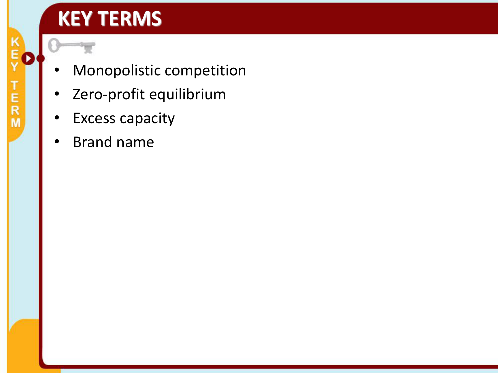
