# Externalities

本章讨论外部性 (Externalities)，也称溢出效应 (Spillovers)。当一个人的生产或消费行为影响到第三方，而这种影响没有通过市场价格体现出来时，就产生了 Externalities。外部性会使自由市场均衡偏离社会最优，从而形成市场失灵 (Market Failure)，并为政府干预提供理由。

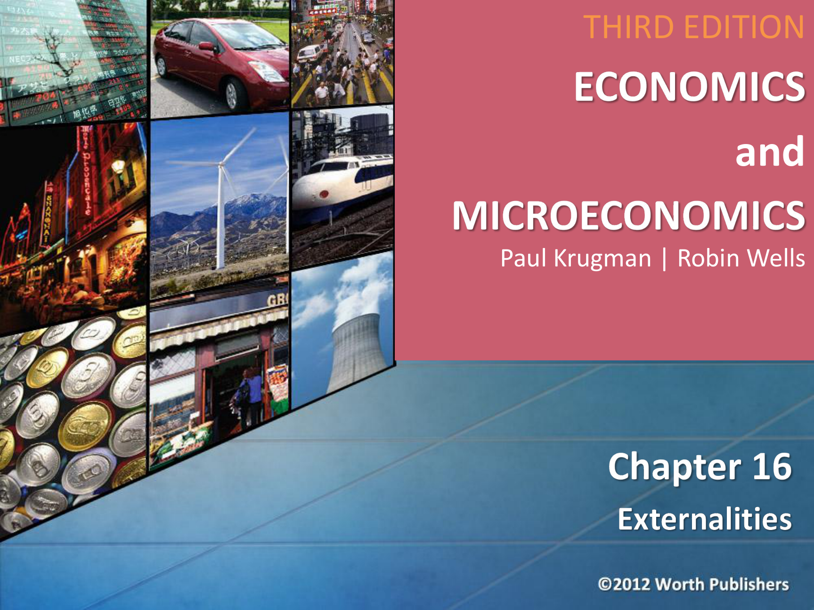
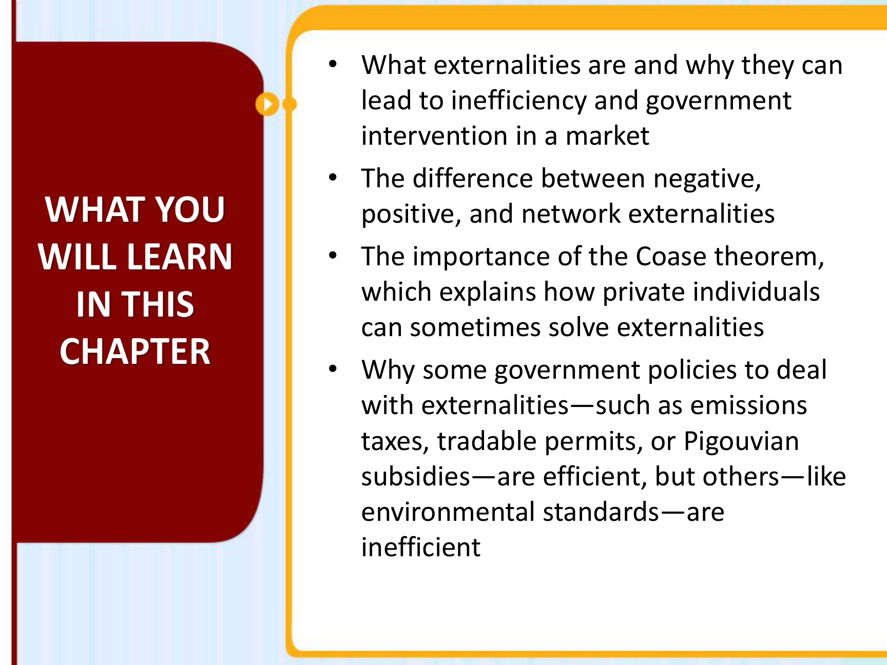

## 1. Externalities 与 Market Failure

> [!info] 核心定义：外部性 (Externalities)
> Externalities are the impacts on third parties of an action。若某行为给他人带来成本，就是外部成本 (External Cost) 或负外部性 (Negative Externality)；若某行为给第三方带来收益，就是外部收益 (External Benefit) 或正外部性 (Positive Externality)。

当存在 Externalities 时，个人决策只考虑私人收益与私人成本，却没有完整考虑社会收益与社会成本。因此，自由市场给出的产量通常不是社会最优 (Socially Optimal)，市场结果也不再有效率。

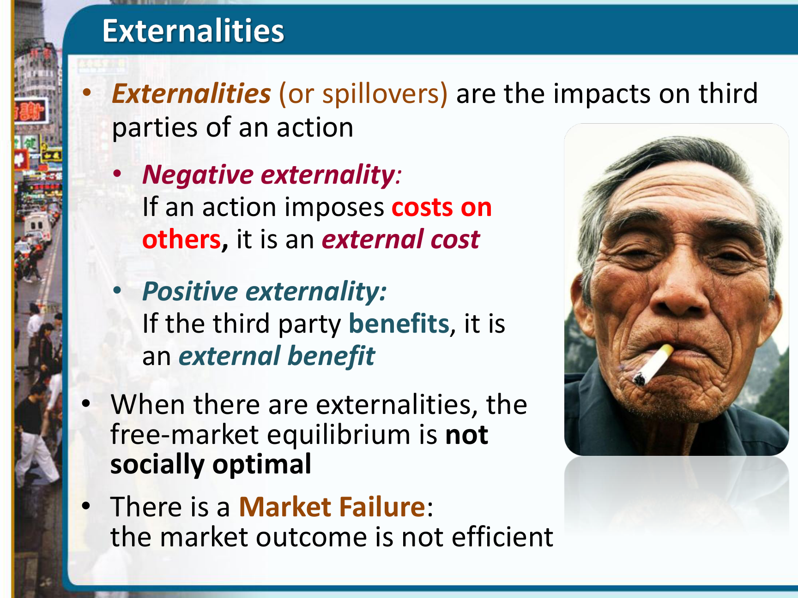

| Type | 中文含义 | Examples |
| --- | --- | --- |
| Negative Externality | 行为给第三方带来成本 | air and water pollution, texting while driving, overfishing |
| Positive Externality | 行为给第三方带来收益 | education, beehives near fruit orchards, vaccination |

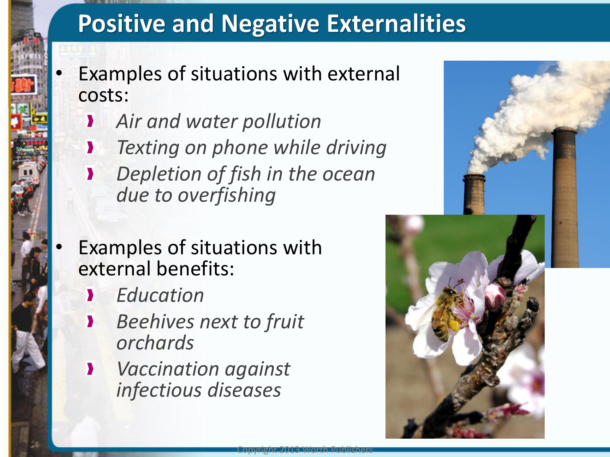

## 2. Negative Externalities：外部成本与过度生产

> [!info] 核心定义：社会成本 (Social Cost)
> Social Cost of a good or activity = private cost of production + external cost。当存在污染等 External Cost 时，边际社会成本 (Marginal Social Cost, MSC) 高于企业的边际生产成本。

若某种商品生产带来 Negative Externality，例如畜牧生产产生环境成本，市场供给曲线只反映企业的私人 Marginal Cost，却没有反映对社会造成的额外损害。因此，在没有政府干预时，市场产量 `Q_MKT` 会高于社会最优产量 `Q_OPT`。

> [!info] 核心定义：庇古税 (Pigouvian Tax)
> Pigouvian Tax 是为了让市场主体把外部成本纳入决策而征收的税。最优 Pigouvian Tax 应等于边际外部成本 (Marginal External Cost)，从而使私人决策面对真正的 Marginal Social Cost。

课件中的畜牧生产图说明：MSC 曲线相当于供给曲线 `S` 向上移动了 Marginal External Cost。市场价格 `P_MKT` 低估了生产的真实社会成本，因此产量过高。若征收等于 Marginal External Cost 的 Optimal Pigouvian Tax，供给曲线变为 `S_TAX`，消费者支付价格上升，生产者税后价格下降，产量从 `Q_MKT` 降至 `Q_OPT`。

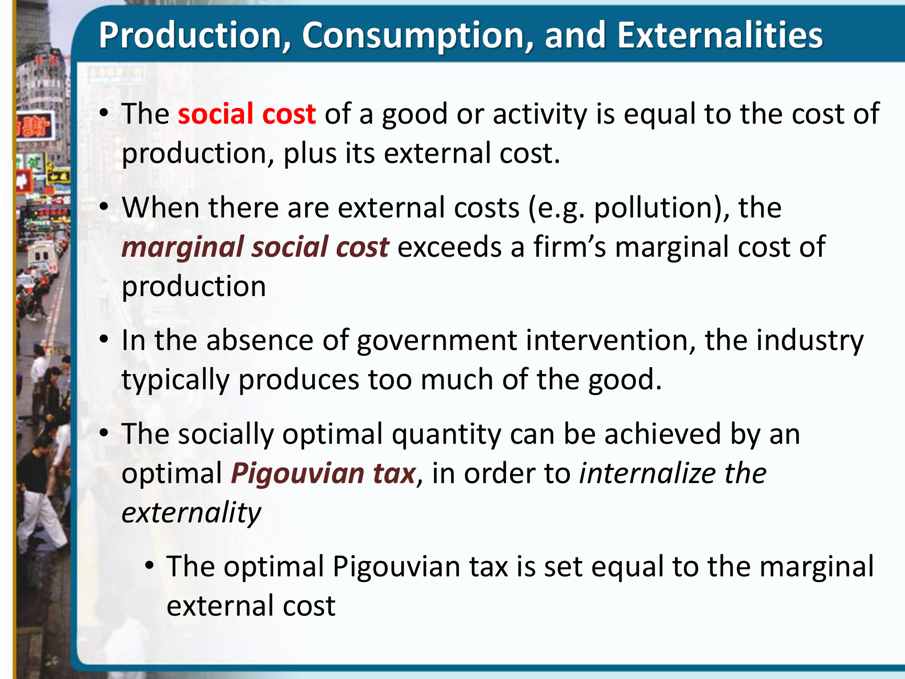
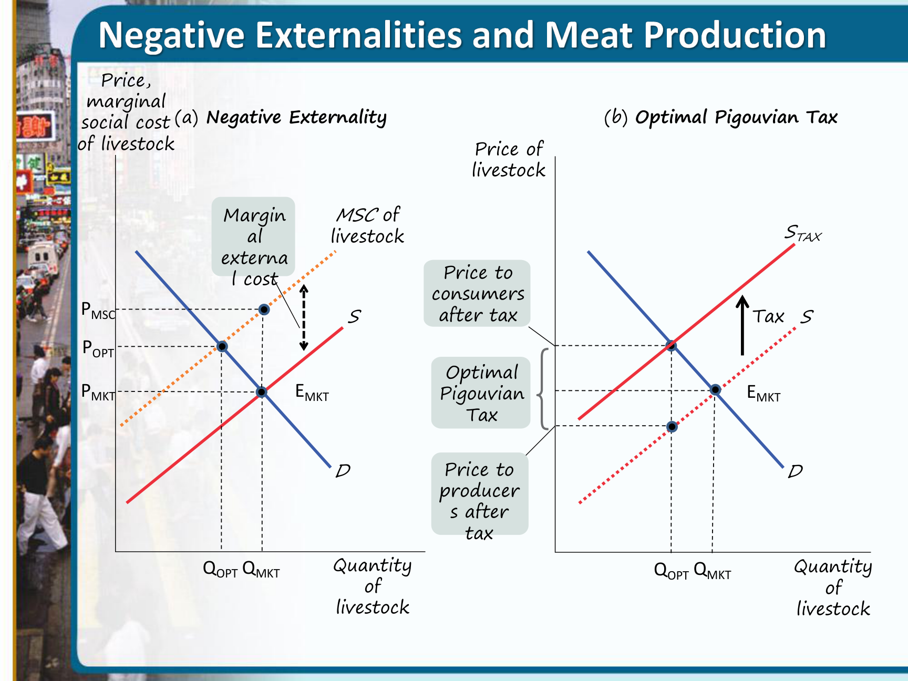

## 3. Positive Externalities：外部收益与生产不足

> [!info] 核心定义：边际社会收益 (Marginal Social Benefit, MSB)
> Marginal Social Benefit = marginal private benefit to consumers + marginal external benefit。当某行为带来 External Benefit 时，MSB 高于私人需求曲线反映的 Marginal Benefit。

正外部性的典型例子包括技术溢出 (Technology Spillover) 与疫苗接种 (Vaccination)。企业创新产生的新知识可能被其他企业学习和使用；个人接种疫苗不仅保护自己，也降低疾病在人群中传播的概率。

> [!info] 核心定义：庇古补贴 (Pigouvian Subsidy)
> Pigouvian Subsidy 是鼓励产生 External Benefit 的活动的补贴。最优 Pigouvian Subsidy 应等于边际外部收益 (Marginal External Benefit)，从而把产量提高到社会最优水平。

课件中的疫苗图说明：由于接种疫苗有外部收益，MSB 曲线相当于需求曲线 `D` 向上移动了 Marginal External Benefit。没有政府干预时，市场消费量 `Q_MKT` 低于社会最优量 `Q_OPT`。最优 Pigouvian Subsidy 降低消费者支付价格、提高生产者收到价格，使消费量上升到 `Q_OPT`。

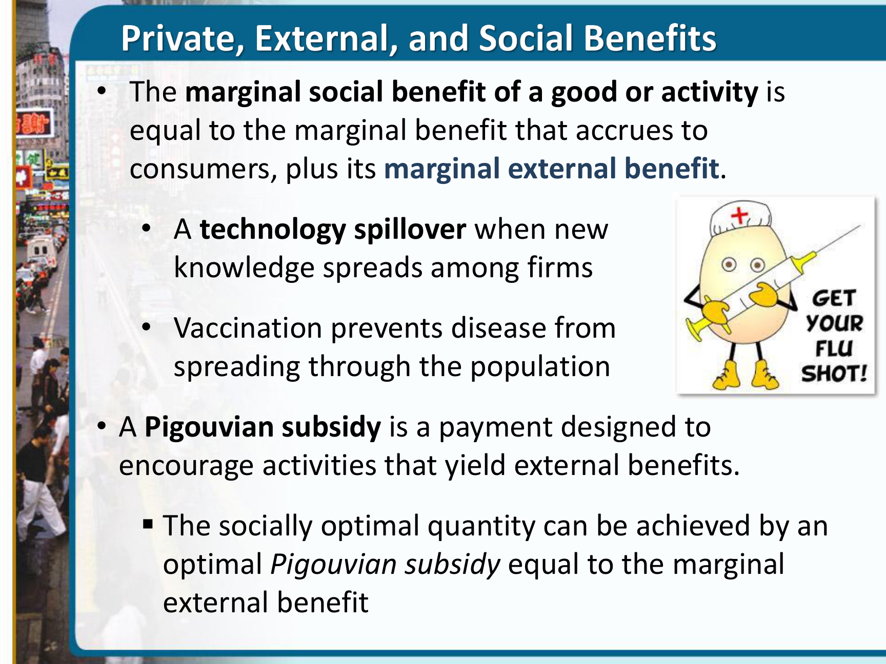
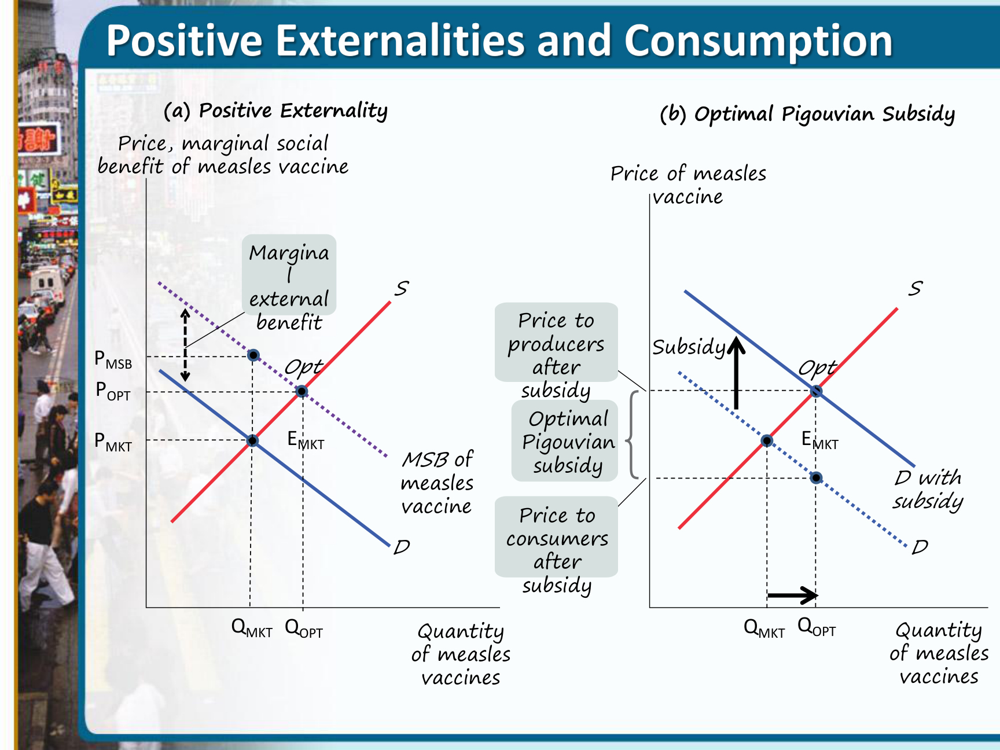

## 4. Network Externalities 与 Positive Feedback

> [!info] 核心定义：网络外部性 (Network Externalities)
> A good is subject to a Network Externality when the value of the good to an individual is greater when a large number of other people also use the good。

Network Externalities 意味着其他人的消费会提高你自己的 Marginal Benefit。操作系统、聊天软件、社交网络、电话、电报和铁路系统都具有这种特征。以 Microsoft Windows 为例，用户越多，软件开发者越愿意为 Windows 开发程序；程序越多，又越吸引新用户。

> [!info] 核心定义：正反馈 (Positive Feedback)
> Positive Feedback 指 success breeds greater success and failure breeds failure。网络越大越有吸引力，市场可能因此向少数平台集中，甚至形成 Monopoly。

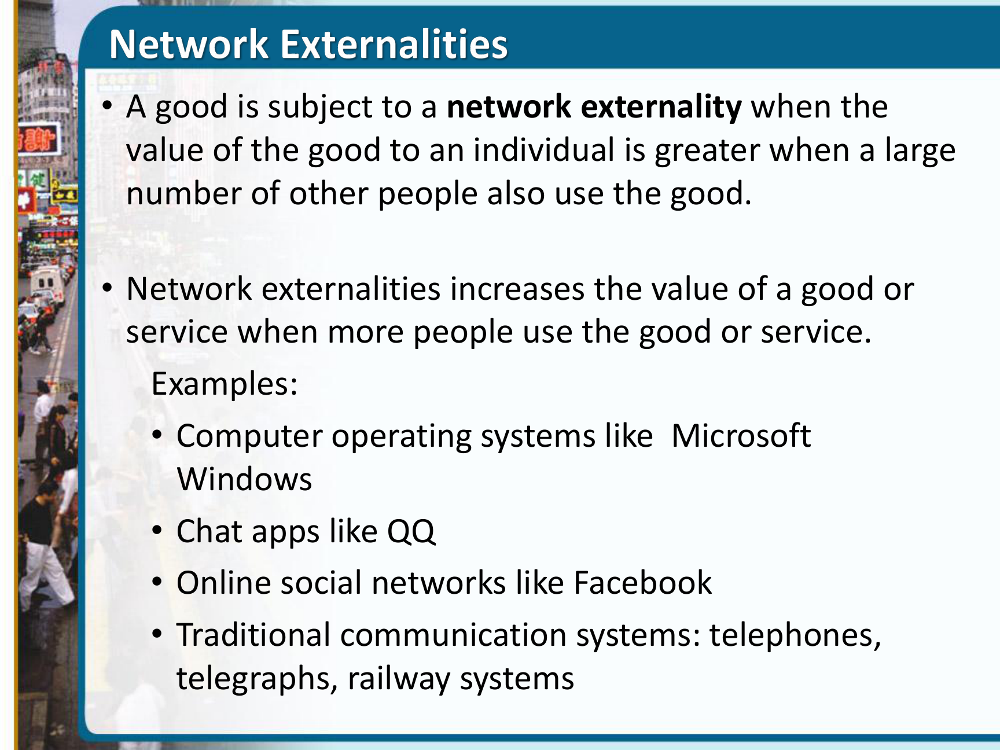
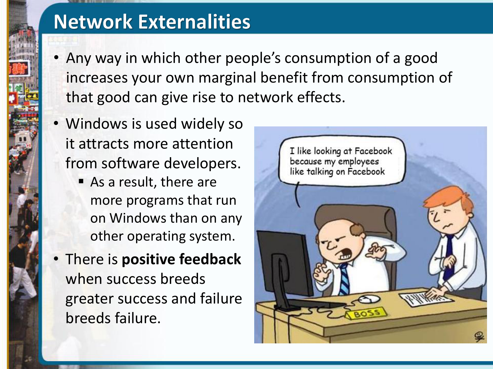

> [!question] Active Learning Practice
> 看到邻居种花让你获得额外愉悦，这是 External Benefit。你带大件行李上 MTR，妨碍别人上下车，这是 External Cost。判断题的关键是问：影响是否落在第三方身上？

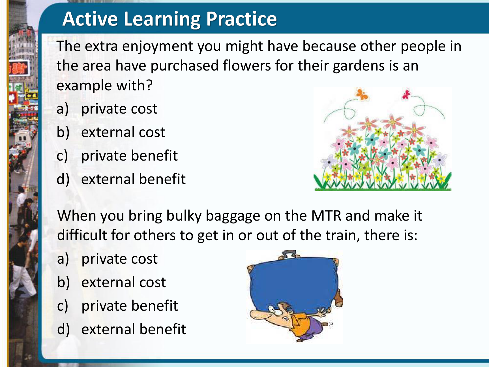

## 5. Pollution 的经济学：最优污染量不是零

污染 (Pollution) 是许多有价值经济活动的副产品，例如交通、化肥和电力。企业可以使用昂贵的污染减排技术降低污染，但未受监管的企业没有私人激励这样做，因为它们通常不为自己造成的污染付费。这正是 Negative Externality。

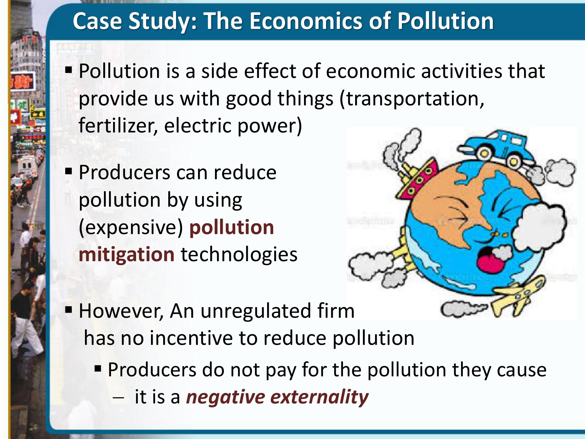

> [!info] 核心定义：污染的最优社会数量 (Socially Optimal Quantity of Pollution)
> Socially Optimal Quantity of Pollution 是在充分考虑污染的所有社会成本和社会收益后，社会会选择的污染数量。它满足 MSC of pollution = MSB of pollution。

污染带来成本，也带来收益。污染的 Marginal Social Cost 是额外一单位污染对整个社会造成的额外伤害，例如健康成本和心理成本；污染的 Marginal Social Benefit 则包括允许生产者排放一单位污染所节省的成本，或污染者愿意为排放权支付的金额。

因此，经济学并不简单主张“污染必须为零”。当污染非常低时，继续减少污染可能需要极高成本；当污染很高时，额外污染造成的损害很大。社会最优点在 `MSC = MSB`，课件图中对应 `Q_OPT` 与每吨 200 美元。

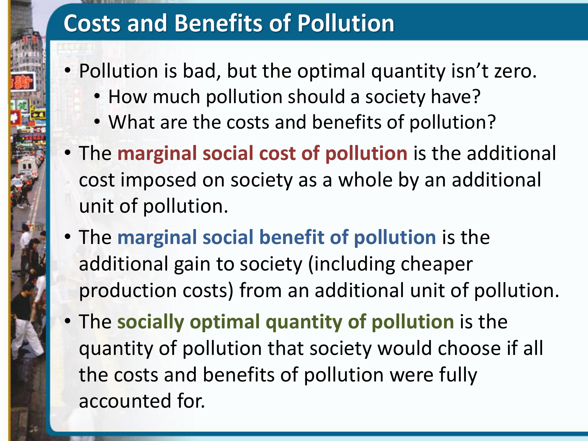
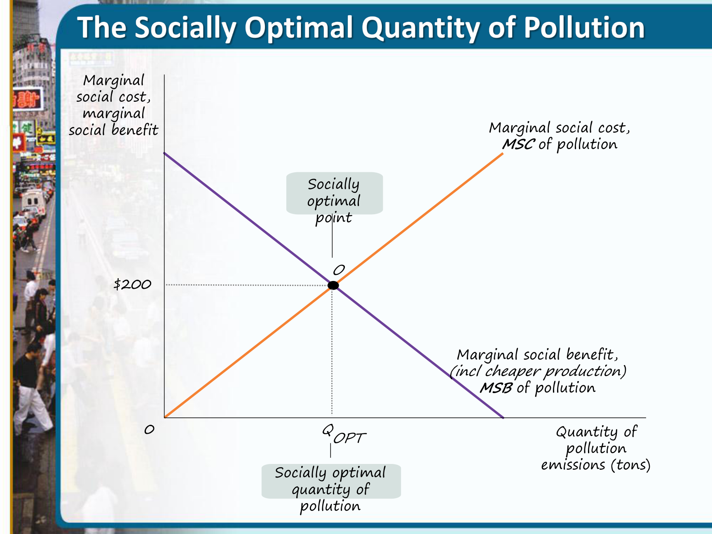

衡量污染的成本与收益并不容易。MSC 需要加总社会成员因额外污染受到的损害，常包括健康损害、心理损害，也可能依赖公共意见调查，因此容易被低估。MSB 可以通过污染者愿意为排放权支付的金额衡量，例如通过 Emissions Trading Schemes 观察。

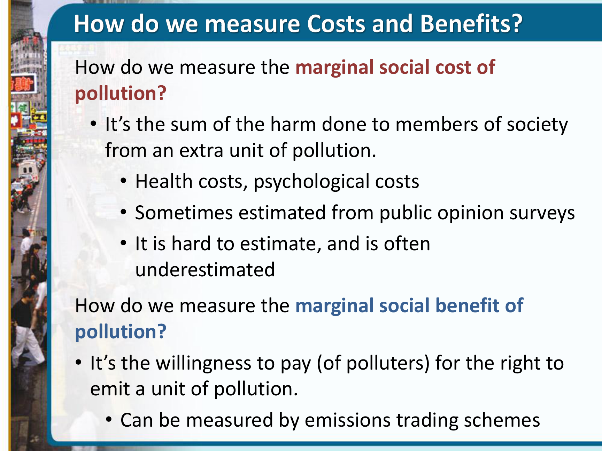

在无政府干预时，市场会产生过多污染。课件图中，市场污染量 `Q_MKT` 是污染的 Marginal Social Benefit 降为 0 的地方；但此时 MSC 高达 400 美元，远大于 MSB。最优 Pigouvian Tax 为在 `Q_OPT` 处的 MSC，即 200 美元，从而把污染量推回社会最优水平。

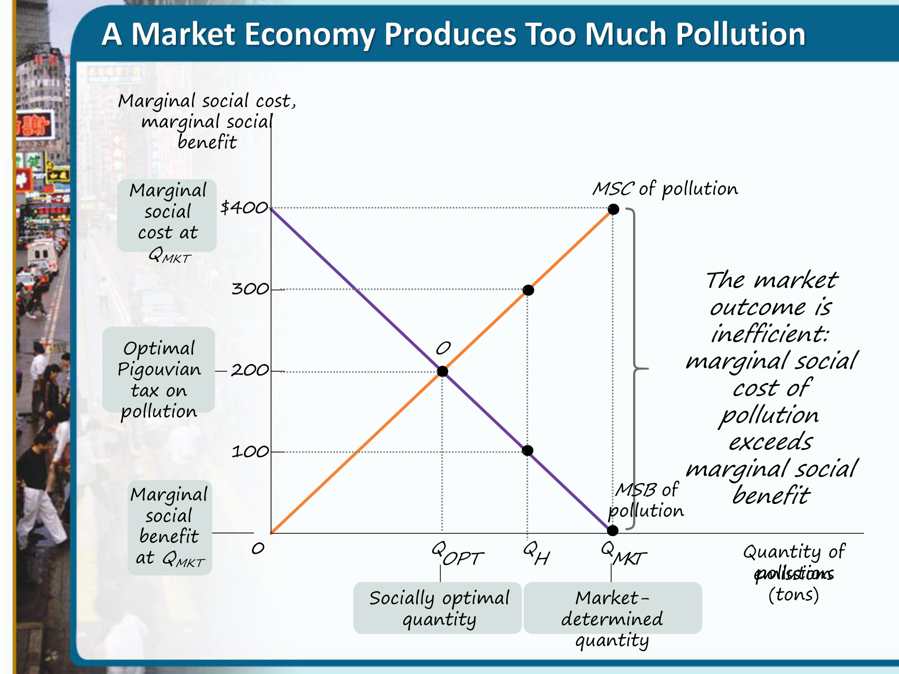

## 6. Environmental Policy：标准、排放税与可交易许可证

> [!info] 核心定义：环境标准 (Environmental Standards)
> Environmental Standards 是要求生产者或消费者采取特定行动的规则。它们可以保护环境，但通常效率较低，因为缺乏灵活性。

> [!info] 核心定义：排放税 (Emissions Tax)
> Emissions Tax 是根据企业排放污染数量征收的税。Pollution Tax 是 Pigouvian Tax 的一种形式，能让企业自行比较减排成本与纳税成本。

> [!info] 核心定义：可交易排放许可证 (Tradable Emissions Permits)
> Tradable Emissions Permits 是允许企业排放有限数量污染物的许可证，可以买卖。政府限制总污染量，同时创造污染权市场。

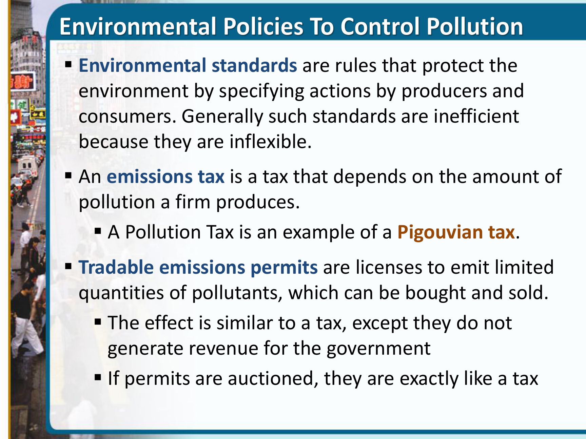

课件比较了 Environmental Standard 与 Emissions Tax。若政府要求 Plant A 和 Plant B 都减排一半，会忽视两家企业减排成本不同这一事实。Plant A 减排成本较低，Plant B 减排成本较高，统一标准会让高成本企业减排过多、低成本企业减排不足。

相反，Emissions Tax 允许企业灵活反应。面对每吨 200 美元税，Plant A 会减排更多，Plant B 会减排较少，直到两家企业继续排放一吨污染的边际收益都等于税率。这样可以用最低成本实现同样污染削减。

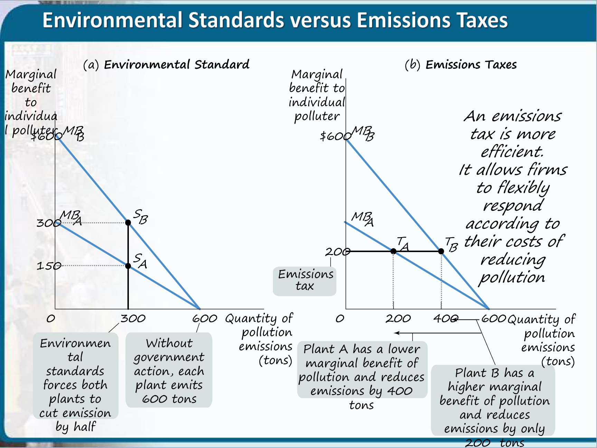

Tradable Emissions Permits 也能达到类似效果。容易低成本减排的企业会减少更多污染，并出售多余许可证；减排困难、成本高的企业会购买许可证。如果政府拍卖许可证，而不是免费发放，其效果与污染税非常接近。

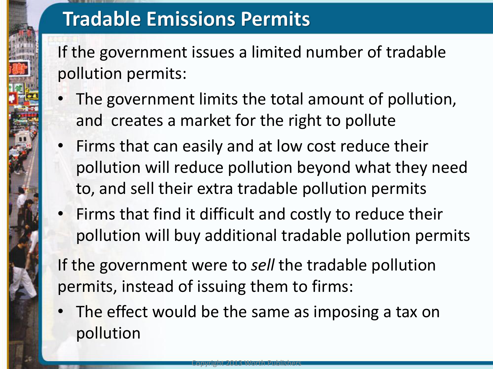

| Policy | 中文含义 | Efficiency Logic |
| --- | --- | --- |
| Environmental Standards | 统一规定行为或排放上限 | 简单直接，但不够灵活，通常成本较高 |
| Emissions Tax | 按排放数量征税 | 企业按自身减排成本调整，通常成本更低 |
| Tradable Emissions Permits | 可买卖排放许可证 | 固定总排放量，让许可证流向减排成本较高者 |

## 7. Private Solutions 与 Coase Theorem

Ronald Coase 指出，在理想情况下，私人部门也可能解决 Externalities。只要交易成本 (Transaction Costs) 足够低，受影响各方可以通过谈判达成互利协议，把外部性内部化 (Internalize the Externality)。

> [!info] 核心定义：科斯定理 (Coase Theorem)
> Coase Theorem 认为，即使存在 Externalities，只要 Transaction Costs 足够低，私人各方也能通过谈判达成有效率结果。初始产权分配影响财富分配，但不一定影响效率结果。

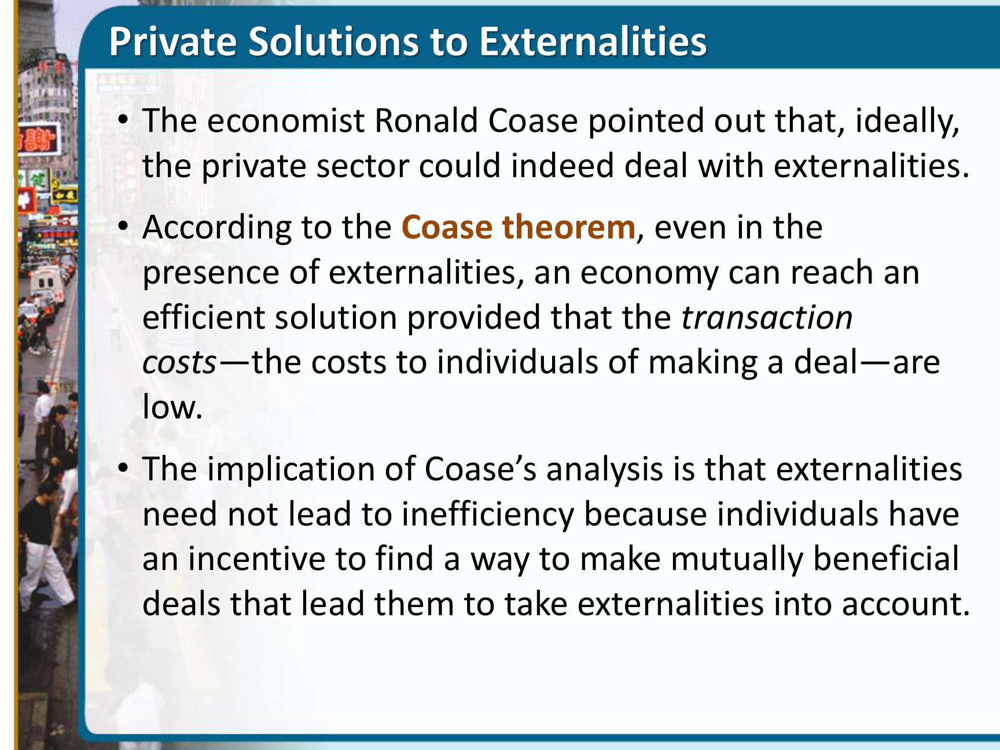

课件用 Dick 的狗 Spot 与邻居 Jane 的安静权来解释 Coase Theorem。Spot 吠叫打扰 Jane，是 Negative Externality。有效率结果取决于 Dick 养 Spot 的收益与 Jane 安静的价值：如果 Dick 对 Spot 的价值高于 Jane 的损失，Spot 应该留下；反之 Spot 应该离开。

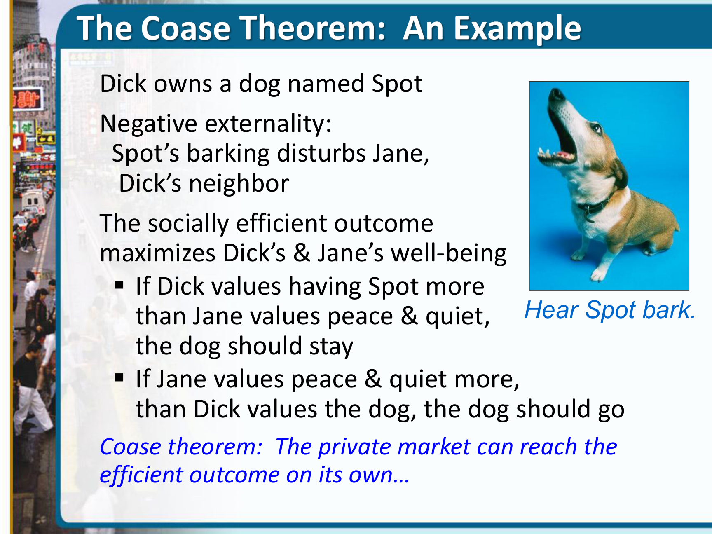

若 Dick 有养 Spot 的权利，且 Dick 的收益为 500 美元、Jane 的损失为 800 美元，那么 Jane 可以支付 Dick 600 美元让他放弃 Spot，双方都更好；若 Dick 的收益为 1200 美元、Jane 的损失为 800 美元，Jane 无法支付足够金额，Spot 会留下。

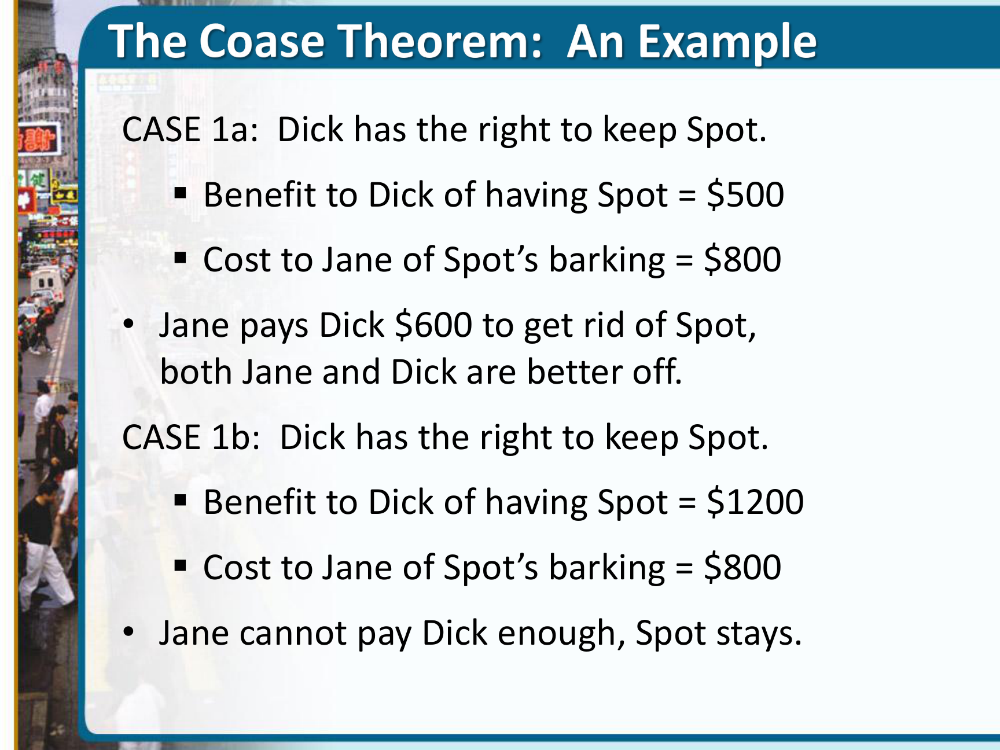

若 Jane 有安静权，效率结果仍相同。若 Dick 的收益为 500 美元、Jane 的损失为 800 美元，Spot 离开；若 Dick 的收益为 1200 美元、Jane 的损失为 800 美元，Dick 可以支付 Jane 600 美元让她不诉讼，Spot 留下。初始权利改变谁付钱给谁，但不改变有效率结果。

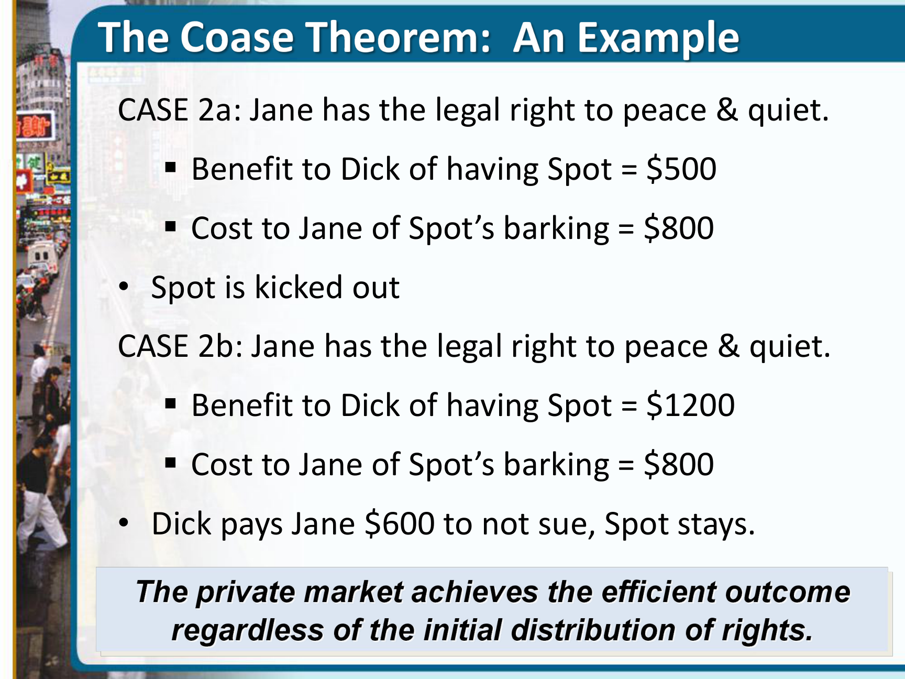

Coase-type solutions 的特征是私人之间存在 Side Payments。例如，为了让邻居在孩子午睡时停止放大声音乐，一家人可以给邻居做午餐作为交换；果园主人可以付钱给养蜂人，把蜂箱放在附近提供授粉服务。

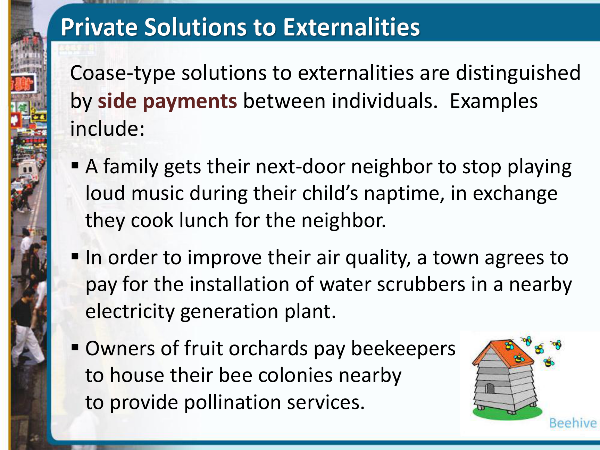

但现实中大多数 Externalities 没有被内部化，因为 Transaction Costs 很高。成本可能来自沟通，尤其是受影响人数很多时；也可能来自制定具有法律约束力协议的费用；还可能来自讨价还价本身，因为双方都试图争取更有利条件。

> [!warning] 考点：Coase Theorem 的适用条件
> Coase Theorem 不等于“政府永远不需要干预”。它要求 Transaction Costs 足够低、产权清晰、相关方人数较少且谈判可行。污染、气候变化、城市噪音等问题往往涉及大量人群，私人谈判成本很高。

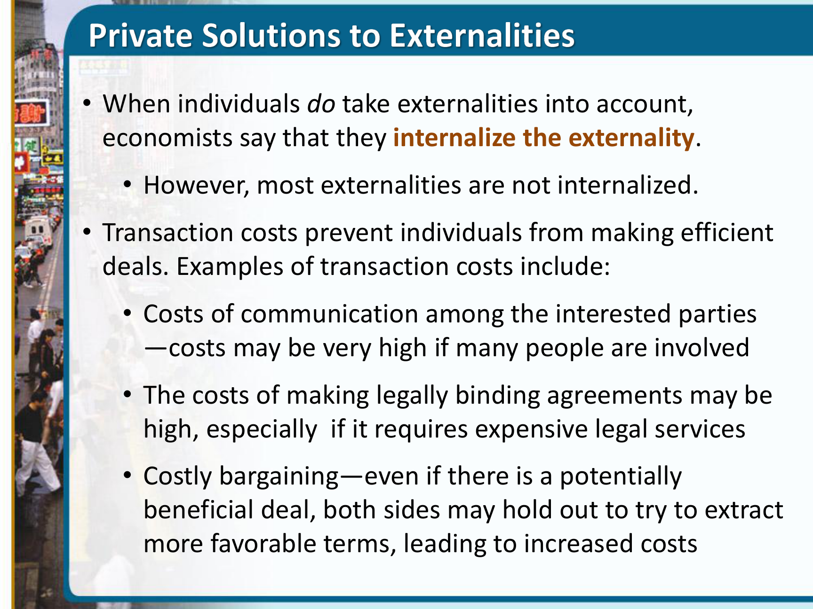

## 8. 本章总结

污染这类 Negative Externalities 使市场产生过多有外部成本的活动；教育、技术溢出和疫苗这类 Positive Externalities 使市场产生过少有外部收益的活动。政府可以通过 Pigouvian Tax、Pigouvian Subsidy、Emissions Tax 和 Tradable Emissions Permits 将私人激励调整到社会最优。

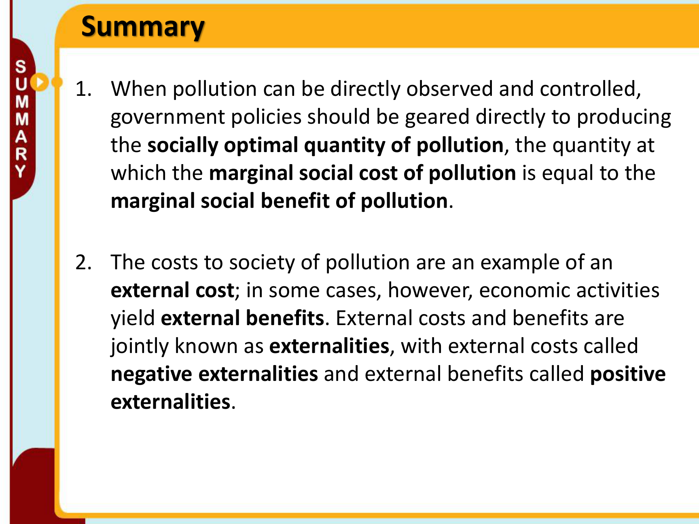

Coase Theorem 说明，在低 Transaction Costs 下，私人谈判可能 Internalize the Externality，使政府干预不再必要。但在现实世界中，交易成本经常很高，因此环境政策和外部性政策仍然重要。

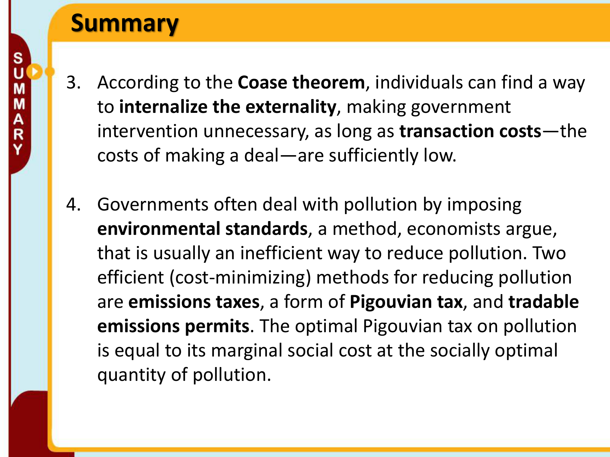

Positive Externalities 中，MSB 高于私人 Marginal Benefit，市场产量过低；最优 Pigouvian Subsidy 等于 Marginal External Benefit，并把产量提高到 `Q_OPT`。这种支持能产生正外部性的产业的政策也可被理解为工业政策 (Industrial Policy)。

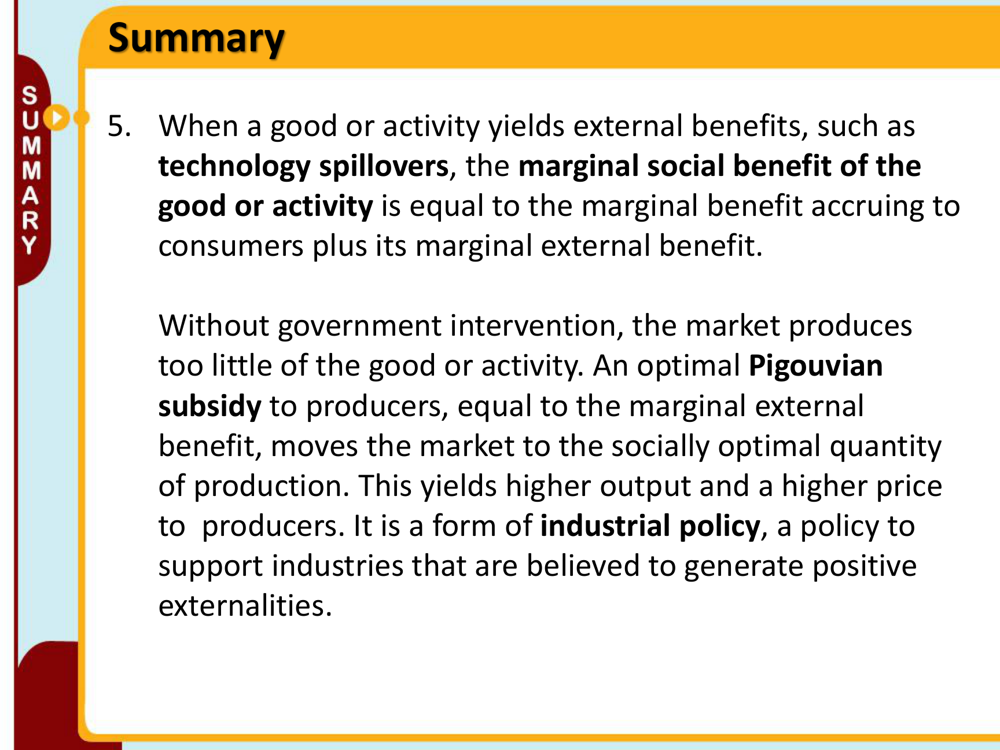

Negative Externalities 中，MSC 高于私人 Marginal Cost，市场产量过高；最优 Pigouvian Tax 等于 Marginal External Cost，并把产量降低到 `Q_OPT`。若无法直接控制外部损害本身，政府也可以控制原始商品或活动的生产量。

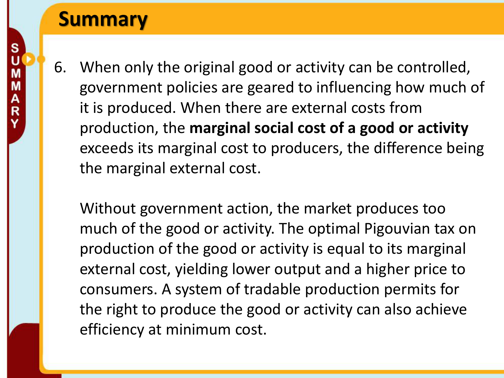

Network Externalities 常见于通信、交通和高科技产品。由于 Positive Feedback，早期市场份额可能自我强化，生产者有动机在市场初期积极扩大网络规模，而这类市场也更容易走向垄断。

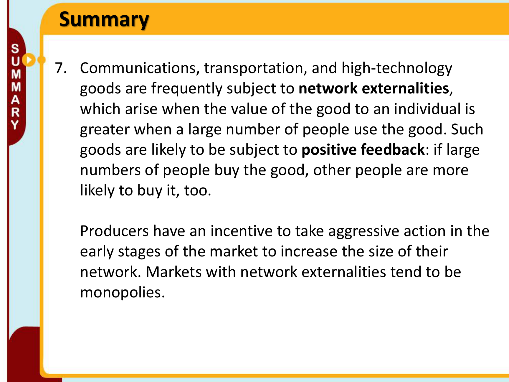

## 9. Key Terms

| Term | 中文对应 | 记忆要点 |
| --- | --- | --- |
| Marginal Social Cost of Pollution | 污染的边际社会成本 | 额外一单位污染给社会造成的额外损害 |
| Marginal Social Benefit of Pollution | 污染的边际社会收益 | 额外一单位污染带来的生产成本节省等收益 |
| Socially Optimal Quantity of Pollution | 污染的社会最优数量 | MSC = MSB |
| External Cost | 外部成本 | 行为给第三方带来的成本 |
| External Benefit | 外部收益 | 行为给第三方带来的收益 |
| Externalities | 外部性 | 第三方影响未体现在市场价格中 |
| Negative Externalities | 负外部性 | 市场通常生产或消费过多 |
| Positive Externalities | 正外部性 | 市场通常生产或消费过少 |
| Coase Theorem | 科斯定理 | 低 Transaction Costs 下私人谈判可达效率 |
| Transaction Costs | 交易成本 | 沟通、法律协议和讨价还价成本 |
| Internalize the Externality | 外部性内部化 | 让决策者考虑其外部成本或收益 |
| Environmental Standards | 环境标准 | 规定行为或排放，通常不够灵活 |
| Emissions Tax | 排放税 | 按污染排放量征税 |
| Pigouvian Tax | 庇古税 | 等于 Marginal External Cost |
| Tradable Emissions Permits | 可交易排放许可证 | 通过许可证市场实现低成本减排 |
| Pigouvian Subsidy | 庇古补贴 | 等于 Marginal External Benefit |
| Technology Spillover | 技术溢出 | 新知识扩散给其他企业带来收益 |
| Positive Feedback | 正反馈 | 成功带来更大成功，失败带来更大失败 |

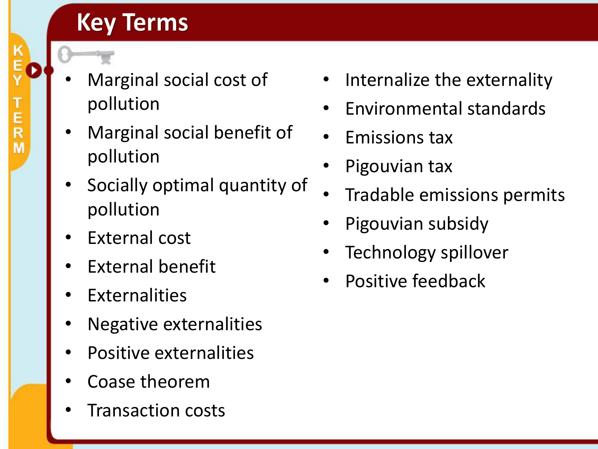

---

# Public Goods and Common Resources

本章讨论如何根据两个核心属性对商品分类：可排他性 (Excludability) 与消费竞争性 (Rivalry in Consumption)。这套分类能帮助我们判断自由市场何时可以有效供给商品，何时会出现 Free-Rider Problem、Overuse 或 Underconsumption，并解释为什么政府干预有时能提高社会福利。

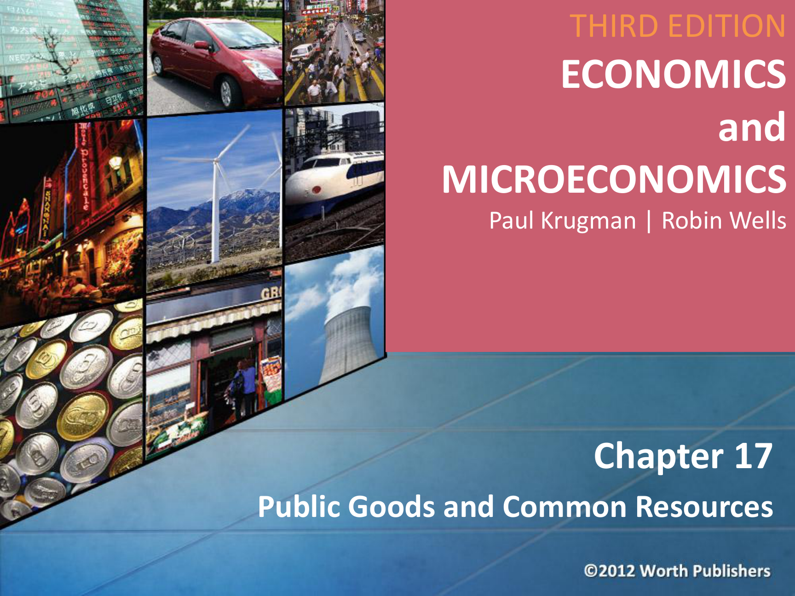
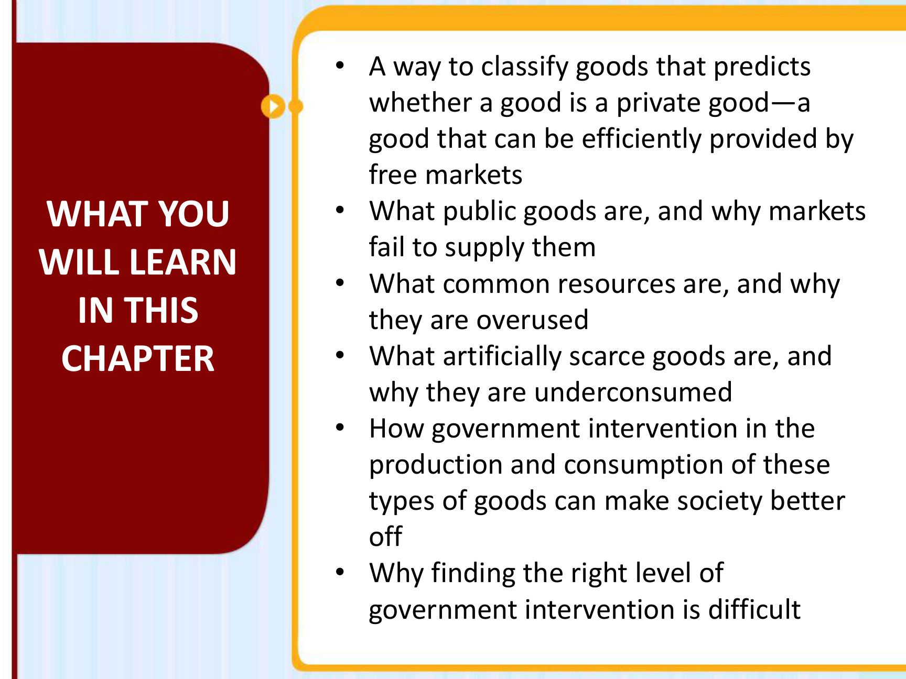

## 1. 为什么不是所有商品都适合由市场供给

安装家里的新浴室与建设城市污水系统，种植小麦与在开放海洋捕鱼，看似都是“生产商品或服务”，但背后的经济属性完全不同。浴室设施和小麦具备市场有效运行所需的特征；公共污水系统和海洋鱼类则没有。

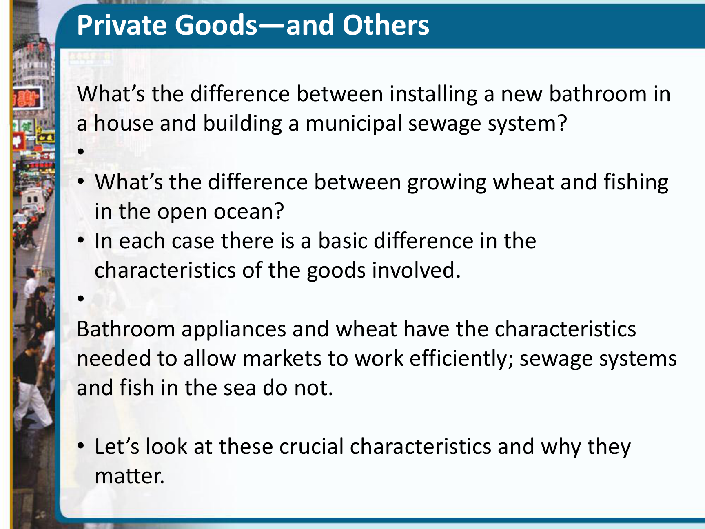

## 2. Excludability 与 Rivalry in Consumption

> [!info] 核心定义：可排他性 (Excludability)
> A good is Excludable if the supplier can prevent people who do not pay from consuming it。若供应者无法阻止未付款者消费，该商品就是不可排他的 (Nonexcludable)。

> [!info] 核心定义：消费竞争性 (Rivalry in Consumption)
> A good is Rival in Consumption if the same unit of the good cannot be consumed by more than one person at the same time。若同一单位商品可以同时被多人消费，则是非竞争性的 (Nonrival in Consumption)。

私人品 (Private Goods) 同时具有 Excludability 和 Rivalry in Consumption；公共品 (Public Goods) 则同时具有 Nonexcludability 和 Nonrivalry in Consumption。

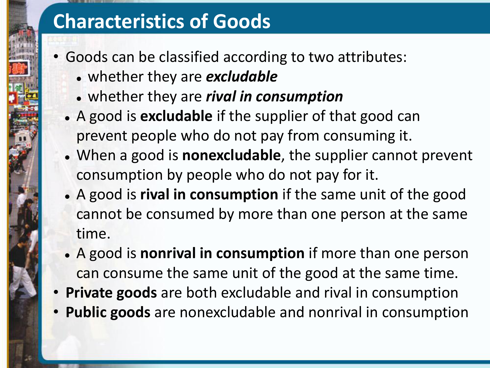

## 3. 四类商品：Private Goods, Public Goods, Common Resources, Artificially Scarce Goods

商品可按两个维度分成四类。

| | Rival in Consumption | Nonrival in Consumption |
| --- | --- | --- |
| Excludable | Private Goods: wheat, bathroom fixtures | Artificially Scarce Goods: pay-per-view movies, computer software |
| Nonexcludable | Common Resources: clean water, biodiversity | Public Goods: public sanitation, national defense |

> [!info] 核心定义：私人品 (Private Goods)
> Private Goods are both Excludable and Rival in Consumption。它们通常可以由竞争性市场有效生产和消费。

> [!info] 核心定义：公共品 (Public Goods)
> Public Goods are Nonexcludable and Nonrival in Consumption，例如 public sanitation、national defense、disease prevention 和 scientific research。

> [!info] 核心定义：公共资源 (Common Resources)
> Common Resources are Nonexcludable but Rival in Consumption，例如 clean water、open-ocean fish 和 biodiversity。

> [!info] 核心定义：人为稀缺品 (Artificially Scarce Goods)
> Artificially Scarce Goods are Excludable but Nonrival in Consumption，例如 pay-per-view movies 和 computer software。

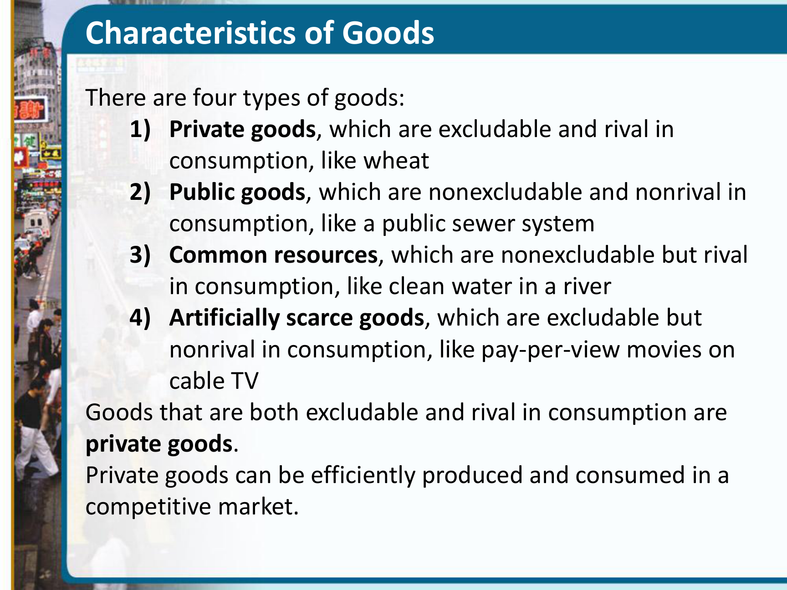
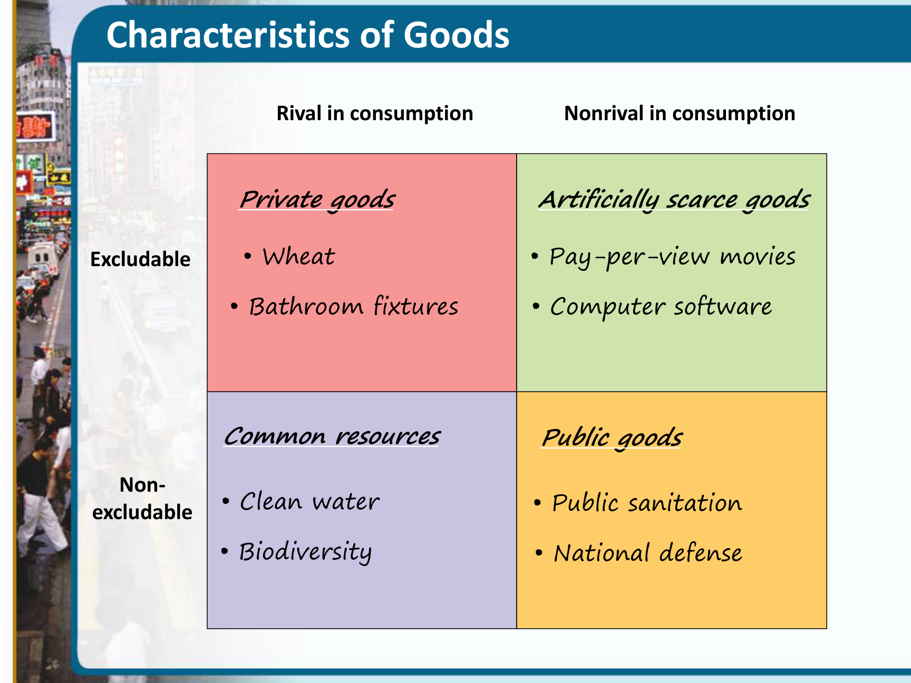

## 4. 为什么市场只能有效供给 Private Goods

当商品 Nonexcludable 时，会出现搭便车问题 (Free-Rider Problem)：个人没有激励为自己的消费付费，而是希望别人付费后自己免费享受。当商品 Nonrival in Consumption 时，额外一个人消费的边际成本为零，因此有效率价格应为零；若为了补偿生产者成本而收取正价格，就会导致消费不足。

> [!info] 核心定义：搭便车问题 (Free-Rider Problem)
> Free-Rider Problem 指消费者因无法被排除在消费之外而不愿付费，期待“搭别人付费的便车”。它是 Public Goods 私人供给不足的核心原因。

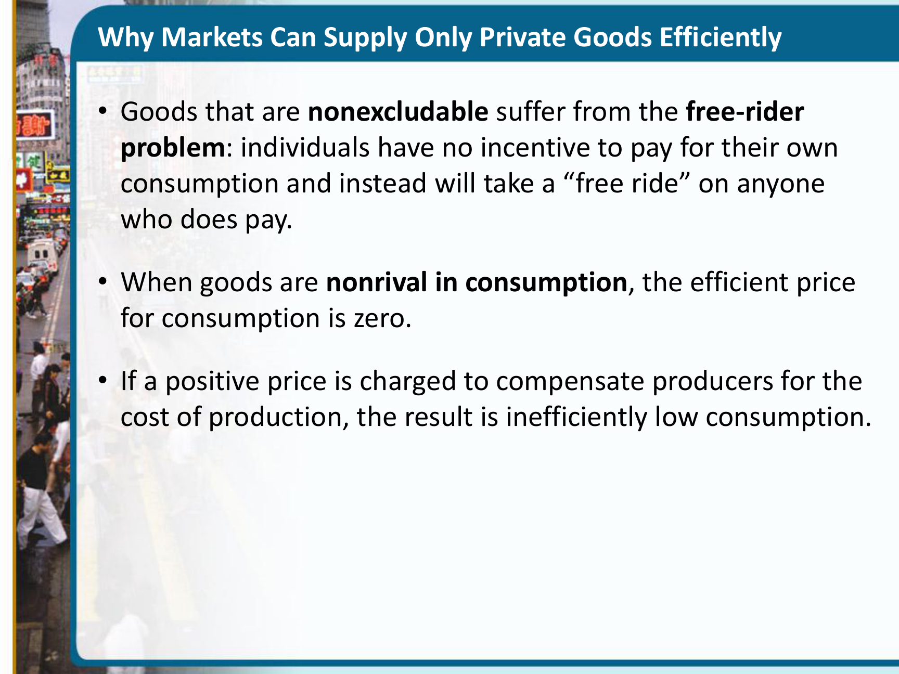

## 5. Public Goods：非排他且非竞争

Public Goods 是 Private Goods 的反面：无法排除未付费者，同时一个人的消费不减少其他人的消费。疾病预防 (Disease Prevention)、国防 (National Defense) 和科学研究 (Scientific Research) 都是典型公共品。医生在疫情早期控制传播，保护的不只是付费患者，而是更大范围内的人群；国防保护所有公民；知识进步也会广泛惠及社会。

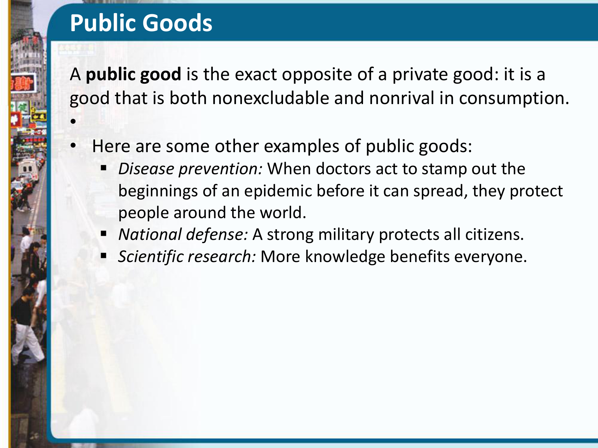

由于私人部门供给 Public Goods 通常存在严重缺陷，公共品多数需要政府提供，并通过税收融资。公共品的有效供给量由边际社会收益 (Marginal Social Benefit, MSB) 与边际成本 (Marginal Cost, MC) 决定。

> [!info] 核心定义：公共品的 Marginal Social Benefit
> 对 Public Goods 来说，额外一单位公共品可同时被所有人消费，因此 MSB 等于所有消费者个人 Marginal Benefit 的垂直加总 (Vertical Sum)。

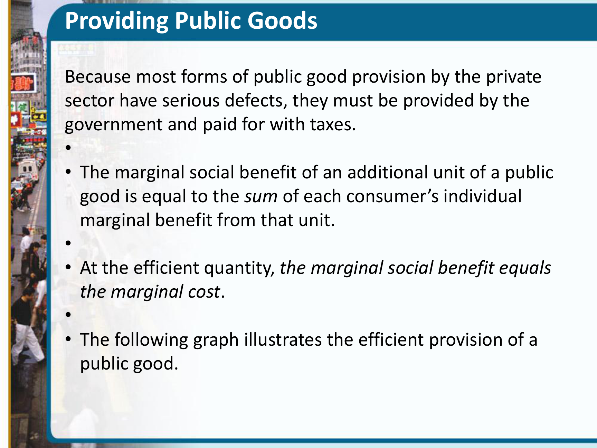

课件用每月街道清扫次数说明 Public Good 的有效供给。Ted 和 Alice 各自有一条个人 Marginal Benefit 曲线；社会对某一额外清扫次数的总收益，是 Ted 与 Alice 对该次清扫的收益之和。

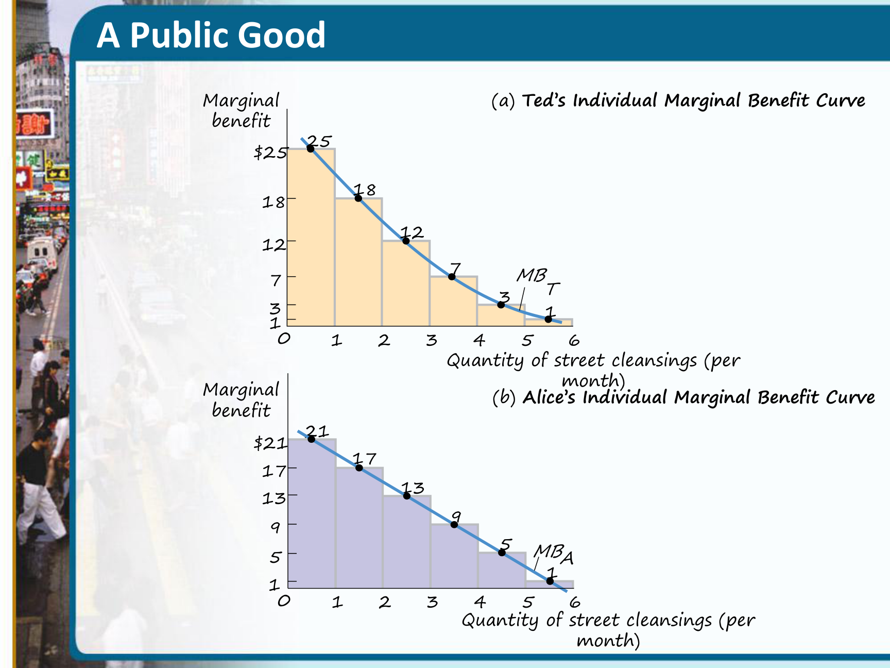

若 MC 恒定为 6 美元，社会应选择每月 5 次清扫。因为从 4 次增加到 5 次时，MSB 为 8 美元，高于 MC；但从 5 次增加到 6 次时，MSB 只有 2 美元，低于 MC。因此有效供给量是 MSB 与 MC 相等或最后一个 MSB 不低于 MC 的数量。

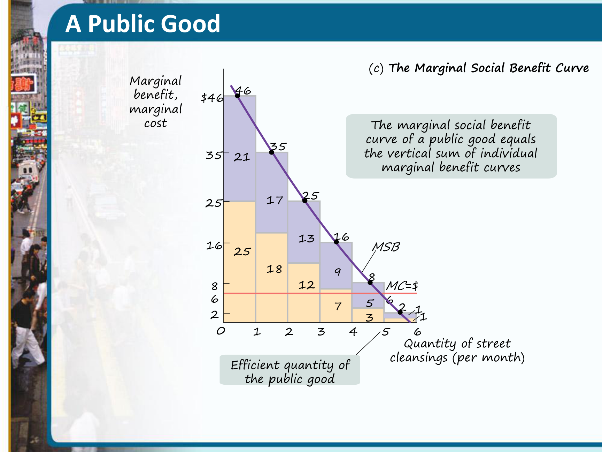

单个消费者没有激励独自支付 Public Good 的有效数量，因为任何一个人的个人 Marginal Benefit 都低于 MSB。这正是政府存在的重要理由之一：政府可以通过税收把分散收益集中起来，为社会提供有效数量的 Public Goods。

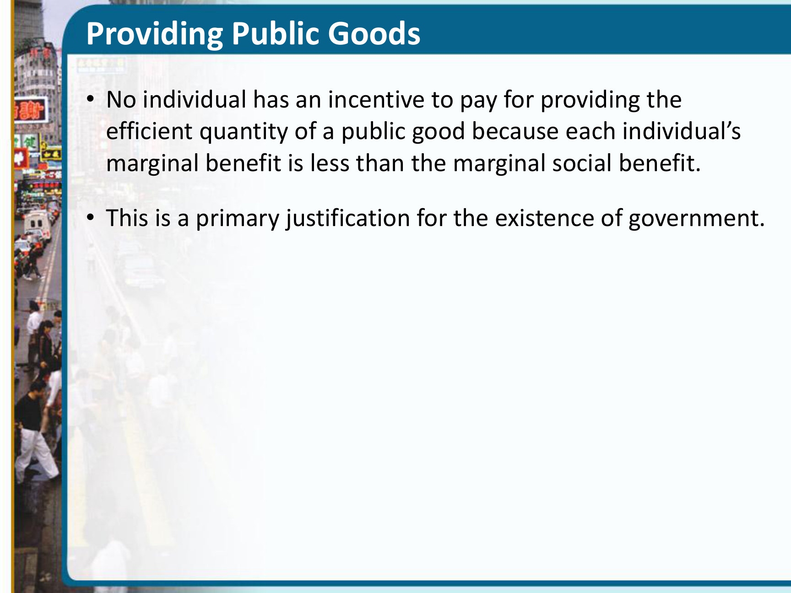

## 6. Cost-Benefit Analysis：政府如何决定供给多少

> [!info] 核心定义：成本收益分析 (Cost-Benefit Analysis)
> Cost-Benefit Analysis 是政府估计提供公共品的社会成本与社会收益，并据此决定供给数量的方法。

虽然政府应依赖 Cost-Benefit Analysis 决定 Public Goods 的供给量，但实际操作很难。原因之一是个人在调查中可能夸大公共品对自己的价值，尤其是在他们不需要按真实估值立即付费时。

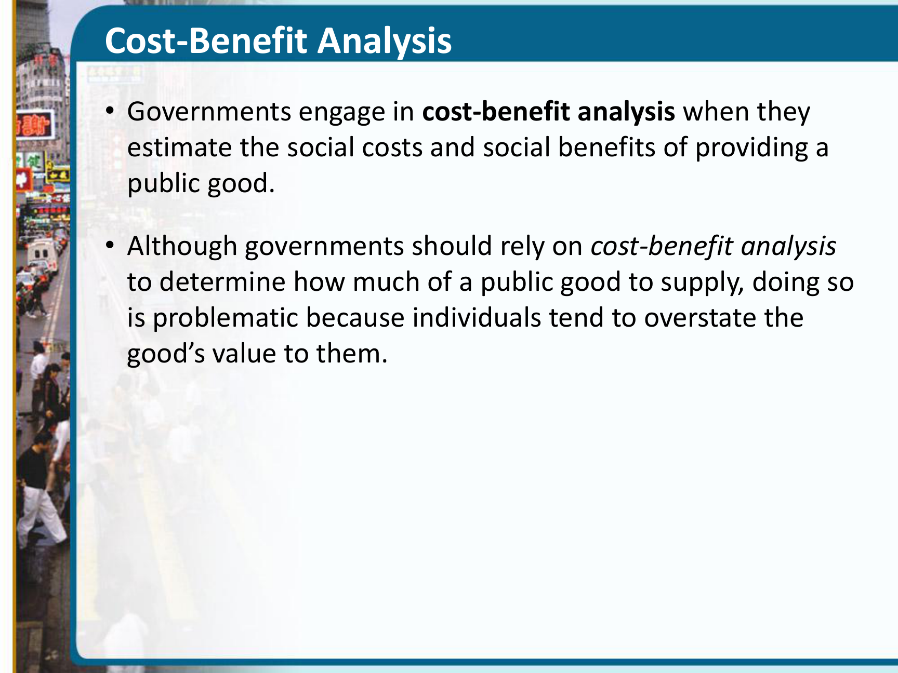

## 7. Common Resources 与 Overuse

> [!info] 核心定义：公共资源 (Common Resource)
> Common Resource 是 Nonexcludable and Rival in Consumption。别人很难阻止我消费它，但我消费得越多，留给其他人的数量越少。

清洁空气、河流中的清洁水、生物多样性和开放海洋中的鱼类都具有 Common Resource 的特征。问题在于，资源虽然有消费竞争性，却不可排他，所以个人使用者不会充分考虑自己对其他人造成的资源减少。

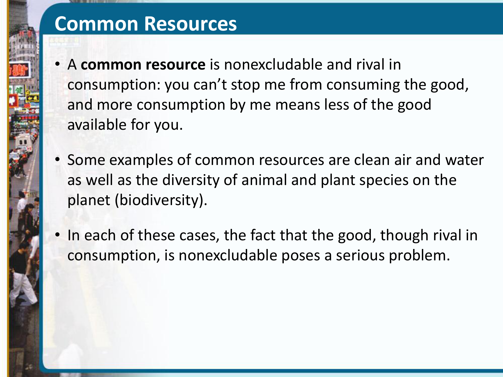

> [!info] 核心定义：过度使用 (Overuse)
> Overuse occurs when a user depletes the amount of the common resource available to others but does not take this cost into account when deciding how much to use the common resource。

Common Resources 的 Overuse 类似 Negative Externality。使用者的个人 Marginal Cost 低于 Marginal Social Cost，因为个人成本没有包括对其他使用者造成的资源耗竭成本。因此，未监管市场中的资源使用量 `Q_MKT` 会超过有效率数量 `Q_OPT`。

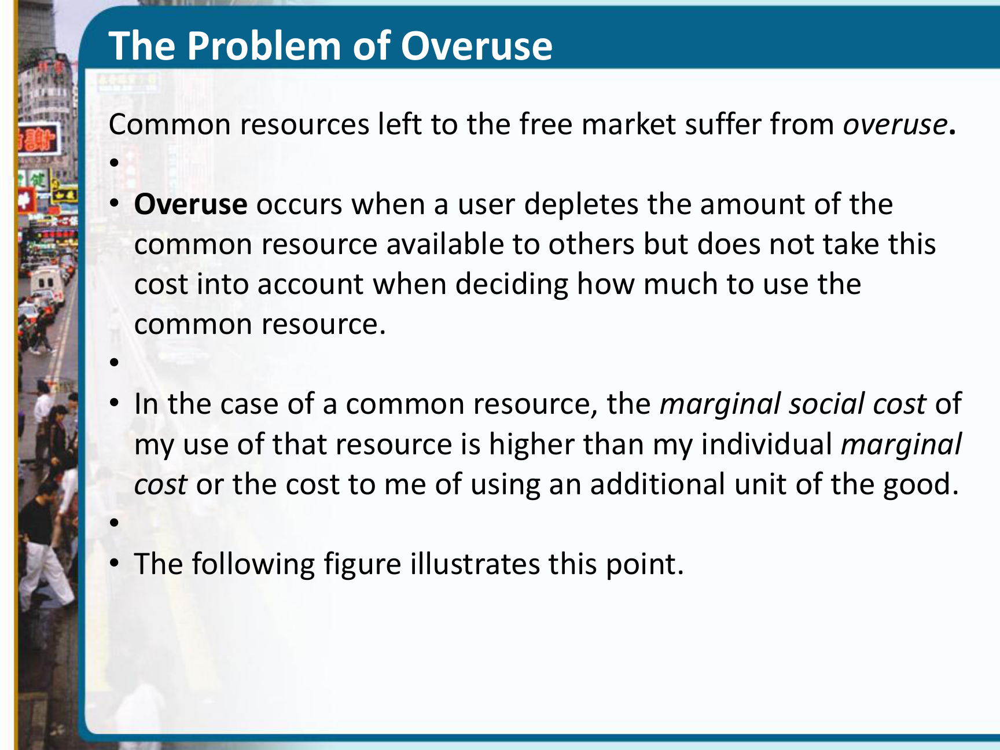
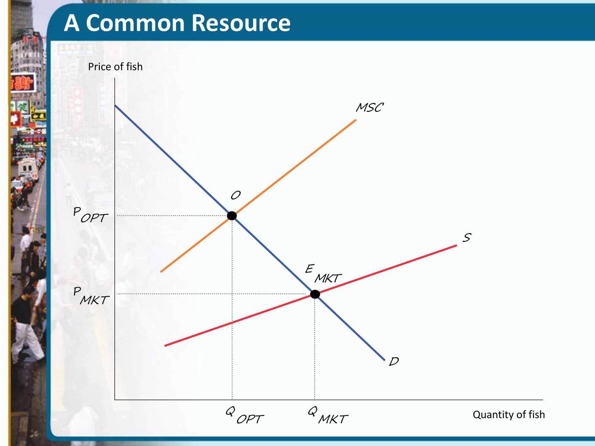

## 8. 如何有效管理 Common Resources

有效管理 Common Resource 的核心，是让个体使用者考虑其行为对其他使用者造成的成本。政策工具包括：

| Policy Tool | 中文解释 | Economic Logic |
| --- | --- | --- |
| Tax on use | 对资源使用征税 | 类似 Pigouvian Tax，让使用者面对 MSC |
| Regulation | 对使用量或行为进行管制 | 直接限制过度使用 |
| Property Rights | 赋予产权，使资源 Excludable | 让所有者有激励维护资源价值 |
| Tradable Licenses | 建立可交易使用许可证 | 限制总使用量，并让使用权流向价值最高者 |

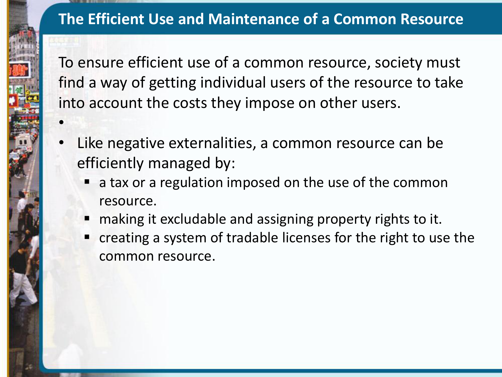

## 9. Artificially Scarce Goods：非竞争却被排他

> [!info] 核心定义：人为稀缺品 (Artificially Scarce Good)
> Artificially Scarce Good is Excludable but Nonrival in Consumption。由于 Nonrival，额外一个人消费的 Marginal Cost 为零；但由于 Excludable，卖方可以收取正价格，从而导致消费不足。

付费点播电影和软件都属于 Artificially Scarce Goods。一旦电影或软件已经被生产出来，允许多一个人观看或使用的边际成本接近零；但生产者为了回收固定成本，会设置正价格，这使一部分愿意消费且边际成本为零的消费者被排除在外。

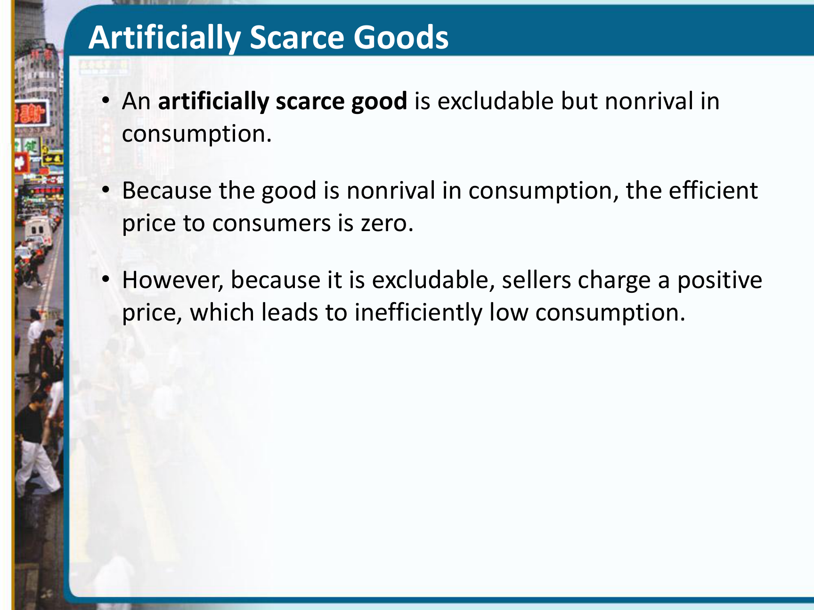
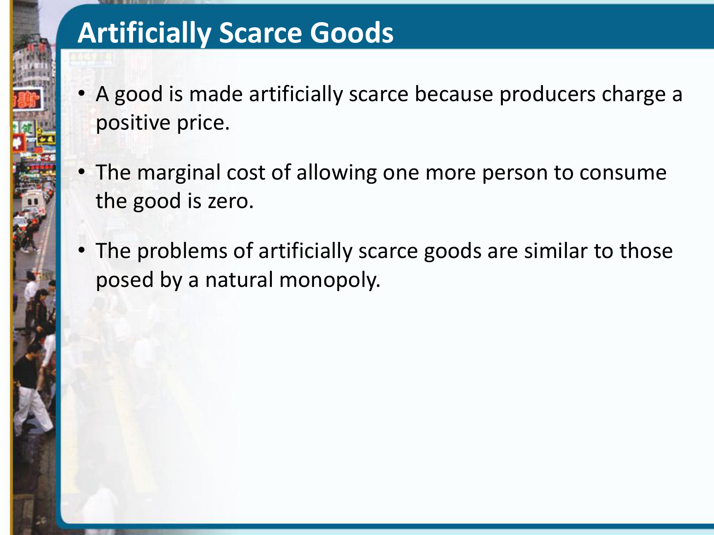

课件的 pay-per-view movie 图说明：市场价格为 4 美元时，需求量为 `Q_MKT`；但由于额外一人观看的 MC = 0，有效率价格应为 0，对应更高的消费量 `Q_OPT`。正价格导致 `Q_MKT < Q_OPT`，阴影部分是 Deadweight Loss。

> [!warning] 考点：Artificially Scarce Goods 与 Natural Monopoly
> Artificially Scarce Goods 的问题类似自然垄断 (Natural Monopoly)：生产有固定成本，但额外消费的边际成本很低或为零。正价格能补偿生产者，却会造成低效率的消费不足。

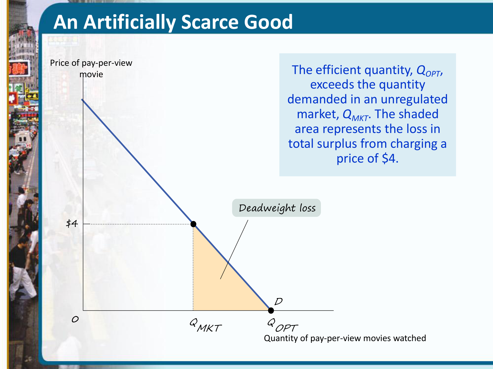

## 10. 本章总结

商品分类取决于是否 Excludable 与是否 Rival in Consumption。Private Goods 同时可排他且消费竞争，竞争市场通常能有效供给。Nonexcludable 会导致 Free-Rider Problem，从而使生产不足；Nonrival in Consumption 意味着有效价格为零，任何正价格都可能导致消费不足。

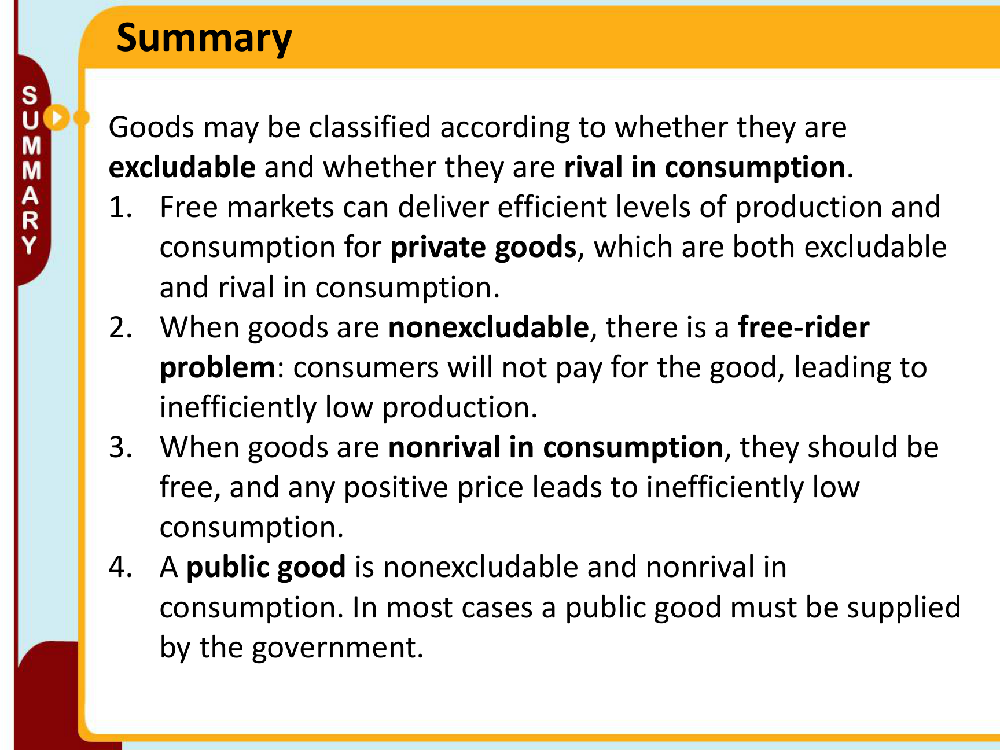

Public Goods 的有效数量满足 MSB = MC。由于 MSB 是所有个人 Marginal Benefit 的加总，任何单个消费者的收益都低于社会总收益，因此个人不会自愿提供有效数量。政府通过税收提供 Public Goods，是政府存在的重要经济理由之一。

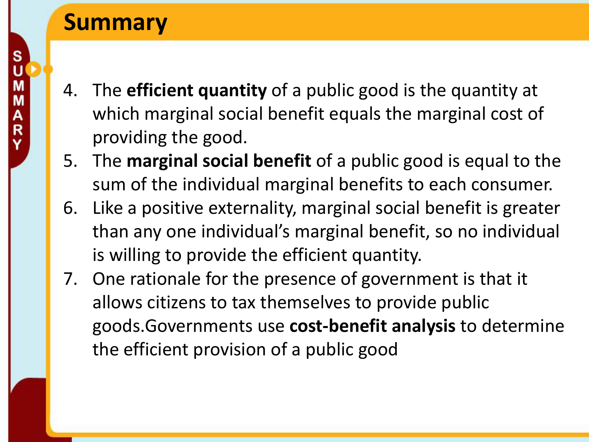

Common Resources 是 Rival but Nonexcludable，因此容易 Overuse。它的问题类似 Negative Externality：个人使用的 Marginal Social Cost 高于个人 Marginal Cost。可行政策包括 Pigouvian Taxes、Tradable Licenses 和 Property Rights。

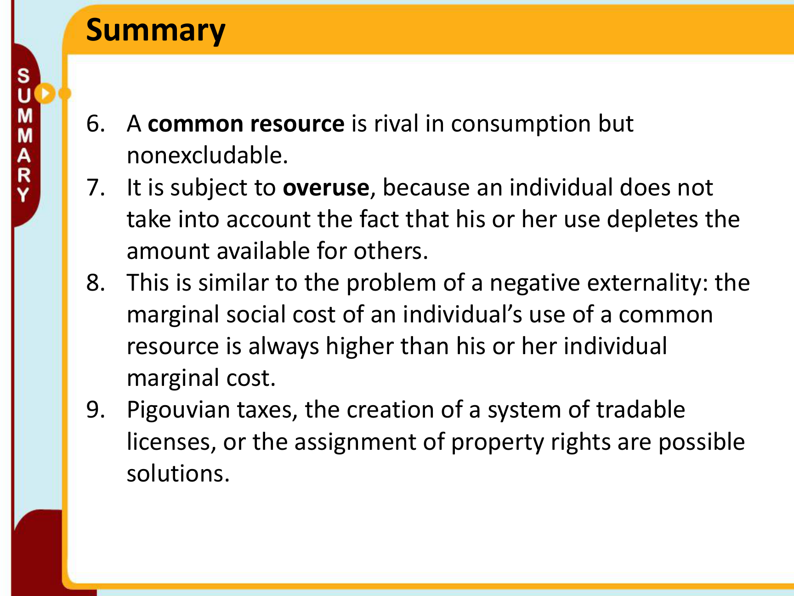

Artificially Scarce Goods 是 Excludable but Nonrival in Consumption。由于额外消费没有 Marginal Cost，有效率价格应为零；但正价格又常用于补偿生产固定成本，于是市场消费量低于社会最优。

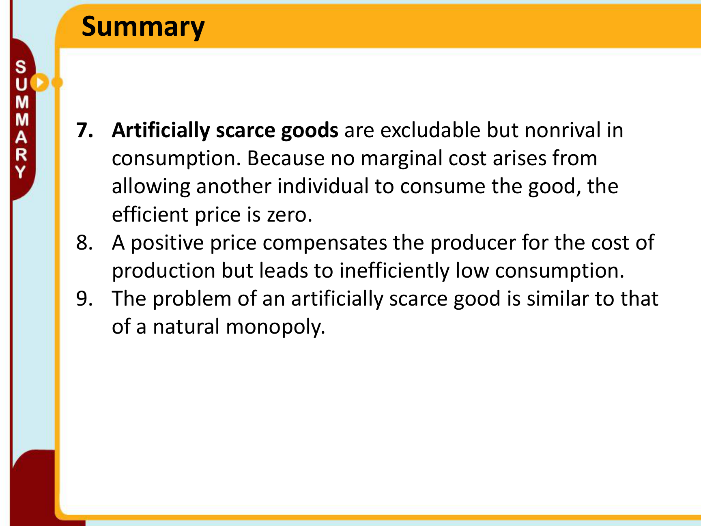

## 11. Key Terms

| Term | 中文对应 | 记忆要点 |
| --- | --- | --- |
| Excludable | 可排他 | 可阻止未付费者消费 |
| Rival in Consumption | 消费竞争性 | 同一单位无法同时被多人消费 |
| Private Good | 私人品 | Excludable and Rival |
| Nonexcludable | 不可排他 | 无法阻止未付费者消费 |
| Nonrival in Consumption | 消费非竞争性 | 多人可同时消费同一单位 |
| Free-Rider Problem | 搭便车问题 | Nonexcludable 导致无人愿意付费 |
| Public Good | 公共品 | Nonexcludable and Nonrival |
| Cost-Benefit Analysis | 成本收益分析 | 政府估算公共品社会收益与成本 |
| Common Resource | 公共资源 | Nonexcludable but Rival |
| Overuse | 过度使用 | 个人不考虑资源消耗给他人造成的成本 |
| Artificially Scarce Good | 人为稀缺品 | Excludable but Nonrival，正价格导致消费不足 |
| Marginal Social Benefit (MSB) | 边际社会收益 | 公共品中等于个人 MB 的垂直加总 |
| Marginal Social Cost (MSC) | 边际社会成本 | Common Resource 中高于个人 MC |
| Tradable Licenses | 可交易许可证 | 用市场机制分配资源使用权 |
| Property Rights | 产权 | 使资源 Excludable 并改善维护激励 |

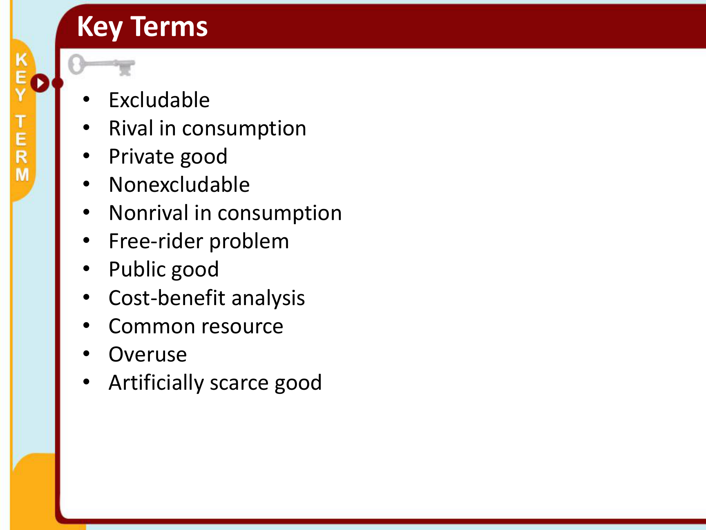
