# Chapter 3: Supply and Demand (供给与需求)

## 本章学习目标 (What You Will Learn)

> [!info] 本章核心目标
> 1. 理解什么是竞争性市场 (Competitive Market) 以及 Supply and Demand Model 如何描述它
> 2. 掌握 Demand Curve 和 Supply Curve 的含义与形态
> 3. 区分 **Movement Along a Curve（沿曲线移动）** 与 **Shift of a Curve（曲线移动）**
> 4. 理解 Supply and Demand 如何决定 **Equilibrium Price（均衡价格）** 与 **Equilibrium Quantity（均衡数量）**
> 5. 掌握 Shortage（短缺）或 Surplus（过剩）如何推动价格回归均衡

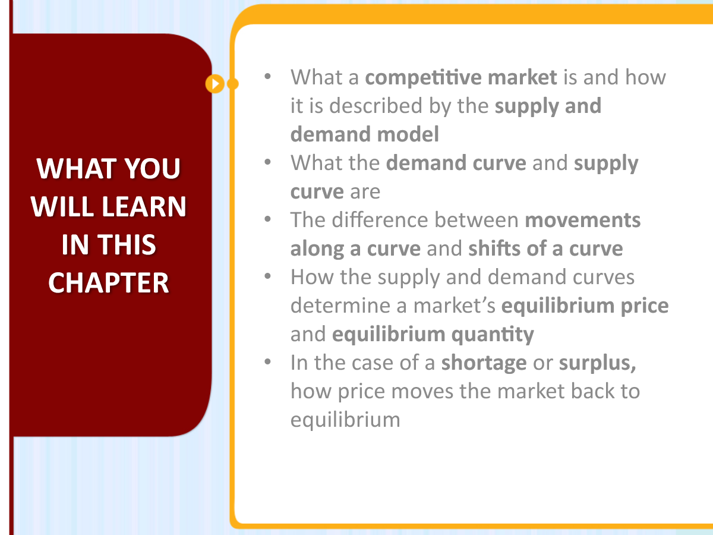

---

## 1. 竞争性市场与供需模型 (Competitive Market & Supply-Demand Model)

> [!info] 竞争性市场 (Competitive Market)
> 一个 **竞争性市场 (Competitive Market)** 具备以下特征：
> - **Many buyers and sellers**（众多买者和卖者）——没有任何单个参与者可以影响市场价格
> - **Same good or service**（同质化的商品或服务）
>
> **Supply and Demand Model** 是描述竞争性市场如何运作的核心模型。

该模型包含五个关键要素：

| 要素 | 英文术语 |
|------|----------|
| 需求曲线 | Demand Curve |
| 供给曲线 | Supply Curve |
| 需求与供给曲线的移动 | Demand and Supply Curve Shifts |
| 市场均衡 | Market Equilibrium |
| 市场均衡的变化 | Changes in Market Equilibrium |

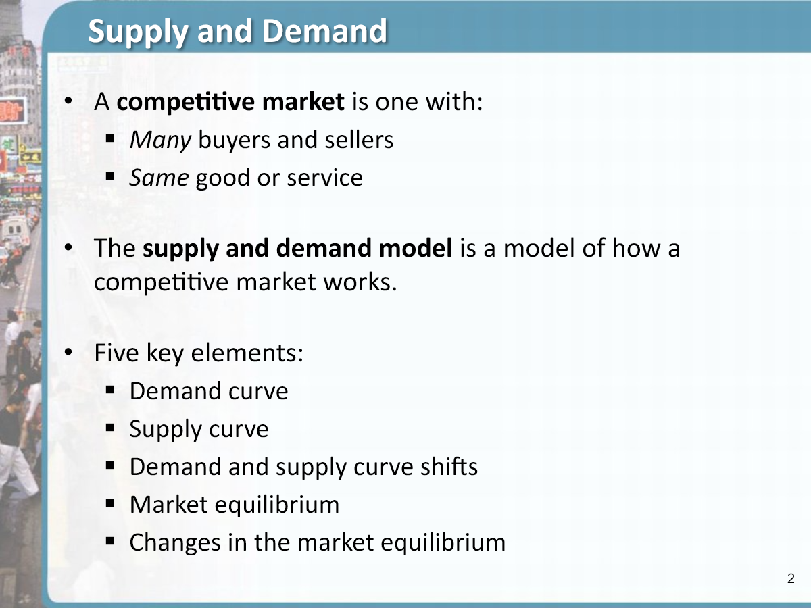

---

## 2. 需求 (Demand)

### 2.1 需求表 (Demand Schedule)

> [!info] 需求表 (Demand Schedule)
> **Demand Schedule** 是一张表格，展示了消费者在不同价格水平下愿意购买的商品或服务的数量（Quantity Demanded）。

教授在课堂上建议通过询问学生自身的 **购买意愿 (Willingness to Pay)** 来引出这一概念——例如 iPhone、iPod、电影票等学生熟悉的商品。不同学生对同一商品有不同的 Willingness to Pay，而且这个意愿会随价格变化而改变。

> [!question] 课堂练习 (Class Exercise)
> 选择你经常购买的一种商品或服务，建立你自己的 Demand Schedule，标明在不同价格下你愿意购买的数量。
>
> 思考：当价格上涨时，你的 Quantity Demanded 会发生什么变化？

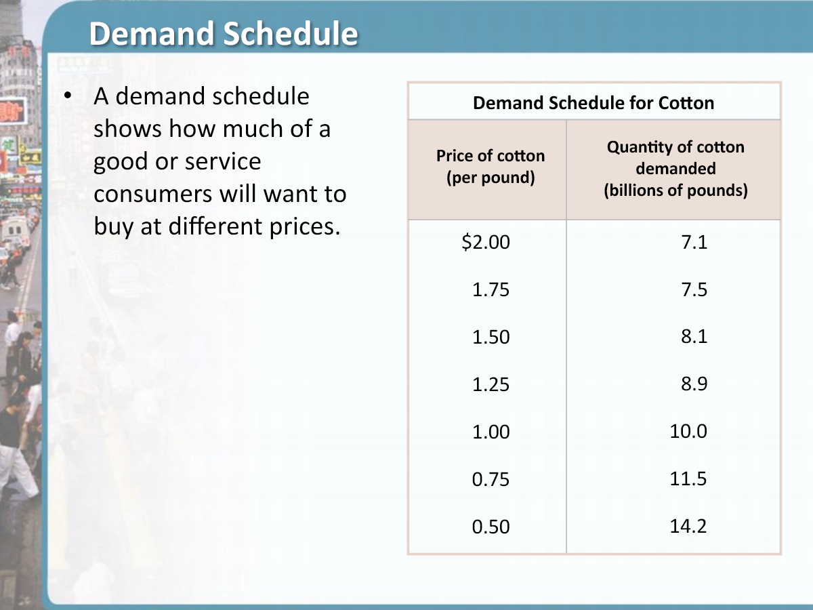

### 2.2 需求曲线 (Demand Curve) 与需求定律 (Law of Demand)

> [!info] 需求曲线 (Demand Curve)
> **Demand Curve** 是 Demand Schedule 的图形化表示，显示了在任何给定价格下消费者想要购买的数量。

> [!warning] 需求定律 (Law of Demand)
> **Law of Demand（需求定律）**：在其他条件不变 (Ceteris Paribus) 的情况下，**价格上升 → 需求量下降，价格下降 → 需求量上升**。因此，Demand Curve 是 **向下倾斜 (Downward Sloping)** 的。

这一规律反映的是价格 (Price) 与需求量 (Quantity Demanded) 之间的**反向关系 (Inverse Relationship)**：一个上升，另一个就下降。

#### 棉花需求数据示例 (Demand Schedule for Cotton)

| Price of Cotton (per pound) | Quantity of Cotton Demanded (billions of pounds) |
|---|---|
| $2.00 | 7 |
| $1.75 | 9 |
| $1.50 | 11 |
| $1.25 | 13 |
| $1.00 | 15 |
| $0.75 | 17 |
| $0.50 | — |

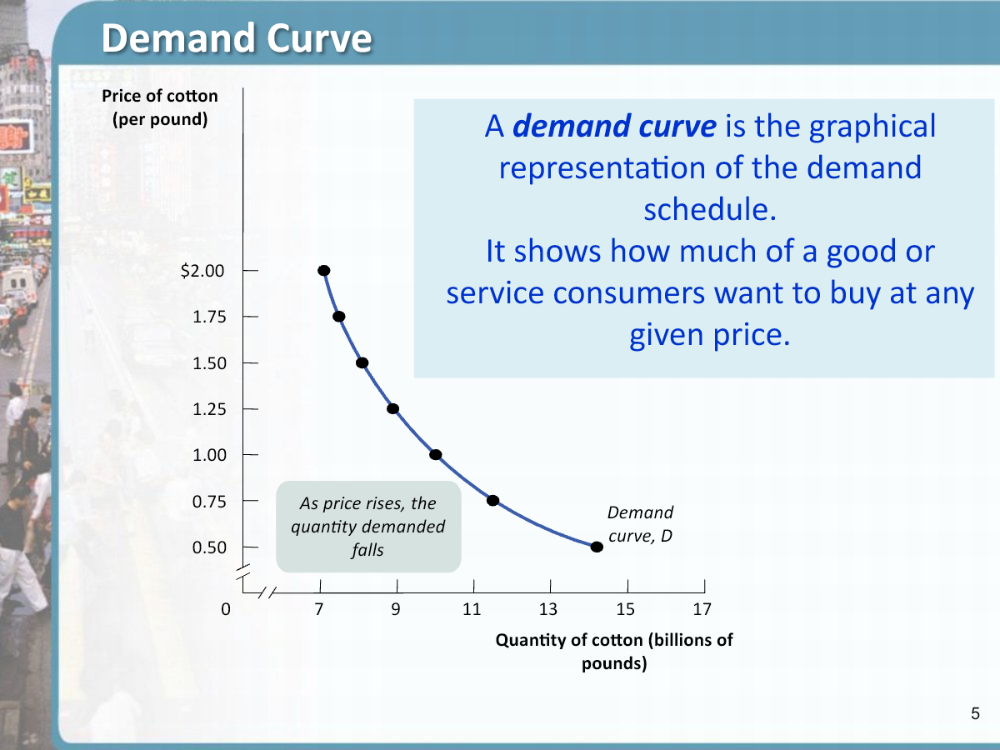

#### 🌍 全球案例：付更多钱，加更少油

由于高税收，大多数欧洲国家的汽油和柴油价格是美国的两倍多。根据 Law of Demand，欧洲人应该比美国人消费更少的汽油——事实也确实如此：欧洲人的人均燃料消费量不到美国人的一半，主要是因为他们开更小、更省油的车。

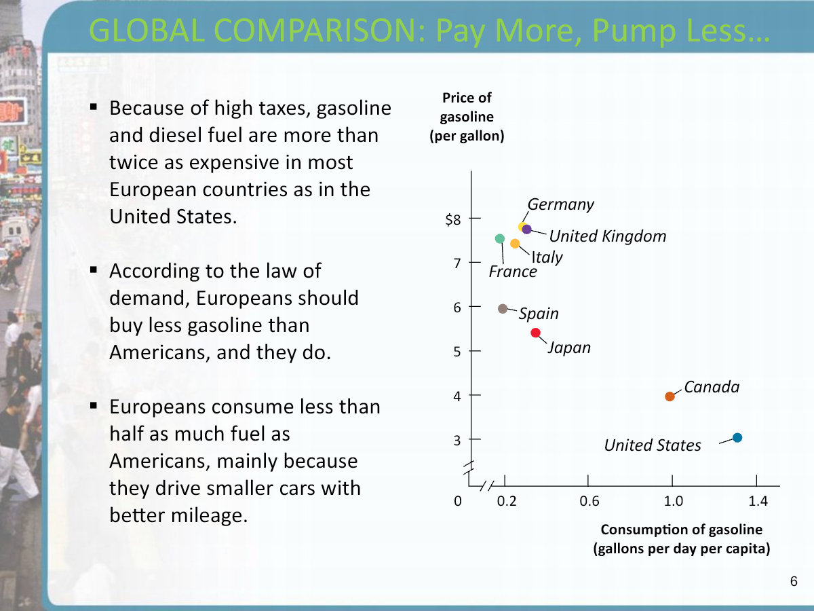

### 2.3 需求的增加 (An Increase in Demand)

当人口增长等因素导致需求增加时，在**任何给定价格下**需求量都上升了。这体现为两张不同的 Demand Schedule（例如 2007 年和 2010 年），以及对应的 Demand Curve 的右移。

> [!info] 需求曲线的移动 (Shift of the Demand Curve)
> **Shift of the Demand Curve** 是指在任何给定价格下，需求量发生变化的整体平移——原 Demand Curve 移动到新位置，形成一条新的 Demand Curve。

#### 对比数据：Demand Schedules for Cotton (2007 vs. 2010)

| Price of Cotton (per pound) | Quantity Demanded in 2007 (billions of lbs) | Quantity Demanded in 2010 (billions of lbs) |
|---|---|---|
| $2.00 | 7.1 | 8.5 |
| $1.75 | 7.5 | 9.0 |
| $1.50 | 8.1 | 9.7 |
| $1.25 | 8.9 | 10.7 |
| $1.00 | 10.0 | 12.0 |
| $0.75 | 11.5 | 13.8 |
| $0.50 | 14.2 | 17.0 |

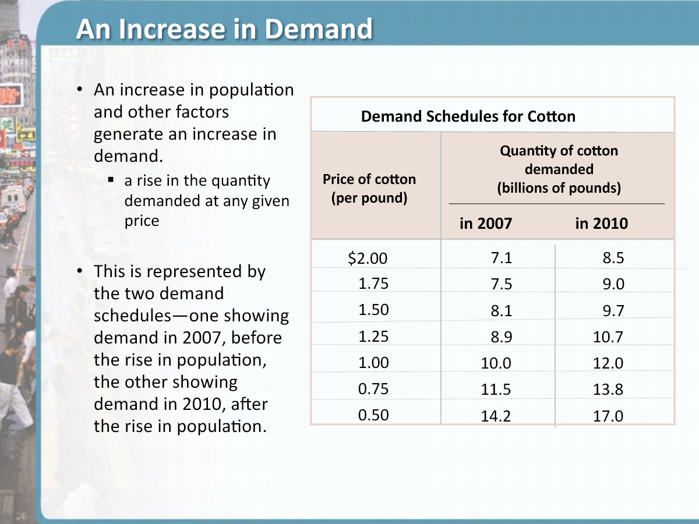
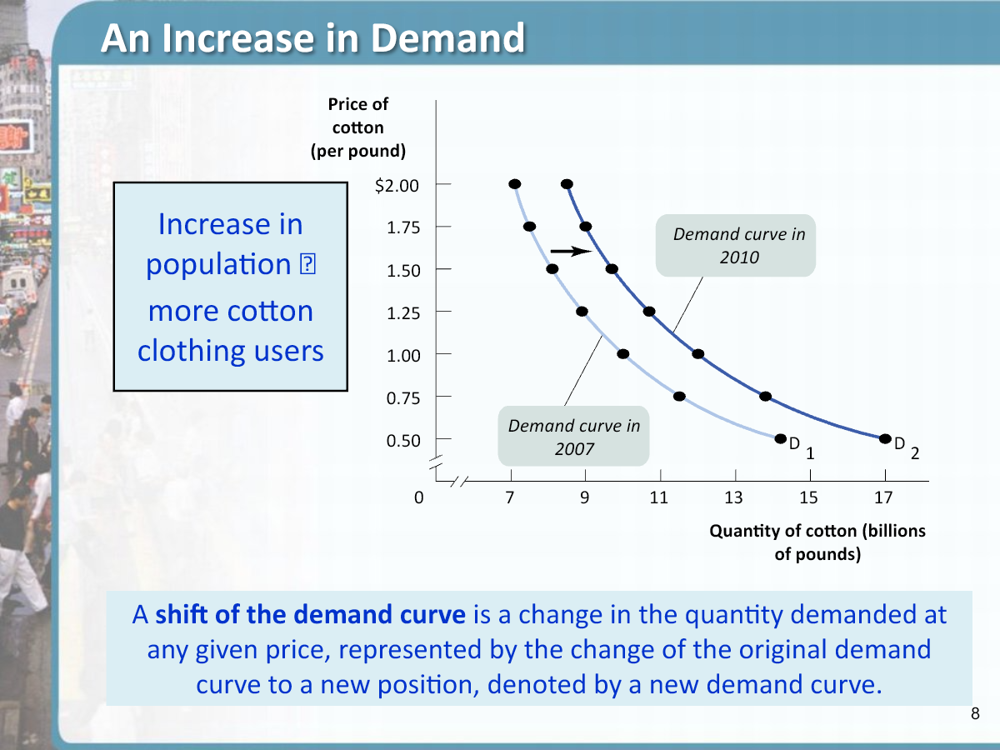

### 2.4 沿需求曲线的移动 vs. 需求曲线的移动 (Movement Along vs. Shift)

这是本章**最关键的区分之一**。教授反复强调，学生必须能够区分 "Shift"（移动）与 "Movement Along"（沿曲线移动）。

> [!warning] 核心区分规则
> - **Movement Along the Demand Curve**：由商品**自身价格变化**引起 → 沿同一条 Demand Curve 上下移动（例如从 A 点到 B 点）
> - **Shift of the Demand Curve**：由**外部因素 (Exogenous Variables)** 变化引起 → 整条曲线平移至新位置（例如从 A 点到 C 点）
>
> 通俗法则：坐标轴上的变量变化 → Movement Along；外部冲击（Ceteris Paribus 中被假定不变的变量）变化 → Shift。

在日常对话中，即使经济学家也经常混用 "Demand" 和 "Quantity Demanded"。但在经济分析中，必须严格区分：
- **Change in Quantity Demanded** → Movement Along the Demand Curve
- **Change in Demand** → Shift of the Demand Curve

> [!question] 课堂练习 (Class Exercise)
> 1. 一罐可乐的价格从 $1 涨到 $3。这是 Movement Along 还是 Shift of the Demand Curve？为什么？
> 2. 一项新科学研究证明，经常喝可乐的人平均寿命延长 5 年。这会导致 Movement Along 还是 Shift of the Demand Curve？为什么？
>
> *请用图形辅助说明，并互相批改答案。*

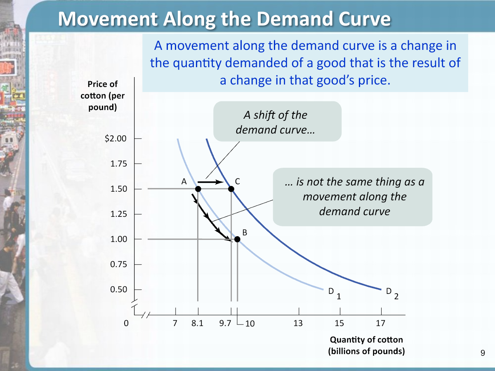

### 2.5 需求曲线的移动方向 (Shifts of the Demand Curve)

> [!info] 需求增加与减少
> - **Increase in Demand（需求增加）** = Demand Curve 向右移动 (Rightward Shift, D₁ → D₂)：在任何给定价格下，消费者需求量更大
> - **Decrease in Demand（需求减少）** = Demand Curve 向左移动 (Leftward Shift, D₁ → D₃)：在任何给定价格下，消费者需求量更小

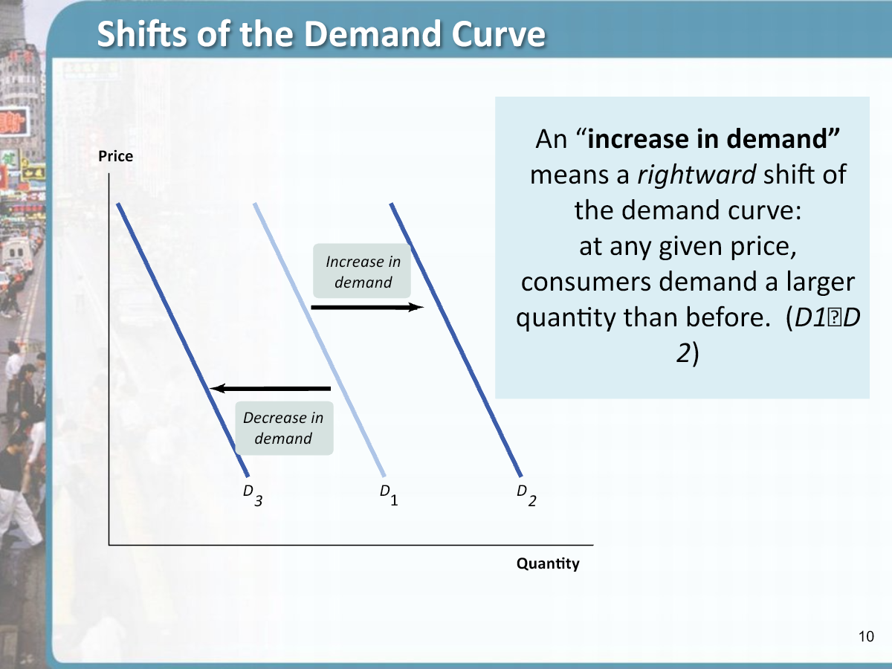

### 2.6 导致需求曲线移动的五大因素

#### (1) 相关商品价格的变化 (Changes in the Prices of Related Goods)

> [!info] 替代品 (Substitutes)
> 两种商品是 **Substitutes（替代品）**，如果一种商品价格下降会使消费者**减少**对另一种商品的购买意愿。
>
> *例：茶和咖啡 (Tea & Coffee)、米饭和面条 (Rice & Noodles)、麦当劳和肯德基 (McDonald's & KFC)、松饼和甜甜圈 (Muffins & Donuts)*

> [!info] 互补品 (Complements)
> 两种商品是 **Complements（互补品）**，如果一种商品价格下降会使消费者**增加**对另一种商品的购买意愿。
>
> *例：面包和果酱 (Bread & Jam)、汽车和汽油 (Cars & Petrol)、智能手机和移动网络服务 (Smartphones & Mobile Internet Service)*

> [!question] 课堂练习 (Class Exercise)
> 1. 壁球 (Squash Balls) 价格急剧上涨会对壁球拍 (Squash Racquets) 的需求产生什么影响？为什么？
> 2. 百事可乐 (Pepsi) 价格急剧上涨会对可口可乐 (Coke) 的需求产生什么影响？为什么？
>
> *有趣案例：马萨诸塞州关于建造赌场的辩论中，反对者认为建赌场会导致州彩票收入下降。这就是 Substitutes 的一个实例（尽管预计收入仅下降约 6%）。*

#### (2) 收入的变化 (Changes in Income)

> [!info] 正常品 (Normal Good)
> 当收入增加导致对某种商品的需求增加时，该商品称为 **Normal Good（正常品）**——这是最常见的情况。

> [!info] 劣质品 (Inferior Good)
> 当收入增加导致对某种商品的需求减少时，该商品称为 **Inferior Good（劣质品）**。
>
> *例：方便面 (Instant Noodles)——当收入上升时，人们会减少购买*

#### (3) 消费者数量的变化 (Changes in the Number of Consumers)

市场中消费者数量增加 → 需求增加 (Demand Curve 右移)。

#### (4) 预期的变化 (Changes in Expectations)

如果消费者预期未来价格上涨 → 当前需求增加；预期价格下跌 → 当前需求减少。

#### (5) 品味的变化 (Changes in Tastes)

社会潮流、时尚和偏好的变化会直接影响需求。

> [!question] 课堂练习 (Class Exercise)
> 1. 随着 Talya 收入增加，她买的方便面变少了。方便面对 Talya 属于什么类型的商品？
> 2. 继 David Beckham 和 Sting 之后，越来越多男性开始追随穿裙子的时尚。这种品味变化对裙子的需求会有什么影响？
> 3. 科学家宣布 5 年内海洋中将不再有鱼类。这一声明对寿司 (Sushi) 的需求会有什么影响？

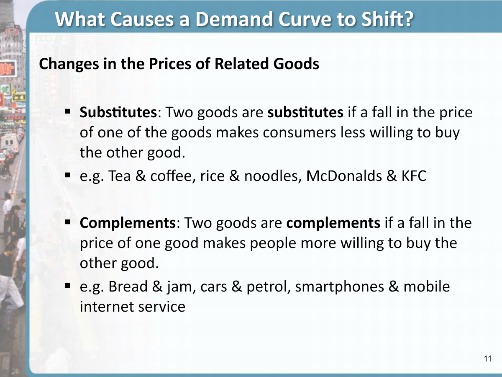
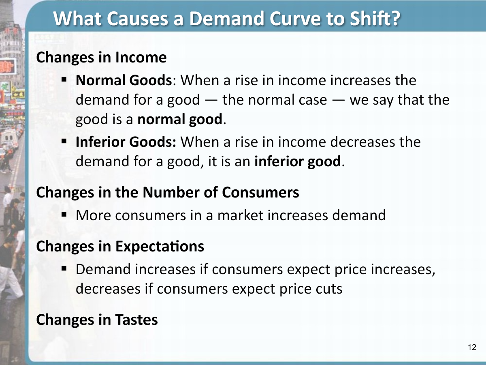

### 2.7 个人需求曲线与市场需求曲线 (Individual Demand Curve & Market Demand Curve)

> [!info] 市场需求曲线 (Market Demand Curve)
> **Market Demand Curve** 是市场中所有消费者的 Individual Demand Curves 的**水平加总 (Horizontal Sum)**。

例如，Darla 和 Dino 是牛仔裤市场中仅有的两个消费者。在任何给定价格下，市场的需求量是 Darla 和 Dino 各自需求量的总和：
- Darla 在 $30/条时购买 3 条
- Dino 在 $30/条时购买 2 条
- 市场总需求 = 3 + 2 = 5 条

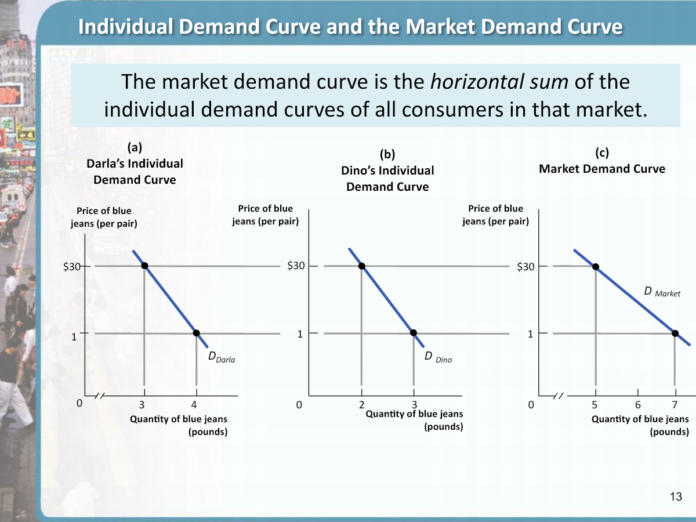

---

## 3. 经济学在行动：缓解交通拥堵 (ECONOMICS IN ACTION: Beating the Traffic)

交通拥堵不仅减慢通行速度、浪费时间，还加剧空气污染。城市如何减少交通拥堵？

将**开车进入市中心**视为一种人们消费的商品/服务（Good or Service），就可以用 Demand 经济学来分析反拥堵政策：

- **降低替代品的价格**：许多大都市补贴公交和铁路服务，吸引通勤者转向其他交通方式
- **提高停车成本**：几个城市对停车征收高额税费、限制停车时长——既能增加收入，又能抑制开车需求
- **拥堵收费 (Congestion Pricing/Charging)**：新加坡、伦敦和斯德哥尔摩等城市直接对进入市中心的车辆收费
  - 2003 年伦敦引入拥堵费后，市中心交通立即减少约 15%；2002-2006 年间总体交通量下降 21%
  - 替代品（公共交通、自行车、摩托车、拼车）的使用量显著增加

> [!warning] 拥堵收费的政治争议
> Congestion Pricing 在政治上具有争议性，因为它直接向驾驶者收费——但它确实有效减少了交通量。

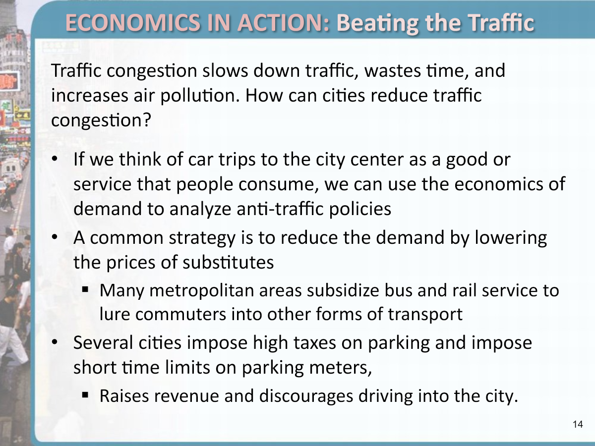
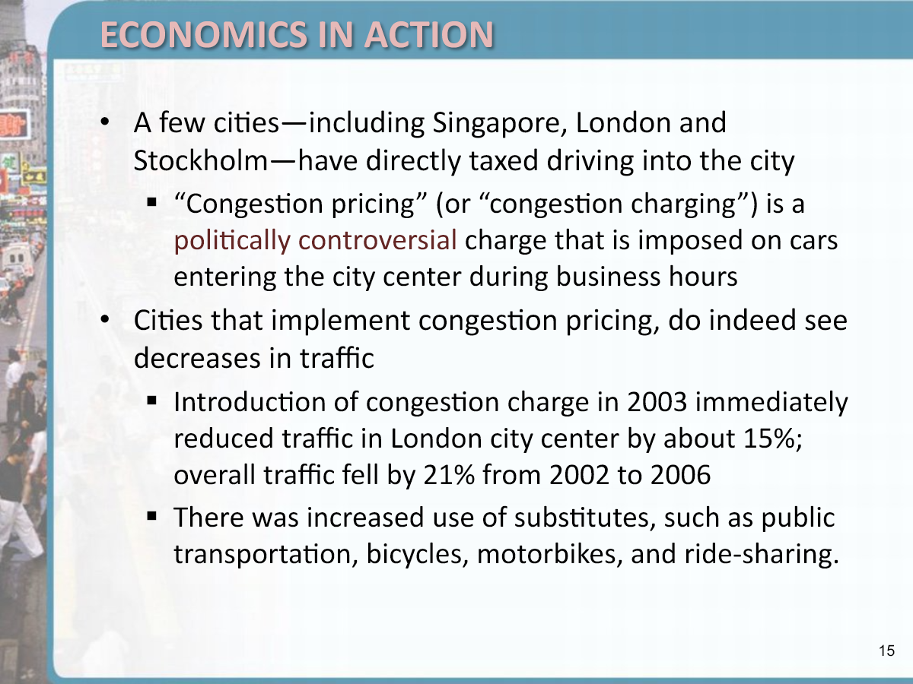

---

## 4. 供给 (Supply)

### 4.1 供给表 (Supply Schedule)

> [!info] 供给表 (Supply Schedule)
> **Supply Schedule** 是一张表格，展示了生产者在不同价格水平下愿意供应的商品或服务的数量（Quantity Supplied）。

#### Supply Schedule for Cotton

| Price of Cotton (per pound) | Quantity of Cotton Supplied (billions of pounds) |
|---|---|
| $2.00 | 11.6 |
| $1.75 | 11.5 |
| $1.50 | 11.2 |
| $1.25 | 10.7 |
| $1.00 | 10.0 |
| $0.75 | 9.1 |
| $0.50 | 8.0 |

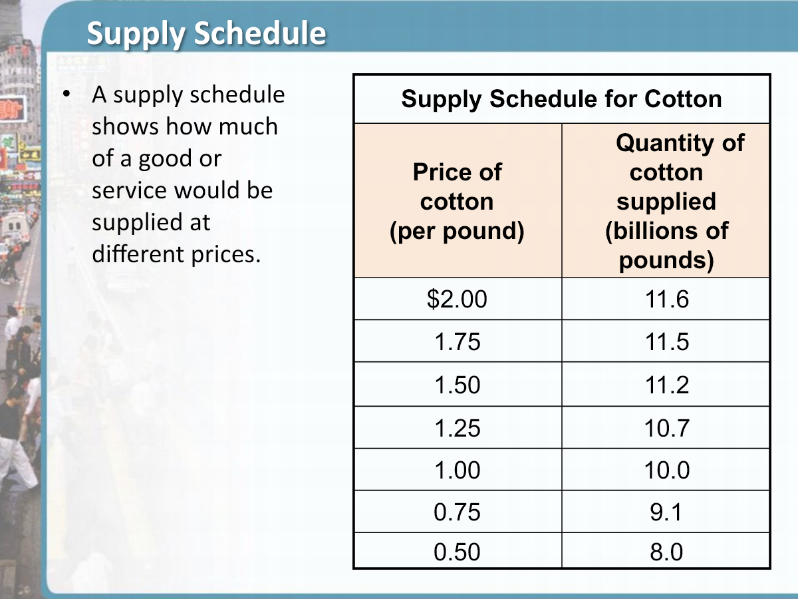

### 4.2 供给曲线 (Supply Curve)

> [!info] 供给曲线 (Supply Curve)
> **Supply Curve** 是 Supply Schedule 的图形化表示，显示了在任何给定价格下生产者愿意出售的数量。

与 Demand Curve 不同，Supply Curve 通常是 **向上倾斜 (Upward Sloping)** 的：**价格上升 → 供给量上升**。这是因为当价格上升时，生产者每卖出一单位商品能获得更多收益，因此愿意增加供给量。这反映了价格与供给量之间的**正向关系 (Positive Relationship)**。

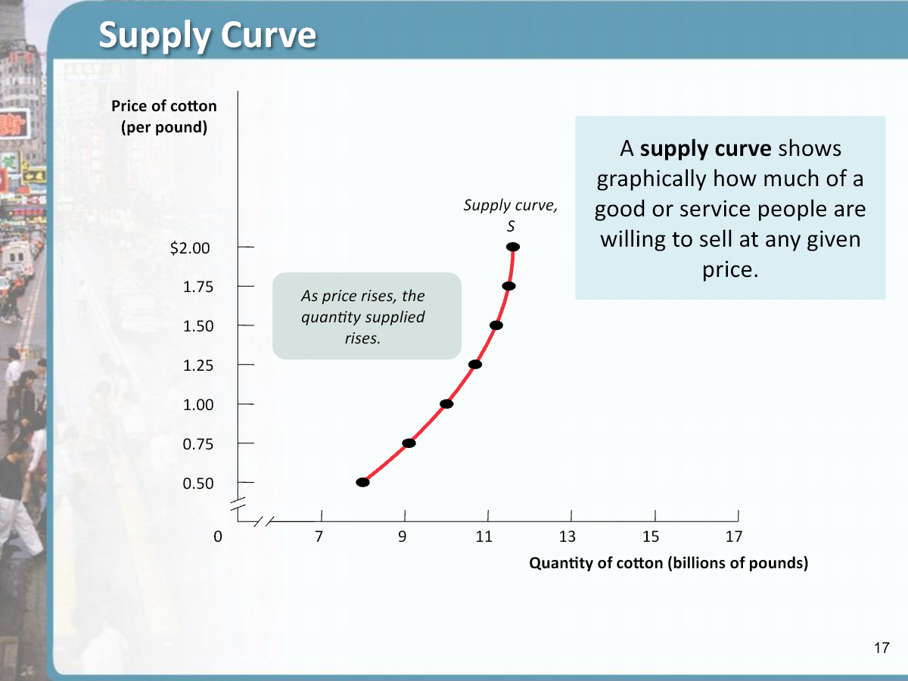

### 4.3 供给的增加 (An Increase in Supply)

> [!info] 供给曲线的移动 (Shift of the Supply Curve)
> **Shift of the Supply Curve** 是指在任何给定价格下，供给量发生变化的整体平移。

例如，棉花种植业采用更好的技术 → 在任何给定价格下都有更多产量和更多生产者进入 → Supply Curve 向右移动。

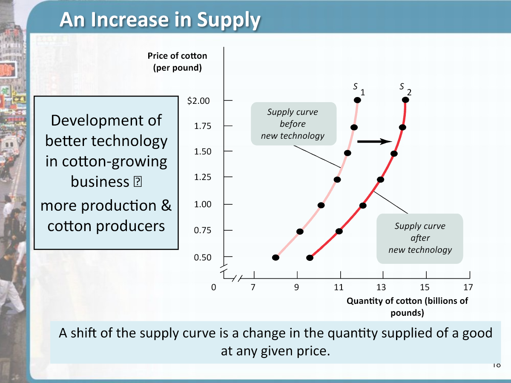

### 4.4 沿供给曲线的移动 vs. 供给曲线的移动 (Movement Along vs. Shift)

> [!warning] 核心区分规则
> - **Movement Along the Supply Curve**：由商品**自身价格变化**引起 → 沿同一条 Supply Curve 移动（A 到 B）
> - **Shift of the Supply Curve**：由**外部因素**引起 → 任何给定价格下供给量发生变化（A 到 C）

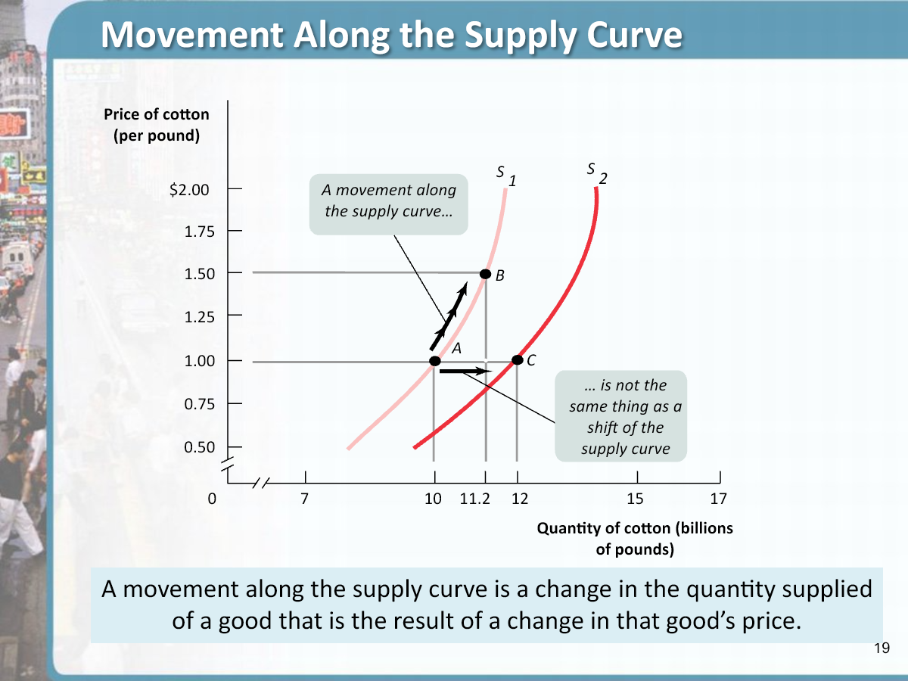

### 4.5 供给曲线的移动方向 (Shifts of the Supply Curve)

> [!info] 供给增加与减少
> - **Increase in Supply（供给增加）** = Supply Curve 向右移动 (Rightward Shift, S₁ → S₂)：在任何给定价格下，生产者供给量更大
> - **Decrease in Supply（供给减少）** = Supply Curve 向左移动 (Leftward Shift, S₁ → S₃)：在任何给定价格下，生产者供给量更小

经济学家所说的 "Increase in Supply"，指的是右移——在任何给定价格下生产者供给更多。同样，"Decrease in Supply" 指的是左移。

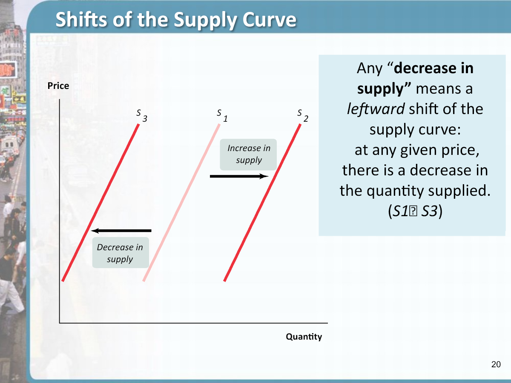

### 4.6 导致供给曲线移动的五大因素

> [!info] 投入品 (Input)
> **Input（投入品）** 是用于生产另一种商品的商品。

| 因素 | 英文 | 说明 |
|------|------|------|
| 投入品价格变化 | Changes in Input Prices | 投入品价格上升 → 生产成本上升 → 供给减少（左移） |
| 相关商品和服务价格变化 | Changes in Prices of Related Goods/Services | 替代品在生产中的价格变化影响供给决策 |
| 技术变化 | Changes in Technology | 技术进步 → 生产成本降低 → 供给增加（右移） |
| 预期变化 | Changes in Expectations | 对未来价格的预期影响当前供给决策 |
| 生产者数量变化 | Changes in Number of Producers | 更多生产者进入市场 → 市场供给增加（右移） |

> [!question] 课堂练习 (Class Exercise)
> 互联网技术使大学能够提供越来越多在线经济学课程和资源。经济知识的供给会发生什么变化？

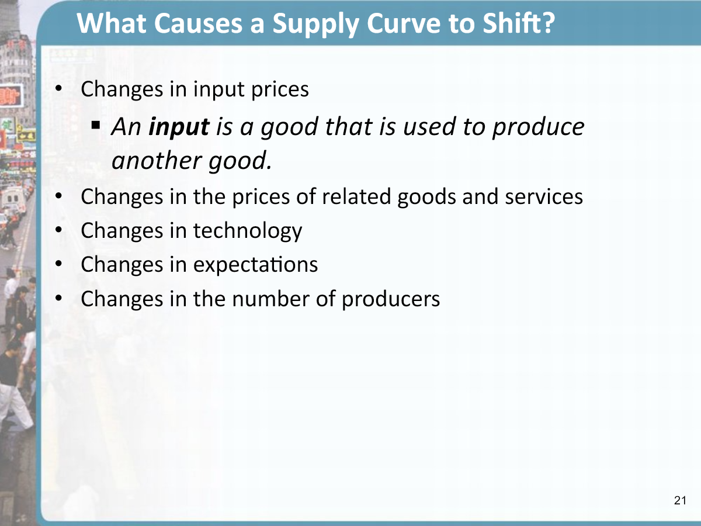

### 4.7 经济学在行动：农场兽医的减少 (Only Creatures Small and Pampered)

根据《纽约时报》报道，过去二十年美国农场兽医 (Farm Veterinarians) 数量严重下降。问题根源在于**竞争**：

- **农场兽医服务** 和 **宠物兽医服务** 是 **Substitutes in Production（生产中的替代品）**
- 美国不断增长的宠物数量 + 宠主日益愿意为宠物花钱 → **宠物兽医服务价格上涨**
- 兽医被吸引离开农场动物护理，转向利润更高的宠物护理
- 结果：**Farm Veterinary Services 的 Supply Curve 向左移动**——在任何给定价格下，提供农场服务的兽医减少了

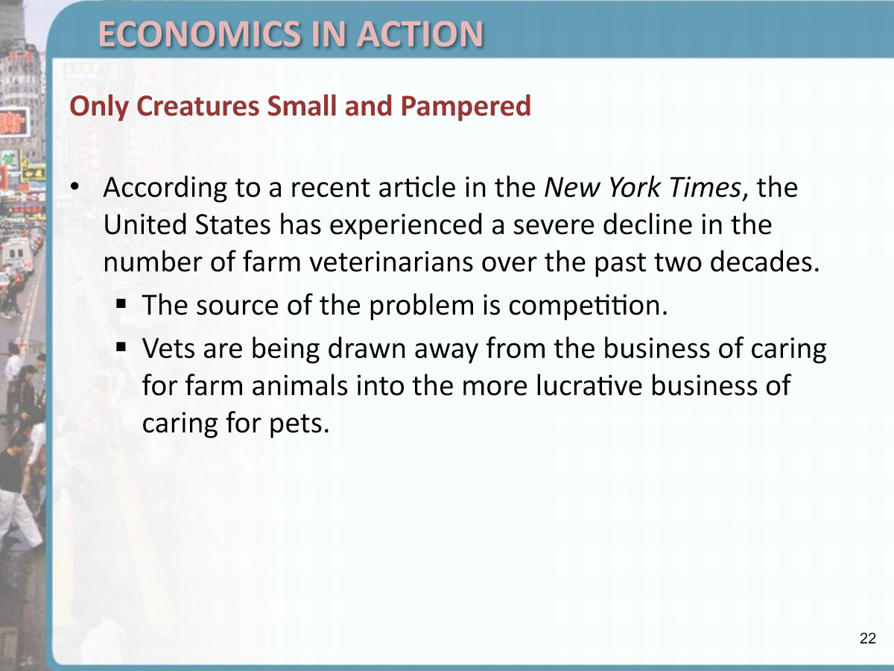
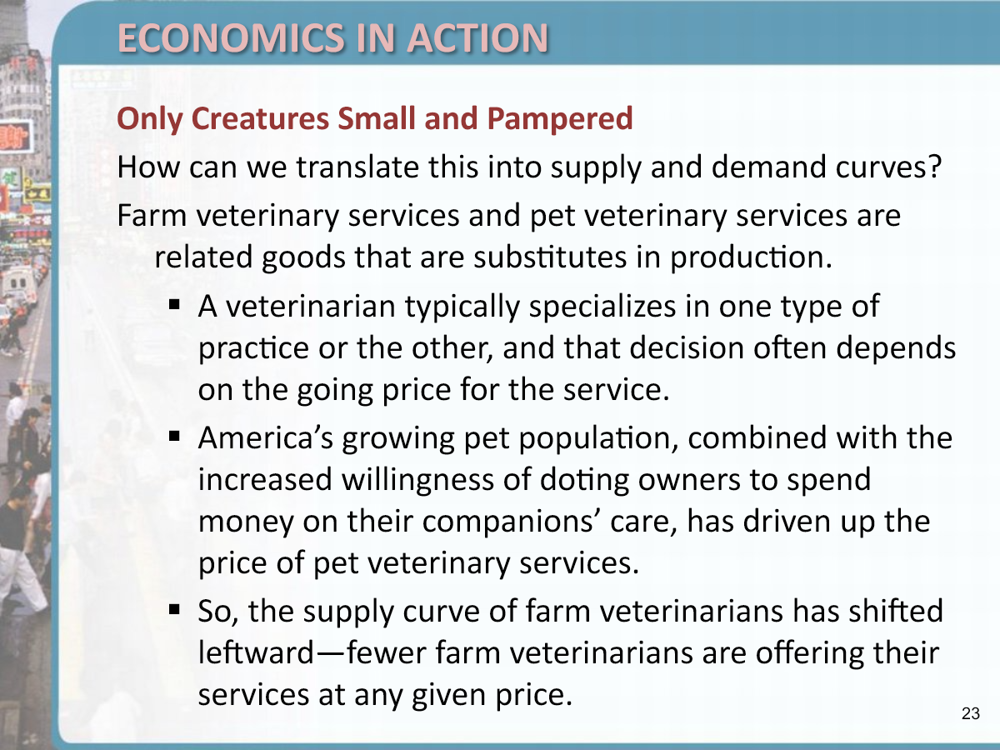

### 4.8 个人供给曲线与市场供给曲线 (Individual Supply Curve & Market Supply Curve)

> [!info] 市场供给曲线 (Market Supply Curve)
> **Market Supply Curve** 是市场中所有生产者的 Individual Supply Curves 的**水平加总 (Horizontal Sum)**。

例如，Mr. Silva 和 Mr. Liu 是棉花市场仅有的两个生产者：
- 在 $2/磅时：Mr. Silva 供给 3,000 磅/年，Mr. Liu 供给 2,000 磅/年
- Market Supply = 3,000 + 2,000 = 5,000 磅/年

显然，生产者数量越多，在任何给定价格下的市场供给量越大 → 生产者数量的增加导致 Supply 增加、Supply Curve 右移。

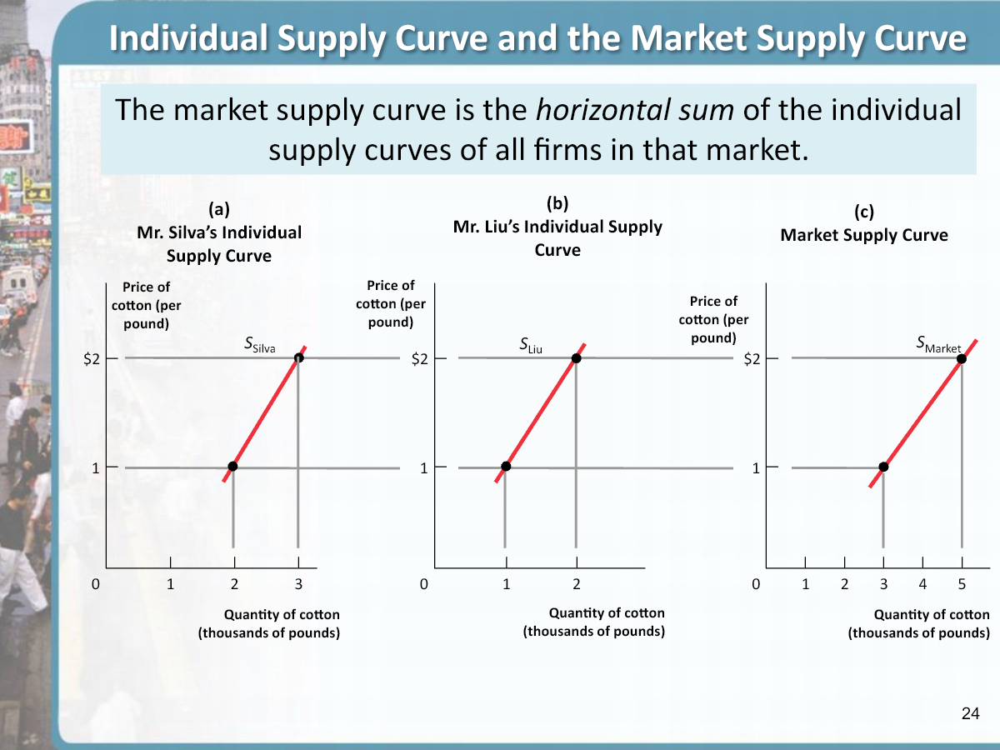

---

## 5. 均衡 (Equilibrium)

### 5.1 市场均衡 (Market Equilibrium)

> [!info] 均衡 (Equilibrium)
> 在竞争性市场中，**Equilibrium** 发生在 Quantity Demanded 等于 Quantity Supplied 时。
>
> - **Equilibrium Price（均衡价格）/ Market-Clearing Price（市场出清价格）**：使需求量等于供给量的价格
> - **Equilibrium Quantity（均衡数量）**：在均衡价格下买卖的商品数量
> - 在均衡状态下：**每一位买家都能找到卖家，每一位卖家都能找到买家**

> [!warning] 常见陷阱：买方价格 vs. 卖方价格 (Bought and Sold?)
> 在现实中，中间商 (Middleman) 从供应商处购买，加价后卖给消费者（例如咖啡商从种植者处购买咖啡豆再卖给消费者）。种植者收到的价格通常低于消费者支付的价格——这个差价就是中间商的生计来源。
>
> 但在许多市场中，买卖价差很小。所以在本章分析中，我们近似假设买方支付的价格等于卖方收到的价格。

**为什么市场上所有的买卖都在同一价格下发生？**

假设一个卖家向潜在买家报出的价格明显高于买家所知其他人支付的价格——买家显然会离开找别人，除非卖家愿意降价。反之，卖家也不愿意以明显低于市场价的水平出售。因此，在任何成熟、持续运营的市场中，所有卖家收到和所有买家支付的价格大致相同——这就是我们所说的 **Market Price（市场价格）**。

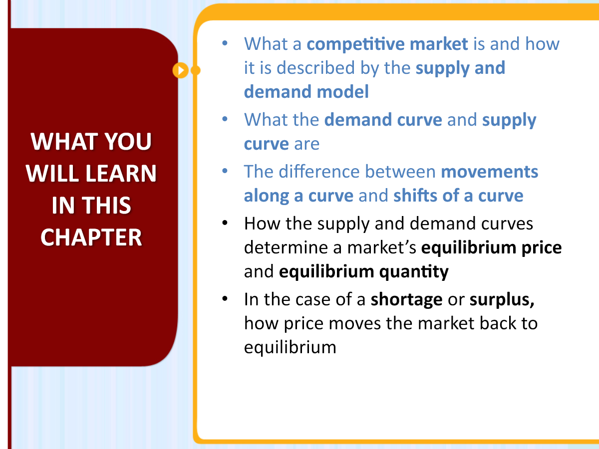
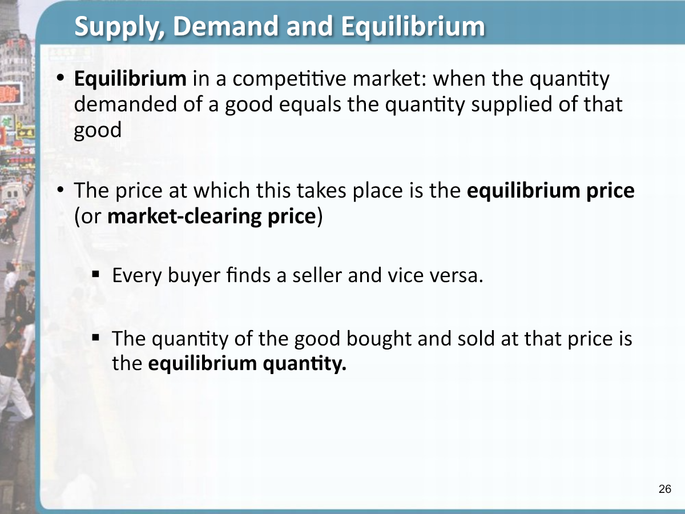
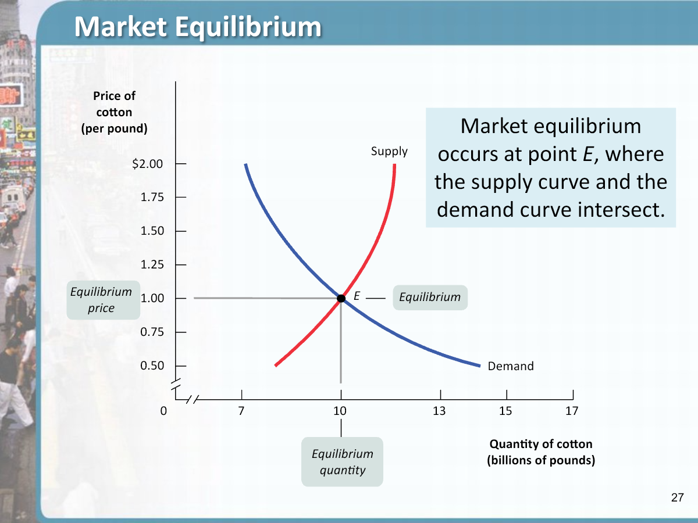

### 5.2 过剩 (Surplus)

> [!info] 过剩 (Surplus)
> 当价格**高于**均衡水平时，Quantity Supplied > Quantity Demanded，产生 **Surplus（过剩）**。

以棉花市场为例：当市场价格为 $1.50/磅（高于均衡价 $1.00）时：
- 生产者愿意出售 **11.2** 十亿磅
- 消费者只想购买 **8.1** 十亿磅
- 过剩 = 11.2 − 8.1 = **3.1** 十亿磅

Surplus 将推动价格**下降**，直到达到均衡价格。

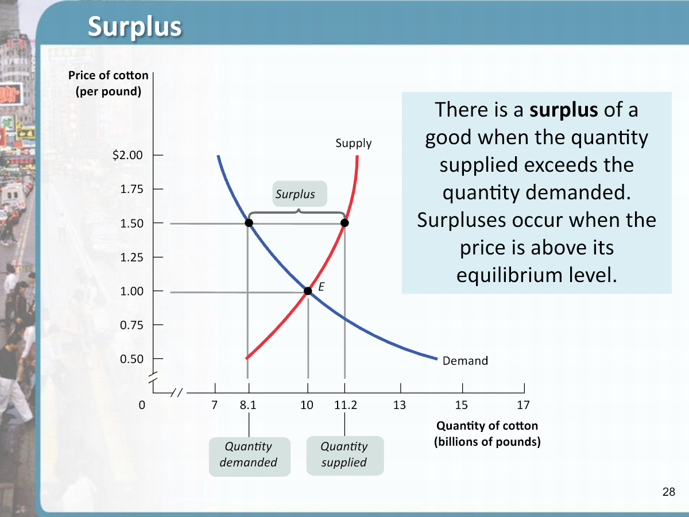

### 5.3 短缺 (Shortage)

> [!info] 短缺 (Shortage)
> 当价格**低于**均衡水平时，Quantity Demanded > Quantity Supplied，产生 **Shortage（短缺）**。

以棉花市场为例：当市场价格为 $0.75/磅（低于均衡价 $1.00）时：
- 消费者想要购买 **11.5** 十亿磅
- 生产者只愿意出售 **9.1** 十亿磅
- 短缺 = 11.5 − 9.1 = **2.4** 十亿磅

Shortage 将推动价格**上升**，直到达到均衡价格。

> [!info] 现实案例：iPhone 3G 的短缺
> 2008 年夏天，Apple 以之前型号一半的价格 ($199) 推出 iPhone 3G 时，在全美引起了（暂时的）短缺。长队和等候名单就是 Shortage 的明显标志。

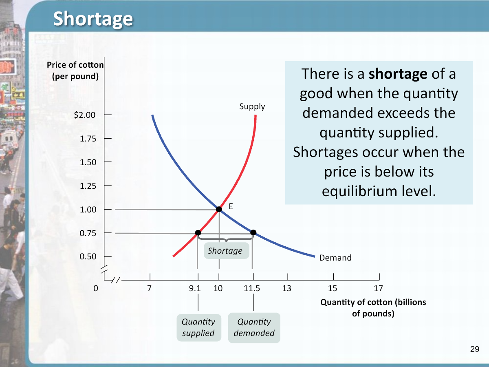

### 5.4 需求曲线移动对均衡的影响

> [!warning] 需求增加的影响
> 当 Demand 增加（Demand Curve 右移）：
> - **Equilibrium Price 上升** → 沿着 Supply Curve 向上移动
> - **Equilibrium Quantity 上升**
>
> 规律：**当 Demand 增加时，Equilibrium Price 和 Equilibrium Quantity 都上升。**

其他例子：
- 波士顿红袜队 (Red Sox) 近期的成功导致门票需求增加
- 10 年内，全球变暖可能增加对以前被认为 "太冷" 的地区的土地需求

> [!question] 课堂讨论
> 咖啡和茶是 Substitutes：如果茶的价格上涨，咖啡的需求会增加。但茶的价格如何影响咖啡市场呢？

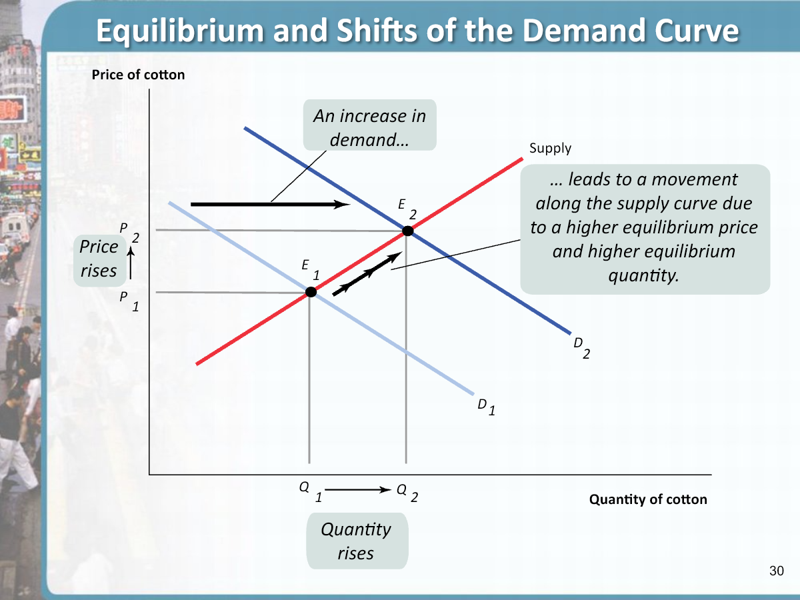

### 5.5 供给曲线移动对均衡的影响

> [!warning] 供给减少的影响
> 当 Supply 减少（Supply Curve 左移），例如因干旱导致棉花减产：
> - **Equilibrium Price 上升** → 沿着 Demand Curve 向上移动
> - **Equilibrium Quantity 下降**
>
> 规律：**当 Supply 减少时，Equilibrium Price 上升，Equilibrium Quantity 下降。**

> [!warning] 供给增加的影响（技术进步的案例）
> 当 Supply 增加（Supply Curve 右移），例如 1970 年代初工程师学会将微型电子元件置于硅芯片上的技术进步：
> - **Equilibrium Price 下降**
> - **Equilibrium Quantity 上升**
>
> 规律：**当 Supply 增加时，Equilibrium Price 下降，Equilibrium Quantity 上升。**

> [!warning] 常见陷阱：辨别是哪个曲线在动 (Which Curve Is It Anyway?)
> 当某种商品价格变化时，通常意味着 Supply 或 Demand 中有一个发生了变化。判断线索：**看 Quantity 的变化方向**。
> - 如果 Quantity 和 Price **同方向**变化（如两者都上升）→ 很可能是 **Demand Curve 移动了**
> - 如果 Quantity 和 Price **反方向**变化（如价格上升但数量下降）→ 很可能是 **Supply Curve 移动了**

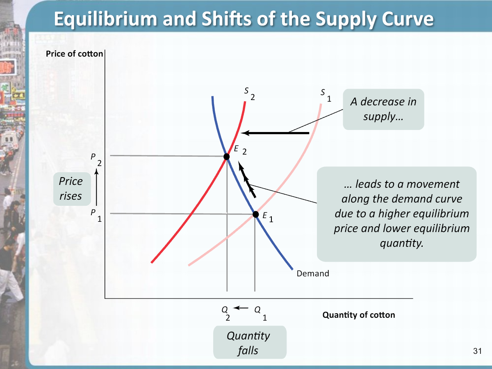
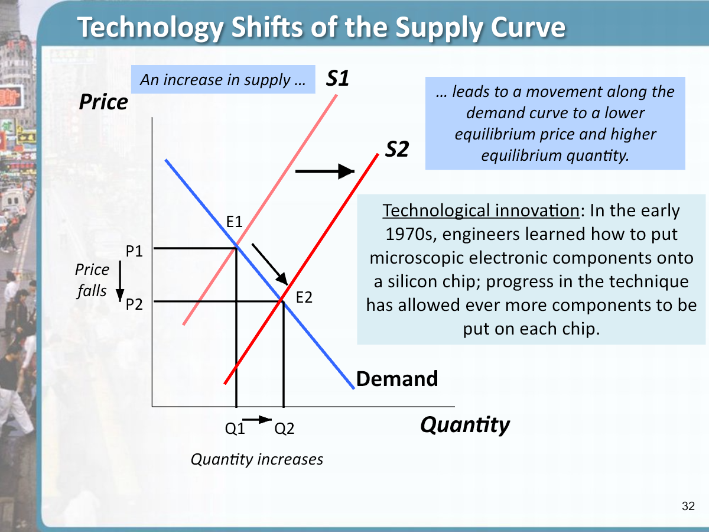

---

## 6. 经济学在行动：案例研究

### 6.1 墨西哥玉米饼危机 (The Great Tortilla Crisis)

2007 年，墨西哥政府对玉米饼 (Tortillas)——墨西哥穷人的主食——价格的急剧上涨感到恐慌。价格在 2007 年初几个月内从 25 美分/磅飙升到 35-45 美分/磅。

**原因**：这是 Supply 下降导致均衡价格变化的典型案例。

- 玉米饼由玉米 (Corn) 制成
- 墨西哥大部分玉米从美国进口，两国玉米价格基本由美国玉米市场决定
- 美国玉米价格因 **乙醇 (Ethanol)** 市场需求的激增而快速上涨
- 这导致玉米（玉米饼的关键 Input）成本上升 → Tortillas 的 Supply 下降 → Equilibrium Price 上升

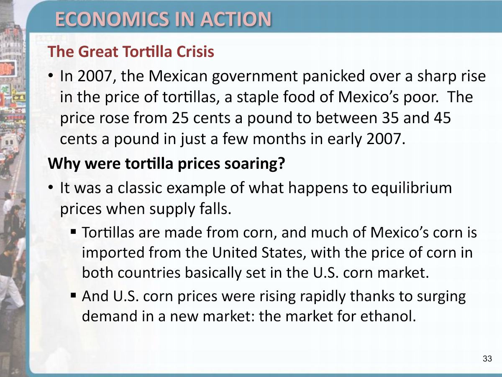

### 6.2 毒品战争中的供需分析 (Supply, Demand, and Controlled Substances)

> [!info] "War on Drugs" 的供需分析
> 禁毒战争使毒品的 Supply Curve **向左移动**（执法打击生产和贩运）。
>
> 但比较原均衡 E₁ 和新均衡 E₂ 可以发现：**毒品供给量的实际减少远小于供给曲线的移动幅度**。
> - 均衡价格从 P₁ 上升到 P₂
> - 高价格反而**激励**供应商冒险继续提供毒品
>
> 原因在于：成瘾消费者对毒品的需求**缺乏弹性 (Inelastic Demand)**——即使价格大幅上涨，他们仍然继续购买。

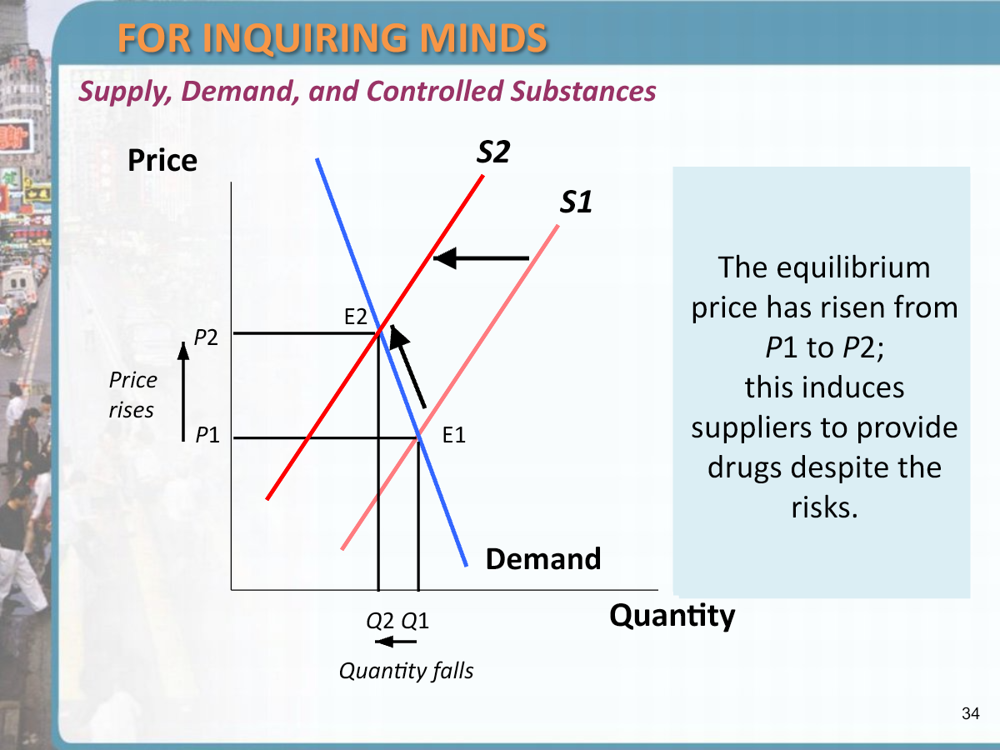

### 6.3 超模的供需练习 (Your Turn on the Runway: Supermodels)

> [!question] 思考题：非名人时尚模特的均衡价格如何变化？
>
> **背景**：
> - 互联网传输照片的便利性 + 国际旅行成本降低 → 世界各地大量年轻女性涌入模特行业（**Supply 增加，Supply Curve 右移**）
> - 雇主品味变化 → 他们现在更偏好名人 (Celebrities) 而非普通模特（**Demand 减少，Demand Curve 左移**）
>
> **分析**：Supply Curve 右移 + Demand Curve 左移 → **Equilibrium Price 下降**
>
> 也就是说，普通（非名人）时尚模特的薪酬下降了。

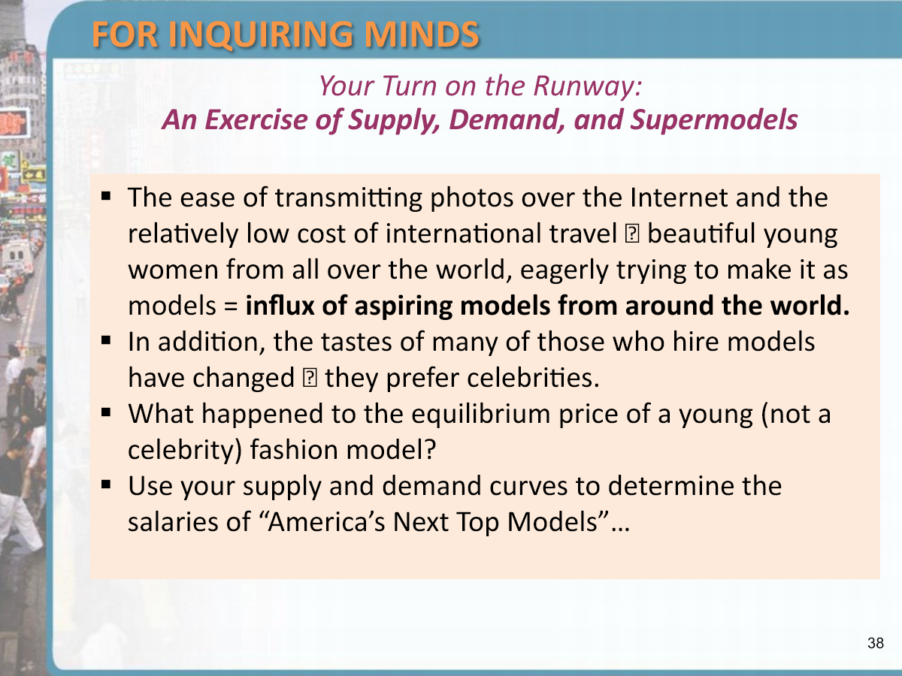

### 6.4 2008 年大米抢购潮 (The Rice Run of 2008)

2008 年 4 月，从泰国出口的大米价格（全球大米交易的基准价格）达到 $950/吨，而 2008 年初仅为 $360/吨。几小时内，全球主要大米交易所的价格接连创下历史新高。

**供需两方面的原因**：
- **Demand 方面**：中国和印度（传统的大米消费大国）收入增长
- **Supply 方面**：澳大利亚干旱 + 越南虫害
- **综合效应**：Supply 减少 + Demand 增加

但真正以惊人的速度推动价格上涨的是：
- 农民的**囤积 (Hoarding)**行为
- 消费者的**恐慌购买 (Panic Buying)**
- 印度（最大的大米出口国之一）实施**出口禁令 (Export Ban)**

在亚洲许多地区，政府是主要的稻米买家，农民以政府设定价格出售，再以补贴价卖给穷人。当全球价格上升时，农民（如今也能通过互联网查看全球大米报价）对政府定价不满，转而囤积大米，相信最终能获得更高价格。这种信念是**自我实现 (Self-fulfilling)** 的——囤积行为使 Supply Curve 进一步左移，推动价格继续上涨。

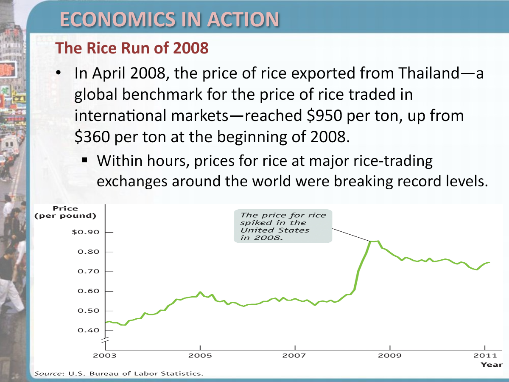
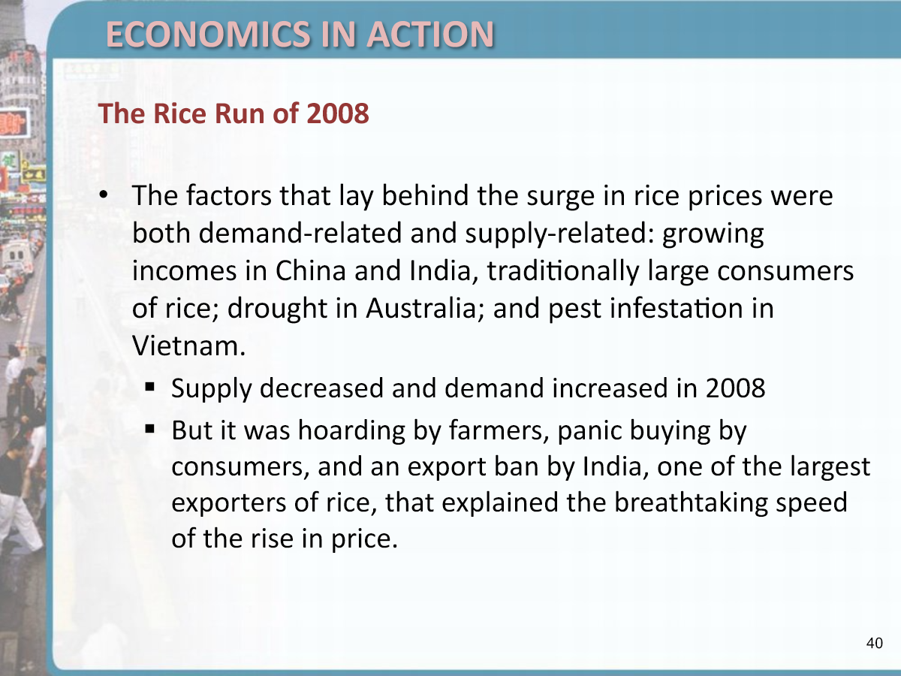
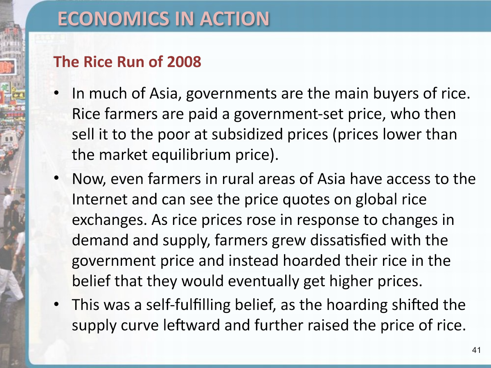

---

## 7. 供需同时移动 (Simultaneous Shifts of Supply and Demand)

现实中，Supply 和 Demand 往往同时发生变化。以下是系统性的分析。

### 7.1 两种可能的结果

#### 情况 (a)：需求增加占主导 (Demand Increase Dominates)

- Demand 大幅右移 + Supply 小幅左移
- **Equilibrium Price ↑**, **Equilibrium Quantity ↑**

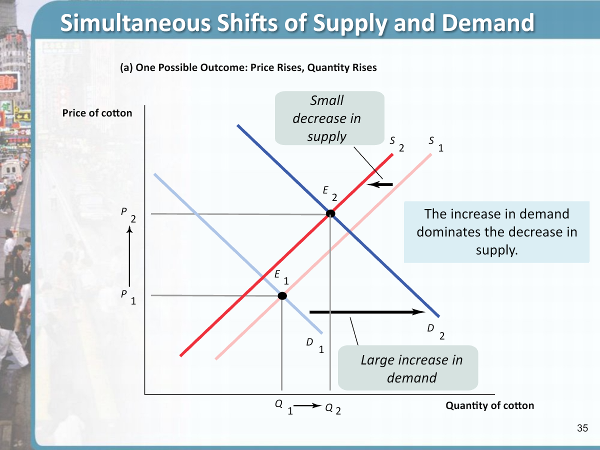

#### 情况 (b)：供给减少占主导 (Supply Decrease Dominates)

- Demand 小幅右移 + Supply 大幅左移
- **Equilibrium Price ↑**, **Equilibrium Quantity ↓**

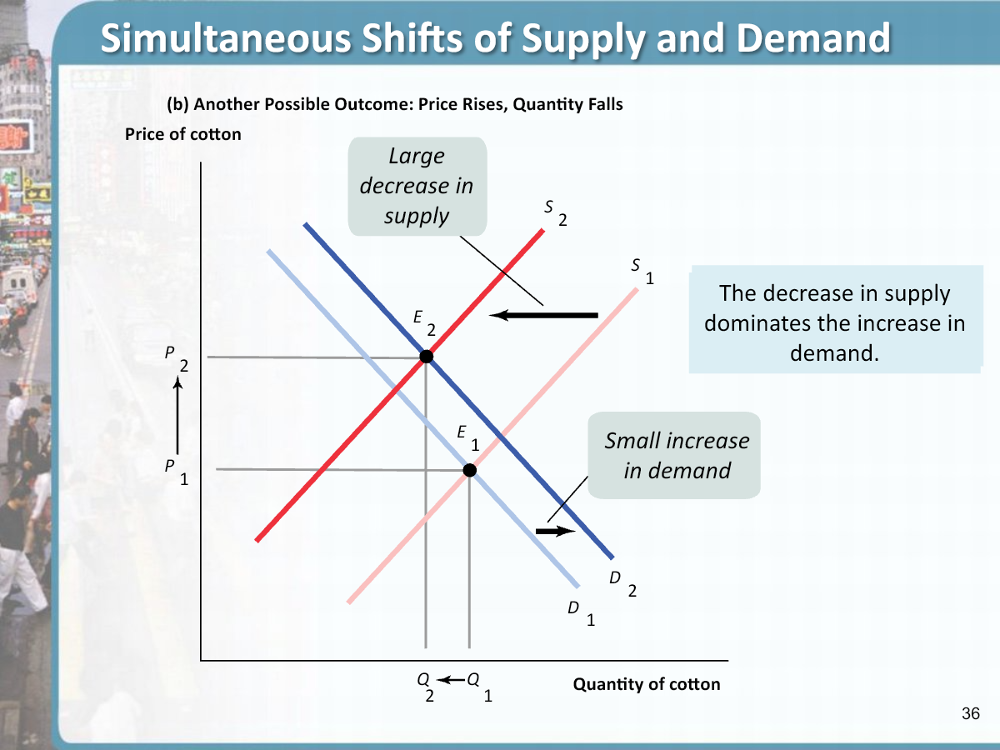

### 7.2 供需同时移动的预测总结

|  | Supply Increases | Supply Decreases |
|---|---|---|
| **Demand Increases** | Price: **Ambiguous**（不确定） Quantity: **Up** | Price: **Up** Quantity: **Ambiguous**（不确定） |
| **Demand Decreases** | Price: **Down** Quantity: **Ambiguous**（不确定） | Price: **Ambiguous**（不确定） Quantity: **Down** |

> [!warning] 核心规律
> - **当 Supply 和 Demand 反方向移动时**：Equilibrium Price 的变化方向可以预测，但 Equilibrium Quantity 的变化不确定
>   - Demand ↑ + Supply ↓ → Price ↑, Quantity 不确定
>   - Demand ↓ + Supply ↑ → Price ↓, Quantity 不确定
>
> - **当 Supply 和 Demand 同方向移动时**：Equilibrium Quantity 的变化方向可以预测，但 Equilibrium Price 的变化不确定
>   - Demand ↑ + Supply ↑ → Quantity ↑, Price 不确定
>   - Demand ↓ + Supply ↓ → Quantity ↓, Price 不确定
>
> - **一般来说，移动幅度更大 (disproportionately greater) 的曲线对 Equilibrium Price 和 Quantity 的影响更大。**

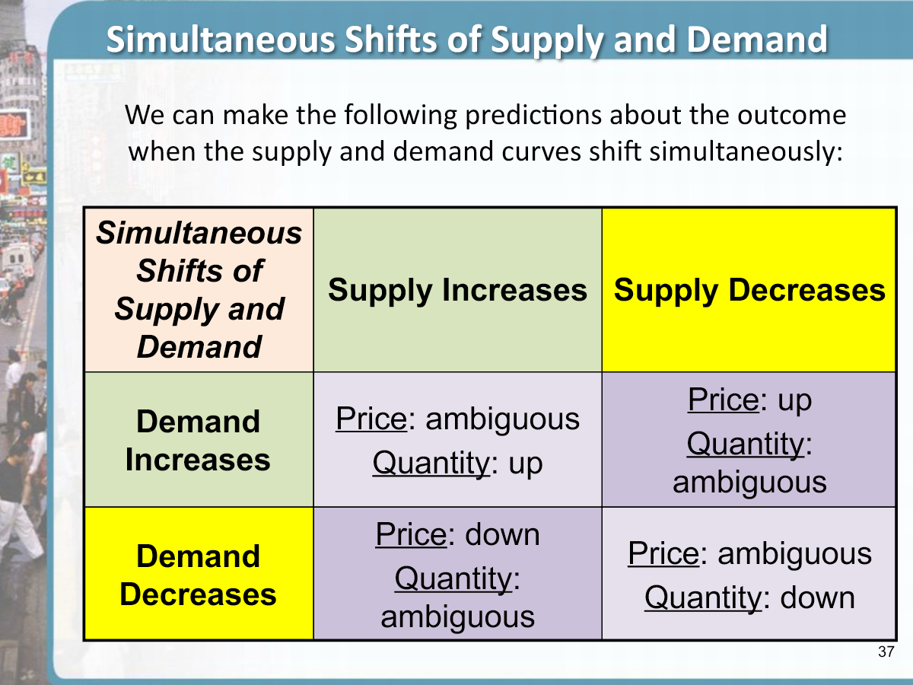

---

## 8. 本章关键术语 (Key Terms)

以下为 Chapter 3 的核心术语列表，按主题分组：

### 市场与模型 (Market & Model)

| 英文术语 | 中文翻译 |
|---|---|
| Competitive Market | 竞争性市场 |
| Supply and Demand Model | 供需模型 |

### 需求侧 (Demand Side)

| 英文术语 | 中文翻译 |
|---|---|
| Demand Schedule | 需求表 |
| Quantity Demanded | 需求量 |
| Demand Curve | 需求曲线 |
| Law of Demand | 需求定律 |
| Shift of the Demand Curve | 需求曲线的移动 |
| Movement Along the Demand Curve | 沿需求曲线的移动 |
| Substitutes | 替代品 |
| Complements | 互补品 |
| Normal Good | 正常品 |
| Inferior Good | 劣质品 |
| Individual Demand Curve | 个人需求曲线 |

### 供给侧 (Supply Side)

| 英文术语 | 中文翻译 |
|---|---|
| Quantity Supplied | 供给量 |
| Supply Schedule | 供给表 |
| Supply Curve | 供给曲线 |
| Shift of the Supply Curve | 供给曲线的移动 |
| Movement Along the Supply Curve | 沿供给曲线的移动 |
| Input | 投入品 |
| Individual Supply Curve | 个人供给曲线 |

### 均衡 (Equilibrium)

| 英文术语                  | 中文翻译   |
| --------------------- | ------ |
| Equilibrium Price     | 均衡价格   |
| Equilibrium Quantity  | 均衡数量   |
| Market-Clearing Price | 市场出清价格 |
| Surplus               | 过剩     |
| Shortage              | 短缺     |

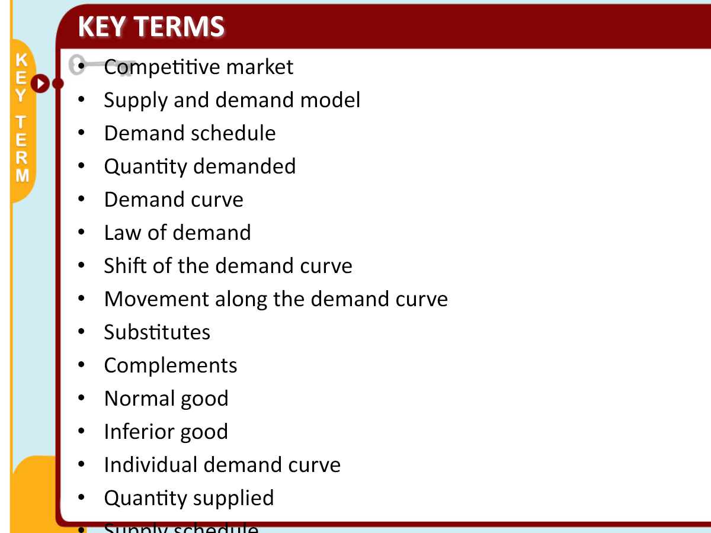

---

## 9. 本章总结 (Chapter Summary)

### 9.1 需求 (Demand)

> [!info] 核心要点
> - **Demand Schedule** 显示各价格下的 Quantity Demanded → 图形化为向下倾斜的 **Demand Curve**（Law of Demand）
> - **Movement Along** 由价格变化引起；**Shift** 由外部因素（替代品/互补品价格、收入、品味、预期、消费者数量）引起
> - **Market Demand Curve** = 所有 Individual Demand Curves 的水平加总

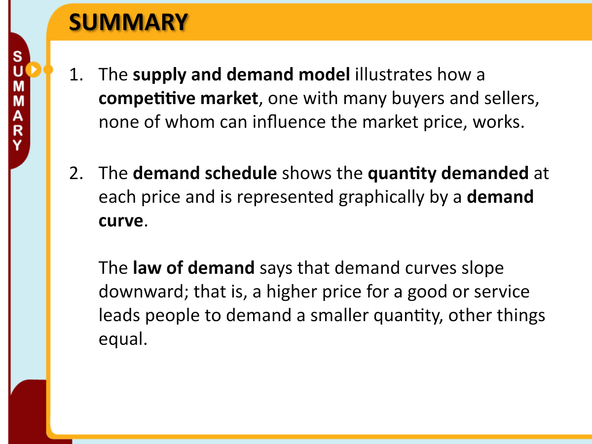
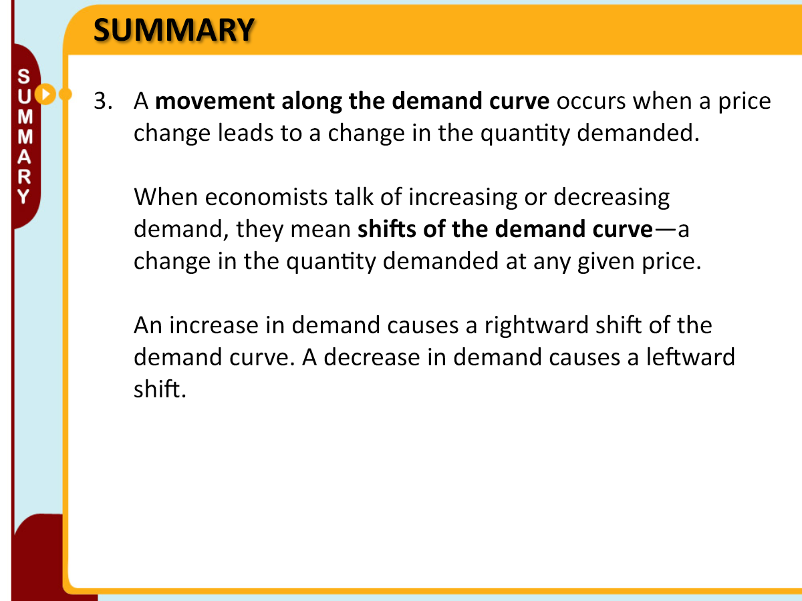
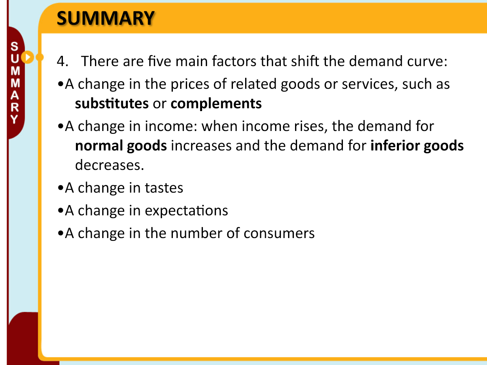
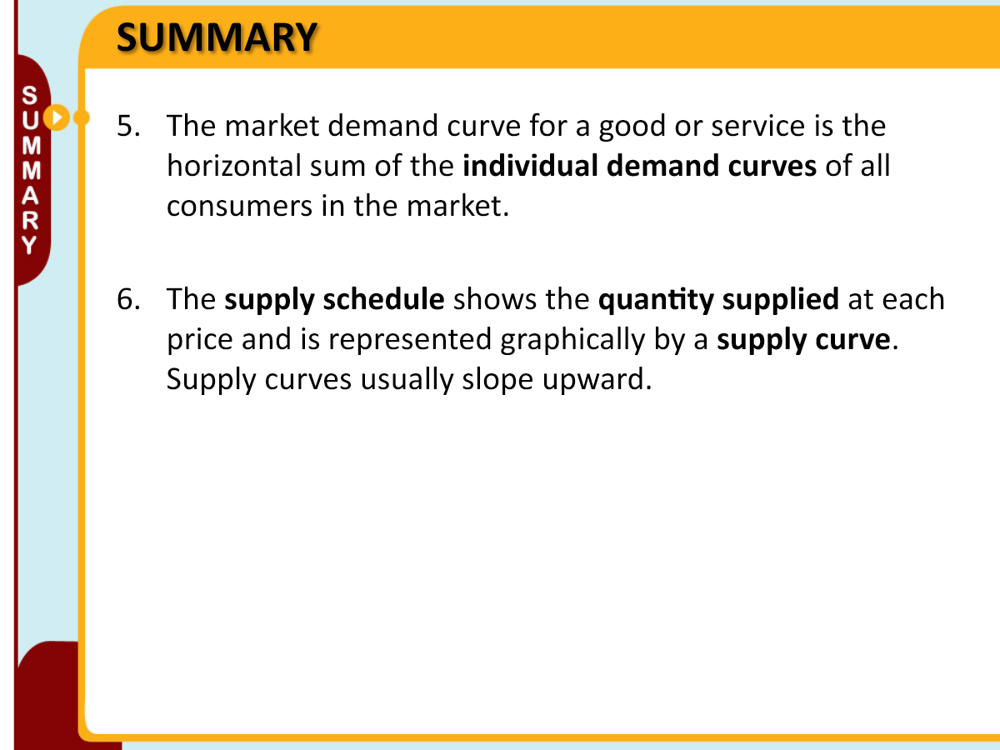

### 9.2 供给 (Supply)

> [!info] 核心要点
> - **Supply Schedule** 显示各价格下的 Quantity Supplied → 图形化为向上倾斜的 **Supply Curve**
> - 五大移动因素：Input Prices、相关商品价格、Technology、Expectations、Number of Producers
> - **Market Supply Curve** = 所有 Individual Supply Curves 的水平加总

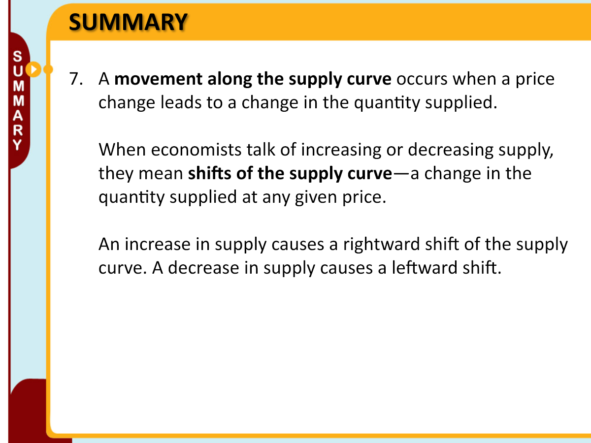
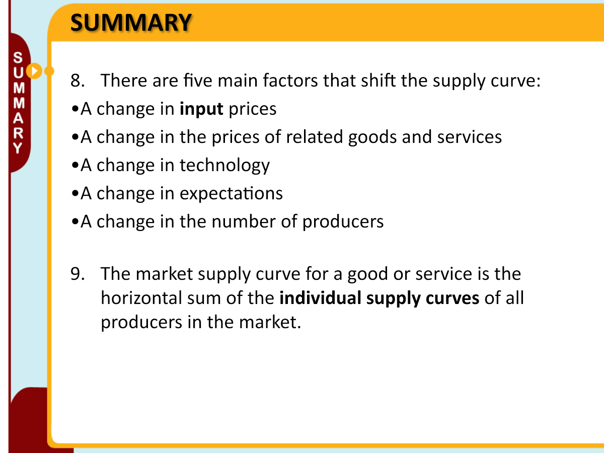

### 9.3 均衡 (Equilibrium)

> [!info] 核心要点
> - 市场趋向 **Equilibrium Price / Market-Clearing Price**，此时 Quantity Demanded = Quantity Supplied
> - Price > Equilibrium → **Surplus** 推动价格下降
> - Price < Equilibrium → **Shortage** 推动价格上升
> - Demand ↑ → Price ↑, Quantity ↑；Supply ↑ → Price ↓, Quantity ↑
> - 供需同时移动：反方向 → Price 确定/Quantity 不确定；同方向 → Quantity 确定/Price 不确定

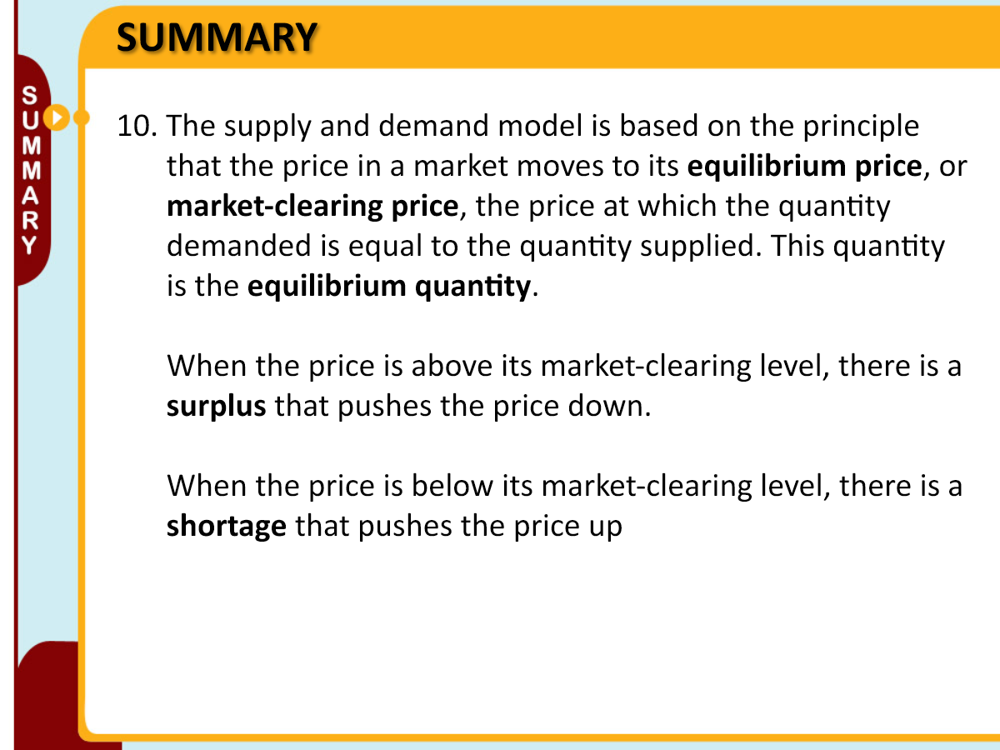
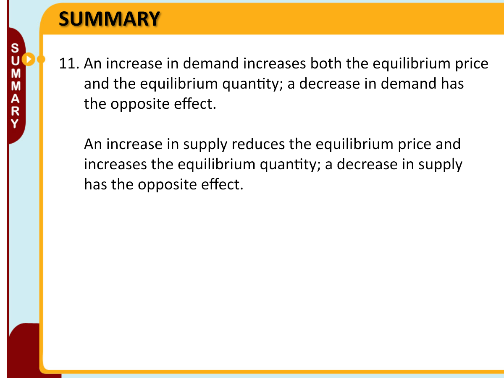
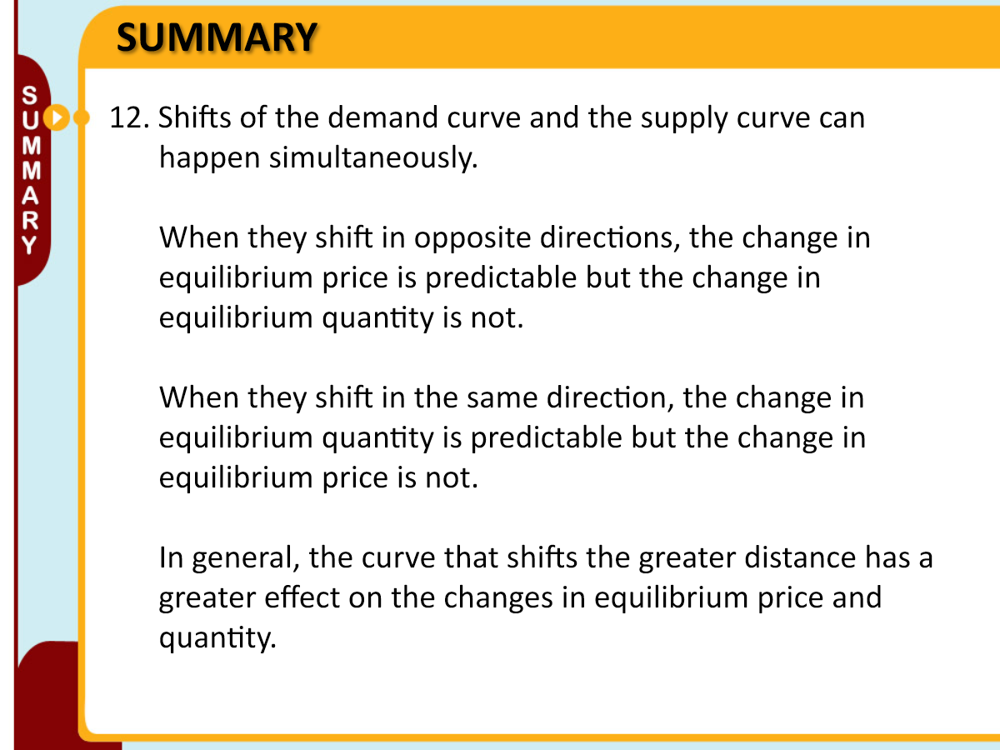

---

> [!warning] 关键学习建议
> 本章最重要的技能是能够：
> 1. 清晰区分 **Movement Along**（价格变化 → 沿曲线移动）与 **Shift**（外部因素 → 曲线整体平移）
> 2. 区分 **"Demand"** 和 **"Quantity Demanded"**，以及 **"Supply"** 和 **"Quantity Supplied"**
> 3. 熟练运用 Supply-Demand 模型分析现实世界中的市场变化
