# Chapter 4: Consumer and Producer Surplus

> [!info] 核心主题
> 本章从**福利经济学 (Welfare Economics)** 的视角出发，探讨资源配置如何影响经济福祉 (economic well-being)。核心问题是：市场均衡能否实现社会总剩余的最大化？

---

## 1. 福利经济学基础概念

> [!info] 关键术语
> - **效用 (Utility)**：消费者从消费中获得的利益 (benefit that consumers derive from consumption)
> - **购买意愿 (Willingness to Pay, WTP)**：买家愿意为一件商品支付的最高金额 (maximum amount that a buyer will pay for a good)；它代表了买家从该商品中能获得的效用
> - **生产成本 (Production Cost)**：卖家为生产一件商品必须放弃的一切的价值 (value of everything a seller must give up to produce a good)；它衡量了卖家的**出售意愿 (willingness to sell)**，即卖家愿意出售的最低价格

这两个基础概念构成了本章全部分析的起点：WTP 决定了需求曲线 (Demand Curve)，而生产成本决定了供给曲线 (Supply Curve)。

---

## 2. 本章学习目标

> [!info] WHAT YOU WILL LEARN
> 1. **消费者剩余 (Consumer Surplus)** 是什么，以及它与需求曲线的关系
> 2. **生产者剩余 (Producer Surplus)** 是什么，以及它与供给曲线的关系
> 3. **总剩余 (Total Surplus)** 是什么，如何用它衡量贸易收益 (gains from trade)，以及为什么它能说明市场运作的优良
> 4. 为什么**产权 (Property Rights)** 和作为经济信号的**价格 (Prices as Economic Signals)** 对市场的顺畅运行至关重要
> 5. 为什么市场通常能带来**有效结果 (efficient outcomes)**，尽管市场有时也会**失灵 (fail)**

---

## 3. 消费者剩余与需求曲线 (Consumer Surplus and the Demand Curve)

> [!info] 定义
> - **个人消费者剩余 (Individual Consumer Surplus)**：单个买家从购买商品中获得的净收益 (net gain)，等于买家的 **购买意愿 (Willingness to Pay)** 与 **市场价格 (Market Price)** 之间的差额。
> - **总消费者剩余 (Total Consumer Surplus)**：市场中所有买家的个人消费者剩余之和。
>
> 在任意数量下，需求曲线给出的价格等于**边际买家 (Marginal Buyer)** 的购买意愿。因此，需求曲线反映了买家的购买意愿，消费者剩余就是**需求曲线下方、市场价格上方的面积**。

### 3.1 二手教科书的需求曲线

下面是二手教科书市场的一个简单模型，仅有五位潜在消费者。由于人数有限，需求曲线呈阶梯状 (step-shaped)：每一个台阶代表一位消费者，台阶的高度表示该消费者的 WTP。

| Potential Buyers | Willingness to Pay |
|---|---|
| Aleisha | $59 |
| Brad | $45 |
| Claudia | $35 |
| Darren | $25 |
| Edwina | $10 |

> 这张表与传统的 Demand Schedule（需求表）逻辑一致——当价格高于某人的 WTP 时，该消费者不会购买；当价格等于或低于 WTP 时，消费者才会购买。

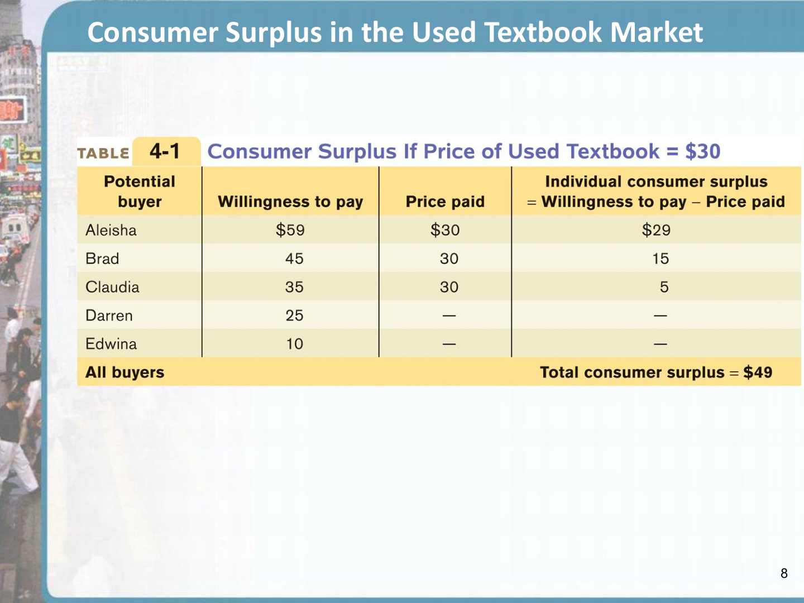

> [!info] 图 4-1 解读（来自演讲者备注）
> 市场中仅有五位潜在消费者，因此需求曲线呈阶梯状。每一个台阶代表一位消费者，其高度表示该消费者的 WTP。Aleisha 的 WTP 最高，为 $59；Brad 为 $45；Claudia 为 $35；Darren 为 $25；Edwina 最低，为 $10。当价格为 $59 时，需求量仅为一本（Aleisha）；价格为 $45 时，需求量为两本（Aleisha + Brad），以此类推，直到价格降至 $10 时，五位学生才全部愿意购买。

### 3.2 计算消费者剩余

当市场价格为 $30 时：
- Aleisha 的剩余 = $59 − $30 = **$29**
- Brad 的剩余 = $45 − $30 = **$15**
- Claudia 的剩余 = $35 − $30 = **$5**
- Darren (WTP $25 < $30) 和 Edwina (WTP $10 < $30) 不会购买，剩余为 $0
- **总消费者剩余 = $29 + $15 + $5 = $49**

> [!info] 图 4-2 解读（来自演讲者备注）
> 在价格为 $30 时，Aleisha、Brad 和 Claudia 各自购买了一本书，而 Darren 和 Edwina 则不买。三人的个人消费者剩余由阴影矩形的面积表示。总消费者剩余为整个阴影区域——$29 + $15 + $5 = $49。

### 3.3 平滑需求曲线下的消费者剩余

当市场中有大量潜在买家时，需求曲线变得平滑。以 iPad 为例：

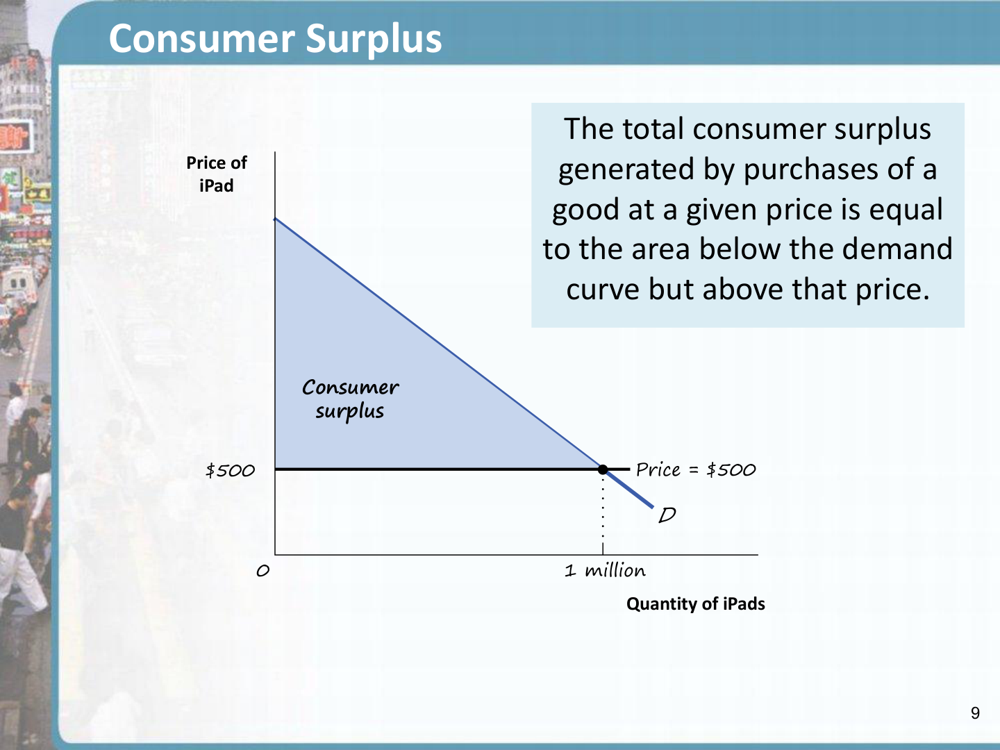

> [!info] 图 4-3 解读（来自演讲者备注）
> 由于存在大量潜在买家，iPad 的需求曲线是平滑的。当价格为 $500 时，需求量为 100 万台。此价格下的消费者剩余等于阴影区域——需求曲线下方、价格上方的面积。这个面积代表了消费者在价格为 $500 时购买和消费 iPad 所获的总净收益。

---

## 4. 价格变动如何影响消费者剩余

> [!info] 核心原理
> 价格下降会**增加**消费者剩余（买家总是希望支付更低的价格）。
>
> 价格下降通过两个渠道增加消费者剩余：
> 1. **原有买家的收益** (gain to original buyers)：在原价就会购买的消费者，现在享受更低的价格
> 2. **新增买家的收益** (gain to new buyers)：被更低的价格吸引而进入市场的新消费者

### 4.1 教科书市场：价格从 $30 降至 $20

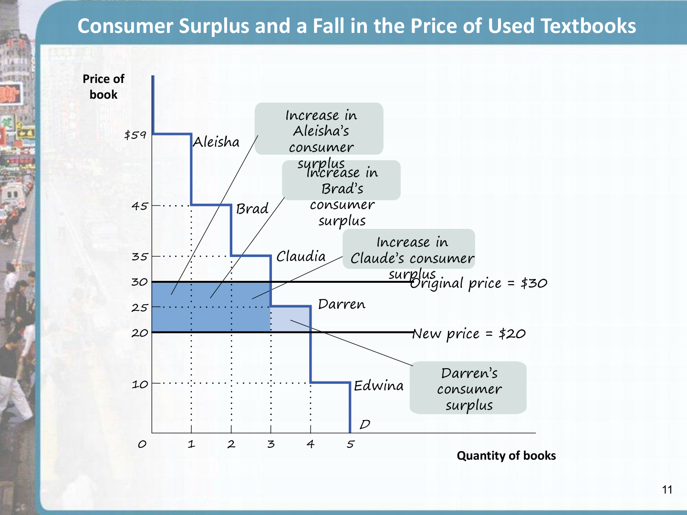

> [!info] 图 4-4 解读（来自演讲者备注）
> 价格从 $30 降至 $20 带来的消费者剩余增加包含两部分：
> - **深蓝色矩形**：原价 $30 时就会购买的三人 (Aleisha, Brad, Claudia)，每人获得 $10 的剩余增加 → 3 × $10 = $30
> - **浅蓝色三角形**：原价下不会购买，但新价下愿意购买的 Darren。Darren 的 WTP 为 $25，现在获得消费者剩余 $5
> - **总增加额 = $30 + $5 = $35**
>
> 同理，如果价格从 $20 涨回 $30，消费者剩余将减少同样的金额 ($35)。

### 4.2 iPad 市场：价格从 $2,000 降至 $500

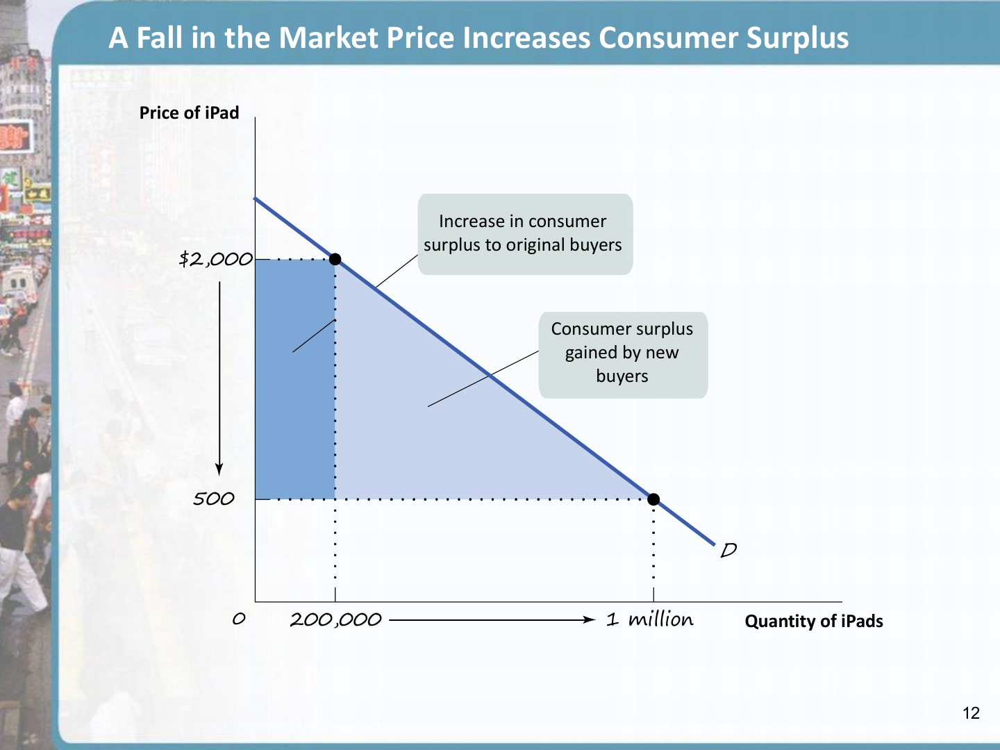

> [!info] 图 4-5 解读（来自演讲者备注）
> iPad 价格从 $2,000 降至 $500，导致需求量和消费者剩余同时增加。总消费者剩余的变化等于两个阴影区域之和：
> - **深蓝色区域**：代表原有 200,000 位消费者每人获得 $1,500 的剩余增加
> - **浅蓝色区域**：代表那些 WTP 在 $500 至 $2,000 之间的新增消费者获得的剩余
>
> 反之，价格上涨将导致消费者剩余等量减少。

> [!question] 课堂思考
> 价格下跌时，哪类消费者获益更多——是原有买家还是新增买家？为什么经济学家要区分这两个渠道？

---

## 5. 生产者剩余与供给曲线 (Producer Surplus and the Supply Curve)

> [!info] 定义
> - **成本 (Cost)**：潜在卖家愿意出售商品的最低价格 (lowest price at which a seller is willing to sell)
> - **个人生产者剩余 (Individual Producer Surplus)**：单个卖家从销售中获得的净收益，等于**实际收到的价格**与**卖家成本**之间的差额
> - **总生产者剩余 (Total Producer Surplus)**：市场中所有卖家的个人生产者剩余之和

### 5.1 二手教科书的供给曲线

| Potential Sellers | Cost |
|---|---|
| Engelbert | $5 |
| Donna | $15 |
| Carlos | $25 |
| Betty | $35 |
| Andrew | $45 |

当市场价格为 $30 时：
- Andrew (成本 $5) 的剩余 = $30 − $5 = **$25**
- Betty (成本 $15) 的剩余 = $30 − $15 = **$15**
- Carlos (成本 $25) 的剩余 = $30 − $25 = **$5**
- Donna (成本 $35 > $30) 和 Engelbert (成本 $45 > $30) 不会出售，剩余为 $0
- **总生产者剩余 = $25 + $15 + $5 = $45**

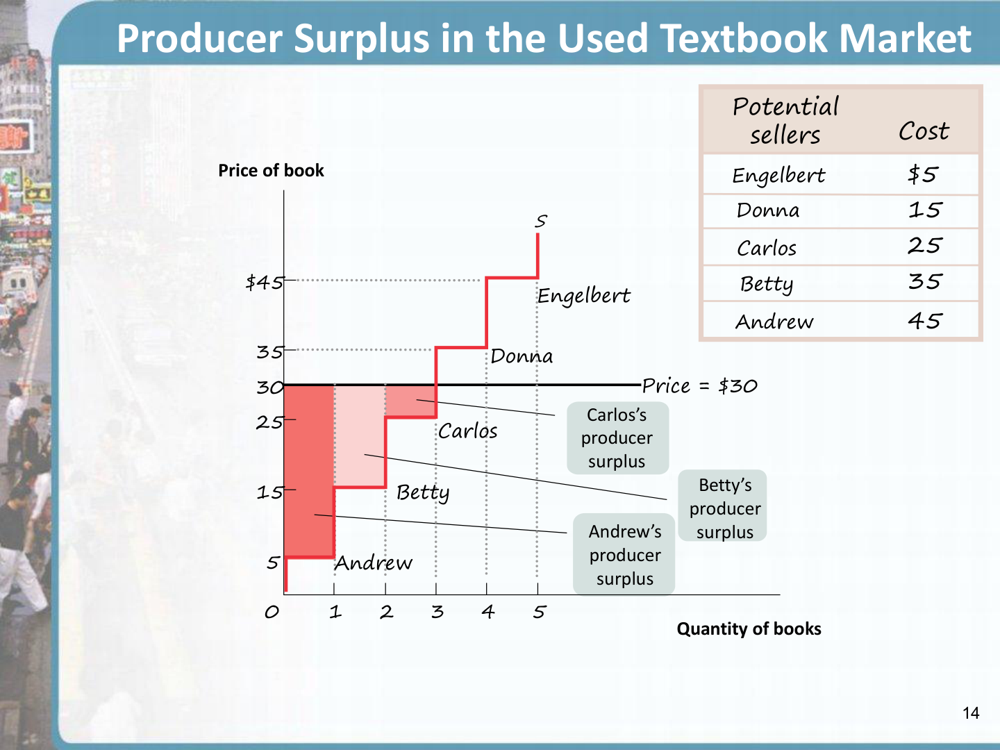

> [!info] 图 4-7 解读（来自演讲者备注）
> 在价格 $30 时，Andrew、Betty 和 Carlos 各自卖出一本书并获得生产者剩余（阴影矩形）。Donna 和 Engelbert 的成本高于 $30，故不愿出售，剩余为零。总生产者剩余为整个阴影区域 → $25 + $15 + $5 = $45。

### 5.2 平滑供给曲线下的生产者剩余

以小麦 (wheat) 市场为例：

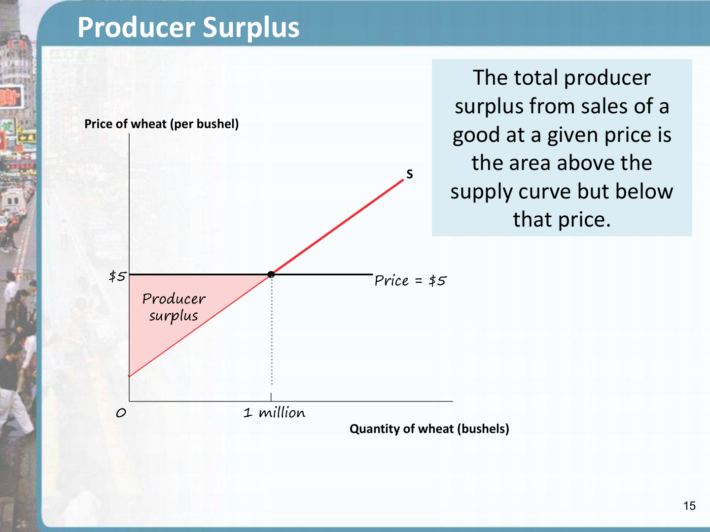

> [!info] 图 4-8 解读（来自演讲者备注）
> 这是小麦的供给曲线。在每蒲式耳 $5 的价格下，农民供应 100 万蒲式耳。此价格下的生产者剩余等于阴影区域——供给曲线上方、价格下方的面积。这是生产者（农民）以 $5 的价格供应产品所获得的总收益。

---

## 6. 价格变动如何影响生产者剩余

> [!info] 核心原理
> 价格上升会**增加**生产者剩余（卖家总是希望收到更高的价格）。
>
> 价格上升通过两个渠道增加生产者剩余：
> 1. **原有卖家的收益** (gain to original sellers)：在原价就会出售的生产者
> 2. **新增卖家的收益** (gain to new sellers)：被高价吸引进入市场的新生产者

### 6.1 小麦市场：价格从 $5 升至 $7

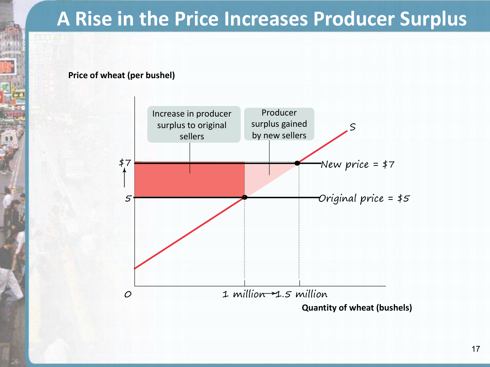

> [!info] 图 4-9 解读（来自演讲者备注）
> 小麦价格从 $5 升至 $7，供给量从 100 万增至 150 万蒲式耳：
> - **深红色矩形**：原有 100 万蒲式耳的供应者，每蒲式耳获得 $2 的额外生产者剩余
> - **浅红色三角形**：新增 50 万蒲式耳的供应者所获得的生产者剩余
>
> 同理，价格下跌将导致生产者剩余等量减少。

---

## 7. 总剩余与贸易收益 (Total Surplus and the Gains from Trade)

> [!info] 定义
> **总剩余 (Total Surplus)** = 消费者剩余 (Consumer Surplus) + 生产者剩余 (Producer Surplus)
>
> 总剩余是市场中消费者和生产者从交易中获得的总净收益 (total net gain)，也是社会从商品的生产和消费中获得的总利益。

### 7.1 总剩余的图示

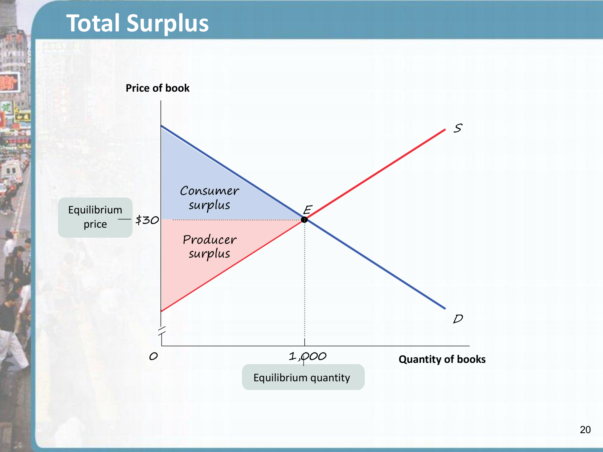

> [!info] 图 4-11 解读（来自演讲者备注）
> 在二手教科书市场中，均衡价格为 $30，均衡数量为 1,000 本书：
> - **蓝色区域** = 消费者剩余（需求曲线下方、价格上方）
> - **红色区域** = 生产者剩余（供给曲线上方、价格下方）
> - **蓝色 + 红色** = 总剩余，即社会从生产和消费该商品中获得的全部利益

### 7.2 贸易收益的含义

消费者和生产者之所以比没有市场时变得更好，正是因为存在**贸易收益 (Gains from Trade)**。这些贸易收益解释了为什么参与市场经济比每个人都自给自足要好。

但这就引出了一个更深层次的问题：

> [!question] 核心问题
> 我们是否已经达到了**最大化**的福祉？这引出了市场**效率 (Efficiency)** 的问题。

---

## 8. 市场的效率：一个初步观点 (The Efficiency of Markets: A Preliminary View)

> [!info] 核心论断
> **在竞争市场均衡 (Market Equilibrium) 下，总剩余达到最大可能值。**
>
> 市场均衡以如下方式配置消费和生产：使社会获得最高可能的收益。任何偏离市场均衡的改变都会**降低**总剩余。

### 8.1 三种可能"改善"总剩余的尝试——为什么它们都失败了

> [!warning] 重要论证

经济学家考虑了三种试图增加总剩余的方法，结果证明**全部都会降低总剩余**：

| 方式 | 操作 | 结果 |
|---|---|---|
| **重新分配消费** (Reallocate Consumption) | 将商品从市场均衡中的买家手中夺走，交给原本不会购买的潜在消费者 | 消费者剩余降低 |
| **重新分配销售** (Reallocate Sales) | 阻止市场均衡中的卖家出售，强迫原本不会出售的潜在卖家出售 | 生产者剩余降低 |
| **改变交易数量** (Change Quantity) | 强迫交易多于或少于均衡数量 | 总剩余降低 |

#### 8.1.1 重新分配消费降低消费者剩余

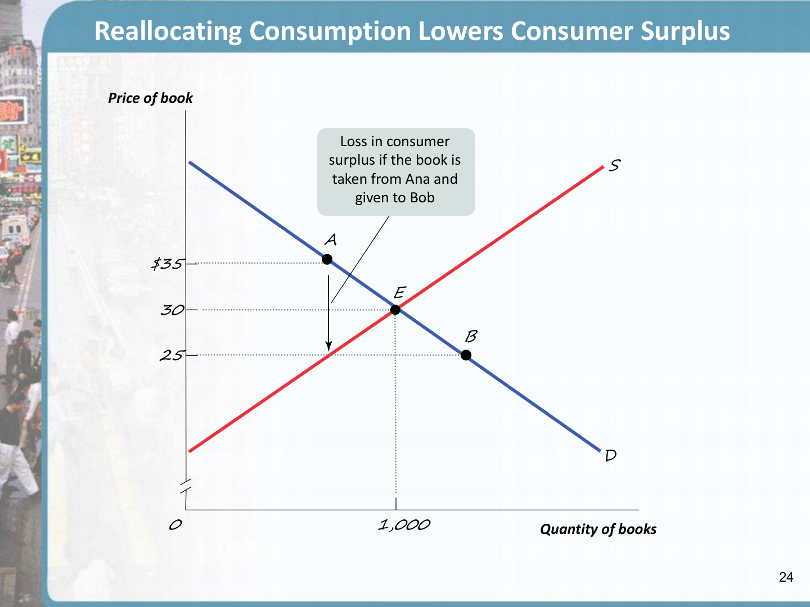

> [!info] 图 4-12 解读（来自演讲者备注）
> Ana (点 A) 的 WTP 为 $35，Bob (点 B) 的 WTP 仅为 $25。在市场均衡价格 $30 下，Ana 购买了一本书而 Bob 没有。如果我们将书从 Ana 手中拿走交给 Bob，消费者剩余将减少 $10 (即 $35 − $25)，因此总剩余也减少 $10。

#### 8.1.2 重新分配销售降低生产者剩余

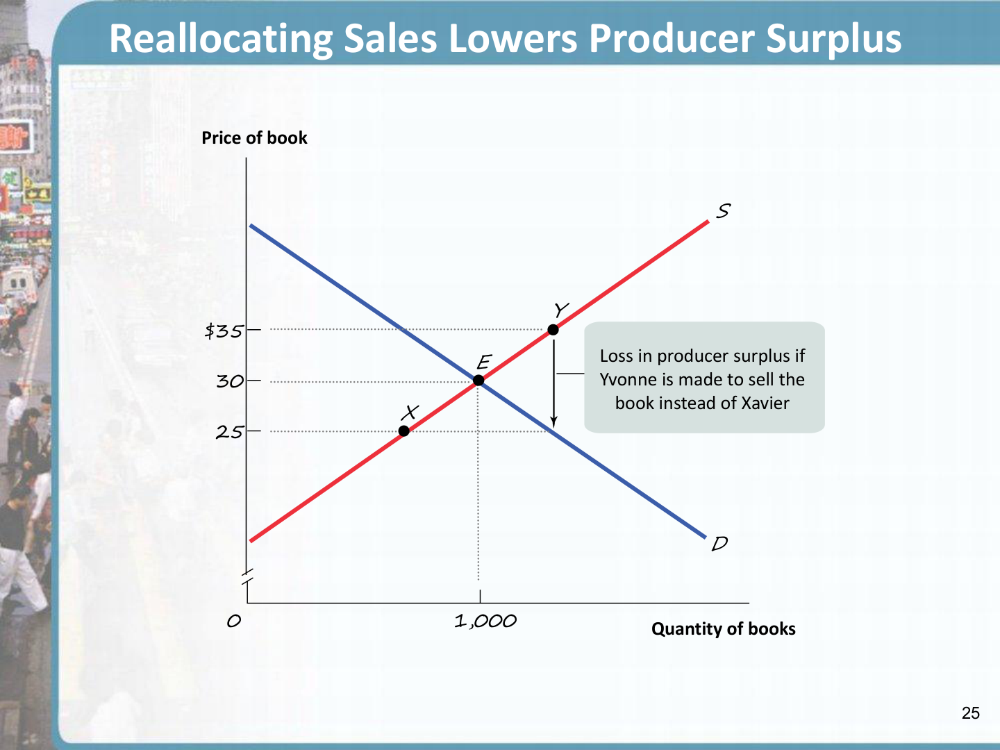

> [!info] 图 4-13 解读（来自演讲者备注）
> Yvonne (点 Y) 的成本为 $35，Xavier (点 X) 的成本为 $25。在市场均衡价格 $30 下，Xavier 卖书而 Yvonne 不卖。如果我们阻止 Xavier 出售，并强迫 Yvonne 出售她的书，生产者剩余将减少 $10 (即 $35 − $25)，总剩余也随之减少 $10。

#### 8.1.3 改变交易数量降低总剩余

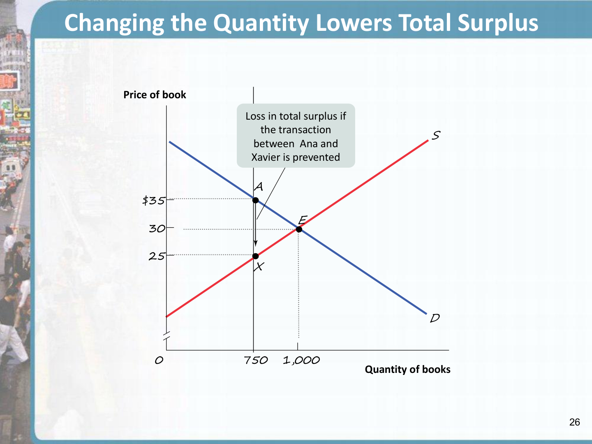
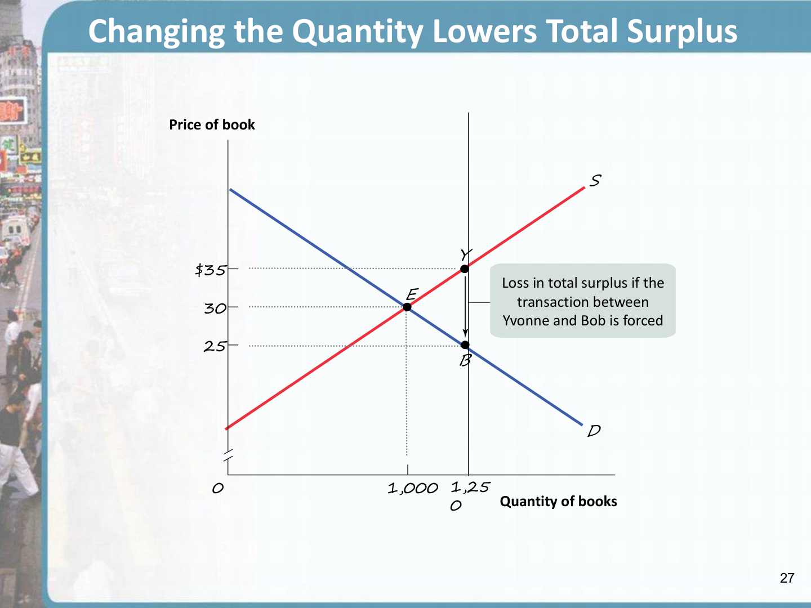

> [!info] 图 4-14 解读（来自演讲者备注）
> - **低于均衡数量 (Q < 1,000)**：如果阻止 Xavier (点 X, 成本 $25) 将书卖给像 Ana (点 A, WTP $35) 这样的人，总剩余将下降 $10 (= $35 − $25)。即，任何低于均衡数量 1,000 的交易水平都会使总剩余下降。
> - **高于均衡数量 (Q > 1,000)**：如果强迫 Yvonne (点 Y, 成本 $35) 将书卖给像 Bob (点 B, WTP $25) 这样的人，总剩余同样下降 $10 (= $35 − $25)。
>
> **结论**：在市场均衡下，所有互惠交易——且**仅**有互惠交易——才会发生。

### 8.2 均衡数量的效率

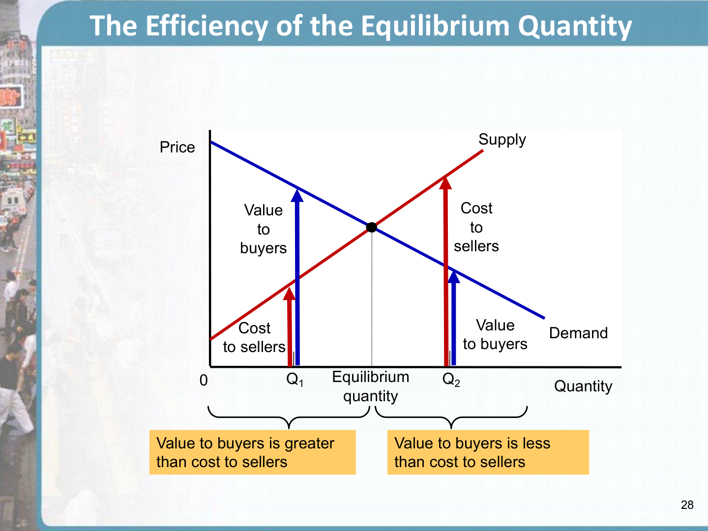

上图清晰地展示了为什么均衡数量是最优的：
- **在均衡数量左侧** (如 $Q_1$)：买家估值 (Value to Buyers) > 卖家成本 (Cost to Sellers) → 存在尚未实现的互惠交易，应增加产量
- **在均衡数量右侧** (如 $Q_2$)：买家估值 < 卖家成本 → 交易不再互惠，应减少产量
- **仅在均衡数量处**：买家估值恰好覆盖卖家成本，所有互惠交易均已实现

---

## 9. 市场均衡最大化总剩余的四项功能

> [!info] 四项功能 (Four Functions of Market Equilibrium)

市场均衡通过以下四项功能实现总剩余最大化：

1. **将消费分配给最看重商品的潜在买家**——即那些 WTP 最高的消费者
2. **将销售分配给最看重销售权的潜在卖家**——即那些成本最低的生产者
3. **确保每个实际购买的消费者对商品的估值，高于每个实际出售的卖家的成本**——所有发生的交易都是互惠 (mutually beneficial) 的
4. **确保每个未购买的潜在消费者对商品的估值，低于每个未出售的潜在卖家的成本**——不存在被遗漏的互惠交易

> 这四项功能执行完毕后，任何偏离市场均衡的资源配置方式都会降低总剩余。

---

## 10. 市场效率 vs. 公平 (Efficiency vs. Equality)

> [!info] 类比：分蛋糕 (The Pie Analogy)
> - **效率 (Efficiency)**：蛋糕是否做得尽可能大？即社会所有成员获得的总剩余是否最大化？
> - **公平/平等 (Equality)**：蛋糕如何切分？即经济繁荣是否在社会成员之间均匀分配？

---

## 11. 市场效率的三个注意事项 (Three Caveats)

> [!warning] Caveat 1: 效率 ≠ 公平
> 市场可能是**有效率**的，但不一定是**公平**的。事实上，公平 (equity/fairness) 常常与效率发生冲突。因为社会关心公平，政府以降低效率为代价换取更大公平的干预可能是合理的。

> [!warning] Caveat 2: 市场可能失灵 (Market Failure)
> 在某些明确界定的条件下，市场可能无法实现效率。当这种情况发生时，市场不再最大化总剩余。典型的市场失灵来源包括：外部性 (externalities)、公共品 (public goods)、不完全竞争 (imperfect competition) 等。

> [!warning] Caveat 3: 效率 ≠ 每个人都得到最好结果
> 即使市场均衡最大化总剩余，也**不意味着它对每个个体消费者和生产者都是最好的结果**。例如，一个维持高价的**价格下限 (Price Floor)** 会让某些卖家受益。但在市场均衡下，没有任何办法可以在不损害他人的情况下使某些人变得更好——这正是**效率**的定义（即**帕累托效率, Pareto Efficiency**）。

---

## 12. 为什么市场通常运作得如此之好

经济学家写下了浩繁的著作来解释为什么市场是组织经济的有效方式。归根结底，运转良好的市场效力于两大强大特征：

> [!info] 两大支柱
> - **产权 (Property Rights)**：有价值物品（资源或商品）的所有者有权按自己的意愿处置这些物品的权利
> - **作为经济信号的价格 (Prices as Economic Signals)**：**经济信号 (Economic Signal)** 是帮助人们做出更好经济决策的任何信息。价格是其中最关键的信号——它汇集了关于稀缺性、消费者偏好和生产成本的信息

---

## 13. 案例研究：器官应该有市场吗？(Should There Be a Market in Organs?)

> [!question] ECONOMICS IN ACTION

### 背景故事

一位母亲的爱如何挽救了两条生命：
- Ms. Stevens 的儿子需要肾脏移植
- 母亲的肾脏与儿子不兼容
- 她将自己的一个肾脏捐给了一位陌生人
- 她的儿子因此被移到了肾脏等待名单的最顶端

### 道德困境

以下行为，哪些是可以接受的？
1. 用一个肾脏换取一个肾脏？
2. 用一个肾脏换取昂贵的实验性癌症治疗？
3. 用一个肾脏换取儿子的免费学费？
4. **出售肾脏换取现金？**

### 公共政策分析

> [!warning] 现行政策与后果
> - 现行政策：**出售器官是非法的**——政府对器官市场施加了**零价格上限 (Price Ceiling of Zero)**
> - 后果：造成器官的严重**短缺 (Shortage)**
> - 事实：
>   - 人天生有两个肾脏，但通常只需要一个
>   - 有些人两个肾脏都失去功能
>   - 典型患者需要等待**数年**才能获得肾脏移植
>   - 每年有**数千人**因找不到合适的肾脏而死亡
>
> **现行体系：公平吗？有效吗？平等吗？**
>
> 一些人拥有自己并不真正需要的额外肾脏，另一些人则垂死以求一个肾脏。

> [!question] 课堂讨论
> 允许器官自由市场有哪些好处？有哪些伦理和公平性的顾虑？效率与公平在这个问题上如何发生冲突？

---

## 14. 章节总结 (Summary)

### 消费者剩余 (Consumer Surplus)

> [!info] 要点
> - 每位消费者的 **购买意愿 (Willingness to Pay)** 决定了需求曲线
> - 当价格 ≤ WTP 时，潜在消费者购买商品
> - WTP 与价格之间的差额就是消费者获得的净收益，即 **个人消费者剩余 (Individual Consumer Surplus)**
> - **总消费者剩余** 是市场中所有个人消费者剩余之和，等于需求曲线下方、价格上方的面积
> - 商品价格上涨减少消费者剩余；价格下跌增加消费者剩余

### 生产者剩余 (Producer Surplus)

> [!info] 要点
> - 每位潜在生产者的 **成本 (Cost)**（愿意出售的最低价格）决定了供给曲线
> - 当价格高于生产者的成本时，销售产生净收益，即 **个人生产者剩余 (Individual Producer Surplus)**
> - **总生产者剩余** 是市场中所有个人生产者剩余之和，等于价格下方、供给曲线上方的面积

### 总剩余与市场效率 (Total Surplus and Market Efficiency)

> [!info] 要点
> - **总剩余 (Total Surplus)** 是消费者剩余与生产者剩余之和，代表社会从商品生产和消费中获得的总收益
> - 通常，市场是**有效率**的，能实现最大总剩余
> - 任何重新分配消费或销售、或改变交易量的尝试，都会**降低**总剩余
> - 然而，社会也关心**公平 (fairness/equity)**。因此，政府以牺牲部分效率换取更大公平的干预可以是社会的有效选择

---

## 15. 关键术语 (Key Terms)

| 英文术语 | 中文对照 | 定义摘要 |
|---|---|---|
| Willingness to Pay | 购买意愿 | 买家愿意支付的最高价格 |
| Individual Consumer Surplus | 个人消费者剩余 | WTP − 实际支付价格 |
| Total Consumer Surplus | 总消费者剩余 | 所有个人消费者剩余之和 |
| Consumer Surplus | 消费者剩余 | 需求曲线下方、价格上方的面积 |
| Cost | 成本 | 卖家愿意出售的最低价格 |
| Individual Producer Surplus | 个人生产者剩余 | 实际价格 − 成本 |
| Total Producer Surplus | 总生产者剩余 | 所有个人生产者剩余之和 |
| Producer Surplus | 生产者剩余 | 价格下方、供给曲线上方的面积 |
| Total Surplus | 总剩余 | 消费者剩余 + 生产者剩余 |
| Property Rights | 产权 | 所有者按意愿处置物品的权利 |
| Economic Signal | 经济信号 | 帮助做出更好经济决策的信息 |
| Inefficient | 无效率 | 未能实现最大总剩余 |
| Market Failure | 市场失灵 | 市场无法实现效率的情况 |

---

> [!info] 参考来源
> - Krugman, P., & Wells, R. (2013). *Microeconomics* (3rd ed.). Worth Publishers. Chapter 4: Consumer and Producer Surplus.
