# Chapter 6: Elasticity（弹性）

## 本章学习目标 (What You Will Learn in This Chapter)

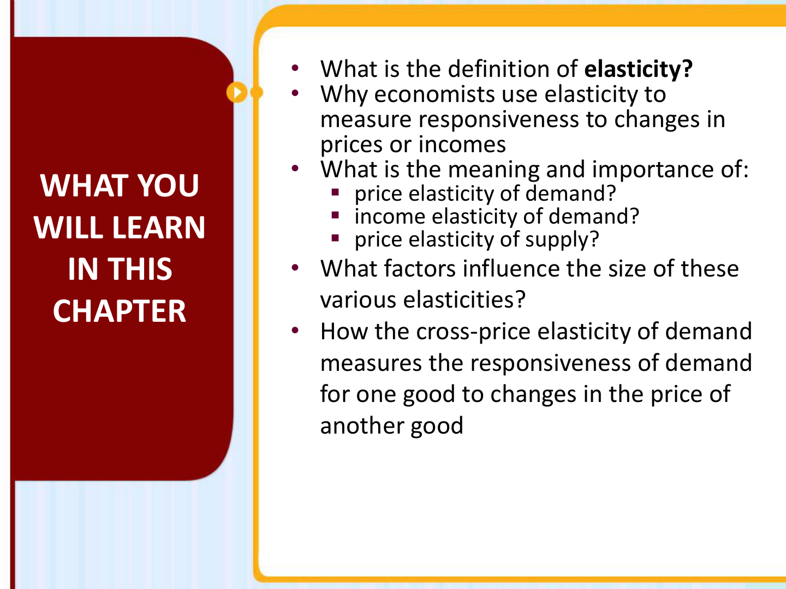

本章围绕经济学中一个核心工具——**弹性 (Elasticity)** 展开。弹性是衡量一个经济变量对另一个经济变量变化反应程度的通用指标。通过本章的学习，你将掌握以下核心问题：

- 弹性的定义是什么？为什么经济学家使用弹性来衡量对价格或收入变化的反应程度？
- **需求的价格弹性 (Price Elasticity of Demand)** 的含义与重要性。
- **需求的收入弹性 (Income Elasticity of Demand)** 的含义与重要性。
- **供给的价格弹性 (Price Elasticity of Supply)** 的含义与重要性。
- 哪些因素会影响上述各类弹性的大小？
- **需求的交叉价格弹性 (Cross-Price Elasticity of Demand)** 如何衡量一种商品的需求对另一种商品价格变化的反应程度。

---

## 一、需求的价格弹性 (Price Elasticity of Demand)

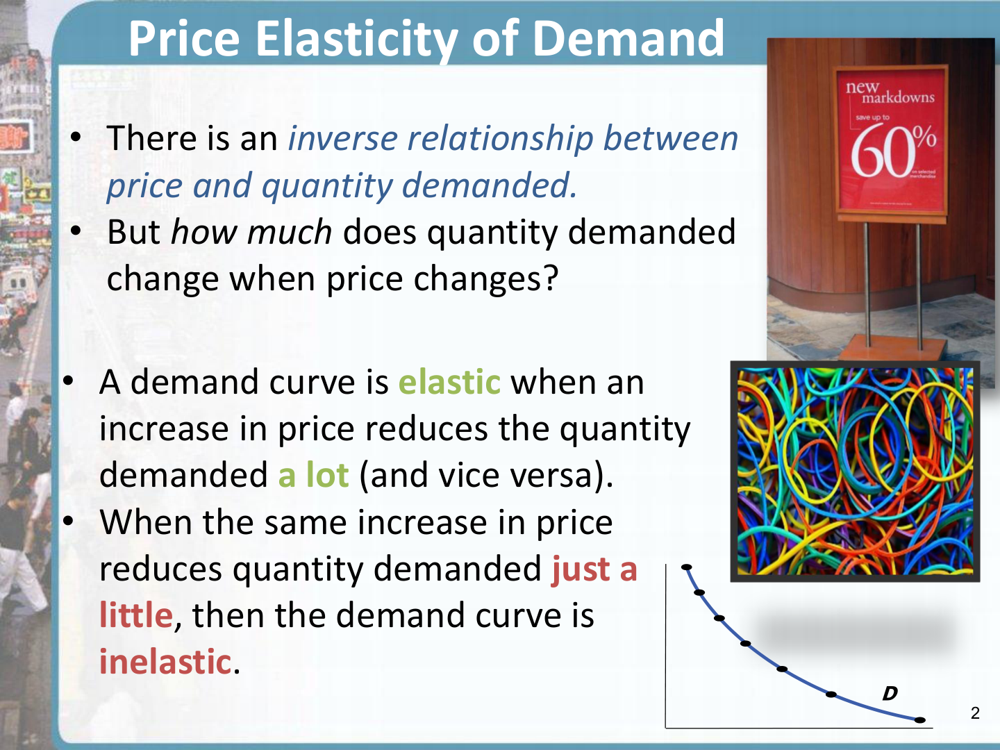

### 1.1 弹性的直观理解

在经济学中，我们知道价格与需求量之间存在反向关系（需求定律, Law of Demand）。但一个关键问题是：**当价格变动时，需求量到底会变多少？**

> [!info] 弹性 (Elastic) vs. 非弹性 (Inelastic)
> - 如果一条需求曲线是 **elastic（富有弹性）** 的，那么价格的上升会导致需求量**大幅**减少（反之亦然）。
> - 如果一条需求曲线是 **inelastic（缺乏弹性）** 的，那么同样的价格上升只会导致需求量**略微**减少。

换句话说，弹性衡量的是消费者对价格变化的**敏感程度**。

### 1.2 正式定义

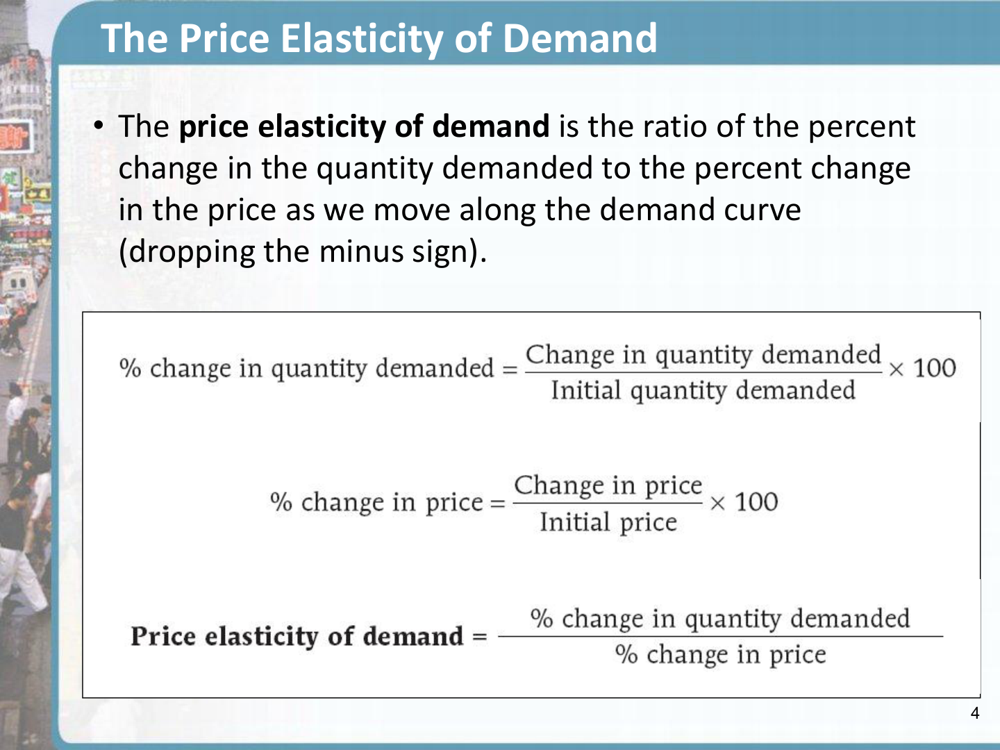

> [!info] 需求的价格弹性 (Price Elasticity of Demand)
> 需求的价格弹性是需求量变动的百分比与价格变动的百分比之间的比率（在沿需求曲线移动时，我们省略负号，取绝对值）。
>
> \[
> \text{Price Elasticity of Demand} = \frac{\%\ \text{Change in Quantity Demanded}}{\%\ \text{Change in Price}}
> \]

### 1.3 一个具体例子：疫苗接种需求

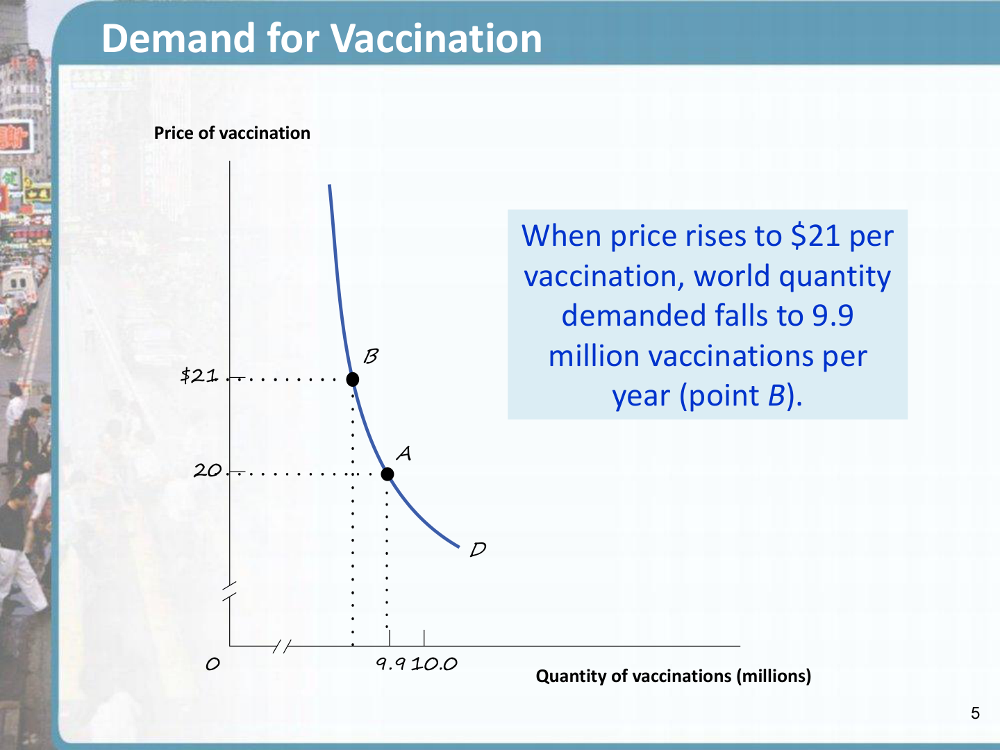

以疫苗接种为例：当每支疫苗的价格为 $20 时，全球年需求量为 1000 万支（点 A）。当价格上升到 $21 时，需求量下降到 990 万支（点 B）。价格仅上涨了 $1，需求量就减少了 10 万支——这个变化是大还是小？弹性给了我们一个标准化的衡量方式。

---

## 二、弹性的计算：中点法 (The Midpoint Method)

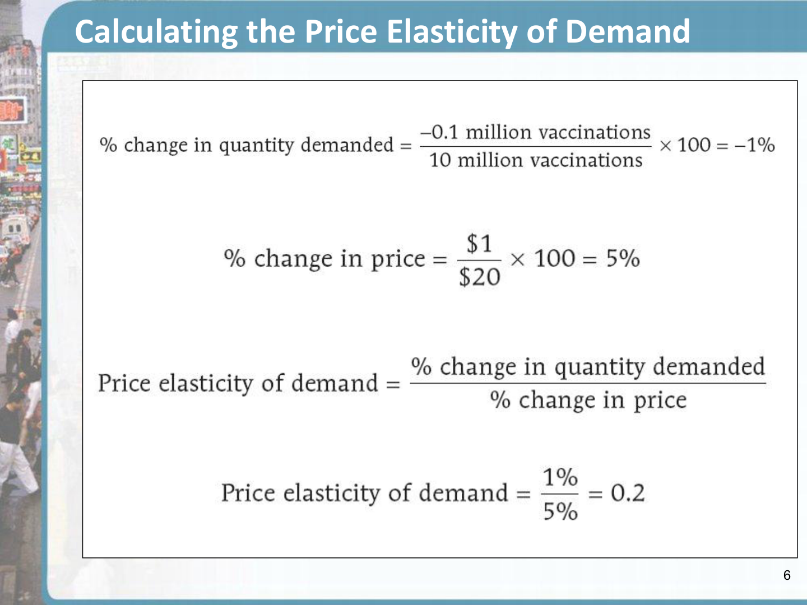

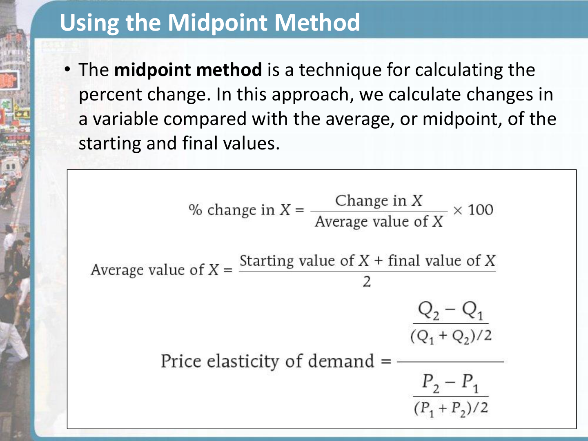

在计算百分比变化时，一个常见的问题是：从 A 点到 B 点计算的百分比变化，与从 B 点到 A 点计算的百分比变化不同。为了解决这个问题，经济学家使用**中点法 (Midpoint Method)**。

> [!info] 中点法 (Midpoint Method)
> 中点法是一种计算百分比变化的技术。在这种方法中，我们用变量的**初始值和最终值的平均值（即中点）** 作为分母来计算百分比变化。
>
> $[\%\ \text{Change in } X = \frac{\text{Change in } X}{\text{Average Value of } X} \times 100\%]$
>
> 其中，$(\text{Average Value of } X = \frac{\text{Starting Value + Final Value}}{2})$

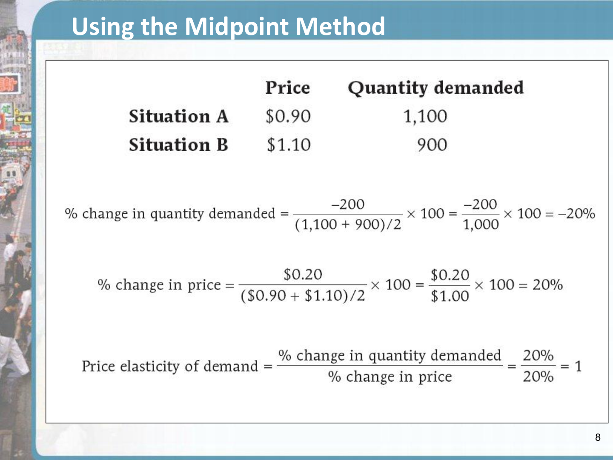

使用中点法，无论从哪个方向计算，弹性值都保持一致，这使其成为经济学中计算弹性的标准方法。

---

## 三、需求价格弹性的实际估算值

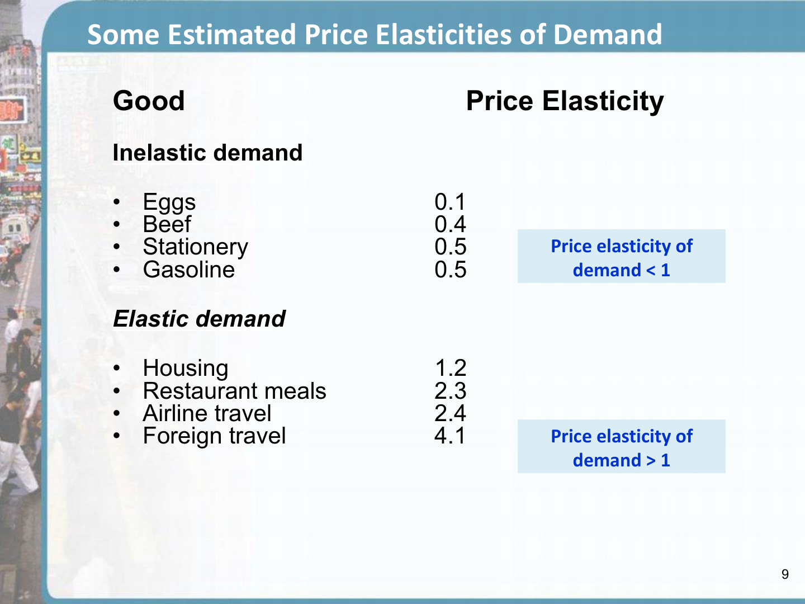

下表展示了一些常见商品的估计需求价格弹性：

| Good（商品） | Price Elasticity of Demand（需求价格弹性） | 类型 |
|:---|:---:|:---|
| **Inelastic Demand（缺乏弹性）** | | **弹性 < 1** |
| Eggs（鸡蛋） | 0.1 | Inelastic |
| Beef（牛肉） | 0.4 | Inelastic |
| Stationery（文具） | 0.5 | Inelastic |
| Gasoline（汽油） | 0.5 | Inelastic |
| **Elastic Demand（富有弹性）** | | **弹性 > 1** |
| Housing（住房） | 1.2 | Elastic |
| Restaurant meals（餐厅就餐） | 2.3 | Elastic |
| Airline travel（航空旅行） | 2.4 | Elastic |
| Foreign travel（出国旅行） | 4.1 | Elastic |

> [!info] 关键判断标准
> - **Price elasticity of demand < 1**：需求是 **inelastic（缺乏弹性）** 的。
> - **Price elasticity of demand > 1**：需求是 **elastic（富有弹性）** 的。
> - **Price elasticity of demand = 1**：需求是 **unit-elastic（单位弹性）** 的。

---

## 四、两种极端情况 (Two Extreme Cases)

### 4.1 完全非弹性需求 (Perfectly Inelastic Demand)

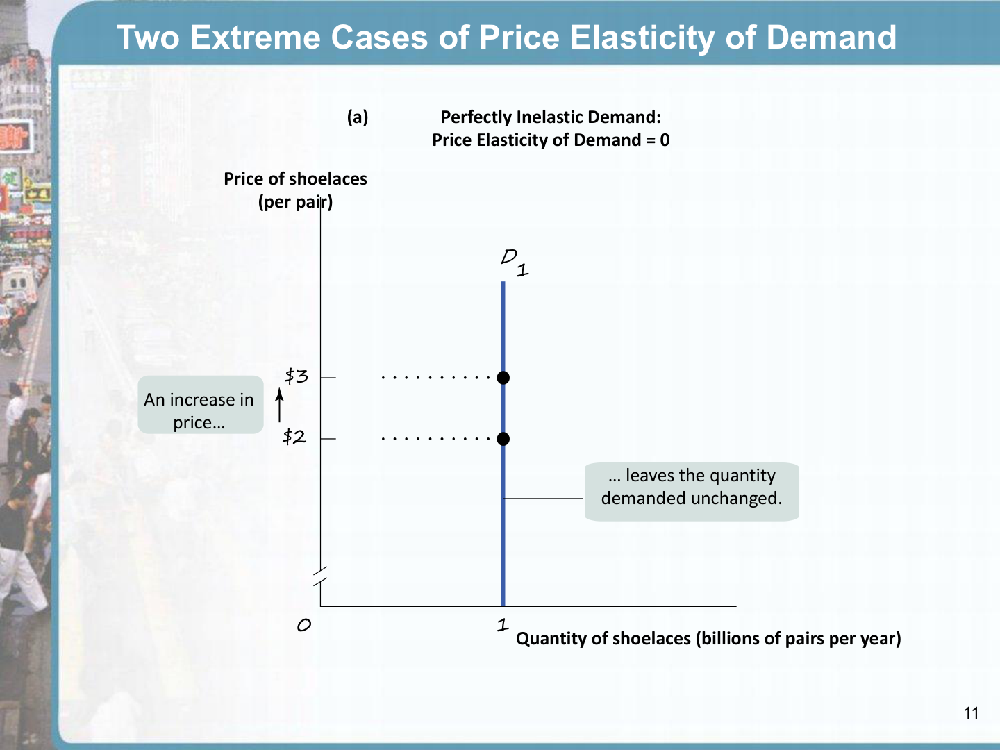

> [!info] 完全非弹性需求 (Perfectly Inelastic Demand)
> 当需求量完全不随价格变化而变化时，需求是 **perfectly inelastic** 的。此时需求曲线是一条**垂直线 (vertical line)**，价格弹性为 **0**。

以鞋带为例（如 Panel a 所示）：无论鞋带的价格是 $2 还是 $3，消费者每年始终购买 10 亿双鞋带。价格上升对需求量完全没有影响——这就是 perfectly inelastic demand。

### 4.2 完全弹性需求 (Perfectly Elastic Demand)

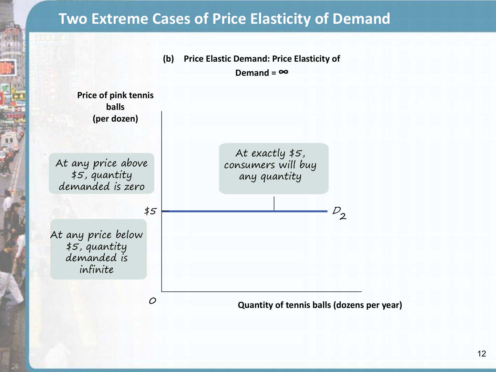

> [!info] 完全弹性需求 (Perfectly Elastic Demand)
> 当任何价格上涨都会使需求量降为零时，需求是 **perfectly elastic** 的。此时需求曲线是一条**水平线 (horizontal line)**，价格弹性为 **∞（无穷大）**。

以粉色网球为例（如 Panel b 所示）：在恰好 $5 的价格下，消费者愿意购买任意数量的粉色网球；但如果价格超过 $5，需求量立即降为零；如果价格低于 $5，消费者会购买极大数量的粉色网球而完全不买其他颜色的球。这说明当商品存在完美替代品时，需求是 perfectly elastic 的。

---

## 五、弹性需求、单位弹性需求与非弹性需求

### 5.1 单位弹性需求 (Unit-Elastic Demand)

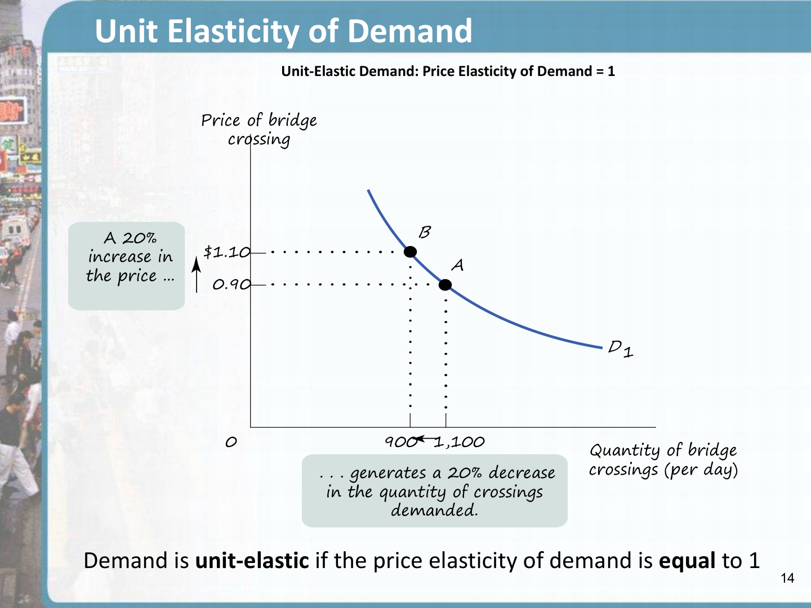

> [!info] 单位弹性需求 (Unit-Elastic Demand)
> 当价格弹性 **恰好等于 1** 时，需求是 **unit-elastic** 的。此时价格变动的百分比恰好等于需求量变动的百分比。

以过桥通行费为例：价格从 $0.90 上涨 20% 到 $1.10，过桥需求量也从 1,100 下降到 900，恰好下降 20%（使用中点法计算）。这就是 unit-elastic demand。

### 5.2 非弹性需求 (Inelastic Demand)

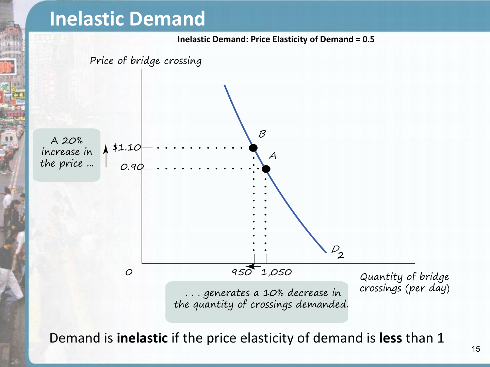

> [!info] 非弹性需求 (Inelastic Demand)
> 当价格弹性 **小于 1** 时，需求是 **inelastic** 的。此时需求量变动的百分比**小于**价格变动的百分比。

如 Panel (b) 所示：价格同样上涨 20%，但需求量只下降了 10%（从 1,050 到 950）。弹性为 0.5，属于 inelastic demand。这意味着消费者对价格变化相对不敏感。

### 5.3 弹性需求 (Elastic Demand)

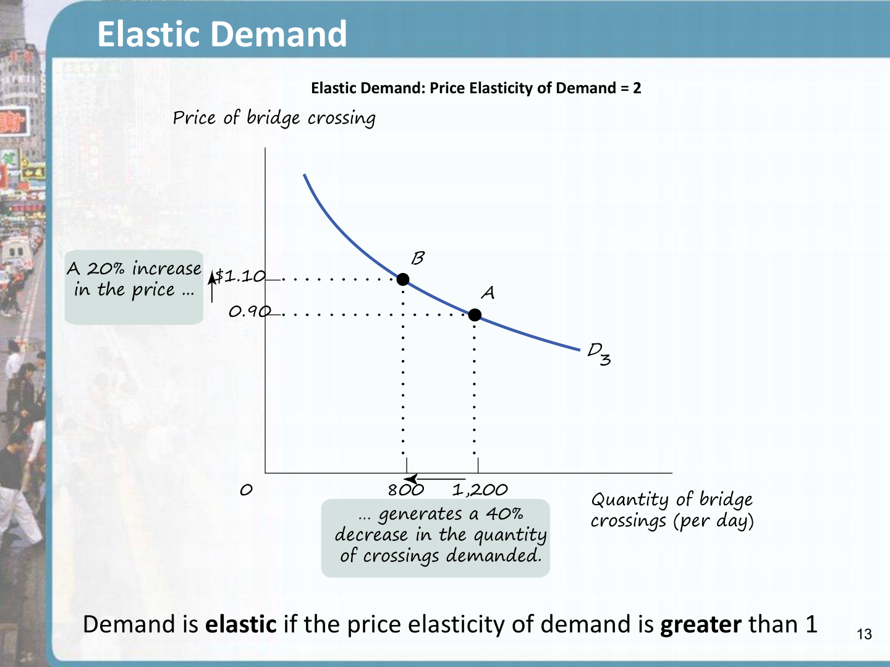

> [!info] 弹性需求 (Elastic Demand)
> 当价格弹性 **大于 1** 时，需求是 **elastic** 的。此时需求量变动的百分比**大于**价格变动的百分比。

如 Panel (c) 所示：价格上涨 20%，需求量却下降了 40%（从 1,200 到 800）。弹性为 2，属于 elastic demand。消费者对价格变化非常敏感。

---

## 六、弹性与总收益 (Elasticity and Total Revenue)

### 6.1 为什么要关心弹性的分类？

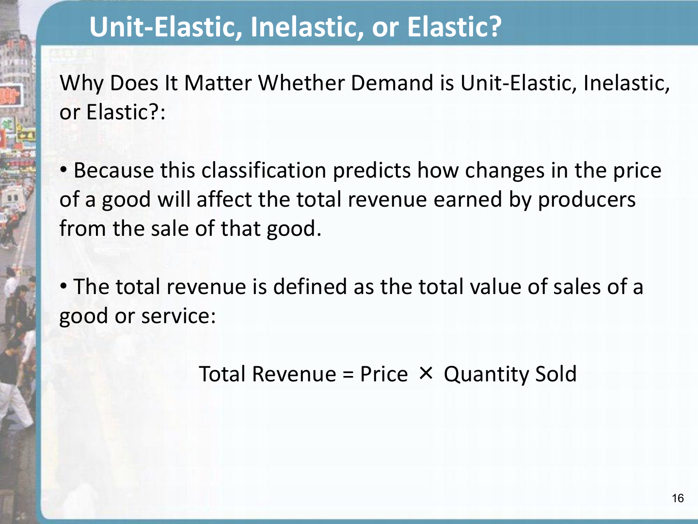

> [!question] 核心问题
> 为什么区分 unit-elastic、inelastic 和 elastic 需求如此重要？
>
> **答案**：因为这种分类可以预测商品价格的变化将如何影响生产者从销售该商品中获得的 **总收益 (Total Revenue)**。

> [!info] 总收益 (Total Revenue)
> 总收益定义为销售一种商品或服务的总价值：
> Total Revenue = Price × Quantity Sold

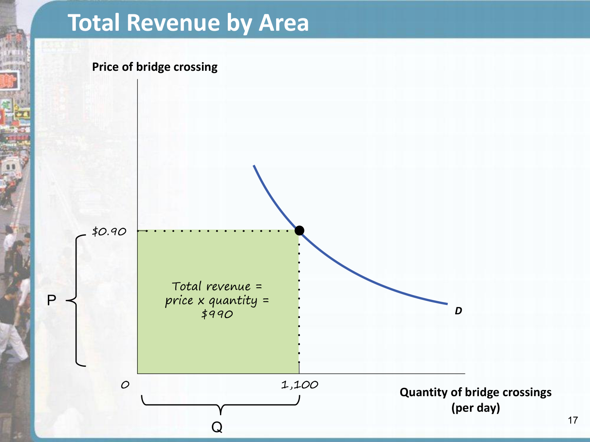

上图绿色矩形区域代表了在价格为 $0.90、通行量为 1,100 时的总收益：$0.90 × 1,100 = $990。

### 6.2 价格效应与数量效应

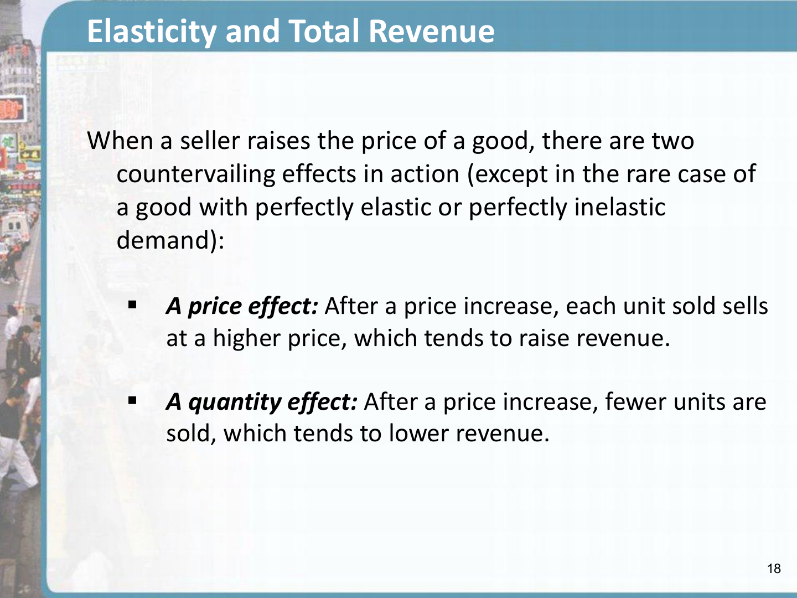

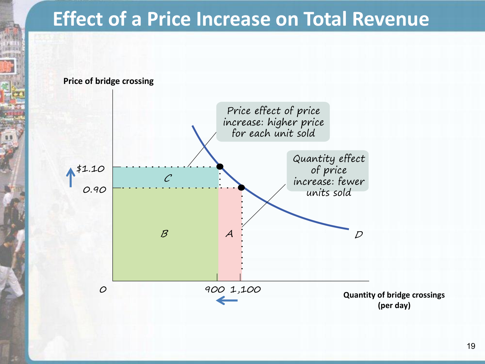

当卖家提高商品价格时，有两个相互抵消的效应在起作用（除非商品具有 perfectly elastic 或 perfectly inelastic 的需求）：

> [!info] 两种效应
> - **价格效应 (Price Effect)**：价格上涨后，每售出一单位商品的价格更高，这倾向于**增加**总收益。
> - **数量效应 (Quantity Effect)**：价格上涨后，售出的商品数量减少，这倾向于**减少**总收益。
>
> 最终总收益是增加还是减少，取决于价格弹性——即哪种效应更强。

如上图 Figure 6-4(b) 所示：价格从 $0.90 上涨到 $1.10。数量效应使总收益减少面积 A，价格效应使总收益增加面积 C。总体效果取决于需求的价格弹性。

### 6.3 弹性分类与总收益的关系

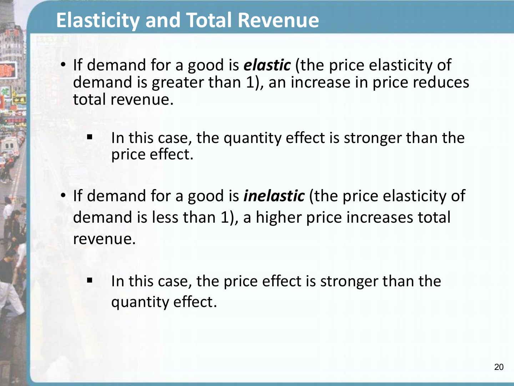

> [!warning] 关键结论（考试重点）
> | 需求类型 | 弹性值 | 涨价对总收益的影响 | 主导效应 |
> |:---|:---:|:---|:---|
> | **Elastic（富有弹性）** | > 1 | 总收益 **减少** | 数量效应 > 价格效应 |
> | **Inelastic（缺乏弹性）** | < 1 | 总收益 **增加** | 价格效应 > 数量效应 |
> | **Unit-Elastic（单位弹性）** | = 1 | 总收益 **不变** | 两种效应恰好抵消 |

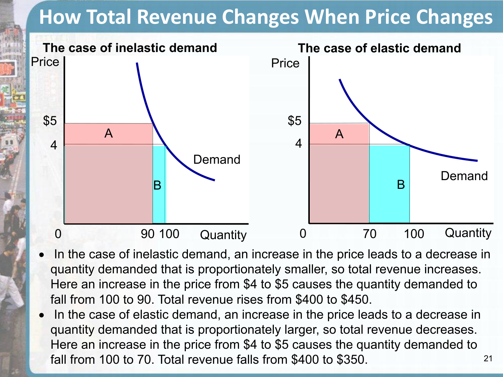

上图直观展示了两种情况的对比：
- **Inelastic demand 情形**：价格从 $4 涨到 $5（上涨 25%），需求量仅从 100 降到 90（下降 10%），总收益从 $400 **增加到** $450。
- **Elastic demand 情形**：价格同样从 $4 涨到 $5，需求量却从 100 剧降到 70（下降 30%），总收益从 $400 **减少到** $350。

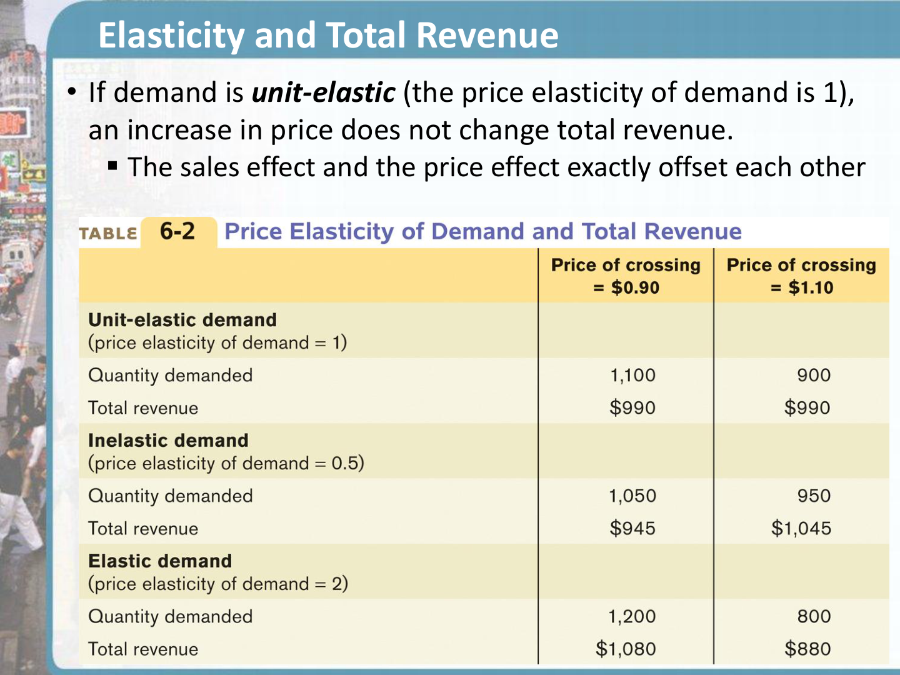

### 6.4 沿线性需求曲线的弹性变化

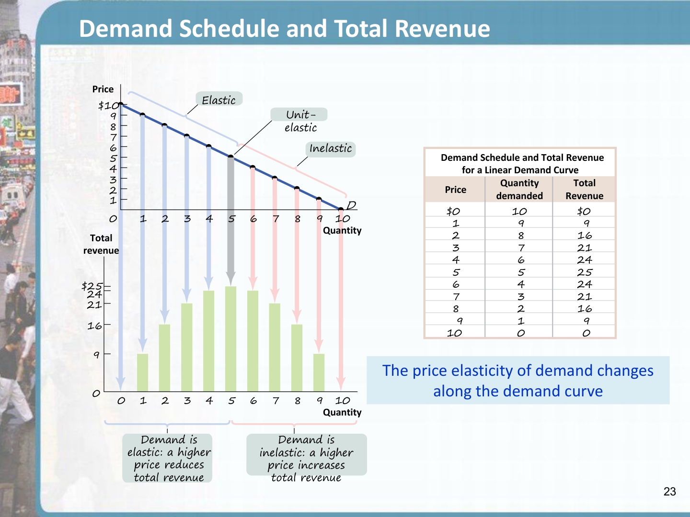

> [!info] 重要洞察
> **需求的价格弹性沿需求曲线是变化的**——即使是在一条直线上也是如此。

下表中的数据来自一条线性需求曲线 (Linear Demand Curve)：

| Price（价格） | Quantity Demanded（需求量） | Total Revenue（总收益） | 弹性区间 |
|:---:|:---:|:---:|:---|
| $0 | 10 | $0 | Elastic |
| $1 | 9 | $9 | Elastic |
| $2 | 8 | $16 | Elastic |
| $3 | 7 | $21 | Elastic |
| $4 | 6 | $24 | Elastic |
| $5 | 5 | $25 | **Unit-Elastic** |
| $6 | 4 | $24 | Inelastic |
| $7 | 3 | $21 | Inelastic |
| $8 | 2 | $16 | Inelastic |
| $9 | 1 | $9 | Inelastic |
| $10 | 0 | $0 | Inelastic |

从表中可以看出：
- **在低价区域**，需求是 inelastic 的——提高价格会使总收益增加（因为数量效应较弱）。
- **在高价区域**，需求是 elastic 的——提高价格反而会减少总收益（因为数量效应较强）。
- **在中间某点**（本例中 P=$5, Q=5），需求是 unit-elastic 的，总收益达到最大值 $25。

---

## 七、影响需求价格弹性的因素

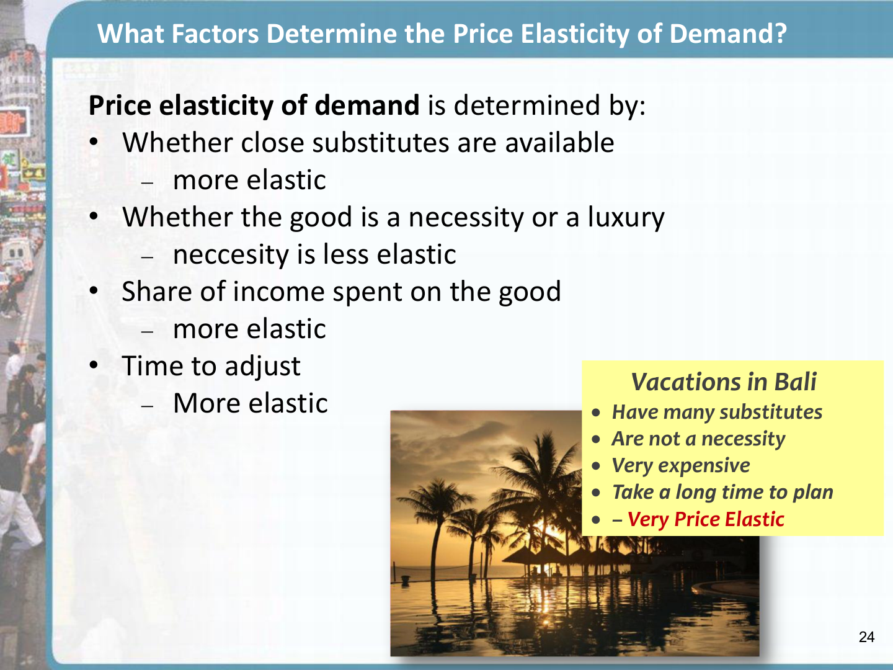

> [!info] 决定需求价格弹性的四大因素

| 因素 | 说明 | 弹性变化方向 |
|:---|:---|:---|
| **是否存在近似替代品 (Close Substitutes)** | 替代品越多，消费者越容易转向其他选择 | 替代品多 → **更 elastic** |
| **必需品 vs. 奢侈品 (Necessity vs. Luxury)** | 必需品无论价格如何都要购买，奢侈品则可以推迟或放弃 | 必需品 → **更 inelastic** |
| **占收入的比例 (Share of Income)** | 花费占比越大，消费者对价格越敏感 | 占比大 → **更 elastic** |
| **调整时间 (Time to Adjust)** | 时间越长，消费者越能找到替代方案 | 时间长 → **更 elastic** |

> [!info] 经典案例：巴厘岛度假 (Vacations in Bali)
> 巴厘岛度假是 **highly price elastic** 的经典例子，因为它同时满足四个条件：
> 1. **有很多替代品**（可以去泰国、马尔代夫、夏威夷等）
> 2. **不是必需品**（奢侈品消费）
> 3. **非常昂贵**（占收入比例大）
> 4. **需要长时间规划**（消费者有充分时间调整）

---

## 八、其他需求弹性 (Other Demand Elasticities)

### 8.1 需求的交叉价格弹性 (Cross-Price Elasticity of Demand)

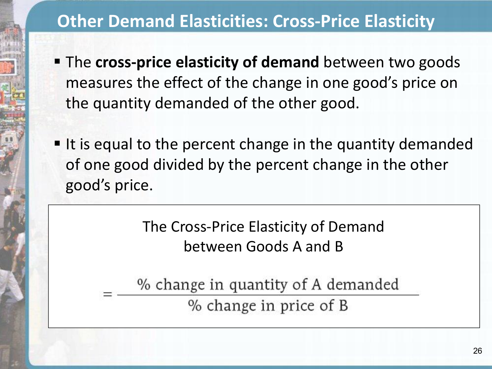

> [!info] 交叉价格弹性 (Cross-Price Elasticity of Demand)
> 交叉价格弹性衡量的是**一种商品价格的变动对另一种商品需求量的影响**。
>
> $[\text{Cross-Price Elasticity of Demand} = \frac{\%\ \text{Change in Quantity of Good A Demanded}}{\%\ \text{Change in Price of Good B}}]$

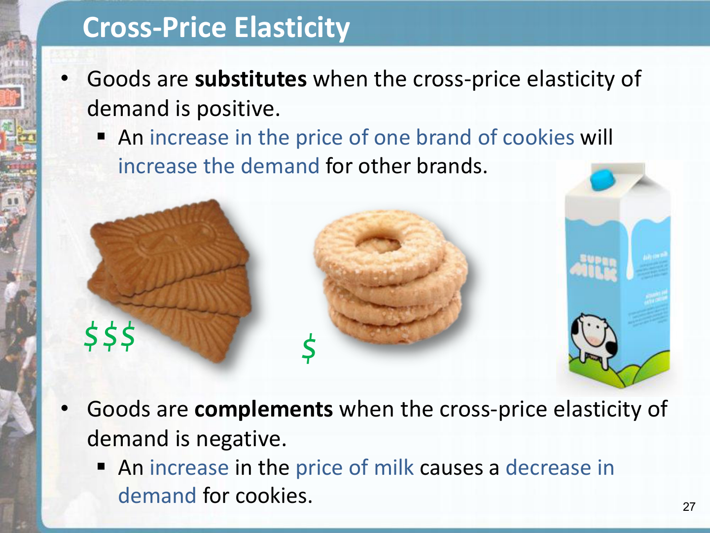

> [!warning] 交叉弹性的符号含义（考试重点）
> - **替代品 (Substitutes)**：交叉价格弹性为 **正 (+)** —— B 商品涨价，A 商品的需求量上升。
>   - 例：某品牌饼干涨价 → 其他品牌饼干需求增加。
> - **互补品 (Complements)**：交叉价格弹性为 **负 (−)** —— B 商品涨价，A 商品的需求量下降。
>   - 例：牛奶涨价 → 对饼干（搭配牛奶食用）的需求下降。

### 8.2 需求的收入弹性 (Income Elasticity of Demand)

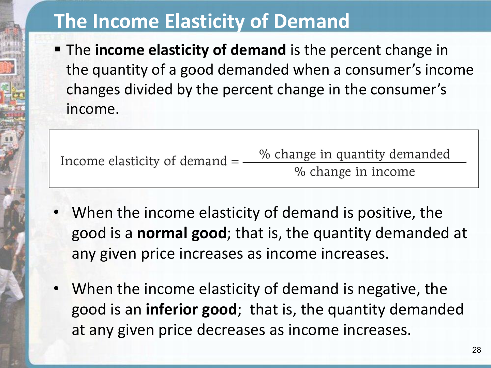

> [!info] 收入弹性 (Income Elasticity of Demand)
> 收入弹性衡量的是消费者收入变动对商品需求量的影响。
>
> $[\text{Income Elasticity of Demand} = \frac{\%\ \text{Change in Quantity Demanded}}{\%\ \text{Change in Income}}]$

> [!warning] 收入弹性的符号含义（考试重点）
> - **正收入弹性 (Positive)**：该商品是 **normal good（正常商品）** ——收入增加，需求增加。
>   - **Income-elastic（富有收入弹性）**：收入弹性 > 1（如奢侈品）。
>   - **Income-inelastic（缺乏收入弹性）**：收入弹性在 0 到 1 之间（如生活必需品）。
> - **负收入弹性 (Negative)**：该商品是 **inferior good（低档商品）** ——收入增加，需求反而减少（如方便面、公共交通等）。

---

## 九、供给的价格弹性 (Price Elasticity of Supply)

### 9.1 定义

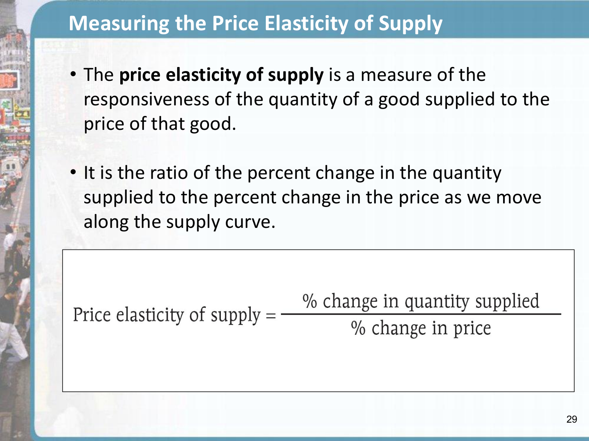

> [!info] 供给的价格弹性 (Price Elasticity of Supply)
> 供给的价格弹性衡量的是商品供给量对该商品价格变化的反应程度。
>
> $[\text{Price Elasticity of Supply} = \frac{\%\ \text{Change in Quantity Supplied}}{\%\ \text{Change in Price}}]$

### 9.2 单位弹性供给示例

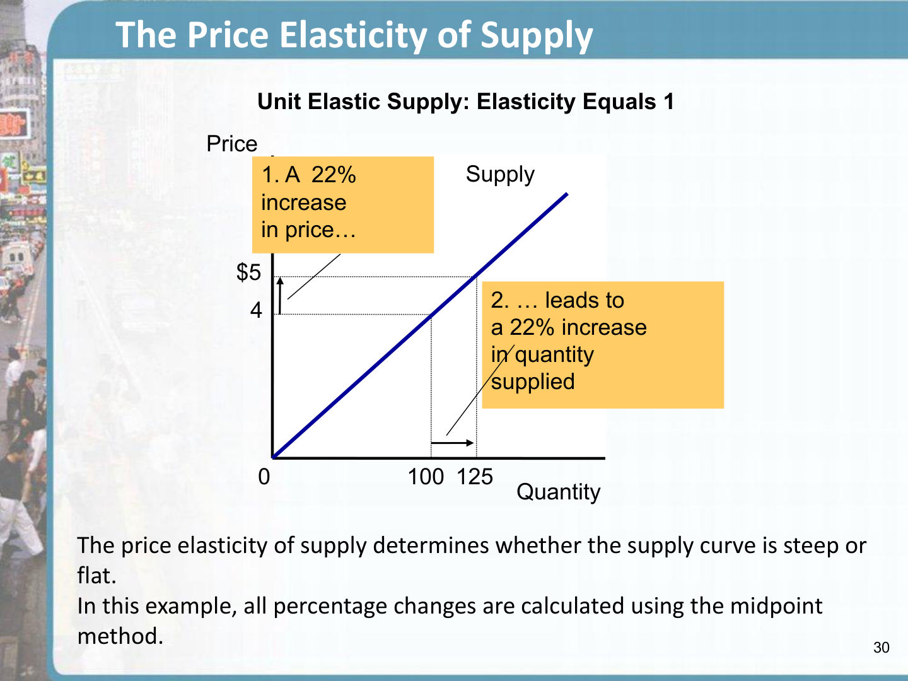

供给弹性决定了供给曲线是陡峭还是平坦。在单位弹性供给的例子中，价格上升 22%（使用中点法），供给量也恰好上升 22%，弹性等于 1。

### 9.3 两种极端情况

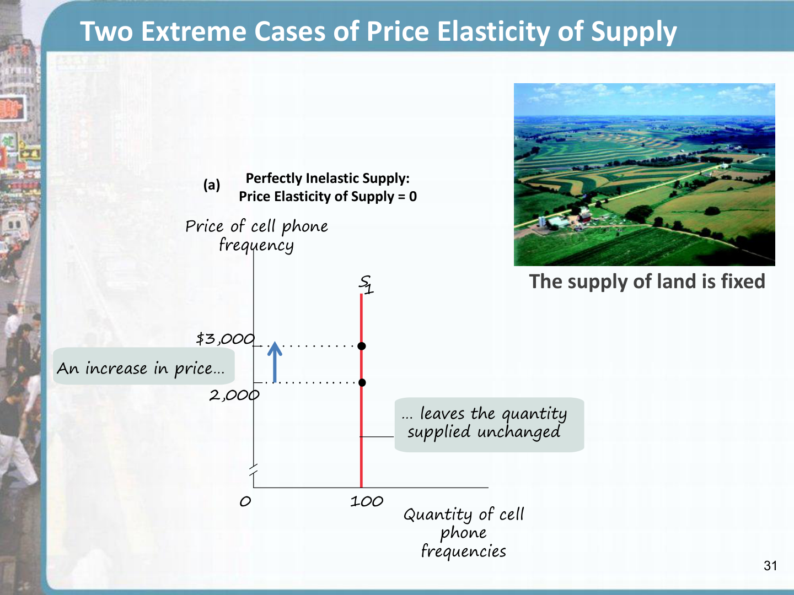

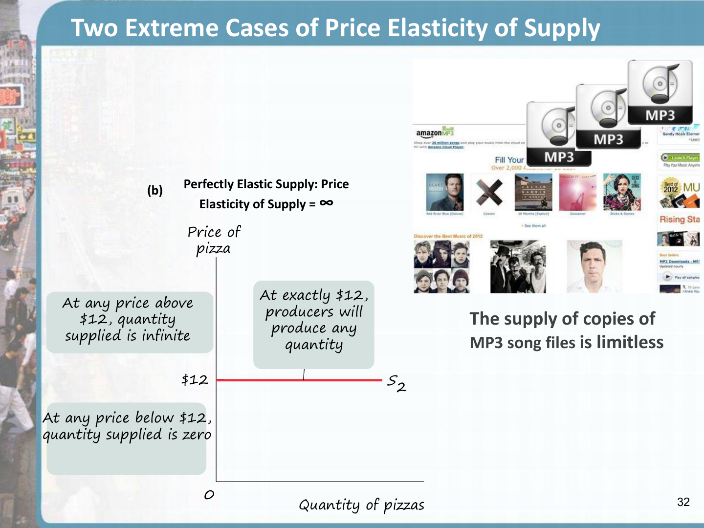

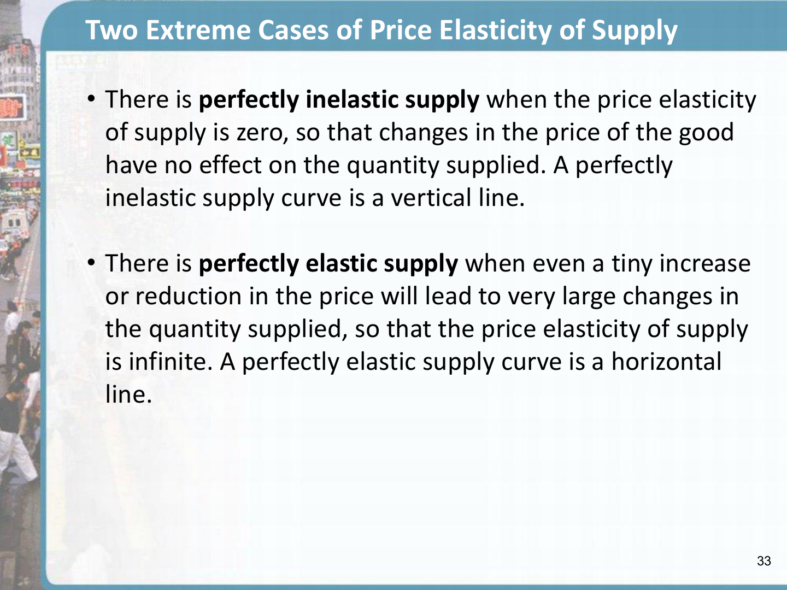

> [!info] 完全非弹性供给 (Perfectly Inelastic Supply)
> - 价格弹性 = **0**
> - 供给曲线为**垂直线 (vertical line)**
> - 无论价格如何变化，供给量始终不变
> - 经典例子：**手机通信频段 (cell phone frequencies)**——频段的数量由政府牌照决定，不随价格变化；**土地 (land)** 的供给也是固定的。

> [!info] 完全弹性供给 (Perfectly Elastic Supply)
> - 价格弹性 = **∞（无穷大）**
> - 供给曲线为**水平线 (horizontal line)**
> - 在某一特定价格下，生产者愿意供给任意数量；低于该价格则供给量为零
> - 经典例子：**MP3 歌曲文件的复制品**——在 $12 的价格下，可以无限量供应数字拷贝。

### 9.4 影响供给弹性的因素

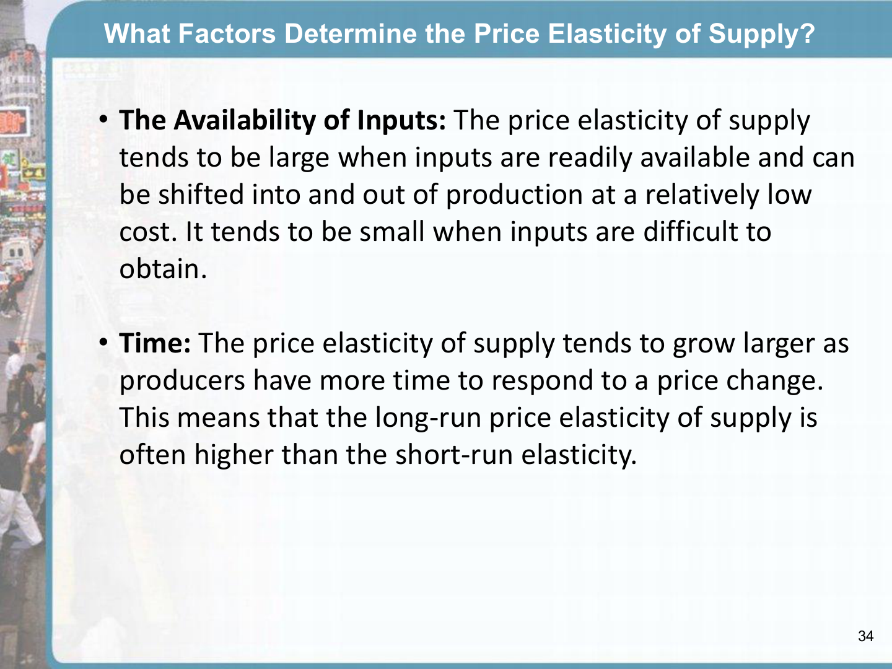

> [!info] 决定供给价格弹性的两大因素

| 因素 | 说明 |
|:---|:---|
| **投入品的可获得性 (Availability of Inputs)** | 当投入品容易获得且能以较低成本转移进出生产时，供给弹性较大；当投入品难以获取时，供给弹性较小。 |
| **时间 (Time)** | 生产者对价格变化做出反应的时间越长，供给弹性越大。**长期供给弹性 (long-run price elasticity of supply) 通常高于短期弹性 (short-run elasticity)**。 |

### 9.5 供给弹性沿供给曲线的变化

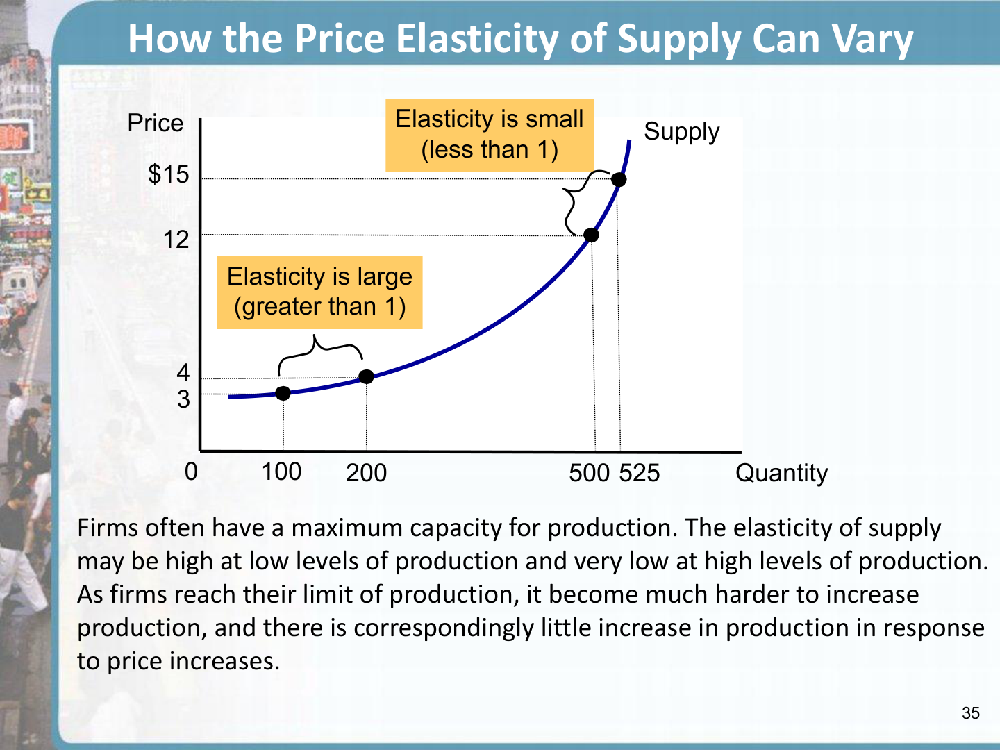

> [!info] 产能限制与弹性变化
> 企业通常有最大产能限制。在**低产量水平**，供给弹性可能很高（企业有大量闲置产能可以快速启用）；但在**高产量水平**，当企业接近产能极限时，进一步增加产量变得非常困难，供给弹性会显著下降。

如图所示：在低价低产量区间（$3-$4），弹性大于 1；而在高价高产量区间（$12-$15），弹性远小于 1，因为企业已经接近最大产能。

---

## 十、弹性全景图 (An Elasticity Menagerie)

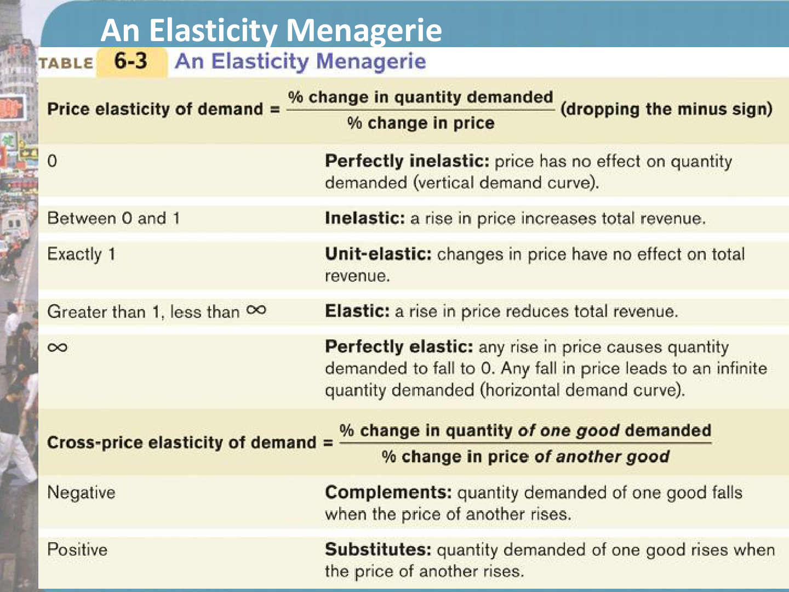

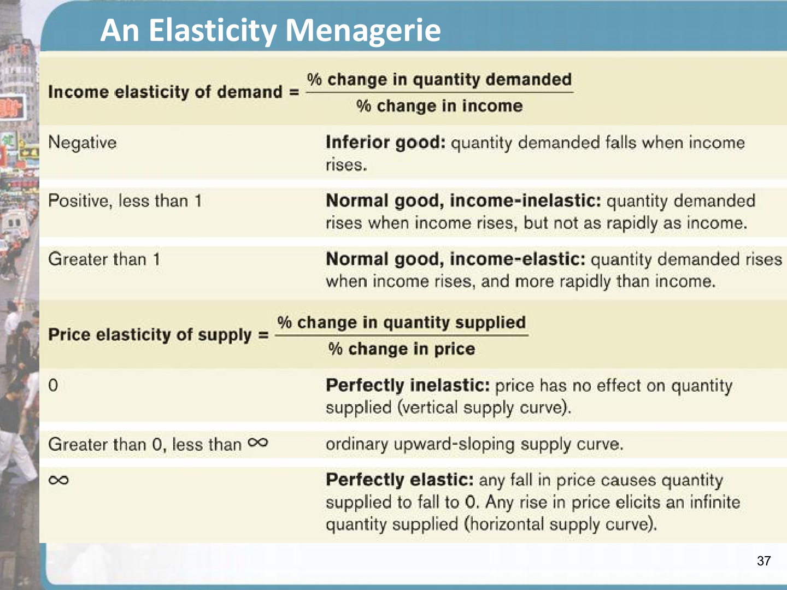

下表总结了本章涵盖的所有弹性概念：

| 弹性类型                                           | 公式                                              | 正/负含义                                          | 极端情况                                           |
| :--------------------------------------------- | :---------------------------------------------- | :--------------------------------------------- | :--------------------------------------------- |
| **Price Elasticity of Demand**（需求价格弹性）         | $(\frac{\%\Delta Q_D}{\%\Delta P})$             | 取绝对值；>1 elastic, <1 inelastic, =1 unit-elastic | 0 = perfectly inelastic, ∞ = perfectly elastic |
| **Cross-Price Elasticity of Demand**（需求交叉价格弹性） | $(\frac{\%\Delta Q_{D(A)}}{\%\Delta P_B})$      | 正 = substitutes（替代品）; 负 = complements（互补品）     | —                                              |
| **Income Elasticity of Demand**（需求收入弹性）        | $(\frac{\%\Delta Q_D}{\%\Delta \text{Income}})$ | 正 = normal good; 负 = inferior good             | —                                              |
| **Price Elasticity of Supply**（供给价格弹性）         | $(\frac{\%\Delta Q_S}{\%\Delta P})$             | 始终为正（供给定律）                                     | 0 = perfectly inelastic, ∞ = perfectly elastic |

---

## 十一、本章小结 (Chapter Summary)

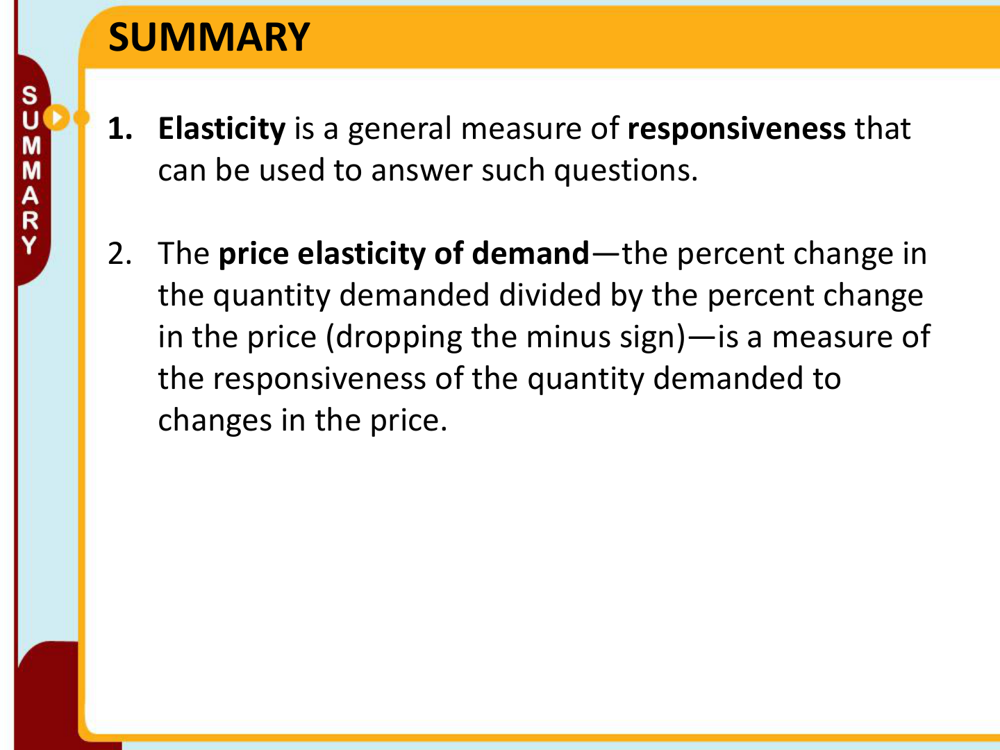

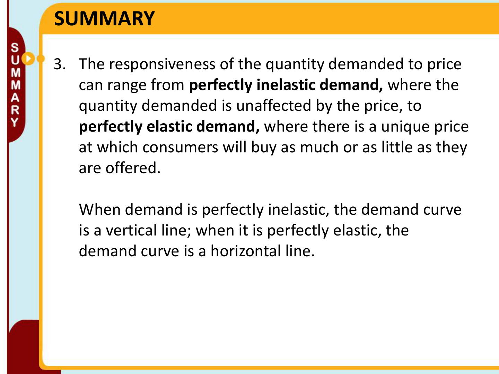

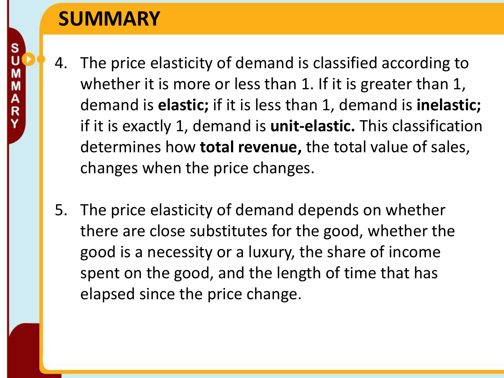

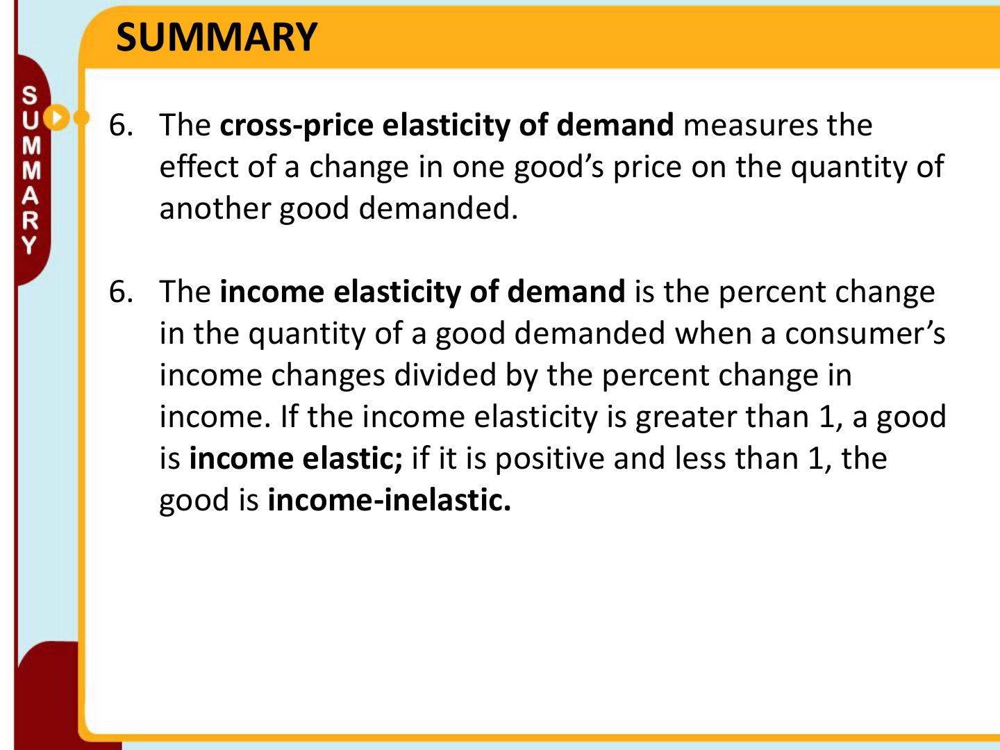

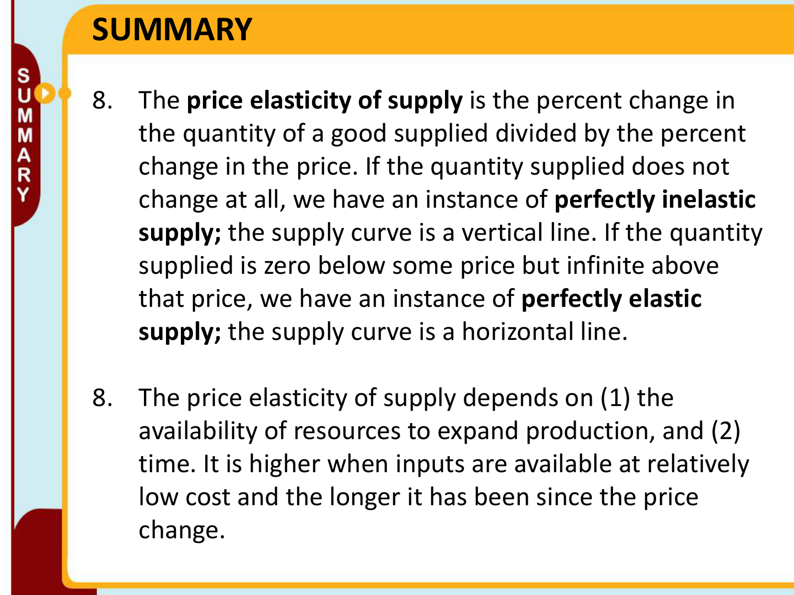

1. **弹性 (Elasticity)** 是一个衡量反应程度的通用指标，用于回答"一个变量对另一个变量的变化有多敏感"这类问题。

2. **需求的价格弹性 (Price Elasticity of Demand)** 等于需求量变动的百分比除以价格变动的百分比（省略负号），衡量的是需求量对价格变化的反应程度。

3. 需求对价格的反应程度可以从 **perfectly inelastic demand**（需求量完全不受价格影响，需求曲线为垂直线）到 **perfectly elastic demand**（存在唯一价格使消费者购买任意数量，需求曲线为水平线）。

4. 需求价格弹性根据大于或小于 1 来分类：大于 1 为 **elastic**，小于 1 为 **inelastic**，等于 1 为 **unit-elastic**。这一分类决定了 **总收益 (Total Revenue)** 如何随价格变化而变化。

5. 需求价格弹性取决于四个因素：**近似替代品的存在与否、商品是必需品还是奢侈品、商品支出占收入的比例、以及价格变动后经过的时间长短**。

6. **交叉价格弹性 (Cross-Price Elasticity of Demand)** 衡量一种商品价格变化对另一种商品需求量的影响。正值为替代品，负值为互补品。

7. **收入弹性 (Income Elasticity of Demand)** 等于需求量变动的百分比除以收入变动的百分比。收入弹性大于 1 为 income-elastic，介于 0 到 1 之间为 income-inelastic，负值代表 inferior good。

8. **供给的价格弹性 (Price Elasticity of Supply)** 等于供给量变动的百分比除以价格变动的百分比。**Perfectly inelastic supply**（供给曲线为垂直线）和 **perfectly elastic supply**（供给曲线为水平线）是两个极端情况。供给弹性取决于：(1) 扩大生产所需资源的可获得性；(2) 时间——投入品越容易以低成本获得、距价格变动的时间越长，供给弹性越高。

---

## 十二、关键术语 (Key Terms)

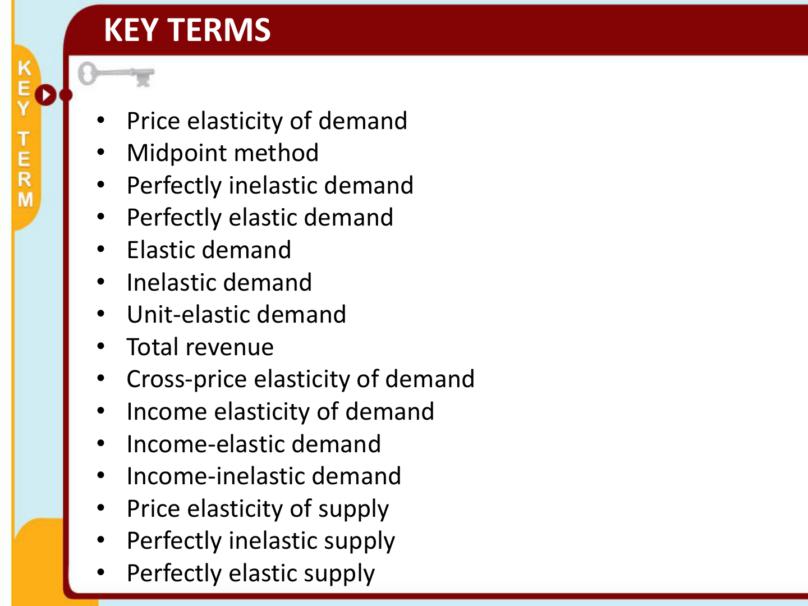

| 英文术语 | 中文翻译 |
|:---|:---|
| **Price elasticity of demand** | 需求的价格弹性 |
| **Midpoint method** | 中点法 |
| **Perfectly inelastic demand** | 完全非弹性需求 |
| **Perfectly elastic demand** | 完全弹性需求 |
| **Elastic demand** | 富有弹性需求 |
| **Inelastic demand** | 缺乏弹性需求 |
| **Unit-elastic demand** | 单位弹性需求 |
| **Total revenue** | 总收益 |
| **Cross-price elasticity of demand** | 需求的交叉价格弹性 |
| **Income elasticity of demand** | 需求的收入弹性 |
| **Income-elastic demand** | 富有收入弹性需求 |
| **Income-inelastic demand** | 缺乏收入弹性需求 |
| **Price elasticity of supply** | 供给的价格弹性 |
| **Perfectly inelastic supply** | 完全非弹性供给 |
| **Perfectly elastic supply** | 完全弹性供给 |
