# Chapter 7 — Taxes（税收）

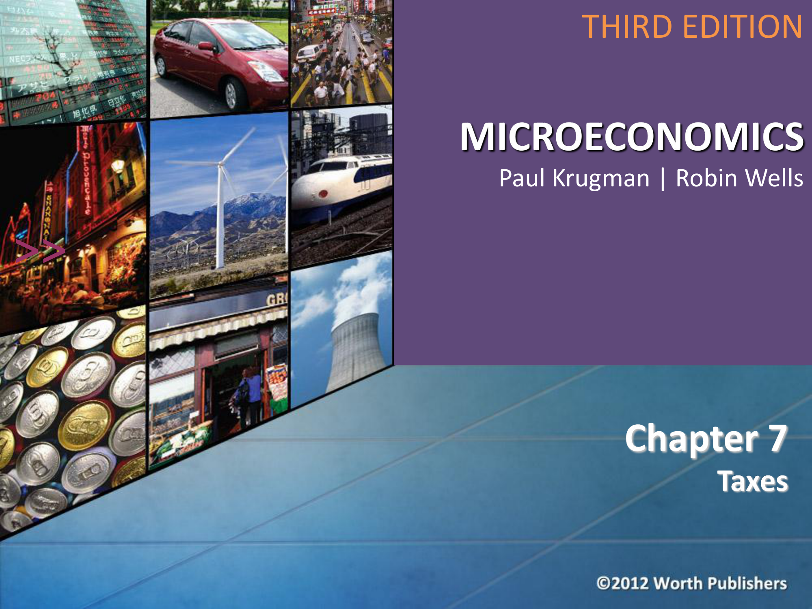

> [!info] 本章学习目标 (What You Will Learn)
> - 税收对竞争市场中供需的影响
> - 谁真正承担税负（Tax Incidence）的决定因素
> - 税收的成本与收益，以及为何税收造成的社会成本大于其征收的税收收入
> - Progressive tax（累进税）与 Regressive tax（累退税）的区别，以及 Tax Equity（税收公平）与 Tax Efficiency（税收效率）之间的权衡

---

## 1. 税收经济学基础 (The Economics of Taxes: A Preliminary View)

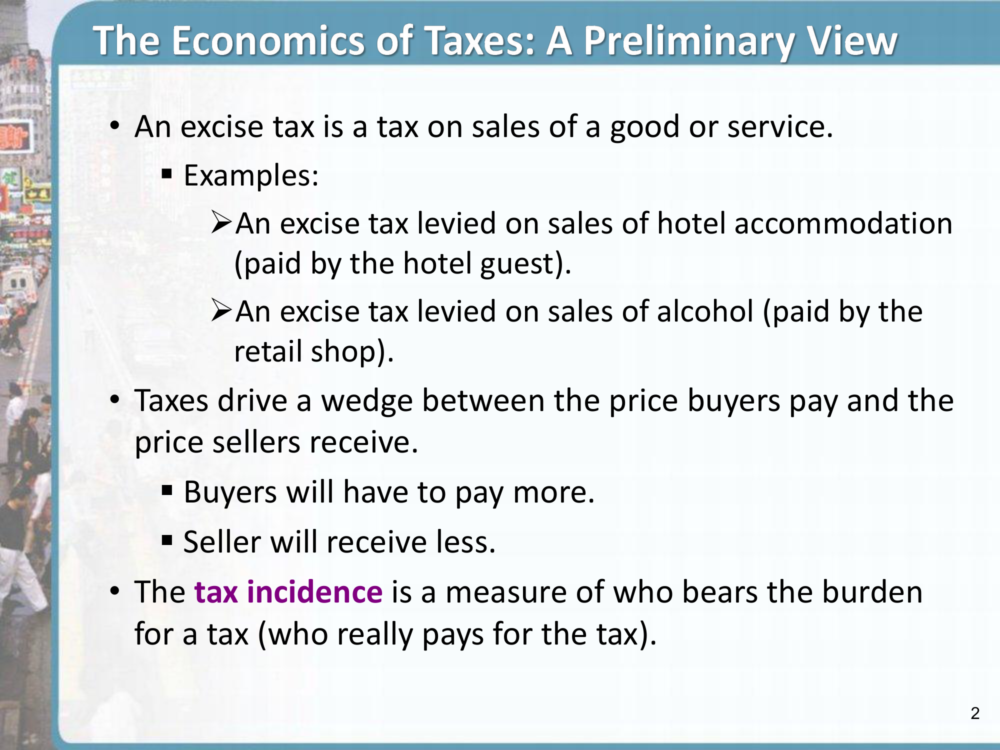

### 1.1 Excise Tax（消费税/从量税）

> [!info] 定义：Excise Tax
> An **excise tax** is a tax on sales of a good or service.（消费税是对商品或服务销售征收的税。）

常见的 Excise Tax 例子：
- 对酒店住宿征收的税（由住客支付）
- 对酒类销售征收的税（由零售店支付）

税收在买方支付的价格 (price buyers pay) 与卖方收到的价格 (price sellers receive) 之间打入了一个 **wedge（楔子）**：买方需要支付更多，而卖方实际收到更少。

> [!info] 定义：Tax Incidence（税收归宿/税负承担）
> **Tax incidence** is a measure of who bears the burden for a tax — who really pays for the tax.（税收归宿衡量的是谁真正承担了税收负担。）

---

### 1.2 酒店房间市场的供需模型

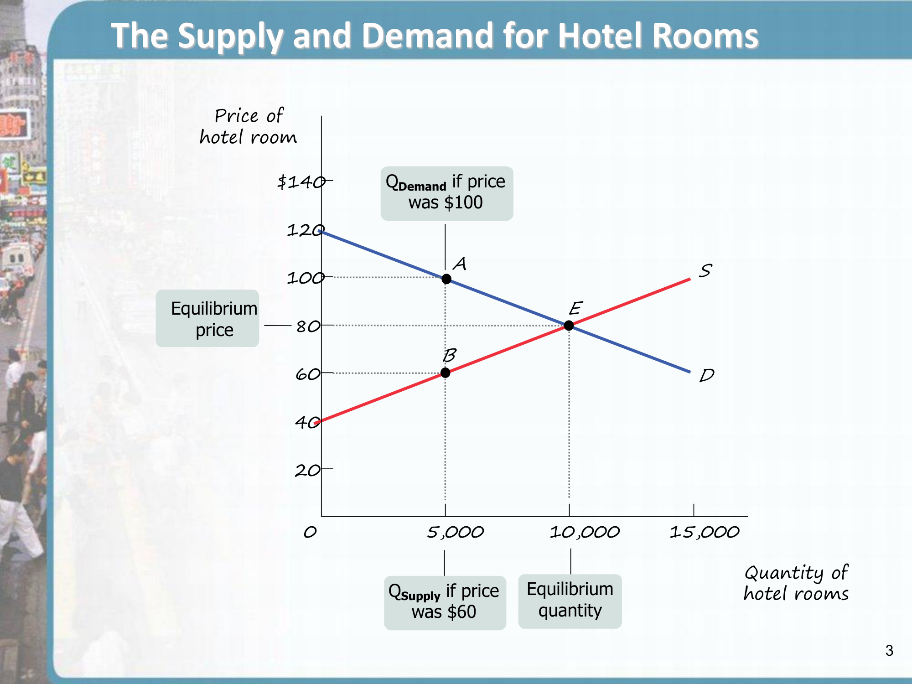

在没有税收的情况下，酒店房间的均衡价格 (equilibrium price) 为每晚 **$80**，均衡数量 (equilibrium quantity) 为每晚 **10,000 间**（点 E）。

- 供给曲线 S 展示了在任意给定价格下（税前）的供给量
- 当价格为 $60/晚时，酒店业主愿意提供 5,000 间房（点 B）
- 但在征税后，酒店业主只有在收到 $100 时才愿意提供同样的 5,000 间：其中 $60 归自己，$40 作为税款交给市政府

---

## 2. Tax Incidence（税收归宿）

### 2.1 对酒店业主征收 Excise Tax

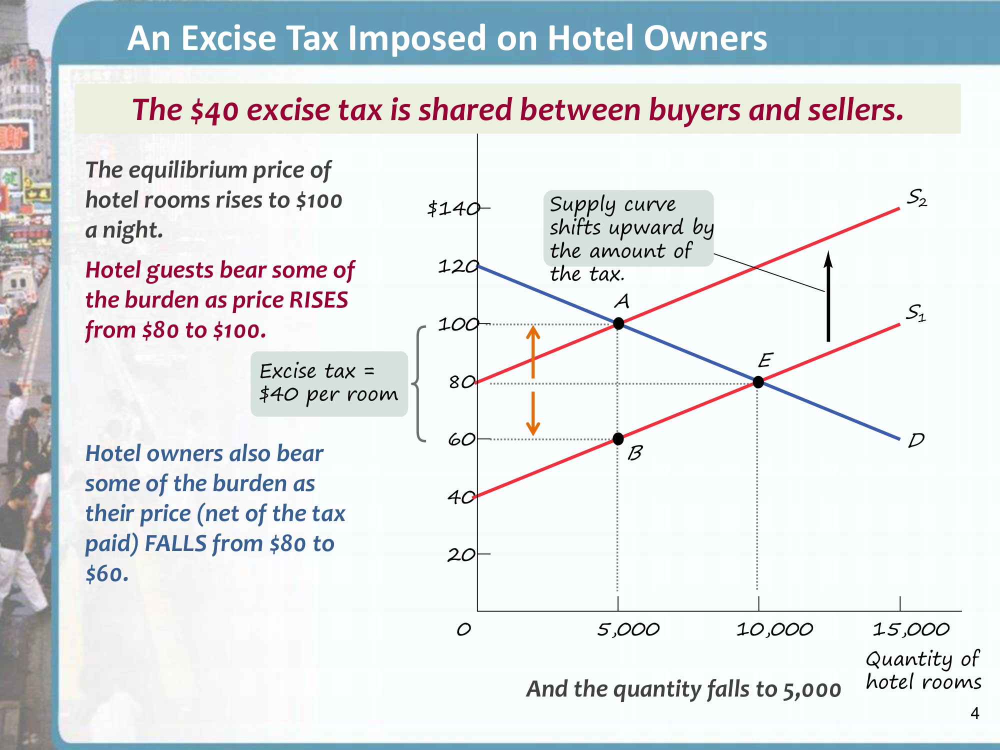

当对酒店业主征收 **$40/间** 的 Excise Tax 时：

- **供给曲线向上平移**，平移幅度等于税额
- 均衡价格从 $80 上升至 **$100**（消费者支付）
- 均衡数量从 10,000 下降至 **5,000** 间
- 酒店客人承担部分税负：价格从 $80 上涨至 $100
- 酒店业主也承担部分税负：税后净收入从 $80 降至 **$60**
- **$40 的税负由买卖双方共同分担**

### 2.2 对酒店客人征收 Excise Tax

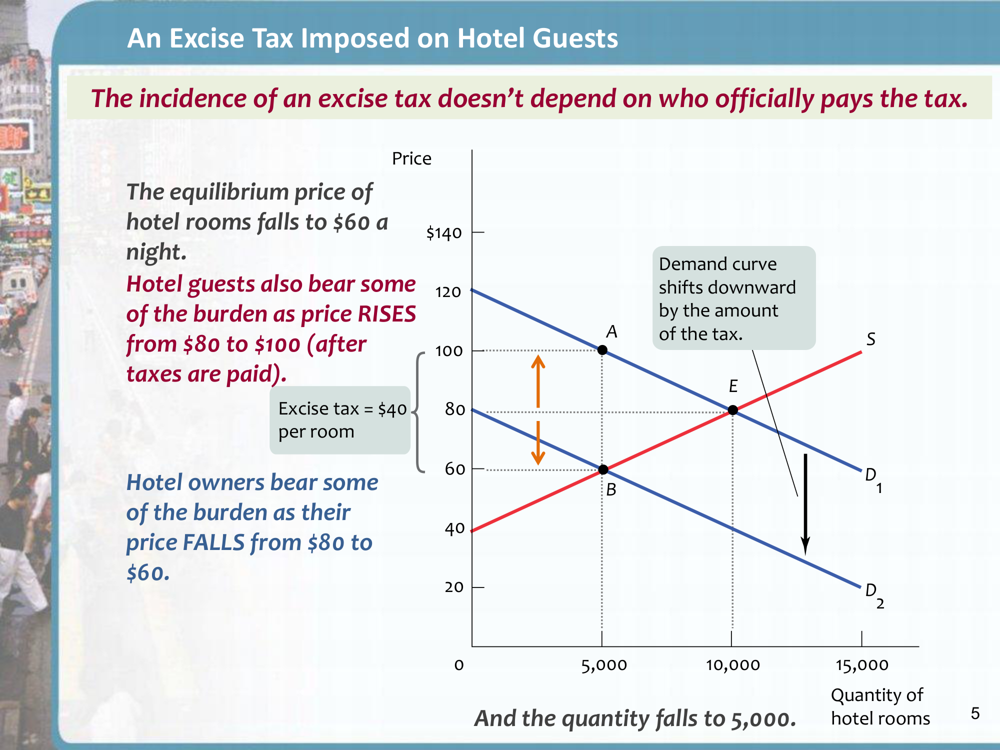

当改为对酒店客人征收同样的 $40/间税收时：

- **需求曲线向下平移**，平移幅度等于税额
- 均衡价格降至 $60（酒店收到的价格）
- 数量同样降至 5,000 间
- 酒店客人依然承担税负：实际支付 $100（$60 房费 + $40 税费）
- 酒店业主依然承担税负：净收入从 $80 降至 $60

> [!warning] 关键结论
> **The incidence of an excise tax doesn't depend on who officially pays the tax.**（税收归宿不取决于谁在法律上支付税款。）无论是对生产者征税还是对消费者征税，最终结果相同。

> [!question] Active Learning Practice (Slide 7)
> 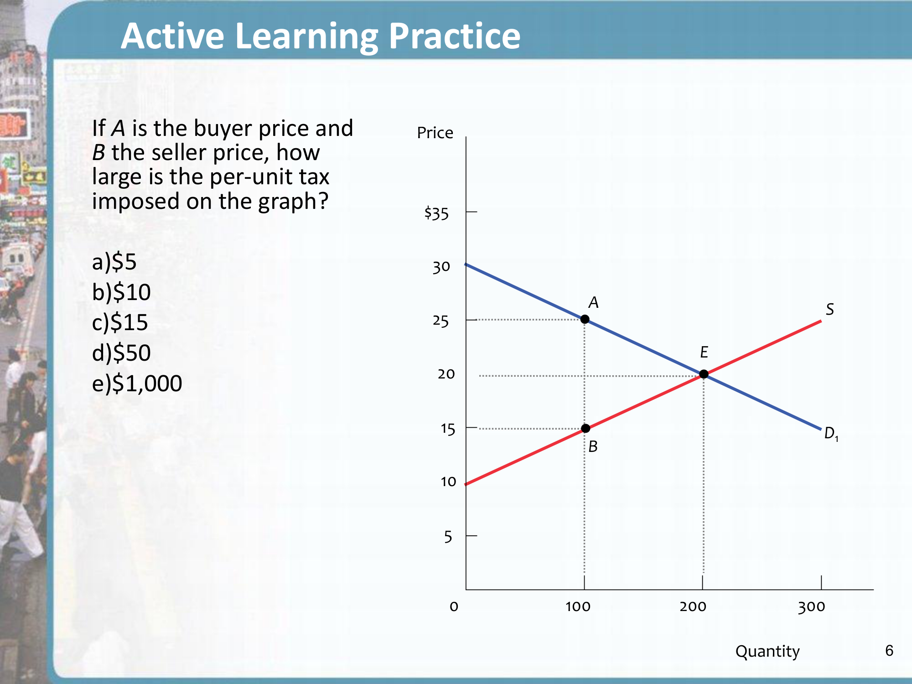
> 如果 A 是买方价格，B 是卖方价格，图中每单位征收的税额是多少？
> - A. $5
> - B. $10
> - C. $15
> - D. $50
> - E. $1,000

---

### 2.3 弹性决定税收归宿 (Elasticity Determines Tax Incidence)

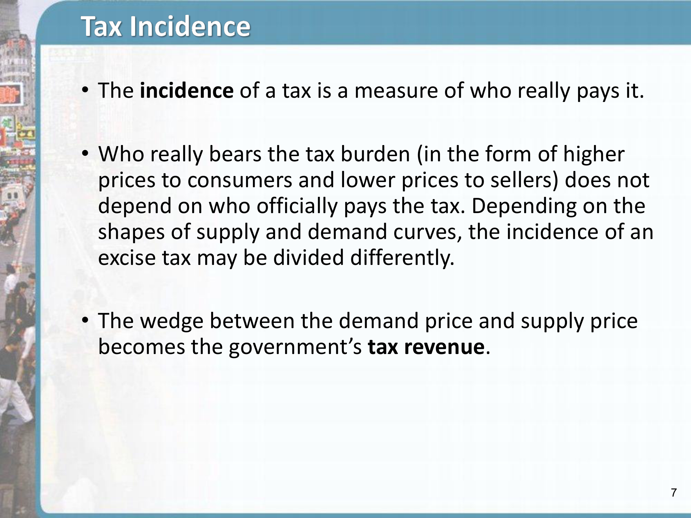

> [!info] 核心原理
> 谁真正承担税负（以消费者支付更高价格或生产者收到更低价格的形式）**并不取决于谁在法律上支付税款**。根据供需曲线的形状（即弹性），Excise Tax 的归宿可能以不同方式分配。
>
> 供需价格之间的 wedge 成为政府的 **tax revenue（税收收入）**。

#### 消费者承担大部分税负

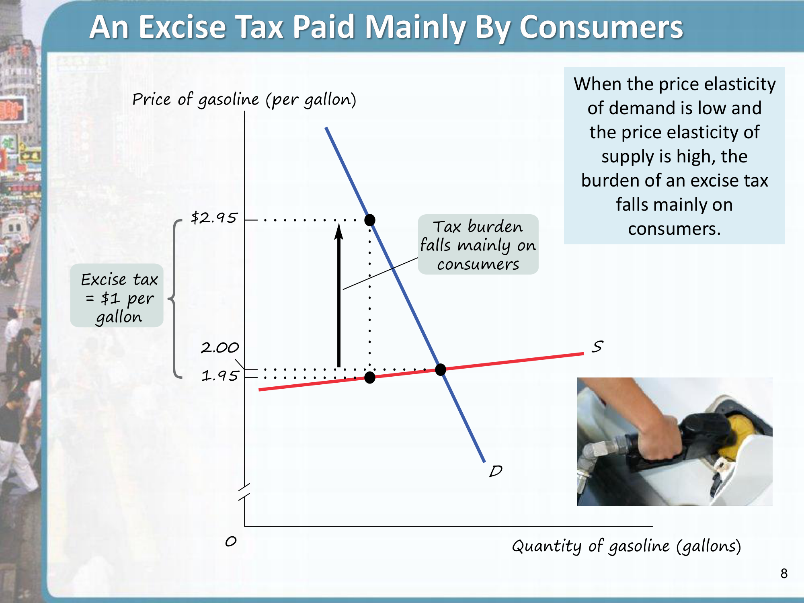

当 **需求价格弹性 (price elasticity of demand) 低** 而 **供给价格弹性 (price elasticity of supply) 高** 时，税负主要由消费者承担：

- 以汽油市场为例：汽油需求曲线较陡（低弹性），供给曲线较平（高弹性）
- 税前汽油价格：$2.00/加仑，征收 $1.00/加仑的税
- 消费者支付的价格上涨 **$0.95** 至 $2.95（承担了绝大部分）
- 生产者收到的价格仅下降 **$0.05** 至 $1.95（承担极小部分）

#### 生产者承担大部分税负

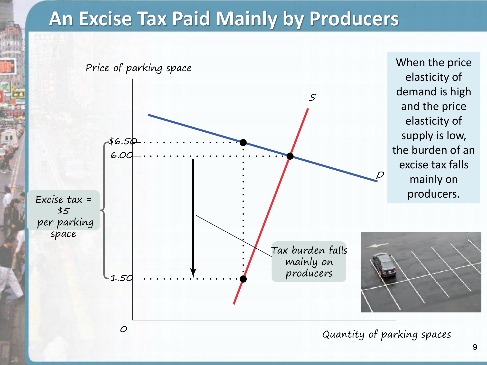

当 **需求价格弹性高** 而 **供给价格弹性低** 时，税负主要由生产者承担：

- 以市中心停车位市场为例：需求曲线较平（高弹性），供给曲线较陡（低弹性）
- 税前停车费：$6.00/天，征收 $5.00 的税
- 生产者收到的价格大幅下降至 **$1.50**（承担了绝大部分）
- 消费者支付的价格仅上涨 **$0.50** 至 $6.50（承担极小部分）

> [!warning] 总结：Elasticity 决定 Tax Incidence
> 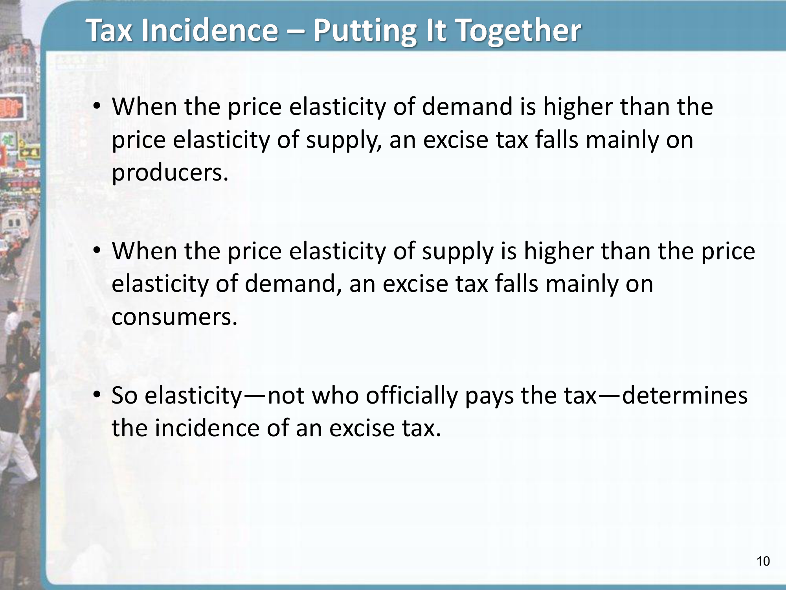
> - 当 **需求价格弹性 > 供给价格弹性** → 税负主要由 **生产者** 承担
> - 当 **供给价格弹性 > 需求价格弹性** → 税负主要由 **消费者** 承担
> - **所以是弹性（而非谁在法律上缴税）决定了 Excise Tax 的归宿。**

---

## 3. Tax Revenue（税收收入）

### 3.1 税收收入的计算

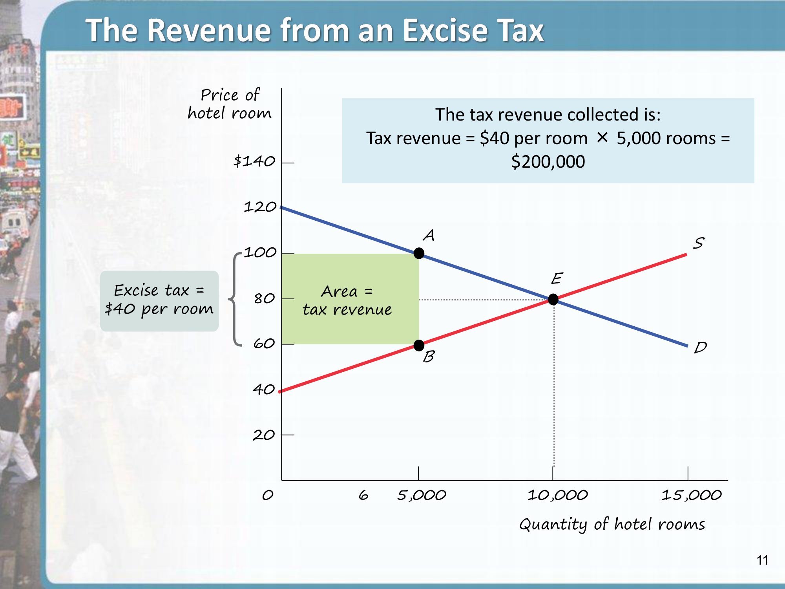

> [!info] 税收收入公式
> $$\text{Tax Revenue} = \text{Tax per unit} \times \text{Quantity transacted under the tax}$$
> 税收收入等于 tax wedge（税收楔子）的高度乘以征税后的交易数量，即图中阴影矩形的面积。
>
> **例**：$40/间 × 5,000 间 = **$200,000**

### 3.2 Tax Rate（税率）与税收收入的关系

> [!info] 定义：Tax Rate
> A **tax rate** is the amount of tax people are required to pay per unit of whatever is being taxed.（税率是人们需要为每单位被征税物品支付的税额。）

> [!warning] 重要规律
> 一般来说，**将 Excise Tax 税率翻倍并不会使税收收入翻倍**，因为提高税率会减少交易数量。
> 在某些情况下，**提高税率实际上可能减少政府征收的总收入**。

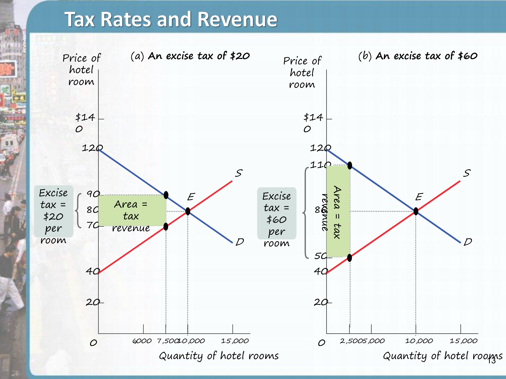

| 税率 | 税收收入 | 说明 |
|:---|:---|:---|
| $20/间 | $150,000 | 税率减半，收入为原来的 3/4（非 1/2） |
| $40/间 | $200,000 | 基准情形 |
| $60/间 | $150,000 | 税率提高，收入反而下降！ |

---

## 4. 税收的福利效应与 Deadweight Loss（无谓损失）

### 4.1 税收减少 Consumer Surplus 和 Producer Surplus

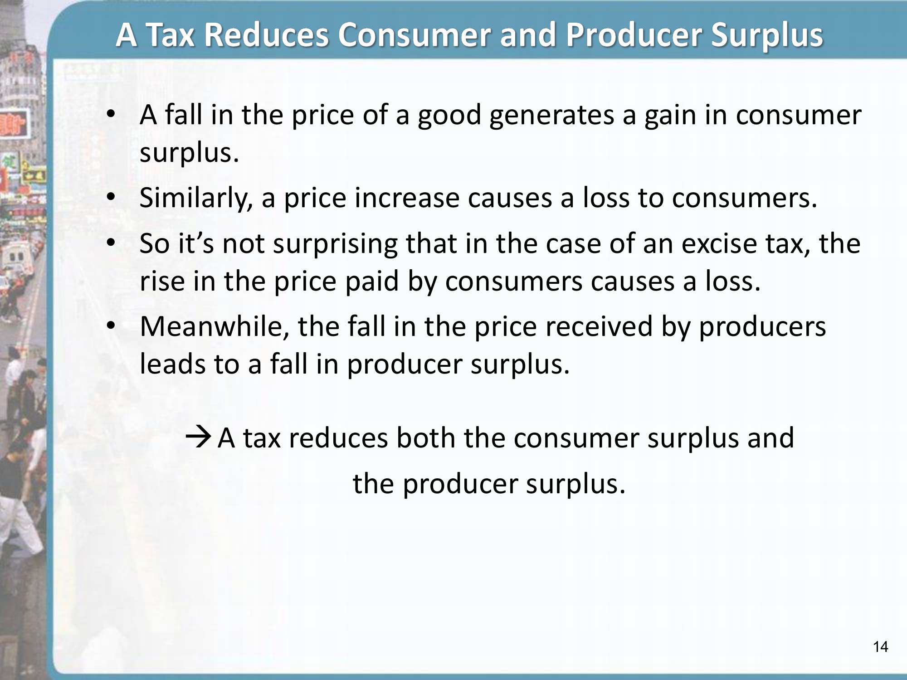

- 价格下降会产生 consumer surplus（消费者剩余）的增加
- 同理，**价格上涨给消费者造成损失**
- 在 Excise Tax 的情形下：消费者支付的价格上涨 → 消费者剩余减少；生产者收到的价格下降 → 生产者剩余减少
- **税收同时减少了 consumer surplus 和 producer surplus**

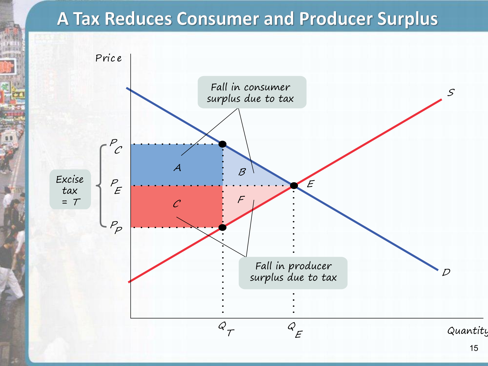

> [!info] Figure 7-8 解析（来自演讲者备注）
> - 税前均衡价格与数量：$P_E$ 和 $Q_E$
> - 征税 $T$/单位后，消费者价格升至 $P_C$，消费者剩余减少 = 矩形 A + 三角形 B
> - 生产者价格降至 $P_P$，生产者剩余减少 = 矩形 C + 三角形 F
> - 政府获得税收收入 $Q_T \times T$ = 面积 A + C
> - **面积 B + F** 代表了消费者和生产者剩余中未被政府以税收形式获得的部分——这就是税收对社会的 **deadweight loss（无谓损失）**

### 4.2 Deadweight Loss of a Tax

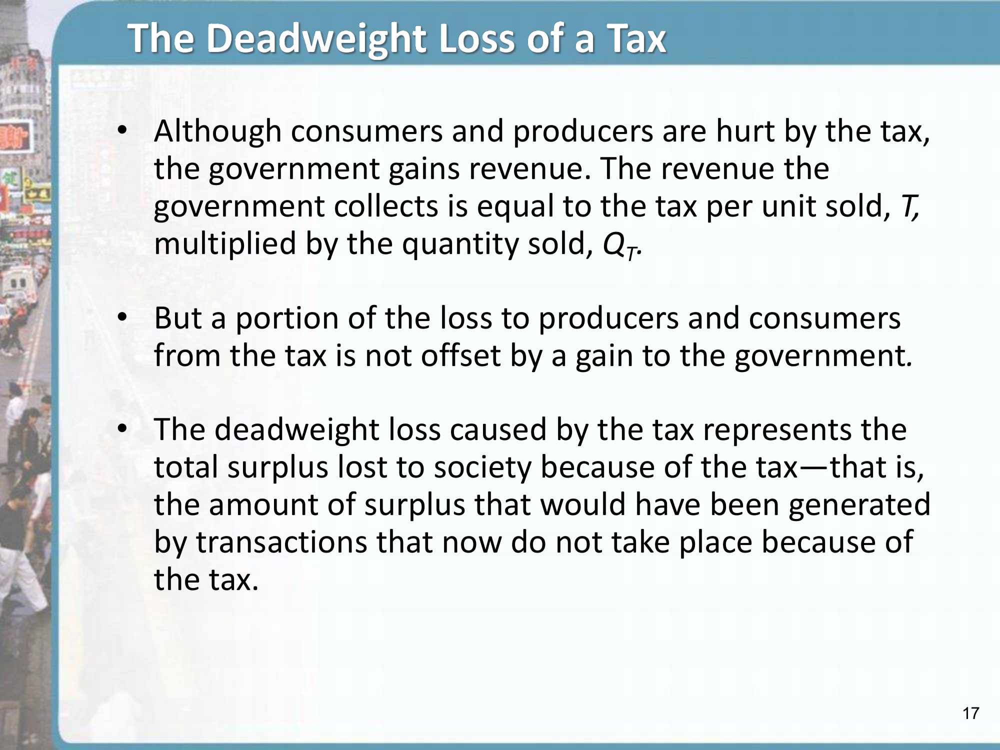

> [!info] 定义：Deadweight Loss（无谓损失）
> The **deadweight loss** caused by the tax represents the total surplus lost to society because of the tax — that is, the amount of surplus that would have been generated by transactions that now do not take place because of the tax.
> （税收造成的无谓损失代表社会因税收而损失的 total surplus——即那些因税收而不再发生的交易所本应产生的剩余。）

虽然消费者和生产者因税收受损，但政府获得了收入（$Q_T \times T$）。然而，**生产者和消费者的部分损失并没有被政府的收益所抵消**。这些就是 deadweight loss。

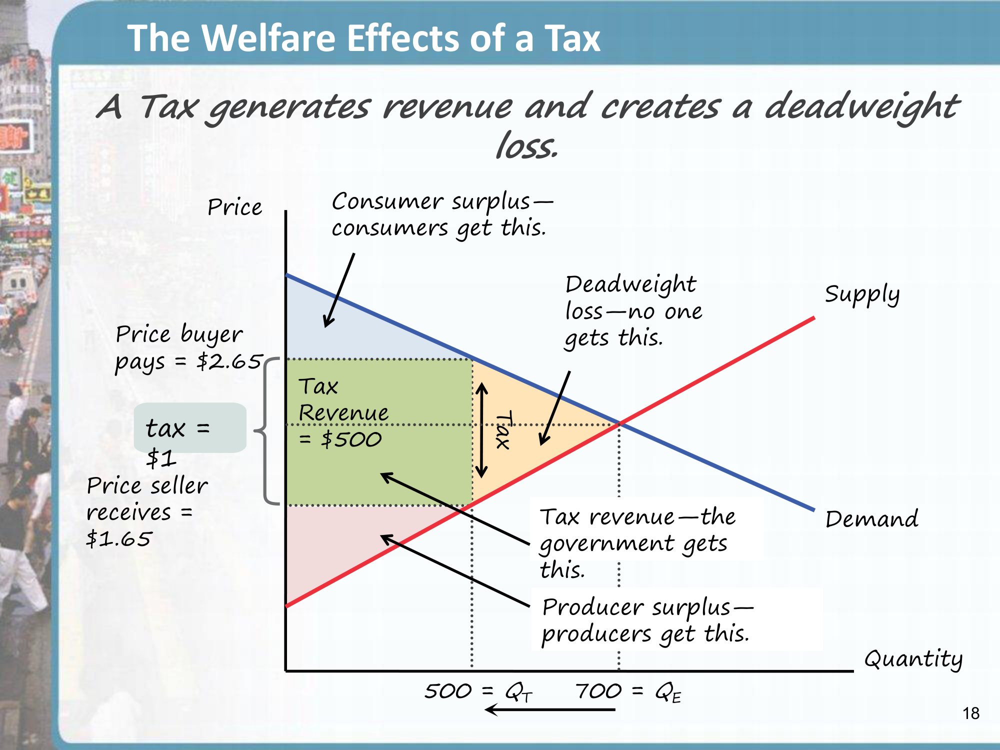

> [!info] Figure 7-9 解析（来自演讲者备注）
> 税收导致 deadweight loss 是因为它造成了 inefficiency（无效率）：一些 mutually beneficial transactions（互惠交易）因税收而永远无法发生，即 $Q_E - Q_T$ 这部分交易。
>
> 黄色区域代表 deadweight loss 的价值：它是本应从 $Q_E - Q_T$ 交易中获得的全部剩余。如果税收没有阻碍交易——即交易数量保持在 $Q_E$——就不会产生 deadweight loss。

### 4.3 Deadweight-Loss Triangle 的应用

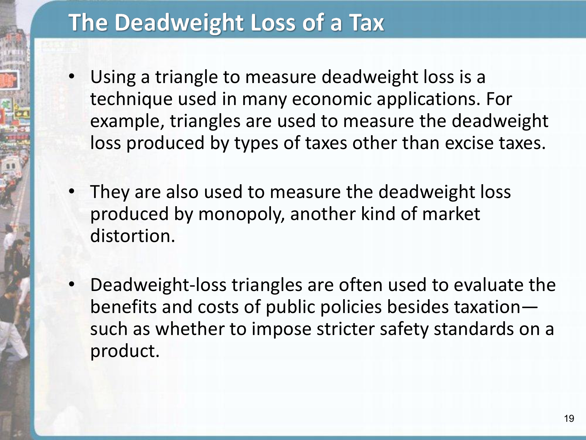

用三角形来衡量 deadweight loss 是经济学中广泛使用的技术：
- 用于衡量 **垄断 (monopoly)** 造成的 deadweight loss
- 用于评估公共政策的收益与成本，例如是否对产品施加更严格的安全标准

---

## 5. Deadweight Loss 与 Elasticities 的关系

### 5.1 税率大小与 Deadweight Loss

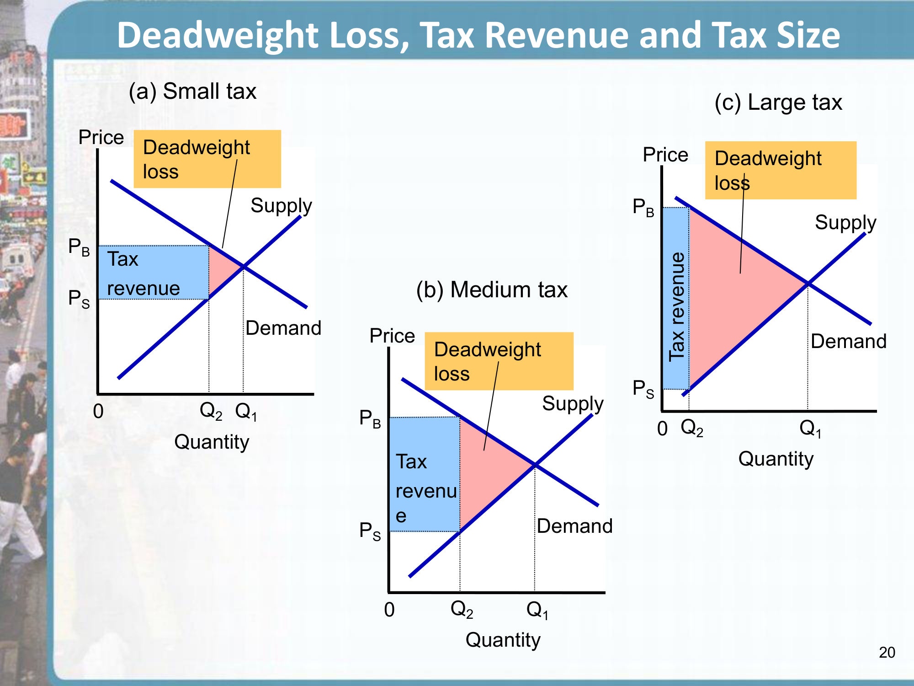

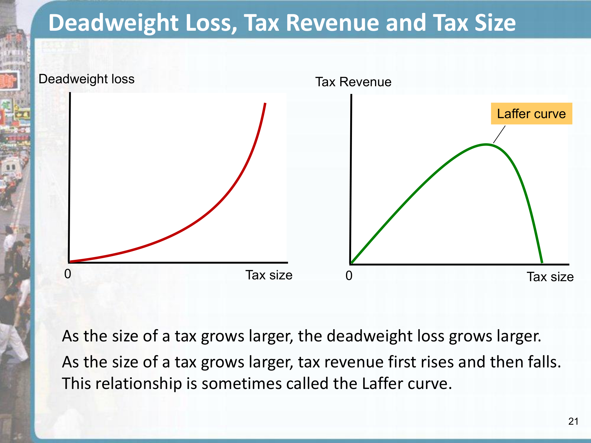

> [!warning] 两个关键规律
> 1. 税收规模越大 → **Deadweight loss 越大**
> 2. 税收规模越大 → 税收收入 **先升后降**（这种关系被称为 **Laffer curve（拉弗曲线）**）

### 5.2 Tax Collection Around the World

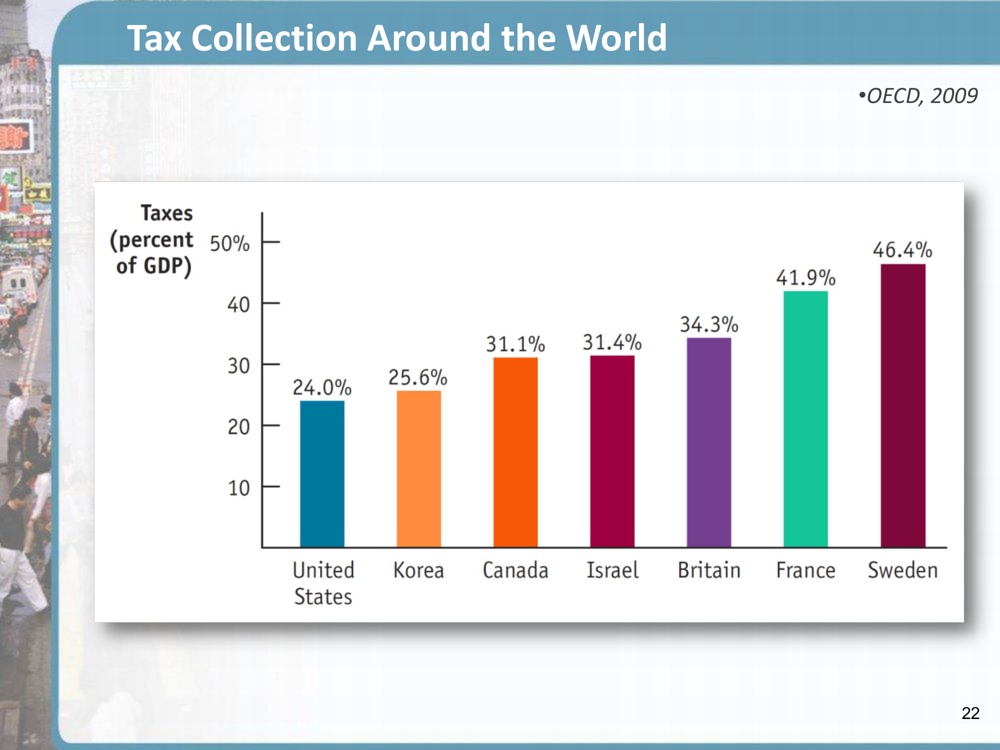

### 5.3 Administrative Costs of Taxation

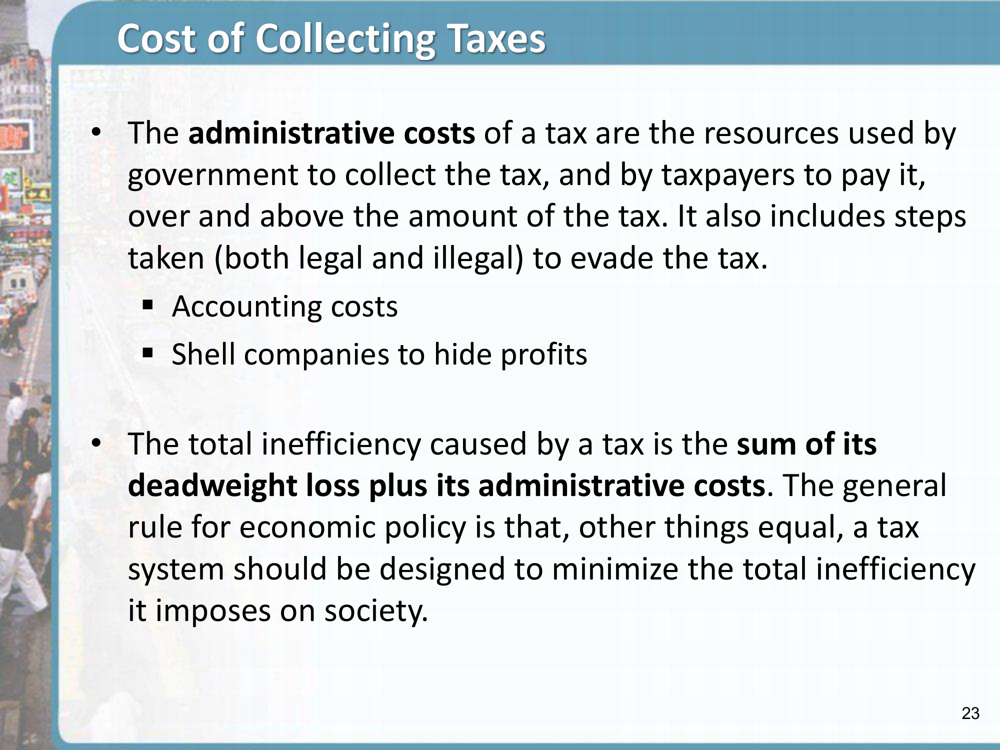

> [!info] 定义：Administrative Costs（行政成本）
> The **administrative costs** of a tax are the resources used by government to collect the tax, and by taxpayers to pay it, over and above the amount of the tax.（税收的行政成本是政府和纳税人为征收和缴纳税款而使用的、超出税额本身的资源。）

行政成本包括：
- 会计成本 (accounting costs)
- 用于隐藏利润的壳公司 (shell companies to hide profits)
- 合法和非法的逃税行为

> [!warning] 税收政策的一般原则
> **Total inefficiency = Deadweight Loss + Administrative Costs**
>
> 在其他条件相同的情况下，税收体系应被设计为**最小化其对社会施加的总 inefficiency**。

### 5.4 Elasticities 与 Deadweight Loss

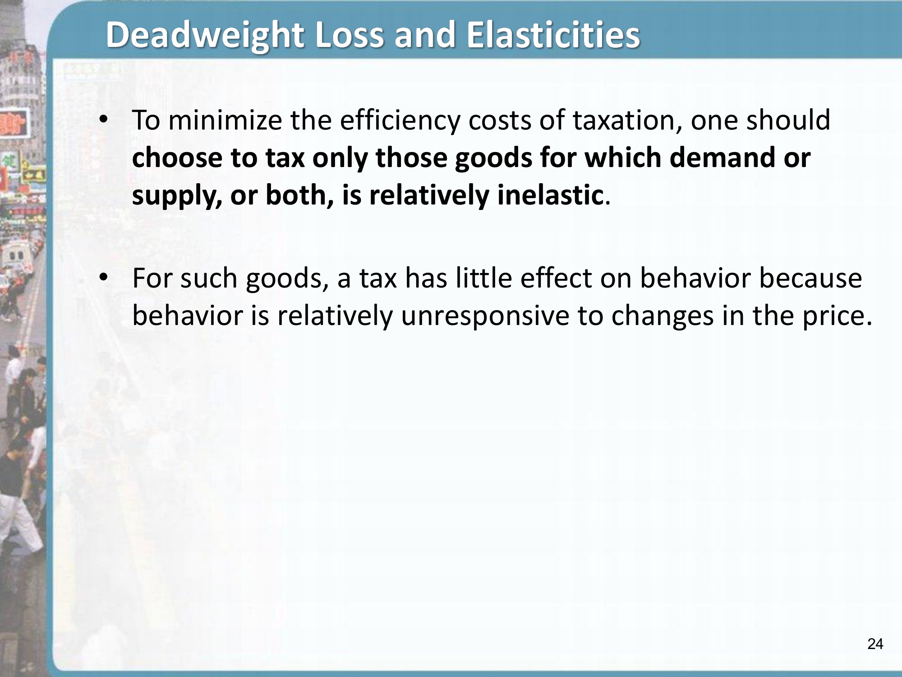

> [!info] 核心原则
> 为了使税收的效率成本最小化，应选择对那些 **需求或供给相对缺乏弹性 (inelastic)** 的商品征税。
> 对于这类商品，税收对行为的影响很小，因为行为对价格变化相对不敏感。

#### 四种情形对比

| 情形 | Deadweight Loss | 原因 |
|:---|:---|:---|
| **(a) Elastic Demand (弹性需求)** | **较大** | 税收导致交易量大幅下降 |
| **(b) Inelastic Demand (缺乏弹性需求)** | **较小** | 交易量下降幅度小 |
| **(c) Elastic Supply (弹性供给)** | **较大** | 税收导致交易量大幅下降 |
| **(d) Inelastic Supply (缺乏弹性供给)** | **较小** | 交易量下降幅度小 |

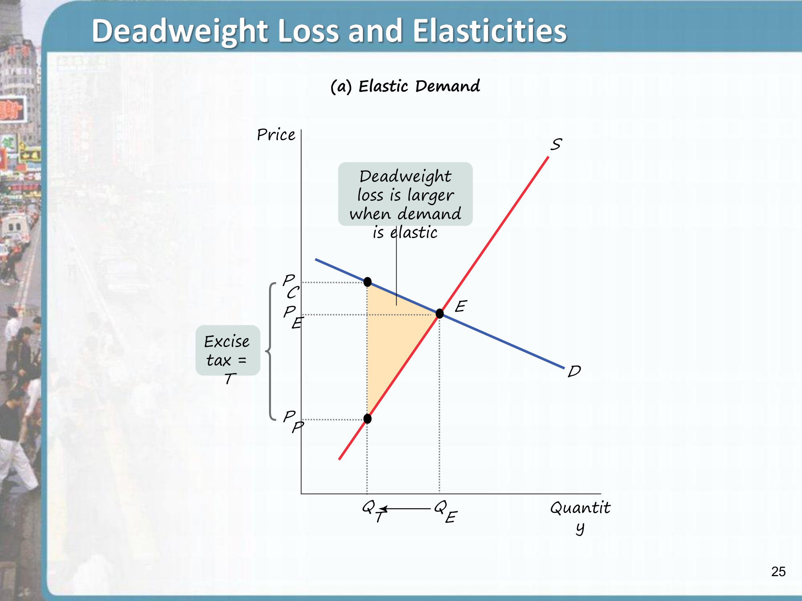
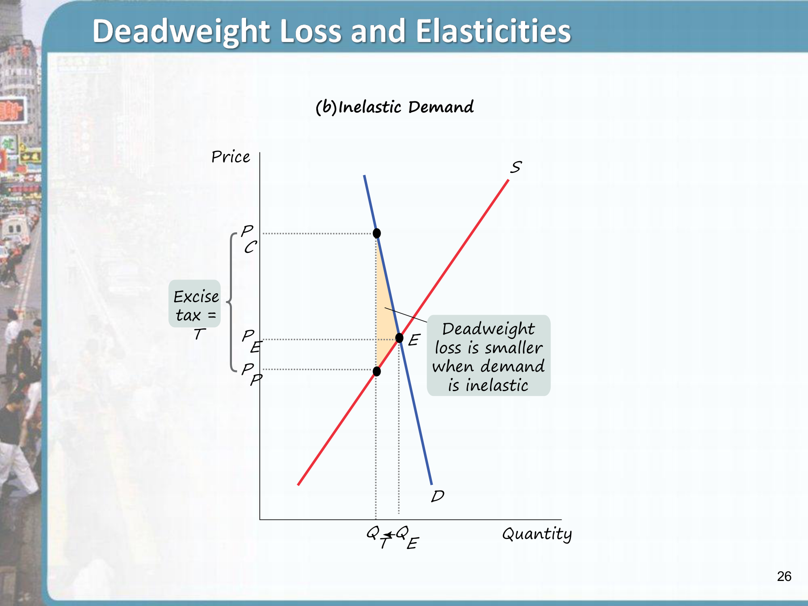
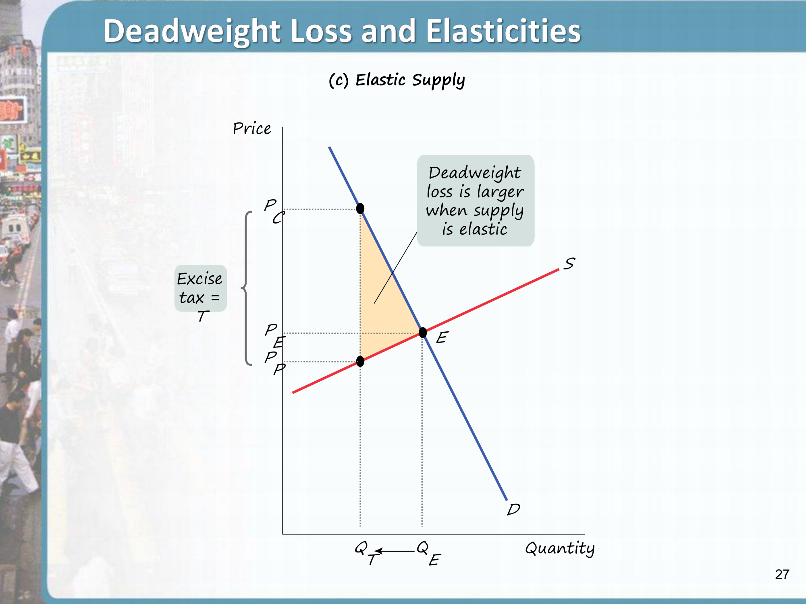
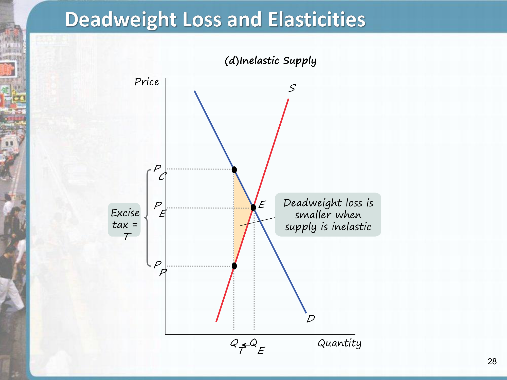

> [!info] 来自演讲者备注的详细解释 (Figure 7-10)
> Deadweight loss 在 panel (a) 和 (c) 中更大，因为 demand 或 supply 的 price elasticity 越大，税收引起的交易量下降就越大。
> 反之，demand 或 supply 的 price elasticity 越小，税收引起的交易量下降越小，deadweight loss 也越小。

### 5.5 极端情形：Perfectly Inelastic

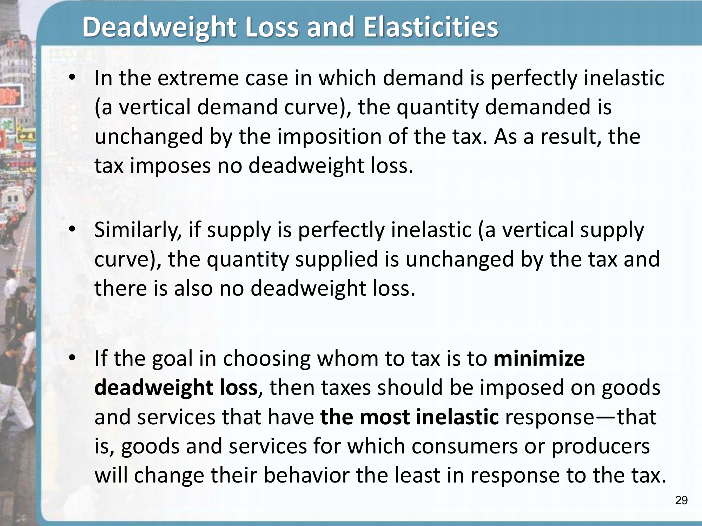

> [!warning] 极端情形
> - 当需求 **完全无弹性 (perfectly inelastic)**（垂直需求曲线）：征税不改变需求量 → **Deadweight loss = 0**
> - 当供给 **完全无弹性 (perfectly inelastic)**（垂直供给曲线）：征税不改变供给量 → **Deadweight loss = 0**
>
> **政策含义**：如果目标是 minimizing deadweight loss，应当对消费者或生产者行为反应最缺乏弹性 (most inelastic response) 的商品和服务征税。

### 5.6 案例：Land Value Tax（地价税）

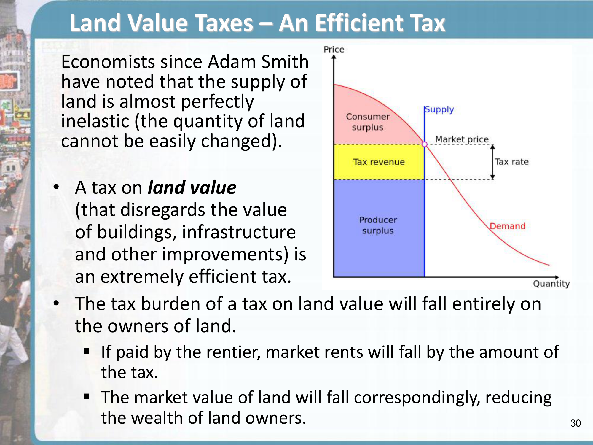

> [!info] Land Value Tax — 一种高效税收
> 自 Adam Smith 以来，经济学家就注意到土地的供给几乎是 perfectly inelastic 的（土地数量无法轻易改变）。
>
> 对土地价值征税（不考虑建筑物、基础设施和其他改良的价值）是一种**极其高效的税收**：
> - 地价税的负担将**完全落在土地所有者**身上
> - 如果由承租人支付，市场租金将下降税额的幅度
> - 土地的市场价值将相应下降，减少土地所有者的财富

---

## 6. Tax Fairness（税收公平）与 Tax Efficiency（税收效率）

### 6.1 两大税收公平原则

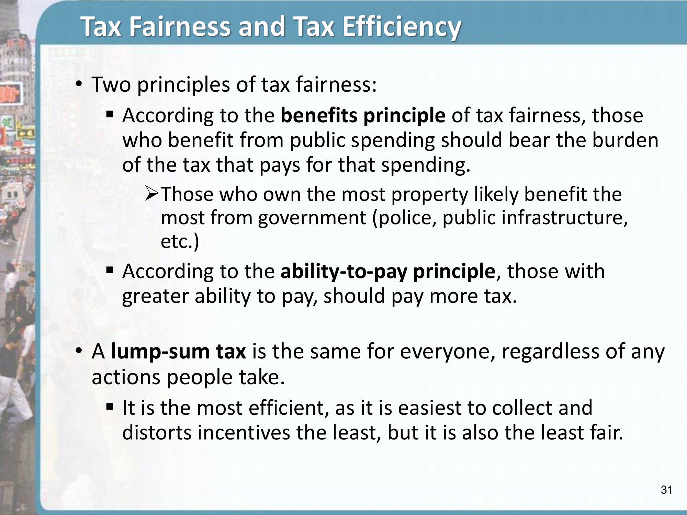

> [!info] Benefits Principle（受益原则）
> According to the **benefits principle** of tax fairness, those who benefit from public spending should bear the burden of the tax that pays for that spending.
> （根据受益原则，从公共支出中受益的人应承担为该支出提供资金的税收负担。）
>
> 例如：拥有最多财产的人可能从政府（警察、公共基础设施等）中受益最多。

> [!info] Ability-to-Pay Principle（支付能力原则）
> According to the **ability-to-pay principle**, those with greater ability to pay should pay more tax.
> （根据支付能力原则，支付能力更强的人应缴纳更多税款。）

> [!info] Lump-Sum Tax（一次性总付税）
> A **lump-sum tax** is the same for everyone, regardless of any actions people take.
> 这是最有效的税收形式——最容易征收、对激励扭曲最小——但也是最不公平的。

### 6.2 Equity-Efficiency Trade-off

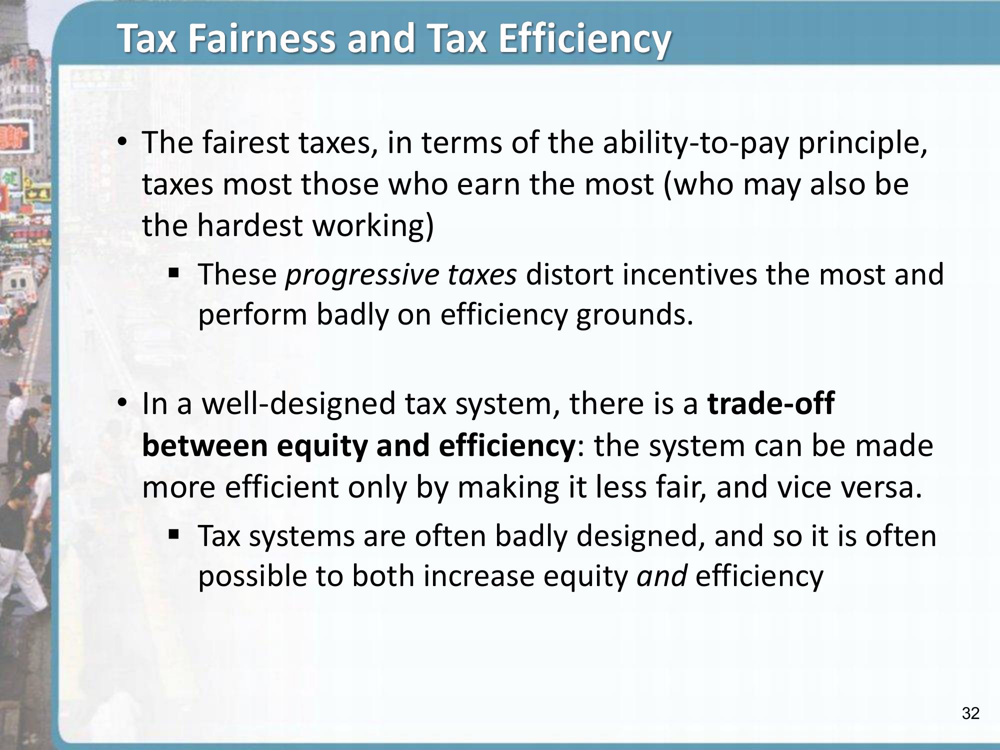

> [!warning] 税收体系的核心权衡：Equity vs. Efficiency
> - 按照 ability-to-pay principle，**最公平的税**向收入最高者（可能也是最努力工作的人）征收最多 → 这类 **progressive taxes（累进税）** 对激励的扭曲最大，在效率方面表现最差
> - 在一个设计良好的税收体系中，存在 **equity（公平）与 efficiency（效率）之间的 trade-off**：提高效率往往意味着牺牲公平，反之亦然
> - 但现实中许多税收体系设计不佳，因此往往可以**同时提高公平和效率**

---

## 7. Understanding the Tax System（理解税收制度）

### 7.1 Tax Base（税基）

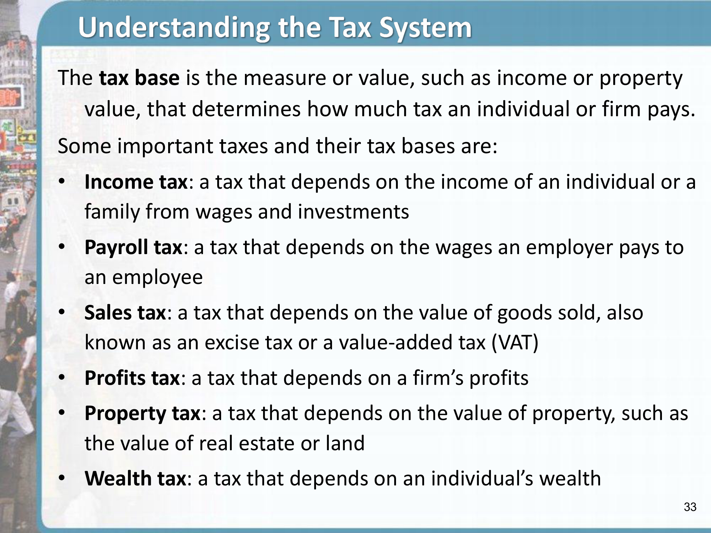

> [!info] 定义：Tax Base
> The **tax base** is the measure or value, such as income or property value, that determines how much tax an individual or firm pays.（税基是决定个人或企业缴纳多少税的衡量标准或价值，例如收入或财产价值。）

| 税种 (Tax Type) | 税基 (Tax Base) |
|:---|:---|
| **Income Tax** (所得税) | 个人或家庭的工资和投资收入 |
| **Payroll Tax** (工资税) | 雇主支付给雇员的工资 |
| **Sales Tax / VAT** (销售税/增值税) | 所售商品的价值 |
| **Profits Tax** (利润税) | 企业的利润 |
| **Property Tax** (财产税) | 财产价值（如房地产或土地） |
| **Wealth Tax** (财富税) | 个人的财富 |

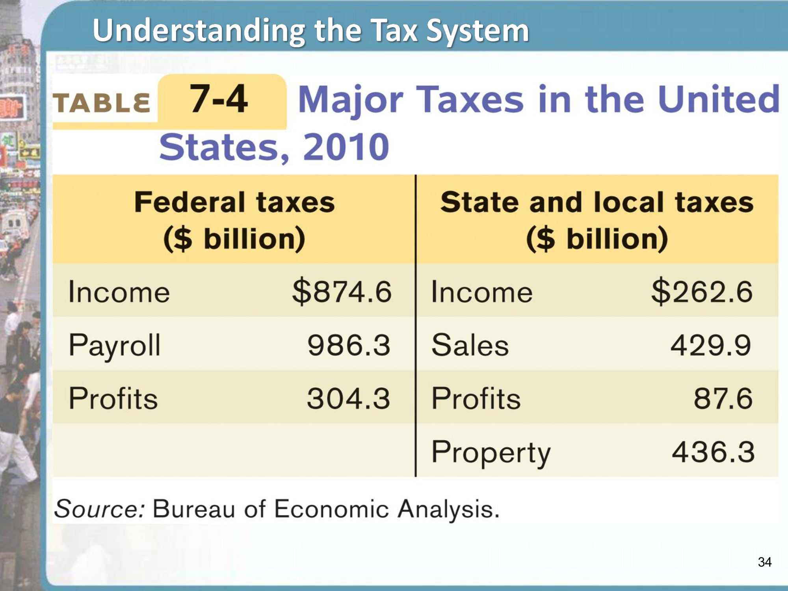

### 7.2 Tax Structure（税收结构）

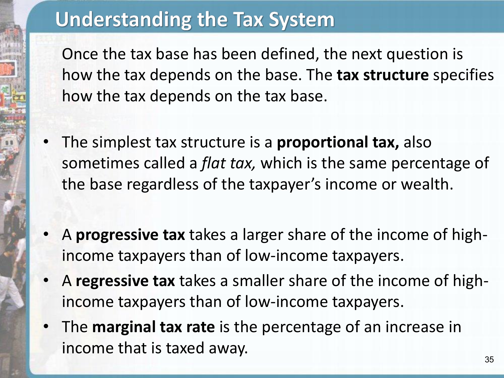

> [!info] 三种税收结构
> - **Proportional Tax (Flat Tax)**（比例税/单一税）：不论纳税人收入或财富多少，按税基的相同百分比征收
> - **Progressive Tax**（累进税）：高收入纳税人缴纳的税款占其收入的比例**更高**
> - **Regressive Tax**（累退税）：高收入纳税人缴纳的税款占其收入的比例**更低**

> [!info] 定义：Marginal Tax Rate（边际税率）
> The **marginal tax rate** is the percentage of an increase in income that is taxed away.（边际税率是收入增加部分中被征税的比例。）

### 7.3 中国与美国税制对比

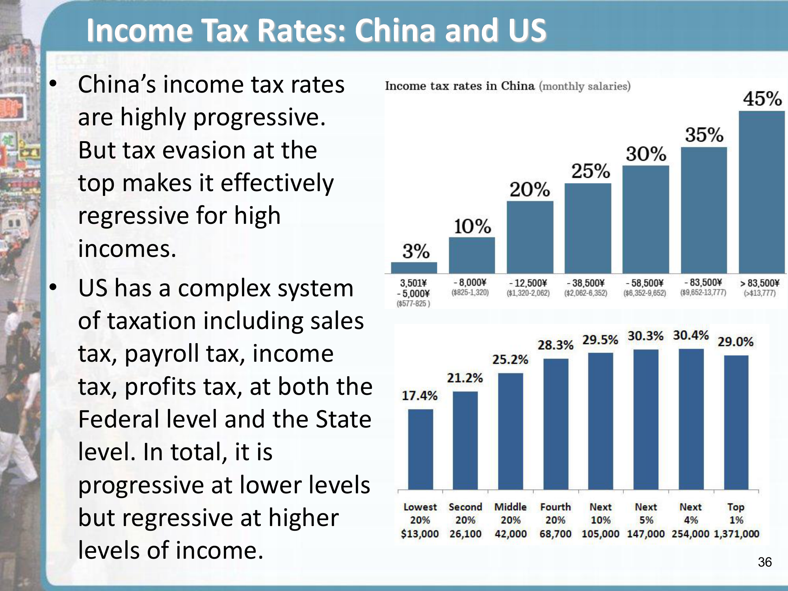

- **中国**：个人所得税税率是高度 progressive 的，但高收入阶层的逃税行为使其在实际效果上对高收入者呈 regressive
- **美国**：拥有复杂的税收体系，包括联邦和州层面的 sales tax、payroll tax、income tax、profits tax。总体来看，在较低收入水平呈 progressive，在较高收入水平呈 regressive

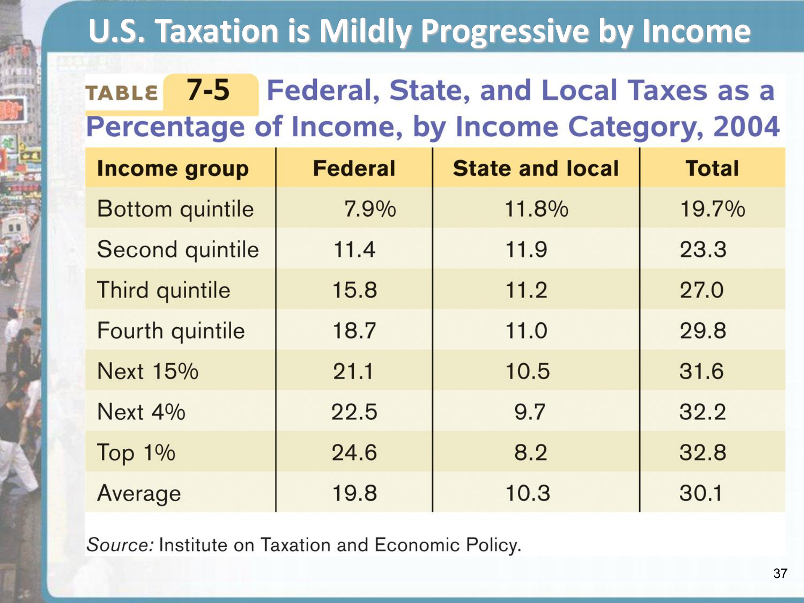

---

## 8. 本章总结 (Summary)

### 8.1 Excise Tax 的基本机制

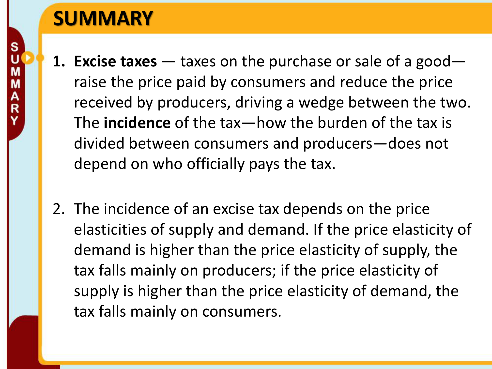

> [!info] Summary 1
> - Excise taxes 提高了消费者支付的价格，降低了生产者收到的价格，在两者之间打入 wedge
> - Tax incidence（谁承担税负）**不取决于谁在法律上缴税**
> - Tax incidence 取决于供给和需求的 price elasticities：
>   - 需求弹性 > 供给弹性 → 税负主要由**生产者**承担
>   - 供给弹性 > 需求弹性 → 税负主要由**消费者**承担

### 8.2 税收收入与 Deadweight Loss

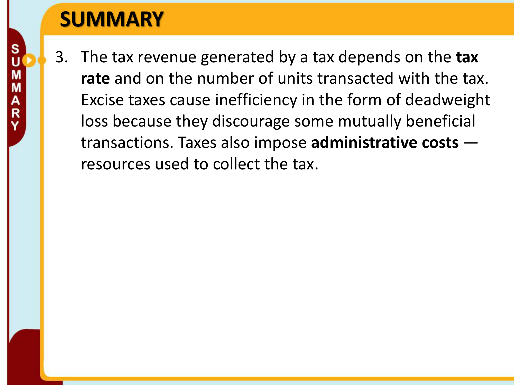

> [!info] Summary 2
> - 税收收入取决于 tax rate 和征税后的交易数量
> - Excise taxes 造成 **deadweight loss**（无效率），因为它们阻碍了部分 mutually beneficial transactions
> - 税收还产生 **administrative costs**（用于征税的资源）

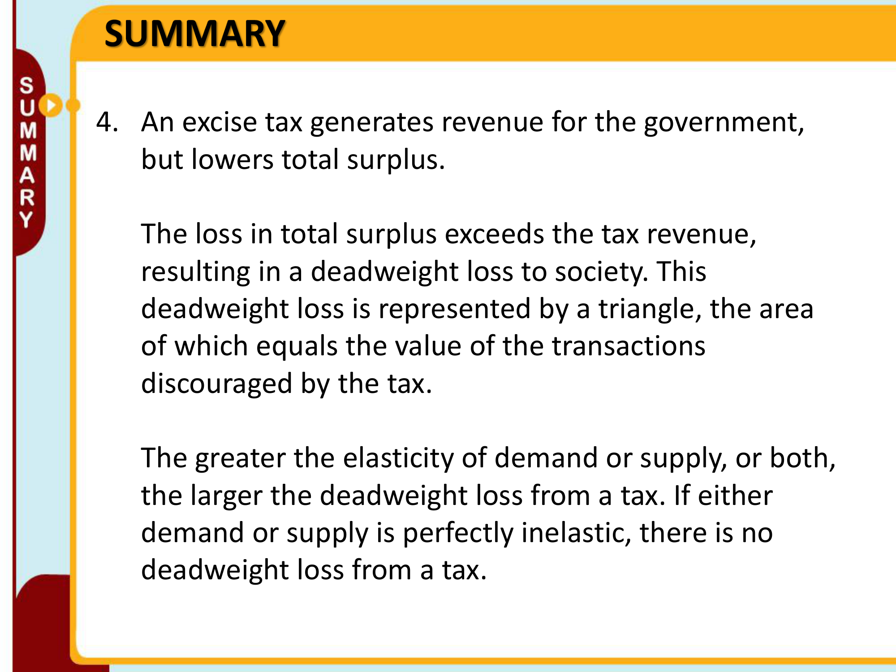

> [!info] Summary 3
> - Excise tax 为政府产生收入，但降低了 total surplus
> - Total surplus 的损失**超过** tax revenue，产生 deadweight loss
> - Deadweight loss 由三角形表示，其面积等于被税收阻碍的交易的价值
> - **Demand 或 supply 的 elasticity 越大 → deadweight loss 越大**
> - 如果 demand 或 supply 是 perfectly inelastic → deadweight loss = 0

### 8.3 效率与公平的权衡

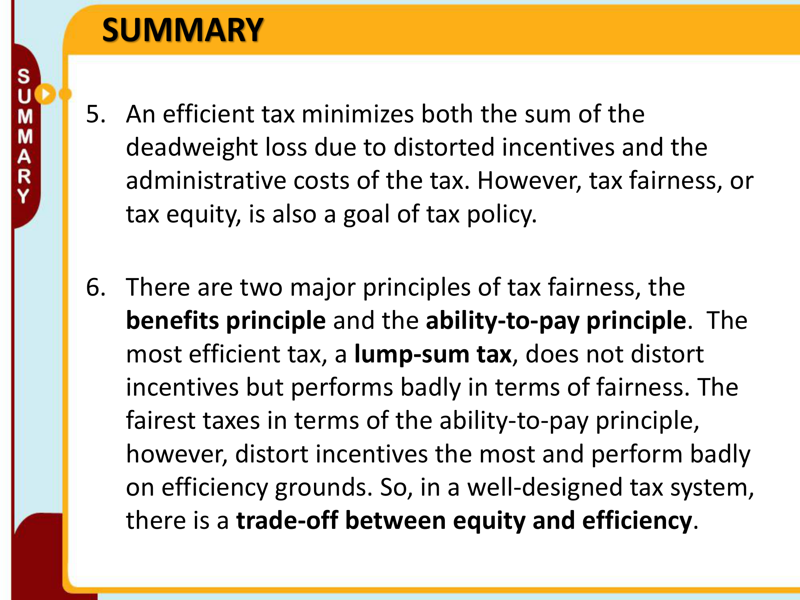

> [!info] Summary 4
> - 一个 **efficient tax** 最小化 deadweight loss 与 administrative costs 之和
> - 但 tax fairness (tax equity) 也是税收政策的目标
> - 两大原则：**benefits principle** 和 **ability-to-pay principle**
> - 最有效的税（lump-sum tax）不扭曲激励，但公平性最差
> - 按 ability-to-pay principle 最公平的税对激励扭曲最大，效率最差
> - 因此存在 **equity-efficiency trade-off**

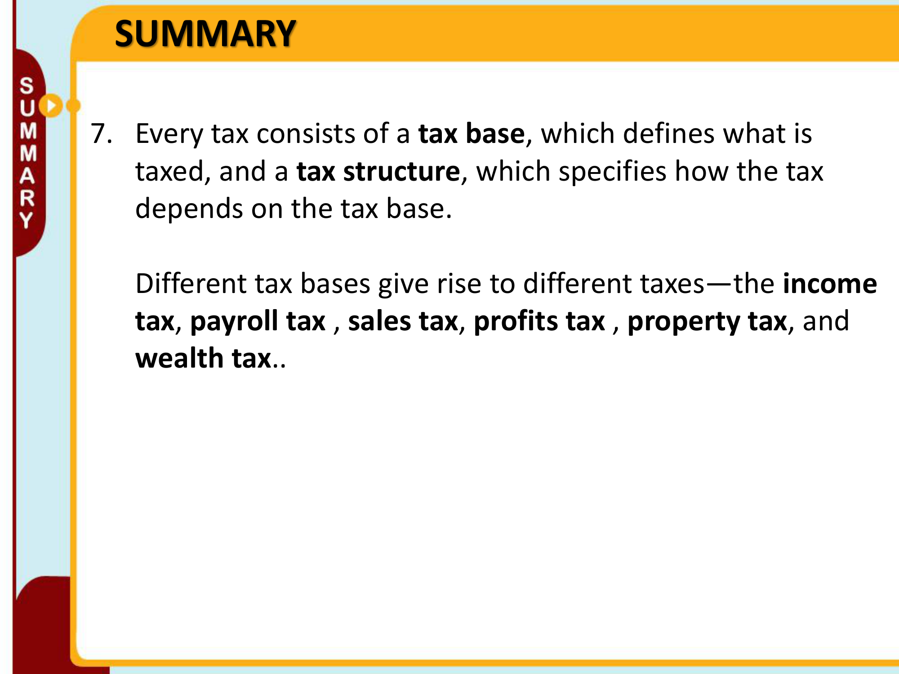

> [!info] Summary 5
> - 每种税收由 **tax base**（定义征税对象）和 **tax structure**（规定税额如何取决于税基）组成
> - 不同的 tax base 产生不同的税种：income tax、payroll tax、sales tax、profits tax、property tax、wealth tax

### 8.4 累进税与累退税

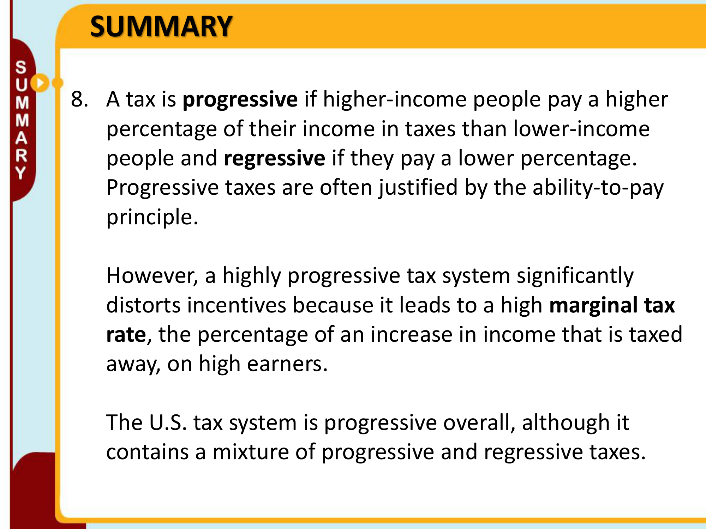

> [!info] Summary 6
> - **Progressive tax**：高收入者缴纳的税款占收入比例更高
> - **Regressive tax**：高收入者缴纳的税款占收入比例更低
> - Progressive taxes 通常由 ability-to-pay principle 来论证其合理性
> - 然而，高度 progressive 的税制显著扭曲激励，因为它导致高收入者面临高 **marginal tax rate**
> - 美国税制整体上是 progressive 的，但包含了 progressive 和 regressive 税种的混合

---

## 9. Key Terms（关键术语）

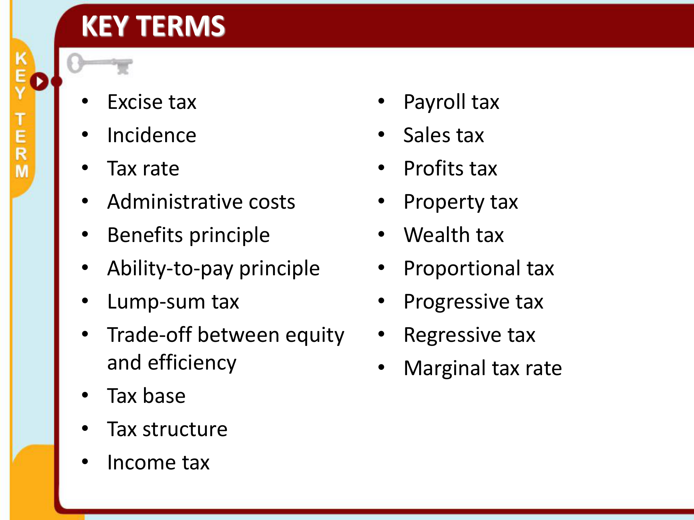

| 英文术语 | 中文翻译 |
|:---|:---|
| **Excise Tax** | 消费税/从量税 |
| **Incidence** | 税收归宿 |
| **Tax Rate** | 税率 |
| **Administrative Costs** | 行政成本 |
| **Benefits Principle** | 受益原则 |
| **Ability-to-Pay Principle** | 支付能力原则 |
| **Lump-Sum Tax** | 一次性总付税 |
| **Trade-off between Equity and Efficiency** | 公平与效率的权衡 |
| **Tax Base** | 税基 |
| **Tax Structure** | 税收结构 |
| **Income Tax** | 所得税 |
| **Payroll Tax** | 工资税 |
| **Sales Tax** | 销售税 |
| **Profits Tax** | 利润税 |
| **Property Tax** | 财产税 |
| **Wealth Tax** | 财富税 |
| **Proportional Tax (Flat Tax)** | 比例税/单一税 |
| **Progressive Tax** | 累进税 |
| **Regressive Tax** | 累退税 |
| **Marginal Tax Rate** | 边际税率 |
| **Deadweight Loss** | 无谓损失 |
| **Laffer Curve** | 拉弗曲线 |
| **Tax Wedge** | 税收楔子 |
