# Chapter 11: 供给曲线背后 — 投入与成本

> 本章核心问题：企业的生产函数如何将投入与产出联系起来？成本曲线如何从生产函数中推导出来？短期与长期成本有何不同？

---

## 1. 生产函数 (The Production Function)

### 1.1 基本概念

企业的 **生产函数 (Production Function)** 描述了企业使用的投入品数量与所生产的产出数量之间的关系。在分析生产时，我们区分两类投入：

> [!info] 固定投入与可变投入
> - **固定投入 (Fixed Input)**：在特定时期内数量固定、无法改变的投入品。
> - **可变投入 (Variable Input)**：企业可以随时改变其数量的投入品。

这一区分引出了经济学中两个极其重要的时间维度概念：

> [!info] 短期与长期
> - **短期 (Short Run)**：至少有一种投入是固定的时期。
> - **长期 (Long Run)**：所有投入都可以改变的时期。

> [!warning] 考点提示
> 短期与长期的区分不在于具体的时间长度（不是"几个月"），而在于**是否存在固定投入**。不同行业的短期/长期的时间含义完全不同。

**总产量曲线 (Total Product Curve)** 展示了在给定固定投入数量的情况下，产出数量如何随可变投入数量的变化而变化。

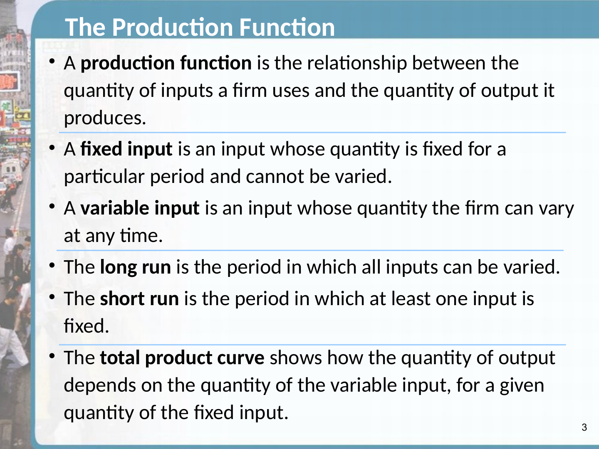

### 1.2 George 与 Martha 农场的生产函数

以下表格和图表展示了 George 与 Martha 农场的具体例子。该农场有 10 英亩土地（固定投入），工人数量（可变投入）可以调整。下表展示了生产函数以及 **劳动边际产量 (Marginal Product of Labor, MPL)**。

| Quantity of Labor (workers) | Quantity of Wheat (bushels) | MPL = ΔQ/ΔL (bushels/worker) |
|:---------------------------:|:---------------------------:|:-----------------------------:|
| 0 | 0 | — |
| 1 | 19 | 19 |
| 2 | 36 | 17 |
| 3 | 51 | 15 |
| 4 | 64 | 13 |
| 5 | 75 | 11 |
| 6 | 84 | 9 |
| 7 | 91 | 7 |
| 8 | 96 | 5 |

从表中可以清楚看到：随着工人数量的增加，每增加一名工人所带来的额外产出**递减**——这便是**边际报酬递减 (Diminishing Returns)** 的核心表现。

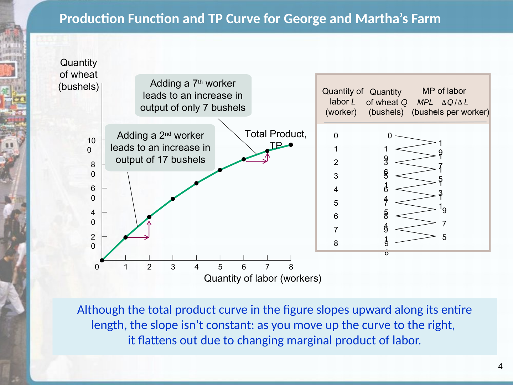

### 1.3 边际产量与边际报酬递减

> [!info] 边际产量 (Marginal Product)
> 某投入品的 **边际产量 (Marginal Product)** 是指多使用一单位该投入品所生产的额外产出数量。

> [!info] 边际报酬递减 (Diminishing Returns to an Input)
> 当一种投入品的数量增加，而其他所有投入品的水平保持不变时，该投入品的边际产量下降，即存在 **边际报酬递减**。

在 George 与 Martha 的农场中，第一名工人带来了 19 蒲式耳的增产，第二名工人带来 17 蒲式耳，第三名 15 蒲式耳……劳动边际产量持续下降。**边际产量递减是经济学中最基本也是最重要的规律之一**，它是后续推导成本曲线形状的关键。

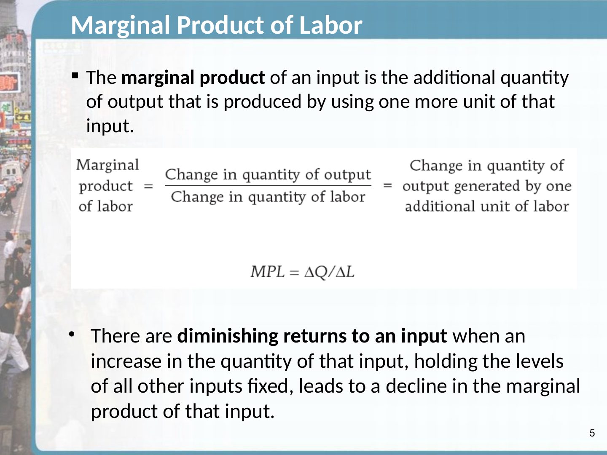

**劳动边际产量曲线 (Marginal Product of Labor Curve)** 呈现明显的向下倾斜趋势：

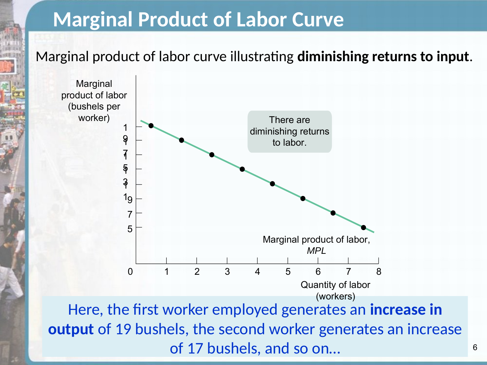

> 从演讲者备注中可以看到，该图描绘的是每位新增工人对应的边际产量。纵轴衡量产出变化量，横轴衡量工人数量。曲线向下倾斜正是**边际报酬递减**的直接体现。

### 1.4 固定投入变化的影响

当固定投入（如土地面积）发生改变时，总产量曲线和边际产量曲线都会发生移动。

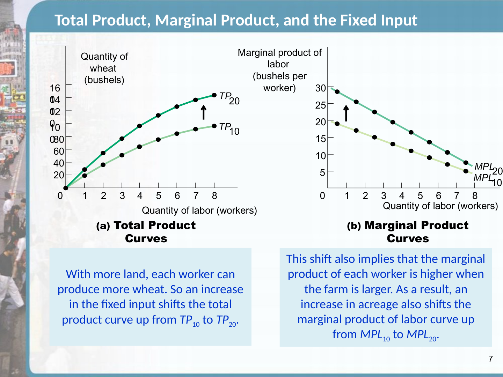

上图包含两组曲线：
- **Panel (a)**：$TP_{10}$ 和 $TP_{20}$ 分别代表 10 英亩和 20 英亩土地时的总产量曲线。当土地面积翻倍时，**每一位工人的产量都更高**，因此总产量曲线整体上移。
- **Panel (b)**：对应的边际产量曲线也上移——$MPL_{20}$ 高于 $MPL_{10}$。但需要注意的是，**两条边际产量曲线仍然向下倾斜**，因为即使在更大的农场，边际报酬递减依然存在。

> [!info] 关键洞察
> 增加固定投入会提高每个工人的边际产量（曲线向上移动），但**不能消除**边际报酬递减的趋势。这是理解后续短期与长期成本差异的重要基础。

---

## 2. 从生产函数到成本曲线 (From the Production Function to Cost Curves)

### 2.1 成本的类型

> [!info] 固定成本 (Fixed Cost)
> 不随产出数量变化而变化的成本。它是固定投入的成本。例如：柴油发电厂的**建设成本**就是固定成本。

> [!info] 可变成本 (Variable Cost)
> 依赖于产出数量变化的成本。它是可变投入的成本。例如：发电过程中使用的**柴油燃料**就是可变成本。

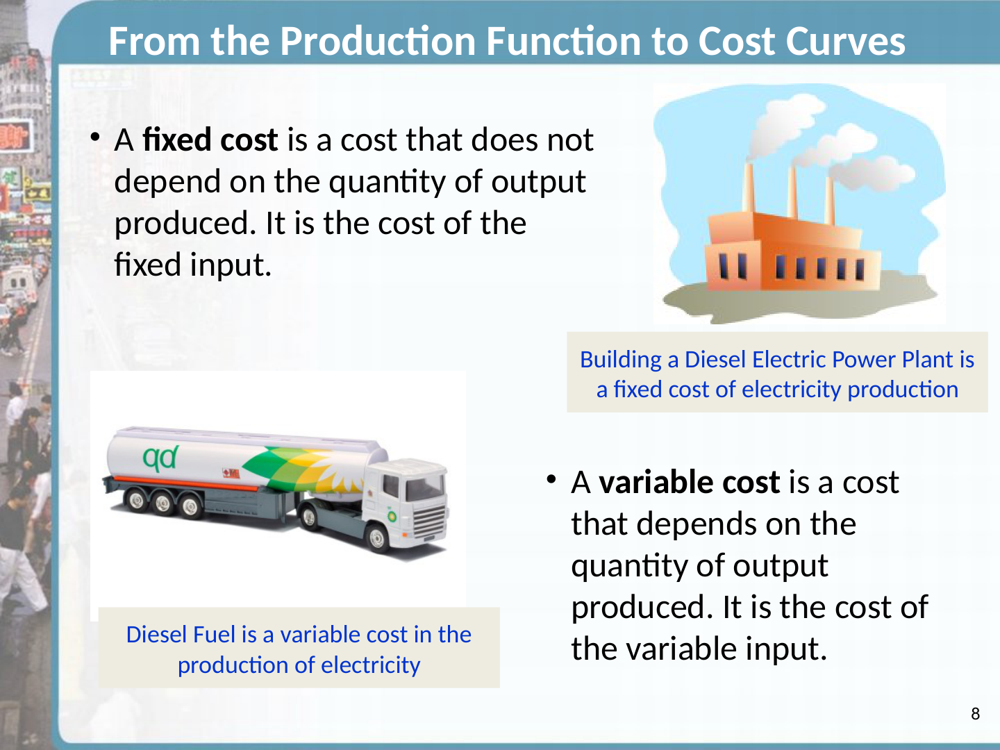

### 2.2 总成本曲线 (Total Cost Curve)

> [!info] 总成本 (Total Cost, TC)
> 生产给定数量产出的总成本等于固定成本与可变成本之和：
> $$TC = FC + VC$$

**总成本曲线 (Total Cost Curve)** 显示了总成本如何随产出数量变化。它的形状特征为：**随着产出的增加，曲线变得越来越陡峭**——这正是边际报酬递减的直接后果。

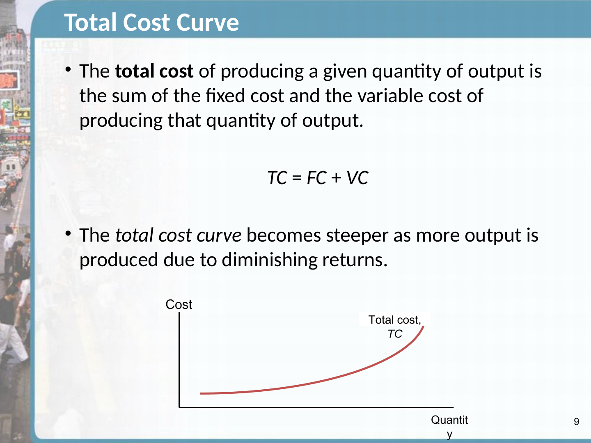

### 2.3 George 与 Martha 农场的总成本

回到农场的例子，以下是完整的成本数据表：

| Q (wheat, bushels) | L (workers) | Fixed Cost (FC) | Variable Cost (VC) | Total Cost (TC = FC + VC) |
|:---:|:---:|:---:|:---:|:---:|
| 0 | 0 | $400 | $0 | $400 |
| 19 | 1 | $400 | $200 | $600 |
| 36 | 2 | $400 | $400 | $800 |
| 51 | 3 | $400 | $600 | $1,000 |
| 64 | 4 | $400 | $800 | $1,200 |
| 75 | 5 | $400 | $1,000 | $1,400 |
| 84 | 6 | $400 | $1,200 | $1,600 |
| 91 | 7 | $400 | $1,400 | $1,800 |
| 96 | 8 | $400 | $1,600 | $2,000 |

> 从演讲者备注中可以确认：总成本曲线向上倾斜——因为产出增加需要雇佣更多工人，总成本随之增加。曲线变得越来越陡峭，正是因为**劳动的边际报酬递减**：每增加一单位产出，需要越来越多的工人。

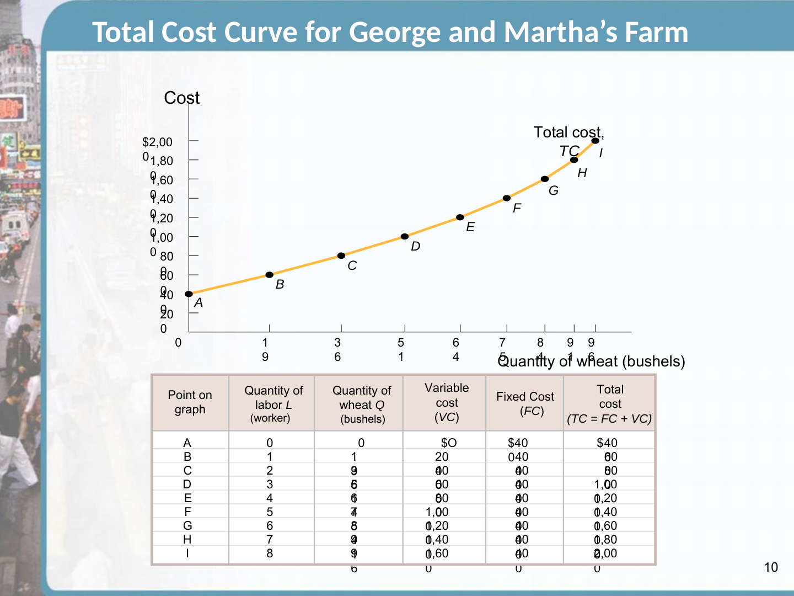

---

## 3. 边际成本与平均成本 (Marginal Cost and Average Cost)

### 3.1 边际成本 (Marginal Cost)

与边际产量的概念相对应，**边际成本 (Marginal Cost)** 是成本分析中的核心概念：

> [!info] 边际成本 (Marginal Cost, MC)
> 多生产一单位产出所导致的总成本增加量：
> $$MC = \frac{\Delta TC}{\Delta Q}$$

类比于边际产量等于"上升量除以水平距离"（即斜率），边际成本也是总成本曲线斜率的度量。

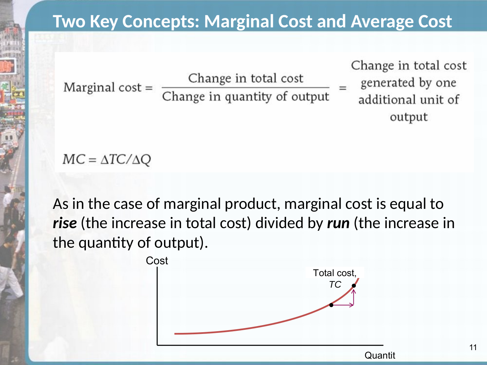

### 3.2 Selena's Gourmet Salsas 案例

为更好地展示成本结构，教材引入了 Selena's Gourmet Salsas（一家辣酱公司）的生产数据：

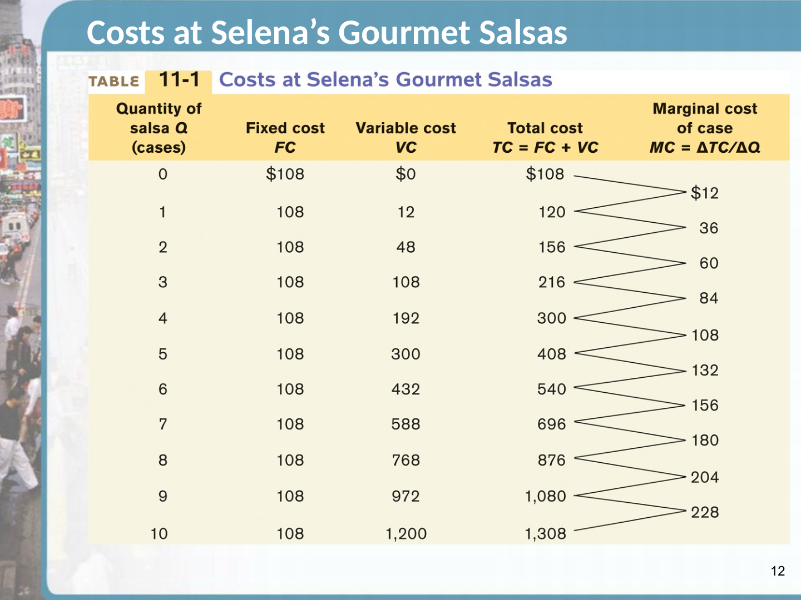

以下是该公司的总成本与边际成本曲线：

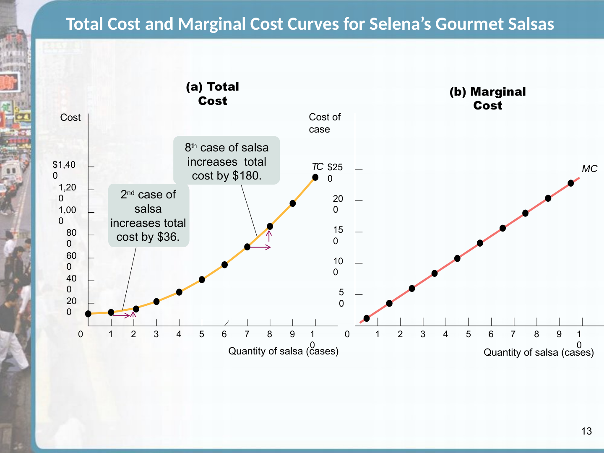

> 从演讲者备注可以明确：Panel (a) 的总成本曲线向上倾斜且越来越陡峭，Panel (b) 的边际成本曲线也向上倾斜——这都反映了**可变投入的边际报酬递减**。

### 3.3 为什么边际成本曲线向上倾斜？

> [!info] 边际成本曲线向上倾斜的逻辑链条
> 1. 生产中存在 **边际报酬递减 (Diminishing Returns)**：随着产出增加，可变投入的边际产量下降。
> 2. 这意味着每多生产一单位产出，需要使用**越来越多的可变投入**。
> 3. 由于每单位可变投入都需要付费，因此**每增加一单位产出的成本也上升**。
>
> 这就是边际成本曲线向上倾斜的根本原因。

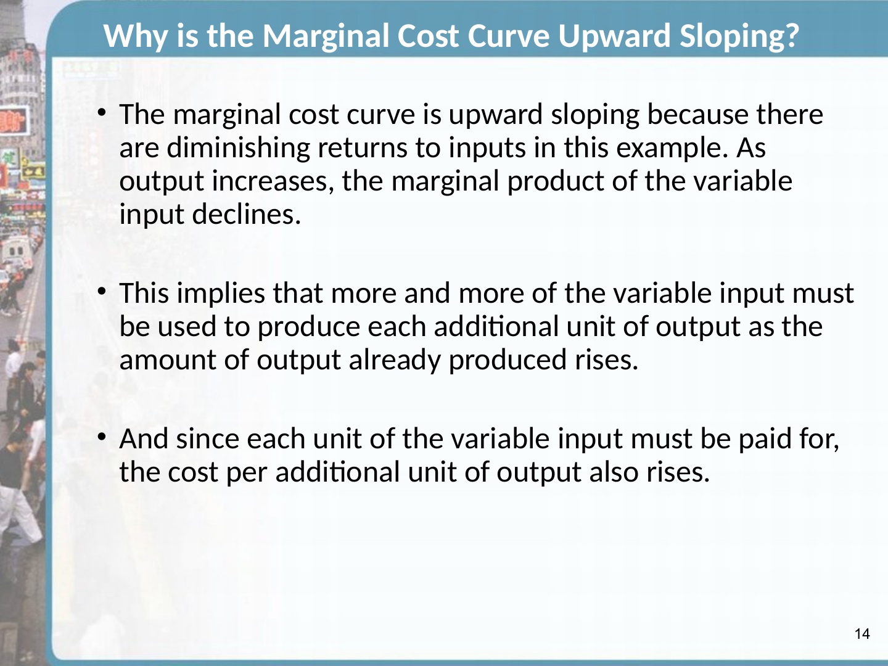

### 3.4 平均成本 (Average Cost)

> [!info] 平均总成本 (Average Total Cost, ATC)
> 平均总成本（常简称为平均成本）等于总成本除以产出数量：
> $$ATC = \frac{TC}{Q}$$

> [!info] 平均固定成本 (Average Fixed Cost, AFC)
> 每单位产出的固定成本：
> $$AFC = \frac{FC}{Q}$$

> [!info] 平均可变成本 (Average Variable Cost, AVC)
> 每单位产出的可变成本：
> $$AVC = \frac{VC}{Q}$$

其中，**典型的 ATC 曲线呈 U 形 (U-shaped)**：在较低产出水平时下降，在较高产出水平时上升。

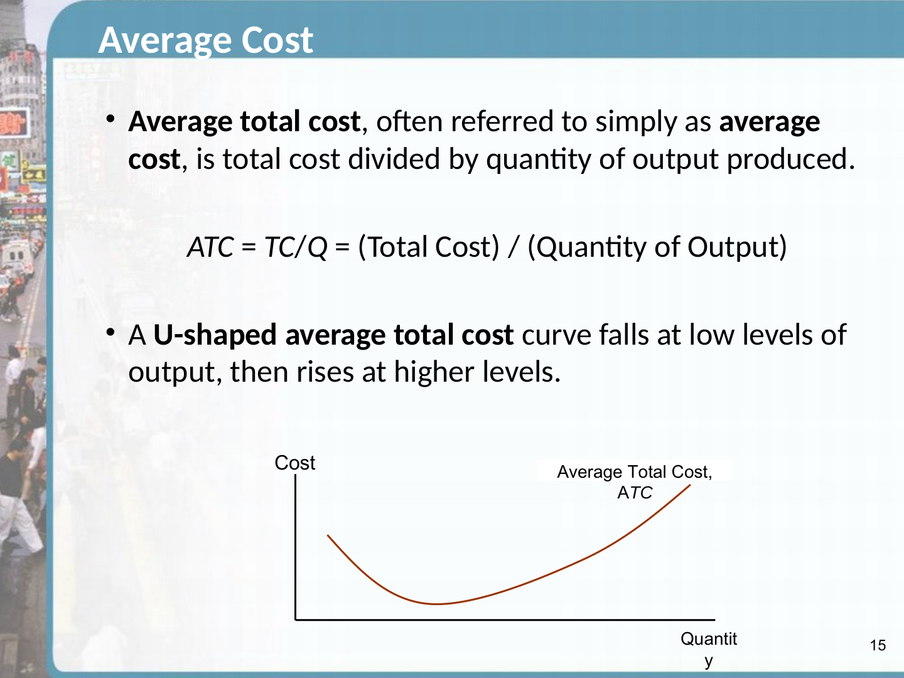

### 3.5 U 形成本曲线的形成机制：两种效应

ATC 曲线之所以呈 U 形，是因为产出增加对平均总成本有两种相互对立的影响：

> [!info] 摊薄效应 (The Spreading Effect)
> 产出越大，固定成本被分摊到越多的产出单位上，导致**平均固定成本 (AFC) 下降**。
> → 这解释了 ATC 曲线在低产出水平时**下降**的原因。

> [!info] 边际报酬递减效应 (The Diminishing Returns Effect)
> 产出越大，生产额外单位产出所需要的可变投入越多，导致**平均可变成本 (AVC) 上升**。
> → 这解释了 ATC 曲线在高产出水平时**上升**的原因。

> [!warning] 考点提示
> U 形 ATC 曲线的形状并非偶然。在低产出水平，"摊薄效应"占主导 → ATC 下降；在高产出水平，"边际报酬递减效应"占主导 → ATC 上升。这两种效应的**相对力量对比**决定了 ATC 曲线的走向。

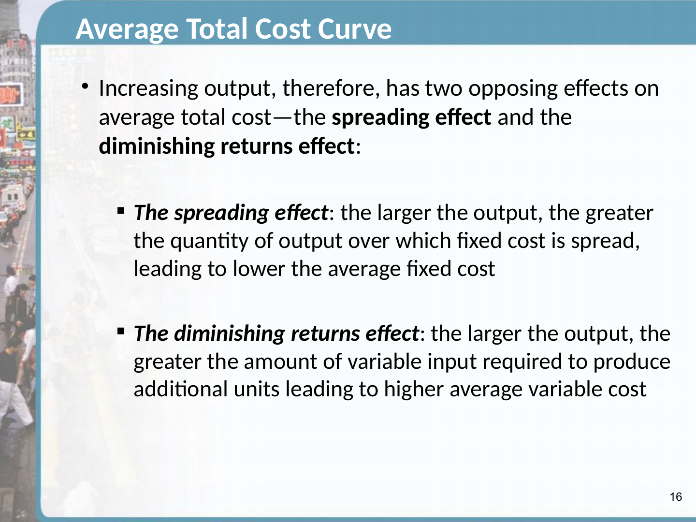

### 3.6 Selena's Gourmet Salsas 的平均成本

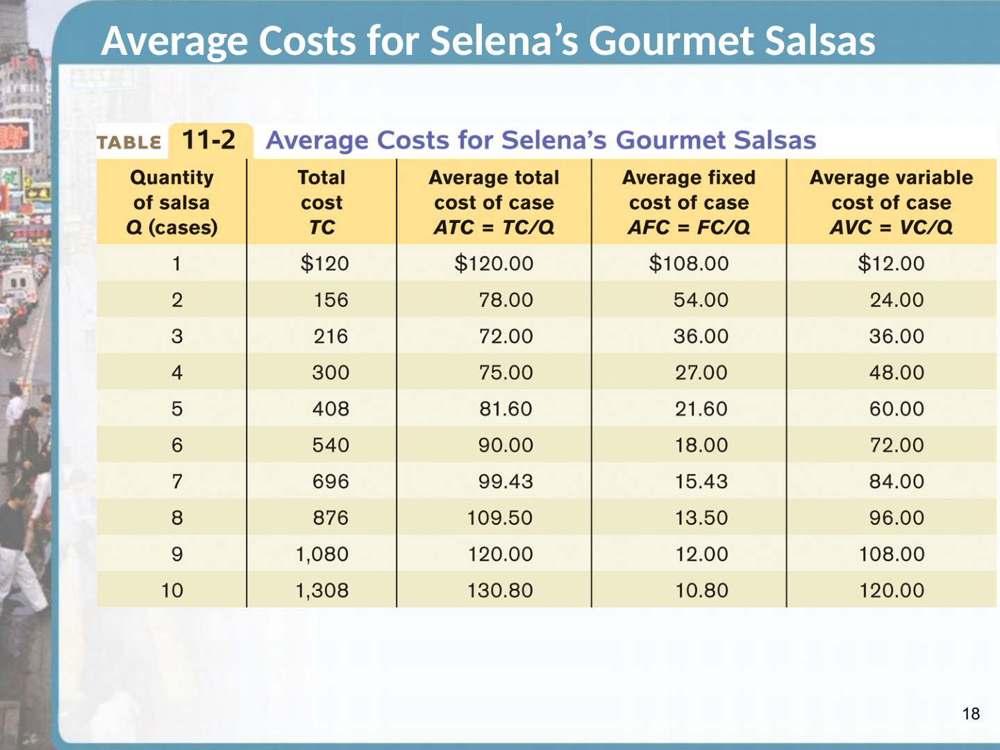

以下是 Selena's Gourmet Salsas 的完整平均成本曲线：

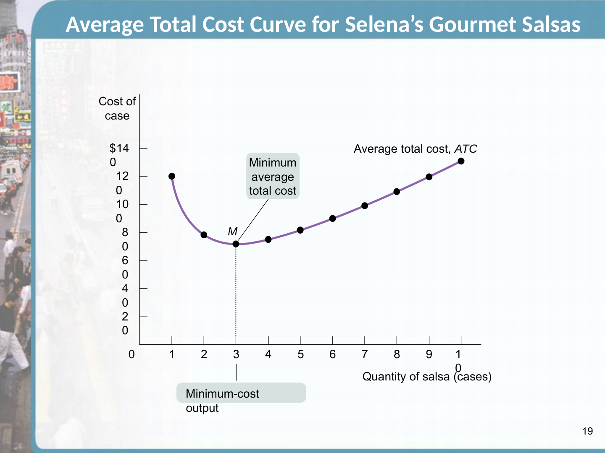

> 演讲者备注详细解释：**最低平均总成本**出现在点 M，对应每天 3 箱辣酱的产出。在低产出水平，"摊薄效应"（AFC 下降）超过"边际报酬递减效应"（AVC 上升），ATC 下降。在高产出水平，情况正好相反，ATC 上升。

---

## 4. 四大成本曲线的综合 (Putting the Four Cost Curves Together)

### 4.1 曲线家族

现在将所有曲线画在同一张图中：

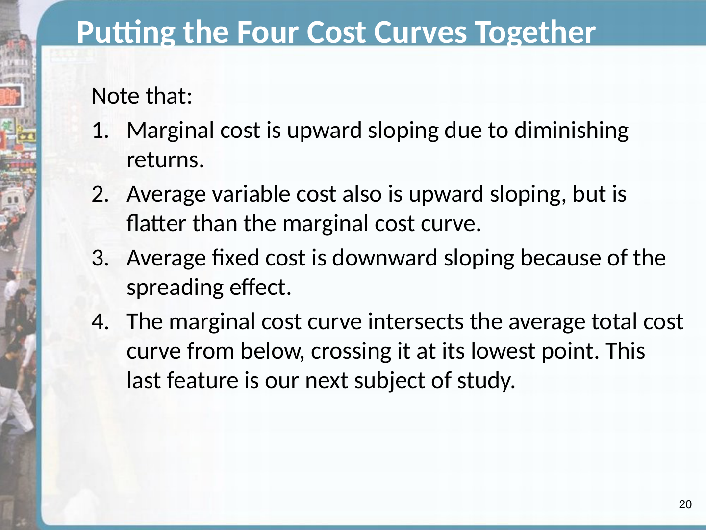

四条核心成本曲线的关系：
- **MC (Marginal Cost)**：向上倾斜，反映边际报酬递减。
- **AVC (Average Variable Cost)**：也向上倾斜，但比 MC 平坦。
- **AFC (Average Fixed Cost)**：持续向下倾斜，反映摊薄效应。
- **ATC (Average Total Cost)**：U 形，是 AFC 与 AVC 的垂直加总。

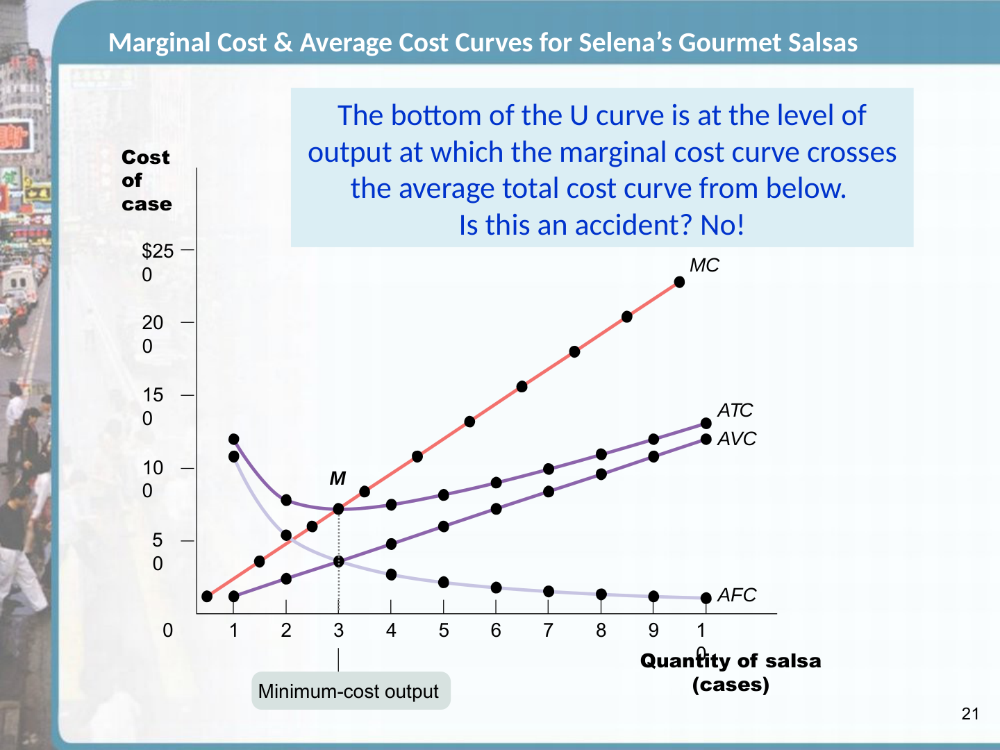

> 演讲者备注明确指出：ATC 曲线呈 U 形，MC 曲线在 U 形底部（点 M）与 ATC 相交，该点对应的是**最低平均总成本 (minimum average total cost)**。

### 4.2 核心原理：MC 与 ATC 的关系

> [!info] 边际成本与平均成本的关系（普适原理）
> 这是一条适用于**所有企业**的通用法则：
> - 在 **最低成本产出 (Minimum-Cost Output)** 处，ATC 最低，此时 **MC = ATC**。
> - 当产出**低于**最低成本产出时：**MC < ATC**，ATC 在下降。
> - 当产出**高于**最低成本产出时：**MC > ATC**，ATC 在上升。

> [!warning] 考点必考
> 这个关系与 GPA 的逻辑完全一致：如果你的边际成绩（本学期的 GPA）低于你的累计平均成绩，平均成绩就会被拉低；如果边际成绩高于平均，平均就会被拉高。**MC 曲线必定从下方穿过 ATC 曲线的最低点**——这不是偶然，而是逻辑必然。

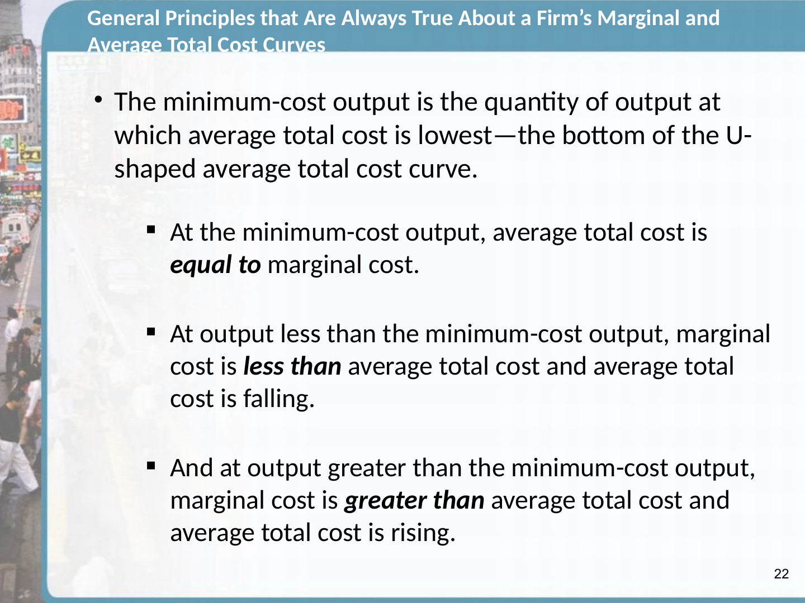

### 4.3 直观理解

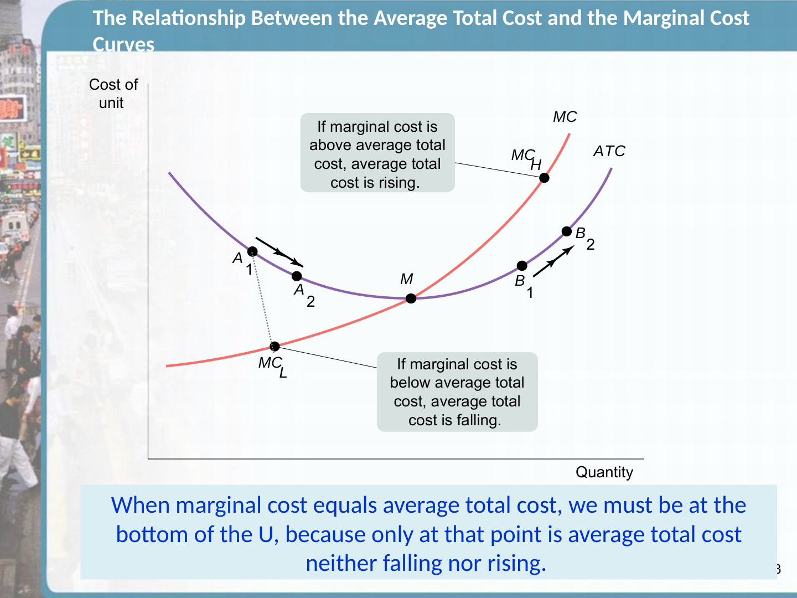

> 演讲者备注的精彩解释：为了理解为什么 MC 曲线必须穿过 ATC 曲线的最低点（点 M），我们观察 MC 与 ATC 不同时的两种情况。如果 MC < ATC，增加产出必定降低 ATC（如 A₁ → A₂ 的移动）。如果 MC > ATC，增加产出必定提高 ATC（如 B₁ → B₂ 的移动）。**只有当 MC = ATC 时，ATC 既不上升也不下降——这正是 U 形底部的位置。**

---

## 5. 更现实的成本曲线 (More Realistic Cost Curves)

### 5.1 边际成本曲线总是向上倾斜吗？

在实践中，边际成本曲线往往呈现 **"✔ Swoosh" 形状**：在极低产出水平时先下降，然后在高产出水平时上升。

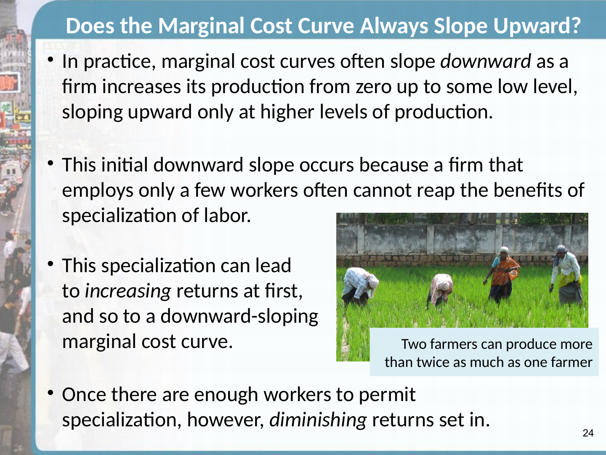

> [!info] 为什么 MC 最初会下降？
> 当一个企业只雇佣极少数工人时，**劳动专业化 (Specialization of Labor)** 的好处无法充分实现。随着工人数量增加：
> 1. **起初**：专业化程度提高 → **报酬递增 (Increasing Returns)** → MC **下降**
> 2. **之后**：专业化优势被耗尽 → **报酬递减 (Diminishing Returns)** 开始作用 → MC **上升**
>
> 这就是为何两个农民可以生产超出一个农民两倍的产量——专业化的力量。

### 5.2 更现实成本曲线的形态

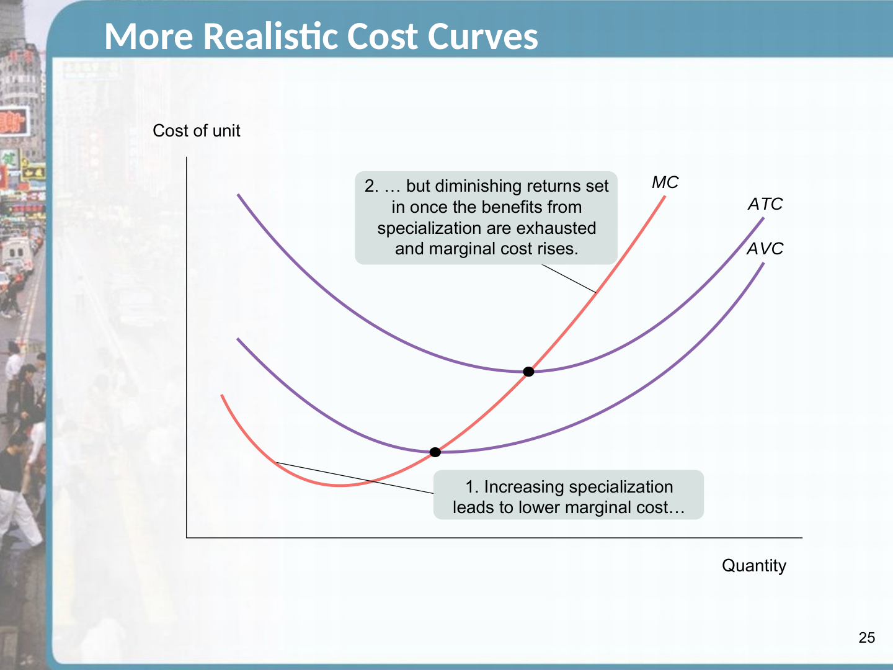

> 演讲者备注强调："Swoosh"形状的 MC 曲线和相应的 U 形 AVC 曲线才是更符合现实的情况。关键在于认识到**专业化的好处可以在一开始产生报酬递增**，直到工人数量足够、专业化红利耗尽，报酬递减才开始主导。

---

## 6. 短期成本 vs. 长期成本 (Short-Run versus Long-Run Costs)

### 6.1 核心差异

> [!info] 短期与长期成本的根本区别
> - **短期 (Short Run)**：固定成本 (Fixed Cost) 完全不受企业控制。企业只能在给定固定投入的条件下调整可变投入。
> - **长期 (Long Run)**：**所有投入都是可变的**，这意味着固定成本也成为了企业可以选择和调整的变量。
>
> 企业会在长期中根据**期望的产出水平**来选择最优的固定成本。

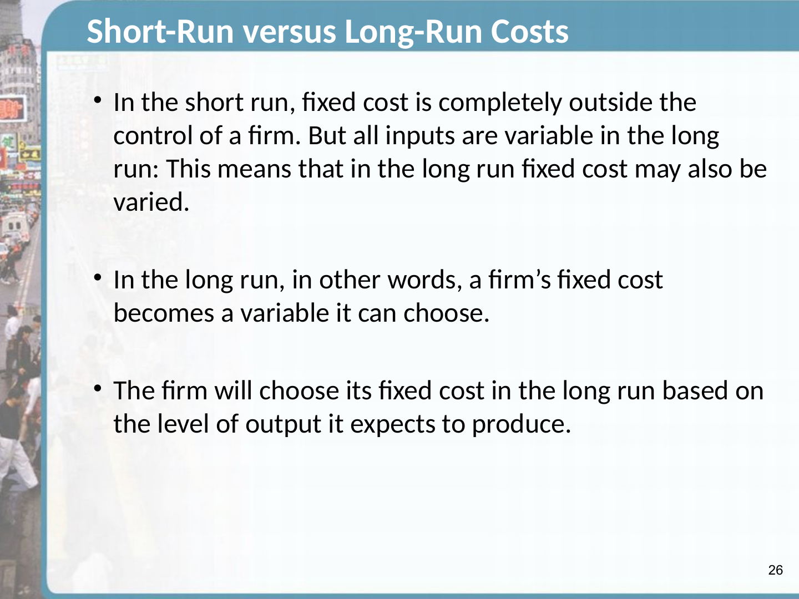

### 6.2 固定成本的选择：权衡 (Trade-off)

企业在选择固定成本水平时面临一个基本权衡：

> [!info] 高固定成本 vs. 低固定成本的权衡
> - **高固定成本** → 通常意味着更低的可变成本（更高效的设备/更大的工厂 → 每单位产出使用的可变投入更少）
> - **低固定成本** → 通常意味着更高的可变成本
>
> 哪种选择更优，取决于企业期望的**产出水平**。

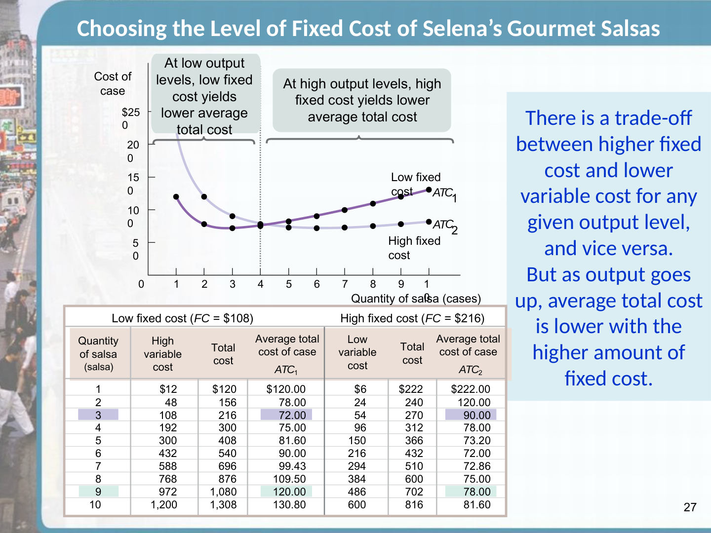

> 演讲者备注的详细说明：$ATC_1$ 对应低固定成本（$108），$ATC_2$ 对应高固定成本（$216）但更低的可变成本。在低产出水平（4 箱或以下），$ATC_1$ 低于 $ATC_2$——固定成本低更有优势。但在高产出水平（超过 4 箱），$ATC_2$ 低于 $ATC_1$——高固定成本换来更低的可变成本，总成本反而更低。

### 6.3 长期平均总成本曲线

> [!info] 长期平均总成本曲线 (Long-Run Average Total Cost Curve, LRATC)
> 展示了在**固定成本已被选择为对每个产出水平最小化平均总成本**的前提下，产出与平均总成本之间的关系。

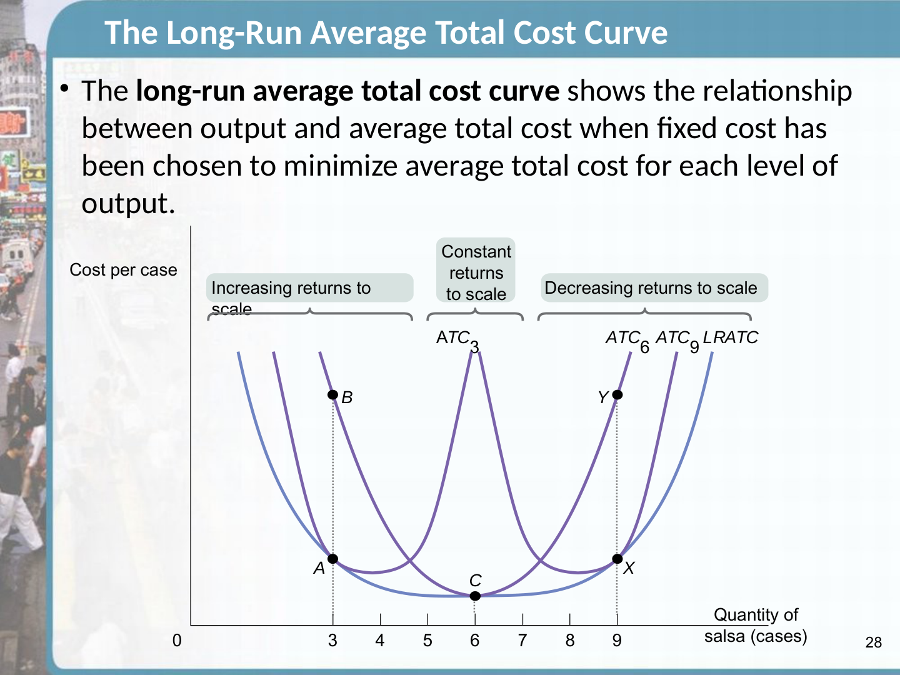

> 演讲者备注解释了图中的三个重要点：
> - 如果 Selena 选择对应于 6 箱产出的固定成本水平并实际生产 6 箱，她位于 $LRATC$ 和 $ATC_6$ 上的点 C。
> - 如果她只生产 3 箱，位于点 B（短期）；但如果她**预期长期只生产** 3 箱，她会降低固定成本，移至 $ATC_3$ 上的点 A。
> - 同理，如果她生产 9 箱（点 Y）且预期持续，长期中她会增加固定成本，移至点 X。

---

## 7. 规模报酬 (Returns to Scale)

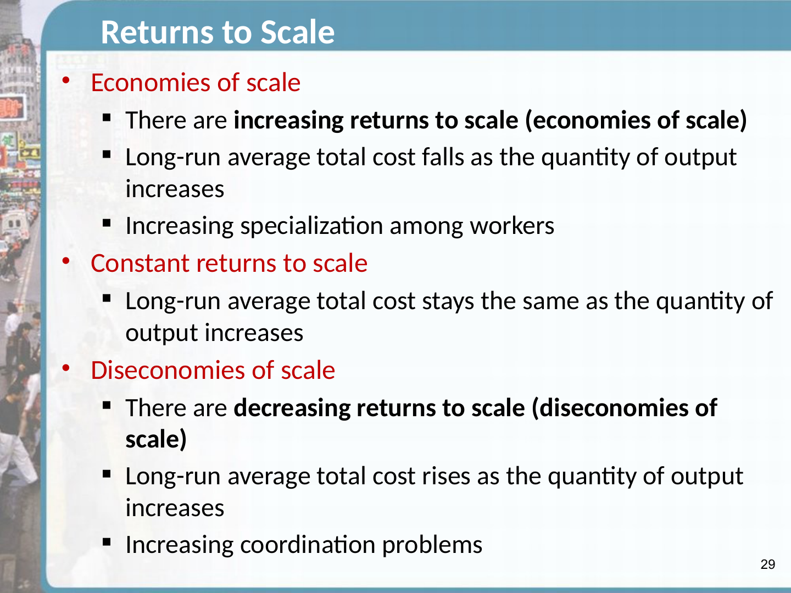

> [!info] 规模经济 / 规模报酬递增 (Increasing Returns to Scale / Economies of Scale)
> 当产出增加时，**长期平均总成本下降**。
> 原因：更大规模允许**更高程度的工人专业化**。

> [!info] 规模报酬不变 (Constant Returns to Scale)
> 当产出增加时，**长期平均总成本保持不变**。

> [!info] 规模不经济 / 规模报酬递减 (Decreasing Returns to Scale / Diseconomies of Scale)
> 当产出增加时，**长期平均总成本上升**。
> 原因：大规模组织带来的**协调问题 (Coordination Problems)** 日益严重。

> [!warning] 区分两个"递减"
> - **Diminishing Returns (边际报酬递减)**：是**短期**概念——在固定投入不变时，增加可变投入导致边际产量下降。
> - **Decreasing Returns to Scale (规模报酬递减)**：是**长期**概念——所有投入同比例增加时，产出增加的比例小于投入增加的比例。
>
> 两者机制不同，不可混淆！前者源于固定投入的瓶颈，后者源于组织的协调困难。

---

## 8. 本章总结 (Summary)

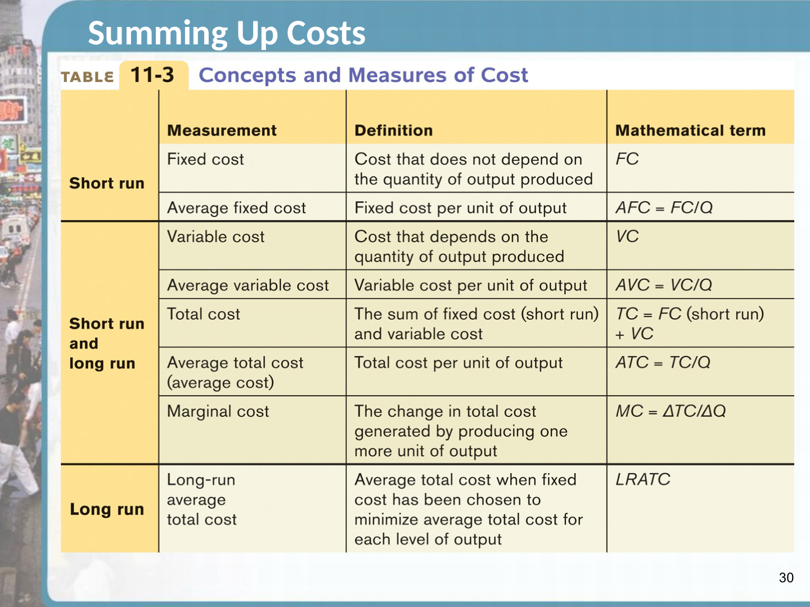

### 8.1 生产函数与成本基础

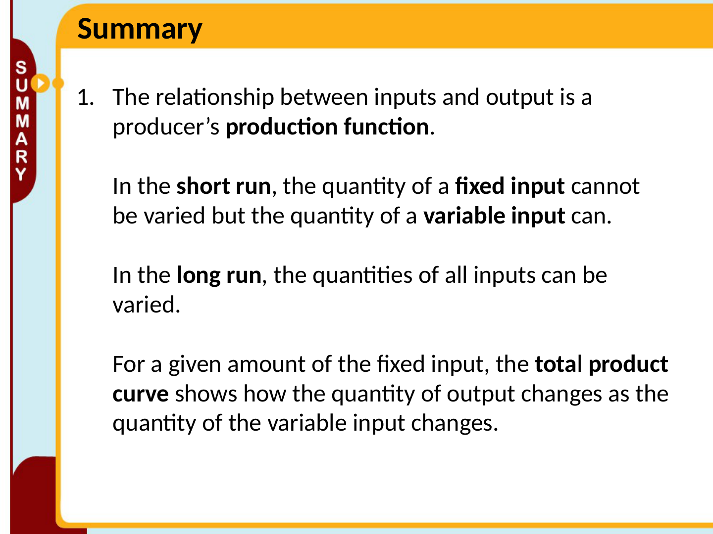

- **生产函数 (Production Function)** 描述了投入与产出之间的关系。
- 短期中，固定投入不可变，可变投入可变；长期中，所有投入皆可变。
- **总产量曲线 (Total Product Curve)** 展示可变投入与产出的关系。

### 8.2 边际报酬递减与成本结构

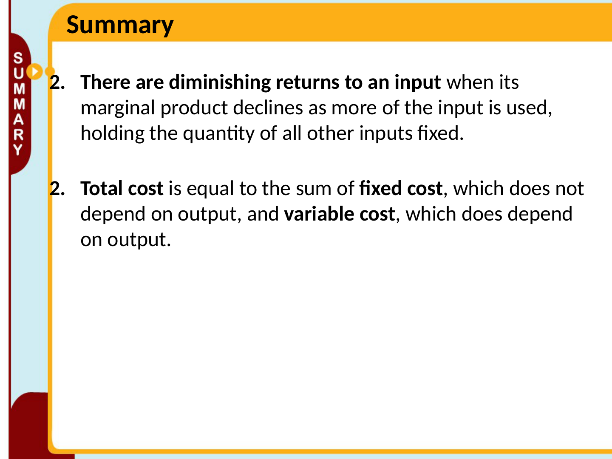

- 当边际产量随投入增加而下降时，存在 **边际报酬递减 (Diminishing Returns)**。
- **总成本 (Total Cost)** = 固定成本 (Fixed Cost) + 可变成本 (Variable Cost)。

### 8.3 平均成本与边际成本

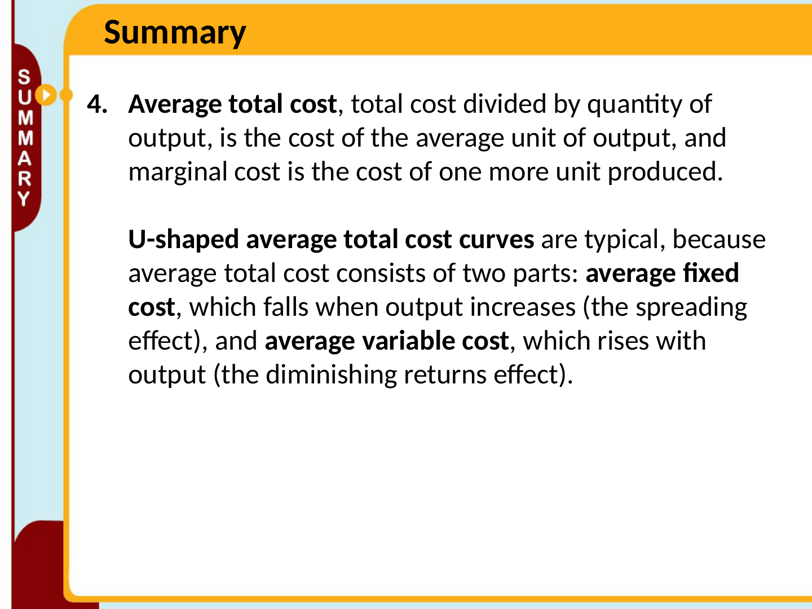

- **平均总成本 (ATC)** = TC / Q；**边际成本 (MC)** = 额外一单位产出的成本。
- U 形 ATC 曲线由两部分构成：
  - **AFC**：随产出增加而下降（摊薄效应，Spreading Effect）
  - **AVC**：随产出增加而上升（边际报酬递减效应，Diminishing Returns Effect）

### 8.4 最低成本产出

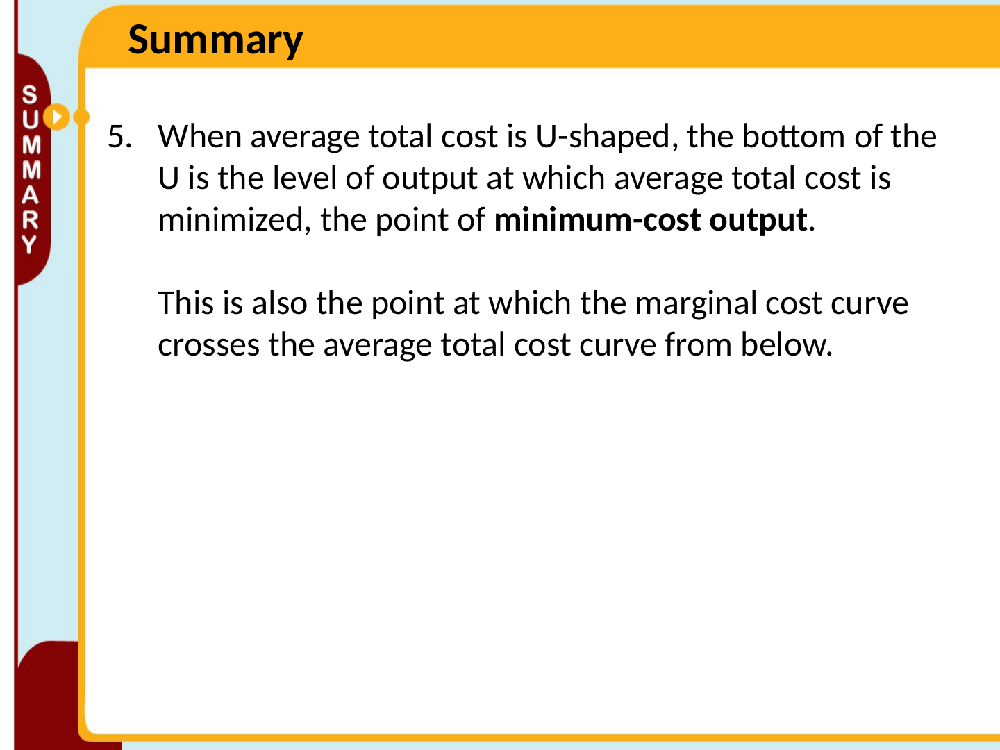

- U 形 ATC 曲线的最低点即为 **最低成本产出 (Minimum-Cost Output)**。
- 在该点，**MC = ATC**，且 MC 曲线从下方穿过 ATC 曲线。

### 8.5 长期成本与规模报酬

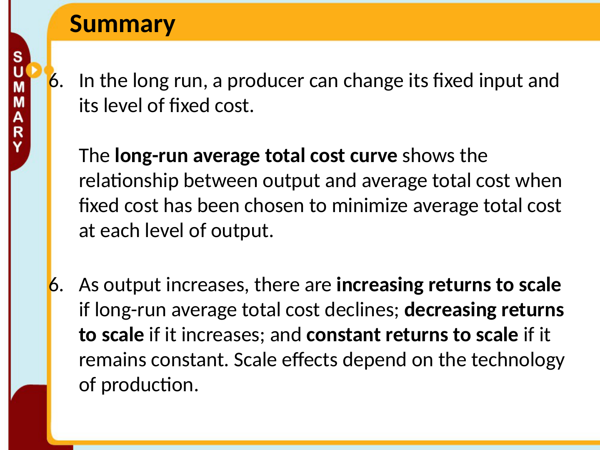

- 长期中，企业可以改变固定投入和固定成本水平。
- **长期平均总成本曲线 (LRATC)** 展示最优固定成本选择下的成本关系。
- 三种规模报酬：
  - **规模报酬递增 (Increasing Returns to Scale)**：LRATC 下降。
  - **规模报酬不变 (Constant Returns to Scale)**：LRATC 不变。
  - **规模报酬递减 (Decreasing Returns to Scale)**：LRATC 上升。

---

## 9. 关键术语 (Key Terms)

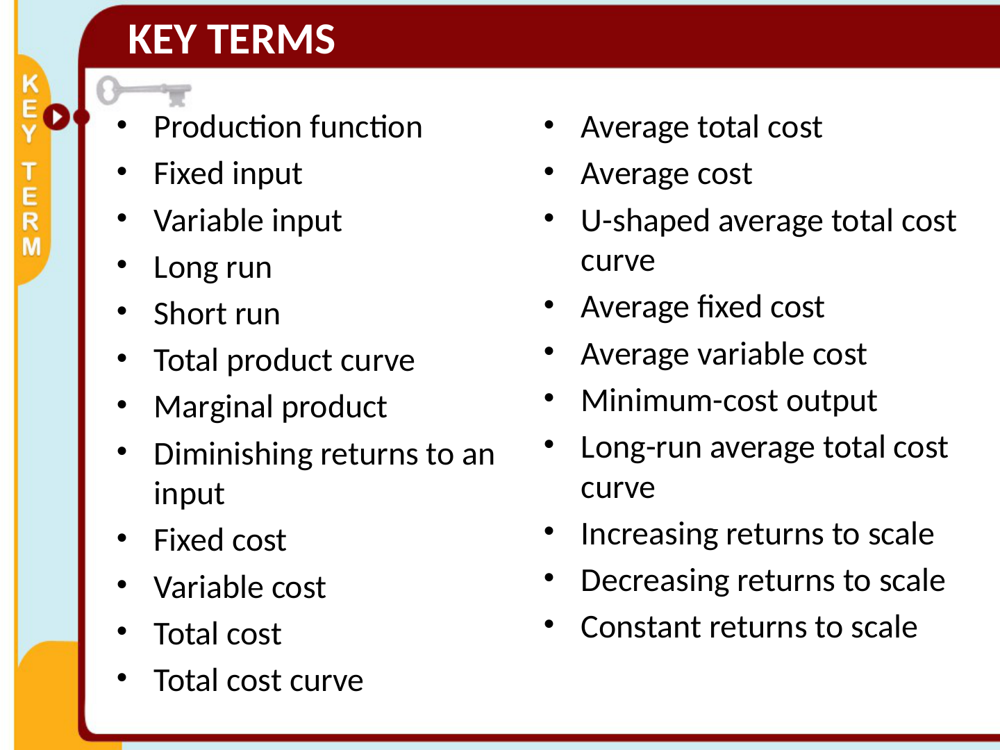

| 英文术语 | 中文翻译 |
|:--------|:--------|
| Production Function | 生产函数 |
| Fixed Input | 固定投入 |
| Variable Input | 可变投入 |
| Long Run | 长期 |
| Short Run | 短期 |
| Total Product Curve | 总产量曲线 |
| Marginal Product | 边际产量 |
| Diminishing Returns to an Input | 投入的边际报酬递减 |
| Fixed Cost | 固定成本 |
| Variable Cost | 可变成本 |
| Total Cost | 总成本 |
| Total Cost Curve | 总成本曲线 |
| Average Total Cost / Average Cost | 平均总成本 / 平均成本 |
| U-shaped Average Total Cost Curve | U 形平均总成本曲线 |
| Average Fixed Cost | 平均固定成本 |
| Average Variable Cost | 平均可变成本 |
| Minimum-Cost Output | 最低成本产出 |
| Long-Run Average Total Cost Curve | 长期平均总成本曲线 |
| Increasing Returns to Scale | 规模报酬递增 |
| Decreasing Returns to Scale | 规模报酬递减 |
| Constant Returns to Scale | 规模报酬不变 |

> [!question] 课后思考
> 1. 为什么 MC 曲线必定穿过 ATC 曲线的最低点？请用 GPA 类比解释。
> 2. 短期中的 Diminishing Returns 与长期中的 Decreasing Returns to Scale 有何本质区别？
> 3. 一家企业在选择高固定成本还是低固定成本时，应考虑哪些因素？
> 4. "Swoosh"形 MC 曲线（先降后升）与标准的始终向上倾斜的 MC 曲线，各自的前提假设是什么？
