# Chapter 1 — Basic Concepts

> [!abstract] 本章目标
> 本章用一个 $3\times 3$ 网格世界建立强化学习的基本语言：状态、动作、状态转移、策略、奖励、轨迹、回报、回合，以及把这些概念统一起来的马尔可夫决策过程（Markov decision process, MDP）。这些对象不是孤立名词：Bellman Equation 会在 MDP 与 Markov 性质上递归分解回报；Bellman Optimality Equation、Value Iteration 与 Policy Iteration 会据此寻找更优策略；Monte Carlo 与 Temporal-Difference 方法会用经验轨迹估计长期回报；后续 Value Function、Policy Gradient 和 Actor-Critic 方法则分别从价值、策略或两者结合的角度表示和改进决策。

## 0. 本章知识地图

Figure 1.1 把全书分成“基础工具”和“算法/方法”两层。本章是基础工具的入口，向后连接 Bellman Equation（Chapter 2）与 Bellman Optimality Equation（Chapter 3）。在算法层，Value/Policy Iteration（Chapter 4）使用模型，Monte Carlo（Chapter 5）不使用模型；Stochastic Approximation（Chapter 6）与 Temporal-Difference（Chapter 7）引出增量方法；之后从表格表示转向函数表示（Chapter 8），再到 Policy Gradient（Chapter 9）以及结合 policy-based 与 value-based 思路的 Actor-Critic（Chapter 10）。

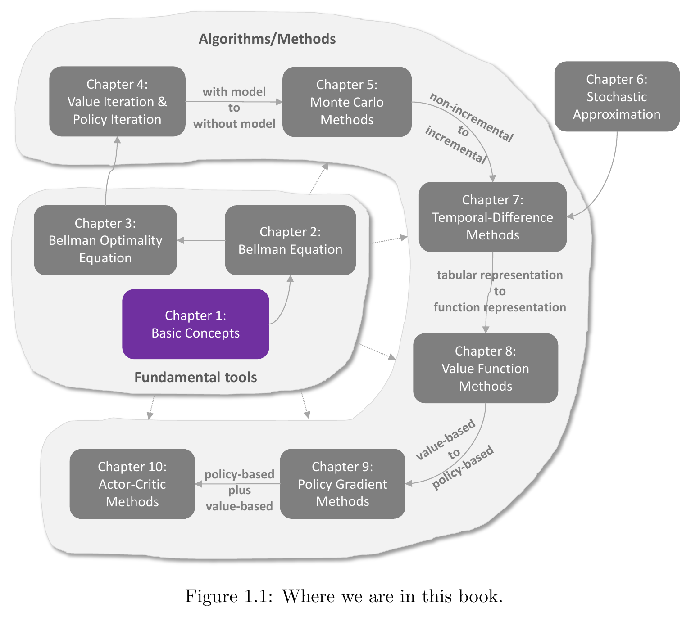

- **图中展示了什么**：第 1—10 章之间的依赖、方法类别与表示方式的演进。
- **它说明了哪个概念**：本章提供后续所有方法共同使用的 MDP 基本对象。
- **阅读重点**：Chapter 1 位于“Fundamental tools”的起点；Chapter 4 与 Chapter 5 的主要区分是 with model / without model；Chapter 7 之后逐步从 tabular representation 走向 function representation。
- **与正文公式的联系**：本章定义的 $p(s'|s,a)$、$p(r|s,a)$、$\pi(a|s)$ 和回报 $G_t$，正是后续 Bellman 方程和各种求解算法操作的对象。

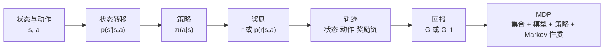

这条链不是严格的执行时间顺序，而是一条学习路径：先说清楚系统“在哪里、能做什么”，再描述动作带来的环境响应与反馈，最后用轨迹和回报评价策略，并由 MDP 统一形式化。

## 1. Grid World 示例

网格世界由 $3\times 3$ 个格子组成。机器人是智能体（agent），网格以及决定移动结果和奖励的规则构成环境（environment）。每个时刻，智能体只占据一个格子，并可以尝试移动到相邻格子。

- **白色格**：可正常进入的格子。
- **禁止格**：橙色的 $s_6$、$s_7$。本章允许进入，但进入会受到负奖励。
- **目标格**：青色的 $s_9$，智能体希望到达这里。
- **智能体的目标**：从任意初始格出发，找到一条“好”的策略到达目标，同时避免禁止格、无意义绕路和撞击边界。

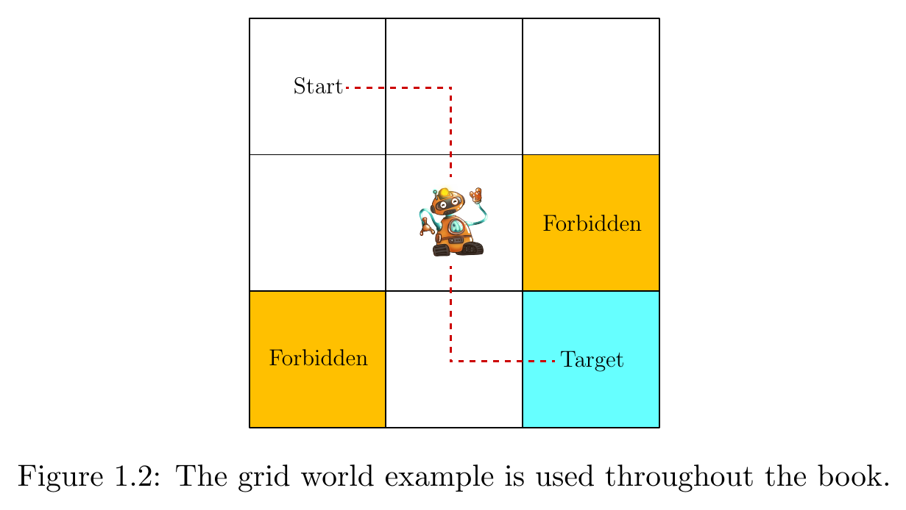

- **图中展示了什么**：起点、机器人、两个禁止格、目标格及一条示意路径。
- **它说明了哪个概念**：强化学习任务是智能体与环境反复交互并改进行为规则。
- **阅读重点**：禁止格不是墙；图中路径只是一条示意轨迹，不是状态空间本身，也不是唯一策略。
- **与正文公式的联系**：九个格子将形成状态空间 $\mathcal S$；每一步移动对应动作 $a$、状态转移 $s\to s'$ 和奖励 $r$。

若地图及移动规则全部已知，直接规划一条到目标的路线相对简单；若智能体事先不知道环境，就必须通过试错（trial and error）执行动作、观察新状态和奖励，再逐渐找到好策略。这里的“试错”不是随意乱走，而是用交互结果识别哪些状态—动作组合会碰边界、进入禁止格或到达目标。

“好策略”不是只要求最终到达 $s_9$。原书同时要求它尽量避免禁止格、边界碰撞和不必要的绕路，因此策略优劣必须结合整条轨迹的累计结果来判断。

> [!tip] 直观理解
> 可以把网格世界看成一个没有预先给出说明书的迷宫：状态回答“我现在在哪里”，动作回答“我准备怎么走”，环境决定“实际走到哪里”，奖励给出“这一步是否符合目标”，策略则是“在每个位置准备采用什么走法”的整套规则。

## 2. 状态与动作

### 2.1 状态

状态（state）描述智能体相对于环境的当前状况。在本例中，只要知道机器人位于哪个格子，就足以描述后续移动，因此“格子位置”可以作为状态。九个位置分别记为 $s_1,s_2,\ldots,s_9$，所有可能状态构成状态空间（state space）：

$$
\mathcal{S} = \{s_1,s_2,\ldots,s_9\}.
$$

状态不是机器人本身，也不是某个动作；它是决策时用于概括当前情形的信息。网格位置之所以可用，是因为本章假定同一位置下，下一步的转移与奖励规则相同。

### 2.2 动作

动作（action）是智能体可以尝试执行的决策：

| 动作 | 含义 |
|---|---|
| $a_1$ | 向上 |
| $a_2$ | 向右 |
| $a_3$ | 向下 |
| $a_4$ | 向左 |
| $a_5$ | 保持不动 |

全局动作空间（action space）为

$$
\mathcal{A} = \{a_1,a_2,a_3,a_4,a_5\}.
$$

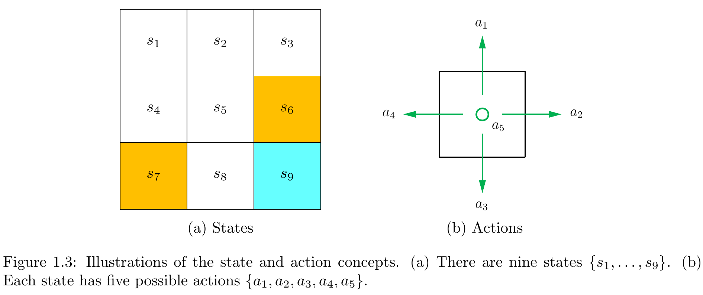

- **图中展示了什么**：左图给出九个状态及禁止格、目标格的位置；右图给出四个方向动作和原地不动动作。
- **它说明了哪个概念**：状态是位置的编号，动作是从当前位置发出的控制选择。
- **阅读重点**：$a_5$ 不是“没有定义动作”，而是明确选择保持不动；$s_6$、$s_7$ 虽是禁止格，仍属于状态空间。
- **与正文公式的联系**：左图枚举 $\mathcal S$，右图枚举 $\mathcal A$，二者共同定义状态—动作对 $(s,a)$。

### 2.3 全局动作空间与状态相关动作空间

一种建模方法是只保留物理上不会撞边界的动作。例如在左上角 $s_1$，向上 $a_1$ 和向左 $a_4$ 会撞边界，于是可以定义

$$
\mathcal{A}(s_1)=\{a_2,a_3,a_5\}.
$$

另一种方法是让每个状态都有相同的全局动作空间：

$$
\mathcal{A}(s_i)=\mathcal{A}=\{a_1,a_2,a_3,a_4,a_5\},\qquad \forall i.
$$

本书采用第二种、更一般的方式。边界动作仍可被选择，只是环境会把智能体弹回原状态并给予边界惩罚。这种表示把“能否选择动作”和“动作执行后会发生什么”分开：前者属于动作空间，后者属于状态转移与奖励规则。

> [!warning] 常见误区
> - 状态不是动作：$s_1$ 表示当前位置，$a_2$ 表示向右的选择。
> - 状态空间不是一条实际轨迹：$\mathcal S$ 列出所有可能状态；轨迹只记录一次交互实际访问的顺序。
> - 动作可选不代表动作一定产生预期结果：动作表达智能体的意图，下一状态由环境的转移规则决定；随机环境中结果尤其可能偏离意图。

## 3. 状态转移

### 3.1 状态转移的基本形式

状态转移（state transition）是执行动作后从当前状态到下一状态的过程。例如在 $s_1$ 选择向右 $a_2$：

$$
s_1 \xrightarrow{a_2} s_2.
$$

箭头左侧是当前状态，箭头上的标记是动作，右侧是环境产生的下一状态。

### 3.2 撞击边界

若在 $s_1$ 选择向上 $a_1$，机器人不可能离开状态空间，因此被边界“弹回”，仍在 $s_1$：
$$
s_1 \xrightarrow{a_1} s_1.
$$
这是一条自转移。虽然下一状态没变，但动作确实执行过，并会按奖励规则得到 $r_{\text{boundary}}=-1$。

### 3.3 进入禁止格

禁止格有两种常见建模方式：

1. **可进入**：如在 $s_5$ 选择 $a_2$，下一状态为 $s_6$，即 $s_5\xrightarrow{a_2}s_6$，同时受到惩罚。
2. **不可进入**：若禁止区域由墙围住，同一动作会被弹回，得到 $s_5\xrightarrow{a_2}s_5$。

采用哪种方式取决于物理环境或仿真设计。本章采用第一种：禁止格可进入，但进入会受到负奖励。现实任务中的转移由真实动力学决定；仿真任务则可按问题需要定义。

### 3.4 状态转移表

Table 1.1 逐项给出当前状态与动作确定的下一状态。

| 当前状态 | $a_1$（向上） | $a_2$（向右） | $a_3$（向下） | $a_4$（向左） | $a_5$（不动） |
|---|---:|---:|---:|---:|---:|
| $s_1$ | $s_1$ | $s_2$ | $s_4$ | $s_1$ | $s_1$ |
| $s_2$ | $s_2$ | $s_3$ | $s_5$ | $s_1$ | $s_2$ |
| $s_3$ | $s_3$ | $s_3$ | $s_6$ | $s_2$ | $s_3$ |
| $s_4$ | $s_1$ | $s_5$ | $s_7$ | $s_4$ | $s_4$ |
| $s_5$ | $s_2$ | $s_6$ | $s_8$ | $s_4$ | $s_5$ |
| $s_6$ | $s_3$ | $s_6$ | $s_9$ | $s_5$ | $s_6$ |
| $s_7$ | $s_4$ | $s_8$ | $s_7$ | $s_7$ | $s_7$ |
| $s_8$ | $s_5$ | $s_9$ | $s_8$ | $s_7$ | $s_8$ |
| $s_9$ | $s_6$ | $s_9$ | $s_9$ | $s_8$ | $s_9$ |

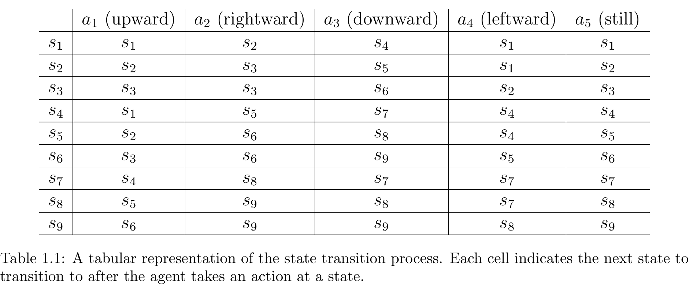

- **图中展示了什么**：全部 $9\times5$ 个状态—动作对对应的下一状态。
- **它说明了哪个概念**：本例的转移是一个确定性查表规则。
- **阅读重点**：碰边界会原地不动；禁止格 $s_6,s_7$ 可进入；从 $s_9$ 执行不同动作可能留在 $s_9$ 或离开到 $s_6,s_8$。
- **与正文公式的联系**：表中每个单元格都等价于某个概率为 1 的 $p(s'|s,a)$，其他候选下一状态概率为 0。

### 3.5 状态转移概率

状态转移概率

$$
p(s'|s,a)
$$

表示：已知当前状态为 $s$ 且执行动作 $a$ 时，下一状态为 $s'$ 的条件概率。原书例子中，$s_1$ 向右必到 $s_2$：

$$
p(s_2|s_1,a_2)=1.
$$

对这个固定的 $(s_1,a_2)$，可能的下一状态形成一个完整概率分布：

$$
\begin{aligned}
p(s_1|s_1,a_2)&=0,\\
p(s_2|s_1,a_2)&=1,\\
p(s_3|s_1,a_2)&=0,\\
p(s_4|s_1,a_2)&=0,\\
p(s_5|s_1,a_2)&=0.
\end{aligned}
$$

其余 $s_6,s_7,s_8,s_9$ 的概率同样为 0。原因不是这些状态“不存在”，而是本例的确定性动力学规定这一步只能到达 $s_2$。

### 3.6 确定性与随机性状态转移

| 对比项    | 确定性状态转移（deterministic） | 随机性状态转移（stochastic）                           |
| ------ | ---------------------- | --------------------------------------------- |
| 定义     | 给定 $(s,a)$ 后，下一状态唯一确定  | 给定 $(s,a)$ 后，下一状态仍有多个可能结果                     |
| 数学形式   | 某个 $s'$ 的概率为 1，其余为 0   | 多个 $s'$ 可有大于 0 的概率，且总和为 1                     |
| 网格世界例子 | $p(s_2\mid s_1,a_2)=1$ | 有随机风时，向右也可能被吹到 $s_5$，故 $p(s_5\mid s_1,a_2)>0$ |
| 表示方式   | 下一状态表足够直观              | 必须用完整条件概率分布描述                                 |

原书的网格世界为简化起见采用确定性转移；随机风只是用来说明更一般的随机情形。

## 4. 策略

### 4.1 策略是什么

策略（policy）规定智能体在各个状态下选择什么动作。它不是一次走过的路线，而是一套覆盖所有状态的决策规则。遵循同一策略，从不同初始状态出发，访问的前缀不同，因此可以得到不同轨迹；这些轨迹仍由同一套状态到动作的映射产生。

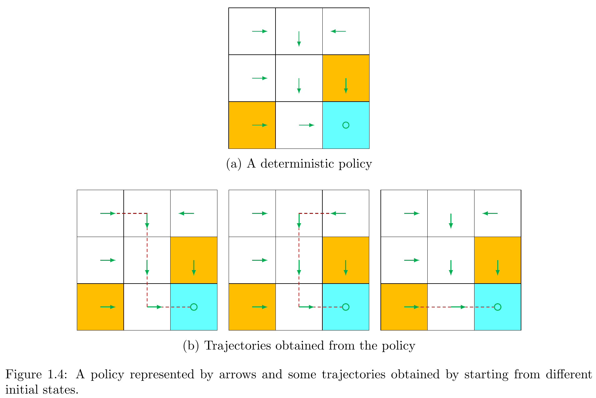

- **图中展示了什么**：上图用箭头给出每个状态的确定性动作，下图展示三个不同初始状态得到的轨迹。
- **它说明了哪个概念**：策略是全局规则，轨迹是从某个初始状态实际展开的结果。
- **阅读重点**：绿色箭头属于策略；红色虚线属于轨迹。改变初始状态会改变轨迹，但不改变图中的策略。
- **与正文公式的联系**：每个绿色箭头表示对应动作的 $\pi(a|s)=1$；轨迹还需结合环境转移 $p(s'|s,a)$ 才能生成。

### 4.2 策略的数学表示

策略写为

$$
\pi(a|s),
$$

表示在状态 $s$ 下选择动作 $a$ 的条件概率。对每个固定状态，可选动作的概率必须归一化：

$$
\sum_{a\in\mathcal{A}(s)}\pi(a|s)=1.
$$

这里求和的是“在同一个状态下可选择的所有动作”，不是对状态或下一状态求和。

### 4.3 确定性策略

Figure 1.4 中 $s_1$ 的策略为

$$
\begin{aligned}
\pi(a_1|s_1)&=0,\\
\pi(a_2|s_1)&=1,\\
\pi(a_3|s_1)&=0,\\
\pi(a_4|s_1)&=0,\\
\pi(a_5|s_1)&=0.
\end{aligned}
$$

$\pi(a_2|s_1)=1$ 表示只要处于 $s_1$，策略必然选择向右；它描述动作选择的确定性，而不是直接断言下一状态。下一状态仍由环境转移模型决定。在本章的确定性环境中，这一选择随后令智能体到达 $s_2$。

### 4.4 随机策略

随机策略允许同一状态下以不同概率选择多个动作。在 $s_1$，Figure 1.5 规定

$$
\pi(a_2|s_1)=0.5,
$$

$$
\pi(a_3|s_1)=0.5,
$$

其余三个动作概率为 0。因而从相同的 $s_1$ 出发，多次执行策略可能先向右，也可能先向下。

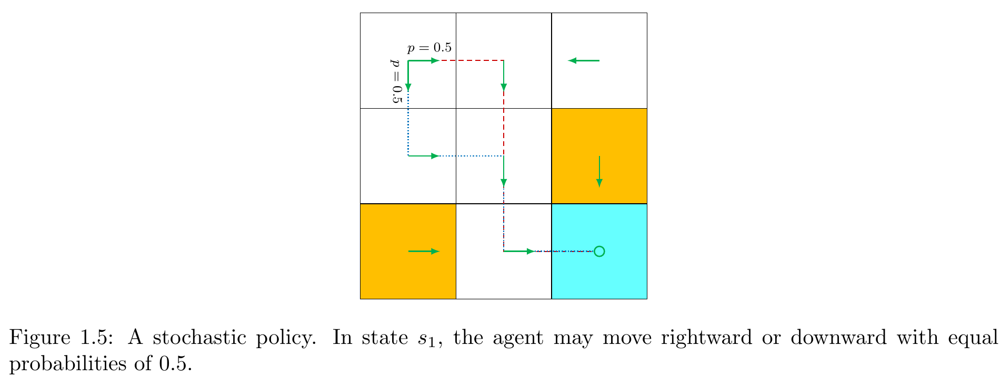

- **图中展示了什么**：在 $s_1$，向右和向下两条选择分支各有 $0.5$ 的概率，并绘出相应路径。
- **它说明了哪个概念**：随机性可以来自策略本身，即智能体的动作选择不唯一。
- **阅读重点**：图中的 $0.5$ 是动作概率 $\pi(a|s)$，不是风把智能体吹向某处的转移概率。
- **与正文公式的联系**：$\pi(a_2|s_1)+\pi(a_3|s_1)=0.5+0.5=1$，满足策略归一化。

### 4.5 策略的表格表示

Table 1.2 将 Figure 1.5 的随机策略存成表格。行是状态，列是动作，单元格是 $\pi(a_j|s_i)$。

| 状态 | $a_1$（向上） | $a_2$（向右） | $a_3$（向下） | $a_4$（向左） | $a_5$（不动） | 行和 |
|---|---:|---:|---:|---:|---:|---:|
| $s_1$ | 0 | 0.5 | 0.5 | 0 | 0 | 1 |
| $s_2$ | 0 | 0 | 1 | 0 | 0 | 1 |
| $s_3$ | 0 | 0 | 0 | 1 | 0 | 1 |
| $s_4$ | 0 | 1 | 0 | 0 | 0 | 1 |
| $s_5$ | 0 | 0 | 1 | 0 | 0 | 1 |
| $s_6$ | 0 | 0 | 1 | 0 | 0 | 1 |
| $s_7$ | 0 | 1 | 0 | 0 | 0 | 1 |
| $s_8$ | 0 | 1 | 0 | 0 | 0 | 1 |
| $s_9$ | 0 | 0 | 0 | 0 | 1 | 1 |

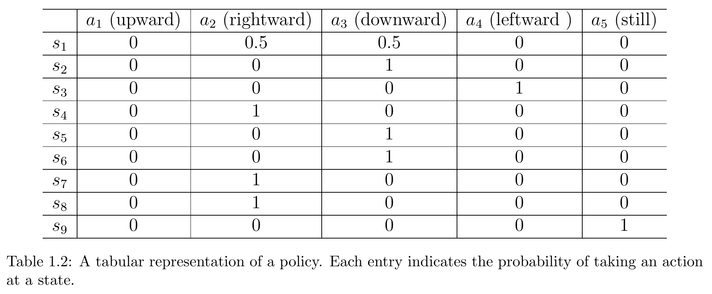

- **图中展示了什么**：九个状态上五个动作的选择概率。
- **它说明了哪个概念**：tabular representation（表格表示）把有限状态、有限动作下的策略完整枚举出来。
- **阅读重点**：每一行对应一个条件概率分布，所以行和必须为 1；只有 $s_1$ 一行含两个非零概率，其余各行都是确定性选择。
- **与正文公式的联系**：表中第 $i$ 行第 $j$ 列就是 $\pi(a_j|s_i)$，每行满足 $\sum_a\pi(a|s_i)=1$。

#### 策略和状态转移的区别

| 对比项      | 策略 $\pi(a\mid s)$                 | 状态转移 $p(s'\mid s,a)$                    |
| -------- | --------------------------------- | --------------------------------------- |
| 由谁决定     | 智能体                               | 环境动力学或仿真规则                              |
| 条件       | 当前状态 $s$                          | 当前状态 $s$ 与已执行动作 $a$                     |
| 随机变量     | 选择的动作 $a$                         | 产生的下一状态 $s'$                            |
| 回答的问题    | “我在 $s$ 时选什么？”                    | “在 $s$ 执行 $a$ 后会到哪里？”                   |
| $s_1$ 例子 | $\pi(a_2\mid s_1)=0.5$ 表示有一半概率选向右 | $p(s_2\mid s_1,a_2)=1$ 表示一旦选向右就必到 $s_2$ |

> [!important] 本章最重要的区别之一
> 策略的随机性来自智能体如何选动作；状态转移的随机性来自环境如何响应动作。二者可以同时是确定性的、同时是随机的，也可以一方确定而另一方随机。

## 5. 奖励

### 5.1 奖励的定义

智能体在状态 $s$ 执行动作 $a$ 后，会从环境获得奖励（reward）$r$。在本章的确定性写法中，奖励可记为

$$
r=r(s,a).
$$

奖励是环境给出的标量反馈，可以是正数、负数或零。正奖励通常鼓励相应行为，负奖励通常抑制相应行为，但真正决定策略优劣的是长期累计的相对结果，而不是单个数值的正负。

### 5.2 本章的奖励设计

$$
r_{\text{boundary}}=-1,
$$

表示尝试越过网格边界；

$$
r_{\text{forbidden}}=-1,
$$

表示尝试进入禁止格；

$$
r_{\text{target}}=+1,
$$

表示到达目标状态；其余普通情况为

$$
r_{\text{other}}=0.
$$

这些规则把任务偏好编码为反馈：希望到达目标，同时避免撞边界和踏入禁止区域。

### 5.3 目标状态的特殊情况

本章到达 $s_9$ 后不强制停止。两个动作展示了“下一状态相同，奖励却不同”：

- 在 $s_9$ 执行 $a_5$，仍处于 $s_9$，并得到 $r_{\text{target}}=+1$。
- 在 $s_9$ 执行 $a_2$，向右碰到边界，仍处于 $s_9$，但得到 $r_{\text{boundary}}=-1$。

因此，奖励不能只由“状态是否改变”判断。两次转移都得到 $s'=s_9$，但动作语义和奖励规则不同。Table 1.3 中 $s_9$ 行还表明：$a_1$ 会进入禁止格 $s_6$，$a_4$ 会正常移动到 $s_8$。

### 5.4 奖励作为人机接口

奖励可理解为人和学习系统之间的接口。任务设计者不必为每个状态直接编写完整路线，而是定义哪些结果值得追求、哪些应避免；智能体再通过与环境交互学习能获得较高长期回报的策略。复杂任务中的奖励设计仍然困难，因为设计者必须理解任务目标，避免反馈与真实意图不一致。

> [!tip]
> 奖励告诉 agent 什么结果值得追求，但通常不会直接告诉 agent 应该走哪条路径。

### 5.5 奖励表

Table 1.3 给出所有状态—动作对的确定性即时奖励。

| 状态 | $a_1$（向上） | $a_2$（向右） | $a_3$（向下） | $a_4$（向左） | $a_5$（不动） |
|---|---|---|---|---|---|
| $s_1$ | $r_{\text{boundary}}$ | $0$ | $0$ | $r_{\text{boundary}}$ | $0$ |
| $s_2$ | $r_{\text{boundary}}$ | $0$ | $0$ | $0$ | $0$ |
| $s_3$ | $r_{\text{boundary}}$ | $r_{\text{boundary}}$ | $r_{\text{forbidden}}$ | $0$ | $0$ |
| $s_4$ | $0$ | $0$ | $r_{\text{forbidden}}$ | $r_{\text{boundary}}$ | $0$ |
| $s_5$ | $0$ | $r_{\text{forbidden}}$ | $0$ | $0$ | $0$ |
| $s_6$ | $0$ | $r_{\text{boundary}}$ | $r_{\text{target}}$ | $0$ | $r_{\text{forbidden}}$ |
| $s_7$ | $0$ | $0$ | $r_{\text{boundary}}$ | $r_{\text{boundary}}$ | $r_{\text{forbidden}}$ |
| $s_8$ | $0$ | $r_{\text{target}}$ | $r_{\text{boundary}}$ | $r_{\text{forbidden}}$ | $0$ |
| $s_9$ | $r_{\text{forbidden}}$ | $r_{\text{boundary}}$ | $r_{\text{boundary}}$ | $0$ | $r_{\text{target}}$ |

其中 $r_{\text{boundary}}=-1$、$r_{\text{forbidden}}=-1$、$r_{\text{target}}=+1$。

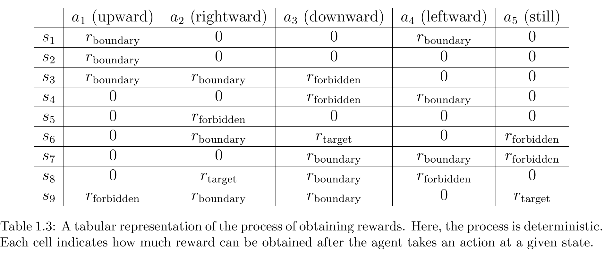

- **图中展示了什么**：每个 $(s,a)$ 执行后立即获得的奖励类别。
- **它说明了哪个概念**：同一动作在不同状态、同一状态下的不同动作，都可能得到不同奖励。
- **阅读重点**：该表是即时奖励表，不是回报表；$s_9$ 的多个自转移可能对应不同奖励。
- **与正文公式的联系**：确定性时单元格给出 $r(s,a)$；随机奖励时需改用 $p(r|s,a)$。

### 5.6 为什么不能只选择即时奖励最大的动作

即时奖励（immediate reward）只评价刚执行的一步；策略目标需要考虑之后所有奖励形成的长期回报。当前最大奖励动作可能把智能体带入未来较差的区域，也可能只是让它停滞，无法获得后续目标奖励。

> [!example] 补充理解
> 在 $s_4$，$a_1$、$a_2$ 和 $a_5$ 的即时奖励都是 0。若只按“当前最大值”并一直选 $a_5$，智能体会原地不动，永远得不到目标奖励；而选择 $a_2$ 可走向 $s_5$，再经 $s_8$ 到达 $s_9$ 并得到 $+1$。即时奖励相同，不代表长期结果相同。相反，经 $s_7$ 的路径会吃到禁止格奖励 $-1$，即使随后也能到目标，其总回报仍更低。

### 5.7 随机奖励

更一般的奖励过程用

$$
p(r|s,a)
$$

表示给定状态和动作后，获得奖励值 $r$ 的概率。本章表格是确定性奖励，例如

$$
p(r=-1|s_1,a_1)=1,
\qquad
p(r\neq-1|s_1,a_1)=0.
$$

| 对比项 | 确定性奖励 | 随机性奖励 |
|---|---|---|
| 结果 | 给定 $(s,a)$ 后奖励唯一 | 给定 $(s,a)$ 后奖励仍可能取多个值 |
| 表示 | $r(s,a)$ 或概率集中在一个值上 | 完整分布 $p(r\mid s,a)$ |
| 原书例子 | $s_1$ 向上必得 $-1$ | 学生努力学习通常得到正反馈，但具体考试成绩仍不确定 |

## 6. 轨迹、回报与回合

### 6.1 轨迹

轨迹（trajectory）是一次交互展开得到的状态—动作—奖励链。Figure 1.6 左侧策略从 $s_1$ 产生：

$$
s_1
\xrightarrow[a_2]{r=0}
s_2
\xrightarrow[a_3]{r=0}
s_5
\xrightarrow[a_3]{r=0}
s_8
\xrightarrow[a_2]{r=1}
s_9.
$$

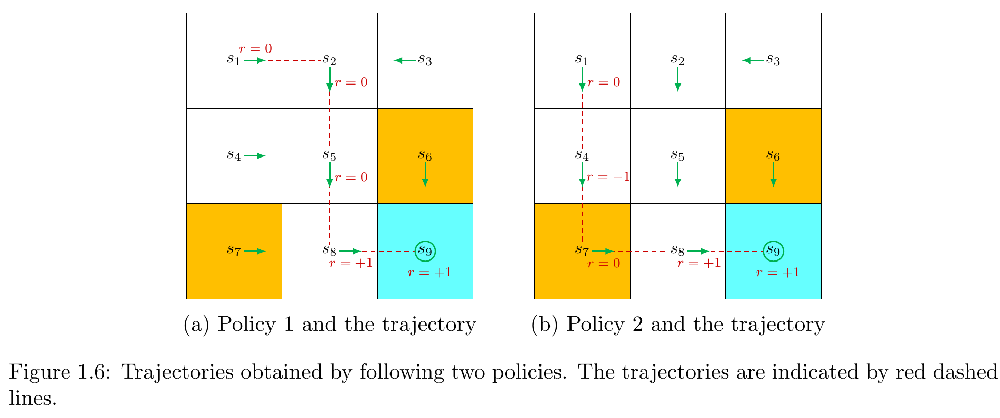

- **图中展示了什么**：两套策略从 $s_1$ 到 $s_9$ 的红色虚线轨迹，以及沿途即时奖励。
- **它说明了哪个概念**：到达同一目标的不同策略会生成不同轨迹和不同回报。
- **阅读重点**：Policy 1 避开禁止格；Policy 2 经过 $s_7$，因此多出一次 $-1$。
- **与正文公式的联系**：左轨迹的奖励序列为 $(0,0,0,1)$，右轨迹为 $(0,-1,0,1)$，分别代入回报求和。

### 6.2 回报

回报（return）是沿轨迹收集的奖励之和。原书也使用 total reward、cumulative reward 表达同一类累计概念。Policy 1 的回报为

$$
G=0+0+0+1=1.
$$

Policy 2 的轨迹是

$$
s_1
\xrightarrow[a_3]{r=0}
s_4
\xrightarrow[a_3]{r=-1}
s_7
\xrightarrow[a_2]{r=0}
s_8
\xrightarrow[a_2]{r=+1}
s_9,
$$

所以

$$
G=0-1+0+1=0.
$$

从同一初始状态比较，Policy 1 的回报 $1>0$，因此比 Policy 2 更好；这一结论与“Policy 2 穿过禁止格”的直觉一致。

### 6.3 即时奖励与未来奖励

- **即时奖励**：在初始状态执行当前动作后马上得到的奖励。
- **未来奖励（future rewards）**：离开初始状态后继续交互得到的奖励。
- **回报**：即时奖励与未来奖励的累计结果。

一个动作可能先得到负奖励、随后带来更多正奖励；也可能当前没有损失、长期却停滞不前。因此用回报而非即时奖励做决策，才能避免短视。

### 6.4 无限轨迹与发散问题

若到达 $s_9$ 后一直执行 $a_5$，每次都留在 $s_9$ 并得到 $+1$，未折扣总和为

$$
0+0+0+1+1+1+\cdots=\infty.
$$

直接求和发散，无法得到有限的策略评价。这促使我们为越远的奖励赋予越小权重。

### 6.5 折扣回报

从时刻 $t$ 开始的折扣回报（discounted return）定义为

$$
G_t=
r_{t+1}
+\gamma r_{t+2}
+\gamma^2r_{t+3}
+\cdots,
\qquad \gamma\in(0,1),
$$

其中折扣率（discount rate）$\gamma$ 控制未来奖励的权重。对上面的无限轨迹，前三个奖励为 0，第一次 $+1$ 出现在第四步，所以

$$
G=0+\gamma\cdot0+\gamma^2\cdot0+\gamma^3\cdot1
+\gamma^4\cdot1+\gamma^5\cdot1+\cdots.
$$

删去为零的项：

$$
G=\gamma^3+\gamma^4+\gamma^5+\cdots.
$$

提取公因子 $\gamma^3$：

$$
G=\gamma^3(1+\gamma+\gamma^2+\cdots).
$$

令 $S=1+\gamma+\gamma^2+\cdots$。因为 $0<\gamma<1$，有

$$
\gamma S=\gamma+\gamma^2+\gamma^3+\cdots,
$$

两式相减：

$$
S-\gamma S=1,
$$

所以

$$
S=\frac{1}{1-\gamma}.
$$

最终得到

$$
G=\frac{\gamma^3}{1-\gamma}.
$$

指数 $3$ 很关键：按 $G_t$ 的定义，第一步奖励权重是 $\gamma^0=1$，第四步奖励的权重才是 $\gamma^3$。

### 6.6 折扣率的意义

折扣率一方面使某些无限长正奖励序列得到有限回报，另一方面调节近期与远期奖励的相对重要性。

| $\gamma$ | 行为倾向        | 优点              | 风险                                          |
| -------- | ----------- | --------------- | ------------------------------------------- |
| 接近 0     | 强调近期奖励，较短视  | 对很快出现的反馈敏感      | 可能忽视更远但更大的收益                                |
| 中间值      | 在近期与远期之间折中  | 同时保留一定即时性和规划性   | 结果依赖任务中奖励出现的时间尺度                            |
| 接近 1     | 强调远期奖励，较有远见 | 更愿意为长期收益承受近期负奖励 | 远期影响更强，且在无限任务中必须保持 $\gamma<1$ 才能使用本章的等比收敛论证 |

### 6.7 Episode

当智能体按策略与环境交互，并在某个终止状态（terminal state）停止时，得到的轨迹称为回合（episode），也称 trial。

- 随机策略或随机环境下，从同一状态出发可得到不同回合。
- 若策略和环境全部确定，从同一状态出发总会得到同一回合。
- 回合通常假定为有限轨迹；具有回合的任务称为 episodic task。
- 没有终止状态、交互永不结束的任务称为 continuing task。

轨迹是更一般的状态—动作—奖励序列；回合强调这条轨迹按任务终止规则构成一次完整试验。

### 6.8 Absorbing State

吸收状态（absorbing state）是一旦到达就永远不会离开的状态。对终止状态 $s_9$，原书给出两种统一 episodic 与 continuing 任务的处理方式：

1. **把终止状态变成特殊的吸收状态**：可规定 $\mathcal A(s_9)=\{a_5\}$；或者仍保留全部动作，但令

   $$
   p(s_9|s_9,a_i)=1,\qquad i=1,\ldots,5.
   $$

2. **把目标状态当作普通状态**：令 $\mathcal A(s_9)=\{a_1,\ldots,a_5\}$，允许离开再返回。由于每次到达或停留在 $s_9$ 可获得正奖励，智能体最终会倾向于留在这里；无限序列需用折扣回报避免发散。

本书采用第二种方式：$s_9$ 是普通状态，动作空间与其他状态相同，而不是强制吸收状态。

## 7. 马尔可夫决策过程

### 7.1 MDP 的组成

马尔可夫决策过程（Markov decision process, MDP）是描述随机动态系统的一般框架。本章将其组成整理为三层。

#### 集合

- 状态空间 $\mathcal S$：所有状态的集合。
- 状态相关动作空间 $\mathcal A(s)$：处于 $s\in\mathcal S$ 时可选动作的集合。
- 奖励集合 $\mathcal R(s,a)$：状态—动作对 $(s,a)$ 可能产生的奖励值集合。

#### 模型

- 状态转移概率 $p(s'|s,a)$：给定当前状态和动作，下一状态为 $s'$ 的概率。
- 奖励概率 $p(r|s,a)$：给定当前状态和动作，奖励为 $r$ 的概率。

#### 策略

- $\pi(a|s)$：给定当前状态，智能体选择动作 $a$ 的概率。

### 7.2 概率归一化条件

| 概率对象 | 归一化公式 | 固定什么 | 对什么求和 | 含义 |
|---|---|---|---|---|
| 下一状态分布 | $\displaystyle\sum_{s'\in\mathcal S}p(s'\mid s,a)=1$ | 当前 $(s,a)$ | 所有 $s'$ | 下一状态必落在状态空间中的某处 |
| 奖励分布 | $\displaystyle\sum_{r\in\mathcal R(s,a)}p(r\mid s,a)=1$ | 当前 $(s,a)$ | 所有可能奖励 $r$ | 该步必产生奖励集合中的某个值 |
| 动作分布 | $\displaystyle\sum_{a\in\mathcal A(s)}\pi(a\mid s)=1$ | 当前状态 $s$ | 所有可选动作 $a$ | 策略会选择一个可行动作 |

三条公式都“和为 1”，但随机变量不同：分别是下一状态、奖励和动作，不能互换。

### 7.3 马尔可夫性质

状态转移的马尔可夫性质（Markov property）为

$$
p(s_{t+1}|s_t,a_t,s_{t-1},a_{t-1},\ldots,s_0,a_0)
=
p(s_{t+1}|s_t,a_t).
$$

奖励的对应表达式为

$$
p(r_{t+1}|s_t,a_t,s_{t-1},a_{t-1},\ldots,s_0,a_0)
=
p(r_{t+1}|s_t,a_t).
$$

准确含义是：**在给定当前状态和动作的条件下，更早的历史信息不会为下一状态和奖励提供额外信息。** 这不是笼统地说“未来与过去无关”；若没有给定足以概括当前情形的状态，过去仍可能有信息价值。Markov 性质是下一章推导 Bellman Equation 的基础。

> [!example] 补充理解：符合 Markov 性质
> 若状态完整记录机器人所在格子，且网格规则固定，那么给定 $s_t=s_1$ 和 $a_t=a_2$ 后，是否曾经访问过 $s_7$ 不会改变本章规定的下一状态 $s_2$ 与即时奖励 0。

> [!example] 补充理解：不符合 Markov 性质
> 假设真实环境有“有风/无风”两种模式，但状态仍只记录格子位置，且风模式会持续。过去几步的偏移可以帮助判断当前是否有风，从而改进对下一状态的预测。此时只用格子位置作为 $s_t$ 不充分；给定它和动作后，历史仍提供额外信息，因此这个状态定义不满足 Markov 性质。

### 7.4 Model / Dynamics

对所有 $(s,a)$ 给出的

$$
p(s'|s,a)
$$

和

$$
p(r|s,a)
$$

共同称为环境模型（model）或动力学（dynamics）。前者描述环境把状态推进到哪里，后者描述环境反馈什么奖励。策略不属于环境模型，因为它描述智能体如何选择动作。

### 7.5 Stationary 与 Nonstationary

- **平稳模型（stationary model / time-invariant）**：转移与奖励规律不随时间改变；同一 $(s,a)$ 在不同时刻遵循同一分布。
- **非平稳模型（nonstationary model / time-variant）**：规律随时间改变。例如网格中的禁止区域有时出现、有时消失，会改变转移或奖励过程。

本书只考虑平稳模型。

### 7.6 MDP 与 Markov Process

MDP 中存在动作选择和策略，智能体可以影响状态演化。一旦固定 MDP 的策略，动作选择规则不再是待决策对象，系统便退化为马尔可夫过程（Markov process, MP）。若过程为离散时间，且状态数有限或可数，随机过程文献也称其为马尔可夫链（Markov chain）。本书在上下文明确时交替使用 MP 与 Markov chain，并主要考虑状态数、动作数均有限的 finite MDP。

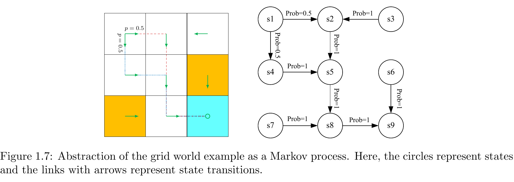

- **图中展示了什么**：左侧是固定随机策略下的网格，右侧用圆节点与有向边抽象出状态及状态间概率转移。
- **它说明了哪个概念**：固定策略后，动作选择被吸收到总体状态演化中，MDP 可表示为 Markov process。
- **阅读重点**：圆表示状态，带概率的箭头表示状态转移；$s_1$ 有两条概率为 $0.5$ 的分支，其余展示的分支为 1。
- **与正文公式的联系**：图上的 Prob 值是固定策略与环境转移共同诱导的状态间概率；其每个状态的出边概率总和为 1。

### 7.7 Agent–Environment Interaction

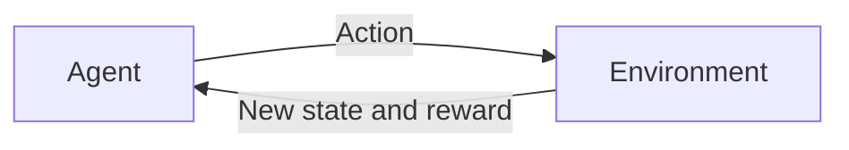

- **agent**：决策者；感知状态、维护策略并决定动作。
- **environment**：智能体以外的一切；依据动力学产生新状态和奖励。网格例中分别对应机器人和网格世界。
- **actuator**：执行智能体已经决定的动作。
- **interpreter**：把环境结果解释成智能体可使用的新状态和奖励。
- **closed loop**：智能体选动作，环境反馈新状态与奖励，智能体再据此做下一次决策，循环不断重复。

## 8. 本章概念之间的关系

| 概念 | 符号 | 由谁决定 | 输入 | 输出 | 网格世界例子 |
|---|---|---|---|---|---|
| 状态（state） | $s$ | 建模时定义，实际值由交互进程给出 | 当前环境情形 | 状态描述 | 机器人位于 $s_5$ |
| 动作（action） | $a$ | 智能体按策略选择 | 当前状态 | 控制选择 | 在 $s_5$ 选择 $a_3$ 向下 |
| 转移模型（transition model） | $p(s'\mid s,a)$ | 环境动力学 | $s,a$ | 下一状态分布 | $p(s_8\mid s_5,a_3)=1$ |
| 奖励模型（reward model） | $p(r\mid s,a)$ | 环境/任务奖励设计 | $s,a$ | 奖励分布 | $s_5$ 向右进入禁止格得 $-1$ |
| 策略（policy） | $\pi(a\mid s)$ | 智能体 | $s$ | 动作分布 | 在 $s_1$ 向右、向下各 $0.5$ |
| 轨迹（trajectory） | 状态—动作—奖励链 | 策略与环境共同产生 | 初始状态、策略、模型 | 一串 $s,a,r$ | $s_1\to s_2\to s_5\to s_8\to s_9$ |
| 回报（return） | $G$ 或 $G_t$ | 由轨迹奖励及 $\gamma$ 计算 | 奖励序列 | 一个累计标量 | $0+0+0+1=1$ |
| 回合（episode） | 常用整条轨迹表示 | 交互与终止规则共同确定 | 初始状态、策略、模型、终止条件 | 一次完整有限试验 | 从起点运行至终止状态 |
| MDP | $\mathcal S,\mathcal A,\mathcal R,p,\pi$ 等 | 建模框架整合环境与决策 | 集合、模型、策略、Markov 假设 | 完整决策过程描述 | 九状态、五动作的网格系统 |

### 三组容易混淆的关系

1. **策略 $\pi(a|s)$ 与状态转移 $p(s'|s,a)$**：前者是智能体在状态中怎样选动作，后者是环境收到动作后怎样产生下一状态。策略的条件中没有 $s'$；转移模型的条件中已经给定 $a$。
2. **即时奖励 $r$ 与回报 $G$**：$r$ 是一步反馈，$G$ 汇总当前与未来的奖励。某一步 $r=0$ 不表示该动作长期没有价值；某一步 $r>0$ 也不保证最终回报最大。
3. **episode 与 trajectory**：trajectory 泛指状态—动作—奖励序列，可有限也可无限；episode 是按任务定义从开始到终止的一次完整 trial，通常为有限轨迹。

## 9. 本章 Q&A

### 9.1 奖励是否可以全部为正数或全部为负数

可以。原书强调，决定鼓励或抑制作用的是奖励之间的**相对大小**，而不是绝对正负。本章原奖励为

$$
r_{\text{boundary}}=-1,\quad
r_{\text{forbidden}}=-1,\quad
r_{\text{target}}=+1,\quad
r_{\text{other}}=0.
$$

给所有奖励统一加上 $-2$，得到

$$
r_{\text{boundary}}=-3,\quad
r_{\text{forbidden}}=-3,\quad
r_{\text{target}}=-1,\quad
r_{\text{other}}=-2.
$$

虽然现在全部为负，目标奖励 $-1$ 仍相对最好，边界与禁止格的 $-3$ 仍相对最差。按本章给出的结论，这种共同平移不改变所得最优策略；原书将其概括为“optimal policies are invariant to affine transformations of rewards”，并把详细讨论留到 Chapter 3.5。本章不提前展开其证明。

### 9.2 奖励是否依赖下一状态

很多任务中，奖励看起来确实由下一状态决定，例如只有下一状态是目标格时才给正奖励。更细的模型可以写成

$$
p(r|s,a,s'),
$$

表示给定当前状态、动作和下一状态后的奖励分布。由于 $s'$ 本身由 $(s,a)$ 产生，可以把 $s'$ 边缘化，得到只以 $(s,a)$ 为条件的写法：

$$
p(r|s,a)
=
\sum_{s'\in\mathcal S}
p(r|s,a,s')p(s'|s,a).
$$

直观上，对每个可能的下一状态，先计算“到该状态的概率”乘以“在该状态分支上得到奖励 $r$ 的概率”，再把所有分支相加。于是 $p(r|s,a,s')$ 与 $p(r|s,a)$ 可以建立联系；原书采用后者以便在 Chapter 2 建立 Bellman Equation。

## 10. 一页式复习总结

> [!summary] Chapter 1 in one page
> **基本交互**：智能体在状态 $s_t$ 按策略 $\pi(a|s_t)$ 选择动作 $a_t$；环境按 $p(s_{t+1}|s_t,a_t)$ 产生新状态，并按 $p(r_{t+1}|s_t,a_t)$ 产生奖励；新状态和奖励返回智能体，形成闭环。
>
> **MDP 的组成**：状态空间 $\mathcal S$、动作空间 $\mathcal A(s)$、奖励集合 $\mathcal R(s,a)$；转移模型 $p(s'|s,a)$ 与奖励模型 $p(r|s,a)$；以及用于决策的策略 $\pi(a|s)$。本书主要研究有限、平稳 MDP。
>
> **三种概率别混淆**：$\pi(a|s)$ 对动作归一化，表示智能体选什么；$p(s'|s,a)$ 对下一状态归一化，表示环境把智能体带到哪里；$p(r|s,a)$ 对奖励值归一化，表示环境给什么反馈。
>
> **为什么看回报**：即时奖励只反映一步，无法区分“暂时无收益但通往目标”和“原地停留”。回报 $G$ 汇总整条轨迹，才能评价长期结果。
>
> **折扣率的作用**：$G_t=r_{t+1}+\gamma r_{t+2}+\gamma^2r_{t+3}+\cdots$。$\gamma$ 越小越重近期，越接近 1 越重远期；当 $0<\gamma<1$ 时，某些无限正奖励序列可收敛。
>
> **Markov 性质的准确含义**：给定当前状态和动作后，更早历史不会再为下一状态和奖励提供额外信息。关键在于当前状态必须包含足够信息，而不是简单宣称“未来与过去无关”。

## 11. 公式清单

### 11.1 状态空间

$$
\mathcal S=\{s_1,s_2,\ldots,s_9\}.
$$

- **符号**：$s_i$ 是第 $i$ 个状态，$\mathcal S$ 是所有状态的集合。
- **用途**：列出系统可能处于的全部状态。
- **网格例子**：九个格子分别对应 $s_1$ 至 $s_9$，包括禁止格与目标格。

### 11.2 动作空间

$$
\mathcal A=\{a_1,a_2,a_3,a_4,a_5\}.
$$

- **符号**：$a_1$ 至 $a_5$ 分别为上、右、下、左、不动。
- **用途**：列出全局可供策略选择的动作。
- **网格例子**：本书即使在边界状态也保留五个动作。

### 11.3 状态相关动作空间

$$
\mathcal A(s_1)=\{a_2,a_3,a_5\},
\qquad
\mathcal A(s_i)=\mathcal A.
$$

- **符号**：$\mathcal A(s)$ 是状态 $s$ 的可选动作集合。
- **用途**：区分“删去不可行动作”与“保留动作并由转移/奖励处理”的两种建模方式。
- **网格例子**：前式可排除 $s_1$ 的上、左；本书采用后式，对所有状态保留五动作。

### 11.4 状态转移箭头

$$
s_1\xrightarrow{a_2}s_2,
\qquad
s_1\xrightarrow{a_1}s_1.
$$

- **符号**：箭头上方是动作，左右分别为当前状态与下一状态。
- **用途**：直观记录一次确定性转移。
- **网格例子**：$s_1$ 向右到 $s_2$；向上撞边界后留在 $s_1$。

### 11.5 状态转移概率

$$
p(s'|s,a).
$$

- **符号**：$s$ 为当前状态，$a$ 为动作，$s'$ 为下一状态。
- **用途**：同时描述确定性与随机性环境。
- **网格例子**：$p(s_2|s_1,a_2)=1$；有随机风时可能有 $p(s_5|s_1,a_2)>0$。

### 11.6 下一状态概率归一化

$$
\sum_{s'\in\mathcal S}p(s'|s,a)=1.
$$

- **符号**：固定 $(s,a)$，对所有下一状态 $s'$ 求和。
- **用途**：保证 $p(\cdot|s,a)$ 是合法概率分布。
- **网格例子**：$s_1$ 向右时 $s_2$ 概率为 1，其余状态概率为 0。

### 11.7 策略概率

$$
\pi(a|s).
$$

- **符号**：$\pi$ 为策略；$a$ 是在状态 $s$ 下被选择的动作。
- **用途**：用统一形式表示确定性与随机策略。
- **网格例子**：随机策略在 $s_1$ 令 $\pi(a_2|s_1)=\pi(a_3|s_1)=0.5$。

### 11.8 策略归一化

$$
\sum_{a\in\mathcal A(s)}\pi(a|s)=1.
$$

- **符号**：固定状态 $s$，对其所有可选动作求和。
- **用途**：保证策略在每个状态给出合法动作分布。
- **网格例子**：$s_1$ 行的 $0+0.5+0.5+0+0=1$。

### 11.9 确定性奖励

$$
r=r(s,a),
$$

$$
r_{\text{boundary}}=-1,\quad
r_{\text{forbidden}}=-1,\quad
r_{\text{target}}=+1,\quad
r_{\text{other}}=0.
$$

- **符号**：$r$ 是执行状态—动作对后得到的即时奖励。
- **用途**：用标量反馈表达任务偏好。
- **网格例子**：在 $s_8$ 选 $a_2$ 到达目标，得到 $+1$。

### 11.10 奖励概率与归一化

$$
p(r|s,a),
\qquad
\sum_{r\in\mathcal R(s,a)}p(r|s,a)=1.
$$

- **符号**：$\mathcal R(s,a)$ 是该状态—动作对可能产生的奖励集合。
- **用途**：描述随机奖励，并保证奖励分布合法。
- **网格例子**：$p(r=-1|s_1,a_1)=1$，$p(r\neq-1|s_1,a_1)=0$。

### 11.11 有限轨迹回报

$$
G=\sum_{k=1}^{T}r_k.
$$

- **符号**：$r_k$ 是轨迹第 $k$ 步奖励，$T$ 是有限步数。
- **用途**：把一次有限轨迹的奖励累计成策略评价。
- **网格例子**：Policy 1 得 $G=0+0+0+1=1$；Policy 2 得 $G=0-1+0+1=0$。

### 11.12 折扣回报

$$
G_t=r_{t+1}+\gamma r_{t+2}+\gamma^2r_{t+3}+\cdots,
\qquad 0<\gamma<1.
$$

- **符号**：$G_t$ 是从时刻 $t$ 开始的回报，$\gamma$ 是折扣率。
- **用途**：处理无限轨迹并调节近期、远期奖励权重。
- **网格例子**：前三步奖励为 0、第四步起每步为 1 时，$G=\gamma^3+\gamma^4+\cdots$。

### 11.13 等比数列结果

$$
\gamma^3+\gamma^4+\gamma^5+\cdots
=
\gamma^3(1+\gamma+\gamma^2+\cdots)
=
\frac{\gamma^3}{1-\gamma}.
$$

- **符号**：首个非零折扣项为 $\gamma^3$。
- **用途**：把无限奖励序列化为有限闭式表达。
- **网格例子**：到达 $s_9$ 后不断执行 $a_5$ 并持续得到 $+1$。

### 11.14 吸收状态条件

$$
p(s_9|s_9,a_i)=1,
\qquad i=1,\ldots,5.
$$

- **符号**：对 $s_9$ 的每个动作，下一状态仍为 $s_9$。
- **用途**：把终止状态建模为不会离开的 absorbing state。
- **网格例子**：这是原书列出的第一种处理方式；本书实际采用把 $s_9$ 当普通状态的第二种方式。

### 11.15 状态的 Markov 性质

$$
p(s_{t+1}|s_t,a_t,s_{t-1},a_{t-1},\ldots,s_0,a_0)
=p(s_{t+1}|s_t,a_t).
$$

- **符号**：$t$ 是当前时刻，$t+1$ 是下一时刻。
- **用途**：说明给定当前状态、动作后，完整历史不再改进下一状态分布。
- **网格例子**：规则固定时，$s_1$ 向右的结果不依赖更早走过哪些格子。

### 11.16 奖励的 Markov 性质

$$
p(r_{t+1}|s_t,a_t,s_{t-1},a_{t-1},\ldots,s_0,a_0)
=p(r_{t+1}|s_t,a_t).
$$

- **符号**：$r_{t+1}$ 是执行 $a_t$ 后得到的奖励。
- **用途**：说明当前状态与动作已包含预测下一奖励所需的信息。
- **网格例子**：在 $s_5$ 向右进入禁止格的奖励不取决于早先路线。

### 11.17 奖励对下一状态的边缘化

$$
p(r|s,a)
=
\sum_{s'\in\mathcal S}p(r|s,a,s')p(s'|s,a).
$$

- **符号**：$p(r|s,a,s')$ 显式条件于下一状态，$p(s'|s,a)$ 是下一状态概率。
- **用途**：把依赖 $s'$ 的奖励模型转成只条件于 $(s,a)$ 的形式。
- **网格例子**：可按所有可能下一格加权汇总“到该格后获得奖励 $r$”的概率。

## 12. 术语表

| English | 中文 | 符号 | 简要定义 |
|---|---|---|---|
| agent | 智能体 | — | 感知状态、维护策略并执行动作的决策者 |
| environment | 环境 | — | 智能体以外、产生新状态与奖励的一切 |
| state | 状态 | $s$ | 对智能体当前情形的描述 |
| state space | 状态空间 | $\mathcal S$ | 所有可能状态的集合 |
| action | 动作 | $a$ | 智能体可尝试执行的决策 |
| action space | 动作空间 | $\mathcal A$、$\mathcal A(s)$ | 全部或某状态下可选动作的集合 |
| state transition | 状态转移 | $s\xrightarrow{a}s'$ | 执行动作后从当前状态到下一状态的过程 |
| transition probability | 状态转移概率 | $p(s'\mid s,a)$ | 给定状态、动作后到达下一状态的概率 |
| deterministic | 确定性的 | — | 给定条件后结果唯一 |
| stochastic | 随机性的 | — | 给定条件后仍可能出现多个结果 |
| policy | 策略 | $\pi(a\mid s)$ | 在各状态下选择动作的条件概率规则 |
| tabular representation | 表格表示 | — | 逐个状态—动作单元格枚举数值的表示 |
| reward | 奖励 | $r$、$r(s,a)$ | 动作后由环境给出的标量反馈 |
| reward probability | 奖励概率 | $p(r\mid s,a)$ | 给定状态、动作后得到某奖励的概率 |
| immediate reward | 即时奖励 | $r_{t+1}$ | 当前动作执行后立刻获得的奖励 |
| future rewards | 未来奖励 | — | 离开当前状态后继续获得的奖励 |
| trajectory | 轨迹 | — | 状态—动作—奖励链 |
| return | 回报 | $G$、$G_t$ | 轨迹奖励的累计结果 |
| total reward | 总奖励 | $G$ | return 的同类称呼 |
| cumulative reward | 累计奖励 | $G$ | return 的同类称呼 |
| discounted return | 折扣回报 | $G_t$ | 对越远奖励乘越高次 $\gamma$ 的累计奖励 |
| discount rate | 折扣率 | $\gamma$ | 控制近期与远期奖励相对权重的参数 |
| episode | 回合 | — | 从开始到终止的一次完整有限轨迹 |
| trial | 试验 | — | episode 的同义称呼 |
| terminal state | 终止状态 | — | 按任务定义结束一回合的状态 |
| episodic task | 回合式任务 | — | 交互由有限回合构成的任务 |
| continuing task | 持续式任务 | — | 没有终止状态、交互持续进行的任务 |
| absorbing state | 吸收状态 | — | 一旦进入便永远不会离开的状态 |
| Markov decision process | 马尔可夫决策过程 | MDP | 用集合、模型、策略与 Markov 性质描述的决策系统 |
| Markov property | 马尔可夫性质 | — | 给定当前状态、动作后，历史不再提供额外预测信息 |
| model / dynamics | 模型 / 动力学 | $p(s'\mid s,a)$、$p(r\mid s,a)$ | 环境的状态转移与奖励规律 |
| stationary model | 平稳模型 | — | 模型不随时间改变 |
| nonstationary model | 非平稳模型 | — | 模型可能随时间改变 |
| Markov process | 马尔可夫过程 | MP | 固定 MDP 策略后得到的 Markov 随机过程 |
| Markov chain | 马尔可夫链 | — | 离散时间、有限或可数状态的 Markov process |
| actuator | 执行器 | — | 执行智能体已决定动作的部分 |
| interpreter | 解释器 | — | 把环境结果解释为新状态和奖励的部分 |
| closed loop | 闭环 | — | 动作、环境反馈与再次决策不断循环的交互结构 |

## 13. 自测题

### 13.1 概念判断题（10 题）

1. 状态空间 $\mathcal S$ 是一次实际轨迹经过的状态序列。
2. 本书在网格例子中允许禁止格被进入，但进入会受到惩罚。
3. $\pi(a_2|s_1)=1$ 直接意味着任何环境中下一状态必为 $s_2$。
4. 对固定 $(s,a)$，所有 $p(s'|s,a)$ 之和必须为 1。
5. 状态转移随机性和策略随机性表示同一件事。
6. 两个动作得到相同下一状态时，它们的即时奖励必然相同。
7. 回报可能由一个即时奖励和多个未来奖励组成。
8. $\gamma$ 越接近 0，策略越强调远期奖励。
9. 每个 episode 都是一条 trajectory，但并非每条 trajectory 都一定是完整 episode。
10. Markov 性质意味着在给定当前状态和动作后，更早历史不会为下一状态和奖励提供额外信息。

### 13.2 选择题（10 题）

1. 在本书采用的全局动作空间建模中，$\mathcal A(s_1)$ 是：
   - A. $\{a_2,a_3,a_5\}$
   - B. $\{a_1,a_2,a_3,a_4,a_5\}$
   - C. $\{s_1,s_2,s_4\}$
   - D. 只含 $a_2$
2. 在 $s_1$ 执行 $a_1$ 后：
   - A. 到 $s_2$，奖励 0
   - B. 留在 $s_1$，奖励 $-1$
   - C. 离开状态空间
   - D. 到 $s_4$，奖励 0
3. 下列哪个量由智能体的动作选择规则决定？
   - A. $p(s'|s,a)$
   - B. $p(r|s,a)$
   - C. $\pi(a|s)$
   - D. $\mathcal S$ 中当前所处格子的颜色
4. Figure 1.5 中 $s_1$ 的动作分布是：
   - A. 向右概率 1
   - B. 向下概率 1
   - C. 向右、向下各 0.5
   - D. 五个动作各 0.2
5. 在 $s_9$ 执行 $a_2$ 的下一状态与奖励为：
   - A. $s_9,+1$
   - B. $s_9,-1$
   - C. $s_8,0$
   - D. $s_6,-1$
6. Policy 2 穿过 $s_7$ 后到达目标，其未折扣回报是：
   - A. $-1$
   - B. $0$
   - C. $1$
   - D. $2$
7. 若 $\gamma$ 接近 1，原书描述的行为倾向是：
   - A. 更强调远期奖励
   - B. 完全忽略未来
   - C. 不再需要策略
   - D. 状态转移变成确定性
8. 本书对目标状态 $s_9$ 的主要处理方式是：
   - A. 强制删除全部动作
   - B. 仅允许 $a_5$
   - C. 作为普通状态，保留五个动作
   - D. 从状态空间删除
9. 固定 MDP 的策略后，系统可退化为：
   - A. 监督学习分类器
   - B. Markov process
   - C. 动作空间
   - D. 奖励表
10. 下列哪一项最准确描述 Markov 性质？
   - A. 过去绝对不会影响未来
   - B. 未来只由动作决定
   - C. 给定当前状态和动作后，历史不再提供额外的下一状态与奖励信息
   - D. 每个状态只能有一个后继状态

### 13.3 简答题（5 题）

1. 为什么“动作可以选择”不等于“动作一定产生预期移动”？
2. 用一句条件概率语言分别解释策略与状态转移，并说明由谁决定。
3. 为什么只按即时奖励最大化可能得到短视策略？请结合网格世界说明。
4. episode、trajectory、terminal state 三者是什么关系？
5. 为什么 $p(s'|s,a)$ 与 $p(r|s,a)$ 共同构成环境模型，而 $\pi(a|s)$ 不属于环境模型？

### 13.4 计算或推导题（3 题）

1. 使用 Table 1.1 与 Table 1.3，从 $s_3$ 开始依次执行 $a_4,a_3,a_3,a_2$。写出完整状态序列、每步奖励和未折扣回报。
2. 对原书“前三步奖励为 0、从第四步起每步为 1”的无限轨迹，取 $\gamma=0.5$，计算折扣回报。
3. 在 $s_1$ 使用 Figure 1.5 的策略：向右、向下各以 0.5 概率选择；环境转移按 Table 1.1 确定。求下一状态为 $s_2$ 与 $s_4$ 的概率，并说明其余状态概率。

> [!answer]- 点击查看答案
>
> #### 判断题答案
>
> 1. **错**。$\mathcal S$ 枚举所有可能状态；轨迹只是一次交互实际访问的序列。
> 2. **对**。$s_6,s_7$ 可进入，进入奖励为 $-1$。
> 3. **错**。它只说明策略必选 $a_2$；下一状态还由 $p(s'|s_1,a_2)$ 决定。
> 4. **对**。这是下一状态条件分布的归一化条件。
> 5. **错**。前者来自环境响应，后者来自智能体选动作。
> 6. **错**。在 $s_9$ 执行 $a_5$ 与 $a_2$ 都留在 $s_9$，奖励分别为 $+1$ 与 $-1$。
> 7. **对**。回报累计当前一步与后续奖励。
> 8. **错**。接近 0 更强调近期奖励；接近 1 更强调远期奖励。
> 9. **对**。episode 是按终止规则完成的一次 trial；trajectory 可不是完整回合，也可无限长。
> 10. **对**。这是比“未来与过去无关”更准确的条件性表述。
>
> #### 选择题答案
>
> 1. **B**。本书采用所有状态共享五个动作的全局空间。
> 2. **B**。向上撞边界，自转移到 $s_1$ 并得 $r_{\text{boundary}}=-1$。
> 3. **C**。$\pi(a|s)$ 是智能体的策略。
> 4. **C**。两动作概率各为 0.5。
> 5. **B**。向右撞边界，仍在 $s_9$，但得到 $-1$。
> 6. **B**。$0-1+0+1=0$。
> 7. **A**。$\gamma$ 接近 1 时远期权重衰减较慢。
> 8. **C**。本书将 $s_9$ 当普通状态，$\mathcal A(s_9)=\{a_1,\ldots,a_5\}$。
> 9. **B**。固定策略后 MDP 退化为 MP。
> 10. **C**。Markov 性质是给定当前状态、动作后的条件独立陈述。
>
> #### 简答题参考答案
>
> 1. 动作表达智能体意图；环境的 $p(s'|s,a)$ 决定实际结果。撞边界会原地不动，随机风还可能使实际方向偏离意图。
> 2. $\pi(a|s)$ 是给定状态时选择动作的概率，由智能体策略决定；$p(s'|s,a)$ 是给定状态和动作时产生下一状态的概率，由环境动力学决定。
> 3. 即时奖励只评价当前一步，忽略未来。例如在 $s_4$ 一直选即时奖励为 0 的 $a_5$ 会停滞；选择同样即时奖励为 0 的 $a_2$ 却可继续到目标获得 $+1$。必须比较累计回报。
> 4. trajectory 是状态—动作—奖励序列；terminal state 按任务规则结束交互；从开始到终止形成的一次完整、通常有限的 trajectory 就是 episode。
> 5. 两个 $p$ 都描述环境收到状态—动作后如何响应：产生下一状态和奖励；$\pi$ 描述智能体如何选动作，因此属于决策规则而非环境动力学。
>
> #### 计算或推导题答案
>
> 1. 由 $s_3$ 开始：
>
>    $$
>    s_3\xrightarrow[a_4]{r=0}s_2
>    \xrightarrow[a_3]{r=0}s_5
>    \xrightarrow[a_3]{r=0}s_8
>    \xrightarrow[a_2]{r=1}s_9.
>    $$
>
>    未折扣回报为 $G=0+0+0+1=1$。
>
> 2. 使用闭式：
>
>    $$
>    G=\frac{\gamma^3}{1-\gamma}
>    =\frac{0.5^3}{1-0.5}
>    =\frac{0.125}{0.5}
>    =0.25.
>    $$
>
> 3. 策略先以 0.5 选 $a_2$，确定到 $s_2$；以 0.5 选 $a_3$，确定到 $s_4$。因此
>
>    $$
>    P(s'=s_2|s_1)=0.5,
>    \qquad
>    P(s'=s_4|s_1)=0.5,
>    $$
>
>    其余状态概率均为 0，全部下一状态概率之和为 1。
