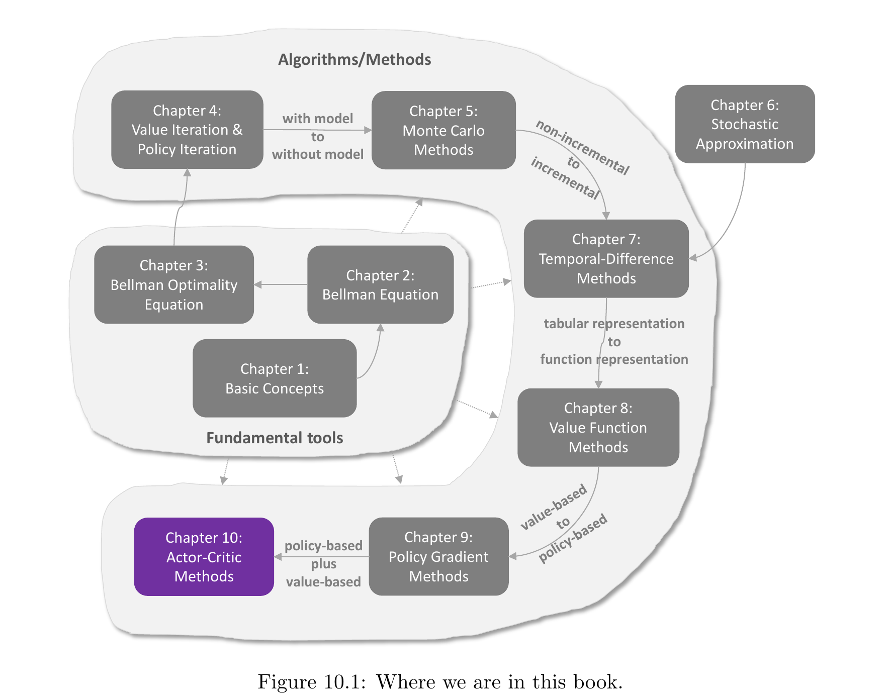
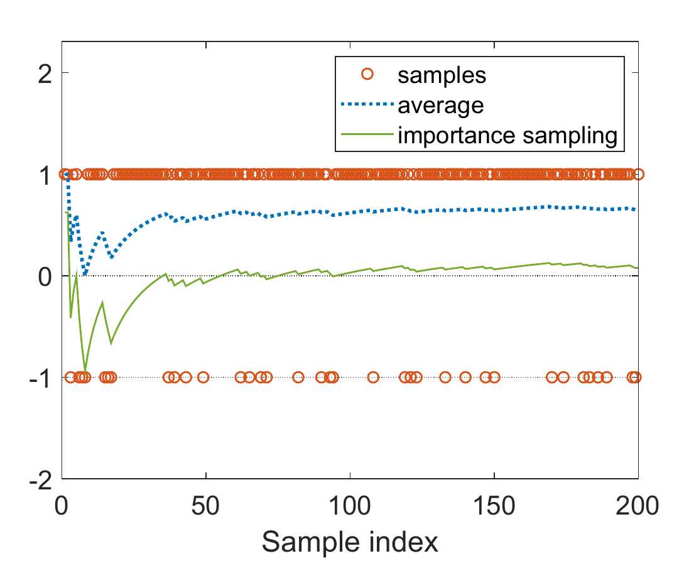

# Chapter 10 - Actor-Critic Methods

> [!abstract] 本章导读
> Chapter 9 已经把策略优化写成梯度上升，但 REINFORCE 使用完整回合的 Monte Carlo 回报估计动作价值。本章把 TD 学习加入策略梯度，形成同时更新策略与价值的 Actor-Critic 结构：**actor** 按价值反馈更新策略，**critic** 用 TD 误差学习价值并评价 actor。教材从最简单的 Q actor-critic（QAC）出发，引入不改变期望梯度却能降低方差的基线，得到 advantage actor-critic（A2C）；随后用重要性采样把算法扩展到异策略数据；最后以确定性策略梯度说明，actor 也可以直接输出连续动作。整章的核心是把 Chapter 8 的 value-based 学习与 Chapter 9 的 policy-based 优化组合起来。

## 0. 本章知识结构



**图解：**

- Chapter 8 提供价值函数近似与 TD 更新，构成 critic 的技术基础；
- Chapter 9 提供策略参数化、Policy Gradient Theorem 与 REINFORCE，构成 actor 的技术基础；
- Chapter 10 把策略更新和价值更新放进同一个在线学习循环；
- 图中 “policy-based plus value-based” 正是 Actor-Critic 名称的结构含义。

本章算法演进可以概括为：


四个贯穿全章的问题是：

1. **actor 用什么信号更新？** 动作价值、优势或动作价值对动作的梯度。
2. **critic 学什么？** $q_\pi$、$v_\pi$ 或 $q_\mu$。
3. **样本由谁产生？** 当前目标策略，或另一个行为策略。
4. **怎样控制估计误差？** 用基线降低方差，用重要性权重修正分布差异。

> [!important] 一句话总览
> Actor-Critic 仍然是策略梯度方法；“Actor-Critic”强调的是其实现结构：actor 直接改进策略，critic 用 TD 学习价值并为策略更新提供评价信号。

## 1. 从 Policy Gradient 到 Q Actor-Critic

### 1.1 Actor 与 Critic 分别做什么？

Actor-Critic（演员-评论家）包含两个相互配合的部分：

- **Actor**：策略更新步骤。动作按照策略产生，因而策略是“行动者”；
- **Critic**：价值更新步骤。价值估计评价当前策略及其动作选择，因而是“评论者”。

两者的关系不是两个独立算法的简单拼接，而是一个反馈回路：

$$
\text{策略产生动作}
\longrightarrow
\text{环境给出转移与奖励}
\longrightarrow
\text{critic 计算评价信号}
\longrightarrow
\text{actor 更新策略}.
$$

### 1.2 策略梯度的期望形式

回顾 Chapter 9，最大化标量指标 $J(\theta)$ 的梯度上升为：

$$
\begin{aligned}
\theta_{t+1}
&=\theta_t+\alpha\nabla_\theta J(\theta_t)\\
&=\theta_t+\alpha\,
\mathbb E_{S\sim\eta,\,A\sim\pi}
\left[
\nabla_\theta\ln\pi(A\mid S,\theta_t)q_\pi(S,A)
\right].
\end{aligned}
$$

其中：

- $\theta_t$：时刻 $t$ 的策略参数；
- $\alpha>0$：actor 的学习率；
- $\eta$：Policy Gradient Theorem 中的状态权重分布；
- $A\sim\pi$：动作由目标策略采样；
- $q_\pi(S,A)$：在策略 $\pi$ 下执行动作 $A$ 的长期价值。

由于真实期望未知，用时刻 $t$ 的单个样本近似后得到：

$$
\theta_{t+1}
=\theta_t
+\alpha\nabla_\theta\ln\pi(a_t\mid s_t,\theta_t)
q_t(s_t,a_t).
\tag{10.2}
$$

该式已经暴露了 Actor-Critic 的结构：

- $\nabla_\theta\ln\pi$ 直接修改策略，是 actor；
- $q_t(s_t,a_t)$ 必须由另一个学习过程估计，是 critic。

### 1.3 REINFORCE 与 Actor-Critic 的分界

教材按照动作价值的估计方式区分两类算法：

| 方法 | $q_t(s_t,a_t)$ 的来源 | 更新时机 | 教材名称 |
|---|---|---|---|
| Monte Carlo | 完整回合回报 | 通常要等待回合结束 | REINFORCE / Monte Carlo policy gradient |
| Temporal-Difference | 一步奖励与自举价值 | 每个转移后即可更新 | Actor-Critic |

因此，Actor-Critic 可以理解为：

$$
\text{Policy Gradient}
+
\text{TD-based Value Estimation}.
$$

### 1.4 Algorithm 10.1：Q Actor-Critic（QAC）

QAC 是教材给出的最简单 Actor-Critic。Critic 用参数化动作价值函数 $q(s,a,w)$，并按 Sarsa 目标更新；Actor 使用 critic 当前给出的动作价值更新策略。

#### 目标

学习最大化 $J(\theta)$ 的随机策略 $\pi(a\mid s,\theta)$。

#### 初始化

- 策略函数 $\pi(a\mid s,\theta_0)$；
- 动作价值函数 $q(s,a,w_0)$；
- 学习率 $\alpha_\theta>0$、$\alpha_w>0$。

#### 每一步的交互与更新

1. 按 $\pi(a\mid s_t,\theta_t)$ 生成 $a_t$；
2. 执行动作，观察 $r_{t+1},s_{t+1}$；
3. 按当前策略在 $s_{t+1}$ 生成 $a_{t+1}$；
4. Actor 使用 $q(s_t,a_t,w_t)$ 更新策略；
5. Critic 使用 Sarsa TD 误差更新 $w$。

Actor 更新为：

$$
\theta_{t+1}
=\theta_t
+\alpha_\theta
\nabla_\theta\ln\pi(a_t\mid s_t,\theta_t)
q(s_t,a_t,w_t).
$$

Critic 的 TD 误差为：

$$
\delta_t^q
=r_{t+1}
+\gamma q(s_{t+1},a_{t+1},w_t)
-q(s_t,a_t,w_t).
$$

Critic 更新为：

$$
w_{t+1}
=w_t
+\alpha_w\delta_t^q
\nabla_w q(s_t,a_t,w_t).
$$

伪代码如下：

```text
初始化策略参数 θ0、动作价值参数 w0
对每个回合：
    在状态 st 按 π(· | st, θt) 采样 at
    执行 at，观察 rt+1 和 st+1
    在 st+1 按 π(· | st+1, θt) 采样 at+1

    Actor:
        θt+1 <- θt + αθ grad_θ ln π(at | st, θt) q(st, at, wt)

    Critic:
        δt^q <- rt+1 + γq(st+1, at+1, wt) - q(st, at, wt)
        wt+1 <- wt + αw δt^q grad_w q(st, at, wt)
```

> [!tip] QAC 的核心
> QAC 并没有改变策略梯度更新的形状，只是把原本由 Monte Carlo 完整回报提供的 $q_t$，换成由 Sarsa critic 在线学习的 $q(s,a,w)$。

## 2. Advantage Actor-Critic（A2C）

QAC 直接用动作价值的绝对大小更新策略。本节引入基线（baseline），把评价信号改成动作相对于该状态平均水平的优势，从而降低随机梯度的估计方差。

### 2.1 Baseline invariance：加入基线不改变期望梯度

对任意只依赖状态的标量函数 $b(S)$，策略梯度满足：

$$
\begin{aligned}
&\mathbb E_{S\sim\eta,\,A\sim\pi}
\left[
\nabla_\theta\ln\pi(A\mid S,\theta_t)q_\pi(S,A)
\right]\\
&=\mathbb E_{S\sim\eta,\,A\sim\pi}
\left[
\nabla_\theta\ln\pi(A\mid S,\theta_t)
\bigl(q_\pi(S,A)-b(S)\bigr)
\right].
\end{aligned}
\tag{10.3}
$$

关键原因是基线项的期望为零：

$$
\mathbb E
\left[
\nabla_\theta\ln\pi(A\mid S,\theta_t)b(S)
\right]=0.
$$

### 2.2 为什么基线项的期望为零？

固定状态 $s$ 后，$b(s)$ 与动作 $a$ 无关，因此：

$$
\begin{aligned}
&\mathbb E_{S\sim\eta,\,A\sim\pi}
\left[
\nabla_\theta\ln\pi(A\mid S,\theta_t)b(S)
\right]\\
&=\sum_{s\in\mathcal S}\eta(s)
\sum_{a\in\mathcal A}
\pi(a\mid s,\theta_t)
\nabla_\theta\ln\pi(a\mid s,\theta_t)b(s)\\
&=\sum_s\eta(s)b(s)
\sum_a\nabla_\theta\pi(a\mid s,\theta_t)\\
&=\sum_s\eta(s)b(s)
\nabla_\theta\sum_a\pi(a\mid s,\theta_t)\\
&=\sum_s\eta(s)b(s)\nabla_\theta 1\\
&=0.
\end{aligned}
$$

推导用到了 log-derivative 恒等式：

$$
\pi(a\mid s,\theta)\nabla_\theta\ln\pi(a\mid s,\theta)
=\nabla_\theta\pi(a\mid s,\theta).
$$

> [!warning] 基线必须只依赖状态
> 上述抵消依赖于 $b(s)$ 能被移出动作求和。若直接令基线依赖所采样的动作，就不能由这段证明保证期望梯度保持不变。

### 2.3 为什么基线有用？

定义单样本随机梯度向量：

$$
X(S,A)
\doteq
\nabla_\theta\ln\pi(A\mid S,\theta_t)
\bigl[q_\pi(S,A)-b(S)\bigr].
\tag{10.4}
$$

无论选择什么合法基线，$\mathbb E[X]$ 不变；但 $\operatorname{var}(X)$ 会改变。用单个样本 $x$ 近似 $\mathbb E[X]$ 时：

- 方差越小，单样本越可能接近期望梯度；
- 方差越大，不同样本给出的更新方向和幅度越不稳定；
- REINFORCE 与 QAC 相当于选择 $b=0$，这并不保证方差较小。

### 2.4 Box 10.1：最优基线的推导

令 $\bar x\doteq\mathbb E[X]$。若 $X$ 是向量，教材以协方差矩阵迹作为标量方差目标：

$$
\begin{aligned}
\operatorname{tr}[\operatorname{var}(X)]
&=\operatorname{tr}\mathbb E[(X-\bar x)(X-\bar x)^T]\\
&=\mathbb E[X^TX]-\bar x^T\bar x.
\end{aligned}
\tag{10.6}
$$

这里使用了迹的循环性质 $\operatorname{tr}(AB)=\operatorname{tr}(BA)$。因为 $\bar x$ 对基线不变，只需最小化：

$$
\mathbb E[X^TX]
=\mathbb E
\left[
\lVert\nabla_\theta\ln\pi\rVert^2
\bigl(q_\pi(S,A)-b(S)\bigr)^2
\right].
$$

将状态期望展开：

$$
\mathbb E[X^TX]
=\sum_{s\in\mathcal S}\eta(s)
\mathbb E_{A\sim\pi}
\left[
\lVert\nabla_\theta\ln\pi\rVert^2
\bigl(q_\pi(s,A)-b(s)\bigr)^2
\right].
$$

令其关于每个 $b(s)$ 的导数为零，得到：

$$
\mathbb E_{A\sim\pi}
\left[
\lVert\nabla_\theta\ln\pi(A\mid s,\theta_t)\rVert^2
\bigl(b(s)-q_\pi(s,A)\bigr)
\right]=0.
$$

解得最优基线：

$$
b^*(s)
=
\frac{
\mathbb E_{A\sim\pi}
\left[
\lVert\nabla_\theta\ln\pi(A\mid s,\theta_t)\rVert^2q_\pi(s,A)
\right]
}{
\mathbb E_{A\sim\pi}
\left[
\lVert\nabla_\theta\ln\pi(A\mid s,\theta_t)\rVert^2
\right]
}.
\tag{10.5}
$$

该基线在方差意义下最优，但表达式较复杂。去掉梯度范数权重可得简洁的次优基线：

$$
\begin{aligned}
b^\dagger(s)
&=\mathbb E_{A\sim\pi}[q_\pi(s,A)]\\
&=v_\pi(s).
\end{aligned}
$$

因此，**状态价值正好可以作为动作价值的基线**。

### 2.5 Advantage function

取 $b(s)=v_\pi(s)$ 后，策略梯度写成：

$$
\theta_{t+1}
=\theta_t
+\alpha\mathbb E
\left[
\nabla_\theta\ln\pi(A\mid S,\theta_t)
\bigl(q_\pi(S,A)-v_\pi(S)\bigr)
\right].
$$

定义优势函数（advantage function）：

$$
\delta_\pi(S,A)
\doteq q_\pi(S,A)-v_\pi(S).
$$

由于：

$$
v_\pi(s)
=\sum_{a\in\mathcal A}\pi(a\mid s)q_\pi(s,a),
$$

$v_\pi(s)$ 是该状态下动作价值的策略加权平均。因此：

- $\delta_\pi(s,a)>0$：动作 $a$ 优于当前策略在 $s$ 的平均水平；
- $\delta_\pi(s,a)<0$：动作 $a$ 劣于平均水平；
- $\delta_\pi(s,a)=0$：该动作与平均水平相同。

单样本更新为：

$$
\begin{aligned}
\theta_{t+1}
&=\theta_t
+\alpha\nabla_\theta\ln\pi(a_t\mid s_t,\theta_t)
\bigl[q_t(s_t,a_t)-v_t(s_t)\bigr]\\
&=\theta_t
+\alpha\nabla_\theta\ln\pi(a_t\mid s_t,\theta_t)
\delta_t(s_t,a_t).
\end{aligned}
\tag{10.8}
$$

### 2.6 用 TD error 近似优势

教材利用动作价值定义得到：

$$
\begin{aligned}
q_\pi(s_t,a_t)-v_\pi(s_t)
=\mathbb E\bigl[
R_{t+1}+\gamma v_\pi(S_{t+1})-v_\pi(S_t)
\mid S_t=s_t,A_t=a_t
\bigr].
\end{aligned}
$$

因此可以用单个转移的 TD 误差近似优势：

$$
q_t(s_t,a_t)-v_t(s_t)
\approx
r_{t+1}+\gamma v(s_{t+1},w_t)-v(s_t,w_t)
\doteq\delta_t.
$$

这一替代有两个作用：

1. 无需等待完整回合；
2. 只需维护一个状态价值函数 $v(s,w)$，不用同时维护 $q(s,a,w)$ 与 $v(s,w)$ 两个网络。

### 2.7 Algorithm 10.2：A2C / TD Actor-Critic

#### 初始化

- 随机策略 $\pi(a\mid s,\theta_0)$；
- 状态价值函数 $v(s,w_0)$；
- 学习率 $\alpha_\theta>0$、$\alpha_w>0$。

#### 一步更新

先按当前策略生成 $a_t$，观察 $r_{t+1},s_{t+1}$。TD 误差为：

$$
\delta_t
=r_{t+1}+\gamma v(s_{t+1},w_t)-v(s_t,w_t).
$$

Actor 更新：

$$
\theta_{t+1}
=\theta_t
+\alpha_\theta\delta_t
\nabla_\theta\ln\pi(a_t\mid s_t,\theta_t).
$$

Critic 更新：

$$
w_{t+1}
=w_t
+\alpha_w\delta_t\nabla_wv(s_t,w_t).
$$

伪代码如下：

```text
初始化策略参数 θ0、状态价值参数 w0
对每个时间步 t：
    按 π(· | st, θt) 采样 at
    执行 at，观察 rt+1 和 st+1

    δt <- rt+1 + γv(st+1, wt) - v(st, wt)

    Actor:
        θt+1 <- θt + αθ δt grad_θ ln π(at | st, θt)

    Critic:
        wt+1 <- wt + αw δt grad_w v(st, wt)
```

策略 $\pi(\theta_t)$ 本身是随机且具有探索性的，因此教材指出 A2C 不需要另加 $\epsilon$-greedy。教材还提到异步版本 A3C，但不在本章展开。

### 2.8 QAC、REINFORCE with baseline 与 A2C

| 方法 | 策略评价信号 | 价值估计 | 需要的价值函数 |
|---|---|---|---|
| QAC | $q_t(s_t,a_t)$ | TD | $q(s,a,w)$ |
| REINFORCE with baseline | $q_t(s_t,a_t)-v_t(s_t)$ | Monte Carlo | 回报估计与基线 |
| A2C | TD error $\delta_t$ | TD | $v(s,w)$ |

## 3. Off-policy Actor-Critic

### 3.1 为什么前面的算法是 on-policy？

QAC 与 A2C 的真实梯度都要求：

$$
\nabla_\theta J(\theta)
=\mathbb E_{S\sim\eta,\,A\sim\pi}
\left[
\nabla_\theta\ln\pi(A\mid S,\theta)
\bigl(q_\pi(S,A)-v_\pi(S)\bigr)
\right].
$$

用样本近似该期望时，动作必须由 $\pi$ 采样。此时：

- 产生数据的是 $\pi$；
- 被评价、被改进的也是 $\pi$；
- 行为策略与目标策略相同，所以是 on-policy。

如果已有数据来自另一个行为策略 $\beta$，就需要把 $A\sim\beta$ 下的样本校正为目标策略 $\pi$ 下的期望。教材使用重要性采样（importance sampling）完成这一点。

### 3.2 Importance sampling 的一般形式

设目标分布为 $p_0$，但样本来自 $p_1$。目标是估计：

$$
\mathbb E_{X\sim p_0}[X].
$$

插入 $p_1(x)/p_1(x)$：

$$
\begin{aligned}
\mathbb E_{X\sim p_0}[X]
&=\sum_{x\in\mathcal X}p_0(x)x\\
&=\sum_{x\in\mathcal X}p_1(x)
\frac{p_0(x)}{p_1(x)}x\\
&=\mathbb E_{X\sim p_1}
\left[
\frac{p_0(X)}{p_1(X)}X
\right].
\end{aligned}
\tag{10.9}
$$

定义：

$$
f(x)=\frac{p_0(x)}{p_1(x)}x.
$$

若 $x_1,\ldots,x_n$ 来自 $p_1$，则：

$$
\mathbb E_{X\sim p_0}[X]
\approx
\frac{1}{n}\sum_{i=1}^n
\frac{p_0(x_i)}{p_1(x_i)}x_i.
\tag{10.10}
$$

比值：

$$
\frac{p_0(x_i)}{p_1(x_i)}
$$

称为重要性权重（importance weight）。其直观含义是：

- 若 $p_0(x_i)>p_1(x_i)$，该样本在目标分布中更常见，应被放大；
- 若 $p_0(x_i)<p_1(x_i)$，该样本在行为分布中出现得过多，应被缩小；
- 若 $p_0=p_1$，权重恒为 $1$，退化为普通样本均值。

教材强调，公式只要求计算已采样点处的 $p_0(x_i)$ 和 $p_1(x_i)$，不要求枚举整个巨大样本空间。

### 3.3 教材示例：从偏置样本恢复目标期望

令：

$$
\mathcal X=\{+1,-1\}.
$$

目标分布为：

$$
p_0(X=+1)=0.5,
\qquad
p_0(X=-1)=0.5,
$$

所以：

$$
\mathbb E_{X\sim p_0}[X]
=(+1)\times0.5+(-1)\times0.5=0.
$$

行为分布为：

$$
p_1(X=+1)=0.8,
\qquad
p_1(X=-1)=0.2,
$$

所以：

$$
\mathbb E_{X\sim p_1}[X]
=(+1)\times0.8+(-1)\times0.2=0.6.
$$



**图解：**

- 橙色圆点是由 $p_1$ 产生的 $+1$ 与 $-1$ 样本；由于 $p_1(+1)=0.8$，正样本明显更多；
- 蓝色虚线是普通样本平均，随样本增加趋近 $\mathbb E_{p_1}[X]=0.6$；
- 绿色实线是带重要性权重的平均，逐渐趋近目标值 $\mathbb E_{p_0}[X]=0$；
- 该图展示了权重如何用来自 $p_1$ 的数据估计 $p_0$ 下的期望。

### 3.4 支持集覆盖条件

重要性采样要求：

$$
p_0(x)\neq0
\quad\Longrightarrow\quad
p_1(x)\neq0.
$$

也就是说，行为分布必须覆盖目标分布可能取到的所有样本。若 $p_1(+1)=1$、$p_1(-1)=0$，则样本永远只有 $+1$。此时：

$$
\frac{1}{n}\sum_{i=1}^n
\frac{p_0(x_i)}{p_1(x_i)}x_i
=\frac{1}{n}\sum_{i=1}^n\frac{0.5}{1}(+1)
=0.5,
$$

无论样本数多大都无法恢复目标期望 $0$。

> [!warning] 覆盖条件不是“样本足够多”可以补救的
> 若行为策略对目标策略可能选择的某个动作给出零概率，那么这个动作永远不会进入数据集，重要性权重也无法凭空恢复缺失信息。

### 3.5 Theorem 10.1：Off-policy Policy Gradient Theorem

设 $\beta$ 是行为策略，$\pi(a\mid s,\theta)$ 是要学习的目标策略。教材选择指标：

$$
J(\theta)
=\sum_{s\in\mathcal S}d_\beta(s)v_\pi(s)
=\mathbb E_{S\sim d_\beta}[v_\pi(S)],
$$

其中 $d_\beta$ 是行为策略 $\beta$ 的稳态状态分布。

> [!theorem] Theorem 10.1 — Off-policy Policy Gradient Theorem
> 在折扣情形 $\gamma\in(0,1)$ 下，
>
> $$
> \nabla_\theta J(\theta)
> =\mathbb E_{S\sim\rho,\,A\sim\beta}
> \left[
> \frac{\pi(A\mid S,\theta)}{\beta(A\mid S)}
> \nabla_\theta\ln\pi(A\mid S,\theta)
> q_\pi(S,A)
> \right].
> \tag{10.11}
> $$
>
> 状态权重为：
>
> $$
> \rho(s)
> \doteq
> \sum_{s'\in\mathcal S}
> d_\beta(s')\Pr_\pi(s\mid s').
> $$

折扣总转移权重定义为：

$$
\begin{aligned}
\Pr_\pi(s\mid s')
&=\sum_{k=0}^{\infty}\gamma^k[P_\pi^k]_{s's}\\
&=\bigl[(I-\gamma P_\pi)^{-1}\bigr]_{s's}.
\end{aligned}
$$

与 on-policy 梯度相比有两个显式变化：

1. 动作从 $A\sim\pi$ 改为 $A\sim\beta$；
2. 梯度中加入动作重要性权重 $\pi(A\mid S,\theta)/\beta(A\mid S)$。

### 3.6 Box 10.2：Theorem 10.1 的证明

由于 $d_\beta$ 与目标策略参数 $\theta$ 无关：

$$
\nabla_\theta J(\theta)
=\sum_{s\in\mathcal S}d_\beta(s)\nabla_\theta v_\pi(s).
\tag{10.12}
$$

利用 Chapter 9 的 Lemma 9.2：

$$
\nabla_\theta v_\pi(s)
=\sum_{s'\in\mathcal S}\Pr_\pi(s'\mid s)
\sum_{a\in\mathcal A}
\nabla_\theta\pi(a\mid s',\theta)q_\pi(s',a).
\tag{10.13}
$$

代入并交换求和顺序：

$$
\begin{aligned}
\nabla_\theta J(\theta)
&=\sum_s d_\beta(s)
\sum_{s'}\Pr_\pi(s'\mid s)
\sum_a\nabla_\theta\pi(a\mid s',\theta)q_\pi(s',a)\\
&=\sum_{s'}
\left[
\sum_s d_\beta(s)\Pr_\pi(s'\mid s)
\right]
\sum_a\nabla_\theta\pi(a\mid s',\theta)q_\pi(s',a)\\
&=\sum_s\rho(s)
\sum_a\nabla_\theta\pi(a\mid s,\theta)q_\pi(s,a).
\end{aligned}
$$

在动作求和中插入 $\beta(a\mid s)/\beta(a\mid s)$，并使用 $\nabla\pi=\pi\nabla\ln\pi$：

$$
\begin{aligned}
\nabla_\theta J(\theta)
&=\sum_s\rho(s)
\sum_a\beta(a\mid s)
\frac{\pi(a\mid s,\theta)}{\beta(a\mid s)}
\nabla_\theta\ln\pi(a\mid s,\theta)q_\pi(s,a)\\
&=\mathbb E_{S\sim\rho,\,A\sim\beta}
\left[
\frac{\pi(A\mid S,\theta)}{\beta(A\mid S)}
\nabla_\theta\ln\pi(A\mid S,\theta)q_\pi(S,A)
\right].
\end{aligned}
$$

### 3.7 加入基线与 TD error

异策略梯度同样对任意状态基线 $b(S)$ 不变：

$$
\nabla_\theta J(\theta)
=\mathbb E
\left[
\frac{\pi(A\mid S,\theta)}{\beta(A\mid S)}
\nabla_\theta\ln\pi(A\mid S,\theta)
\bigl(q_\pi(S,A)-b(S)\bigr)
\right].
$$

选择 $b(S)=v_\pi(S)$，并用 TD 误差近似优势：

$$
\delta_t
=r_{t+1}+\gamma v(s_{t+1},w_t)-v(s_t,w_t).
$$

定义时刻 $t$ 的重要性权重：

$$
\omega_t
\doteq
\frac{\pi(a_t\mid s_t,\theta_t)}{\beta(a_t\mid s_t)}.
$$

Actor 更新为：

$$
\theta_{t+1}
=\theta_t
+\alpha_\theta\omega_t\delta_t
\nabla_\theta\ln\pi(a_t\mid s_t,\theta_t).
$$

### 3.8 Algorithm 10.3：Importance-sampling Off-policy Actor-Critic

#### 初始化

- 给定行为策略 $\beta(a\mid s)$；
- 目标策略 $\pi(a\mid s,\theta_0)$；
- 状态价值函数 $v(s,w_0)$；
- 学习率 $\alpha_\theta>0$、$\alpha_w>0$。

#### 更新步骤

```text
按行为策略 β(· | st) 采样 at
执行 at，观察 rt+1 和 st+1

δt <- rt+1 + γv(st+1, wt) - v(st, wt)
ωt <- π(at | st, θt) / β(at | st)

Actor:
    θt+1 <- θt + αθ ωt δt grad_θ ln π(at | st, θt)

Critic:
    wt+1 <- wt + αw ωt δt grad_w v(st, wt)
```

Critic 更新为：

$$
w_{t+1}
=w_t
+\alpha_w\omega_t\delta_t\nabla_wv(s_t,w_t).
$$

> [!important] Actor 和 Critic 都要校正
> Algorithm 10.3 不只在策略更新中加入重要性权重；价值更新也从 on-policy 改成 off-policy，因此 critic 同样乘以 $\omega_t$。教材借此强调，重要性采样既能用于 policy-based 方法，也能用于 value-based 方法。

教材指出，该算法还可进一步结合 eligibility traces，但本章不展开。

## 4. Deterministic Actor-Critic

### 4.1 从随机策略到确定性策略

此前策略写成 $\pi(a\mid s,\theta)$，输出动作概率。确定性策略写成：

$$
a=\mu(s,\theta),
$$

它直接把状态映射到唯一动作。为简洁起见，教材常写作 $\mu(s)$。

| 对比项 | 随机策略 $\pi$ | 确定性策略 $\mu$ |
|---|---|---|
| 输出 | 每个动作的概率 | 一个具体动作 |
| 动作随机变量 | 梯度期望中含 $A$ | 梯度中不含 $A$ |
| 典型表示 | 概率分布网络 | 状态到动作的函数或网络 |
| 重要用途 | 直接探索、离散或连续动作 | 自然异策略、连续动作空间 |

### 4.2 Theorem 10.2：Deterministic Policy Gradient

> [!theorem] Theorem 10.2 — Deterministic Policy Gradient Theorem
> 确定性策略的梯度可统一写为：
>
> $$
> \begin{aligned}
> \nabla_\theta J(\theta)
> &=\sum_{s\in\mathcal S}\eta(s)
> \nabla_\theta\mu(s)
> \left.
> \nabla_a q_\mu(s,a)
> \right\rvert_{a=\mu(s)}\\
> &=\mathbb E_{S\sim\eta}
> \left[
> \nabla_\theta\mu(S)
> \left.
> \nabla_aq_\mu(S,a)
> \right\rvert_{a=\mu(S)}
> \right].
> \end{aligned}
> \tag{10.14}
> $$

公式是一个链式法则结构：

$$
\underbrace{\nabla_\theta\mu(s)}_{
\text{参数改变会怎样改变动作}}
\quad
\underbrace{\left.\nabla_aq_\mu(s,a)\right\rvert_{a=\mu(s)}}_{
\text{动作改变会怎样改变价值}}.
$$

二者相乘给出“参数改变会怎样改变价值”。

教材特意保留先对 $a$ 求导、再令 $a=\mu(s)$ 的写法，因为直接写 $\nabla_aq_\mu(s,\mu(s))$ 容易让自变量 $a$ 的身份不清楚。

### 4.3 为什么确定性策略梯度天然是 off-policy？

式 (10.14) 的期望只对状态 $S$ 求，不含动作随机变量 $A$。因此，用样本估计梯度时不要求动作由目标策略 $\mu$ 采样；其他探索性行为策略也可以与环境交互。

这与随机策略梯度形成对比：随机情形的梯度含 $A\sim\pi$，若数据来自 $\beta$，必须用重要性权重校正动作分布。

### 4.4 Metric 1：折扣平均状态价值

第一类指标是：

$$
J(\theta)
=\mathbb E_{S\sim d_0}[v_\mu(S)]
=\sum_{s\in\mathcal S}d_0(s)v_\mu(s),
\tag{10.15}
$$

其中 $d_0$ 与 $\mu$ 无关。教材给出两种重要选择：

1. $d_0(s_0)=1$：只关心从特定状态 $s_0$ 出发的折扣回报；
2. $d_0$ 取某个行为策略的状态分布：用行为策略采集的状态来学习目标策略。

### 4.5 Lemma 10.1：单个状态价值的梯度

> [!theorem] Lemma 10.1 — Gradient of $v_\mu(s)$
> 在折扣情形下，对任意 $s\in\mathcal S$：
>
> $$
> \nabla_\theta v_\mu(s)
> =\sum_{s'\in\mathcal S}
> \Pr_\mu(s'\mid s)
> \nabla_\theta\mu(s')
> \left.
> \nabla_aq_\mu(s',a)
> \right\rvert_{a=\mu(s')}.
> \tag{10.16}
> $$
>
> 其中：
>
> $$
> \Pr_\mu(s'\mid s)
> \doteq
> \sum_{k=0}^{\infty}\gamma^k[P_\mu^k]_{ss'}
> =\bigl[(I-\gamma P_\mu)^{-1}\bigr]_{ss'}.
> $$

$\Pr_\mu(s'\mid s)$ 是从 $s$ 出发，在任意步数到达 $s'$ 的折扣总转移权重。

### 4.6 Box 10.3：Lemma 10.1 的证明

确定性策略下：

$$
v_\mu(s)=q_\mu(s,\mu(s)).
$$

由于 $q_\mu$ 和 $\mu$ 都依赖 $\theta$，链式法则给出：

$$
\begin{aligned}
\nabla_\theta v_\mu(s)
&=\left.\nabla_\theta q_\mu(s,a)\right\rvert_{a=\mu(s)}\\
&\quad+\nabla_\theta\mu(s)
\left.\nabla_aq_\mu(s,a)\right\rvert_{a=\mu(s)}.
\end{aligned}
\tag{10.17}
$$

动作价值满足：

$$
q_\mu(s,a)
=r(s,a)+\gamma\sum_{s'\in\mathcal S}p(s'\mid s,a)v_\mu(s').
$$

环境的 $r(s,a)$ 与 $p(s'\mid s,a)$ 不依赖策略参数，因此：

$$
\nabla_\theta q_\mu(s,a)
=\gamma\sum_{s'}p(s'\mid s,a)\nabla_\theta v_\mu(s').
$$

代回式 (10.17)，并定义：

$$
u(s)
\doteq
\nabla_\theta\mu(s)
\left.\nabla_aq_\mu(s,a)\right\rvert_{a=\mu(s)},
$$

得到递归：

$$
\nabla_\theta v_\mu(s)
=\gamma\sum_{s'}p(s'\mid s,\mu(s))
\nabla_\theta v_\mu(s')+u(s).
$$

将所有状态堆叠，设状态数为 $n$、参数维数为 $m$：

$$
\nabla_\theta v_\mu
=u+\gamma(P_\mu\otimes I_m)\nabla_\theta v_\mu.
$$

解这个线性方程：

$$
\begin{aligned}
\nabla_\theta v_\mu
&=(I_{mn}-\gamma P_\mu\otimes I_m)^{-1}u\\
&=\bigl[(I_n-\gamma P_\mu)^{-1}\otimes I_m\bigr]u.
\end{aligned}
\tag{10.18}
$$

元素形式为：

$$
\begin{aligned}
\nabla_\theta v_\mu(s)
&=\sum_{s'}
\bigl[(I-\gamma P_\mu)^{-1}\bigr]_{ss'}u(s')\\
&=\sum_{s'}\Pr_\mu(s'\mid s)
\nabla_\theta\mu(s')
\left.\nabla_aq_\mu(s',a)\right\rvert_{a=\mu(s')}.
\end{aligned}
\tag{10.19}
$$

最后使用 Neumann 级数解释矩阵逆：

$$
(I-\gamma P_\mu)^{-1}
=I+\gamma P_\mu+\gamma^2P_\mu^2+\cdots.
$$

其中 $[P_\mu^k]_{ss'}$ 是恰好经过 $k$ 步从 $s$ 到 $s'$ 的概率，故求和正是折扣总转移权重。

### 4.7 Theorem 10.3：折扣情形的确定性策略梯度

> [!theorem] Theorem 10.3 — Discounted Deterministic Policy Gradient
> 对式 (10.15) 的指标：
>
> $$
> \begin{aligned}
> \nabla_\theta J(\theta)
> &=\sum_{s\in\mathcal S}\rho_\mu(s)
> \nabla_\theta\mu(s)
> \left.\nabla_aq_\mu(s,a)\right\rvert_{a=\mu(s)}\\
> &=\mathbb E_{S\sim\rho_\mu}
> \left[
> \nabla_\theta\mu(S)
> \left.\nabla_aq_\mu(S,a)\right\rvert_{a=\mu(S)}
> \right],
> \end{aligned}
> $$
>
> 其中：
>
> $$
> \rho_\mu(s)
> =\sum_{s'\in\mathcal S}d_0(s')\Pr_\mu(s\mid s').
> $$

### 4.8 Box 10.4：Theorem 10.3 的证明

证明只需对式 (10.15) 求导并代入 Lemma 10.1：

$$
\begin{aligned}
\nabla_\theta J(\theta)
&=\sum_s d_0(s)\nabla_\theta v_\mu(s)\\
&=\sum_s d_0(s)\sum_{s'}\Pr_\mu(s'\mid s)u(s')\\
&=\sum_{s'}
\left[
\sum_s d_0(s)\Pr_\mu(s'\mid s)
\right]u(s')\\
&=\sum_s\rho_\mu(s)u(s).
\end{aligned}
$$

教材在有限状态、有限动作情形下给出上述证明；若状态和动作连续，则相应求和需要替换为积分。

### 4.9 Metric 2：无折扣平均奖励

无折扣指标定义为：

$$
J(\theta)
=\bar r_\mu
=\sum_{s\in\mathcal S}d_\mu(s)r_\mu(s)
=\mathbb E_{S\sim d_\mu}[r_\mu(S)],
\tag{10.20}
$$

其中：

$$
r_\mu(s)
=\mathbb E[R\mid s,a=\mu(s)]
=\sum_r r\,p(r\mid s,a=\mu(s)),
$$

$d_\mu$ 是策略 $\mu$ 诱导的稳态状态分布。

> [!theorem] Theorem 10.4 — Undiscounted Deterministic Policy Gradient
> 在无折扣情形下：
>
> $$
> \begin{aligned}
> \nabla_\theta J(\theta)
> &=\sum_{s\in\mathcal S}d_\mu(s)
> \nabla_\theta\mu(s)
> \left.\nabla_aq_\mu(s,a)\right\rvert_{a=\mu(s)}\\
> &=\mathbb E_{S\sim d_\mu}
> \left[
> \nabla_\theta\mu(S)
> \left.\nabla_aq_\mu(S,a)\right\rvert_{a=\mu(S)}
> \right].
> \end{aligned}
> $$

### 4.10 Box 10.5：Theorem 10.4 的证明结构

无折扣差分动作价值为：

$$
\begin{aligned}
q_\mu(s,a)
&=\mathbb E[R_{t+1}-\bar r_\mu+v_\mu(S_{t+1})\mid s,a]\\
&=r(s,a)-\bar r_\mu
+\sum_{s'}p(s'\mid s,a)v_\mu(s').
\end{aligned}
$$

仍从 $v_\mu(s)=q_\mu(s,\mu(s))$ 出发，链式法则给出：

$$
\nabla_\theta v_\mu(s)
=\left.\nabla_\theta q_\mu(s,a)\right\rvert_{a=\mu(s)}
+u(s).
\tag{10.21}
$$

由于环境奖励和转移概率不依赖 $\theta$：

$$
\nabla_\theta q_\mu(s,a)
=-\nabla_\theta\bar r_\mu
+\sum_{s'}p(s'\mid s,a)\nabla_\theta v_\mu(s').
$$

将所有状态堆叠：

$$
\nabla_\theta v_\mu
=u-\mathbf 1_n\otimes\nabla_\theta\bar r_\mu
+(P_\mu\otimes I_m)\nabla_\theta v_\mu.
$$

整理为：

$$
\mathbf 1_n\otimes\nabla_\theta\bar r_\mu
=u+(P_\mu\otimes I_m)\nabla_\theta v_\mu
-\nabla_\theta v_\mu.
\tag{10.22}
$$

左乘 $d_\mu^T\otimes I_m$，利用：

$$
d_\mu^TP_\mu=d_\mu^T,
\qquad
d_\mu^T\mathbf 1_n=1,
$$

两个价值梯度项抵消，最终得到：

$$
\begin{aligned}
\nabla_\theta\bar r_\mu
&=(d_\mu^T\otimes I_m)u\\
&=\sum_s d_\mu(s)
\nabla_\theta\mu(s)
\left.\nabla_aq_\mu(s,a)\right\rvert_{a=\mu(s)}.
\end{aligned}
$$

### 4.11 Algorithm 10.4：Deterministic Actor-Critic

#### 初始化

- 探索性行为策略 $\beta(a\mid s)$；
- 确定性目标策略 $\mu(s,\theta_0)$；
- 动作价值函数 $q(s,a,w_0)$；
- 学习率 $\alpha_\theta>0$、$\alpha_w>0$。

#### TD error

行为策略在 $s_t$ 产生 $a_t$ 并与环境交互。下一状态的目标动作由确定性策略计算：

$$
\widetilde a_{t+1}=\mu(s_{t+1},\theta_t).
$$

TD 误差为：

$$
\delta_t
=r_{t+1}
+\gamma q(s_{t+1},\mu(s_{t+1},\theta_t),w_t)
-q(s_t,a_t,w_t).
$$

#### Actor 更新

$$
\theta_{t+1}
=\theta_t
+\alpha_\theta
\nabla_\theta\mu(s_t,\theta_t)
\left.
\nabla_aq(s_t,a,w_t)
\right\rvert_{a=\mu(s_t)}.
$$

#### Critic 更新

$$
w_{t+1}
=w_t
+\alpha_w\delta_t\nabla_wq(s_t,a_t,w_t).
$$

完整伪代码：

```text
初始化行为策略 β、目标策略参数 θ0、动作价值参数 w0
对每个时间步 t：
    按 β 在 st 生成 at
    执行 at，观察 rt+1 和 st+1

    ãt+1 <- μ(st+1, θt)
    δt <- rt+1 + γq(st+1, ãt+1, wt) - q(st, at, wt)

    Actor:
        θt+1 <- θt + αθ grad_θ μ(st, θt)
                    [grad_a q(st, a, wt)] evaluated at a = μ(st)

    Critic:
        wt+1 <- wt + αw δt grad_w q(st, at, wt)
```

### 4.12 为什么 critic 是 off-policy，却不使用重要性权重？

Critic 所需的经验可写成：

$$
(s_t,a_t,r_{t+1},s_{t+1},\widetilde a_{t+1}).
$$

其中有两个动作：

- $a_t$ 由行为策略 $\beta$ 产生，并真正与环境交互；
- $\widetilde a_{t+1}=\mu(s_{t+1})$ 只用于构造 TD 目标，不在下一步与环境交互。

Critic 的更新结构与 Q-learning 类似：当前转移可由行为策略产生，而自举目标明确使用要评价的目标策略 $\mu$。因此教材的 Algorithm 10.4 不需要像 Algorithm 10.3 那样乘动作重要性权重。

### 4.13 价值函数与行为策略的选择

教材给出两种 critic 表示：

- 原始 deterministic policy gradient 工作采用线性函数 $q(s,a,w)=\phi^T(s,a)w$；
- DDPG 使用神经网络表示 $q(s,a,w)$。

行为策略 $\beta$ 可以是任意探索性策略，也可以通过向 $\mu$ 的动作加入噪声构造。教材把后一种方式描述为由目标策略自身产生探索行为的 on-policy 实现。

## 5. 四类 Actor-Critic 算法的统一比较

| 算法 | Actor 信号 | Critic 表示 | 数据策略 | 关键新增机制 |
|---|---|---|---|---|
| QAC | $q(s_t,a_t,w_t)$ | 动作价值 $q$ | $\pi$ | TD 替代 MC |
| A2C | TD error $\delta_t$ | 状态价值 $v$ | $\pi$ | 状态基线与优势 |
| Off-policy AC | $\omega_t\delta_t$ | 状态价值 $v$ | $\beta$ | 重要性采样 |
| Deterministic AC | $\nabla_\theta\mu\,\nabla_aq$ | 动作价值 $q$ | $\beta$ | 确定性策略梯度 |

从更新结构看：

$$
\text{QAC}
\xrightarrow{\text{减去 }v_\pi(s)}
\text{A2C}
\xrightarrow{\text{乘 }\pi/\beta}
\text{Off-policy AC}.
$$

确定性 Actor-Critic 则改变了 actor 的形式：不再用 $\nabla\ln\pi$ 乘优势，而是沿着动作价值对动作的梯度，通过链式法则更新策略参数。

## 6. 本章 Q&A

### Q1：Actor-Critic 与 Policy Gradient 是什么关系？

Actor-Critic 本质上仍是策略梯度方法。任何策略梯度算法都需要动作价值或等价评价信号；当该信号由带函数近似的 TD 学习产生时，通常称为 Actor-Critic。“Actor-Critic”突出策略更新与价值更新同时存在的算法结构。

### Q2：为什么要引入基线？

合法状态基线的期望梯度贡献为零，因此不会改变真实策略梯度；但它会改变随机梯度的方差。以状态价值为基线后，actor 根据相对优势而不是动作价值的绝对大小更新。

### Q3：重要性采样只能用于策略方法吗？

不能。重要性采样是用一个分布的样本估计另一个分布下期望的一般技术。价值函数与策略梯度本身都由期望定义，因此它既能修正 actor，也能修正 critic；Algorithm 10.3 的两个更新都使用了重要性权重。

### Q4：为什么确定性策略梯度是 off-policy？

其真实梯度只对状态分布取期望，不含动作随机变量。估计梯度时不要求动作来自目标策略 $\mu$，所以可以由另一个探索性策略产生交互动作。

### Q5：为什么 A2C 可以只维护一个状态价值网络？

因为优势 $q_\pi-v_\pi$ 可以用单步 TD 误差 $r+\gamma v(s')-v(s)$ 近似。这样无需额外维护动作价值网络。

### Q6：Algorithm 10.3 与 Algorithm 10.4 的 off-policy 机制相同吗？

不同。Algorithm 10.3 对随机策略的动作分布差异使用 $\pi/\beta$ 校正；Algorithm 10.4 的确定性梯度不需要对动作采样，critic 又直接在 TD 目标中使用 $\mu(s_{t+1})$，因此教材版本没有重要性权重。

## 7. 本章总结

本章从 Chapter 9 的随机策略梯度出发，首先观察到更新式中必须有动作价值估计。若该估计来自 Monte Carlo，就得到 REINFORCE；若来自 TD critic，就得到最简单的 QAC。QAC 使用动作价值的绝对大小，教材随后证明策略梯度对任意状态基线不变，并以方差最小化推导最优基线。用状态价值作为实用基线后，actor 根据优势更新；再以 TD error 近似优势，就得到 A2C。

为了使用由其他行为策略产生的数据，教材引入重要性采样。它用概率比重新加权样本，并要求行为分布覆盖目标分布的支持集。Off-policy Policy Gradient Theorem 把动作采样从 $\pi$ 改为 $\beta$，同时在 actor 和 critic 更新中加入 $\pi/\beta$。

最后，教材把策略限制为确定性映射 $a=\mu(s,\theta)$。通过链式法则，策略梯度变成 $\nabla_\theta\mu$ 与 $\nabla_aq_\mu$ 的乘积。由于期望中不再含动作随机变量，确定性策略梯度天然允许异策略数据，并适合连续动作空间。至此，本书的 value-based 与 policy-based 两条主线汇合为现代强化学习常用的 Actor-Critic 框架。

教材还提到 SAC、TRPO、PPO、TD3、多智能体强化学习、模型学习、分布强化学习以及强化学习与控制理论的联系，但未在本章展开。

## 8. 一页式复习

1. Actor 更新策略，Critic 用价值评价策略。
2. Actor-Critic = Policy Gradient + TD value estimation。
3. QAC 的 actor 信号是 $q(s_t,a_t,w_t)$，critic 使用 Sarsa。
4. 状态基线 $b(s)$ 不改变期望策略梯度，因为动作概率和的梯度为零。
5. 最优基线是按 $\lVert\nabla\ln\pi\rVert^2$ 加权的动作价值均值。
6. 实用基线取 $v_\pi(s)$，得到优势 $q_\pi(s,a)-v_\pi(s)$。
7. A2C 用 TD error $r+\gamma v(s')-v(s)$ 近似优势。
8. Importance sampling 用 $p_0/p_1$ 修正分布差异。
9. 行为分布必须覆盖目标分布：目标概率非零时，行为概率也必须非零。
10. Off-policy AC 的 actor 和 critic 都乘 $\omega_t=\pi/\beta$。
11. 确定性策略 $\mu(s,\theta)$ 直接输出动作。
12. Deterministic Policy Gradient 为 $\mathbb E[\nabla_\theta\mu\,\nabla_aq_\mu]$。
13. 确定性梯度不含动作随机变量，因此自然支持 off-policy。
14. Deterministic critic 的 TD 目标使用 $\mu(s_{t+1})$，而交互动作来自 $\beta$。

## 9. 公式清单

| 公式 | 名称 | 作用 |
|---|---|---|
| $\theta_{t+1}=\theta_t+\alpha\nabla_\theta\ln\pi(a_t\mid s_t,\theta_t)q_t(s_t,a_t)$ | 随机策略梯度更新 | Actor-Critic 的起点 |
| $\delta_\pi(s,a)=q_\pi(s,a)-v_\pi(s)$ | 优势函数 | 衡量动作相对平均水平的好坏 |
| $\delta_t=r_{t+1}+\gamma v(s_{t+1},w_t)-v(s_t,w_t)$ | TD error | A2C 中近似优势并更新 critic |
| $b^*(s)=\frac{\mathbb E[\lVert\nabla\ln\pi\rVert^2q_\pi]}{\mathbb E[\lVert\nabla\ln\pi\rVert^2]}$ | 最优基线 | 最小化随机梯度方差 |
| $\mathbb E_{p_0}[X]=\mathbb E_{p_1}[\frac{p_0(X)}{p_1(X)}X]$ | Importance sampling identity | 用 $p_1$ 样本估计 $p_0$ 期望 |
| $\omega_t=\frac{\pi(a_t\mid s_t,\theta_t)}{\beta(a_t\mid s_t)}$ | 动作重要性权重 | 校正行为策略与目标策略差异 |
| $\Pr_\mu(s'\mid s)=\sum_{k=0}^{\infty}\gamma^k[P_\mu^k]_{ss'}$ | 折扣总转移权重 | 汇总未来各步到达状态的权重 |
| $\nabla_\theta J=\mathbb E[\nabla_\theta\mu(S)\,\nabla_aq_\mu(S,a)\rvert_{a=\mu(S)}]$ | Deterministic Policy Gradient | 用价值关于动作的梯度更新确定性 actor |
| $\delta_t=r_{t+1}+\gamma q(s_{t+1},\mu(s_{t+1}),w_t)-q(s_t,a_t,w_t)$ | Deterministic critic TD error | 用目标策略动作构造异策略 TD 目标 |

## 10. 符号表

| 符号 | 含义 |
|---|---|
| $\theta$ | Actor / 策略函数参数 |
| $w$ | Critic / 价值函数参数 |
| $\alpha_\theta$ | Actor 学习率 |
| $\alpha_w$ | Critic 学习率 |
| $\pi(a\mid s,\theta)$ | 参数化随机策略 |
| $\mu(s,\theta)$ | 参数化确定性策略 |
| $q_\pi(s,a)$ | 随机策略 $\pi$ 的动作价值 |
| $v_\pi(s)$ | 随机策略 $\pi$ 的状态价值 |
| $q_\mu(s,a)$ | 确定性策略 $\mu$ 的动作价值 |
| $b(s)$ | 只依赖状态的策略梯度基线 |
| $\delta_\pi(s,a)$ | 优势函数 $q_\pi(s,a)-v_\pi(s)$ |
| $\delta_t$ | 单步 TD 误差 |
| $\beta(a\mid s)$ | 产生经验数据的行为策略 |
| $d_\beta$ | 行为策略的稳态状态分布 |
| $\omega_t$ | 动作重要性权重 $\pi/\beta$ |
| $d_0$ | 与目标策略无关的状态分布 |
| $d_\mu$ | 确定性策略的稳态状态分布 |
| $\rho,\rho_\mu$ | 初始/行为状态权重经折扣转移累积得到的状态权重 |
| $P_\pi,P_\mu$ | 随机/确定性策略诱导的状态转移矩阵 |
| $\Pr_\pi,\Pr_\mu$ | 折扣总转移权重 |
| $\otimes$ | Kronecker product |
| $I_m$ | $m\times m$ 单位矩阵 |
| $\mathbf 1_n$ | $n$ 维全 1 向量 |

## 11. 术语表

| English | 中文 | 简要解释 |
|---|---|---|
| actor | 行动者 / Actor | 直接更新策略参数的部分 |
| critic | 评论者 / Critic | 学习价值并评价 actor 的部分 |
| Q actor-critic | Q Actor-Critic | 用动作价值 critic 的最简单 Actor-Critic |
| baseline | 基线 | 从动作价值中减去、但不改变期望梯度的状态函数 |
| baseline invariance | 基线不变性 | 合法基线不改变真实策略梯度 |
| advantage function | 优势函数 | 动作价值相对状态价值的差 |
| advantage actor-critic | 优势 Actor-Critic | 用优势或 TD error 更新 actor 的方法 |
| importance sampling | 重要性采样 | 用概率比校正不同采样分布 |
| importance weight | 重要性权重 | 目标概率与行为概率的比值 |
| behavior policy | 行为策略 | 产生交互数据的策略 |
| target policy | 目标策略 | 被评价和改进的策略 |
| off-policy actor-critic | 异策略 Actor-Critic | 行为策略与目标策略不同的 Actor-Critic |
| deterministic policy | 确定性策略 | 每个状态直接映射到唯一动作 |
| deterministic policy gradient | 确定性策略梯度 | 通过 $\nabla_\theta\mu\,\nabla_aq$ 更新策略 |
| discounted total probability | 折扣总转移权重 | 各步转移概率按 $\gamma^k$ 加权后的总和 |

## 12. 常见误区

> [!warning] 易错点 1：Actor-Critic 不是与 Policy Gradient 并列的无关类别
> Actor-Critic 本质上仍是策略梯度方法，只是用 TD critic 提供价值评价信号。

> [!warning] 易错点 2：Critic 不负责直接选择动作
> 动作由 actor 的策略产生；critic 负责估计价值并影响 actor 的更新方向。

> [!warning] 易错点 3：加入基线不是改变优化目标
> 合法状态基线的期望贡献为零，真实梯度保持不变；改变的是单样本估计的方差。

> [!warning] 易错点 4：A2C 的 TD error 不是动作价值本身
> $\delta_t=r+\gamma v(s')-v(s)$ 是优势的单样本近似，可能为正也可能为负。

> [!warning] 易错点 5：状态价值基线不是严格的方差最优基线
> 严格最优基线含 $\lVert\nabla_\theta\ln\pi\rVert^2$ 权重；$v_\pi(s)$ 是去掉该权重后得到的简洁次优选择。

> [!warning] 易错点 6：重要性采样不能弥补零覆盖
> 若 $\pi(a\mid s)>0$ 而 $\beta(a\mid s)=0$，行为策略永远采不到该动作，概率比也无法定义。

> [!warning] 易错点 7：Algorithm 10.3 不只校正 actor
> 教材同时在 actor 和 critic 更新中乘以重要性权重，因为两部分都使用来自行为策略的数据。

> [!warning] 易错点 8：确定性策略不是“概率极大的随机策略”的记号替换
> $\mu(s,\theta)$ 直接输出动作，梯度定理也从 score-function 形式变成对动作价值的链式求导。

> [!warning] 易错点 9：确定性 actor 的梯度不是只对 $q$ 的参数求导
> Actor 更新需要先对动作 $a$ 求 $\nabla_aq(s,a,w)$，再通过 $\nabla_\theta\mu(s,\theta)$ 把梯度传回策略参数。

> [!warning] 易错点 10：Algorithm 10.4 中的两个下一动作角色不同
> $a_t$ 由行为策略产生并与环境交互；$\mu(s_{t+1})$ 只用于 critic 的自举目标。

## 13. 自测题

### 13.1 概念题

1. 为什么说 Actor-Critic 仍然是 Policy Gradient 方法？
2. QAC 与 REINFORCE 对动作价值的估计方式有何不同？
3. 为什么从 $q_\pi(s,a)$ 中减去只依赖状态的 $b(s)$ 不改变期望梯度？
4. 优势函数为正、为负分别表示什么？
5. A2C 为什么只需维护状态价值函数？
6. 为什么 Algorithm 10.3 的 actor 和 critic 都要乘重要性权重？

> [!success]- 点击查看答案
>
> 1. Actor 的更新仍然沿 $\nabla_\theta J(\theta)$ 的随机估计上升；critic 只是提供策略梯度需要的价值评价信号。
> 2. REINFORCE 用完整回合的 Monte Carlo 回报，QAC 用 Sarsa 型 TD 更新在线学习 $q(s,a,w)$。
> 3. 固定 $s$ 后，$b(s)$ 可移出动作求和，而 $\sum_a\nabla_\theta\pi(a\mid s,\theta)=\nabla_\theta1=0$。
> 4. 正优势表示动作价值高于当前策略在该状态的平均水平；负优势表示低于平均水平。
> 5. $q_\pi-v_\pi$ 可用 $r+\gamma v(s')-v(s)$ 的 TD 误差近似，因此不用再维护独立动作价值网络。
> 6. 行为策略与目标策略不同会同时影响策略梯度样本和价值更新样本；教材用同一概率比校正两部分。

### 13.2 判断与计算题

1. 判断：任意依赖 $(s,a)$ 的基线都能保持策略梯度不变。
2. 判断：若 $p_0(x)>0$ 但 $p_1(x)=0$，增加样本量最终仍能得到无偏估计。
3. 已知 $\pi(a_t\mid s_t)=0.3$、$\beta(a_t\mid s_t)=0.6$、$\delta_t=2$，求重要性权重与 actor 中乘在 score function 前的标量。
4. 已知 $r_{t+1}=1$、$\gamma=0.9$、$v(s_t)=2$、$v(s_{t+1})=3$，计算 A2C 的 TD error。
5. 教材示例中 $p_0(+1)=p_0(-1)=0.5$，$p_1(+1)=0.8$、$p_1(-1)=0.2$。分别求 $+1$ 与 $-1$ 的重要性权重。

> [!success]- 点击查看答案
>
> 1. 错。教材的证明要求基线只依赖状态，从而可以移出动作求和。
> 2. 错。行为分布没有覆盖该样本，信息永远不会出现，重要性权重也无法定义。
> 3. 重要性权重为：
>
> $$
> \omega_t=\frac{0.3}{0.6}=0.5.
> $$
>
> 乘在 score function 前的标量为：
>
> $$
> \omega_t\delta_t=0.5\times2=1.
> $$
>
> 4. TD error 为：
>
> $$
> \delta_t=1+0.9\times3-2=1.7.
> $$
>
> 5. 两个权重分别为：
>
> $$
> \frac{p_0(+1)}{p_1(+1)}=\frac{0.5}{0.8}=0.625,
> $$
>
> $$
> \frac{p_0(-1)}{p_1(-1)}=\frac{0.5}{0.2}=2.5.
> $$
>
> $-1$ 在行为分布中出现得偏少，所以其样本被赋予更大权重。

### 13.3 推导题

1. 从动作概率归一化条件推导基线项的期望为零。
2. 从 $v_\mu(s)=q_\mu(s,\mu(s))$ 推导式 (10.17) 的两个梯度项。
3. 说明为什么 $(I-\gamma P_\mu)^{-1}$ 可以解释为折扣总转移权重。
4. 在 Theorem 10.4 的证明中，为什么左乘 $d_\mu^T\otimes I_m$ 后价值梯度项会抵消？

> [!success]- 点击查看答案
>
> 1. 使用 $\pi\nabla\ln\pi=\nabla\pi$：
>
> $$
> \begin{aligned}
> \mathbb E[\nabla_\theta\ln\pi(A\mid S)b(S)]
> &=\sum_s\eta(s)b(s)\sum_a\nabla_\theta\pi(a\mid s)\\
> &=\sum_s\eta(s)b(s)\nabla_\theta1\\
> &=0.
> \end{aligned}
> $$
>
> 2. $q_\mu(s,\mu(s))$ 既通过目标策略改变 $q_\mu$，又通过输入动作 $\mu(s)$ 改变，因此链式法则给出：
>
> $$
> \nabla_\theta v_\mu(s)
> =\left.\nabla_\theta q_\mu(s,a)\right\rvert_{a=\mu(s)}
> +\nabla_\theta\mu(s)
> \left.\nabla_aq_\mu(s,a)\right\rvert_{a=\mu(s)}.
> $$
>
> 3. 因为：
>
> $$
> (I-\gamma P_\mu)^{-1}
> =\sum_{k=0}^{\infty}\gamma^kP_\mu^k,
> $$
>
> 而 $[P_\mu^k]_{ss'}$ 是恰好经过 $k$ 步从 $s$ 到达 $s'$ 的概率。
>
> 4. 稳态关系 $d_\mu^TP_\mu=d_\mu^T$ 使：
>
> $$
> (d_\mu^TP_\mu\otimes I_m)\nabla_\theta v_\mu
> =(d_\mu^T\otimes I_m)\nabla_\theta v_\mu,
> $$
>
> 恰好与式 (10.22) 中的负价值梯度项抵消。

### 13.4 算法题

1. 写出 QAC、A2C、off-policy A2C 与 deterministic actor-critic 的 actor 更新，并指出各自的评价信号。
2. 在 deterministic actor-critic 中，解释 $a_t$ 与 $\mu(s_{t+1})$ 的不同角色。

> [!success]- 点击查看答案
>
> 1. 四个 actor 更新分别是：
>
> - QAC：
>
> $$
> \theta_{t+1}=\theta_t
> +\alpha_\theta\nabla_\theta\ln\pi(a_t\mid s_t,\theta_t)
> q(s_t,a_t,w_t).
> $$
>
> - A2C：
>
> $$
> \theta_{t+1}=\theta_t
> +\alpha_\theta\delta_t
> \nabla_\theta\ln\pi(a_t\mid s_t,\theta_t).
> $$
>
> - Off-policy A2C：
>
> $$
> \theta_{t+1}=\theta_t
> +\alpha_\theta\omega_t\delta_t
> \nabla_\theta\ln\pi(a_t\mid s_t,\theta_t).
> $$
>
> - Deterministic actor-critic：
>
> $$
> \theta_{t+1}=\theta_t
> +\alpha_\theta\nabla_\theta\mu(s_t,\theta_t)
> \left.\nabla_aq(s_t,a,w_t)\right\rvert_{a=\mu(s_t)}.
> $$
>
> 它们的评价信号依次是动作价值、TD error、经重要性权重校正的 TD error，以及动作价值关于动作的梯度。
>
> 2. $a_t$ 由行为策略产生并真正作用于环境；$\mu(s_{t+1})$ 是目标策略在下一状态给出的动作，只用于构造 critic 的自举目标。
