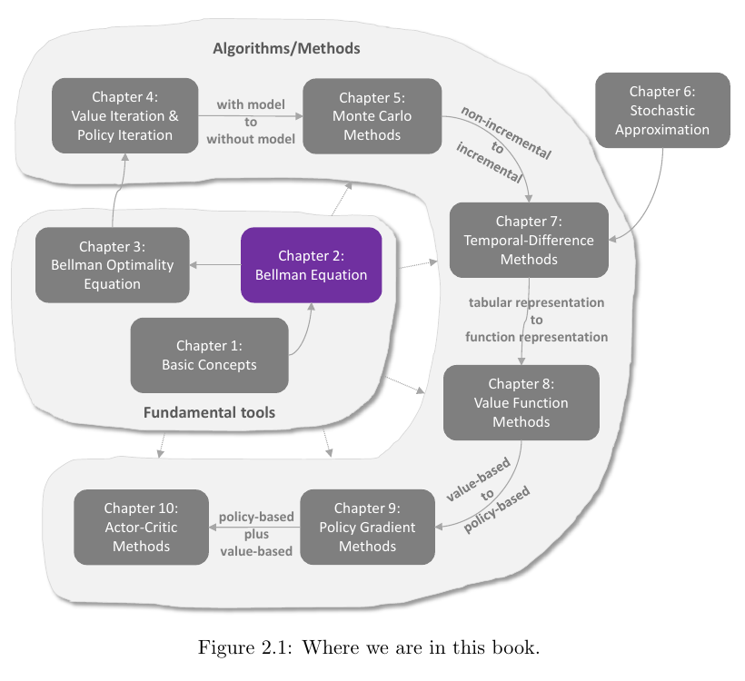
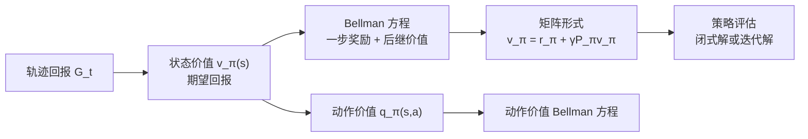
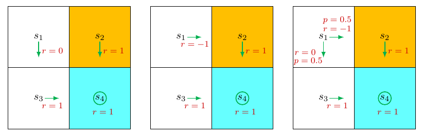
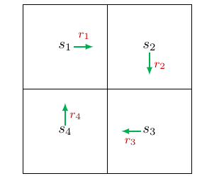
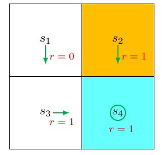
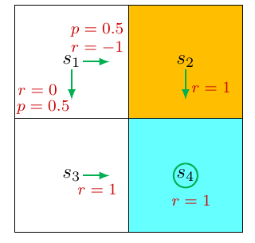
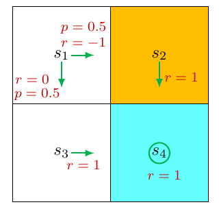
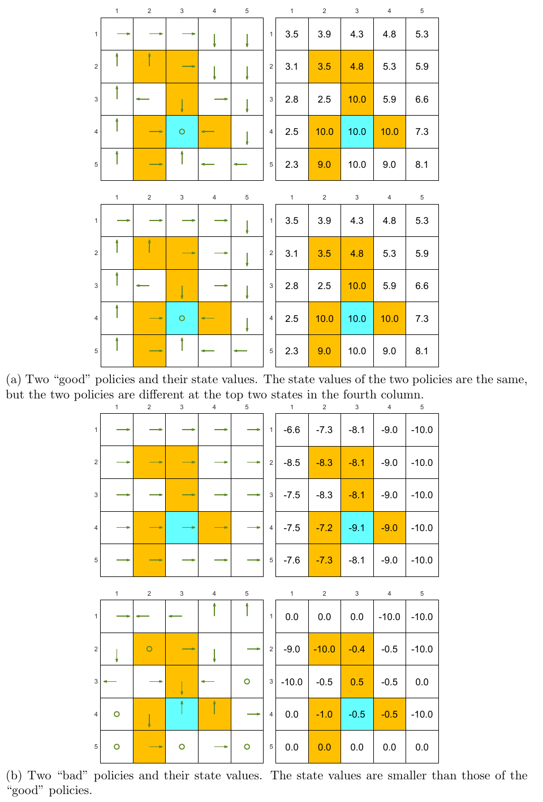

# Chapter 2 - State Values and Bellman Equation

> [!abstract] 本章导读
> 本章围绕一个评价问题展开：给定策略（policy）后，怎样用数学量化“从某个状态出发，这个策略有多好”？单条轨迹的回报（return）会随随机动作或随机转移而变化，因此教材用**期望回报**定义状态价值（state value），再利用回报的递归分解导出 Bellman 方程。将每个状态的方程联立，就得到可闭式求解或迭代求解的策略评估（policy evaluation）问题。最后，本章把评价对象从状态扩展到状态—动作对，得到动作价值（action value）及其 Bellman 方程。

## 0. 本章知识结构

**图解：** Chapter 2 位于基础工具层：它承接 Chapter 1 的 MDP、策略、奖励与回报，并为 Chapter 3 的 Bellman optimality equation、Chapter 4 的 value/policy iteration 以及之后的 model-free 方法提供价值递归工具。

主线可以概括为：

$$
\text{回报比较策略}
\rightarrow \text{随机性要求取期望}
\rightarrow v_\pi(s)
\rightarrow \text{Bellman 递归}
\rightarrow \text{联立求解}
\rightarrow q_\pi(s,a).
$$

## 1. 动机示例 1：为什么回报重要？

教材考虑同一个四状态网格中的三种策略，它们只在 $s_1$ 处不同。

**图解：**

- 左侧策略从 $s_1$ 向下，避开橙色禁止格 $s_2$；
- 中间策略从 $s_1$ 向右，进入 $s_2$ 并立即获得 $-1$；
- 右侧策略以 $0.5$ 概率向右、以 $0.5$ 概率向下；
- 到达 $s_4$ 后持续获得奖励 $1$。直觉上，左侧最好，中间最差，随机策略居中。

设折扣率（discount rate）$\gamma\in(0,1)$，并从 $s_1$ 出发。

### 1.1 第一种策略：确定性地避开禁止格

轨迹为 $s_1\rightarrow s_3\rightarrow s_4\rightarrow s_4\rightarrow\cdots$，回报为

$$
\begin{aligned}
\operatorname{return}_1
&=0+\gamma\cdot1+\gamma^2\cdot1+\cdots\\
&=\gamma(1+\gamma+\gamma^2+\cdots)\\
&=\frac{\gamma}{1-\gamma}.
\end{aligned}
$$

### 1.2 第二种策略：确定性地进入禁止格

轨迹为 $s_1\rightarrow s_2\rightarrow s_4\rightarrow s_4\rightarrow\cdots$，因此

$$
\begin{aligned}
\operatorname{return}_2
&=-1+\gamma\cdot1+\gamma^2\cdot1+\cdots\\
&=-1+\frac{\gamma}{1-\gamma}.
\end{aligned}
$$

### 1.3 第三种策略：在两条路线间随机选择

两条轨迹各以 $0.5$ 的概率出现，平均回报为

$$
\begin{aligned}
\operatorname{return}_3
&=0.5\left(-1+\frac{\gamma}{1-\gamma}\right)
+0.5\left(\frac{\gamma}{1-\gamma}\right)\\
&=-0.5+\frac{\gamma}{1-\gamma}.
\end{aligned}
$$

于是，对任意 $\gamma\in(0,1)$ 都有

$$
\operatorname{return}_1>\operatorname{return}_3>\operatorname{return}_2.
$$

这个顺序与直觉一致：**回报越大，策略越好。**不过，$\operatorname{return}_3$ 已不是某一条实际轨迹的回报，而是两种可能回报的平均值；后文会把它正式识别为状态价值。

## 2. 动机示例 2：怎样计算回报？

考虑一个没有目标格和禁止格的四状态循环。每个状态按图中箭头确定性地移动，并依次获得 $r_1,r_2,r_3,r_4$。

### 2.1 按定义直接展开

用 $v_i$ 表示从 $s_i$ 出发的回报，则

$$
\begin{aligned}
v_1&=r_1+\gamma r_2+\gamma^2r_3+\cdots,\\
v_2&=r_2+\gamma r_3+\gamma^2r_4+\cdots,\\
v_3&=r_3+\gamma r_4+\gamma^2r_1+\cdots,\\
v_4&=r_4+\gamma r_1+\gamma^2r_2+\cdots.
\end{aligned}
$$

这种方式忠实于回报定义，但需要处理无限长奖励序列。

### 2.2 Bootstrap：利用下一状态的价值

观察各式的尾部：$v_1$ 中从 $r_2$ 开始的部分正是 $v_2$，其余同理。因此

$$
\begin{aligned}
v_1&=r_1+\gamma v_2,\\
v_2&=r_2+\gamma v_3,\\
v_3&=r_3+\gamma v_4,\\
v_4&=r_4+\gamma v_1.
\end{aligned}
$$

> [!definition] Bootstrap（自举）
> 用待求量自身或其他待求量的当前关系来计算该量。本例中，每个状态的价值由“一步奖励 + 下一状态的价值”表达。

这看似循环依赖，实质上是一个联立线性方程组。令

$$
v=\begin{bmatrix}v_1\\v_2\\v_3\\v_4\end{bmatrix},\quad
r=\begin{bmatrix}r_1\\r_2\\r_3\\r_4\end{bmatrix},\quad
P=\begin{bmatrix}
0&1&0&0\\
0&0&1&0\\
0&0&0&1\\
1&0&0&0
\end{bmatrix},
$$

则

$$
v=r+\gamma Pv,
$$

从而

$$
v=(I-\gamma P)^{-1}r.
$$

> [!tip] 核心理解
> “价值依赖价值”不是程序陷入死循环，而是所有状态必须一起满足的一组一致性约束。Bellman 方程正是这种约束的一般形式。

## 3. 状态价值

### 3.1 轨迹与随机回报

在时刻 $t$，智能体处于随机状态 $S_t$，依据策略 $\pi$ 选择随机动作 $A_t$，环境产生下一状态 $S_{t+1}$ 和即时奖励 $R_{t+1}$：

$$
S_t\xrightarrow{A_t}S_{t+1},R_{t+1}.
$$

其中 $S_t,S_{t+1}\in\mathcal S$，$A_t\in\mathcal A(S_t)$，$R_{t+1}\in\mathcal R(S_t,A_t)$。从时刻 $t$ 开始的轨迹为

$$
S_t\xrightarrow{A_t}S_{t+1},R_{t+1}
\xrightarrow{A_{t+1}}S_{t+2},R_{t+2}
\xrightarrow{A_{t+2}}\cdots.
$$

对应的折扣回报是随机变量

$$
G_t\triangleq R_{t+1}+\gamma R_{t+2}+\gamma^2R_{t+3}+\cdots.
$$

### 3.2 正式定义

> [!definition] 状态价值函数（state-value function）
> 给定策略 $\pi$，状态 $s$ 的价值是从 $S_t=s$ 出发并随后遵循 $\pi$ 时所得回报的条件期望：
> $$
> v_\pi(s)\triangleq\mathbb E[G_t\mid S_t=s].
> $$

定义包含三个关键点：

- $v_\pi(s)$ 依赖状态 $s$，因为条件指定了出发状态；
- $v_\pi(s)$ 依赖策略 $\pi$，因为策略决定后续动作与轨迹分布；
- 在教材采用的平稳 MDP 和固定策略设定下，$v_\pi(s)$ 不依赖具体时刻 $t$。

### 3.3 回报与状态价值的关系

| 情形 | 从同一状态出发的轨迹 | 回报 | 状态价值 |
|---|---|---|---|
| 策略和系统模型都确定 | 唯一 | 唯一 | 等于该轨迹回报 |
| 策略或系统模型含随机性 | 可能有多条 | 随轨迹变化 | 所有可能回报的均值 |

所以，回报 $G_t$ 是一次轨迹的随机结果，而 $v_\pi(s)$ 是给定起点与策略后的统计评价。正式评价策略时应使用状态价值。

## 4. Bellman 方程

Bellman 方程（Bellman equation）是一组描述所有状态价值之间关系的线性方程。

### 4.1 从回报递归开始

首先分离第一步奖励：

$$
\begin{aligned}
G_t
&=R_{t+1}+\gamma R_{t+2}+\gamma^2R_{t+3}+\cdots\\
&=R_{t+1}+\gamma(R_{t+2}+\gamma R_{t+3}+\cdots)\\
&=R_{t+1}+\gamma G_{t+1}.
\end{aligned}
$$

代入状态价值定义：

$$
\begin{aligned}
v_\pi(s)
&=\mathbb E[G_t\mid S_t=s]\\
&=\mathbb E[R_{t+1}+\gamma G_{t+1}\mid S_t=s]\\
&=\mathbb E[R_{t+1}\mid S_t=s]
+\gamma\mathbb E[G_{t+1}\mid S_t=s].
\end{aligned}
$$

这已经显示了 Bellman 结构：**当前价值 = 即时奖励的均值 + 折扣后的未来回报均值。**

### 4.2 即时奖励项

根据全期望公式，先对动作，再对奖励求和：

$$
\begin{aligned}
\mathbb E[R_{t+1}\mid S_t=s]
&=\sum_{a\in\mathcal A}\pi(a\mid s)
\mathbb E[R_{t+1}\mid S_t=s,A_t=a]\\
&=\sum_{a\in\mathcal A}\pi(a\mid s)
\sum_{r\in\mathcal R}p(r\mid s,a)r.
\end{aligned}
$$

教材为简化记号省略了动作集和奖励集对 $s$ 或 $(s,a)$ 的依赖；若实际为 $\mathcal A(s)$、$\mathcal R(s,a)$，结论不变。

### 4.3 未来回报项与 Markov 性质

对下一状态 $S_{t+1}=s'$ 分解：

$$
\begin{aligned}
\mathbb E[G_{t+1}\mid S_t=s]
&=\sum_{s'\in\mathcal S}
\mathbb E[G_{t+1}\mid S_t=s,S_{t+1}=s']p(s'\mid s)\\
&=\sum_{s'\in\mathcal S}
\mathbb E[G_{t+1}\mid S_{t+1}=s']p(s'\mid s)\\
&=\sum_{s'\in\mathcal S}v_\pi(s')p(s'\mid s)\\
&=\sum_{s'\in\mathcal S}v_\pi(s')
\sum_{a\in\mathcal A}p(s'\mid s,a)\pi(a\mid s).
\end{aligned}
$$

第二行使用 Markov 性质：给定当前的下一状态 $S_{t+1}$ 后，未来回报不再需要过去状态 $S_t$。

### 4.4 一般形式

把两部分合并，得到对每个 $s\in\mathcal S$ 都成立的 Bellman 方程：

$$
\boxed{
v_\pi(s)=
\sum_{a\in\mathcal A}\pi(a\mid s)
\left[
\sum_{r\in\mathcal R}p(r\mid s,a)r
+\gamma\sum_{s'\in\mathcal S}p(s'\mid s,a)v_\pi(s')
\right]
}
$$

各部分含义：

- $\pi(a\mid s)$：给定、待评价的策略；
- $p(r\mid s,a)$ 与 $p(s'\mid s,a)$：系统模型；
- $v_\pi(s)$ 与 $v_\pi(s')$：待求价值；
- 第一项：即时奖励的均值；
- 第二项：折扣后的下一状态价值均值。

Bellman 方程不是只求一个 $v_\pi(s)$ 的单方程，而是为所有状态各写一个方程并联立求解。解出价值就是**策略评估**。

### 4.5 两种等价写法

若使用联合分布 $p(s',r\mid s,a)$，由全概率公式可得

$$
v_\pi(s)=\sum_{a\in\mathcal A}\sum_{s'\in\mathcal S}\sum_{r\in\mathcal R}
\pi(a\mid s)p(s',r\mid s,a)[r+\gamma v_\pi(s')].
$$

若奖励只由下一状态决定，即写作 $r(s')$，则

$$
v_\pi(s)=\sum_{a\in\mathcal A}\pi(a\mid s)
\sum_{s'\in\mathcal S}p(s'\mid s,a)[r(s')+\gamma v_\pi(s')].
$$

> [!warning] 记号差异
> 不同文献采用联合模型、分离的奖励/转移模型或下一状态奖励写法。它们的条件不同，但核心都是对“一步奖励 + 后继价值”取期望。

## 5. Bellman 方程示例

### 5.1 确定性策略

**图解：** 在 $s_1$ 向下且即时奖励为 $0$；$s_2$ 向下、$s_3$ 向右、$s_4$ 原地停留，后三者每步奖励均为 $1$。

在 $s_1$，策略、转移和奖励都确定，所以一般 Bellman 方程立即化简为

$$
v_\pi(s_1)=0+\gamma v_\pi(s_3).
$$

其余状态为

$$
\begin{aligned}
v_\pi(s_2)&=1+\gamma v_\pi(s_4),\\
v_\pi(s_3)&=1+\gamma v_\pi(s_4),\\
v_\pi(s_4)&=1+\gamma v_\pi(s_4).
\end{aligned}
$$

从最后一个方程开始求解：

$$
v_\pi(s_4)=v_\pi(s_3)=v_\pi(s_2)=\frac{1}{1-\gamma},\qquad
v_\pi(s_1)=\frac{\gamma}{1-\gamma}.
$$

取 $\gamma=0.9$，有

$$
[v_\pi(s_1),v_\pi(s_2),v_\pi(s_3),v_\pi(s_4)]^T=[9,10,10,10]^T.
$$

### 5.2 随机策略

**图解：** $s_1$ 以 $0.5$ 概率向下，得到 $0$ 后到 $s_3$；以 $0.5$ 概率向右，得到 $-1$ 后到禁止格 $s_2$。其余状态与上例相同。

因此

$$
v_\pi(s_1)=0.5[0+\gamma v_\pi(s_3)]
+0.5[-1+\gamma v_\pi(s_2)].
$$

$s_2,s_3,s_4$ 的方程不变，所以

$$
v_\pi(s_1)=-0.5+\frac{\gamma}{1-\gamma}.
$$

当 $\gamma=0.9$ 时，价值向量为

$$
[8.5,10,10,10]^T.
$$

若用 $\pi_1$ 表示确定性策略、$\pi_2$ 表示随机策略，则

$$
v_{\pi_1}(s_i)\geq v_{\pi_2}(s_i),\qquad i=1,2,3,4.
$$

这说明第一种策略不劣于第二种；差异只出现在会以一定概率进入禁止格的 $s_1$。

## 6. Bellman 方程的矩阵—向量形式

先定义策略下的平均即时奖励和状态转移概率：

$$
r_\pi(s)\triangleq
\sum_{a\in\mathcal A}\pi(a\mid s)
\sum_{r\in\mathcal R}p(r\mid s,a)r,
$$

$$
p_\pi(s'\mid s)\triangleq
\sum_{a\in\mathcal A}\pi(a\mid s)p(s'\mid s,a).
$$

于是逐状态形式可简写为

$$
v_\pi(s)=r_\pi(s)+\gamma\sum_{s'\in\mathcal S}p_\pi(s'\mid s)v_\pi(s').
$$

将状态编号为 $s_1,\ldots,s_n$，其中 $n=\lvert\mathcal S\rvert$，并令

$$
v_\pi=[v_\pi(s_1),\ldots,v_\pi(s_n)]^T,
\qquad
r_\pi=[r_\pi(s_1),\ldots,r_\pi(s_n)]^T,
$$

$$
[P_\pi]_{ij}=p_\pi(s_j\mid s_i).
$$

所有状态的方程合并为

$$
\boxed{v_\pi=r_\pi+\gamma P_\pi v_\pi.}
$$

$P_\pi$ 有两个重要性质：

- 非负：$P_\pi\geq0$，这里为逐元素比较；
- 行随机：$P_\pi\mathbf1=\mathbf1$，即每行元素之和为 $1$。

对 Figure 2.6，

$$
r_\pi=\begin{bmatrix}-0.5\\1\\1\\1\end{bmatrix},\qquad
P_\pi=\begin{bmatrix}
0&0.5&0.5&0\\
0&0&0&1\\
0&0&0&1\\
0&0&0&1
\end{bmatrix}.
$$

第一行体现从 $s_1$ 以相同概率到 $s_2$ 或 $s_3$；其余三行都确定地到 $s_4$。每行之和确为 $1$。

## 7. 从 Bellman 方程求状态价值

给定策略后求 $v_\pi$ 的过程就是策略评估。本章给出两种方法。

### 7.1 闭式解

由

$$
(I-\gamma P_\pi)v_\pi=r_\pi
$$

得到

$$
\boxed{v_\pi=(I-\gamma P_\pi)^{-1}r_\pi.}
$$

#### 为什么 $I-\gamma P_\pi$ 可逆？

教材使用 Gershgorin 圆盘定理。第 $i$ 个圆盘的中心为

$$
1-\gamma p_\pi(s_i\mid s_i),
$$

半径为

$$
\sum_{j\neq i}\gamma p_\pi(s_j\mid s_i).
$$

由于该行概率和为 $1$ 且 $\gamma<1$，半径严格小于中心的模：

$$
\sum_{j\neq i}\gamma p_\pi(s_j\mid s_i)
<1-\gamma p_\pi(s_i\mid s_i).
$$

因此所有 Gershgorin 圆盘都不包含原点，$I-\gamma P_\pi$ 没有零特征值，因而可逆。

此外，由 Neumann 级数

$$
(I-\gamma P_\pi)^{-1}
=I+\gamma P_\pi+\gamma^2P_\pi^2+\cdots\geq I\geq0.
$$

所以若 $r\geq0$，则

$$
(I-\gamma P_\pi)^{-1}r\geq r\geq0.
$$

进一步，若 $r_1\geq r_2$，则

$$
(I-\gamma P_\pi)^{-1}r_1
\geq(I-\gamma P_\pi)^{-1}r_2.
$$

### 7.2 迭代解

闭式解适合理论分析，但显式矩阵求逆本身仍需数值计算。可直接迭代：

$$
\boxed{v_{k+1}=r_\pi+\gamma P_\pi v_k,\qquad k=0,1,2,\ldots}
$$

其中 $v_0\in\mathbb R^n$ 是任意初始猜测，并且

$$
v_k\rightarrow v_\pi=(I-\gamma P_\pi)^{-1}r_\pi,\qquad k\rightarrow\infty.
$$

#### Box 2.1：收敛证明

定义误差 $\delta_k=v_k-v_\pi$。利用迭代式和 Bellman 不动点方程：

$$
\begin{aligned}
\delta_{k+1}
&=v_{k+1}-v_\pi\\
&=r_\pi+\gamma P_\pi v_k-v_\pi\\
&=\gamma P_\pi(v_k-v_\pi)\\
&=\gamma P_\pi\delta_k.
\end{aligned}
$$

递推得到

$$
\delta_{k+1}=\gamma^{k+1}P_\pi^{k+1}\delta_0.
$$

由于 $P_\pi$ 是随机矩阵，其任意次幂仍为非负随机矩阵，元素不超过 $1$；又因 $0<\gamma<1$，$\gamma^k\rightarrow0$，所以 $\delta_k\rightarrow0$。

> [!tip] 证明的核心
> Bellman 更新每轮都让旧误差乘上 $\gamma P_\pi$。转移矩阵只重新分配误差，而折扣因子 $\gamma<1$ 持续缩小误差，最终收敛到唯一不动点。

### 7.3 网格策略评估示例

**图解：** 左列是策略箭头，右列是对应状态价值；橙色为禁止格，青色为目标格。设置为 $r_{\text{boundary}}=r_{\text{forbidden}}=-1$、$r_{\text{target}}=1$、$\gamma=0.9$。

- 上半部两种“好”策略在第 4 列顶部两个状态选择不同，却得到完全相同的价值；说明**不同策略可能拥有相同状态价值**。
- 下半部两种“坏”策略包含大量直觉上不合理的动作，其价值大多为负且显著小于好策略。
- 数值价值把“策略看起来好不好”的直觉转化为可比较的量。

## 8. 从状态价值到动作价值

### 8.1 定义

> [!definition] 动作价值函数（action-value function）
> 给定策略 $\pi$，在状态 $s$ 先执行动作 $a$，随后遵循 $\pi$ 时的期望回报为
> $$
> q_\pi(s,a)\triangleq\mathbb E[G_t\mid S_t=s,A_t=a].
> $$

严格说它是“状态—动作价值”，因为它依赖 $(s,a)$，而不是只依赖动作。

### 8.2 状态价值与动作价值：两面关系

对动作按策略概率求全期望：

$$
\boxed{v_\pi(s)=\sum_{a\in\mathcal A}\pi(a\mid s)q_\pi(s,a).}
$$

因此状态价值是该状态下各动作价值按策略分布加权后的均值。

另一方面，将状态价值 Bellman 方程与上式比较，得到

$$
\boxed{
q_\pi(s,a)=
\sum_{r\in\mathcal R}p(r\mid s,a)r
+\gamma\sum_{s'\in\mathcal S}p(s'\mid s,a)v_\pi(s').
}
$$

即动作价值也是“执行该动作的即时奖励均值 + 折扣后的下一状态价值均值”。

| 方向 | 公式含义 |
|---|---|
| $q_\pi\rightarrow v_\pi$ | 按策略 $\pi(a\mid s)$ 对同一状态的动作价值取平均 |
| $v_\pi\rightarrow q_\pi$ | 固定先执行 $a$，再对奖励与下一状态求期望 |

### 8.3 示例：策略不选的动作仍有价值

策略在 $s_1$ 只选择 $a_2$（向右）与 $a_3$（向下），各自概率为 $0.5$：

$$
q_\pi(s_1,a_2)=-1+\gamma v_\pi(s_2),
$$

$$
q_\pi(s_1,a_3)=0+\gamma v_\pi(s_3).
$$

虽然该策略不选择 $a_1,a_4,a_5$，这些动作依然有明确价值。向上或向左会撞边界并弹回 $s_1$，原地不动也留在 $s_1$，所以

$$
\begin{aligned}
q_\pi(s_1,a_1)&=-1+\gamma v_\pi(s_1),\\
q_\pi(s_1,a_4)&=-1+\gamma v_\pi(s_1),\\
q_\pi(s_1,a_5)&=0+\gamma v_\pi(s_1).
\end{aligned}
$$

策略实际采用的两个动作恢复出状态价值：

$$
\begin{aligned}
v_\pi(s_1)
&=0.5q_\pi(s_1,a_2)+0.5q_\pi(s_1,a_3)\\
&=0.5[-1+\gamma v_\pi(s_2)]
+0.5[0+\gamma v_\pi(s_3)].
\end{aligned}
$$

为什么还要计算策略不会选的动作？因为“当前策略不选”不等于“动作不好”。当前策略可能本身不优；要寻找更优策略，就必须比较和探索其他动作。

### 8.4 动作价值形式的 Bellman 方程

把 $v_\pi(s')=\sum_{a'\in\mathcal A(s')}\pi(a'\mid s')q_\pi(s',a')$ 代入动作价值表达式：

$$
\boxed{
q_\pi(s,a)=
\sum_{r\in\mathcal R}p(r\mid s,a)r
+\gamma\sum_{s'\in\mathcal S}p(s'\mid s,a)
\sum_{a'\in\mathcal A(s')}\pi(a'\mid s')q_\pi(s',a').
}
$$

该式对每个状态—动作对成立。联立后，其矩阵形式为

$$
q_\pi=\tilde r+\gamma P\Pi q_\pi.
$$

其中：

- $q_\pi$ 按状态—动作对索引，$[q_\pi]_{(s,a)}=q_\pi(s,a)$；
- $\tilde r$ 也是按状态—动作对索引，$[\tilde r]_{(s,a)}=\sum_{r\in\mathcal R}p(r\mid s,a)r$；
- $P$ 的行按 $(s,a)$ 索引、列按 $s'$ 索引，$[P]_{(s,a),s'}=p(s'\mid s,a)$；
- $\Pi$ 把下一状态映射到策略下的动作分布，$\Pi_{s',(s',a')}=\pi(a'\mid s')$，其余元素为零。

这里 $\tilde r$ 与 $P$ 只由系统模型决定，策略单独嵌入 $\Pi$。教材指出该映射也是压缩映射，具有唯一解并可迭代求解；更完整细节留给参考文献。

## 9. 本章总结

本章从“怎样比较策略”开始。确定性轨迹可以直接比较回报，但随机策略或随机环境会让同一状态对应多种回报，因此引入状态价值 $v_\pi(s)$，即给定状态和策略后的期望回报。

回报满足 $G_t=R_{t+1}+\gamma G_{t+1}$。结合全期望公式、策略概率、奖励模型、转移模型和 Markov 性质，就得到 Bellman 方程：当前状态价值等于即时奖励均值加折扣后的后继状态价值均值。所谓 bootstrap，是用相互依赖的价值表达价值；矩阵形式表明它本质上是一组联立线性方程，而不是无法终止的循环。

给定策略求解这些状态价值就是策略评估。可以使用闭式解 $(I-\gamma P_\pi)^{-1}r_\pi$，也可以反复执行 $v_{k+1}=r_\pi+\gamma P_\pi v_k$；$\gamma<1$ 保证误差逐步衰减。最后，动作价值 $q_\pi(s,a)$ 把评价细化到具体状态—动作对，并通过 $v_\pi$ 与策略相互联系，为后续寻找最优动作和最优策略打下基础。

## 教材 Q&A

**Q1：状态价值与回报是什么关系？**

状态价值是智能体从该状态出发、遵循给定策略时可能得到的回报的均值。

**Q2：为什么关注状态价值？**

状态价值可以评价策略；下一章还会基于状态价值定义最优策略。

**Q3：为什么关注 Bellman 方程？**

它描述全部状态价值之间的关系，是分析和求解状态价值的工具。

**Q4：为什么解 Bellman 方程称为策略评估？**

解方程得到给定策略的状态价值，而这些价值正用于评价该策略。

**Q5：为什么需要矩阵—向量形式？**

Bellman 方程是针对所有状态建立的一组线性方程；矩阵—向量形式把它们集中表示，便于统一求解与分析。

**Q6：状态价值与动作价值是什么关系？为什么关心策略不选的动作？**

状态价值是同一状态下动作价值按策略概率的均值；动作价值则由执行动作后的即时奖励与可能到达的下一状态价值决定。当前策略不选某动作并不能证明该动作不好，寻找更优策略仍需评价和探索这些动作。

## 10. 一页式复习

- **回报**：$G_t=R_{t+1}+\gamma R_{t+2}+\cdots$，是单条轨迹上的随机量。
- **状态价值**：$v_\pi(s)=\mathbb E[G_t\mid S_t=s]$，是从状态 $s$ 出发遵循 $\pi$ 的平均回报。
- **递归关键**：$G_t=R_{t+1}+\gamma G_{t+1}$。
- **Bellman 方程**：对策略、奖励和下一状态求期望，结构是“一步奖励 + 折扣后继价值”。
- **矩阵形式**：$v_\pi=r_\pi+\gamma P_\pi v_\pi$。
- **策略评估**：给定 $\pi$ 求 $v_\pi$。
- **闭式解**：$v_\pi=(I-\gamma P_\pi)^{-1}r_\pi$。
- **迭代解**：$v_{k+1}=r_\pi+\gamma P_\pi v_k$，当 $\gamma<1$ 时收敛。
- **动作价值**：$q_\pi(s,a)=\mathbb E[G_t\mid S_t=s,A_t=a]$。
- **两者关系**：$v_\pi(s)=\sum_a\pi(a\mid s)q_\pi(s,a)$；$q_\pi(s,a)$ 等于该动作的即时奖励均值加折扣后继状态价值均值。
- **关键误区**：策略概率为零的动作仍有动作价值；Bellman 方程必须对所有状态联立理解。

## 11. 公式清单

| 公式 | 名称 | 作用 |
|---|---|---|
| $G_t=R_{t+1}+\gamma R_{t+2}+\gamma^2R_{t+3}+\cdots$ | 折扣回报 | 评价一条轨迹的长期奖励 |
| $G_t=R_{t+1}+\gamma G_{t+1}$ | 回报递归 | 导出 Bellman 结构 |
| $v_\pi(s)=\mathbb E[G_t\mid S_t=s]$ | 状态价值 | 评价给定状态下的策略 |
| $v_\pi(s)=\sum_a\pi(a\mid s)[\sum_r p(r\mid s,a)r+\gamma\sum_{s'}p(s'\mid s,a)v_\pi(s')]$ | 状态价值 Bellman 方程 | 联立描述所有状态价值 |
| $v_\pi=r_\pi+\gamma P_\pi v_\pi$ | 矩阵 Bellman 方程 | 将逐状态方程写成线性系统 |
| $v_\pi=(I-\gamma P_\pi)^{-1}r_\pi$ | 闭式策略评估 | 理论分析或小规模求解 |
| $v_{k+1}=r_\pi+\gamma P_\pi v_k$ | 迭代策略评估 | 不显式求逆地逼近价值 |
| $q_\pi(s,a)=\mathbb E[G_t\mid S_t=s,A_t=a]$ | 动作价值 | 评价在状态中先执行某动作 |
| $v_\pi(s)=\sum_a\pi(a\mid s)q_\pi(s,a)$ | 从动作价值到状态价值 | 按策略对动作价值取期望 |
| $q_\pi(s,a)=\sum_r p(r\mid s,a)r+\gamma\sum_{s'}p(s'\mid s,a)v_\pi(s')$ | 从状态价值到动作价值 | 一步前瞻评价具体动作 |
| $q_\pi=\tilde r+\gamma P\Pi q_\pi$ | 动作价值矩阵 Bellman 方程 | 联立描述所有状态—动作价值 |

## 12. 符号表

| 符号 | 含义 |
|---|---|
| $S_t,A_t,R_{t+1}$ | 时刻 $t$ 的状态、动作及随后获得的奖励 |
| $G_t$ | 从时刻 $t$ 开始的折扣回报 |
| $\gamma$ | 折扣率，教材设 $\gamma\in(0,1)$ |
| $\pi(a\mid s)$ | 策略在状态 $s$ 选择动作 $a$ 的概率 |
| $v_\pi(s)$ | 策略 $\pi$ 下状态 $s$ 的价值 |
| $q_\pi(s,a)$ | 策略 $\pi$ 下状态—动作对 $(s,a)$ 的价值 |
| $p(r\mid s,a)$ | 在 $(s,a)$ 后得到奖励 $r$ 的概率 |
| $p(s'\mid s,a)$ | 在 $(s,a)$ 后转移到 $s'$ 的概率 |
| $r_\pi(s)$ | 策略下状态 $s$ 的平均即时奖励 |
| $P_\pi$ | 策略诱导的状态转移矩阵 |
| $v_k$ | 第 $k$ 次迭代的价值向量 |
| $\delta_k$ | 迭代误差 $v_k-v_\pi$ |
| $\tilde r$ | 按状态—动作对索引的平均即时奖励向量 |
| $P$ | 从状态—动作对到下一状态的转移矩阵 |
| $\Pi$ | 在下一状态按策略选择动作的矩阵 |

## 13. 术语表

| English | 中文 | 简要解释 |
|---|---|---|
| return | 回报 | 一条轨迹上折扣奖励之和 |
| state value | 状态价值 | 给定状态与策略后的期望回报 |
| state-value function | 状态价值函数 | 将每个状态映射到其状态价值 |
| Bellman equation | Bellman 方程 / 贝尔曼方程 | 描述当前价值与后继价值关系的方程组 |
| bootstrapping | 自举 | 用价值之间的递归关系计算价值 |
| policy evaluation | 策略评估 | 给定策略，求其状态价值或动作价值 |
| matrix-vector form | 矩阵—向量形式 | 将所有逐状态方程合并成线性系统 |
| closed-form solution | 闭式解 | 通过矩阵逆直接表示解 |
| iterative solution | 迭代解 | 重复 Bellman 更新逐步逼近解 |
| action value | 动作价值 | 在某状态先采取某动作后的期望回报 |
| contraction mapping | 压缩映射 | 迭代会缩小差异并趋向唯一不动点的映射 |

## 14. 常见误区

> [!warning] 状态价值等于每次实际回报
> 只有策略和系统模型都确定时，两者才相等。只要存在随机性，$G_t$ 会随轨迹变化，而 $v_\pi(s)$ 是这些回报的条件均值。

> [!warning] $v_\pi(s)$ 依赖另一个未知的 $v_\pi(s')$，所以无法计算
> Bellman 方程是对所有状态同时成立的方程组。将它们写成 $v_\pi=r_\pi+\gamma P_\pi v_\pi$ 后即可闭式或迭代求解。

> [!warning] Bellman 方程描述的是最优策略
> 本章方程评价的是一个**给定策略** $\pi$。最优性 Bellman 方程是下一章的主题。

> [!warning] 动作价值只由动作决定
> $q_\pi(s,a)$ 依赖状态—动作对；同一动作在不同状态可能产生完全不同的奖励和后继状态。

> [!warning] 策略不选择的动作可以把价值设为零
> $\pi(a\mid s)=0$ 只表示当前策略不选它，不表示执行它后的期望回报为零。比较这些动作正是改进策略所需要的信息。

> [!warning] 显式求逆总是首选
> 闭式公式适合分析，但实际计算矩阵逆仍有成本。本章给出的 Bellman 迭代可以直接逼近解。

## 15. 自测题

### 15.1 概念题

1. 随机系统中，为什么用状态价值比用某一条轨迹的回报评价策略更正式？

> [!success]- 点击查看答案
>
> 同一状态出发可能生成多条轨迹和多个回报。状态价值对这些可能回报取条件期望，反映策略在该状态下的平均长期表现，而不是一次随机结果。

2. 为什么“求 Bellman 方程”称为策略评估？

> [!success]- 点击查看答案
>
> 给定策略 $\pi$ 后，解 Bellman 方程会得到所有 $v_\pi(s)$；状态价值又是评价该策略在各状态长期表现的指标，因此这一求解过程就是策略评估。

3. 判断：若 $\pi(a\mid s)=0$，则 $q_\pi(s,a)=0$。

> [!success]- 点击查看答案
>
> 错误。策略概率为零只说明当前策略不选择该动作。动作价值仍由执行该动作后的即时奖励与后继价值决定。

### 15.2 计算与推导题

4. 某状态 $s$ 在策略下以 $0.25$ 概率选择动作 $a_1$、以 $0.75$ 概率选择 $a_2$。若 $q_\pi(s,a_1)=4$、$q_\pi(s,a_2)=8$，求 $v_\pi(s)$。

> [!success]- 点击查看答案
>
> $$
> v_\pi(s)=0.25\times4+0.75\times8=7.
> $$

5. 从 $G_t$ 的定义推导 $G_t=R_{t+1}+\gamma G_{t+1}$，并说明它为何是 Bellman 方程的起点。

> [!success]- 点击查看答案
>
> $$
> \begin{aligned}
> G_t
> &=R_{t+1}+\gamma R_{t+2}+\gamma^2R_{t+3}+\cdots\\
> &=R_{t+1}+\gamma(R_{t+2}+\gamma R_{t+3}+\cdots)\\
> &=R_{t+1}+\gamma G_{t+1}.
> \end{aligned}
> $$
>
> 它把完整长期回报分成“一步奖励”和“从下一时刻继续的回报”。对两边在给定状态下取条件期望，便得到当前状态价值与后继状态价值的递归关系。

6. 已知

$$
r_\pi=\begin{bmatrix}1\\0\end{bmatrix},\qquad
P_\pi=\begin{bmatrix}0&1\\1&0\end{bmatrix},\qquad
\gamma=0.5,
$$

写出两个逐状态 Bellman 方程。

> [!success]- 点击查看答案
>
> $$
> v_\pi(s_1)=1+0.5v_\pi(s_2),
> $$
>
> $$
> v_\pi(s_2)=0+0.5v_\pi(s_1).
> $$
>
> 联立可得 $v_\pi(s_1)=4/3$、$v_\pi(s_2)=2/3$。

7. 在迭代策略评估中，为什么任意初始 $v_0$ 都能收敛到同一个 $v_\pi$？

> [!success]- 点击查看答案
>
> 误差满足 $\delta_{k+1}=\gamma P_\pi\delta_k$，从而 $\delta_k=\gamma^kP_\pi^k\delta_0$。$P_\pi^k$ 不会产生无界放大，而 $\gamma^k\rightarrow0$，所以任何有限初始误差最终都趋于零，极限是 Bellman 方程的唯一解。

8. 简述状态价值 Bellman 方程与动作价值 Bellman 方程中策略 $\pi$ 出现的位置差异。

> [!success]- 点击查看答案
>
> 状态价值方程在当前状态先按 $\pi(a\mid s)$ 对动作求平均；动作价值方程已固定当前动作 $a$，因此当前步不再按策略平均，但到达 $s'$ 后要按 $\pi(a'\mid s')$ 对下一动作求平均。
