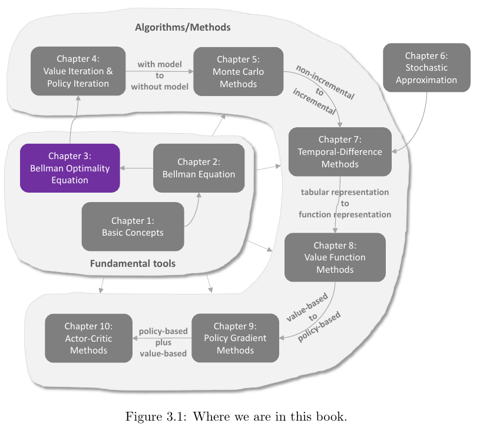
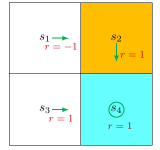
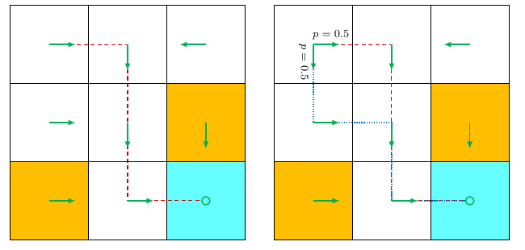
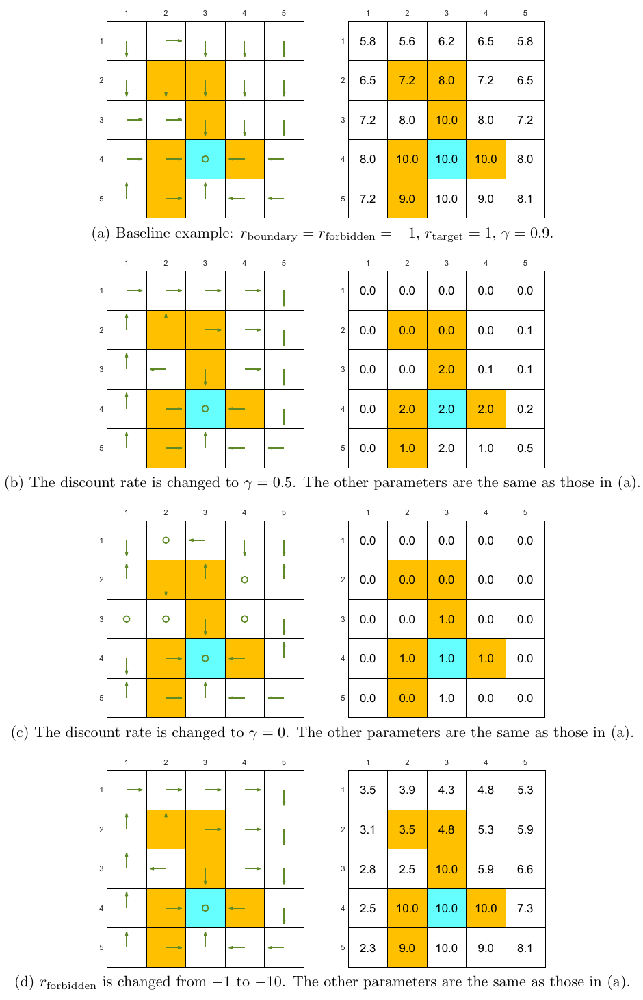
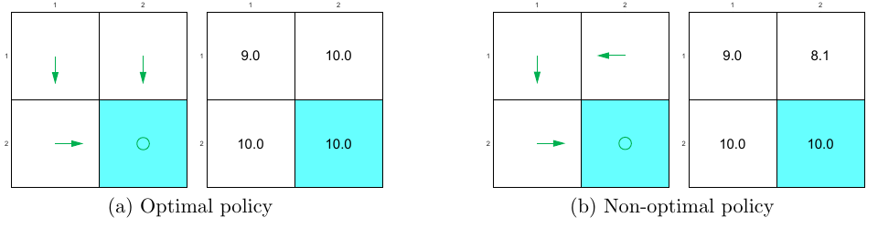

# Chapter 3 - Optimal State Values and Bellman Optimality Equation

> [!abstract] 本章导读
> 强化学习的最终目标是寻找最优策略（optimal policy）。本章先用状态价值定义“一个策略比另一个策略好”的含义，再引入贝尔曼最优方程（Bellman optimality equation, BOE）。BOE 把“选择策略”和“计算价值”统一成非线性不动点方程；借助压缩映射定理，可以证明最优价值存在且唯一、给出迭代求解算法，并证明从该价值贪心导出的策略确实最优。最后，本章分析折扣率和奖励设计如何改变最优行为，以及哪些奖励变换不会改变最优策略。

## 0. 本章知识结构

**图解：** Chapter 3 位于基础工具层，承接 Chapter 2 针对给定策略的 Bellman 方程，并直接通向 Chapter 4 的 Value Iteration 与 Policy Iteration。Chapter 3 建立“最优性方程为何有解、解是否唯一、怎样求解、解为何对应最优策略”的理论基础。

本章的推理主线是：

$$
\text{动作价值改进策略}
\rightarrow \text{定义最优策略}
\rightarrow \text{建立 BOE}
\rightarrow \text{证明 BOE 是压缩映射}
\rightarrow \text{唯一最优价值与迭代求解}
\rightarrow \text{贪心最优策略}.
$$

## 1. 动机示例：怎样改进策略？

**图解：** 橙色 $s_2$ 是禁止格，青色 $s_4$ 是目标格。给定策略在 $s_1$ 向右进入 $s_2$，立即得到 $-1$；直觉上，把 $s_1$ 的动作改为向下、进入 $s_3$，能够避开禁止格。

### 1.1 先评价原策略

给定策略 $\pi$ 的 Bellman 方程为

$$
\begin{aligned}
v_\pi(s_1)&=-1+\gamma v_\pi(s_2),\\
v_\pi(s_2)&=1+\gamma v_\pi(s_4),\\
v_\pi(s_3)&=1+\gamma v_\pi(s_4),\\
v_\pi(s_4)&=1+\gamma v_\pi(s_4).
\end{aligned}
$$

当 $\gamma=0.9$ 时，解为

$$
v_\pi(s_4)=v_\pi(s_3)=v_\pi(s_2)=10,
\qquad
v_\pi(s_1)=8.
$$

### 1.2 比较 $s_1$ 的所有动作

动作 $a_1,a_2,a_3,a_4,a_5$ 分别表示向上、向右、向下、向左和不动。利用原策略的状态价值计算：

$$
\begin{aligned}
q_\pi(s_1,a_1)&=-1+\gamma v_\pi(s_1)=6.2,\\
q_\pi(s_1,a_2)&=-1+\gamma v_\pi(s_2)=8,\\
q_\pi(s_1,a_3)&=0+\gamma v_\pi(s_3)=9,\\
q_\pi(s_1,a_4)&=-1+\gamma v_\pi(s_1)=6.2,\\
q_\pi(s_1,a_5)&=0+\gamma v_\pi(s_1)=7.2.
\end{aligned}
$$

由于

$$
q_\pi(s_1,a_3)\geq q_\pi(s_1,a_i),\qquad \forall i\neq3,
$$

可将策略在 $s_1$ 的动作改为 $a_3$。这把“向下更好”的直觉转化为可计算规则：**在一个状态选择动作价值最大的动作，可以改进策略。**

本例只在 $s_1$ 存在明显问题。接下来要回答更一般的问题：所有状态同时需要改进时怎么办？最优策略是否一定存在？它是否唯一？最优策略必须是确定性的吗？

## 2. 最优状态价值与最优策略

先定义策略之间的偏序。若对任意状态都有

$$
v_{\pi_1}(s)\geq v_{\pi_2}(s),\qquad \forall s\in\mathcal S,
$$

则称 $\pi_1$ 比 $\pi_2$ 更好。

> [!definition] Definition 3.1 - 最优策略与最优状态价值
> 若策略 $\pi^*$ 对任意其他策略 $\pi$ 和任意状态 $s\in\mathcal S$ 都满足
> $$
> v_{\pi^*}(s)\geq v_\pi(s),
> $$
> 则 $\pi^*$ 是最优策略。$\pi^*$ 的状态价值称为最优状态价值（optimal state value）。

记最优状态价值为

$$
v^*=v_{\pi^*}.
$$

这个定义要求同一个策略在**每个状态**都不劣于任何其他策略，而不是只在某个初始状态上表现最好。它立即提出四个必须解决的问题：

1. **存在性**：最优策略是否存在？
2. **唯一性**：最优策略是否唯一？
3. **随机性**：最优策略是随机策略还是确定性策略？
4. **算法**：怎样得到最优策略和最优状态价值？

> [!warning] 教材适用范围说明
> 教材在本章 Q&A 中强调，上述逐状态比较定义面向表格型强化学习。使用函数近似表示价值或策略时，需要采用其他评价指标；相关内容将在 Chapter 8 和 Chapter 9 展开。

## 3. Bellman 最优方程

### 3.1 逐状态形式

对每个 $s\in\mathcal S$，BOE 写为

$$
\begin{aligned}
v(s)
&=\max_{\pi(s)\in\Pi(s)}
\sum_{a\in\mathcal A}\pi(a\mid s)
\left(
\sum_{r\in\mathcal R}p(r\mid s,a)r
+\gamma\sum_{s'\in\mathcal S}p(s'\mid s,a)v(s')
\right)\\
&=\max_{\pi(s)\in\Pi(s)}
\sum_{a\in\mathcal A}\pi(a\mid s)q(s,a),
\end{aligned}
$$

其中

$$
q(s,a)\triangleq
\sum_{r\in\mathcal R}p(r\mid s,a)r
+\gamma\sum_{s'\in\mathcal S}p(s'\mid s,a)v(s').
$$

- $\pi(s)$：状态 $s$ 上的一个动作概率分布；
- $\Pi(s)$：状态 $s$ 上所有可能策略的集合；
- $v(s),v(s')$：待求变量；
- $q(s,a)$：用当前候选价值 $v$ 做一步前瞻得到的动作价值。

BOE 与普通 Bellman 方程的区别是：普通 Bellman 方程固定 $\pi$ 并计算 $v_\pi$；BOE 在右侧对策略取最大，策略本身也是待求对象。

### 3.2 怎样处理右侧最大化？

BOE 看似用一个方程同时求 $v$ 与 $\pi$。教材的关键思路是：**先在给定候选价值 $v$ 的情况下求右侧最优策略，再求不动点价值。**

#### Example 3.1：先解最大化变量，再解不动点变量

考虑

$$
x=\max_{y\in\mathbb R}(2x-1-y^2).
$$

无论 $x$ 是多少，右侧关于 $y$ 的最大值都在 $y=0$ 取得，因此

$$
\max_y(2x-1-y^2)=2x-1.
$$

再解 $x=2x-1$，得到 $x=1$。最终解是 $x=1,y=0$。这个例子说明两个未知量可按层次求解。

#### Example 3.2：概率加权平均的最大值

给定 $q_1,q_2,q_3\in\mathbb R$，最大化

$$
\sum_{i=1}^3c_iq_i,
$$

约束为 $c_1+c_2+c_3=1$ 且 $c_i\geq0$。若 $q_3\geq q_1,q_2$，最优解为 $c_3^*=1,c_1^*=c_2^*=0$，因为

$$
q_3=(c_1+c_2+c_3)q_3
\geq c_1q_1+c_2q_2+c_3q_3.
$$

同理，由 $\sum_a\pi(a\mid s)=1$，有

$$
\begin{aligned}
\sum_{a\in\mathcal A}\pi(a\mid s)q(s,a)
&\leq\sum_{a\in\mathcal A}\pi(a\mid s)
\max_{a'\in\mathcal A}q(s,a')\\
&=\max_{a\in\mathcal A}q(s,a).
\end{aligned}
$$

等号可由确定性策略取得：

$$
\pi(a\mid s)=
\begin{cases}
1,&a=a^*,\\
0,&a\neq a^*,
\end{cases}
\qquad
a^*\in\arg\max_aq(s,a).
$$

因此，对 BOE 右侧最大化的策略就是选择最大 $q(s,a)$ 的动作。

> [!note] 补充理解
> 若多个动作并列最大，任何只在这些最大动作之间分配概率的策略都能取得相同最大值。这解释了为什么最优价值可以唯一，而最优策略可能不唯一或是随机的。

### 3.3 矩阵—向量形式与不动点

把所有状态的方程合并：

$$
\boxed{
v=\max_{\pi\in\Pi}(r_\pi+\gamma P_\pi v)
}
$$

其中最大化按元素进行，且

$$
[r_\pi]_s
\triangleq\sum_{a\in\mathcal A}\pi(a\mid s)
\sum_{r\in\mathcal R}p(r\mid s,a)r,
$$

$$
[P_\pi]_{s,s'}
\triangleq p_\pi(s'\mid s)
=\sum_{a\in\mathcal A}\pi(a\mid s)p(s'\mid s,a).
$$

定义 Bellman 最优算子

$$
f(v)\triangleq\max_{\pi\in\Pi}(r_\pi+\gamma P_\pi v),
$$

BOE 就是非线性不动点方程

$$
\boxed{v=f(v).}
$$

之所以非线性，是因为取得最大值的策略会随 $v$ 改变。

### 3.4 固定点与压缩映射

> [!definition] 固定点（fixed point）
> 对函数 $f:\mathbb R^d\rightarrow\mathbb R^d$，若 $f(x^*)=x^*$，则称 $x^*$ 为 $f$ 的固定点。

> [!definition] 压缩映射（contraction mapping）
> 若存在 $\gamma\in(0,1)$，使任意 $x_1,x_2\in\mathbb R^d$ 都满足
> $$
> \lVert f(x_1)-f(x_2)\rVert
> \leq\gamma\lVert x_1-x_2\rVert,
> $$
> 则 $f$ 是压缩映射。

直观上，压缩映射把任意两点之间的距离至少缩小一个小于 $1$ 的比例。

#### Example 3.3：三个压缩映射

1. $f(x)=0.5x$：固定点为 $0$，且

   $$
   \lvert0.5x_1-0.5x_2\rvert
   =0.5\lvert x_1-x_2\rvert.
   $$

2. $f(x)=Ax$，若 $\lVert A\rVert\leq\gamma<1$，则

   $$
   \lVert Ax_1-Ax_2\rVert
   \leq\lVert A\rVert\lVert x_1-x_2\rVert
   \leq\gamma\lVert x_1-x_2\rVert.
   $$

3. $f(x)=0.5\sin x$：由中值定理，某个 $x_3$ 位于 $x_1,x_2$ 之间，并且

   $$
   \left\lvert
   \frac{0.5\sin x_1-0.5\sin x_2}{x_1-x_2}
   \right\rvert
   =\lvert0.5\cos x_3\rvert\leq0.5.
   $$

   因而 $\lvert0.5\sin x_1-0.5\sin x_2\rvert\leq0.5\lvert x_1-x_2\rvert$。

> [!theorem] Theorem 3.1 - 压缩映射定理
> 对实向量方程 $x=f(x)$，若 $f$ 是压缩映射，则：
> 1. 固定点 $x^*$ 存在；
> 2. 固定点唯一；
> 3. 对任意初值 $x_0$，迭代 $x_{k+1}=f(x_k)$ 都收敛到 $x^*$；
> 4. 收敛速度为指数级。

#### Example 3.4：用迭代求固定点

上面的三个例子都可以从任意初值迭代：

$$
x_{k+1}=0.5x_k,
\qquad
x_{k+1}=Ax_k,
\qquad
x_{k+1}=0.5\sin x_k.
$$

它们都收敛到唯一固定点 $x^*=0$。

### 3.5 Box 3.1：压缩映射定理证明

#### Part 1：迭代序列收敛

令 $x_k=f(x_{k-1})$。由压缩性，

$$
\lVert x_{k+1}-x_k\rVert
\leq\gamma\lVert x_k-x_{k-1}\rVert
\leq\cdots\leq\gamma^k\lVert x_1-x_0\rVert.
$$

仅有相邻差趋零还不足以证明序列收敛。例如 $x_n=\sqrt n$ 满足 $x_{n+1}-x_n\rightarrow0$，但序列发散。因此要证明它是 Cauchy 序列。

对任意 $m>n$，由三角不等式和几何级数，

$$
\begin{aligned}
\lVert x_m-x_n\rVert
&\leq\lVert x_m-x_{m-1}\rVert+\cdots+\lVert x_{n+1}-x_n\rVert\\
&\leq(\gamma^{m-1}+\cdots+\gamma^n)\lVert x_1-x_0\rVert\\
&\leq\frac{\gamma^n}{1-\gamma}\lVert x_1-x_0\rVert.
\end{aligned}
$$

因为 $\gamma^n\rightarrow0$，对任意 $\varepsilon>0$ 都能找到 $N$，使所有 $m,n>N$ 时 $\lVert x_m-x_n\rVert<\varepsilon$。所以序列是 Cauchy 序列，并收敛到某个 $x^*$。

#### Part 2：极限是固定点

$$
\lVert f(x_k)-x_k\rVert
=\lVert x_{k+1}-x_k\rVert
\leq\gamma^k\lVert x_1-x_0\rVert\rightarrow0.
$$

取极限得到 $f(x^*)=x^*$。

#### Part 3：固定点唯一

假设还有固定点 $x'$，则

$$
\lVert x'-x^*\rVert
=\lVert f(x')-f(x^*)\rVert
\leq\gamma\lVert x'-x^*\rVert.
$$

由于 $\gamma<1$，只能有 $\lVert x'-x^*\rVert=0$，即 $x'=x^*$。

#### Part 4：指数收敛

让上面的 $m\rightarrow\infty$，可得误差界

$$
\boxed{
\lVert x^*-x_n\rVert
\leq\frac{\gamma^n}{1-\gamma}\lVert x_1-x_0\rVert.
}
$$

因此误差按 $\gamma^n$ 指数衰减。

### 3.6 BOE 右侧的压缩性质

教材使用最大范数

$$
\lVert v\rVert_\infty=\max_i\lvert v_i\rvert.
$$

> [!theorem] Theorem 3.2 - Bellman 最优算子的压缩性
> 对任意 $v_1,v_2\in\mathbb R^{\lvert\mathcal S\rvert}$，
> $$
> \lVert f(v_1)-f(v_2)\rVert_\infty
> \leq\gamma\lVert v_1-v_2\rVert_\infty.
> $$
> 因而 $f$ 在最大范数下是压缩映射。

#### Box 3.2：Theorem 3.2 证明

令

$$
\pi_1^*\in\arg\max_\pi(r_\pi+\gamma P_\pi v_1),
\qquad
\pi_2^*\in\arg\max_\pi(r_\pi+\gamma P_\pi v_2).
$$

由最大值定义，

$$
f(v_1)=r_{\pi_1^*}+\gamma P_{\pi_1^*}v_1
\geq r_{\pi_2^*}+\gamma P_{\pi_2^*}v_1,
$$

$$
f(v_2)=r_{\pi_2^*}+\gamma P_{\pi_2^*}v_2
\geq r_{\pi_1^*}+\gamma P_{\pi_1^*}v_2.
$$

于是逐元素有

$$
\gamma P_{\pi_2^*}(v_1-v_2)
\leq f(v_1)-f(v_2)
\leq\gamma P_{\pi_1^*}(v_1-v_2).
$$

定义逐元素非负向量

$$
z\triangleq\max\left\{
\left\lvert\gamma P_{\pi_2^*}(v_1-v_2)\right\rvert,
\left\lvert\gamma P_{\pi_1^*}(v_1-v_2)\right\rvert
\right\},
$$

则 $\lvert f(v_1)-f(v_2)\rvert\leq z$，所以

$$
\lVert f(v_1)-f(v_2)\rVert_\infty
\leq\lVert z\rVert_\infty.
$$

对 $P_{\pi_1^*}$ 或 $P_{\pi_2^*}$ 的任一行向量 $p_i^T$，其元素非负且和为 $1$，因此

$$
\left\lvert p_i^T(v_1-v_2)\right\rvert
\leq p_i^T\lvert v_1-v_2\rvert
\leq\lVert v_1-v_2\rVert_\infty.
$$

从而 $\lVert z\rVert_\infty\leq\gamma\lVert v_1-v_2\rVert_\infty$，合并即得结论。

> [!tip] 证明的核心思想
> 最大化可能让 $v_1$ 与 $v_2$ 选择不同策略，但每个策略的转移矩阵都是行随机矩阵：它只能对分量做概率加权，不会放大最大范数；真正缩小差异的是 $\gamma<1$。

## 4. 从 BOE 求最优策略

### 4.1 最优价值的存在、唯一与算法

> [!theorem] Theorem 3.3 - 存在性、唯一性与算法
> BOE
> $$
> v=f(v)=\max_{\pi\in\Pi}(r_\pi+\gamma P_\pi v)
> $$
> 总有唯一解 $v^*$。对任意初值 $v_0$，迭代
> $$
> v_{k+1}=f(v_k)=\max_{\pi\in\Pi}(r_\pi+\gamma P_\pi v_k)
> $$
> 都以指数速度收敛到 $v^*$。

证明直接来自 Theorem 3.1 与 Theorem 3.2。该迭代就是**价值迭代（value iteration）**的理论形式；具体实现放在 Chapter 4。

得到 $v^*$ 后，通过

$$
\pi^*\in\arg\max_{\pi\in\Pi}
(r_\pi+\gamma P_\pi v^*)
$$

求策略。将其代回 BOE：

$$
v^*=r_{\pi^*}+\gamma P_{\pi^*}v^*.
$$

所以 BOE 确实是一个特殊 Bellman 方程，其对应策略是 $\pi^*$，且 $v^*=v_{\pi^*}$。

### 4.2 为什么 BOE 解出的策略真正最优？

> [!theorem] Theorem 3.4 - $v^*$ 与 $\pi^*$ 的最优性
> BOE 的价值解 $v^*$ 是最优状态价值，其对应策略 $\pi^*$ 是最优策略。对任意策略 $\pi$，
> $$
> v^*=v_{\pi^*}\geq v_\pi,
> $$
> 其中不等式为逐元素比较。

#### Box 3.3：Theorem 3.4 证明

任意策略 $\pi$ 的价值满足

$$
v_\pi=r_\pi+\gamma P_\pi v_\pi.
$$

而 BOE 的最大化保证

$$
v^*=\max_{\pi'}(r_{\pi'}+\gamma P_{\pi'}v^*)
\geq r_\pi+\gamma P_\pi v^*.
$$

两式相减：

$$
v^*-v_\pi
\geq\gamma P_\pi(v^*-v_\pi).
$$

反复应用得

$$
v^*-v_\pi
\geq\gamma^nP_\pi^n(v^*-v_\pi).
$$

由于 $P_\pi^n$ 非负、元素不超过 $1$，且 $\gamma^n\rightarrow0$，右侧趋于零，因此 $v^*-v_\pi\geq0$。这对任意 $\pi$ 成立，故 $v^*$ 最优。

### 4.3 确定性贪心最优策略

定义最优动作价值

$$
q^*(s,a)\triangleq
\sum_{r\in\mathcal R}p(r\mid s,a)r
+\gamma\sum_{s'\in\mathcal S}p(s'\mid s,a)v^*(s').
$$

> [!theorem] Theorem 3.5 - 贪心最优策略
> 对每个 $s\in\mathcal S$，选择
> $$
> a^*(s)\in\arg\max_aq^*(s,a),
> $$
> 并定义
> $$
> \pi^*(a\mid s)=
> \begin{cases}
> 1,&a=a^*(s),\\
> 0,&a\neq a^*(s),
> \end{cases}
> $$
> 得到的确定性贪心策略是最优策略。

#### Box 3.4：Theorem 3.5 证明

最优策略的逐状态问题是

$$
\pi^*(s)\in\arg\max_{\pi(s)\in\Pi(s)}
\sum_{a\in\mathcal A}\pi(a\mid s)q^*(s,a).
$$

概率加权平均不可能超过最大分量；把全部概率赋给最大 $q^*(s,a)$ 的动作即可达到上界。因此确定性贪心策略最优。

### 4.4 唯一性与随机性

**图解：** 左图在左上状态确定性向右；右图在该状态以 $0.5$ 概率向右、以 $0.5$ 概率向下。两条路线的最优回报相同，所以两个策略虽然不同，却都最优。

由此得到：

- **最优状态价值 $v^*$ 唯一**；
- **最优策略未必唯一**，甚至可能有无穷多个；
- 最优策略可以是确定性的，也可以是随机的；
- 但 Theorem 3.5 保证**至少存在一个确定性贪心最优策略**。

| 对象 | 是否保证存在 | 是否唯一 | 是否可确定性 |
|---|---|---|---|
| 最优状态价值 $v^*$ | 是 | 是 | 不适用 |
| 最优策略 $\pi^*$ | 是 | 不一定 | 总能找到确定性最优策略 |

## 5. 影响最优策略的因素

从 BOE 可见，最优价值与策略由三类量决定：

1. 即时奖励 $r$；
2. 折扣率 $\gamma$；
3. 系统模型 $p(s'\mid s,a)$ 与 $p(r\mid s,a)$。

本节固定系统模型，比较折扣率和奖励设置的影响。

### 5.1 基准示例与折扣率

**图解：** 每组左图是最优策略，右图是相应最优价值；橙色为禁止格，青色为目标格。

#### (a) 基准：$\gamma=0.9$

设置

$$
r_{\text{boundary}}=r_{\text{forbidden}}=-1,
\qquad
r_{\text{target}}=1,
\qquad
r_{\text{other}}=0.
$$

较大的折扣率使策略更“远视”。从第 4 行第 1 列出发，绕开所有禁止格的路线很长，而穿过禁止格虽然立即受罚，却能更快到达目标并获得更大的累计回报。因此最优策略可能选择穿越禁止格。

#### (b) 降至 $\gamma=0.5$

未来奖励被更强折扣，策略变得短视，不愿承担当前的禁止格惩罚，转而选择较长但避开禁止格的路线。

#### (c) 极端情形 $\gamma=0$

BOE 只剩即时奖励：

$$
q^*(s,a)=\sum_{r\in\mathcal R}p(r\mid s,a)r.
$$

策略只选择即时奖励最大的动作，不考虑长期结果，因此可能无法到达目标。

图中还有一个空间规律：越靠近目标，状态价值通常越大；离目标越远，目标奖励经过的折扣次数越多，状态价值越低。

### 5.2 改变奖励大小

在 Figure 3.4(d) 中，将禁止格奖励从 $-1$ 改为 $-10$，严厉惩罚使最优策略完全避开禁止格。这说明改变不同事件之间的**相对奖励**可以改变策略。

但并非所有奖励变化都会改变最优策略。教材给出如下不变性。

> [!theorem] Theorem 3.6 - 最优策略对奖励仿射变换的不变性
> 将每个奖励按
> $$
> r\longmapsto\alpha r+\beta,
> \qquad \alpha>0,
> $$
> 变换后，新的最优价值为
> $$
> \boxed{
> v'=\alpha v^*+\frac{\beta}{1-\gamma}\mathbf1,
> }
> $$
> 其中 $\mathbf1=[1,\ldots,1]^T$。由 $v'$ 导出的最优策略与原策略相同。

#### Box 3.5：Theorem 3.6 证明

对任意策略，奖励向量变为

$$
r_\pi\longmapsto\alpha r_\pi+\beta\mathbf1.
$$

新的 BOE 是

$$
v'=\max_\pi(\alpha r_\pi+\beta\mathbf1+\gamma P_\pi v').
$$

令 $c=\beta/(1-\gamma)$，尝试 $v'=\alpha v^*+c\mathbf1$。利用 $P_\pi\mathbf1=\mathbf1$：

$$
\begin{aligned}
\max_\pi(\alpha r_\pi+\beta\mathbf1+\gamma P_\pi v')
&=\max_\pi(\alpha r_\pi+\beta\mathbf1
+\alpha\gamma P_\pi v^*+c\gamma\mathbf1)\\
&=\alpha\max_\pi(r_\pi+\gamma P_\pi v^*)
+(\beta+c\gamma)\mathbf1\\
&=\alpha v^*+c\mathbf1,
\end{aligned}
$$

因为 $\beta+c\gamma=c$。所以候选 $v'$ 满足新 BOE；BOE 解唯一，故它就是新最优价值。又因 $\alpha>0$ 且所有动作价值都增加相同的常量项，动作之间的相对次序不变，贪心最优策略不变。

> [!warning] 仿射不变性不等于“怎样改奖励都不影响策略”
> 定理要求对**所有奖励统一**使用同一个 $\alpha>0$ 和同一个 $\beta$。只改变禁止格奖励（例如从 $-1$ 到 $-10$）不是这种统一仿射变换，完全可能改变最优策略。

### 5.3 为什么最优策略不会无意义绕路？

**图解：** 两个策略只在 $s_2$ 不同。左侧从 $s_2$ 直接向下到目标 $s_4$；右侧从 $s_2$ 向左，沿 $s_2\rightarrow s_1\rightarrow s_3\rightarrow s_4$ 绕路。虽然普通移动奖励均为 $0$，右侧策略的 $s_2$ 价值仍由 $10$ 降至 $8.1$。

直接路线的折扣回报为

$$
1+\gamma+\gamma^2+\cdots
=\frac{1}{1-\gamma}=10
\qquad(\gamma=0.9).
$$

绕路路线多经历两个零奖励步骤：

$$
0+\gamma\cdot0+\gamma^2\cdot1+\gamma^3\cdot1+\cdots
=\frac{\gamma^2}{1-\gamma}=8.1.
$$

即使每个普通移动没有负奖励，越晚获得目标奖励，折扣越严重。因此折扣率本身已经鼓励更短的有效路线。

给每一步统一再加 $-1$ 并不是改变最优策略所必需的；在教材的持续任务设定下，它属于统一加常数的仿射变换，依据 Theorem 3.6 不改变最优策略。

## 6. 本章总结

本章从策略改进的直观规则出发：比较同一状态的动作价值，并选择最大的动作。为了把局部改进提升为全局最优性，教材用逐状态价值比较定义最优策略和唯一的最优状态价值。

BOE 把“在每个状态选择最优动作”与“价值必须满足递归关系”合并成 $v=f(v)$。其右侧虽因最大化而非线性，却在最大范数下具有系数 $\gamma<1$ 的压缩性。压缩映射定理因此一次性回答了最优价值的存在性、唯一性和算法问题：从任意初值反复应用 Bellman 最优算子，都会指数收敛到唯一 $v^*$。再对 $q^*(s,a)$ 贪心，就能得到至少一个确定性最优策略。

价值的唯一性并不推出策略唯一；并列最优动作可以产生多个确定性或随机最优策略。最后，折扣率控制策略的远视程度，相对奖励改变风险偏好，而统一的正比例缩放与常数平移只对最优价值做仿射变换，不改变最优动作的排序。折扣还会自动惩罚延迟获得目标奖励的无意义绕路。

## 7. 教材 Q&A

**Q1：怎样定义最优策略？**

若一个策略的状态价值对所有状态都不小于任何其他策略，它就是最优策略。教材说明这一特定定义面向表格型强化学习。

**Q2：为什么 BOE 重要？它是 Bellman 方程吗？**

BOE 同时刻画最优价值和最优策略；求解它即可得到二者。它是对应策略为最优策略的特殊 Bellman 方程。

**Q3：BOE 的解唯一吗？**

最优价值解 $v^*$ 唯一；对应的最优策略可能不唯一。

**Q4：分析 BOE 的关键性质是什么？**

其右侧 Bellman 最优算子是压缩映射，因此可用压缩映射定理证明存在性、唯一性和迭代收敛。

**Q5：最优策略存在吗？唯一吗？是随机还是确定？**

最优策略总存在，但可能有多个甚至无穷多个；它可以是随机的或确定的，而且总能找到确定性贪心最优策略。

**Q6：怎样获得最优策略？**

用 Theorem 3.3 的迭代算法求解 BOE，再对最终的最优动作价值贪心。具体 Value Iteration 实现见 Chapter 4。

**Q7：降低折扣率会怎样？若 $\gamma=0$ 呢？**

折扣率越小，策略越短视、越不愿为远期收益承担当前风险；$\gamma=0$ 时只考虑即时奖励。

**Q8：给所有奖励加同一个常数会怎样？**

最优价值会增加 $\beta/(1-\gamma)$，但最优策略不变。

**Q9：为了避免绕路，是否必须给每一步加负奖励？**

不必。统一加常数不改变最优策略；而折扣本身会让更晚获得的目标奖励价值更低，从而抑制无意义绕路。

## 8. 一页式复习

- **策略比较**：若 $v_{\pi_1}(s)\geq v_{\pi_2}(s)$ 对所有 $s$ 成立，则 $\pi_1$ 不劣于 $\pi_2$。
- **最优策略**：$v_{\pi^*}(s)\geq v_\pi(s)$ 对任意 $s,\pi$ 成立。
- **BOE**：$v=\max_\pi(r_\pi+\gamma P_\pi v)=f(v)$。
- **右侧最大化**：概率加权平均的最大值由把概率集中到最大动作价值上取得。
- **压缩性**：$\lVert f(v_1)-f(v_2)\rVert_\infty\leq\gamma\lVert v_1-v_2\rVert_\infty$。
- **唯一最优价值**：压缩映射定理保证 $v^*$ 存在且唯一。
- **价值迭代原型**：$v_{k+1}=f(v_k)$，任意初值都指数收敛。
- **最优动作价值**：$q^*(s,a)=\mathbb E[R_{t+1}+\gamma v^*(S_{t+1})\mid S_t=s,A_t=a]$ 的离散展开。
- **贪心策略**：$a^*(s)\in\arg\max_aq^*(s,a)$；总存在确定性贪心最优策略。
- **唯一性区别**：$v^*$ 唯一，$\pi^*$ 不一定唯一。
- **折扣率**：较大更远视；较小更短视；$\gamma=0$ 只看即时奖励。
- **奖励仿射变换**：$r\mapsto\alpha r+\beta$（$\alpha>0$）不改变最优策略，价值变为 $\alpha v^*+\beta\mathbf1/(1-\gamma)$。

## 9. 公式清单

| 公式 | 名称 | 作用 | 使用场景 |
|---|---|---|---|
| $v_{\pi^*}(s)\geq v_\pi(s)$ | 最优策略定义 | 逐状态比较所有策略 | 定义全局最优性 |
| $v=\max_\pi(r_\pi+\gamma P_\pi v)$ | BOE 矩阵形式 | 联立最优选择与价值递归 | 求最优价值 |
| $f(v)=\max_\pi(r_\pi+\gamma P_\pi v)$ | Bellman 最优算子 | 把 BOE 写成不动点问题 | 压缩映射分析 |
| $\lVert f(v_1)-f(v_2)\rVert_\infty\leq\gamma\lVert v_1-v_2\rVert_\infty$ | BOE 压缩性 | 保证唯一固定点和迭代收敛 | 理论证明 |
| $v_{k+1}=f(v_k)$ | 价值迭代原型 | 从任意初值逼近 $v^*$ | 数值求解 BOE |
| $q^*(s,a)=\sum_{r\in\mathcal R}p(r\mid s,a)r+\gamma\sum_{s'}p(s'\mid s,a)v^*(s')$ | 最优动作价值 | 对动作做一步前瞻 | 导出最优策略 |
| $a^*(s)\in\arg\max_aq^*(s,a)$ | 贪心动作 | 选择最大最优动作价值 | 构造确定性最优策略 |
| $v'=\alpha v^*+\frac{\beta}{1-\gamma}\mathbf1$ | 奖励仿射变换 | 描述价值随统一奖励变换的变化 | 奖励设计分析 |
| $\lVert x^*-x_n\rVert\leq\frac{\gamma^n}{1-\gamma}\lVert x_1-x_0\rVert$ | 压缩迭代误差界 | 说明指数收敛速度 | 固定点迭代分析 |

## 10. 符号表

| 符号 | 含义 |
|---|---|
| $\pi,\pi^*$ | 一般策略、最优策略 |
| $\Pi(s),\Pi$ | 单个状态上的策略集合、整体策略集合 |
| $v_\pi,v^*$ | 策略 $\pi$ 的状态价值、唯一最优状态价值 |
| $q_\pi,q^*$ | 策略动作价值、最优动作价值 |
| $r_\pi$ | 策略诱导的平均即时奖励向量 |
| $P_\pi$ | 策略诱导的状态转移矩阵 |
| $f$ | Bellman 最优算子 |
| $x^*$ | 一般不动点方程的固定点 |
| $\gamma$ | 折扣率，也是本章压缩系数 |
| $\lVert\cdot\rVert_\infty$ | 最大范数，即最大绝对分量 |
| $\mathbf1$ | 全 1 列向量 |
| $\alpha,\beta$ | 奖励仿射变换的缩放和偏移参数 |
| $a^*(s)$ | 状态 $s$ 的一个贪心最优动作 |

## 11. 术语表

| English | 中文 | 简要解释 |
|---|---|---|
| optimal policy | 最优策略 | 在每个状态都不劣于任何其他策略 |
| optimal state value | 最优状态价值 | 最优策略对应的唯一价值函数 |
| Bellman optimality equation | Bellman 最优方程 | 对策略最大化的价值递归方程 |
| fixed point | 固定点 / 不动点 | 满足 $f(x^*)=x^*$ 的点 |
| contraction mapping | 压缩映射 | 把任意两点距离按小于 1 的比例缩小的映射 |
| contraction mapping theorem | 压缩映射定理 | 保证固定点存在、唯一及迭代收敛的定理 |
| Cauchy sequence | Cauchy 序列 | 尾部任意元素彼此可任意接近的序列 |
| maximum norm | 最大范数 | 向量分量绝对值的最大值 |
| value iteration | 价值迭代 | 反复应用 Bellman 最优算子的算法 |
| greedy policy | 贪心策略 | 在每个状态选择当前动作价值最大的动作 |
| affine transformation | 仿射变换 | $r\mapsto\alpha r+\beta$ |
| policy invariance | 策略不变性 | 变换后最优策略集合保持不变 |

## 12. 常见误区

> [!warning] 最优价值唯一，所以最优策略也唯一
> 错。$v^*$ 唯一，但多个动作可能在某状态并列达到最大 $q^*$，从而产生多个确定性或随机最优策略。

> [!warning] 最优策略一定是确定性的
> 不一定；随机策略也可能最优。但一定存在至少一个确定性贪心最优策略。

> [!warning] BOE 只是把普通 Bellman 方程中的 $\pi$ 换成 $\pi^*$
> BOE 的关键是右侧最大化，待求策略随候选价值改变，所以它是非线性不动点方程。求出最大化策略后，它才化为对应 $\pi^*$ 的普通 Bellman 方程。

> [!warning] $\gamma$ 越小越安全，因此策略一定更好
> “更安全”只是 Figure 3.4 特定奖励设置下的表现。较小 $\gamma$ 的一般含义是更短视，可能因此错过长期更高回报。

> [!warning] 给每一步加负奖励一定能改变最优策略
> 若对所有奖励统一加同一常数，在本章设定下只是仿射平移，不改变最优策略。改变某一类事件的相对奖励才可能改变动作排序。

> [!warning] 相邻迭代差 $\lVert x_{k+1}-x_k\rVert\rightarrow0$ 就足以证明收敛
> 不足。教材用 $x_n=\sqrt n$ 作为反例；必须进一步证明序列是 Cauchy 序列或直接控制到固定点的误差。

## 13. 自测题

### 13.1 概念题

1. 最优状态价值和最优策略的唯一性分别如何？

> [!success]- 点击查看答案
>
> $v^*$ 存在且唯一；最优策略存在但不一定唯一，可以有多个确定性或随机最优策略。不过总存在确定性贪心最优策略。

2. 判断：只要某策略在一个常用初始状态上的价值最大，它就是本章定义的最优策略。

> [!success]- 点击查看答案
>
> 错误。本章定义要求该策略对所有状态的价值都不小于任何其他策略。

3. 为什么 BOE 的压缩性要使用最大范数？

> [!success]- 点击查看答案
>
> 每个转移矩阵的行是概率分布。对任意行做加权平均，其绝对值不超过输入向量的最大绝对分量，因此 $P_\pi$ 在最大范数下不会放大差异，再乘 $\gamma<1$ 就得到压缩。

4. 若多个动作同时达到最大 $q^*(s,a)$，有哪些最优选择？

> [!success]- 点击查看答案
>
> 可确定性地选择任意一个并列最大动作，也可只在这些最大动作之间任意随机化；它们在该状态都达到同一最优值。

### 13.2 推导与计算题

5. 给定某状态的动作价值 $q(s,a_1)=2$、$q(s,a_2)=5$、$q(s,a_3)=5$。求 BOE 右侧最大值，并给出两个不同的最优策略分布。

> [!success]- 点击查看答案
>
> 最大值为 $5$。例如：
>
> - 确定性策略：$\pi(a_2\mid s)=1$；
> - 随机策略：$\pi(a_2\mid s)=0.4$、$\pi(a_3\mid s)=0.6$。
>
> 两者都不给 $a_1$ 概率，因此加权平均都是 $5$。

6. 若压缩系数 $\gamma=0.8$ 且 $\lVert x_1-x_0\rVert=3$，根据教材误差界写出第 $n$ 次迭代到固定点的上界。

> [!success]- 点击查看答案
>
> $$
> \lVert x^*-x_n\rVert
> \leq\frac{0.8^n}{1-0.8}\times3
> =15\times0.8^n.
> $$

7. 奖励统一变换为 $r'=2r-3$，$\gamma=0.9$。新的最优价值与原 $v^*$ 有何关系？最优策略是否改变？

> [!success]- 点击查看答案
>
> 这里 $\alpha=2,\beta=-3$，所以
>
> $$
> v'=2v^*+\frac{-3}{1-0.9}\mathbf1
> =2v^*-30\mathbf1.
> $$
>
> 因为 $\alpha>0$ 且这是统一仿射变换，最优策略不变。

8. 说明为什么 $\gamma=0$ 时 BOE 只优化即时奖励。

> [!success]- 点击查看答案
>
> 将 $\gamma=0$ 代入
>
> $$
> q^*(s,a)=\sum_{r\in\mathcal R}p(r\mid s,a)r
> +\gamma\sum_{s'}p(s'\mid s,a)v^*(s')
> $$
>
> 后，未来价值项完全消失。因此每个状态只选择平均即时奖励最大的动作，不考虑其长期后果。

9. 用一句公式说明 Theorem 3.4 的证明如何从 BOE 比较任意策略 $\pi$。

> [!success]- 点击查看答案
>
> 关键不等式是
>
> $$
> v^*-v_\pi
> \geq\gamma P_\pi(v^*-v_\pi)
> \geq\cdots\geq\gamma^nP_\pi^n(v^*-v_\pi)
> \rightarrow0,
> $$
>
> 因此 $v^*\geq v_\pi$。
