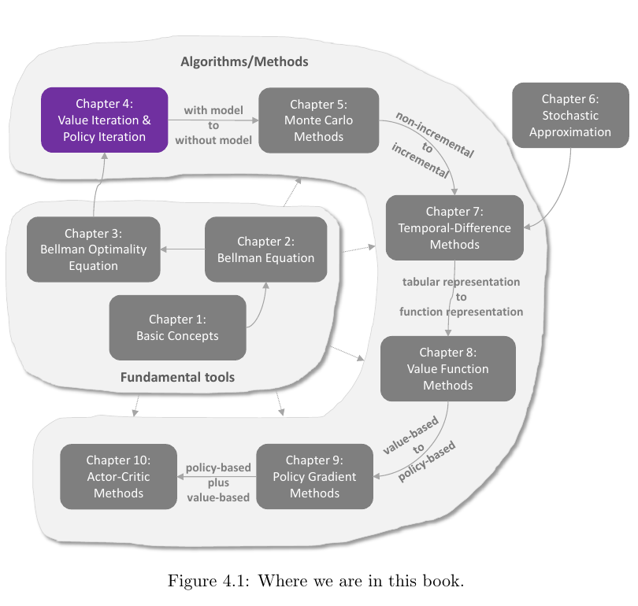
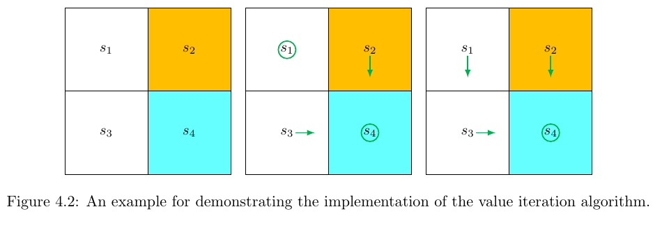
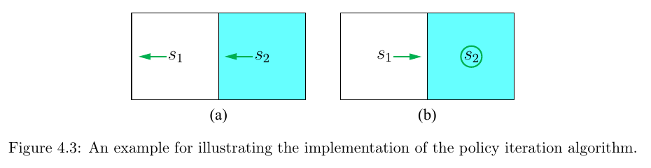
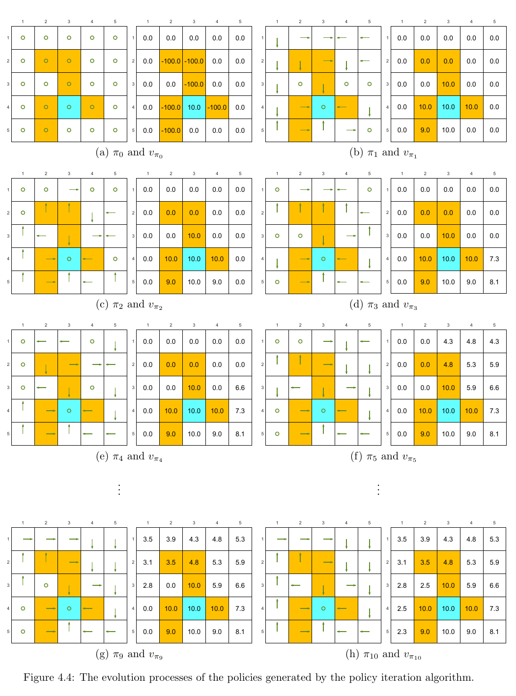
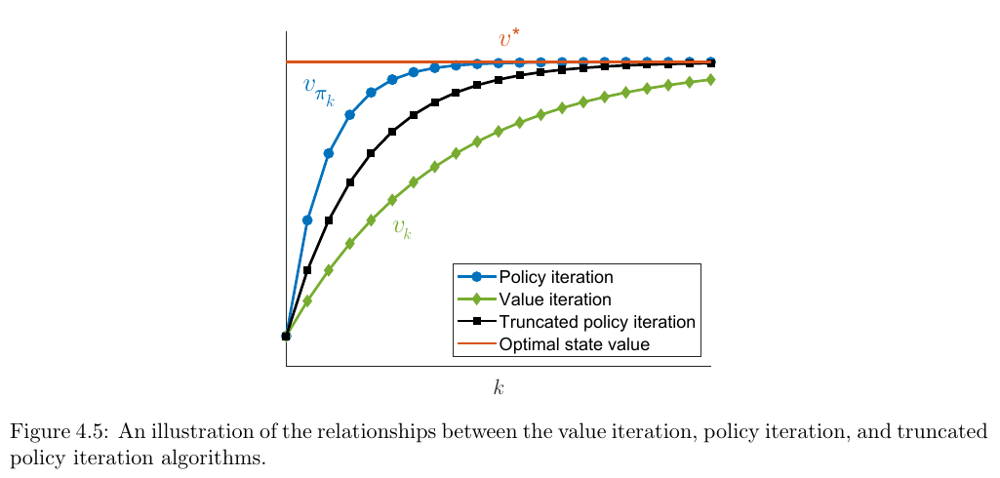

# Chapter 4 - Value Iteration and Policy Iteration

> [!abstract] 本章导读
> 前三章建立了马尔可夫决策过程、Bellman 方程与 Bellman 最优方程。本章第一次把这些理论落实为能够寻找最优策略的具体算法。核心有三种：价值迭代（value iteration）、策略迭代（policy iteration）和截断策略迭代（truncated policy iteration）。三者都在“更新价值”和“更新策略”之间循环，只是策略评价的精确程度不同。理解它们之间的连续关系，是把握广义策略迭代（generalized policy iteration）的关键。

## 0. 本章知识结构

**图解：** Chapter 4 位于“基础工具”与后续“算法/方法”之间。Chapter 3 已证明 Bellman 最优方程的解存在且唯一；本章据此给出第一批寻找最优策略的算法。Chapter 5 以后会把这里依赖系统模型的动态规划思想推广到无模型方法。

本章的逻辑主线是：

$$
\text{Bellman 最优方程}
\longrightarrow
\text{价值迭代}
\longrightarrow
\text{策略迭代}
\longrightarrow
\text{截断策略迭代}
\longrightarrow
\text{广义策略迭代}.
$$

具体来说：

1. 用压缩映射定理给出的迭代直接求解 Bellman 最优方程，得到价值迭代。
2. 把“先准确评价当前策略，再贪心改进策略”组织为策略迭代。
3. 比较两者后发现，它们只是策略评价迭代次数的两个极端。
4. 在两个极端之间截断策略评价，得到截断策略迭代。
5. 抽象出“价值与策略相互推动”的广义策略迭代思想。

## 1. 动态规划方法的定位

本章三种算法都属于动态规划（dynamic programming, DP）算法。它们需要已知系统模型，即对所有状态动作对 $(s,a)$，已知：

$$
p(r\mid s,a),\qquad p(s'\mid s,a).
$$

有了模型，算法可以对所有可能奖励和下一状态求和，而不必先与环境采样。它们虽然依赖模型，却是后续无模型强化学习算法的重要基础。例如，Chapter 5 的 Monte Carlo 方法可以看作对策略迭代思想的扩展。

> [!warning] 易混概念：需要模型与 model-based RL
> 本章末尾特别指出：“算法要求系统模型已知”和“model-based reinforcement learning”不是同一个分类标准。后者通常指从数据估计系统模型，并在学习过程中使用该估计模型；model-free 方法则不进行模型估计。

## 2. 价值迭代

### 2.1 从 Bellman 最优方程到迭代算法

价值迭代是压缩映射定理为求解 Bellman 最优方程直接建议的算法：

$$
v_{k+1}
=\max_{\pi\in\Pi}\left(r_\pi+\gamma P_\pi v_k\right),
\qquad k=0,1,2,\ldots
$$

其中：

- $v_k$ 是第 $k$ 次迭代的价值向量估计；
- $r_\pi$ 是策略 $\pi$ 下的一步期望奖励向量；
- $P_\pi$ 是策略 $\pi$ 下的状态转移矩阵；
- $\gamma\in[0,1)$ 是折扣率；
- $\Pi$ 是策略集合。

由 Chapter 3 的 Theorem 3.3，随着 $k\rightarrow\infty$：

$$
v_k\rightarrow v^*,\qquad \pi_k\rightarrow\pi^*,
$$

其中 $v^*$ 是唯一的最优状态价值，$\pi^*$ 是一个最优策略。

每轮迭代可以拆成两步。

**第一步：策略更新（policy update, PU）**

给定上一轮的 $v_k$，寻找对一步前瞻结果最优的策略：

$$
\pi_{k+1}
=\arg\max_\pi\left(r_\pi+\gamma P_\pi v_k\right).
$$

**第二步：价值更新（value update, VU）**

用新策略进行一次 Bellman 备份：

$$
v_{k+1}
=r_{\pi_{k+1}}+\gamma P_{\pi_{k+1}}v_k.
\tag{4.1}
$$

注意右侧仍然是旧估计 $v_k$，不是新策略的精确状态价值 $v_{\pi_{k+1}}$。

### 2.2 逐元素形式

为了实现算法，需要把矩阵形式展开到每个状态和动作。

先根据 $v_k$ 定义一步前瞻量：

$$
q_k(s,a)
=\sum_{r\in\mathcal R}p(r\mid s,a)r
+\gamma\sum_{s'\in\mathcal S}p(s'\mid s,a)v_k(s').
$$

它把动作 $a$ 的即时奖励与下一状态的当前估计合并起来。

策略更新问题可写成：

$$
\pi_{k+1}(s)
=\arg\max_\pi
\sum_{a\in\mathcal A(s)}\pi(a\mid s)q_k(s,a).
$$

最大值可以由确定性贪心策略取得。令

$$
a_k^*(s)=\arg\max_{a\in\mathcal A(s)}q_k(s,a),
$$

则

$$
\pi_{k+1}(a\mid s)
=\begin{cases}
1, & a=a_k^*(s),\\
0, & a\neq a_k^*(s).
\end{cases}
\tag{4.2}
$$

如果最大动作不唯一，可以任取其中一个，不影响算法收敛。由于新策略总选择当前 $q_k(s,a)$ 最大的动作，所以它是关于 $v_k$ 的**贪心策略（greedy policy）**。

价值更新的逐元素形式为：

$$
\begin{aligned}
v_{k+1}(s)
&=\sum_a\pi_{k+1}(a\mid s)
\left[
\sum_{r\in\mathcal R}p(r\mid s,a)r
+\gamma\sum_{s'}p(s'\mid s,a)v_k(s')
\right]\\
&=\max_a q_k(s,a).
\end{aligned}
$$

于是一次迭代的完整信息流是：

$$
v_k(s)
\longrightarrow q_k(s,a)
\longrightarrow \pi_{k+1}
\longrightarrow v_{k+1}(s)=\max_a q_k(s,a).
$$

### 2.3 Algorithm 4.1：价值迭代算法

#### 目标

求解 Bellman 最优方程，得到 $v^*$ 和一个最优策略。

#### 输入

- 模型 $p(r\mid s,a)$ 与 $p(s'\mid s,a)$；
- 折扣率 $\gamma$；
- 初值 $v_0$；
- 收敛阈值 $\varepsilon>0$。

#### 输出

- 收敛的价值估计；
- 对最终价值估计贪心的策略。

#### 步骤

1. 对每个状态 $s\in\mathcal S$：
2. 对每个动作 $a\in\mathcal A(s)$，计算

$$
q_k(s,a)
=\sum_{r\in\mathcal R}p(r\mid s,a)r
+\gamma\sum_{s'}p(s'\mid s,a)v_k(s').
$$

3. 选取

$$
a_k^*(s)=\arg\max_a q_k(s,a).
$$

4. 更新贪心策略：$\pi_{k+1}(a_k^*(s)\mid s)=1$，其他动作概率为 $0$。
5. 更新价值：

$$
v_{k+1}(s)=\max_a q_k(s,a).
$$

6. 若 $\lVert v_{k+1}-v_k\rVert$ 仍大于预设阈值，则进入下一轮；否则停止。

### 2.4 重要辨析：中间量 $v_k$ 通常不是状态价值

尽管 $v_k$ 最终收敛到 $v^*$，但在收敛前，它通常不满足任何策略的 Bellman 方程。一般既不能保证

$$
v_k=r_{\pi_{k+1}}+\gamma P_{\pi_{k+1}}v_k,
$$

也不能保证

$$
v_k=r_{\pi_k}+\gamma P_{\pi_k}v_k.
$$

因此：

- $v_k$ 只是算法产生的中间向量，不一定等于某个 $v_\pi$；
- 相应的 $q_k(s,a)$ 也不一定是某个策略的真实动作价值；
- 只有极限 $v^*$ 才是最优状态价值。

> [!tip] 一句话记忆
> 价值迭代每轮只做一次 Bellman 最优备份，它“朝状态价值靠近”，但中间估计未必已经是任何策略的状态价值。

### 2.5 Figure 4.2 示例：$2\times2$ 网格

**图解：** 网格有四个状态。$s_2$ 是禁止区域，$s_4$ 是目标区域。左图只显示环境，中图显示第一次迭代得到的策略 $\pi_1$，右图显示第二次迭代得到的最优策略 $\pi_2$。圆圈代表停留动作，箭头代表移动方向。

奖励与折扣设置为：

$$
r_{\text{boundary}}=r_{\text{forbidden}}=-1,\qquad
r_{\text{target}}=1,\qquad
\gamma=0.9.
$$

#### Table 4.1：各状态动作对的 $q$ 表达式

| q-table | $a_1$ | $a_2$ | $a_3$ | $a_4$ | $a_5$ |
|---|---|---|---|---|---|
| $s_1$ | $-1+\gamma v(s_1)$ | $-1+\gamma v(s_2)$ | $0+\gamma v(s_3)$ | $-1+\gamma v(s_1)$ | $0+\gamma v(s_1)$ |
| $s_2$ | $-1+\gamma v(s_2)$ | $-1+\gamma v(s_2)$ | $1+\gamma v(s_4)$ | $0+\gamma v(s_1)$ | $-1+\gamma v(s_2)$ |
| $s_3$ | $0+\gamma v(s_1)$ | $1+\gamma v(s_4)$ | $-1+\gamma v(s_3)$ | $-1+\gamma v(s_3)$ | $0+\gamma v(s_3)$ |
| $s_4$ | $-1+\gamma v(s_2)$ | $-1+\gamma v(s_4)$ | $-1+\gamma v(s_4)$ | $0+\gamma v(s_3)$ | $1+\gamma v(s_4)$ |

这个表把环境的确定性转移与奖励直接代入一步前瞻公式。每个单元格都由“一步奖励 + 下一状态的折扣价值”组成。

#### 第 $k=0$ 轮

从全零初值开始：

$$
v_0(s_1)=v_0(s_2)=v_0(s_3)=v_0(s_4)=0.
$$

代入 Table 4.1 得到 Table 4.2。

#### Table 4.2：$k=0$ 时的 $q_0(s,a)$

| q-table | $a_1$ | $a_2$ | $a_3$ | $a_4$ | $a_5$ |
|---|---:|---:|---:|---:|---:|
| $s_1$ | $-1$ | $-1$ | $0$ | $-1$ | $0$ |
| $s_2$ | $-1$ | $-1$ | $1$ | $0$ | $-1$ |
| $s_3$ | $0$ | $1$ | $-1$ | $-1$ | $0$ |
| $s_4$ | $-1$ | $-1$ | $-1$ | $0$ | $1$ |

一种合法的贪心选择为：

$$
\pi_1(a_5\mid s_1)=1,\quad
\pi_1(a_3\mid s_2)=1,\quad
\pi_1(a_2\mid s_3)=1,\quad
\pi_1(a_5\mid s_4)=1.
$$

在 $s_1$，$a_5$ 与 $a_3$ 的 $q$ 值同为 $0$，教材任选了 $a_5$。这使策略在 $s_1$ 原地停留，所以 $\pi_1$ 还不是最优策略。

价值更新为各行最大值：

$$
v_1(s_1)=0,\qquad
v_1(s_2)=v_1(s_3)=v_1(s_4)=1.
$$

#### 第 $k=1$ 轮

将 $v_1$ 代入 Table 4.1。

#### Table 4.3：$k=1$ 时的 $q_1(s,a)$

| q-table | $a_1$ | $a_2$ | $a_3$ | $a_4$ | $a_5$ |
|---|---|---|---|---|---|
| $s_1$ | $-1+\gamma\cdot0$ | $-1+\gamma\cdot1$ | $0+\gamma\cdot1$ | $-1+\gamma\cdot0$ | $0+\gamma\cdot0$ |
| $s_2$ | $-1+\gamma\cdot1$ | $-1+\gamma\cdot1$ | $1+\gamma\cdot1$ | $0+\gamma\cdot0$ | $-1+\gamma\cdot1$ |
| $s_3$ | $0+\gamma\cdot0$ | $1+\gamma\cdot1$ | $-1+\gamma\cdot1$ | $-1+\gamma\cdot1$ | $0+\gamma\cdot1$ |
| $s_4$ | $-1+\gamma\cdot1$ | $-1+\gamma\cdot1$ | $-1+\gamma\cdot1$ | $0+\gamma\cdot1$ | $1+\gamma\cdot1$ |

贪心策略更新为：

$$
\pi_2(a_3\mid s_1)=1,\quad
\pi_2(a_3\mid s_2)=1,\quad
\pi_2(a_2\mid s_3)=1,\quad
\pi_2(a_5\mid s_4)=1.
$$

新价值为：

$$
\begin{aligned}
v_2(s_1)&=\gamma,\\
v_2(s_2)&=1+\gamma,\\
v_2(s_3)&=1+\gamma,\\
v_2(s_4)&=1+\gamma.
\end{aligned}
$$

此时 $\pi_2$ 已经是最优策略。这个简单例子只需两轮就找到最优策略；更复杂问题仍需继续迭代，直到 $\lVert v_{k+1}-v_k\rVert$ 小于阈值。

## 3. 策略迭代

### 3.1 两个交替步骤

策略迭代不直接逐次应用 Bellman 最优算子。它从当前策略出发，交替执行：

1. **策略评价（policy evaluation, PE）**：精确或近似求出当前策略的状态价值；
2. **策略改进（policy improvement, PI）**：对该状态价值做一步贪心，得到不差于当前策略的新策略。

第 $k$ 轮的策略评价求解：

$$
v_{\pi_k}=r_{\pi_k}+\gamma P_{\pi_k}v_{\pi_k}.
\tag{4.3}
$$

随后策略改进为：

$$
\pi_{k+1}
=\arg\max_\pi
\left(r_\pi+\gamma P_\pi v_{\pi_k}\right).
$$

这里与价值迭代的关键差别是：策略改进使用的 $v_{\pi_k}$ 是当前策略 Bellman 方程的解，是一个真正的状态价值。

### 3.2 怎样完成策略评价？

教材重述了 Chapter 2 的两种方法。

#### 方法一：闭式解

$$
v_{\pi_k}
=\left(I-\gamma P_{\pi_k}\right)^{-1}r_{\pi_k}.
$$

闭式解便于理论分析，但计算矩阵逆在实现上通常效率不高。

#### 方法二：迭代求解

从任意初值 $v_{\pi_k}^{(0)}$ 出发：

$$
v_{\pi_k}^{(j+1)}
=r_{\pi_k}+\gamma P_{\pi_k}v_{\pi_k}^{(j)},
\qquad j=0,1,2,\ldots
\tag{4.4}
$$

当 $j\rightarrow\infty$ 时：

$$
v_{\pi_k}^{(j)}\rightarrow v_{\pi_k}.
$$

所以策略迭代的外层本身是迭代算法，而每次策略评价内部又嵌套一个迭代过程。理论上要无限次内部更新才能得到精确 $v_{\pi_k}$；实践中通常在以下任一条件满足时停止：

- $\lVert v_{\pi_k}^{(j+1)}-v_{\pi_k}^{(j)}\rVert$ 小于阈值；
- 内部迭代次数达到预设上限。

有限次评价得到的是近似值。Section 4.3 会说明，即使如此也能形成有效算法。

### 3.3 Lemma 4.1：策略改进

> [!theorem] Lemma 4.1 - Policy improvement
> 若
> $$
> \pi_{k+1}=\arg\max_\pi\left(r_\pi+\gamma P_\pi v_{\pi_k}\right),
> $$
> 则
> $$
> v_{\pi_{k+1}}\geq v_{\pi_k},
> $$
> 其中不等式按状态逐元素成立。

#### Box 4.1：证明

两个策略的真实状态价值分别满足：

$$
v_{\pi_{k+1}}
=r_{\pi_{k+1}}+\gamma P_{\pi_{k+1}}v_{\pi_{k+1}},
$$

$$
v_{\pi_k}
=r_{\pi_k}+\gamma P_{\pi_k}v_{\pi_k}.
$$

由于 $\pi_{k+1}$ 对 $v_{\pi_k}$ 贪心：

$$
r_{\pi_{k+1}}+\gamma P_{\pi_{k+1}}v_{\pi_k}
\geq
r_{\pi_k}+\gamma P_{\pi_k}v_{\pi_k}.
$$

因此：

$$
\begin{aligned}
v_{\pi_k}-v_{\pi_{k+1}}
&=\left(r_{\pi_k}+\gamma P_{\pi_k}v_{\pi_k}\right)
-\left(r_{\pi_{k+1}}+\gamma P_{\pi_{k+1}}v_{\pi_{k+1}}\right)\\
&\leq
\left(r_{\pi_{k+1}}+\gamma P_{\pi_{k+1}}v_{\pi_k}\right)
-\left(r_{\pi_{k+1}}+\gamma P_{\pi_{k+1}}v_{\pi_{k+1}}\right)\\
&=\gamma P_{\pi_{k+1}}
\left(v_{\pi_k}-v_{\pi_{k+1}}\right).
\end{aligned}
$$

反复代入得到：

$$
\begin{aligned}
v_{\pi_k}-v_{\pi_{k+1}}
&\leq \gamma^2P_{\pi_{k+1}}^2
\left(v_{\pi_k}-v_{\pi_{k+1}}\right)\\
&\leq\cdots\\
&\leq\gamma^nP_{\pi_{k+1}}^n
\left(v_{\pi_k}-v_{\pi_{k+1}}\right)\\
&\longrightarrow0.
\end{aligned}
$$

因为 $\gamma^n\rightarrow0$，且 $P_{\pi_{k+1}}^n$ 始终是非负随机矩阵，所以

$$
v_{\pi_k}-v_{\pi_{k+1}}\leq0,
$$

即 $v_{\pi_{k+1}}\geq v_{\pi_k}$。

> [!tip] 证明的核心思想
> 新策略先保证在旧价值 $v_{\pi_k}$ 上的一步前瞻不差，再利用新策略的 Bellman 方程把这个“一步不差”传播到无限未来。

### 3.4 Theorem 4.1：策略迭代收敛

策略迭代产生两列对象：

$$
\{\pi_0,\pi_1,\ldots\},
\qquad
\{v_{\pi_0},v_{\pi_1},\ldots\}.
$$

Lemma 4.1 给出单调性，而最优价值给出上界：

$$
v_{\pi_0}
\leq v_{\pi_1}
\leq v_{\pi_2}
\leq\cdots
\leq v^*.
$$

因此状态价值序列单调有界，必收敛。

> [!theorem] Theorem 4.1 - Convergence of policy iteration
> 策略迭代生成的状态价值序列 $\{v_{\pi_k}\}_{k=0}^{\infty}$ 收敛到最优状态价值 $v^*$；相应策略序列收敛到一个最优策略。

#### Box 4.2：证明与价值迭代的比较

引入从 $v_0$ 开始的价值迭代序列：

$$
v_{k+1}=f(v_k)
=\max_\pi\left(r_\pi+\gamma P_\pi v_k\right).
$$

已知 $v_k\rightarrow v^*$。对任意初始策略 $\pi_0$，总能选择 $v_0$ 使

$$
v_0\leq v_{\pi_0}.
$$

下面归纳证明：

$$
v_k\leq v_{\pi_k}\leq v^*.
$$

假设 $v_k\leq v_{\pi_k}$。令

$$
\pi_k'
=\arg\max_\pi\left(r_\pi+\gamma P_\pi v_k\right).
$$

则：

$$
\begin{aligned}
v_{\pi_{k+1}}-v_{k+1}
&=\left(r_{\pi_{k+1}}+\gamma P_{\pi_{k+1}}v_{\pi_{k+1}}\right)
-\max_\pi\left(r_\pi+\gamma P_\pi v_k\right)\\
&\geq
\left(r_{\pi_{k+1}}+\gamma P_{\pi_{k+1}}v_{\pi_k}\right)
-\max_\pi\left(r_\pi+\gamma P_\pi v_k\right)\\
&\geq
\left(r_{\pi_k'}+\gamma P_{\pi_k'}v_{\pi_k}\right)
-\left(r_{\pi_k'}+\gamma P_{\pi_k'}v_k\right)\\
&=\gamma P_{\pi_k'}\left(v_{\pi_k}-v_k\right)\\
&\geq0.
\end{aligned}
$$

第一处不等式使用 Lemma 4.1 与 $P_{\pi_{k+1}}\geq0$，第二处使用 $\pi_{k+1}$ 对 $v_{\pi_k}$ 贪心。于是 $v_{k+1}\leq v_{\pi_{k+1}}$。又因 $v_{\pi_k}\leq v^*$，归纳成立。

最后，由

$$
v_k\leq v_{\pi_k}\leq v^*,
\qquad v_k\rightarrow v^*,
$$

夹逼得到 $v_{\pi_k}\rightarrow v^*$。

这也解释了教材所说的“策略迭代通常比价值迭代更快”：在相同起点和理论比较条件下，策略迭代的价值序列位于价值迭代序列之上，更快靠近 $v^*$，代价是每轮策略评价更昂贵。

### 3.5 逐元素形式与 Algorithm 4.2

策略评价的逐元素迭代为：

$$
v_{\pi_k}^{(j+1)}(s)
=\sum_a\pi_k(a\mid s)
\left[
\sum_{r\in\mathcal R}p(r\mid s,a)r
+\gamma\sum_{s'}p(s'\mid s,a)v_{\pi_k}^{(j)}(s')
\right].
$$

评价完成后，计算当前策略价值的一步动作价值：

$$
q_{\pi_k}(s,a)
=\sum_{r\in\mathcal R}p(r\mid s,a)r
+\gamma\sum_{s'}p(s'\mid s,a)v_{\pi_k}(s').
$$

令

$$
a_k^*(s)=\arg\max_a q_{\pi_k}(s,a),
$$

并更新：

$$
\pi_{k+1}(a\mid s)
=\begin{cases}
1, & a=a_k^*(s),\\
0, & a\neq a_k^*(s).
\end{cases}
$$

#### Algorithm 4.2：策略迭代算法

**输入：** 模型 $p(r\mid s,a)$、$p(s'\mid s,a)$，折扣率 $\gamma$，初始策略 $\pi_0$，内外层停止条件。

**目标：** 求最优状态价值和一个最优策略。

**外层第 $k$ 轮：**

1. 策略评价：从任意 $v_{\pi_k}^{(0)}$ 开始，重复 Bellman 期望备份，直到 $v_{\pi_k}^{(j)}$ 收敛。
2. 策略改进：对每个状态计算 $q_{\pi_k}(s,a)$，选取最大动作，形成确定性贪心策略 $\pi_{k+1}$。
3. 若策略或其价值不再变化，则停止；否则进入下一轮。

**输出：** 收敛的状态价值和贪心策略。

### 3.6 Figure 4.3：两状态示例

**图解：** 有两个状态和三个动作：

$$
\mathcal A=\{a_\ell,a_0,a_r\},
$$

分别表示向左、保持不动、向右。目标在 $s_2$，奖励设置为

$$
r_{\text{boundary}}=-1,\qquad
r_{\text{target}}=1,\qquad
\gamma=0.9.
$$

Figure 4.3(a) 的初始策略 $\pi_0$ 在两个状态都向左，不会朝目标前进；Figure 4.3(b) 是一次策略改进后的最优策略。

#### 第一步：评价 $\pi_0$

Bellman 方程为：

$$
\begin{aligned}
v_{\pi_0}(s_1)&=-1+\gamma v_{\pi_0}(s_1),\\
v_{\pi_0}(s_2)&=0+\gamma v_{\pi_0}(s_1).
\end{aligned}
$$

直接解得：

$$
v_{\pi_0}(s_1)=-10,\qquad
v_{\pi_0}(s_2)=-9.
$$

若从 $v_{\pi_0}^{(0)}(s_1)=v_{\pi_0}^{(0)}(s_2)=0$ 迭代，则：

$$
\begin{aligned}
v_{\pi_0}^{(1)}(s_1)&=-1,&
v_{\pi_0}^{(1)}(s_2)&=0,\\
v_{\pi_0}^{(2)}(s_1)&=-1.9,&
v_{\pi_0}^{(2)}(s_2)&=-0.9,\\
v_{\pi_0}^{(3)}(s_1)&=-2.71,&
v_{\pi_0}^{(3)}(s_2)&=-1.71.
\end{aligned}
$$

继续迭代会分别趋于 $-10$ 与 $-9$。

#### 第二步：改进策略

#### Table 4.4：一般 $q_{\pi_k}(s,a)$ 表达式

| $q_{\pi_k}(s,a)$ | $a_\ell$ | $a_0$ | $a_r$ |
|---|---|---|---|
| $s_1$ | $-1+\gamma v_{\pi_k}(s_1)$ | $0+\gamma v_{\pi_k}(s_1)$ | $1+\gamma v_{\pi_k}(s_2)$ |
| $s_2$ | $0+\gamma v_{\pi_k}(s_1)$ | $1+\gamma v_{\pi_k}(s_2)$ | $-1+\gamma v_{\pi_k}(s_2)$ |

把 $v_{\pi_0}(s_1)=-10$、$v_{\pi_0}(s_2)=-9$ 代入：

#### Table 4.5：$k=0$ 时的 $q_{\pi_0}(s,a)$

| $q_{\pi_0}(s,a)$ | $a_\ell$ | $a_0$ | $a_r$ |
|---|---:|---:|---:|
| $s_1$ | $-10$ | $-9$ | $-7.1$ |
| $s_2$ | $-9$ | $-7.1$ | $-9.1$ |

逐行取最大值得到：

$$
\pi_1(a_r\mid s_1)=1,\qquad
\pi_1(a_0\mid s_2)=1.
$$

这就是 Figure 4.3(b) 的最优策略。本例一次外层迭代即可完成策略改进。

### 3.7 Figure 4.4：复杂网格中的演化

**图解：** 每个编号子图同时给出策略和对应的真实状态价值。橙色是禁止区域，青色是目标区域。奖励为

$$
r_{\text{boundary}}=-1,\qquad
r_{\text{forbidden}}=-10,\qquad
r_{\text{target}}=1,\qquad
\gamma=0.9.
$$

从随机策略 $\pi_0$ 出发，算法最终在 $\pi_{10}$ 达到最优。图中有两个重要现象：

1. **策略从目标附近向外改善。** 靠近目标的状态较早找到通往目标的正确动作；更远状态随后通过这些已改善状态形成更长的最优路径。
2. **价值随离目标的距离下降。** 距离越远，需要越多步才能获得正奖励，折扣使该奖励的当前价值更小。

## 4. 截断策略迭代

### 4.1 为什么需要统一视角？

价值迭代和策略迭代都包含“价值步骤”和“策略步骤”，但价值步骤的计算量不同。

**策略迭代：**

$$
\pi_0
\xrightarrow{\mathrm{PE}}v_{\pi_0}
\xrightarrow{\mathrm{PI}}\pi_1
\xrightarrow{\mathrm{PE}}v_{\pi_1}
\xrightarrow{\mathrm{PI}}\cdots
$$

**价值迭代：**

$$
v_0
\xrightarrow{\mathrm{PU}}\pi_1'
\xrightarrow{\mathrm{VU}}v_1
\xrightarrow{\mathrm{PU}}\pi_2'
\xrightarrow{\mathrm{VU}}v_2
\longrightarrow\cdots
$$

为了公平比较，教材令两者从相同条件开始：

$$
v_0=v_{\pi_0}.
$$

#### Table 4.6：策略迭代与价值迭代的步骤比较

| 步骤 | 策略迭代 | 价值迭代 | 说明 |
|---|---|---|---|
| 1 策略 | $\pi_0$ | N/A | 策略迭代从策略开始 |
| 2 价值 | $v_{\pi_0}=r_{\pi_0}+\gamma P_{\pi_0}v_{\pi_0}$ | $v_0=v_{\pi_0}$ | 设定相同起点 |
| 3 策略 | $\pi_1=\arg\max_\pi(r_\pi+\gamma P_\pi v_{\pi_0})$ | $\pi_1'=\arg\max_\pi(r_\pi+\gamma P_\pi v_0)$ | 两个策略相同 |
| 4 价值 | $v_{\pi_1}=r_{\pi_1}+\gamma P_{\pi_1}v_{\pi_1}$ | $v_1=r_{\pi_1}+\gamma P_{\pi_1}v_0$ | $v_{\pi_1}\geq v_1$，因为 $v_{\pi_1}\geq v_{\pi_0}$ |
| 5 策略 | $\pi_2=\arg\max_\pi(r_\pi+\gamma P_\pi v_{\pi_1})$ | $\pi_2'=\arg\max_\pi(r_\pi+\gamma P_\pi v_1)$ | 此后可能不同 |

前 3 步相同，差异在第 4 步：

- 价值迭代只对 $\pi_1$ 做一次 Bellman 备份；
- 策略迭代把 $\pi_1$ 的 Bellman 方程一直迭代到收敛。

显式写出这一评价过程。令

$$
v_{\pi_1}^{(0)}=v_0,
$$

并迭代：

$$
v_{\pi_1}^{(j)}
=r_{\pi_1}+\gamma P_{\pi_1}v_{\pi_1}^{(j-1)}.
$$

那么：

- 只迭代 $1$ 次，$v_{\pi_1}^{(1)}=v_1$，对应价值迭代；
- 迭代有限次 $j_{\text{truncate}}$，得到截断策略迭代；
- 迭代到 $j\rightarrow\infty$，得到 $v_{\pi_1}$，对应策略迭代。

因此：

$$
\text{价值迭代}
\quad\Longleftrightarrow\quad
j_{\text{truncate}}=1,
$$

$$
\text{策略迭代}
\quad\Longleftrightarrow\quad
j_{\text{truncate}}=\infty.
$$

教材强调，这个直接比较依赖相同初始条件 $v_{\pi_1}^{(0)}=v_0=v_{\pi_0}$；没有该条件，不能直接按上述方式比较两条序列。

### 4.2 Algorithm 4.3：截断策略迭代

截断策略迭代与策略迭代的区别只有一个：策略评价只运行有限次。

#### 输入

- 模型 $p(r\mid s,a)$ 与 $p(s'\mid s,a)$；
- 折扣率 $\gamma$；
- 初始策略 $\pi_0$；
- 策略评价最大次数 $j_{\text{truncate}}$；
- 外层停止条件。

#### 第 $k$ 轮

1. 以先前外层价值估计初始化：

$$
v_k^{(0)}=v_{k-1}.
$$

2. 固定当前策略 $\pi_k$，做 $j_{\text{truncate}}$ 次评价更新：

$$
v_k^{(j+1)}(s)
=\sum_a\pi_k(a\mid s)
\left[
\sum_{r\in\mathcal R}p(r\mid s,a)r
+\gamma\sum_{s'}p(s'\mid s,a)v_k^{(j)}(s')
\right].
$$

3. 令

$$
v_k=v_k^{(j_{\text{truncate}})}.
$$

4. 用 $v_k$ 计算：

$$
q_k(s,a)
=\sum_{r\in\mathcal R}p(r\mid s,a)r
+\gamma\sum_{s'}p(s'\mid s,a)v_k(s').
$$

5. 令 $\pi_{k+1}$ 对 $q_k$ 贪心。
6. 若 $v_k$ 尚未收敛，则继续外层迭代。

#### 输出

收敛的价值估计和对应的贪心策略。

由于策略评价未完成，$v_k^{(j)}$ 与 $v_k$ 通常不是真实状态价值，只是 $v_{\pi_k}$ 的近似。

### 4.3 Figure 4.5：三种算法的连续关系

**图解：** 横轴是外层迭代次数 $k$，红线是最优状态价值 $v^*$。在教材的示意比较中：

- 价值迭代每轮评价最少，单轮便宜，但外层靠近 $v^*$ 较慢；
- 策略迭代把每轮策略评价做充分，外层靠近 $v^*$ 较快，但单轮昂贵；
- 截断策略迭代位于两者之间，以有限的额外评价计算换取更快的外层收敛。

> [!note] 补充理解
> 这幅图表达的是算法关系与典型趋势，不是对所有问题逐点速度的无条件保证。

### 4.4 Proposition 4.1：策略评价中的价值改进

> [!theorem] Proposition 4.1 - Value improvement
> 考虑固定策略 $\pi_k$ 的评价迭代
> $$
> v_{\pi_k}^{(j+1)}
> =r_{\pi_k}+\gamma P_{\pi_k}v_{\pi_k}^{(j)}.
> $$
> 若初值选择为
> $$
> v_{\pi_k}^{(0)}=v_{\pi_{k-1}},
> $$
> 则对所有 $j=0,1,2,\ldots$，有
> $$
> v_{\pi_k}^{(j+1)}\geq v_{\pi_k}^{(j)}.
> $$

#### Box 4.3：证明

相邻两次评价估计之差满足：

$$
\begin{aligned}
v_{\pi_k}^{(j+1)}-v_{\pi_k}^{(j)}
&=\gamma P_{\pi_k}
\left(v_{\pi_k}^{(j)}-v_{\pi_k}^{(j-1)}\right)\\
&=\cdots\\
&=\gamma^jP_{\pi_k}^j
\left(v_{\pi_k}^{(1)}-v_{\pi_k}^{(0)}\right).
\end{aligned}
\tag{4.5}
$$

先证明第一步非负。因为 $v_{\pi_k}^{(0)}=v_{\pi_{k-1}}$：

$$
\begin{aligned}
v_{\pi_k}^{(1)}
&=r_{\pi_k}+\gamma P_{\pi_k}v_{\pi_k}^{(0)}\\
&=r_{\pi_k}+\gamma P_{\pi_k}v_{\pi_{k-1}}\\
&\geq r_{\pi_{k-1}}+\gamma P_{\pi_{k-1}}v_{\pi_{k-1}}\\
&=v_{\pi_{k-1}}\\
&=v_{\pi_k}^{(0)}.
\end{aligned}
$$

不等式来自 $\pi_k$ 对 $v_{\pi_{k-1}}$ 的贪心改进。再由 $P_{\pi_k}$ 非负，把

$$
v_{\pi_k}^{(1)}-v_{\pi_k}^{(0)}\geq0
$$

代入式 (4.5)，即可得到每一步都非减。

> [!warning] Proposition 4.1 的适用限制
> 该命题假定评价初值是真实的 $v_{\pi_{k-1}}$。实践中通常只有上一轮近似 $v_{k-1}$，并不能直接获得精确 $v_{\pi_{k-1}}$。因此这个命题为收敛直觉提供支持，但教材明确指出，更深入的严格讨论需要额外分析。

### 4.5 怎样选择截断次数？

教材给出的总体原则是：运行少量评价迭代，但不要过多。

- 次数太少：接近价值迭代，单轮便宜，但外层可能需要更多轮；
- 次数适中：常能显著改善外层收敛速度；
- 次数过多：越来越接近完整策略迭代，额外计算未必继续带来显著收益。

所以 $j_{\text{truncate}}$ 体现了“单轮计算量”和“外层收敛速度”的折中。

## 5. 三种算法与广义策略迭代

三种算法的共同点是，每轮都有一个价值相关步骤和一个策略相关步骤。

| 方法 | 价值步骤 | 策略步骤 | 中间价值是否一定是真实状态价值 | 两个极端中的位置 |
|---|---|---|---|---|
| 价值迭代 | 对贪心策略做一次备份 | 根据 $v_k$ 更新贪心策略 | 否 | $j_{\text{truncate}}=1$ |
| 截断策略迭代 | 固定策略做有限次评价 | 根据近似价值改进策略 | 否 | $1<j_{\text{truncate}}<\infty$ |
| 策略迭代 | 把当前策略评价到收敛 | 根据 $v_{\pi_k}$ 改进策略 | 是 | $j_{\text{truncate}}=\infty$ |

这种价值更新与策略更新相互作用的通用思想称为**广义策略迭代（generalized policy iteration, GPI）**。GPI 不是某一个固定算法，而是一个算法设计框架：

$$
\text{价值估计更准确}
\longrightarrow
\text{策略变得更贪心}
\longrightarrow
\text{新的策略价值}
\longrightarrow
\text{继续评价与改进}.
$$

策略推动价值估计改变，价值估计又推动策略变得更优。教材后续的大多数强化学习算法都可纳入这一框架。

## 6. 本章总结

本章从“怎样把 Bellman 理论变成寻找最优策略的算法”出发。

首先，Bellman 最优算子的压缩性质直接产生价值迭代。它每轮根据当前价值构造贪心策略，再做一次价值备份，因而实现简单且保证收敛，但中间 $v_k$ 通常不属于任何策略。

随后，策略迭代把问题拆成完整的策略评价和策略改进。策略改进引理保证每次贪心更新都不会降低状态价值；通过与价值迭代序列比较，可以证明策略价值收敛到 $v^*$。

最后，教材发现两种算法的本质差异只是策略评价的迭代次数。评价一次得到价值迭代，评价到无穷得到策略迭代，评价有限多次得到截断策略迭代。这一连续谱揭示了广义策略迭代的核心：价值与策略彼此促进，共同逼近最优解。

## 7. 教材 Q&A

### Q1：价值迭代保证找到最优策略吗？

是。价值迭代正是压缩映射定理建议的 Bellman 最优方程求解算法，其收敛由该定理保证。

### Q2：价值迭代的中间 $v_k$ 是状态价值吗？

通常不是，因为它不保证满足任何策略的 Bellman 方程。

### Q3：策略迭代包含哪些步骤？

每轮包含策略评价和策略改进。前者求当前策略的状态价值，后者根据该价值构造更优策略。

### Q4：策略迭代中是否嵌套了另一个迭代算法？

是。策略评价通常通过式 (4.4) 的迭代算法求解当前策略的 Bellman 方程。

### Q5：策略迭代的中间价值是状态价值吗？

在完整策略评价的理论算法中是，因为每个 $v_{\pi_k}$ 都是当前策略 Bellman 方程的解。

### Q6：策略迭代保证找到最优策略吗？

是。Lemma 4.1 与 Theorem 4.1 给出了改进性和收敛性证明。

### Q7：截断策略迭代与策略迭代有什么关系？

截断策略迭代只执行有限次策略评价，而完整策略迭代把策略评价执行到收敛。

### Q8：截断策略迭代与价值迭代有什么关系？

价值迭代是截断策略迭代只做一次策略评价更新的极端情形。

### Q9：截断策略迭代的中间价值是状态价值吗？

通常不是。有限次评价只能得到真实策略价值的近似；只有评价到收敛才得到 $v_{\pi_k}$。

### Q10：策略评价应截断在多少次？

一般做少量迭代，但不宜过多。少量额外评价可以加快总体收敛，过多评价的边际收益可能很小。

### Q11：什么是广义策略迭代？

它不是单个算法，而是价值更新与策略更新相互作用的通用思想。教材后续大多数算法都属于这一范畴。

### Q12：model-based 与 model-free 强化学习怎样区分？

model-based 方法从数据估计模型并在学习过程中使用它；model-free 方法不进行模型估计。本章 DP 算法直接要求系统模型已知，因此教材通常把它们称为动态规划算法，而不是强化学习算法。

## 8. 一页式复习

### 三个核心更新

**价值迭代：**

$$
v_{k+1}=\max_\pi(r_\pi+\gamma P_\pi v_k).
$$

**策略评价：**

$$
v_{\pi_k}^{(j+1)}
=r_{\pi_k}+\gamma P_{\pi_k}v_{\pi_k}^{(j)}.
$$

**策略改进：**

$$
\pi_{k+1}=\arg\max_\pi(r_\pi+\gamma P_\pi v_{\pi_k}).
$$

### 三种方法的关系

$$
j_{\text{truncate}}=1
\Rightarrow\text{价值迭代},
$$

$$
1<j_{\text{truncate}}<\infty
\Rightarrow\text{截断策略迭代},
$$

$$
j_{\text{truncate}}=\infty
\Rightarrow\text{策略迭代}.
$$

### 必记结论

- 价值迭代直接求解 Bellman 最优方程，收敛由压缩映射定理保证。
- 价值迭代中间 $v_k$ 和 $q_k$ 通常不是真实策略价值。
- 完整策略迭代的 $v_{\pi_k}$ 是真实状态价值。
- 贪心策略改进保证 $v_{\pi_{k+1}}\geq v_{\pi_k}$。
- 策略迭代的状态价值序列收敛到 $v^*$。
- 截断策略迭代用评价精度换取计算效率。
- GPI 指价值和策略相互推动，不是某个特定算法。
- 本章算法要求已知系统模型。

## 9. 公式清单

| 公式 | 名称 | 作用 | 使用场景 |
|---|---|---|---|
| $v_{k+1}=\max_\pi(r_\pi+\gamma P_\pi v_k)$ | 价值迭代 | 应用 Bellman 最优备份 | 求 $v^*$ |
| $q_k(s,a)=\sum_{r\in\mathcal R}p(r\mid s,a)r+\gamma\sum_{s'}p(s'\mid s,a)v_k(s')$ | 一步前瞻 | 比较当前价值下的动作 | 贪心更新 |
| $v_{k+1}(s)=\max_a q_k(s,a)$ | 逐状态价值更新 | 取最优动作备份 | Algorithm 4.1 |
| $v_{\pi_k}=r_{\pi_k}+\gamma P_{\pi_k}v_{\pi_k}$ | 策略 Bellman 方程 | 定义当前策略的真实价值 | 策略评价 |
| $v_{\pi_k}=(I-\gamma P_{\pi_k})^{-1}r_{\pi_k}$ | 策略评价闭式解 | 理论求解当前策略价值 | 理论分析 |
| $v_{\pi_k}^{(j+1)}=r_{\pi_k}+\gamma P_{\pi_k}v_{\pi_k}^{(j)}$ | 迭代策略评价 | 逐步逼近 $v_{\pi_k}$ | 策略迭代、截断策略迭代 |
| $\pi_{k+1}=\arg\max_\pi(r_\pi+\gamma P_\pi v_{\pi_k})$ | 策略改进 | 对当前策略价值贪心 | Policy improvement |
| $v_{\pi_{k+1}}\geq v_{\pi_k}$ | 策略改进引理 | 保证策略不会变差 | 收敛证明 |
| $v_{\pi_k}^{(j+1)}-v_{\pi_k}^{(j)}=\gamma^jP_{\pi_k}^j(v_{\pi_k}^{(1)}-v_{\pi_k}^{(0)})$ | 评价增量传播 | 证明评价序列单调 | Proposition 4.1 |

## 10. 符号表

| 符号 | 含义 |
|---|---|
| $\mathcal S$ | 状态集合 |
| $\mathcal A(s)$ | 状态 $s$ 下的可行动作集合 |
| $\Pi$ | 策略集合 |
| $\pi_k$ | 外层第 $k$ 轮的策略 |
| $v_k$ | 价值迭代或截断算法的中间价值估计 |
| $v_{\pi_k}$ | 策略 $\pi_k$ 的真实状态价值 |
| $v_{\pi_k}^{(j)}$ | 评价策略 $\pi_k$ 时第 $j$ 次内部估计 |
| $q_k(s,a)$ | 由中间估计 $v_k$ 构造的一步前瞻量 |
| $q_{\pi_k}(s,a)$ | 策略 $\pi_k$ 的动作价值 |
| $r_\pi$ | 策略 $\pi$ 下的一步期望奖励向量 |
| $P_\pi$ | 策略 $\pi$ 下的状态转移矩阵 |
| $\gamma$ | 折扣率 |
| $k$ | 外层策略或价值迭代索引 |
| $j$ | 策略评价的内层迭代索引 |
| $j_{\text{truncate}}$ | 截断策略评价的最大迭代次数 |
| $v^*$ | 唯一最优状态价值 |
| $\pi^*$ | 一个最优策略 |

## 11. 术语表

| English | 中文 | 简单解释 |
|---|---|---|
| dynamic programming | 动态规划 | 已知模型时通过递推关系求解控制问题的方法 |
| value iteration | 价值迭代 | 反复应用 Bellman 最优备份 |
| policy update | 策略更新 | 根据中间价值构造贪心策略 |
| value update | 价值更新 | 用新贪心策略执行一次备份 |
| policy iteration | 策略迭代 | 完整评价当前策略后再改进策略 |
| policy evaluation | 策略评价 | 求固定策略的状态价值 |
| policy improvement | 策略改进 | 对当前策略价值贪心得到更优策略 |
| greedy policy | 贪心策略 | 在每个状态选择当前估计下最大动作的策略 |
| truncated policy iteration | 截断策略迭代 | 每轮只做有限次策略评价的策略迭代 |
| generalized policy iteration | 广义策略迭代 | 价值更新与策略更新相互作用的通用框架 |
| model-based reinforcement learning | 基于模型的强化学习 | 从数据估计模型并在学习中使用模型 |
| model-free reinforcement learning | 无模型强化学习 | 学习过程中不进行模型估计 |

## 12. 常见误区

> [!warning] 易错点 1：把 $v_k$ 都叫作“某个策略的状态价值”
> 价值迭代和截断策略迭代的中间 $v_k$ 通常不满足任何策略的 Bellman 方程。只有完整策略评价得到的 $v_{\pi_k}$ 才必然是当前策略的状态价值。

> [!warning] 易错点 2：认为策略迭代直接求解 Bellman 最优方程
> 直接应用 Bellman 最优算子的是价值迭代。策略迭代通过“评价当前策略 + 贪心改进”间接到达最优策略。

> [!warning] 易错点 3：策略评价只做一次仍叫完整策略迭代
> 只做一次时已经落在价值迭代这一极端；有限次属于截断策略迭代；评价到收敛才是理论上的完整策略迭代。

> [!warning] 易错点 4：外层更快等于总计算一定更少
> 策略迭代可能需要更少外层轮数，但每轮包含昂贵的策略评价。总成本取决于问题规模、评价方法与停止条件。

> [!warning] 易错点 5：贪心策略必须唯一
> 若多个动作达到相同最大值，可以任选一个形成确定性策略，也可以在最大动作之间随机化；最优性不因此消失。

> [!warning] 易错点 6：要求已知模型就等于 model-based RL
> 本章 DP 方法直接使用给定模型；model-based RL 强调从数据估计模型并用于学习，两者语境不同。

> [!warning] 易错点 7：Figure 4.5 是无条件的精确速度定理
> 它用于说明三种方法的关系和典型权衡。教材的直接序列比较依赖相同初始条件，不能脱离条件机械比较所有问题的运行时间。

## 13. 自测题

### 13.1 概念题

1. 价值迭代每轮的两个步骤是什么？

> [!success]- 点击查看答案
>
> 先根据 $v_k$ 对一步前瞻量贪心，得到 $\pi_{k+1}$；再用该策略对 $v_k$ 做一次价值备份，得到 $v_{k+1}$。

2. 为什么价值迭代中的 $v_k$ 通常不是状态价值？

> [!success]- 点击查看答案
>
> 因为它通常不满足任何固定策略的 Bellman 方程。它只是 Bellman 最优算子迭代产生的中间向量。

3. 策略评价与策略改进分别解决什么问题？

> [!success]- 点击查看答案
>
> 策略评价求当前策略 $\pi_k$ 的真实状态价值 $v_{\pi_k}$；策略改进以该价值为基准，对动作一步前瞻并构造贪心新策略 $\pi_{k+1}$。

4. 为什么 Lemma 4.1 能保证策略价值序列单调不减？

> [!success]- 点击查看答案
>
> 新策略对旧策略价值 $v_{\pi_k}$ 贪心，因此一步前瞻不差于旧策略；利用新策略的 Bellman 方程和非负转移矩阵，可把这个不等式传播到无限未来，得到 $v_{\pi_{k+1}}\geq v_{\pi_k}$。

5. 截断策略迭代怎样统一价值迭代和策略迭代？

> [!success]- 点击查看答案
>
> 统一参数是每轮策略评价的次数。做一次对应价值迭代，做有限多次对应截断策略迭代，做到收敛或理论上的无限次对应策略迭代。

6. 广义策略迭代是不是一个固定伪代码？

> [!success]- 点击查看答案
>
> 不是。它是价值估计与策略改进相互作用的通用思想，许多具体算法都可以实现这种思想。

### 13.2 判断与推导题

7. 判断：若 $q_k(s,a)$ 有两个并列最大动作，价值迭代无法继续。

> [!success]- 点击查看答案
>
> 错误。任选一个最大动作即可形成确定性贪心策略，不影响收敛。

8. 判断：策略迭代每轮外层计算一定比价值迭代便宜。

> [!success]- 点击查看答案
>
> 错误。完整策略评价需要多次内层迭代或求解线性方程，单轮通常更昂贵；它的优势是外层可能更快靠近最优价值。

9. 从

$$
v_{\pi_k}-v_{\pi_{k+1}}
\leq\gamma P_{\pi_{k+1}}
\left(v_{\pi_k}-v_{\pi_{k+1}}\right)
$$

说明为什么能推出 $v_{\pi_{k+1}}\geq v_{\pi_k}$。

> [!success]- 点击查看答案
>
> 反复代入右侧得到上界
>
> $$
> \gamma^nP_{\pi_{k+1}}^n
> \left(v_{\pi_k}-v_{\pi_{k+1}}\right).
> $$
>
> 由于 $0\leq\gamma<1$，$\gamma^n\rightarrow0$；而 $P_{\pi_{k+1}}^n$ 是非负随机矩阵，不会使向量无界增长。因此右侧趋于零，得到 $v_{\pi_k}-v_{\pi_{k+1}}\leq0$。

10. 在 Figure 4.3 的两状态例子中，验证 $s_1$ 下动作 $a_r$ 的值为 $-7.1$。

> [!success]- 点击查看答案
>
> 向右获得目标奖励 $1$，下一状态是 $s_2$，且 $v_{\pi_0}(s_2)=-9$、$\gamma=0.9$。所以
>
> $$
> q_{\pi_0}(s_1,a_r)
> =1+0.9\times(-9)
> =-7.1.
> $$

11. 若截断次数设为 $j_{\text{truncate}}=1$，写出对应价值更新并说明它为什么就是价值迭代。

> [!success]- 点击查看答案
>
> 固定贪心策略 $\pi_{k+1}$ 后只做一次评价：
>
> $$
> v_{k+1}=r_{\pi_{k+1}}+\gamma P_{\pi_{k+1}}v_k.
> $$
>
> 而 $\pi_{k+1}$ 是关于 $v_k$ 的最大化策略，因此合并后正是
>
> $$
> v_{k+1}=\max_\pi(r_\pi+\gamma P_\pi v_k).
> $$

12. Proposition 4.1 为什么不能直接当作实际截断策略迭代的完整收敛证明？

> [!success]- 点击查看答案
>
> 命题假设内层初值是上一策略的真实状态价值 $v_{\pi_{k-1}}$，但实践中通常只有近似值 $v_{k-1}$。该假设不一定满足，因此命题主要提供价值改进直觉，完整收敛还需要更深入分析。
