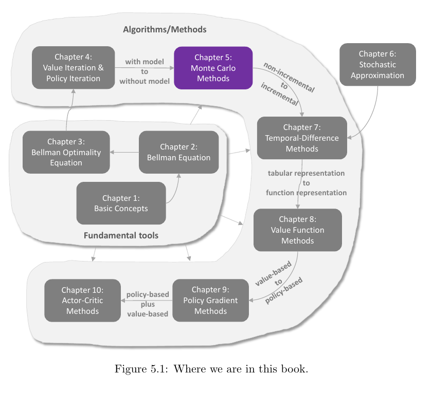
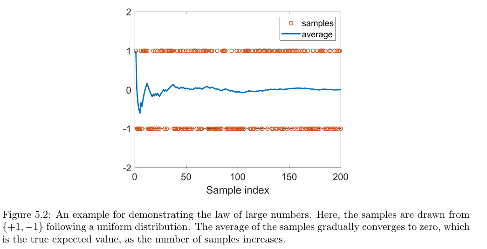
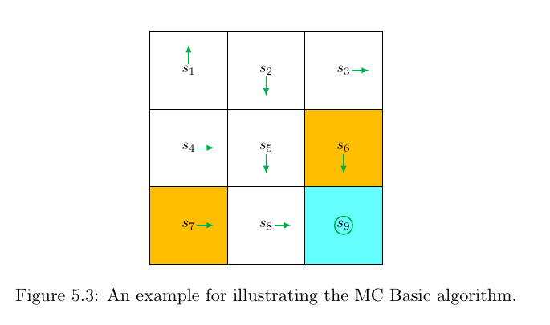
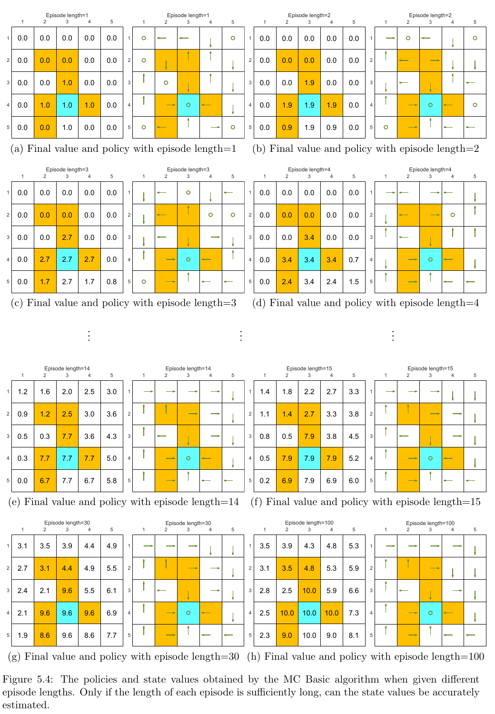
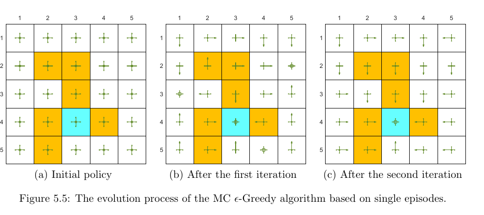
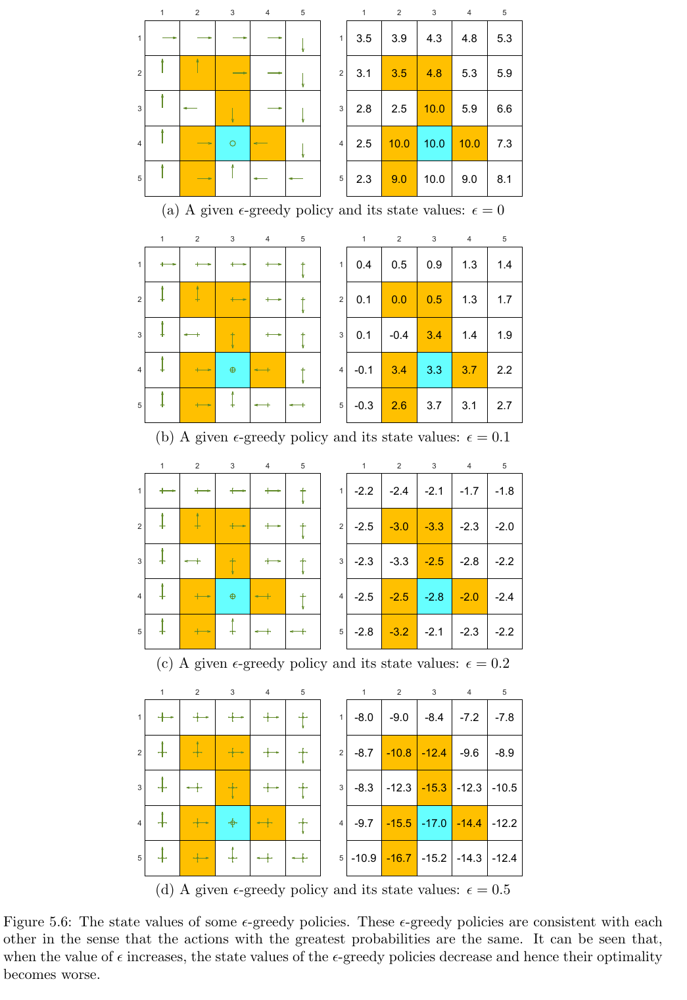
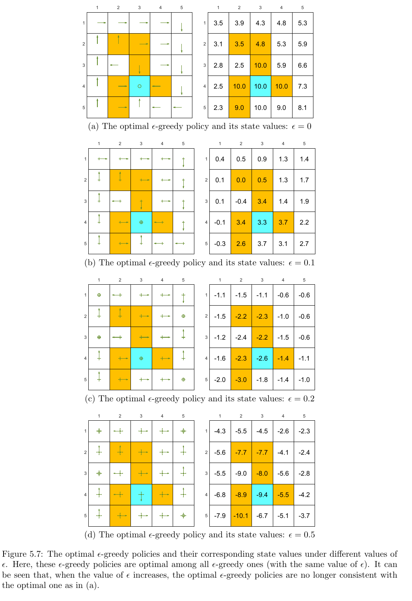
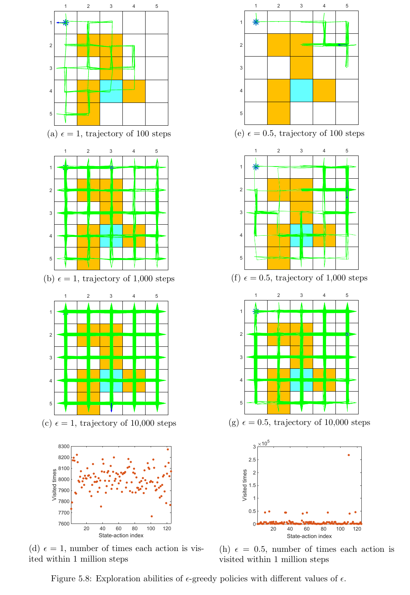

# Chapter 5 - Monte Carlo Methods

> [!abstract] 本章导读
> 前一章的价值迭代和策略迭代依赖已知环境模型。本章第一次进入无模型强化学习：不知道奖励分布和状态转移概率时，直接把完整 episode 的实际回报当作样本，用样本均值估计动作价值，再据此改进策略。全章依次建立 MC Basic、MC Exploring Starts 和 MC $\epsilon$-Greedy，并用它们说明样本利用率、充分探索以及探索-利用权衡。

## 0. 本章知识结构

**图解：** Chapter 5 把 Chapter 4 中“依赖模型的策略迭代”改造成“依赖经验数据的策略迭代”。它仍然属于非增量方法：通常等 episode 结束后才得到完整回报并更新。Chapter 7 的时序差分方法会进一步走向增量更新。

本章主线为：

$$
\text{期望的样本均值估计}
\longrightarrow
\text{用回报估计 }q_\pi
\longrightarrow
\text{MC Basic}
\longrightarrow
\text{MC Exploring Starts}
\longrightarrow
\text{MC }\epsilon\text{-Greedy}.
$$

三个算法逐步解决三个问题：

1. **没有模型时如何评价策略？** 用完整 episode 的折扣回报估计 $q_\pi(s,a)$。
2. **一条 episode 如何产生更多训练样本？** 使用 first-visit 或 every-visit，把访问过的状态动作对都用于更新。
3. **无法人为指定每条 episode 的起点怎么办？** 使用 soft policy，特别是 $\epsilon$-greedy，让普通轨迹也能持续探索。

> [!important] 一句话总览
> Monte Carlo 控制就是“采样完整回报做策略评价，再按当前动作价值改进策略”的无模型策略迭代。

## 1. 从均值估计理解 Monte Carlo

### 1.1 两种计算期望的路线

设离散随机变量 $X$ 的取值集合为 $\mathcal X$。若概率模型 $p(x)$ 已知，可直接按定义计算：

$$
\mathbb E[X]
=\sum_{x\in\mathcal X}p(x)x.
$$

这是 **model-based** 路线，因为它需要完整概率分布。

若分布未知，但能获得样本 $x_1,x_2,\ldots,x_n$，则以样本均值近似期望：

$$
\mathbb E[X]
\approx
\bar x_n
=\frac{1}{n}\sum_{i=1}^{n}x_i.
$$

这是 **model-free Monte Carlo estimation**：不恢复概率模型，而是直接用随机样本解决期望计算问题。

### 1.2 抛硬币例子

令

$$
X=
\begin{cases}
+1, & \text{正面},\\
-1, & \text{反面},
\end{cases}
\qquad
p(X=1)=p(X=-1)=0.5.
$$

已知模型时：

$$
\mathbb E[X]
=0.5\times 1+0.5\times(-1)
=0.
$$

未知模型时，反复抛硬币并计算运行均值：

$$
\bar x_n
=\frac{x_1+x_2+\cdots+x_n}{n}.
$$

**图解：** 单个样本始终是 $+1$ 或 $-1$，并不会趋近于 $0$；趋近于真实期望的是累计样本均值。样本较少时曲线波动很大，样本增多后逐渐稳定。

### 1.3 Box 5.1 - 大数定律背后的均值与方差

设 $x_1,\ldots,x_n$ 独立同分布，均服从随机变量 $X$ 的分布，并定义

$$
\bar x_n=\frac{1}{n}\sum_{i=1}^{n}x_i.
$$

样本均值是无偏的：

$$
\mathbb E[\bar x_n]
=\frac{1}{n}\sum_{i=1}^{n}\mathbb E[x_i]
=\mathbb E[X].
$$

利用独立性，样本均值的方差为：

$$
\begin{aligned}
\operatorname{Var}(\bar x_n)
&=\operatorname{Var}\left(
\frac{1}{n}\sum_{i=1}^{n}x_i
\right)\\
&=\frac{1}{n^2}\sum_{i=1}^{n}\operatorname{Var}(x_i)\\
&=\frac{1}{n}\operatorname{Var}(X).
\end{aligned}
$$

因此：

$$
\operatorname{Var}(\bar x_n)\rightarrow 0
\qquad (n\rightarrow\infty).
$$

关键逻辑是：

- **同分布**保证每个样本有相同均值和方差；
- **独立**保证和的方差等于方差之和，没有额外协方差项；
- 样本量增加使估计方差按 $1/n$ 衰减。

> [!warning] 独立同分布条件不能随意忽略
> 若所有样本都复制第一个样本，则无论样本数多大，样本均值都等于 $x_1$，不会可靠逼近真实期望。强化学习轨迹内的样本通常相关，因此不能把 i.i.d. 结论不加说明地照搬到所有 MC 更新；教材在 every-visit 方法中也专门指出了相关性问题。

### 1.4 为什么均值估计是强化学习的核心

状态价值和动作价值本身就是回报的条件期望：

$$
v_\pi(s)
=\mathbb E_\pi[G_t\mid S_t=s],
$$

$$
q_\pi(s,a)
=\mathbb E_\pi[G_t\mid S_t=s,A_t=a].
$$

所以“学习价值函数”本质上就是“从经验回报中估计条件均值”。Monte Carlo 方法的对象不是任意数值，而是随机回报 $G_t$。

## 2. MC Basic：最简单的 MC 控制

### 2.1 把策略迭代改造成无模型算法

策略迭代包含：

$$
\text{策略评价}
\longleftrightarrow
\text{策略改进}.
$$

已知模型时，可由一步奖励和状态转移计算动作价值：

$$
q_{\pi_k}(s,a)
=
\sum_{r\in\mathcal R}p(r\mid s,a)r
+
\gamma
\sum_{s'\in\mathcal S}
p(s'\mid s,a)v_{\pi_k}(s').
\tag{5.1}
$$

这里必须知道 $p(r\mid s,a)$ 和 $p(s'\mid s,a)$，所以是 model-based 计算。

但动作价值也可直接按定义写成：

$$
\begin{aligned}
q_{\pi_k}(s,a)
&=\mathbb E_{\pi_k}[G_t\mid S_t=s,A_t=a]\\
&=\mathbb E_{\pi_k}\left[
R_{t+1}+\gamma R_{t+2}+\gamma^2R_{t+3}+\cdots
\mid S_t=s,A_t=a
\right].
\end{aligned}
$$

若从 $(s,a)$ 出发并随后遵循 $\pi_k$，收集 $n$ 条 episode，其回报分别为
$g_{\pi_k}^{(1)}(s,a),\ldots,g_{\pi_k}^{(n)}(s,a)$，则：

$$
q_{\pi_k}(s,a)
\approx
\frac{1}{n}
\sum_{i=1}^{n}
g_{\pi_k}^{(i)}(s,a).
\tag{5.2}
$$

这一步不需要显式知道环境模型，只需要与环境交互获得数据。

> [!important] 为什么直接估计动作价值
> 若只估计 $v_\pi(s)$，策略改进时仍需借助模型比较各动作的一步后果，如式 (5.1)。直接估计 $q_\pi(s,a)$ 后，可以单纯按 $\arg\max_a q_\pi(s,a)$ 攉选动作，从而保持整个控制算法无模型。

### 2.2 Algorithm 5.1 - MC Basic

**输入与初始化**

- 任意初始策略 $\pi_0$；
- 外层迭代编号 $k=0,1,2,\ldots$。

**第 $k$ 轮**

1. 对每个 $s\in\mathcal S$ 和 $a\in\mathcal A(s)$，收集许多从 $(s,a)$ 开始、之后遵循 $\pi_k$ 的 episode。
2. 计算这些 episode 回报的平均值：

$$
q_k(s,a)
\leftarrow
\operatorname{average\ return}(s,a).
$$

3. 对每个状态作贪心策略改进：

$$
\pi_{k+1}(s)
\in
\arg\max_{a\in\mathcal A(s)}q_k(s,a).
$$

4. 重复，直到策略稳定。

MC Basic 仍保留完整策略迭代的结构，只把精确的模型式策略评价换成 MC 样本均值评价。

### 2.3 为什么不必每轮都得到极精确的价值

理论上，样本充分时：

$$
q_k(s,a)\rightarrow q_{\pi_k}(s,a),
$$

因此算法能复现策略迭代并收敛到最优策略。实际中常不必等待每轮价值完全收敛，因为策略评价与策略改进可以交替推动彼此，这与截断策略迭代和广义策略迭代的思想一致。

但 MC Basic 的代价明显：

- 每个状态动作对都要作为 episode 起点；
- 每轮要收集许多 episode；
- 一条 episode 只评价其初始状态动作对；
- 必须等完整 episode 回报可得后才能更新。

因此它适合展示核心思想，却不是样本利用率最高的实现。

### 2.4 3 x 3 网格世界的逐步计算

环境设置：

$$
r_{\text{boundary}}
=r_{\text{forbidden}}
=-1,
\qquad
r_{\text{target}}=1,
\qquad
\gamma=0.9.
$$

在 $s_1$ 有五个动作。由于环境和策略都是确定性的，每个起始动作只需一条 episode 就能得到对应回报：

$$
q_{\pi_0}(s_1,a_1)
=-1+\gamma(-1)+\gamma^2(-1)+\cdots
=-\frac{1}{1-\gamma},
$$

$$
q_{\pi_0}(s_1,a_2)
=0+\gamma 0+\gamma^2 0+\gamma^3(1)+\gamma^4(1)+\cdots
=\frac{\gamma^3}{1-\gamma},
$$

$$
q_{\pi_0}(s_1,a_3)
=\frac{\gamma^3}{1-\gamma},
$$

$$
q_{\pi_0}(s_1,a_4)
=-\frac{1}{1-\gamma},
$$

$$
q_{\pi_0}(s_1,a_5)
=-\frac{\gamma}{1-\gamma}.
$$

最大值由 $a_2$ 与 $a_3$ 取得，因此新策略在 $s_1$ 可选择其中任一动作。这个例子的初始策略只有 $s_1$ 和 $s_3$ 非最优，完成一次评价和贪心改进后即可得到最优策略。

> [!note] 补充理解
> “确定性环境中一条轨迹足够”只意味着重复相同起点和策略会得到相同回报，不意味着轨迹可以很短。若 episode 被过早截断，远处奖励仍无法传播到起始状态。

### 2.5 Episode 长度与稀疏奖励

图 5.4 使用 5 x 5 网格说明：

- 长度为 1 至 4 时，只有目标附近能看到正回报，远处状态的估计大多仍为 $0$；
- 长度为 14 时，左下角起点还不能到达目标；
- 长度达到 15 后，所有状态至少有机会在 episode 内到达目标，策略开始正确；
- 长度为 30 时，策略已经最优，但价值估计仍未完全收敛；
- 长度为 100 时，状态价值更接近真实最优值。

这揭示两个不同要求：

1. **正确改进策略**只需要各动作价值的相对次序足够可靠；
2. **准确估计价值**要求回报尾部的影响也被充分包含。

若奖励稀疏，短 episode 中大量轨迹都只得到 $0$，学习信号无法传播到远处。可行思路包括延长 episode，或在不改变任务本质的前提下设计更密集的奖励信号。

> [!warning] 截断回报的偏差
> 把固定长度 $T$ 之后的奖励直接视为零，得到的是截断回报。除非尾部奖励确实为零或其折扣影响可忽略，否则它与无限时域的真实回报不同。

## 3. MC Exploring Starts：更充分地利用 episode

### 3.1 一条 episode 中有许多“访问”

考虑：

$$
s_1
\xrightarrow{a_2}
s_2
\xrightarrow{a_4}
s_1
\xrightarrow{a_2}
s_2
\xrightarrow{a_3}
s_5
\xrightarrow{a_1}
\cdots
\tag{5.3}
$$

每次出现 $(S_t,A_t)=(s,a)$，称为状态动作对 $(s,a)$ 的一次 visit。从任一次访问开始，剩余轨迹都构成一条子 episode，并给出一个回报样本：

$$
G_t
=R_{t+1}+\gamma R_{t+2}+\cdots.
$$

因此一条完整 episode 不只提供一个样本，而能为其中访问过的多个状态动作对提供样本。

### 3.2 Initial-visit、first-visit 与 every-visit

| 策略 | 一条 episode 中用于更新的访问 | 优点 | 代价或注意点 |
|---|---|---|---|
| Initial-visit | 只使用初始 $(S_0,A_0)$ | 概念最简单，对应 MC Basic | 大量中间经验被丢弃 |
| First-visit | 每个 $(s,a)$ 只使用首次访问后的回报 | 同一 episode 内每对最多一个样本 | 忽略后续重复访问 |
| Every-visit | 每次访问 $(s,a)$ 都使用对应回报 | 样本利用率最高 | 同一 episode 的多个回报相关 |

式 (5.3) 中 $(s_1,a_2)$ 出现两次：

- first-visit 只使用第一次出现后的回报；
- every-visit 使用两次出现后的两个回报；
- initial-visit 仅当它恰好是起始状态动作对时才使用。

> [!warning] Every-visit 的样本并非独立
> 同一 episode 中较晚回报的奖励序列是较早回报的一部分，因此多个回报相关。访问间隔越远，相关性通常越弱。教材仍采用 every-visit，因为它能最大限度复用经验，但不能把这些回报简单当作严格 i.i.d. 样本。

### 3.3 从批量更新变为逐 episode 更新

MC Basic 的策略是：

$$
\text{收集许多 episode}
\rightarrow
\text{求均值}
\rightarrow
\text{改进策略}.
$$

MC Exploring Starts 则可在每条 episode 结束后：

$$
\text{更新所有访问过的 }q(s,a)
\rightarrow
\text{立即改进相关状态的策略}.
$$

这种更新得到的价值暂时不精确，但广义策略迭代允许评价与改进交错进行。新策略又会改变以后收集的数据，从而形成持续反馈。

### 3.4 Algorithm 5.2 - MC Exploring Starts

初始化：

$$
\pi_0(a\mid s),\qquad
q(s,a),\qquad
\operatorname{Returns}(s,a)=0,\qquad
\operatorname{Num}(s,a)=0.
$$

对每条 episode：

1. 选择起始状态动作对 $(S_0,A_0)$，并保证所有 $(s,a)$ 都有可能被选为起点。这就是 **exploring starts**。
2. 先执行 $A_0$，之后遵循当前策略，生成长度为 $T$ 的 episode：

$$
S_0,A_0,R_1,S_1,A_1,\ldots,S_{T-1},A_{T-1},R_T.
$$

3. 令 $g\leftarrow 0$，从 $t=T-1$ 反向遍历到 $0$：

$$
g\leftarrow \gamma g+R_{t+1}.
$$

4. 对每次访问的 $(S_t,A_t)$ 累积回报并计数：

$$
\operatorname{Returns}(S_t,A_t)
\leftarrow
\operatorname{Returns}(S_t,A_t)+g,
$$

$$
\operatorname{Num}(S_t,A_t)
\leftarrow
\operatorname{Num}(S_t,A_t)+1.
$$

5. 更新动作价值：

$$
q(S_t,A_t)
\leftarrow
\frac{
\operatorname{Returns}(S_t,A_t)
}{
\operatorname{Num}(S_t,A_t)
}.
$$

6. 对当前状态作贪心改进：

$$
a^*(S_t)
\in
\arg\max_{a\in\mathcal A(S_t)}q(S_t,a),
$$

$$
\pi(a\mid S_t)
=
\begin{cases}
1, & a=a^*(S_t),\\
0, & a\ne a^*(S_t).
\end{cases}
$$

教材算法采用 every-visit；若只在每个状态动作对首次出现时执行步骤 4 至 6，就得到 first-visit 版本。

### 3.5 为什么反向计算回报

直接为每个 $t$ 重新求和需要重复计算。利用递推：

$$
G_t=R_{t+1}+\gamma G_{t+1},
$$

一次从后向前扫描即可得到全部回报，计算量与 episode 长度 $T$ 成正比。

### 3.6 Exploring starts 的意义与局限

Exploring starts 要求每个状态动作对都能作为起点被充分多次选择。它保证：

$$
\forall(s,a),\quad
\operatorname{Num}(s,a)\rightarrow\infty
$$

在理论上使每个动作都得到充分评价，否则未探索动作可能被永久低估，贪心改进也就可能遗漏真正的最优动作。

局限在于很多现实系统无法任意重置到指定状态，更无法强迫起始时执行任意动作。因此需要一种不依赖特殊起点、却仍能覆盖各种动作的策略。

## 4. MC $\epsilon$-Greedy：不依赖 exploring starts

### 4.1 Soft policy

若策略在每个状态下给每个可行动作正概率，则称它为 soft policy：

$$
\pi(a\mid s)>0,
\qquad
\forall s,\ \forall a\in\mathcal A(s).
$$

Soft policy 生成足够长的 episode 时，可以在轨迹中访问大量状态动作对，从而把探索任务从“指定特殊起点”转移到“全过程随机选动作”。

### 4.2 $\epsilon$-greedy 的精确定义

设

$$
a^*(s)\in\arg\max_{a\in\mathcal A(s)}q(s,a).
$$

在状态 $s$ 有 $\lvert\mathcal A(s)\rvert$ 个动作时：

$$
\pi_\epsilon(a\mid s)
=
\begin{cases}
1-\epsilon+\dfrac{\epsilon}{\lvert\mathcal A(s)\rvert},
& a=a^*(s),\\
\dfrac{\epsilon}{\lvert\mathcal A(s)\rvert},
& a\ne a^*(s).
\end{cases}
$$

等价地，贪心动作的概率为：

$$
1-
\frac{\epsilon}{\lvert\mathcal A(s)\rvert}
\left(\lvert\mathcal A(s)\rvert-1\right)
=
1-\epsilon+\frac{\epsilon}{\lvert\mathcal A(s)\rvert}.
$$

实现时可这样采样：

1. 以概率 $1-\epsilon$ 选择贪心动作；
2. 以概率 $\epsilon$ 在所有动作中均匀随机选择。

注意第二步也可能再次选到贪心动作，所以贪心动作总概率不是 $1-\epsilon$，而是
$1-\epsilon+\epsilon/\lvert\mathcal A(s)\rvert$。

边界情况：

$$
\epsilon=0
\Rightarrow
\text{纯贪心策略},
$$

$$
\epsilon=1
\Rightarrow
\text{所有动作均匀随机}.
$$

### 4.3 策略改进的搜索空间发生了变化

在全部策略集合 $\Pi$ 中改进：

$$
\pi_{k+1}
\in
\arg\max_{\pi\in\Pi}
\sum_{a\in\mathcal A(s)}
\pi(a\mid s)q_k(s,a).
\tag{5.4}
$$

最优解是把全部概率放在贪心动作上的确定性策略。

MC $\epsilon$-Greedy 则把搜索限制在同一 $\epsilon$ 的 $\epsilon$-greedy 策略集合 $\Pi_\epsilon$：

$$
\pi_{k+1}
\in
\arg\max_{\pi\in\Pi_\epsilon}
\sum_{a\in\mathcal A(s)}
\pi(a\mid s)q_k(s,a).
\tag{5.5}
$$

所得策略在 $\Pi_\epsilon$ 中最优，但当 $\epsilon>0$ 时，一般不等于整个 $\Pi$ 中的最优策略。

### 4.4 Algorithm 5.3 - MC $\epsilon$-Greedy

初始化：

$$
\pi_0(a\mid s),\qquad
q(s,a),\qquad
\operatorname{Returns}(s,a)=0,\qquad
\operatorname{Num}(s,a)=0,
$$

并选择：

$$
\epsilon\in(0,1].
$$

每条 episode：

1. 从普通允许的起点开始，不要求 exploring starts；
2. 按当前 $\epsilon$-greedy 策略生成完整 episode；
3. 反向计算 $g\leftarrow\gamma g+R_{t+1}$；
4. 用 every-visit 规则累加回报、计数并更新 $q(S_t,A_t)$；
5. 对每个访问状态，把策略更新成关于最新 $q$ 的 $\epsilon$-greedy 策略。

策略更新写成：

$$
\pi(a\mid S_t)
=
\begin{cases}
1-\epsilon+\dfrac{\epsilon}{\lvert\mathcal A(S_t)\rvert},
& a\in\arg\max_b q(S_t,b),\\
\dfrac{\epsilon}{\lvert\mathcal A(S_t)\rvert},
& \text{其他动作}.
\end{cases}
$$

> [!note] 并列贪心动作
> 教材伪代码可通过固定规则选一个 $\arg\max$ 动作。若希望在多个并列最大动作之间均分“利用”概率，也可以定义相应策略，但必须在实现和分析中保持一致。

### 4.5 示例：两轮得到最优 $\epsilon$-greedy 策略

实验使用 5 x 5 网格：

$$
r_{\text{boundary}}
=r_{\text{forbidden}}
=-1,
\qquad
r_{\text{target}}=1,
\qquad
\gamma=0.9.
$$

初始策略在五个动作上均为 $0.2$，取 $\epsilon=0.5$。每轮只生成一条长度为一百万步的 episode，并利用 every-visit 更新所有访问。

**图解：** 初始策略完全随机；第一轮后已明显朝高价值区域偏移；第二轮后得到 $\Pi_{0.5}$ 中的最优策略。这个结果说明，一条足够长且探索性强的 episode 可以反复访问大量状态动作对。

## 5. 探索与利用

### 5.1 两个目标为何冲突

- **探索（exploration）**：尝试更多动作，发现当前估计遗漏的高价值选择；
- **利用（exploitation）**：选择当前估计中价值最高的动作，获得已知收益。

若只利用，早期估计误差可能使策略永久锁定在次优动作；若只探索，策略又不会稳定执行已知好动作。$\epsilon$ 是两者之间的控制旋钮：

$$
\epsilon\uparrow
\Rightarrow
\text{探索增强、利用减弱},
$$

$$
\epsilon\downarrow
\Rightarrow
\text{利用增强、探索减弱}.
$$

### 5.2 固定贪心方向时，增大 $\epsilon$ 会降低价值

图 5.6 的环境设置为：

$$
r_{\text{boundary}}=-1,
\qquad
r_{\text{forbidden}}=-10,
\qquad
r_{\text{target}}=1,
\qquad
\gamma=0.9.
$$

这里不同 $\epsilon$ 下的策略是 **consistent** 的：每个状态中概率最大的动作相同。随着
$\epsilon$ 从 $0$ 增加到 $0.1,0.2,0.5$：

- 随机动作概率增加；
- 进入禁区并获得 $-10$ 的概率增加；
- 全局状态价值下降；
- 当 $\epsilon=0.5$ 时，连目标状态价值也变为最小，因为留在目标附近时很容易随机走入周围禁区。

所以即使“主要方向”不变，更多随机动作也会损害期望回报。

### 5.3 最优 $\epsilon$-greedy 策略也可能改变贪心方向

图中每个策略都在其对应的 $\Pi_\epsilon$ 中最优：

- $\epsilon=0$ 时得到全体策略中的贪心最优策略；
- $\epsilon=0.1$ 时，最优 $\epsilon$-greedy 策略仍与贪心最优策略一致；
- $\epsilon=0.2$ 或 $0.5$ 时，部分状态的最大概率动作发生变化。

原因可由目标状态理解。纯贪心时，停留在目标状态可持续获得正奖励；当 $\epsilon$ 较大时，即使主要动作是停留，也有较高概率随机进入周围禁区。此时在受限策略集合中，“逃离高风险区域”可能比“以最高概率停留”有更高期望回报。

> [!important] 两种“最优”要区分
> $\pi_\epsilon^*$ 表示在固定 $\epsilon$ 的策略集合 $\Pi_\epsilon$ 中最优，不保证等于全体策略集合 $\Pi$ 中的 $\pi^*$。$\epsilon$ 越大，这两个最优概念的差异可能越明显。

### 5.4 $\epsilon$ 对访问覆盖的影响

图 5.8 比较 $\epsilon=1$ 与 $\epsilon=0.5$：

**当 $\epsilon=1$**

- 五个动作在每个状态都以 $0.2$ 概率选择；
- 100 步轨迹已覆盖不少区域；
- 1,000 和 10,000 步后轨迹广泛覆盖网格；
- 一百万步中各状态动作对的访问次数约为 $8,000$，分布相对均匀。

**当 $\epsilon=0.5$**

- 足够长的轨迹仍有机会访问所有动作；
- 但访问分布极不均衡；
- 一百万步中，少数动作访问超过 $250,000$ 次，多数动作只有数百甚至数十次。

因此“每个动作概率都大于零”只保证长期可探索，不保证有限样本内均匀探索。实际常用策略是：

$$
\text{训练初期使用较大 }\epsilon
\quad\longrightarrow\quad
\text{随后逐渐减小 }\epsilon.
$$

早期优先收集覆盖面广的数据，后期提高利用和最终策略的近似最优性。

## 6. 三种 MC 算法的关系

| 维度 | MC Basic | MC Exploring Starts | MC $\epsilon$-Greedy |
|---|---|---|---|
| 策略评价依据 | 完整回报均值 | 完整回报均值 | 完整回报均值 |
| 一条 episode 的利用 | 仅初始对 | first-visit 或 every-visit | 通常 every-visit |
| 策略改进 | 贪心 | 贪心 | 在 $\Pi_\epsilon$ 中改进 |
| 探索保证 | 每对作为起点 | exploring starts | soft policy 持续随机探索 |
| 特殊起点要求 | 强 | 强 | 无 |
| 主要优点 | 揭示核心思想 | 样本利用率更高 | 更贴近无法任意重置的环境 |
| 主要局限 | 样本浪费 | 起点条件难满足 | 固定 $\epsilon>0$ 会牺牲全局最优性 |

演化关系：

$$
\text{MC Basic}
\xrightarrow{\text{复用中间访问}}
\text{MC Exploring Starts}
\xrightarrow{\text{soft policy 代替特殊起点}}
\text{MC }\epsilon\text{-Greedy}.
$$

三者都属于 on-policy 控制思想：用于生成数据的当前策略，也是正在被评价和改进的策略。

## 7. 本章总结

1. Monte Carlo 估计用随机样本均值近似期望。
2. 状态价值和动作价值是回报的条件期望，因此可用 episode 回报直接估计。
3. MC Basic 把模型式策略评价换成回报样本均值，是最直接的无模型策略迭代。
4. First-visit 和 every-visit 让一条 episode 为多个状态动作对提供训练样本。
5. MC Exploring Starts 通过充分覆盖所有起始状态动作对支持贪心控制，但该条件在现实中常难满足。
6. MC $\epsilon$-Greedy 用 soft policy 在轨迹内部持续探索，取消 exploring starts 条件。
7. 固定 $\epsilon>0$ 时，算法寻找的是 $\Pi_\epsilon$ 中的最优策略，而非必然是全体策略中的最优策略。
8. $\epsilon$ 越大，探索越强但利用与策略价值通常越弱；逐渐衰减 $\epsilon$ 是常见折中。
9. MC 必须等到 episode 结束才能获得完整回报，并可能受长 episode、稀疏奖励与高方差影响。

## 8. 教材 Q&A

### Q1. 什么是 Monte Carlo 估计？

Monte Carlo 估计是一大类使用随机样本解决近似计算问题的方法。本章具体使用样本回报的平均值估计价值函数。

### Q2. 什么是均值估计问题？

均值估计是根据随机样本计算或近似随机变量期望的问题。

### Q3. 如何解决均值估计问题？

有两条路线：

- 已知概率分布时，按期望定义直接计算；
- 概率分布未知时，用 Monte Carlo 样本均值近似，样本充分多时估计更准确。

### Q4. 为什么均值估计对强化学习重要？

因为状态价值与动作价值都是回报的期望。估计价值函数，本质上就是估计随机回报的条件均值。

### Q5. 无模型 MC 强化学习的核心思想是什么？

把策略迭代改造成无模型形式：用 MC 样本评价替代基于环境模型的策略评价，策略改进结构保持不变。

### Q6. Initial-visit、first-visit 和 every-visit 是什么？

- initial-visit 只用初始状态动作对的整条 episode 回报；
- first-visit 对每个状态动作对只用本 episode 中首次访问后的回报；
- every-visit 对每次访问都使用对应的后续回报。

后两者比 initial-visit 更充分利用一条 episode。

### Q7. 什么是 exploring starts？为什么重要？

Exploring starts 要求每个状态动作对都能作为大量 episode 的起点。只有充分探索每个动作，动作价值比较才可靠，策略改进才不容易遗漏最优动作。

### Q8. 如何避免 exploring starts？

让策略保持 soft，例如采用 $\epsilon$-greedy。这样一条足够长的 episode 就可能访问许多状态动作对，无需为每一对单独构造大量起始轨迹。

### Q9. $\epsilon$-greedy 策略可以是最优的吗？

答案取决于“最优”的范围：

- 可以在固定 $\epsilon$ 的集合 $\Pi_\epsilon$ 中最优；
- 当 $\epsilon>0$ 时，一般不能保证在全部策略集合 $\Pi$ 中最优。

### Q10. 一条 episode 可以访问所有状态动作对吗？

可以。若策略是 soft 的且 episode 足够长，一条轨迹可能访问所有状态动作对；但有限样本中的访问频次可能非常不均匀。

### Q11. MC Basic、MC Exploring Starts 与 MC $\epsilon$-Greedy 的关系是什么？

MC Basic 展示“样本回报替代模型评价”的核心；MC Exploring Starts 改进一条 episode 的样本利用方式；MC $\epsilon$-Greedy 再以 soft policy 去除 exploring starts 的现实限制。复杂性来自性能和可实施性要求，而不是 MC 核心思想本身。

## 9. 一页式复习

### 9.1 最小知识链

$$
q_\pi(s,a)
=\mathbb E_\pi[G_t\mid S_t=s,A_t=a]
\approx
\frac{1}{N(s,a)}
\sum_{i=1}^{N(s,a)}G^{(i)}(s,a).
$$

$$
G_t=R_{t+1}+\gamma G_{t+1}.
$$

$$
\text{估计 }q
\rightarrow
\text{对 }q\text{ 贪心或 }\epsilon\text{-greedy 改进}
\rightarrow
\text{产生新数据}
\rightarrow
\text{继续估计}.
$$

### 9.2 做题时的识别信号

- 题目说“未知转移概率，但有完整 episode”：“MC 估计”。
- 问为什么估计 $q$ 而不是只估计 $v$：“无模型策略改进要直接比较动作”。
- 一条轨迹中状态动作对重复出现：“区分 first-visit 与 every-visit”。
- 能任意指定起始状态动作对：“exploring starts”。
- 不能任意指定起点但要持续探索：“soft 或 $\epsilon$-greedy”。
- 问贪心动作实际概率：“$1-\epsilon+\epsilon/\lvert\mathcal A(s)\rvert$”。
- 问固定 $\epsilon$ 下收敛到哪里：“$\Pi_\epsilon$ 中的最优策略”。
- 问短轨迹为何失败：“尾部回报丢失，稀疏奖励无法传播”。

### 9.3 三个最容易混淆的区别

**完整回报与即时奖励**

$$
G_t
=R_{t+1}+\gamma R_{t+2}+\cdots
\ne R_{t+1}.
$$

**贪心动作概率与利用分支概率**

$$
\Pr(\text{greedy action})
=1-\epsilon+\frac{\epsilon}{\lvert\mathcal A(s)\rvert}
\ne 1-\epsilon.
$$

**受限最优与全局最优**

$$
\pi_\epsilon^*
\in\arg\max_{\pi\in\Pi_\epsilon}v_\pi
\quad\not\Rightarrow\quad
\pi_\epsilon^*
\in\arg\max_{\pi\in\Pi}v_\pi.
$$

## 10. 公式清单

**样本均值**

$$
\bar x_n=\frac{1}{n}\sum_{i=1}^{n}x_i.
$$

**样本均值的期望与方差**

$$
\mathbb E[\bar x_n]=\mathbb E[X],
\qquad
\operatorname{Var}(\bar x_n)
=\frac{1}{n}\operatorname{Var}(X).
$$

**动作价值的 MC 估计**

$$
q_\pi(s,a)
\approx
\frac{1}{N(s,a)}
\sum_{i=1}^{N(s,a)}
G^{(i)}(s,a).
$$

**回报反向递推**

$$
G_t=R_{t+1}+\gamma G_{t+1}.
$$

**贪心策略改进**

$$
\pi(s)\in\arg\max_{a\in\mathcal A(s)}q(s,a).
$$

**$\epsilon$-greedy**

$$
\pi_\epsilon(a\mid s)
=
\begin{cases}
1-\epsilon+\dfrac{\epsilon}{\lvert\mathcal A(s)\rvert},
& a=a^*(s),\\
\dfrac{\epsilon}{\lvert\mathcal A(s)\rvert},
& a\ne a^*(s).
\end{cases}
$$

## 11. 符号表

| 符号 | 含义 |
|---|---|
| $X$ | 随机变量 |
| $x_i$ | 第 $i$ 个随机样本 |
| $\bar x_n$ | 前 $n$ 个样本的均值 |
| $S_t,A_t,R_{t+1}$ | 时刻 $t$ 的状态、动作与下一奖励 |
| $G_t$ | 从时刻 $t$ 开始的折扣回报 |
| $v_\pi(s)$ | 策略 $\pi$ 下的状态价值 |
| $q_\pi(s,a)$ | 策略 $\pi$ 下的动作价值 |
| $\operatorname{Returns}(s,a)$ | 已收集的 $(s,a)$ 回报总和 |
| $\operatorname{Num}(s,a)$ | $(s,a)$ 的有效访问计数 |
| $\gamma$ | 折扣率 |
| $\epsilon$ | 随机探索强度 |
| $\Pi$ | 全部策略的集合 |
| $\Pi_\epsilon$ | 固定 $\epsilon$ 的 $\epsilon$-greedy 策略集合 |
| $\mathcal A(s)$ | 状态 $s$ 的可行动作集合 |

## 12. 术语表

| 英文 | 中文 | 核心含义 |
|---|---|---|
| Monte Carlo estimation | 蒙特卡洛估计 | 用随机样本近似期望或其他量 |
| model-free | 无模型 | 不需要已知或显式估计环境转移与奖励模型 |
| episode | 回合、轨迹 | 从起点到终止或规定截断点的交互序列 |
| return | 回报 | 未来奖励的折扣和 |
| initial-visit | 初始访问 | 只利用 episode 初始状态动作对 |
| first-visit | 首次访问 | 每个状态动作对在一条 episode 中只计第一次 |
| every-visit | 每次访问 | 每次出现状态动作对都计入 |
| exploring starts | 探索性起点 | 所有状态动作对均可被充分选作 episode 起点 |
| soft policy | 软策略 | 每个可行动作都有正概率 |
| $\epsilon$-greedy | $\epsilon$-贪心 | 大概率利用贪心动作，小概率随机探索 |
| exploration | 探索 | 尝试未充分评价的动作 |
| exploitation | 利用 | 选择当前估计最优的动作 |

## 13. 常见误区

> [!warning] 易错点 1：MC 必须知道环境模型
> 恰好相反，MC 的主要价值就是用样本回报替代对 $p(r\mid s,a)$ 和 $p(s'\mid s,a)$ 的依赖。

> [!warning] 易错点 2：单个样本会趋近期望
> 单个样本仍服从原分布；趋近期望的是越来越多样本的平均值。

> [!warning] 易错点 3：一条 episode 只能更新一个状态动作对
> 这是 initial-visit 的低效用法。First-visit 和 every-visit 可更新轨迹中访问过的许多状态动作对。

> [!warning] 易错点 4：Every-visit 回报都是独立样本
> 同一轨迹内的回报共享后续奖励，通常相关。

> [!warning] 易错点 5：Episode 越短更新越快，因此一定更好
> 过短 episode 会漏掉重要尾部奖励，特别是在稀疏奖励任务中造成严重偏差。

> [!warning] 易错点 6：Exploring starts 就是随机选择普通初始状态
> 它要求所有状态动作对都能作为起点被充分覆盖，比普通随机初始状态更强。

> [!warning] 易错点 7：$\epsilon$-greedy 中贪心动作概率是 $1-\epsilon$
> 随机分支也可能选到贪心动作，总概率是 $1-\epsilon+\epsilon/\lvert\mathcal A(s)\rvert$。

> [!warning] 易错点 8：固定 $\epsilon>0$ 仍保证全局最优
> 算法保证的对象是受限集合 $\Pi_\epsilon$ 中的最优策略。

> [!warning] 易错点 9：Soft policy 会在有限时间均匀访问所有动作
> Soft 只给每个动作正概率。有限轨迹的访问次数可能极不均匀，如图 5.8 所示。

> [!warning] 易错点 10：策略价值准确后才能做策略改进
> 广义策略迭代允许不完整评价与策略改进交替进行；动作排序足够可靠时就可能改进策略。

## 14. 自测题

### 14.1 概念题

**1. MC 方法为什么是 model-free？**

> [!success]- 点击查看答案
>
> 因为它直接从与环境交互得到的完整回报估计动作价值，不需要环境的奖励分布和状态转移概率。

**2. 为什么策略控制更倾向直接估计动作价值？**

> [!success]- 点击查看答案
>
> 在未知模型时，若只有状态价值，就无法通过一步前瞻比较动作；已有 $q(s,a)$ 时，可直接选择使其最大的动作。

**3. First-visit 和 every-visit 的差别是什么？**

> [!success]- 点击查看答案
>
> First-visit 对每个状态动作对每条 episode 只取第一次访问后的回报；every-visit 对每次访问都取对应回报。后者复用更多数据，但同一 episode 内样本相关。

**4. 为什么 exploring starts 难以用于真实系统？**

> [!success]- 点击查看答案
>
> 真实系统通常不能任意重置到所有状态，也不能任意强制起始动作，因此无法保证所有状态动作对都被大量选作起点。

**5. 固定 epsilon 的 MC epsilon-Greedy 最终优化什么？**

> [!success]- 点击查看答案
>
> 它优化固定 $\epsilon$ 的策略集合 $\Pi_\epsilon$，即寻找该受限集合中的最优 $\epsilon$-greedy 策略。

### 14.2 计算题

**6. 某状态有 5 个动作，epsilon=0.2。贪心与非贪心动作各自概率是多少？**

> [!success]- 点击查看答案
>
> 贪心动作：
>
> $$
> 1-0.2+\frac{0.2}{5}=0.84.
> $$
>
> 每个非贪心动作：
>
> $$
> \frac{0.2}{5}=0.04.
> $$
>
> 总和为 $0.84+4\times0.04=1$。

**7. 已知轨迹末端奖励依次为 2、-1、3，gamma=0.5，反向计算三个回报。**

> [!success]- 点击查看答案
>
> 从末端开始：
>
> $$
> G_2=3,
> $$
>
> $$
> G_1=-1+0.5\times3=0.5,
> $$
>
> $$
> G_0=2+0.5\times0.5=2.25.
> $$

**8. 一个状态动作对已有 Returns=18、Num=6，新样本回报为 3，更新后的估计是多少？**

> [!success]- 点击查看答案
>
> $$
> \operatorname{Returns}\leftarrow18+3=21,
> $$
>
> $$
> \operatorname{Num}\leftarrow6+1=7,
> $$
>
> $$
> q=\frac{21}{7}=3.
> $$

### 14.3 思考题

**9. 为什么策略可能已经最优，而价值估计仍不准确？**

> [!success]- 点击查看答案
>
> 策略改进只依赖各动作价值的相对排序。即使数值都有误差，只要最优动作仍排第一，贪心策略就可能已正确；准确价值则要求回报均值本身充分收敛。

**10. 为什么训练时常让 epsilon 逐渐衰减？**

> [!success]- 点击查看答案
>
> 较大的早期 $\epsilon$ 提高覆盖率，减少遗漏好动作的风险；较小的后期 $\epsilon$ 增强利用，使策略更接近全局贪心最优。若衰减过快，可能探索不足；若始终很大，则最终性能受随机动作拖累。

**11. 一条很长的 soft-policy episode 是否等价于 exploring starts？**

> [!success]- 点击查看答案
>
> 不完全等价。它可能访问所有状态动作对，但不能保证有限时间内访问均匀，也不保证每对都从 episode 起点出现。它通过轨迹内访问来替代特殊起点，实践上更可行，但覆盖质量仍取决于策略和环境可达性。
