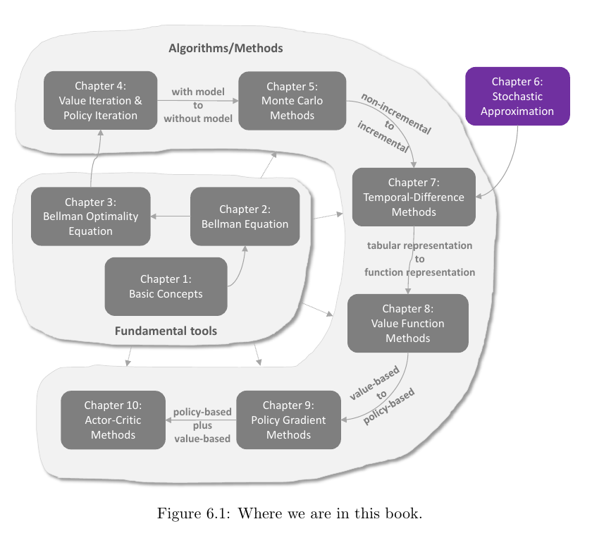
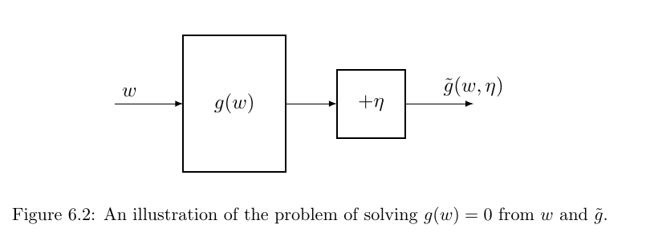
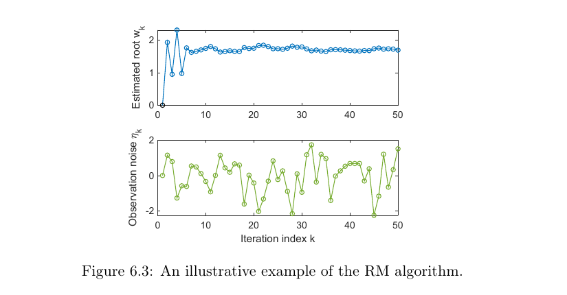
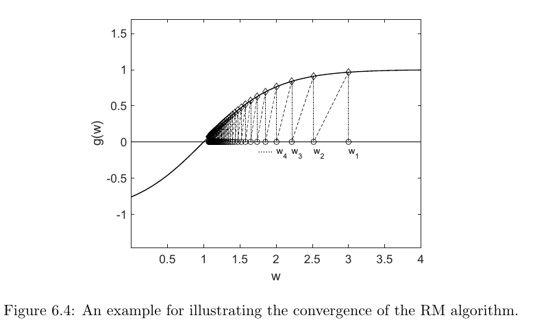
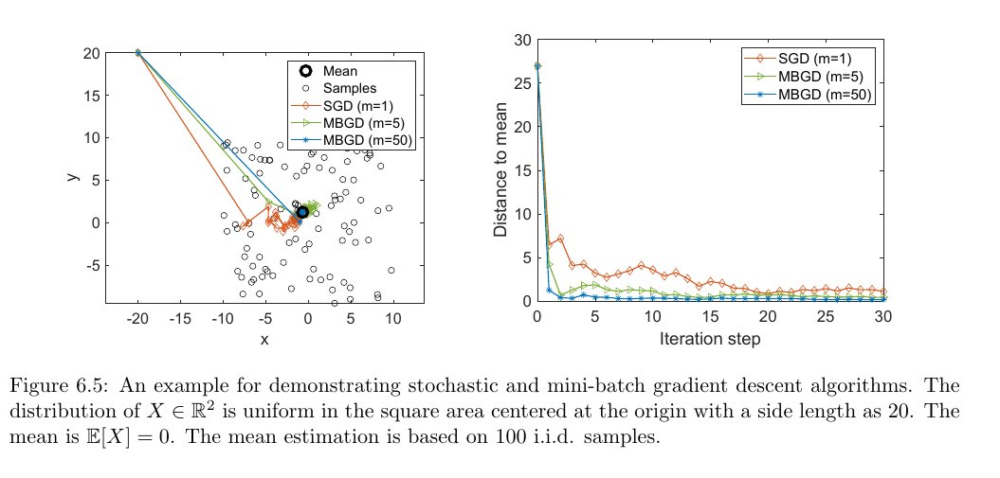

# Chapter 6 - Stochastic Approximation

> [!abstract] 本章导读
> Chapter 5 的 Monte Carlo 方法通常先收集完整数据，再进行非增量式计算；后续时序差分方法则会在样本到达时立刻更新。本章填补二者之间的知识缺口：从均值的增量估计出发，建立 Robbins-Monro 随机逼近、Dvoretzky 收敛定理和随机梯度下降。核心问题是：当函数未知、梯度只能通过带噪样本观测时，为什么一个简单的随机迭代仍能收敛？

## 0. 本章知识结构

**图解：** Chapter 6 位于非增量 Monte Carlo 方法与增量时序差分方法之间。它不直接给出新的强化学习算法，而是提供后续算法设计和收敛分析所依赖的数学工具。随机梯度下降（stochastic gradient descent, SGD）是 Robbins-Monro（RM）算法的特例，均值增量估计又是 SGD 的特例。

逻辑主线：

$$
\text{批量样本均值}
\longrightarrow
\text{增量均值更新}
\longrightarrow
\text{Robbins-Monro 求根}
\longrightarrow
\text{Dvoretzky 收敛定理}
\longrightarrow
\text{随机梯度下降}.
$$

三个层次之间的包含关系：

$$
\text{增量均值估计}
\subset
\text{SGD}
\subset
\text{Robbins-Monro 随机逼近}.
$$

> [!important] 一句话总览
> 随机逼近用“逐渐减小但总作用量无限”的步长，把无偏且方差受控的观测噪声平均掉，同时持续推动估计量走向目标。

## 1. 从非增量均值到增量均值

### 1.1 非增量 Monte Carlo 均值

设随机变量 $X$ 在有限集合 $\mathcal X$ 上取值，目标是估计 $\mathbb E[X]$。给定
$n$ 个独立同分布样本 $\{x_i\}_{i=1}^n$：

$$
\mathbb E[X]
\approx
\bar x
\doteq
\frac{1}{n}\sum_{i=1}^{n}x_i.
\tag{6.1}
$$

大数定律保证：

$$
\bar x\rightarrow\mathbb E[X]
\qquad (n\rightarrow\infty).
$$

这种方法要先保存或等待所有样本，属于非增量（non-incremental）计算。

### 1.2 增量公式的推导

令前 $k$ 个样本的均值为：

$$
w_{k+1}
\doteq
\frac{1}{k}\sum_{i=1}^{k}x_i,
$$

前 $k-1$ 个样本的均值为：

$$
w_k
=
\frac{1}{k-1}\sum_{i=1}^{k-1}x_i.
$$

把旧样本和新样本拆开：

$$
\begin{aligned}
w_{k+1}
&=\frac{1}{k}\sum_{i=1}^{k}x_i\\
&=\frac{1}{k}
\left(
\sum_{i=1}^{k-1}x_i+x_k
\right)\\
&=\frac{1}{k}\left((k-1)w_k+x_k\right)\\
&=w_k-\frac{1}{k}(w_k-x_k).
\end{aligned}
$$

于是得到增量均值算法：

$$
w_{k+1}
=w_k-\frac{1}{k}(w_k-x_k).
\tag{6.2}
$$

它只需要：

- 当前估计 $w_k$；
- 新样本 $x_k$；
- 当前计数 $k$。

不需要重新扫描历史样本。

### 1.3 增量公式确实等价于样本均值

取 $w_1=x_1$，依次展开：

$$
w_2=x_1,
$$

$$
w_3
=w_2-\frac{1}{2}(w_2-x_2)
=\frac{1}{2}(x_1+x_2),
$$

$$
w_4
=w_3-\frac{1}{3}(w_3-x_3)
=\frac{1}{3}(x_1+x_2+x_3).
$$

一般地：

$$
w_{k+1}
=\frac{1}{k}\sum_{i=1}^{k}x_i.
\tag{6.3}
$$

因此式 (6.2) 不是近似实现，而是式 (6.3) 的递推实现。

### 1.4 一般步长形式

把 $1/k$ 换成一般正步长 $\alpha_k$：

$$
w_{k+1}
=w_k-\alpha_k(w_k-x_k)
=w_k+\alpha_k(x_k-w_k).
\tag{6.4}
$$

该式可以读成：

$$
\text{新估计}
=
\text{旧估计}
+
\text{步长}
\times
\text{样本误差}.
$$

其中 $x_k-w_k$ 是新观测相对当前估计的误差。$\alpha_k$ 决定新样本能把估计拉动多远。

当 $\alpha_k=1/k$ 时可恢复精确样本均值；一般 $\alpha_k$ 下通常没有类似式 (6.3) 的简单闭式，但在合适条件下仍可证明：

$$
w_k\rightarrow\mathbb E[X].
$$

> [!note] 补充理解
> 增量并不等于近似得更差。式 (6.2) 与批量均值完全等价，只是计算组织方式不同。真正改变统计权重的是把 $1/k$ 换成其他 $\alpha_k$。

## 2. Robbins-Monro 随机逼近

### 2.1 随机逼近解决什么问题

随机逼近（stochastic approximation）是一类用随机迭代求解根或优化问题的方法。考虑：

$$
g(w)=0,
$$

其中 $w\in\mathbb R$ 未知，$g:\mathbb R\rightarrow\mathbb R$。

许多优化问题也能化为求根。若目标是最小化 $J(w)$，可令：

$$
g(w)\doteq\nabla_w J(w),
$$

再求：

$$
g(w)=0.
$$

困难在于本章假设：

- 不知道 $g$ 的解析表达式；
- 不知道 $g$ 的导数；
- 对输入 $w$ 只能得到带噪输出。

带噪观测为：

$$
\widetilde g(w,\eta)
=g(w)+\eta,
$$

其中 $\eta$ 是观测误差，不要求一定服从高斯分布。

**图解：** 输入 $w$ 经过未知黑箱 $g(w)$，再叠加噪声 $\eta$，最终只能观察
$\widetilde g(w,\eta)$。算法要仅凭输入和带噪输出找到 $g(w)=0$ 的根。

### 2.2 Robbins-Monro 更新

Robbins-Monro 算法为：

$$
w_{k+1}
=w_k-a_k\widetilde g(w_k,\eta_k),
\qquad
k=1,2,3,\ldots
\tag{6.5}
$$

其中：

- $w_k$：第 $k$ 次根估计；
- $\widetilde g(w_k,\eta_k)$：在 $w_k$ 处的第 $k$ 次带噪观测；
- $a_k>0$：步长。

若 $g$ 在根 $w^*$ 附近单调递增：

- 当 $w_k>w^*$ 时，$g(w_k)>0$，减去正数使 $w_{k+1}$ 向左移动；
- 当 $w_k<w^*$ 时，$g(w_k)<0$，减去负数使 $w_{k+1}$ 向右移动。

只要移动量不过大，两侧更新都会把估计推向根。

### 2.3 带噪求根示例

教材取：

$$
g(w)=w^3-5,
\qquad
w^*=5^{1/3}\approx1.71.
$$

观测：

$$
\widetilde g(w)=g(w)+\eta,
\qquad
\eta\sim\mathcal N(0,1),
$$

并设：

$$
w_1=0,
\qquad
a_k=\frac{1}{k}.
$$

**图解：** 下图中的观测噪声持续剧烈波动，上图中的根估计仍逐渐稳定在约 $1.71$。初期步长较大，估计跳动明显；后期 $a_k$ 变小，噪声影响被削弱。

该例的 $g(w)=w^3-5$ 不满足后面定理要求的全局导数上界，因此必须适当选择初值，不能据此宣称任意初值都收敛。

### 2.4 无噪声时的几何直觉

教材再取：

$$
g(w)=\tanh(w-1),
\qquad
w^*=1,
\qquad
w_1=3,
\qquad
a_k=\frac{1}{k},
\qquad
\eta_k=0.
$$

**图解：** 每次从横轴上的 $w_k$ 读出曲线高度 $g(w_k)$，再按
$w_{k+1}=w_k-a_kg(w_k)$ 沿横轴移动。估计从根右侧逐步向 $w^*=1$ 靠近，步长也逐渐缩短。

## 3. Robbins-Monro 收敛定理

### 3.1 Theorem 6.1 - Robbins-Monro theorem

> [!theorem] Theorem 6.1 - Robbins-Monro theorem
> 对式 (6.5)，若满足：
>
> $$
> 0<c_1
> \leq
> \nabla_w g(w)
> \leq
> c_2,
> \qquad
> \forall w,
> $$
>
> $$
> \sum_{k=1}^{\infty}a_k=\infty,
> \qquad
> \sum_{k=1}^{\infty}a_k^2<\infty,
> $$
>
> $$
> \mathbb E[\eta_k\mid\mathcal H_k]=0,
> \qquad
> \mathbb E[\eta_k^2\mid\mathcal H_k]<\infty,
> $$
>
> 其中历史信息
>
> $$
> \mathcal H_k=\{w_k,w_{k-1},\ldots\},
> $$
>
> 则 $w_k$ 几乎必然收敛到满足 $g(w^*)=0$ 的根 $w^*$。

这里的“几乎必然”（almost surely）是概率意义上的收敛。

### 3.2 条件一：方向正确且斜率有界

$$
0<c_1\leq\nabla_wg(w)
$$

表示 $g$ 严格单调递增，使根在定理语境下具有唯一性。若函数单调递减，可把
$-g(w)$ 视为新函数。

上界：

$$
\nabla_wg(w)\leq c_2
$$

限制函数不能陡峭到失控。$g(w)=\tanh(w-1)$ 满足有界导数，而
$g(w)=w^3-5$ 的导数 $3w^2$ 没有全局上界。

在优化中若：

$$
g(w)=\nabla_wJ(w),
$$

则 $g$ 单调递增对应 $J$ 的凸性，导数上下界对应曲率受控。

### 3.3 条件二：步长既要消失，又不能消失太快

两个条件缺一不可：

$$
\sum_{k=1}^{\infty}a_k^2<\infty
\quad\Rightarrow\quad
a_k\rightarrow0.
$$

若带噪观测有界，则：

$$
w_{k+1}-w_k
=-a_k\widetilde g(w_k,\eta_k)
\rightarrow0,
$$

从而后期不会一直大幅振荡。

另一方面：

$$
\sum_{k=1}^{\infty}a_k=\infty
$$

表示总移动能力无限，步长不能消失得太快。由迭代式求和：

$$
w_1-w_\infty
=
\sum_{k=1}^{\infty}
a_k\widetilde g(w_k,\eta_k).
$$

若 $\sum_k a_k<\infty$ 且观测有界，则总移动距离有有限上界 $b$。当初值满足：

$$
\lvert w_1-w^*\rvert>b,
\tag{6.6}
$$

算法无论如何也到不了 $w^*$。

> [!tip] 步长条件的直觉
> $\sum a_k=\infty$ 保证“还有足够力量走到目标”；$\sum a_k^2<\infty$ 保证“噪声造成的累计能量有限”。前者负责不早停，后者负责不永远抖动。

### 3.4 为什么 $a_k=1/k$ 是典型选择

调和级数发散：

$$
\sum_{k=1}^{\infty}\frac{1}{k}
=\infty.
$$

更精确地：

$$
\lim_{n\rightarrow\infty}
\left(
\sum_{k=1}^{n}\frac{1}{k}-\ln n
\right)
=\kappa,
$$

其中 $\kappa\approx0.577$ 是 Euler-Mascheroni 常数。

平方和收敛：

$$
\sum_{k=1}^{\infty}\frac{1}{k^2}
=\frac{\pi^2}{6}
<\infty.
$$

因此：

$$
a_k=\frac{1}{k}
$$

同时满足两个要求。$1/(k+1)$ 也满足。教材还提到 $a_k=c_k/k$ 在相应有界条件下可保持这种性质。

### 3.5 条件三：噪声无偏且二阶矩有限

$$
\mathbb E[\eta_k\mid\mathcal H_k]=0
$$

表示在已知历史后，下一次噪声仍没有系统性偏移。

$$
\mathbb E[\eta_k^2\mid\mathcal H_k]<\infty
$$

限制噪声能量。噪声不必是高斯分布。一个常见充分情形是 $\{\eta_k\}$ i.i.d.，且：

$$
\mathbb E[\eta_k]=0,
\qquad
\mathbb E[\eta_k^2]<\infty.
$$

### 3.6 常数步长的地位

实践中常取小常数 $a_k=a$。此时：

$$
\sum_{k=1}^{\infty}a_k^2
=\infty,
$$

所以不满足 Theorem 6.1。教材指出算法仍可能在某种意义上收敛，但不能直接套用该定理得到几乎必然收敛到单一点的结论。

> [!warning] 定理条件是充分条件，不是所有成功运行的必要条件
> 图 6.3 的 $g(w)=w^3-5$ 不满足导数全局有界，常数步长也不满足平方可和条件；算法仍可能在适当初值或较弱收敛意义下工作，但这些情形不能由 Theorem 6.1 直接保证。

## 4. 均值估计是 Robbins-Monro 的特例

把均值问题改写成求根：

$$
g(w)
\doteq
w-\mathbb E[X].
$$

目标 $\mathbb E[X]$ 恰是：

$$
g(w)=0
$$

的根。

给定样本 $x$，可观测：

$$
\widetilde g(w,\eta)=w-x.
$$

分解为：

$$
\begin{aligned}
\widetilde g(w,\eta)
&=w-x\\
&=w-x+\mathbb E[X]-\mathbb E[X]\\
&=(w-\mathbb E[X])+(\mathbb E[X]-x)\\
&=g(w)+\eta,
\end{aligned}
$$

其中：

$$
\eta\doteq\mathbb E[X]-x.
$$

代入 RM 更新：

$$
\begin{aligned}
w_{k+1}
&=w_k-\alpha_k\widetilde g(w_k,\eta_k)\\
&=w_k-\alpha_k(w_k-x_k)\\
&=w_k+\alpha_k(x_k-w_k),
\end{aligned}
$$

正是式 (6.4)。

只要 $\{x_k\}$ i.i.d.、相应二阶矩有限，且：

$$
\sum_{k=1}^{\infty}\alpha_k=\infty,
\qquad
\sum_{k=1}^{\infty}\alpha_k^2<\infty,
$$

就有：

$$
w_k\rightarrow\mathbb E[X]
\quad\text{almost surely}.
$$

该结论不要求 $X$ 服从特定分布。

## 5. Dvoretzky 收敛定理

### 5.1 为什么还需要一个更一般的定理

Theorem 6.1 给出 RM 的结论，但尚未证明。Dvoretzky 定理提供一个更抽象的随机递推收敛模板，不仅能证明 RM，也能用于分析许多强化学习算法。

### 5.2 Theorem 6.2 - Dvoretzky's theorem

> [!theorem] Theorem 6.2 - Dvoretzky's theorem
> 考虑随机过程：
>
> $$
> \Delta_{k+1}
> =(1-\alpha_k)\Delta_k+\beta_k\eta_k,
> $$
>
> 其中 $\alpha_k\geq0$、$\beta_k\geq0$，并允许它们依赖历史。若：
>
> $$
> \sum_{k=1}^{\infty}\alpha_k=\infty,
> \qquad
> \sum_{k=1}^{\infty}\alpha_k^2<\infty,
> \qquad
> \sum_{k=1}^{\infty}\beta_k^2<\infty
> $$
>
> 一致地几乎必然成立，并且：
>
> $$
> \mathbb E[\eta_k\mid\mathcal H_k]=0,
> \qquad
> \mathbb E[\eta_k^2\mid\mathcal H_k]\leq C
> $$
>
> 几乎必然成立，则：
>
> $$
> \Delta_k\rightarrow0
> \quad\text{almost surely}.
> $$

历史信息可写为：

$$
\mathcal H_k
=
\{
\Delta_k,\Delta_{k-1},\ldots,
\eta_{k-1},\ldots,
\alpha_{k-1},\ldots,
\beta_{k-1},\ldots
\}.
$$

与 RM 相比，该定理允许 $\alpha_k$ 和 $\beta_k$ 是依赖历史的随机变量。它也不要求
$\sum_k\beta_k=\infty$；极端地，若所有 $\beta_k=0$，序列仍可收敛。

### 5.3 证明第一步：研究平方误差

令：

$$
h_k\doteq\Delta_k^2.
$$

则：

$$
\begin{aligned}
h_{k+1}-h_k
&=\Delta_{k+1}^2-\Delta_k^2\\
&=(\Delta_{k+1}-\Delta_k)(\Delta_{k+1}+\Delta_k)\\
&=(-\alpha_k\Delta_k+\beta_k\eta_k)
\left((2-\alpha_k)\Delta_k+\beta_k\eta_k\right)\\
&=-\alpha_k(2-\alpha_k)\Delta_k^2
+\beta_k^2\eta_k^2
+2(1-\alpha_k)\beta_k\eta_k\Delta_k.
\end{aligned}
$$

对历史取条件期望：

$$
\begin{aligned}
\mathbb E[h_{k+1}-h_k\mid\mathcal H_k]
={}&
\mathbb E[-\alpha_k(2-\alpha_k)\Delta_k^2\mid\mathcal H_k]\\
&+\mathbb E[\beta_k^2\eta_k^2\mid\mathcal H_k]\\
&+\mathbb E[
2(1-\alpha_k)\beta_k\eta_k\Delta_k
\mid\mathcal H_k
].
\end{aligned}
\tag{6.7}
$$

在 $\alpha_k,\beta_k$ 由历史决定或为确定序列的情形，可把它们连同 $\Delta_k$ 提出条件期望：

$$
\begin{aligned}
\mathbb E[h_{k+1}-h_k\mid\mathcal H_k]
={}&
-\alpha_k(2-\alpha_k)\Delta_k^2\\
&+\beta_k^2\mathbb E[\eta_k^2\mid\mathcal H_k]\\
&+2(1-\alpha_k)\beta_k\Delta_k
\mathbb E[\eta_k\mid\mathcal H_k].
\end{aligned}
\tag{6.8}
$$

### 5.4 证明第二步：噪声交叉项消失

由：

$$
\sum_k\alpha_k^2<\infty
$$

可知 $\alpha_k\rightarrow0$，故充分大的 $k$ 满足 $\alpha_k\leq1$。于是：

$$
-\alpha_k(2-\alpha_k)\Delta_k^2\leq0.
$$

再利用：

$$
\mathbb E[\eta_k\mid\mathcal H_k]=0,
$$

交叉项为零；利用二阶矩上界：

$$
\mathbb E[\eta_k^2\mid\mathcal H_k]\leq C,
$$

得到：

$$
\mathbb E[h_{k+1}-h_k\mid\mathcal H_k]
=
-\alpha_k(2-\alpha_k)\Delta_k^2
+\beta_k^2\mathbb E[\eta_k^2\mid\mathcal H_k]
\leq
\beta_k^2C.
\tag{6.9}
$$

由于 $\sum_k\beta_k^2<\infty$，由教材引用的拟鞅收敛定理可知 $h_k$ 几乎必然收敛。

### 5.5 证明第三步：极限只能是零

从式 (6.9) 整理并求和，可知：

$$
\sum_{k=1}^{\infty}
\alpha_k(2-\alpha_k)\Delta_k^2
<\infty.
$$

当 $\alpha_k\leq1$ 时：

$$
\alpha_k(2-\alpha_k)\Delta_k^2
\geq
\alpha_k\Delta_k^2
\geq0.
$$

所以：

$$
\sum_{k=1}^{\infty}
\alpha_k\Delta_k^2
<\infty.
$$

但：

$$
\sum_{k=1}^{\infty}\alpha_k=\infty.
$$

因此不可能让 $\Delta_k^2$ 的极限保持为正，只能有：

$$
\Delta_k\rightarrow0
\quad\text{almost surely}.
$$

> [!tip] 证明的核心思想
> 先证明平方误差不会因噪声无限累积，再利用“步长总和发散”排除正误差极限。平方可和抑制噪声，和发散消灭残余偏差。

## 6. Dvoretzky 定理的两个应用

### 6.1 直接证明增量均值收敛

令：

$$
w^*=\mathbb E[X],
\qquad
\Delta_k\doteq w_k-w^*.
$$

由均值更新：

$$
w_{k+1}
=w_k+\alpha_k(x_k-w_k),
$$

得：

$$
\begin{aligned}
\Delta_{k+1}
&=\Delta_k+\alpha_k(x_k-w^*-\Delta_k)\\
&=(1-\alpha_k)\Delta_k
+\alpha_k(x_k-w^*).
\end{aligned}
$$

对应 Dvoretzky 形式：

$$
\beta_k=\alpha_k,
\qquad
\eta_k=x_k-w^*.
$$

若 $x_k$ i.i.d.：

$$
\mathbb E[\eta_k\mid\mathcal H_k]
=
\mathbb E[x_k]-w^*
=0,
$$

且有限方差保证条件二阶矩有界。因此：

$$
\Delta_k\rightarrow0,
\qquad
w_k\rightarrow\mathbb E[X]
$$

几乎必然成立。

### 6.2 用 Dvoretzky 证明 Robbins-Monro 定理

设 $g(w^*)=0$，并令：

$$
\Delta_k\doteq w_k-w^*.
$$

RM 更新给出：

$$
w_{k+1}-w^*
=
w_k-w^*
-a_k[g(w_k)-g(w^*)+\eta_k].
$$

由中值定理，存在 $w_k'\in[w_k,w^*]$，使：

$$
g(w_k)-g(w^*)
=
\nabla_wg(w_k')(w_k-w^*).
$$

于是：

$$
\begin{aligned}
\Delta_{k+1}
&=
\left[
1-a_k\nabla_wg(w_k')
\right]\Delta_k
+a_k(-\eta_k)\\
&=
(1-\alpha_k)\Delta_k+\beta_k\widetilde\eta_k,
\end{aligned}
$$

其中：

$$
\alpha_k
=a_k\nabla_wg(w_k'),
\qquad
\beta_k=a_k,
\qquad
\widetilde\eta_k=-\eta_k.
$$

由：

$$
0<c_1\leq\nabla_wg(w)\leq c_2
$$

以及 RM 步长条件，可验证 Dvoretzky 的 $\alpha_k,\beta_k$ 条件；噪声条件也保持。因此：

$$
\Delta_k\rightarrow0
\quad\Rightarrow\quad
w_k\rightarrow w^*
$$

几乎必然成立。

## 7. 多变量扩展

### 7.1 Theorem 6.3

> [!theorem] Theorem 6.3 - Dvoretzky 定理的多变量扩展
> 对有限索引集 $\mathcal S$，考虑：
>
> $$
> \Delta_{k+1}(s)
> =
> (1-\alpha_k(s))\Delta_k(s)
> +
> \beta_k(s)\eta_k(s).
> $$
>
> 若对每个 $s\in\mathcal S$：
>
> $$
> \sum_k\alpha_k(s)=\infty,
> \qquad
> \sum_k\alpha_k^2(s)<\infty,
> \qquad
> \sum_k\beta_k^2(s)<\infty,
> $$
>
> $$
> \mathbb E[\beta_k(s)\mid\mathcal H_k]
> \leq
> \mathbb E[\alpha_k(s)\mid\mathcal H_k]
> $$
>
> 一致地几乎必然成立，并且：
>
> $$
> \left\lVert
> \mathbb E[\eta_k(s)\mid\mathcal H_k]
> \right\rVert_\infty
> \leq
> \gamma
> \left\lVert\Delta_k\right\rVert_\infty,
> \qquad
> \gamma\in(0,1),
> $$
>
> $$
> \operatorname{Var}[\eta_k(s)\mid\mathcal H_k]
> \leq
> C
> \left(
> 1+\left\lVert\Delta_k(s)\right\rVert_\infty
> \right)^2,
> $$
>
> 则所有 $s\in\mathcal S$ 都满足：
>
> $$
> \Delta_k(s)\rightarrow0
> \quad\text{almost surely}.
> $$

最大范数按索引集合定义：

$$
\left\lVert\Delta_k\right\rVert_\infty
\doteq
\max_{s\in\mathcal S}\lvert\Delta_k(s)\rvert.
$$

在强化学习中，$s$ 可代表状态或状态动作对。该扩展重要之处在于：

1. 能同时处理多个状态对应的误差；
2. 噪声条件均值不必严格为零，只需被整体误差按系数 $\gamma<1$ 控制；
3. 方差允许随误差增大，但增长必须受给定上界控制；
4. 若要所有分量收敛，条件必须对每个状态或状态动作对成立。

教材省略了该扩展定理的证明，并指出它可用于后续 Q-learning 的收敛分析。

## 8. 随机梯度下降

### 8.1 从期望优化到真实梯度

考虑：

$$
\min_w
J(w)
=
\mathbb E[f(w,X)],
\tag{6.10}
$$

其中 $w$ 是待优化参数，$X$ 是随机变量，$f$ 输出标量。

若可交换梯度与期望：

$$
\nabla_wJ(w)
=
\mathbb E[\nabla_wf(w,X)].
$$

普通梯度下降为：

$$
w_{k+1}
=
w_k
-\alpha_k\nabla_wJ(w_k)
=
w_k
-\alpha_k
\mathbb E[\nabla_wf(w_k,X)].
\tag{6.11}
$$

但实际中 $X$ 的分布往往未知，真实期望梯度无法直接计算。

### 8.2 批量样本近似

用 $n$ 个 i.i.d. 样本近似：

$$
\mathbb E[\nabla_wf(w_k,X)]
\approx
\frac{1}{n}
\sum_{i=1}^{n}
\nabla_wf(w_k,x_i).
$$

得到：

$$
w_{k+1}
=
w_k
-
\frac{\alpha_k}{n}
\sum_{i=1}^{n}
\nabla_wf(w_k,x_i).
\tag{6.12}
$$

其问题是每次迭代都要使用全部样本。

### 8.3 单样本 SGD

每到达一个新样本 $x_k$ 就更新：

$$
w_{k+1}
=
w_k
-\alpha_k\nabla_wf(w_k,x_k).
\tag{6.13}
$$

这就是 SGD。它用随机梯度：

$$
\nabla_wf(w_k,x_k)
$$

替代真实梯度：

$$
\mathbb E[\nabla_wf(w_k,X)].
$$

### 8.4 SGD 是带零均值扰动的梯度下降

定义：

$$
\eta_k
\doteq
\nabla_wf(w_k,x_k)
-
\mathbb E[\nabla_wf(w_k,X)].
$$

则：

$$
\nabla_wf(w_k,x_k)
=
\mathbb E[\nabla_wf(w_k,X)]
+\eta_k.
$$

SGD 可写成：

$$
w_{k+1}
=
w_k
-\alpha_k\mathbb E[\nabla_wf(w_k,X)]
-\alpha_k\eta_k.
$$

若 $\{x_k\}$ i.i.d.：

$$
\mathbb E[\eta_k]=0.
$$

所以 SGD 是普通梯度下降加上经步长缩放的无偏随机扰动。步长递减时，扰动影响也逐渐减弱。

## 9. 均值估计是 SGD 的特例

把均值估计写成最小二乘：

$$
\min_w
J(w)
=
\mathbb E
\left[
\frac{1}{2}
\left\lVert w-X\right\rVert^2
\right]
\doteq
\mathbb E[f(w,X)].
\tag{6.14}
$$

其中：

$$
f(w,X)
=
\frac{1}{2}\left\lVert w-X\right\rVert^2,
\qquad
\nabla_wf(w,X)=w-X.
$$

真实梯度为：

$$
\nabla_wJ(w)
=w-\mathbb E[X].
$$

令其为零得：

$$
w^*=\mathbb E[X].
$$

普通梯度下降需要未知的 $\mathbb E[X]$，无法直接实施；SGD 用样本 $x_k$：

$$
\begin{aligned}
w_{k+1}
&=w_k-\alpha_k\nabla_wf(w_k,x_k)\\
&=w_k-\alpha_k(w_k-x_k),
\end{aligned}
$$

正好是式 (6.4)。

因此：

$$
\text{均值增量估计}
\subset
\text{SGD}
\subset
\text{RM}.
$$

## 10. SGD 的收敛模式

### 10.1 随机梯度的相对误差

教材用随机梯度相对真实梯度的误差衡量随机性：

$$
\delta_k
\doteq
\frac{
\left\lvert
\nabla_wf(w_k,x_k)
-
\mathbb E[\nabla_wf(w_k,X)]
\right\rvert
}{
\left\lvert
\mathbb E[\nabla_wf(w_k,X)]
\right\rvert
}.
$$

为简化分析，教材考虑标量 $w$。在最优解 $w^*$：

$$
\mathbb E[\nabla_wf(w^*,X)]=0.
$$

由中值定理，存在 $\widetilde w_k\in[w_k,w^*]$：

$$
\begin{aligned}
\delta_k
&=
\frac{
\left\lvert
\nabla_wf(w_k,x_k)
-
\mathbb E[\nabla_wf(w_k,X)]
\right\rvert
}{
\left\lvert
\mathbb E[\nabla_wf(w_k,X)]
-
\mathbb E[\nabla_wf(w^*,X)]
\right\rvert
}\\
&=
\frac{
\left\lvert
\nabla_wf(w_k,x_k)
-
\mathbb E[\nabla_wf(w_k,X)]
\right\rvert
}{
\left\lvert
\mathbb E[
\nabla_w^2f(\widetilde w_k,X)(w_k-w^*)
]
\right\rvert
}.
\end{aligned}
\tag{6.15}
$$

若严格凸且：

$$
\nabla_w^2f(w,X)\geq c>0,
$$

则：

$$
\left\lvert
\mathbb E[
\nabla_w^2f(\widetilde w_k,X)(w_k-w^*)
]
\right\rvert
\geq
c\lvert w_k-w^*\rvert.
$$

因此：

$$
\delta_k
\leq
\frac{
\left\lvert
\nabla_wf(w_k,x_k)
-
\mathbb E[\nabla_wf(w_k,X)]
\right\rvert
}{
c\lvert w_k-w^*\rvert
}.
$$

### 10.2 远处快、近处抖

上述不等式说明：

- 当 $\lvert w_k-w^*\rvert$ 大时，真实梯度信号相对强，$\delta_k$ 小，SGD 像普通梯度下降，前进较快；
- 当 $w_k$ 接近 $w^*$ 时，真实梯度趋近于零，单样本噪声相对突出，$\delta_k$ 可能很大，轨迹表现得更随机。

均值估计中：

$$
\nabla_wf(w_k,x_k)=w_k-x_k,
$$

$$
\mathbb E[\nabla_wf(w_k,X)]
=w_k-\mathbb E[X]
=w_k-w^*.
$$

所以：

$$
\delta_k
=
\frac{
\lvert\mathbb E[X]-x_k\rvert
}{
\lvert w_k-w^*\rvert
}.
$$

该式直接展示相对误差与到最优点距离成反比，也表明样本分布方差越大，随机波动越明显。

**图解：**

- $X\in\mathbb R^2$，在以原点为中心、边长为 20 的正方形内均匀分布；
- 真均值为 $\mathbb E[X]=0$，共使用 100 个 i.i.d. 样本；
- 三种方法都从远离原点的位置出发，早期快速接近均值；
- 靠近原点后，$m=1$ 的 SGD 波动最大；
- $m=5$ 的 MBGD 更平稳；
- $m=50$ 的 MBGD 最快且最稳定。

## 11. 确定性有限数据集中的 SGD

### 11.1 经验风险形式

给定有限数据集 $\{x_i\}_{i=1}^n$，即使不把它们预先解释为随机样本，也可定义：

$$
\min_w
J(w)
=
\frac{1}{n}
\sum_{i=1}^{n}
f(w,x_i).
$$

全梯度为：

$$
\nabla_wJ(w)
=
\frac{1}{n}
\sum_{i=1}^{n}\nabla_wf(w,x_i).
$$

逐样本更新写成：

$$
w_{k+1}
=
w_k
-\alpha_k\nabla_wf(w_k,x_k).
\tag{6.16}
$$

这里 $x_k$ 表示第 $k$ 次迭代抽到的数据，不一定是数据集中的第 $k$ 个元素。

### 11.2 把确定性有限和严格改写成期望

在有限数据集上定义随机变量 $X$：

$$
p(X=x_i)=\frac{1}{n}.
$$

则：

$$
\frac{1}{n}
\sum_{i=1}^{n}f(w,x_i)
=
\mathbb E[f(w,X)].
$$

这里是严格等号，不是 Monte Carlo 近似。若每次从数据集中独立均匀抽取 $x_k$，式 (6.16) 就是标准随机形式的 SGD。由于有放回抽样，同一样本可能被重复选中。

## 12. BGD、MBGD 与 SGD

### 12.1 三种更新

给定样本 $\{x_i\}_{i=1}^n$。

**Batch gradient descent, BGD**

$$
w_{k+1}
=
w_k
-
\alpha_k
\frac{1}{n}
\sum_{i=1}^{n}
\nabla_wf(w_k,x_i).
$$

**Mini-batch gradient descent, MBGD**

$$
w_{k+1}
=
w_k
-
\alpha_k
\frac{1}{m}
\sum_{j\in\mathcal I_k}
\nabla_wf(w_k,x_j),
$$

其中：

$$
\lvert\mathcal I_k\rvert=m.
$$

**Stochastic gradient descent, SGD**

$$
w_{k+1}
=
w_k
-
\alpha_k\nabla_wf(w_k,x_k).
$$

### 12.2 对比

| 方法 | 每次使用的样本数 | 梯度随机性 | 单步计算量 | 教材强调 |
|---|---:|---|---|---|
| BGD | 全部 $n$ 个 | 最低 | 最高 | 每次都使用完整数据集 |
| MBGD | $m$ 个 | 中等 | 中等 | 在随机性与计算量之间折中 |
| SGD | $1$ 个 | 最高 | 最低 | 能随样本到达立即更新 |

MBGD 是二者之间的中间形式：

- 相比 SGD，多个样本的平均会削弱随机性；
- 相比 BGD，不需要每轮读取全部数据，更灵活；
- $m=1$ 时 MBGD 退化为 SGD；
- 若 mini-batch 是有放回随机抽样，即使 $m=n$ 也不一定等于 BGD，因为可能重复抽到某些样本而遗漏另一些样本。

### 12.3 均值估计下的三种方法

目标：

$$
\min_w
J(w)
=
\frac{1}{2n}
\sum_{i=1}^{n}
\left\lVert w-x_i\right\rVert^2,
$$

最优解：

$$
w^*=\bar x.
$$

更新分别为：

$$
w_{k+1}
=
w_k-\alpha_k(w_k-\bar x)
\qquad
\text{BGD},
$$

$$
w_{k+1}
=
w_k-\alpha_k
\left(
w_k-\bar x_k^{(m)}
\right)
\qquad
\text{MBGD},
$$

$$
w_{k+1}
=
w_k-\alpha_k(w_k-x_k)
\qquad
\text{SGD},
$$

其中：

$$
\bar x_k^{(m)}
=
\frac{1}{m}
\sum_{j\in\mathcal I_k}x_j.
$$

当 $\alpha_k=1/k$ 时：

$$
w_{k+1}
=
\frac{1}{k}
\sum_{j=1}^{k}\bar x
=\bar x
\qquad
\text{BGD},
$$

$$
w_{k+1}
=
\frac{1}{k}
\sum_{j=1}^{k}
\bar x_j^{(m)}
\qquad
\text{MBGD},
$$

$$
w_{k+1}
=
\frac{1}{k}
\sum_{j=1}^{k}x_j
\qquad
\text{SGD}.
$$

BGD 每一步都直接得到经验均值；MBGD 的输入本身已经是小批量平均，通常比 SGD 更快、更平滑。

## 13. SGD 收敛定理

### 13.1 Theorem 6.4 - Convergence of SGD

> [!theorem] Theorem 6.4 - Convergence of SGD
> 对式 (6.13)，若：
>
> $$
> 0<c_1
> \leq
> \nabla_w^2f(w,X)
> \leq
> c_2,
> $$
>
> $$
> \sum_{k=1}^{\infty}a_k=\infty,
> \qquad
> \sum_{k=1}^{\infty}a_k^2<\infty,
> $$
>
> 且 $\{x_k\}_{k=1}^{\infty}$ i.i.d.，则 $w_k$ 几乎必然收敛到：
>
> $$
> \nabla_w\mathbb E[f(w,X)]=0
> $$
>
> 的根。

条件一要求曲率有正下界和有限上界。标量情形中是二阶导数；向量情形中对应 Hessian 矩阵条件。

### 13.2 Box 6.1 - SGD 是 RM 的特例

SGD 要最小化：

$$
J(w)=\mathbb E[f(w,X)].
$$

将其改成求根：

$$
g(w)
\doteq
\nabla_wJ(w)
=
\mathbb E[\nabla_wf(w,X)].
$$

可观测的随机梯度：

$$
\widetilde g(w,\eta)
=
\nabla_wf(w,x)
$$

分解为：

$$
\begin{aligned}
\widetilde g(w,\eta)
&=
\mathbb E[\nabla_wf(w,X)]\\
&\quad+
\left(
\nabla_wf(w,x)
-
\mathbb E[\nabla_wf(w,X)]
\right),
\end{aligned}
$$

其中括号内为 $\eta$。RM 更新：

$$
\begin{aligned}
w_{k+1}
&=w_k-a_k\widetilde g(w_k,\eta_k)\\
&=w_k-a_k\nabla_wf(w_k,x_k),
\end{aligned}
$$

就是 SGD。

接着逐项验证 Theorem 6.1：

1. 曲率条件给出：

$$
\nabla_wg(w)
=
\nabla_w
\mathbb E[\nabla_wf(w,X)]
=
\mathbb E[\nabla_w^2f(w,X)],
$$

因此：

$$
c_1\leq\nabla_wg(w)\leq c_2.
$$

2. 步长条件与 RM 完全相同。

3. 由于 $x_k$ 与历史 $\mathcal H_k$ 独立且同分布：

$$
\begin{aligned}
\mathbb E[\eta_k\mid\mathcal H_k]
&=
\mathbb E[
\nabla_wf(w_k,x_k)
-
\mathbb E[\nabla_wf(w_k,X)]
\mid\mathcal H_k
]\\
&=
\mathbb E_{x_k}[\nabla_wf(w_k,x_k)]
-
\mathbb E[\nabla_wf(w_k,X)]\\
&=0.
\end{aligned}
$$

若对给定 $x$，$\lvert\nabla_wf(w,x)\rvert$ 有界，则相应条件二阶矩有限。Theorem 6.1 因而推出 SGD 收敛。

> [!important] 证明关系
> Theorem 6.2 证明 Theorem 6.1；Theorem 6.1 再证明 Theorem 6.4。也就是 Dvoretzky 是通用收敛模板，RM 是通用带噪求根算法，SGD 是把优化的一阶条件放进 RM 后得到的特例。

## 14. 本章总结

本章从一个看似简单的均值问题建立了后续增量强化学习的数学骨架：

1. 样本均值可从批量计算改写为“旧估计加步长乘误差”的增量更新。
2. RM 把该结构推广到未知函数的带噪求根，只需要黑箱输入输出。
3. RM 收敛依赖三个核心要素：正确的平均方向、合适的步长、无偏且二阶矩受控的噪声。
4. Dvoretzky 定理通过平方误差与拟鞅工具给出一般随机递推的几乎必然收敛。
5. 均值增量估计既是 RM 特例，也是 SGD 特例。
6. SGD 用单样本随机梯度代替真实期望梯度，远离最优点时信号占优、靠近最优点时噪声相对突出。
7. BGD、MBGD、SGD 主要区别是每步使用的样本数，由此形成计算量与随机性的权衡。
8. 多变量 Dvoretzky 扩展为后续多状态强化学习算法的收敛分析提供工具。

## 15. 教材 Q&A

### Q1. 什么是随机逼近？

随机逼近是一大类用于求根或优化问题的随机迭代算法。

### Q2. 为什么需要学习随机逼近？

Chapter 7 的时序差分强化学习可以看作随机逼近算法。理解本章后，后续增量更新的设计与收敛条件就不会显得突兀。

### Q3. 为什么本章反复讨论均值估计？

状态价值和动作价值都是随机回报的均值；时序差分更新与本章的增量均值随机逼近具有相似结构。

### Q4. RM 相比其他求根方法有什么优势？

RM 不需要目标函数或其导数的解析表达式，只需要输入与带噪输出，因此可作为黑箱方法。SGD 就是 RM 的特例。

### Q5. SGD 的基本思想是什么？

当随机变量分布未知时，用样本产生的随机梯度替代以期望表示的真实梯度，并在每个样本到达时增量更新。

### Q6. SGD 能快速收敛吗？

能。估计离最优解较远时，真实梯度信号相对噪声强，收敛很快；接近最优解时，随机梯度噪声的相对影响增大，速度下降且轨迹更随机。

### Q7. 什么是 MBGD？相对 SGD 和 BGD 有何优势？

MBGD 每次使用一个小批量。相比 SGD，它通过多个样本平均降低随机性；相比 BGD，它不必每轮使用全部数据，因此更灵活。

## 16. 一页式复习

### 16.1 最核心的四个更新

**增量均值**

$$
w_{k+1}
=
w_k+\alpha_k(x_k-w_k).
$$

**Robbins-Monro**

$$
w_{k+1}
=
w_k-a_k\widetilde g(w_k,\eta_k).
$$

**SGD**

$$
w_{k+1}
=
w_k-\alpha_k\nabla_wf(w_k,x_k).
$$

**Dvoretzky 模板**

$$
\Delta_{k+1}
=
(1-\alpha_k)\Delta_k+\beta_k\eta_k.
$$

### 16.2 Robbins-Monro 步长条件

$$
\sum_ka_k=\infty
\quad\text{且}\quad
\sum_ka_k^2<\infty.
$$

记忆：

$$
\text{不能衰减太快}
\quad+\quad
\text{必须最终趋零}.
$$

典型选择：

$$
a_k=\frac{1}{k}.
$$

### 16.3 三层包含关系

$$
\text{均值估计}
\subset
\text{SGD}
\subset
\text{RM}.
$$

证明工具：

$$
\text{Dvoretzky}
\Longrightarrow
\text{RM 收敛}
\Longrightarrow
\text{SGD 收敛}.
$$

### 16.4 SGD 收敛模式

$$
\delta_k
\lesssim
\frac{\text{随机梯度误差}}
{\text{到最优解的距离}}.
$$

- 离最优点远：相对噪声小，快速前进；
- 离最优点近：相对噪声大，出现波动；
- mini-batch 越大：噪声通常越小，但每步计算越多。

## 17. 公式清单

| 公式 | 名称 | 作用 |
|---|---|---|
| $w_{k+1}=w_k+\alpha_k(x_k-w_k)$ | 增量均值 | 样本到达时更新均值估计 |
| $w_{k+1}=w_k-a_k\widetilde g(w_k,\eta_k)$ | RM 更新 | 仅凭带噪函数值求根 |
| $\sum_ka_k=\infty,\ \sum_ka_k^2<\infty$ | RM 步长条件 | 保留总移动能力并抑制噪声 |
| $\Delta_{k+1}=(1-\alpha_k)\Delta_k+\beta_k\eta_k$ | Dvoretzky 模板 | 统一分析随机误差递推 |
| $J(w)=\mathbb E[f(w,X)]$ | 随机优化目标 | 定义 SGD 要解决的问题 |
| $w_{k+1}=w_k-\alpha_k\nabla_wf(w_k,x_k)$ | SGD 更新 | 用单样本随机梯度增量优化 |
| $J(w)=\mathbb E[\frac12\lVert w-X\rVert^2]$ | 均值的最小二乘形式 | 说明均值估计是 SGD |
| $\delta_k=\frac{\lvert\nabla f-\mathbb E[\nabla f]\rvert}{\lvert\mathbb E[\nabla f]\rvert}$ | 随机梯度相对误差 | 解释远处快、近处抖 |

## 18. 符号表

| 符号 | 含义 |
|---|---|
| $X$ | 随机变量 |
| $x_k$ | 第 $k$ 次获得或抽取的样本 |
| $w_k$ | 第 $k$ 次参数或根估计 |
| $w^*$ | 真根或最优解 |
| $g(w)$ | 待求零点的未知函数 |
| $\widetilde g(w,\eta)$ | 带噪函数观测 |
| $\eta_k$ | 第 $k$ 次噪声或随机梯度扰动 |
| $a_k,\alpha_k,\beta_k$ | 随机递推中的步长或系数 |
| $\mathcal H_k$ | 第 $k$ 步之前的历史信息 |
| $\Delta_k$ | 当前估计相对目标的误差 |
| $h_k$ | 平方误差 $\Delta_k^2$ |
| $J(w)$ | 优化目标函数 |
| $f(w,X)$ | 单个随机样本对应的损失 |
| $\nabla_wf$ | 关于 $w$ 的梯度 |
| $\nabla_w^2f$ | 标量二阶导数或向量情形的 Hessian |
| $\mathcal I_k$ | 第 $k$ 次 mini-batch 的样本索引集 |
| $m$ | mini-batch 大小 |
| $\delta_k$ | 随机梯度相对真实梯度的误差 |

## 19. 术语表

| English | 中文 | 核心含义 |
|---|---|---|
| stochastic approximation | 随机逼近 | 用随机迭代求根或优化 |
| incremental | 增量式 | 每个样本到达时立刻更新 |
| Robbins-Monro algorithm | Robbins-Monro 算法 | 仅用带噪函数观测求根 |
| root-finding | 求根 | 寻找使函数为零的输入 |
| almost sure convergence | 几乎必然收敛 | 以概率 1 收敛 |
| stochastic gradient | 随机梯度 | 单样本或小批量产生的梯度 |
| stochastic gradient descent | 随机梯度下降 | 用随机梯度执行增量优化 |
| batch gradient descent | 批量梯度下降 | 每轮使用全部样本 |
| mini-batch gradient descent | 小批量梯度下降 | 每轮使用一组样本 |
| history | 历史信息 | 当前更新前已经产生的随机变量 |
| maximum norm | 最大范数 | 所有索引分量绝对值的最大值 |
| quasimartingale | 拟鞅 | Dvoretzky 证明使用的收敛工具 |

## 20. 常见误区

> [!warning] 易错点 1：增量均值只是批量均值的粗略近似
> 当 $\alpha_k=1/k$ 且索引定义一致时，两者代数上完全等价。

> [!warning] 易错点 2：随机逼近必须知道 $g(w)$
> RM 的优势正是无需知道函数表达式，只访问带噪黑箱输出。

> [!warning] 易错点 3：噪声必须是高斯噪声
> Theorem 6.1 只要求条件均值为零、条件二阶矩有限。

> [!warning] 易错点 4：只要 $a_k\rightarrow0$ 就能收敛
> 还必须避免衰减过快。若 $\sum_ka_k<\infty$，算法可能没有足够总移动距离到达根。

> [!warning] 易错点 5：常数步长满足 Robbins-Monro 条件
> 常数步长使 $\sum_ka_k^2=\infty$，不能直接套用 Theorem 6.1 的几乎必然收敛结论。

> [!warning] 易错点 6：Theorem 6.1 的条件是所有成功案例的必要条件
> 它们是教材给出的充分条件。违反某条条件的算法仍可能在受限初值或较弱意义下工作。

> [!warning] 易错点 7：SGD 的随机梯度等于真实梯度
> 单次通常不相等；关键是其条件期望与真实梯度一致。

> [!warning] 易错点 8：SGD 靠近最优点时应该更稳定、更快
> 真实梯度在最优点附近变小，样本噪声的相对影响反而增大。

> [!warning] 易错点 9：mini-batch 大小 $m=n$ 必然等于 BGD
> 若 mini-batch 采用有放回随机抽样，可能重复样本，未必覆盖全部 $n$ 个数据。

> [!warning] 易错点 10：有限数据集形式不是 SGD
> 在数据集上定义均匀随机变量后，有限平均严格等于期望；独立均匀抽样更新就是 SGD。

## 21. 自测题

### 21.1 概念题

**1. 为什么增量均值更新只需常数级存储？**

> [!success]- 点击查看答案
>
> 因为更新只保留当前估计 $w_k$、新样本 $x_k$ 和计数或步长，不需要保存全部历史样本。

**2. Robbins-Monro 算法比普通求根方法少需要什么信息？**

> [!success]- 点击查看答案
>
> 它不需要 $g(w)$ 或其导数的解析表达式，只需要能向黑箱输入 $w$ 并得到带噪输出 $\widetilde g(w,\eta)$。

**3. 两个步长和式分别控制什么？**

> [!success]- 点击查看答案
>
> $$
> \sum_ka_k=\infty
> $$
>
> 防止总移动能力有限；而：
>
> $$
> \sum_ka_k^2<\infty
> $$
>
> 使步长趋零并限制噪声累计影响。

**4. 为什么 SGD 是 Robbins-Monro 的特例？**

> [!success]- 点击查看答案
>
> 优化的一阶条件是求解：
>
> $$
> g(w)=\nabla_wJ(w)=0.
> $$
>
> 单样本梯度是 $g(w)$ 的带噪无偏观测，把它代入 RM 更新就得到 SGD。

**5. Dvoretzky 证明为什么研究平方误差而不是直接研究误差？**

> [!success]- 点击查看答案
>
> 平方误差非负，展开后能把收缩项、噪声能量项和零均值交叉项分开；再借助拟鞅收敛与步长条件确定极限为零。

### 21.2 判断与计算

**6. 判断：步长 a_k=1/sqrt(k) 满足 Robbins-Monro 的两个和式条件。**

> [!success]- 点击查看答案
>
> 错误。虽然：
>
> $$
> \sum_k\frac{1}{\sqrt{k}}=\infty,
> $$
>
> 但：
>
> $$
> \sum_k a_k^2
> =
> \sum_k\frac{1}{k}
> =\infty,
> $$
>
> 所以平方和不收敛。

**7. 判断：步长 a_k=1/k^2 满足 Robbins-Monro 的两个和式条件。**

> [!success]- 点击查看答案
>
> 错误。平方和收敛，但：
>
> $$
> \sum_k\frac{1}{k^2}<\infty,
> $$
>
> 总步长有限，可能无法从任意初值走到根。

**8. 当前均值估计 w_k=4，新样本 x_k=10，alpha_k=0.2。求新估计。**

> [!success]- 点击查看答案
>
> $$
> w_{k+1}
> =4+0.2(10-4)
> =5.2.
> $$

**9. 对 f(w,x)=1/2(w-x)^2，写出 SGD 更新。**

> [!success]- 点击查看答案
>
> $$
> \nabla_wf(w,x)=w-x.
> $$
>
> 所以：
>
> $$
> w_{k+1}
> =
> w_k-\alpha_k(w_k-x_k)
> =
> w_k+\alpha_k(x_k-w_k).
> $$

### 21.3 推导与思考

**10. 把均值估计写成 Robbins-Monro 求根问题。**

> [!success]- 点击查看答案
>
> 定义：
>
> $$
> g(w)=w-\mathbb E[X].
> $$
>
> 样本给出的带噪观测：
>
> $$
> \widetilde g(w)=w-x
> =g(w)+(\mathbb E[X]-x).
> $$
>
> 代入 RM 即得：
>
> $$
> w_{k+1}
> =w_k-\alpha_k(w_k-x_k).
> $$

**11. 为什么 SGD 离最优点远时往往看起来像普通梯度下降？**

> [!success]- 点击查看答案
>
> 离最优点远时真实梯度通常较大，随机梯度与真实梯度之差相对较小。教材的相对误差上界与
> $1/\lvert w_k-w^*\rvert$ 成比例，因此远处噪声的相对影响较弱。

**12. MBGD 为什么通常比 SGD 平稳？代价是什么？**

> [!success]- 点击查看答案
>
> MBGD 对多个样本梯度取平均，独立噪声会部分抵消，因此方差通常更小；代价是每次迭代需要更多样本读取和梯度计算。

**13. Theorem 6.3 为什么要求条件对每个 s 都成立？**

> [!success]- 点击查看答案
>
> 因为结论是所有分量 $\Delta_k(s)$ 同时收敛。若某个状态或状态动作对没有足够更新、噪声不受控或步长条件失败，就不能由该定理保证该分量收敛。
