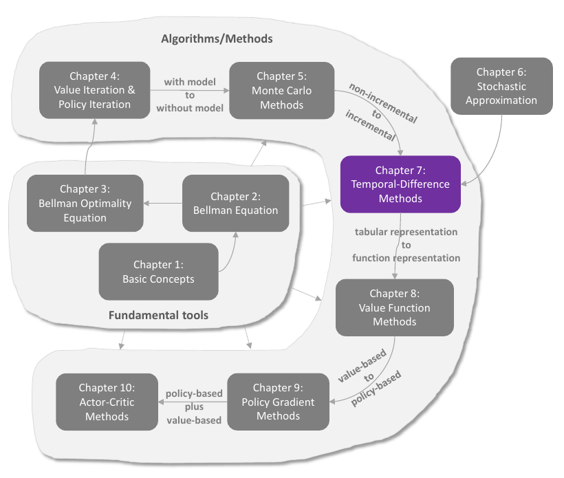
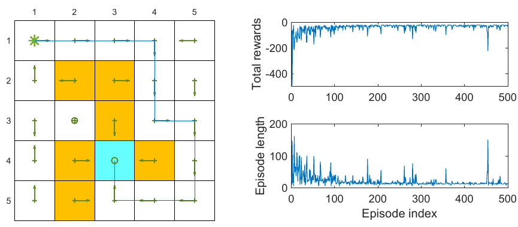
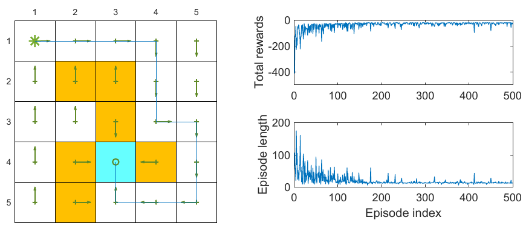
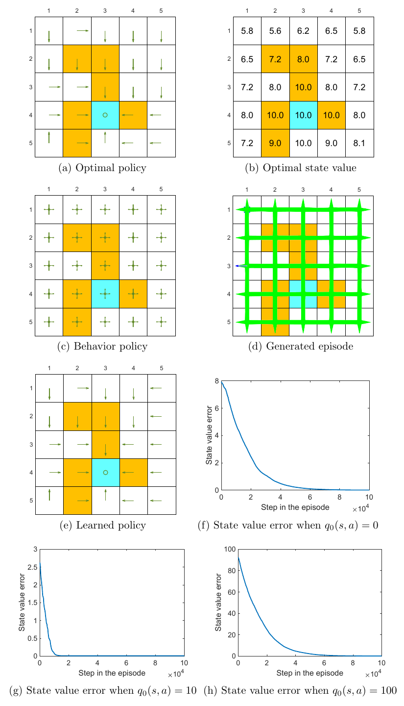
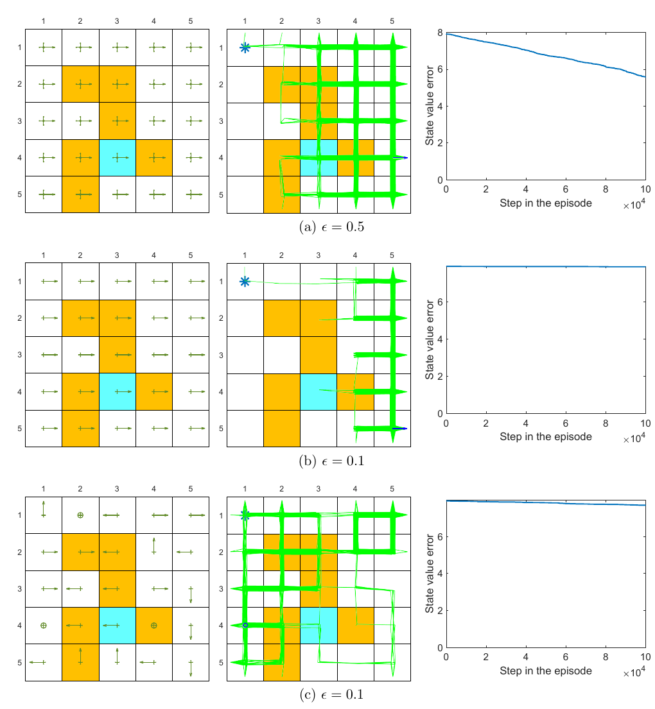

# Chapter 7 - Temporal-Difference Methods

> [!abstract] 本章导读
> 时序差分学习（temporal-difference learning, TD learning）把 Chapter 5 的无模型采样与 Chapter 6 的随机逼近结合起来：它不需要环境模型，也不必等到整条回合结束，而是在每个转移到达后，用“奖励加下一时刻的价值估计”立即更新当前价值。本章依次建立状态价值 TD、Sarsa、n 步 Sarsa 和 Q-learning，并从 Bellman 方程、Bellman 最优方程、同策略与异策略三个角度解释它们之间的关系。

## 0. 本章知识结构

**图解：** Chapter 7 位于表格型方法向函数近似方法过渡的关键位置。它从 Monte Carlo 的非增量、完整回合更新，转向逐步、增量更新；同时用 Chapter 6 的随机逼近理论解释为什么带噪且自举的迭代能够收敛。后续 Chapter 8 会把这里的表格型价值函数推广到参数化函数。

本章主线是：

$$
\text{Bellman 方程}
\longrightarrow
\text{单步采样目标}
\longrightarrow
\text{TD 更新}
\longrightarrow
\text{策略改进}
\longrightarrow
\text{最优策略}.
$$

算法关系可以概括为：

$$
\begin{aligned}
\text{状态价值 TD}
&\longrightarrow \text{给定策略的 }v_\pi,\\
\text{Sarsa}
&\longrightarrow \text{给定策略的 }q_\pi,\\
n\text{ 步 Sarsa}
&\longrightarrow \text{Sarsa 与 MC 之间的连续桥梁},\\
\text{Q-learning}
&\longrightarrow \text{直接逼近 }q_*.
\end{aligned}
$$

> [!important] 一句话总览
> 所有算法都具有“旧估计向 TD 目标移动”的同一骨架；它们真正不同的地方，是 TD 目标怎样构造，以及目标值对应给定策略的 Bellman 方程还是 Bellman 最优方程。

## 1. 状态价值的 TD 学习

### 1.1 问题设定

给定固定策略 $\pi$，智能体按该策略产生经验序列：

$$
(s_0,r_1,s_1,\ldots,s_t,r_{t+1},s_{t+1},\ldots).
$$

目标是用样本估计所有状态的真实价值 $v_\pi(s)$，但不知道环境的转移概率和奖励模型。

### 1.2 TD(0) 更新

在时刻 $t$ 观察到转移 $(s_t,r_{t+1},s_{t+1})$ 后，只更新刚访问的状态：

$$
v_{t+1}(s_t)
=
v_t(s_t)
-\alpha_t(s_t)
\left[
v_t(s_t)
-
\left(r_{t+1}+\gamma v_t(s_{t+1})\right)
\right].
\tag{7.1}
$$

对所有未访问状态：

$$
v_{t+1}(s)=v_t(s),
\qquad s\ne s_t.
\tag{7.2}
$$

式 (7.2) 在算法描述中经常省略，但它在数学上不可缺少：一次迭代只改变价值向量的一个分量。

把更新写成更熟悉的插值形式：

$$
v_{t+1}(s_t)
=
(1-\alpha_t(s_t))v_t(s_t)
+\alpha_t(s_t)
\left[r_{t+1}+\gamma v_t(s_{t+1})\right].
$$

因此，当 $0<\alpha_t(s_t)<1$ 时，新估计位于旧估计和本次 TD 目标之间。

### 1.3 从回报定义到 Bellman 方程

状态价值定义为：

$$
v_\pi(s)
=
\mathbb E_\pi
\left[
G_t
\mid
S_t=s
\right].
$$

由于

$$
G_t=R_{t+1}+\gamma G_{t+1},
$$

可得：

$$
v_\pi(s)
=
\mathbb E_\pi
\left[
R_{t+1}+\gamma G_{t+1}
\mid
S_t=s
\right].
\tag{7.3}
$$

在 Markov 性与固定策略下，

$$
\mathbb E_\pi
\left[
G_{t+1}
\mid
S_t=s
\right]
=
\mathbb E_\pi
\left[
v_\pi(S_{t+1})
\mid
S_t=s
\right],
$$

于是得到 Bellman 期望方程：

$$
v_\pi(s)
=
\mathbb E_\pi
\left[
R_{t+1}+\gamma v_\pi(S_{t+1})
\mid
S_t=s
\right].
\tag{7.4}
$$

### 1.4 Box 7.1 - 用 Robbins-Monro 推导 TD

把 Bellman 方程移到一边，定义求根函数：

$$
g(v_\pi(s_t))
\doteq
v_\pi(s_t)
-
\mathbb E_\pi
\left[
R_{t+1}+\gamma v_\pi(S_{t+1})
\mid
S_t=s_t
\right].
$$

真实根满足 $g(v_\pi(s_t))=0$。但期望未知，只能用单个转移构造带噪观测：

$$
\widetilde g(v_\pi(s_t))
=
v_\pi(s_t)
-
\left[
r_{t+1}+\gamma v_\pi(s_{t+1})
\right].
$$

Robbins-Monro 更新为：

$$
\begin{aligned}
v_{t+1}(s_t)
&=
v_t(s_t)-\alpha_t(s_t)\widetilde g(v_t(s_t))\\
&=
v_t(s_t)
-\alpha_t(s_t)
\left[
v_t(s_t)
-
\left(r_{t+1}+\gamma v_\pi(s_{t+1})\right)
\right].
\end{aligned}
\tag{7.5}
$$

这里仍含未知真值 $v_\pi(s_{t+1})$。把它替换为当前估计 $v_t(s_{t+1})$，就得到式 (7.1)。

> [!important] 自举发生在哪里
> TD 目标用一个估计 $v_t(s_{t+1})$ 去更新另一个估计 $v_t(s_t)$，这就是 bootstrapping。随机逼近推导先给出理想的无偏观测，再用当前估计代替未知真值；Theorem 7.1 说明这种耦合替换仍可收敛。

### 1.5 TD 目标与 TD 误差

定义一步 TD 目标：

$$
\overline v_t
\doteq
r_{t+1}+\gamma v_t(s_{t+1}).
$$

教材采用的 TD 误差符号是：

$$
\delta_t
\doteq
v_t(s_t)-\overline v_t
=
v_t(s_t)
-
\left[r_{t+1}+\gamma v_t(s_{t+1})\right].
$$

因此更新写成：

$$
v_{t+1}(s_t)
=
v_t(s_t)-\alpha_t(s_t)\delta_t.
\tag{7.6}
$$

> [!warning] 符号约定
> 很多强化学习资料把 TD 误差定义为“目标减当前值”，此时更新使用加号。本教材定义为“当前值减目标”，所以更新使用减号。两种写法数值完全等价，但推导时不能混用。

若 $0<\alpha_t(s_t)<1$，则：

$$
v_{t+1}(s_t)-\overline v_t
=
\left(1-\alpha_t(s_t)\right)
\left[v_t(s_t)-\overline v_t\right],
$$

从而：

$$
\left\lvert
v_{t+1}(s_t)-\overline v_t
\right\rvert
<
\left\lvert
v_t(s_t)-\overline v_t
\right\rvert.
$$

这说明每次更新都把当前估计拉近本次目标，但不表示它在每一步都更接近真值，因为 TD 目标本身是随机且随估计变化的。

当 $v_t=v_\pi$ 时：

$$
\mathbb E_\pi
\left[
\delta_t
\mid
S_t=s_t
\right]
=0.
$$

因此 TD 误差也可理解为 innovation，即新样本相对于当前预测带来的新信息。

### 1.6 TD 与 Monte Carlo 的比较

**Table 7.1：TD learning 与 MC learning**

| 比较维度 | TD learning | Monte Carlo learning |
|---|---|---|
| 更新时间 | 增量式，每得到一个转移样本即可更新 | 非增量式，通常要等完整回合结束并计算回报 |
| 适用任务 | 回合式与持续式任务均可 | 主要用于有终止状态的回合式任务 |
| 是否自举 | 是，目标包含已有估计，需初始化价值 | 否，直接使用实际折扣回报 |
| 方差 | 通常较低；单步 Sarsa 只引入 $R_{t+1},S_{t+1},A_{t+1}$ 等少量随机量 | 通常较高；完整回报累积整条未来轨迹的随机性 |

若一条长度为 $L$ 的回合中每个状态有 $\lvert\mathcal A\rvert$ 个可选动作，软策略可能产生数量级为 $\lvert\mathcal A\rvert^L$ 的动作序列。MC 目标吸收整条序列的随机性，而单步 TD 只使用局部转移，因此常有更低方差。

> [!note] 补充理解
> TD 与 MC 的核心权衡是偏差和方差。TD 用当前估计截断未来回报，通常降低方差但引入自举偏差；MC 使用完整真实回报，没有自举偏差，却对整条轨迹的随机性更敏感。

### 1.7 Theorem 7.1 - TD 的收敛性

给定固定策略 $\pi$，若对每个状态 $s$ 都有：

$$
\sum_{t=0}^{\infty}\alpha_t(s)=\infty,
\qquad
\sum_{t=0}^{\infty}\alpha_t^2(s)<\infty,
$$

其中访问 $s$ 时 $\alpha_t(s)>0$，未访问时 $\alpha_t(s)=0$，则：

$$
v_t(s)\longrightarrow v_\pi(s)
\qquad
\text{almost surely}.
$$

第一项要求每个状态获得无限或足够多的有效更新，因此必须保证充分探索，例如使用 exploring starts 或探索性策略。第二项要求步长平方和有限，使噪声的累计方差受控。

常数步长不满足第二个条件，所以一般不能保证几乎必然收敛到一个固定点；不过在平稳问题中，它可以在真值附近波动，并具有跟踪非平稳目标的能力。

### 1.8 Box 7.2 - 收敛证明的结构

定义误差：

$$
\Delta_t(s)
\doteq
v_t(s)-v_\pi(s).
$$

对已访问状态，式 (7.1) 可写为：

$$
v_{t+1}(s)
=
v_t(s)
-\alpha_t(s)
\left[
v_t(s)
-
\left(r_{t+1}+\gamma v_t(s_{t+1})\right)
\right].
\tag{7.7}
$$

对未访问状态：

$$
v_{t+1}(s)=v_t(s).
\tag{7.8}
$$

令

$$
\eta_t(s)
\doteq
r_{t+1}+\gamma v_t(s_{t+1})-v_\pi(s)
$$

用于已访问状态，并对未访问状态令 $\eta_t(s)=0$。两种情况可统一为：

$$
\Delta_{t+1}(s)
=
\left(1-\alpha_t(s)\right)\Delta_t(s)
+\alpha_t(s)\eta_t(s).
\tag{7.9}
$$

证明随后核对 Chapter 6 的多变量随机逼近定理。

若 $s\ne s_t$，则：

$$
\left\lvert
\mathbb E[\eta_t(s)]
\right\rvert
=0
\le
\gamma\lVert\Delta_t\rVert_\infty.
\tag{7.10}
$$

若 $s=s_t$，利用 Bellman 方程：

$$
\begin{aligned}
\mathbb E[\eta_t(s)]
&=
\gamma
\sum_{s'\in\mathcal S}
p(s'\mid s_t)
\left[v_t(s')-v_\pi(s')\right],\\
\left\lvert\mathbb E[\eta_t(s)]\right\rvert
&\le
\gamma
\max_{s'\in\mathcal S}
\left\lvert v_t(s')-v_\pi(s')\right\rvert\\
&=
\gamma\lVert\Delta_t\rVert_\infty.
\end{aligned}
\tag{7.11}
$$

因为 $0\le\gamma<1$，条件期望映射具有压缩性；奖励有界又保证条件方差有界。再结合 Robbins-Monro 步长条件，便得到 $\Delta_t\to0$。

## 2. 动作价值的 TD 学习：Sarsa

### 2.1 固定策略下的 Sarsa

给定策略 $\pi$，经验序列写为：

$$
(s_0,a_0,r_1,s_1,a_1,\ldots,s_t,a_t,r_{t+1},s_{t+1},a_{t+1},\ldots).
$$

Sarsa 更新为：

$$
\begin{aligned}
q_{t+1}(s_t,a_t)
&=
q_t(s_t,a_t)\\
&\quad
-\alpha_t(s_t,a_t)
\left[
q_t(s_t,a_t)
-
\left(r_{t+1}+\gamma q_t(s_{t+1},a_{t+1})\right)
\right],
\end{aligned}
\tag{7.12}
$$

而对所有 $(s,a)\ne(s_t,a_t)$：

$$
q_{t+1}(s,a)=q_t(s,a).
$$

名称 Sarsa 来自一次更新所需的五元组：

$$
S_t,\ A_t,\ R_{t+1},\ S_{t+1},\ A_{t+1}.
$$

其 TD 目标和教材符号下的 TD 误差分别为：

$$
\overline q_t^{\text{Sarsa}}
=
r_{t+1}+\gamma q_t(s_{t+1},a_{t+1}),
$$

$$
\delta_t^{\text{Sarsa}}
=
q_t(s_t,a_t)-\overline q_t^{\text{Sarsa}}.
$$

### 2.2 动作价值 Bellman 方程

Sarsa 是对以下方程的随机逼近：

$$
q_\pi(s,a)
=
\mathbb E_\pi
\left[
R+\gamma q_\pi(S',A')
\mid
s,a
\right],
\qquad
\forall(s,a).
\tag{7.13}
$$

### 2.3 Box 7.3 - 为什么式 (7.13) 是 Bellman 方程

按模型展开：

$$
\begin{aligned}
q_\pi(s,a)
&=
\sum_r r\,p(r\mid s,a)
+\gamma
\sum_{s'}\sum_{a'}
q_\pi(s',a')p(s'\mid s,a)\pi(a'\mid s')\\
&=
\sum_r r\,p(r\mid s,a)
+\gamma
\sum_{s'}p(s'\mid s,a)
\sum_{a'}q_\pi(s',a')\pi(a'\mid s').
\end{aligned}
\tag{7.14}
$$

其中：

$$
\begin{aligned}
p(s',a'\mid s,a)
&=
p(s'\mid s,a)p(a'\mid s',s,a)\\
&=
p(s'\mid s,a)\pi(a'\mid s').
\end{aligned}
$$

这正是：

$$
q_\pi(s,a)
=
\mathbb E_\pi
\left[
R_{t+1}+\gamma q_\pi(S_{t+1},A_{t+1})
\mid
S_t=s,A_t=a
\right].
$$

### 2.4 Theorem 7.2 - Sarsa 的收敛性

给定固定策略 $\pi$，若对所有状态动作对 $(s,a)$：

$$
\sum_t\alpha_t(s,a)=\infty,
\qquad
\sum_t\alpha_t^2(s,a)<\infty,
$$

则：

$$
q_t(s,a)\longrightarrow q_\pi(s,a)
\qquad
\text{almost surely}.
$$

这里 $\alpha_t(s,a)$ 仅在 $(s,a)=(s_t,a_t)$ 时为正。因此第一项也意味着每个状态动作对必须被无限或足够多次访问。

### 2.5 用 Sarsa 学习最优策略

固定策略 Sarsa 只做策略评估。要学习最优策略，需要在每次动作价值更新后立刻改进策略，这就是广义策略迭代：

$$
\text{局部策略评估}
\longleftrightarrow
\text{局部策略改进}.
$$

对状态 $s_t$ 采用 $\epsilon$-greedy 改进。设：

$$
a^*
\in
\arg\max_{a\in\mathcal A(s_t)}
q_{t+1}(s_t,a).
$$

教材给出的概率写法为：

$$
\pi_{t+1}(a\mid s_t)
=
\begin{cases}
1-\dfrac{\epsilon}{\lvert\mathcal A(s_t)\rvert}
\left(\lvert\mathcal A(s_t)\rvert-1\right),
& a=a^*,\\
\dfrac{\epsilon}{\lvert\mathcal A(s_t)\rvert},
& a\ne a^*.
\end{cases}
$$

这等价于：以 $1-\epsilon$ 选择贪婪动作，另以 $\epsilon$ 在所有动作上均匀探索。

### 2.6 Algorithm 7.1 - Sarsa 控制

**初始化**

- 对所有 $(s,a)$ 初始化 $q_0(s,a)$；
- 选择学习率 $\alpha_t(s,a)>0$；
- 从 $q_0$ 导出初始 $\epsilon$-greedy 策略 $\pi_0$。

**每个回合**

1. 从初始状态 $s_0$ 开始，按 $\pi_0(\cdot\mid s_0)$ 选择 $a_0$。
2. 当 $s_t$ 不是目标状态时：
   - 执行 $a_t$，观察 $r_{t+1},s_{t+1}$；
   - 按当前策略 $\pi_t(\cdot\mid s_{t+1})$ 选择 $a_{t+1}$；
   - 用式 (7.12) 更新 $q(s_t,a_t)$；
   - 把 $s_t$ 的策略更新为关于新 $q$ 的 $\epsilon$-greedy 策略；
   - 令 $s_t\leftarrow s_{t+1}$，$a_t\leftarrow a_{t+1}$。

这里没有先把一个策略完全评估好再改进，而是把评估和改进交织执行。

### 2.7 Sarsa 实验

实验设置：

- 所有回合从左上角开始，到蓝色目标格终止；
- $r_{\text{target}}=0$；
- $r_{\text{forbidden}}=r_{\text{boundary}}=-10$；
- $r_{\text{other}}=-1$；
- $\alpha=0.1$，$\epsilon=0.1$；
- $q_0(s,a)=0$，初始策略对 5 个动作均匀分布。

结果解读：

- 左图显示最终策略能把智能体从指定起点带到目标；
- 总奖励随训练整体上升；
- 回合长度随训练整体下降；
- 偶发的长度尖峰和奖励骤降来自 $\epsilon$-greedy 的随机探索；
- 未充分访问的状态不保证得到全局最优动作，因此“找到一条好路径”不等于“学到所有状态的最优策略”。

### 2.8 Box 7.4 - Expected Sarsa

Expected Sarsa 不再对下一动作 $A$ 取一次样本，而是在当前策略下对它求期望：

$$
\begin{aligned}
q_{t+1}(s_t,a_t)
&=
q_t(s_t,a_t)\\
&\quad
-\alpha_t(s_t,a_t)
\left[
q_t(s_t,a_t)
-
\left(
r_{t+1}
+\gamma\mathbb E_{\pi_t}
\left[q_t(s_{t+1},A)\right]
\right)
\right].
\end{aligned}
$$

其中：

$$
\mathbb E_{\pi_t}
\left[q_t(s_{t+1},A)\right]
=
\sum_a
\pi_t(a\mid s_{t+1})q_t(s_{t+1},a)
\doteq
v_t(s_{t+1}).
$$

Expected Sarsa 对应的方程是：

$$
q_\pi(s,a)
=
\mathbb E_\pi
\left[
R_{t+1}
+\gamma
\mathbb E_\pi
\left[
q_\pi(S_{t+1},A_{t+1})
\mid
S_{t+1}
\right]
\mid
S_t=s,A_t=a
\right].
\tag{7.15}
$$

它与 Sarsa 的区别只在 TD 目标：

$$
\begin{aligned}
\overline q_t^{\text{Sarsa}}
&=
r_{t+1}+\gamma q_t(s_{t+1},a_{t+1}),\\
\overline q_t^{\text{Expected Sarsa}}
&=
r_{t+1}
+\gamma
\sum_a\pi_t(a\mid s_{t+1})q_t(s_{t+1},a).
\end{aligned}
$$

求期望略增计算量，但消除了下一动作采样造成的随机性，通常能降低估计方差。

## 3. n 步 Sarsa

### 3.1 从折扣回报的不同分解出发

动作价值定义：

$$
q_\pi(s,a)
=
\mathbb E_\pi
\left[
G_t
\mid
S_t=s,A_t=a
\right].
\tag{7.16}
$$

同一个回报可以按不同深度自举：

$$
G_t^{(1)}
=
R_{t+1}+\gamma q_\pi(S_{t+1},A_{t+1}),
$$

$$
G_t^{(2)}
=
R_{t+1}
+\gamma R_{t+2}
+\gamma^2q_\pi(S_{t+2},A_{t+2}),
$$

一般地：

$$
G_t^{(n)}
=
\sum_{k=1}^{n}\gamma^{k-1}R_{t+k}
+\gamma^nq_\pi(S_{t+n},A_{t+n}).
$$

若一直展开到回合结束：

$$
G_t^{(\infty)}
=
R_{t+1}
+\gamma R_{t+2}
+\gamma^2R_{t+3}
+\cdots.
$$

这些上标只表示分解方式不同；在使用真实 $q_\pi$ 时，它们对同一 $G_t$ 的期望是一致的。

### 3.2 n 步更新

用样本目标：

$$
\overline q_t^{(n)}
=
r_{t+1}
+\gamma r_{t+2}
+\cdots
+\gamma^{n-1}r_{t+n}
+\gamma^nq_t(s_{t+n},a_{t+n}),
$$

n 步 Sarsa 更新为：

$$
\begin{aligned}
q_{t+1}(s_t,a_t)
&=
q_t(s_t,a_t)\\
&\quad
-\alpha_t(s_t,a_t)
\left[
q_t(s_t,a_t)-\overline q_t^{(n)}
\right].
\end{aligned}
\tag{7.17}
$$

实际在时刻 $t$ 尚未获得 $r_{t+n},s_{t+n},a_{t+n}$，所以必须等到 $t+n$ 才更新 $(s_t,a_t)$。更准确的在线索引写成：

$$
\begin{aligned}
q_{t+n}(s_t,a_t)
&=
q_{t+n-1}(s_t,a_t)\\
&\quad
-\alpha_{t+n-1}(s_t,a_t)
\Bigg[
q_{t+n-1}(s_t,a_t)\\
&\qquad
-
\left(
r_{t+1}
+\gamma r_{t+2}
+\cdots
+\gamma^n q_{t+n-1}(s_{t+n},a_{t+n})
\right)
\Bigg].
\end{aligned}
$$

### 3.3 两个极端

当 $n=1$：

$$
\overline q_t^{(1)}
=
r_{t+1}+\gamma q_t(s_{t+1},a_{t+1}),
$$

算法退化为单步 Sarsa。

当 $n=\infty$ 且 $\alpha_t=1$：

$$
q_{t+1}(s_t,a_t)
\doteq
r_{t+1}
+\gamma r_{t+2}
+\gamma^2r_{t+3}
+\cdots,
$$

算法退化为 Monte Carlo 回报学习。

### 3.4 偏差、方差与延迟

| $n$ 的选择 | 自举程度 | 更新延迟 | 典型偏差 | 典型方差 |
|---|---:|---:|---:|---:|
| $n=1$ | 最强 | 最短 | 较大 | 较低 |
| 中等 $n$ | 中等 | 中等 | 中等 | 中等 |
| 大 $n$ | 较弱 | 较长 | 较小 | 较高 |
| 完整回合 | 无自举 | 到回合结束 | 无自举偏差 | 最高 |

本节给出的 n 步 Sarsa 仍是策略评估算法。若要学习最优策略，仍须像 Algorithm 7.1 那样加入策略改进。

## 4. 最优动作价值的 TD 学习：Q-learning

### 4.1 Q-learning 更新

Q-learning 直接估计最优动作价值。其更新为：

$$
\begin{aligned}
q_{t+1}(s_t,a_t)
&=
q_t(s_t,a_t)\\
&\quad
-\alpha_t(s_t,a_t)
\left[
q_t(s_t,a_t)
-
\left(
r_{t+1}
+\gamma
\max_{a\in\mathcal A(s_{t+1})}
q_t(s_{t+1},a)
\right)
\right],
\end{aligned}
\tag{7.18}
$$

其余状态动作对保持不变。

Q-learning 的 TD 目标是：

$$
\overline q_t^{\text{Q}}
=
r_{t+1}
+\gamma
\max_{a\in\mathcal A(s_{t+1})}
q_t(s_{t+1},a).
$$

与 Sarsa 相比，Q-learning 不需要实际采样 $a_{t+1}$ 来构造目标，只需 $(s_t,a_t,r_{t+1},s_{t+1})$。

### 4.2 Q-learning 求解的方程

Q-learning 是对下式的随机逼近：

$$
q(s,a)
=
\mathbb E
\left[
R_{t+1}
+\gamma\max_{a'}q(S_{t+1},a')
\mid
S_t=s,A_t=a
\right].
\tag{7.19}
$$

这是动作价值形式的 Bellman 最优方程，其唯一解是 $q_*(s,a)$。

### 4.3 Box 7.5 - 从动作价值到 Bellman 最优方程

按期望定义展开式 (7.19)：

$$
q(s,a)
=
\sum_r p(r\mid s,a)r
+\gamma
\sum_{s'}p(s'\mid s,a)
\max_{a'\in\mathcal A(s')}q(s',a').
$$

两边对当前动作取最大，并定义：

$$
v(s)
\doteq
\max_{a\in\mathcal A(s)}q(s,a),
$$

得到：

$$
v(s)
=
\max_{a\in\mathcal A(s)}
\left[
\sum_r p(r\mid s,a)r
+\gamma
\sum_{s'}p(s'\mid s,a)v(s')
\right].
$$

这正是状态价值形式的 Bellman 最优方程。因此式 (7.19) 的固定点对应最优动作价值和最优策略。

### 4.4 同策略与异策略

强化学习中要区分两类策略：

- **行为策略** $\pi_b$：真正与环境交互、生成经验样本的策略；
- **目标策略** $\pi_T$：算法试图评估或不断改进的策略。

若 $\pi_b=\pi_T$，称为同策略学习（on-policy learning）；若二者可以不同，称为异策略学习（off-policy learning）。

#### Sarsa 为什么是同策略

Sarsa 的样本产生链是：

$$
s_t
\xrightarrow{\pi_b}
a_t
\xrightarrow{\text{environment}}
(r_{t+1},s_{t+1})
\xrightarrow{\pi_b}
a_{t+1}.
$$

它的目标包含 $q_t(s_{t+1},a_{t+1})$，而 $a_{t+1}$ 是由行为策略采样的。因此 Sarsa 实际评估的就是产生样本的策略，必须有：

$$
\pi_T=\pi_b.
$$

#### Q-learning 为什么是异策略

Q-learning 的样本链只需要：

$$
s_t
\xrightarrow{\pi_b}
a_t
\xrightarrow{\text{environment}}
(r_{t+1},s_{t+1}).
$$

其目标在 $s_{t+1}$ 上直接做最大化：

$$
\max_a q_t(s_{t+1},a),
$$

不依赖行为策略实际会在下一状态采取什么动作。目标策略可以取关于 $q_t$ 的贪婪策略，而行为策略可以用另一种更强的探索策略。

> [!important] 根本区别
> Sarsa 解的是某个给定策略的 Bellman 方程，目标中的下一动作必须服从该策略；Q-learning 解的是 Bellman 最优方程，目标中的最大化已经隐含了贪婪目标策略，所以生成当前动作的行为策略可以不同。

#### Monte Carlo 的位置

本章前面介绍的普通 MC 控制也是同策略的：被评估和改进的策略同时负责生成完整回合。以后可借助重要性采样把同策略算法改造成异策略算法。

### 4.5 同策略/异策略与在线/离线不能混淆

这两组概念回答不同问题：

| 维度 | 第一种情形 | 第二种情形 | 判断问题 |
|---|---|---|---|
| 策略关系 | on-policy | off-policy | 生成数据的策略是否等于被学习的策略？ |
| 数据时序 | online | offline | 学习时是否仍在与环境交互？ |

- 在线学习：交互过程中边收集数据边更新；
- 离线学习：用预先收集的数据更新，不再与环境交互；
- 同策略算法可自然在线实现，但不能直接把其他策略产生的数据当作本策略数据；
- 异策略算法既可在线，也可离线实现。

> [!note] 补充理解
> “异策略”不自动等于“离线”。在线 Q-learning 可以一边用探索性行为策略交互，一边学习贪婪目标策略；离线 Q-learning 则先固定数据集，再从中学习。

### 4.6 Algorithm 7.2 - Q-learning 的同策略实现

尽管 Q-learning 本质上支持异策略，它也可以让行为策略和目标策略相同，从而按同策略方式实现。

**初始化**

- 初始化 $q_0(s,a)$；
- 设学习率 $\alpha_t(s,a)>0$；
- 从 $q_0$ 导出初始 $\epsilon$-greedy 策略 $\pi_0$。

**每个回合**

1. 在 $s_t$ 按当前 $\epsilon$-greedy 策略生成 $a_t$。
2. 执行动作并得到 $r_{t+1},s_{t+1}$。
3. 用式 (7.18) 更新 $q(s_t,a_t)$。
4. 把 $s_t$ 的策略更新为关于新 $q$ 的 $\epsilon$-greedy 策略。
5. 转到 $s_{t+1}$，重复直到终止。

这里“同策略实现”只描述行为策略与维护的控制策略相同；Q-learning 的更新目标仍然是 Bellman 最优目标，而不是 Sarsa 的采样动作目标。

### 4.7 Algorithm 7.3 - Q-learning 的异策略实现

**初始化**

- 初始化 $q_0(s,a)$；
- 指定行为策略 $\pi_b(a\mid s)$；
- 设学习率 $\alpha_t(s,a)>0$；
- 目标策略将由 $q_t$ 的贪婪动作给出。

**对行为策略产生的经验进行更新**

1. 使用 $\pi_b$ 生成回合
   $$
   \{s_0,a_0,r_1,s_1,a_1,r_2,\ldots\}.
   $$
2. 对回合内每个转移 $(s_t,a_t,r_{t+1},s_{t+1})$：
   - 用式 (7.18) 更新 $q(s_t,a_t)$；
   - 选择一个
     $$
     a_t^*\in\arg\max_{a'}q_{t+1}(s_t,a').
     $$
   - 把 $s_t$ 处的目标策略更新为：
     $$
     \pi_{T,t+1}(a\mid s_t)
     =
     \begin{cases}
     1,
     &a=a_t^*,\\
     0,
     &\text{otherwise}.
     \end{cases}
     $$

目标策略不负责采样，因此不必为探索保留概率，可以直接贪婪。行为策略则应保证相关状态动作对得到充分覆盖。

### 4.8 Q-learning 的收敛条件

教材指出其证明与 Theorem 7.1 类似并省略。表格型 Q-learning 的基本要求仍包括：

$$
\sum_t\alpha_t(s,a)=\infty,
\qquad
\sum_t\alpha_t^2(s,a)<\infty,
$$

以及所有需要学习的 $(s,a)$ 被充分访问、奖励有界、折扣率满足 $0\le\gamma<1$ 等。在这些条件下，Bellman 最优算子的压缩性把随机更新推向 $q_*$。

### 4.9 Q-learning 实验一：指定起点到目标

实验设置与 Sarsa 示例相同：

$$
r_{\text{target}}=0,
\qquad
r_{\text{forbidden}}=r_{\text{boundary}}=-10,
\qquad
r_{\text{other}}=-1,
$$

且 $\alpha=0.1,\epsilon=0.1$。结果同样显示：

- 学到的策略可从指定起点抵达目标；
- 总奖励整体提高；
- 回合长度整体缩短；
- 由于探索仍在进行，单个回合会有随机波动。

比较 Figure 7.2 和 Figure 7.3 时，不应只凭单次曲线断言哪个算法绝对更好；二者使用的 TD 目标不同，对行为策略风险的反应也不同。

### 4.10 Q-learning 实验二：异策略学习所有状态

实验设置：

$$
r_{\text{boundary}}
=
r_{\text{forbidden}}
=-1,
\qquad
r_{\text{target}}=1,
\qquad
\gamma=0.9,
\qquad
\alpha=0.1.
$$

子图含义：

- (a) 和 (b)：由基于模型的策略迭代求得的最优策略与最优状态价值，作为 ground truth；
- (c)：行为策略在每个状态对 5 个动作均匀采样，即每个动作概率为 $0.2$；
- (d)：该行为策略产生一条长为 $100000$ 步的持续轨迹，覆盖大量状态动作对；
- (e)：Q-learning 从这条异策略数据中学到的贪婪目标策略；
- (f)：$q_0(s,a)=0$ 时，状态价值均方根误差逐步趋近 0；
- (g)：$q_0(s,a)=10$ 时，初值较接近真值，约在 $10000$ 步内收敛；
- (h)：$q_0(s,a)=100$ 时，初值很差，仍能收敛但需要更多更新。

学到的最优策略不必与基准图中的箭头完全相同，因为一个 MDP 可能存在多个具有相同最优价值的最优策略。

### 4.11 Q-learning 实验三：探索能力决定数据质量

Figure 7.5 的三行分别考察不同的行为策略。左列是行为策略，中列是它产生的 $100000$ 步轨迹，右列是状态价值均方根误差。

- 均匀策略可视为 $\epsilon=1$，覆盖最充分，Figure 7.4 中误差快速归零；
- 当 $\epsilon=0.5$ 时，覆盖变弱，误差只缓慢下降；
- 当 $\epsilon=0.1$ 时，某些区域很少访问，误差几乎不下降；
- 第三行虽也标为 $\epsilon=0.1$，但初始贪婪偏好不同，产生了另一种覆盖模式，仍不足以学好全局价值。

> [!important] 异策略不等于不需要探索
> Q-learning 允许目标策略和行为策略不同，却仍要求数据覆盖。行为策略若不访问某些状态动作对，算法就没有信息更新它们；“可从任意策略学习”必须理解为“可从任意具有充分覆盖的数据生成策略学习”。

## 5. 统一视角

### 5.1 统一更新骨架

动作价值 TD 算法都可以写成：

$$
q_{t+1}(s_t,a_t)
=
q_t(s_t,a_t)
-\alpha_t(s_t,a_t)
\left[
q_t(s_t,a_t)-\overline q_t
\right],
\tag{7.20}
$$

其中 $\overline q_t$ 是具体算法的 TD 目标。统一误差为：

$$
\delta_t
\doteq
q_t(s_t,a_t)-\overline q_t.
$$

### 5.2 Table 7.2 - TD 目标

| 算法 | TD 目标 $\overline q_t$ |
|---|---|
| Sarsa | $r_{t+1}+\gamma q_t(s_{t+1},a_{t+1})$ |
| n 步 Sarsa | $r_{t+1}+\gamma r_{t+2}+\cdots+\gamma^n q_t(s_{t+n},a_{t+n})$ |
| Q-learning | $r_{t+1}+\gamma\max_a q_t(s_{t+1},a)$ |
| Monte Carlo | $r_{t+1}+\gamma r_{t+2}+\gamma^2r_{t+3}+\cdots$ |

MC 也能嵌入式 (7.20)：令 $\alpha_t(s_t,a_t)=1$，则新估计直接等于完整回报目标。

### 5.3 Table 7.2 - 所求方程

| 算法 | 要求解的方程 | 方程类型 |
|---|---|---|
| Sarsa | $q_\pi(s,a)=\mathbb E[R_{t+1}+\gamma q_\pi(S_{t+1},A_{t+1})\mid S_t=s,A_t=a]$ | Bellman equation |
| n 步 Sarsa | $q_\pi(s,a)=\mathbb E[R_{t+1}+\gamma R_{t+2}+\cdots+\gamma^n q_\pi(S_{t+n},A_{t+n})\mid S_t=s,A_t=a]$ | Bellman equation |
| Q-learning | $q(s,a)=\mathbb E[R_{t+1}+\gamma\max_{a'}q(S_{t+1},a')\mid S_t=s,A_t=a]$ | Bellman optimality equation |
| Monte Carlo | $q_\pi(s,a)=\mathbb E[R_{t+1}+\gamma R_{t+2}+\gamma^2R_{t+3}+\cdots\mid S_t=s,A_t=a]$ | Bellman equation |

除 Q-learning 外，本章这些算法都在评估给定策略的 Bellman 方程；Q-learning 直接求 Bellman 最优方程。

### 5.4 四个算法的关系

| 算法 | 目标中的未来信息 | 是否自举 | 默认策略关系 | 直接求最优值 |
|---|---|---:|---|---:|
| Sarsa | 下一步实际动作 | 是 | 同策略 | 否 |
| Expected Sarsa | 下一步动作的策略期望 | 是 | 同策略 | 否 |
| n 步 Sarsa | $n$ 个奖励加末端估计 | 是，除完整回合外 | 同策略 | 否 |
| Q-learning | 下一状态的最大动作价值 | 是 | 异策略 | 是 |
| Monte Carlo | 完整实际回报 | 否 | 本章版本为同策略 | 否 |

> [!note] 补充理解
> 从算子角度看，Sarsa 和 Expected Sarsa 采样或计算 $T_\pi q$，Q-learning 采样 $T_*q$。从数据角度看，n 步方法改变的是目标向未来展开的深度。两条轴彼此独立：一条决定求哪个固定点，另一条决定用多长的回报近似它。

## 6. 本章总结

1. TD 学习无模型、增量式，并通过自举实现逐步更新。
2. 状态价值 TD 用 $r_{t+1}+\gamma v_t(s_{t+1})$ 逼近 Bellman 方程的期望。
3. 在充分访问、奖励有界和 Robbins-Monro 步长条件下，固定策略 TD 几乎必然收敛到 $v_\pi$。
4. Sarsa 把状态价值 TD 推广到动作价值，用实际下一动作构造目标。
5. 把 Sarsa 的策略评估与 $\epsilon$-greedy 改进交织起来，可执行同策略控制。
6. Expected Sarsa 对下一动作求期望，通常以更多计算换取更低方差。
7. n 步 Sarsa 连通了单步 Sarsa 与完整回合 MC，体现偏差、方差和更新延迟的权衡。
8. Q-learning 用下一状态的最大动作价值作为目标，直接逼近 $q_*$。
9. Sarsa 是同策略算法；Q-learning 本质上是异策略算法，但可用同策略或异策略方式实现。
10. 异策略学习仍然要求行为策略提供充分覆盖；探索不足会使未访问部分无法学习。

## 7. 教材 Q&A

### Q1. TD 中的 “TD” 是什么意思？

每个 TD 算法都有一个 TD 误差，用于表示新样本目标与当前估计之间的差异。因为这个差异联系相邻或不同时间步的估计，所以叫 temporal difference，即时序差分。

### Q2. TD learning 中的 “learning” 是什么意思？

从数学角度看，learning 就是 estimation：从样本估计状态价值或动作价值，再根据估计值获得或改进策略。

### Q3. Sarsa 只能评估给定策略，怎样学习最优策略？

把价值估计与策略改进交织起来。每更新一个状态动作价值，就把对应状态的策略更新成关于当前 $q$ 的 $\epsilon$-greedy 策略；新策略继续生成样本，再进行下一次估计。这就是广义策略迭代。

### Q4. 为什么 Sarsa 要把策略更新为 $\epsilon$-greedy？

因为同一个策略既是被改进的目标策略，也是负责生成评估样本的行为策略。若完全贪婪，许多动作可能永远不被访问，无法保证充分探索。

### Q5. 定理要求学习率衰减，为什么实践中常用小常数？

固定策略评估是平稳问题，衰减步长适合得到严格收敛。但控制过程中策略每轮都在改变，目标是非平稳的；若步长衰减得太小，估计无法及时跟踪新策略。小常数步长能持续适应变化，代价是在最终值附近保留小幅波动。

### Q6. 应学习所有状态的最优策略，还是只学习一部分？

取决于任务。若只需从固定起点到固定目标，可以重点探索路径附近状态，数据要求较低；但没有覆盖所有状态动作对，就不能保证路径是全局最优。若目标是得到完整最优策略，则需要全局充分探索。

### Q7. 为什么 Q-learning 是异策略，而本章其他 TD 算法是同策略？

Q-learning 求解 Bellman 最优方程，其目标通过 $\max_a q(s',a)$ 隐含贪婪目标策略，不需要下一动作来自行为策略。Sarsa 等算法求解给定策略的 Bellman 方程，目标中的动作必须服从被评估策略，因此行为策略和目标策略相同。

### Q8. 为什么异策略 Q-learning 的目标策略用 greedy 而不是 $\epsilon$-greedy？

目标策略不负责生成经验，所以不承担探索任务。探索由行为策略负责，目标策略可以直接取关于当前动作价值的贪婪策略。

## 8. 一页式复习

### 8.1 四个核心目标

$$
\begin{aligned}
\text{TD state value:}\quad
&r_{t+1}+\gamma v_t(s_{t+1}),\\
\text{Sarsa:}\quad
&r_{t+1}+\gamma q_t(s_{t+1},a_{t+1}),\\
\text{Expected Sarsa:}\quad
&r_{t+1}+\gamma\sum_a\pi_t(a\mid s_{t+1})q_t(s_{t+1},a),\\
\text{Q-learning:}\quad
&r_{t+1}+\gamma\max_a q_t(s_{t+1},a).
\end{aligned}
$$

### 8.2 统一更新

教材符号下：

$$
\text{new estimate}
=
\text{current estimate}
-
\alpha
\left(
\text{current estimate}
-
\text{target}
\right).
$$

### 8.3 收敛条件

对每个需要学习的状态或状态动作对：

$$
\sum_t\alpha_t=\infty,
\qquad
\sum_t\alpha_t^2<\infty,
$$

并保证充分访问、奖励有界和 $0\le\gamma<1$。

### 8.4 算法定位

$$
\begin{aligned}
\text{Sarsa}
&=\text{sampled next action}+\text{on-policy},\\
\text{Expected Sarsa}
&=\text{expected next action}+\text{on-policy},\\
\text{Q-learning}
&=\text{greedy next value}+\text{off-policy},\\
\text{MC}
&=\text{complete return}+\text{no bootstrap}.
\end{aligned}
$$

### 8.5 n 步连续谱

$$
\text{Sarsa}
\xleftarrow{\ n=1\ }
n\text{ 步 Sarsa}
\xrightarrow{\ n\to\infty\ }
\text{Monte Carlo}.
$$

## 9. 公式清单

### 9.1 状态价值 TD

$$
v_{t+1}(s_t)
=
v_t(s_t)
-\alpha_t(s_t)
\left[
v_t(s_t)
-
\left(r_{t+1}+\gamma v_t(s_{t+1})\right)
\right].
$$

### 9.2 Sarsa

$$
q_{t+1}(s_t,a_t)
=
q_t(s_t,a_t)
-\alpha_t(s_t,a_t)
\left[
q_t(s_t,a_t)
-
\left(r_{t+1}+\gamma q_t(s_{t+1},a_{t+1})\right)
\right].
$$

### 9.3 Expected Sarsa

$$
q_{t+1}(s_t,a_t)
=
q_t(s_t,a_t)
-\alpha_t(s_t,a_t)
\left[
q_t(s_t,a_t)
-
\left(
r_{t+1}
+\gamma\sum_a\pi_t(a\mid s_{t+1})q_t(s_{t+1},a)
\right)
\right].
$$

### 9.4 n 步 Sarsa

$$
\overline q_t^{(n)}
=
\sum_{k=1}^{n}\gamma^{k-1}r_{t+k}
+\gamma^n q_t(s_{t+n},a_{t+n}).
$$

### 9.5 Q-learning

$$
q_{t+1}(s_t,a_t)
=
q_t(s_t,a_t)
-\alpha_t(s_t,a_t)
\left[
q_t(s_t,a_t)
-
\left(
r_{t+1}
+\gamma\max_a q_t(s_{t+1},a)
\right)
\right].
$$

### 9.6 Bellman 与 Bellman 最优方程

$$
q_\pi(s,a)
=
\mathbb E_\pi
\left[
R_{t+1}
+\gamma q_\pi(S_{t+1},A_{t+1})
\mid
S_t=s,A_t=a
\right],
$$

$$
q_*(s,a)
=
\mathbb E
\left[
R_{t+1}
+\gamma\max_{a'}q_*(S_{t+1},a')
\mid
S_t=s,A_t=a
\right].
$$

## 10. 符号表

| 符号 | 含义 |
|---|---|
| $S_t,s_t$ | 时刻 $t$ 的随机状态及其观测值 |
| $A_t,a_t$ | 时刻 $t$ 的随机动作及其观测值 |
| $R_{t+1},r_{t+1}$ | 从时刻 $t$ 到 $t+1$ 的随机奖励及其观测值 |
| $G_t$ | 从时刻 $t$ 开始的折扣回报 |
| $\gamma$ | 折扣率，通常 $0\le\gamma<1$ |
| $\pi$ | 给定策略 |
| $\pi_b$ | 行为策略 |
| $\pi_T$ | 目标策略 |
| $v_\pi(s)$ | 策略 $\pi$ 的真实状态价值 |
| $q_\pi(s,a)$ | 策略 $\pi$ 的真实动作价值 |
| $q_*(s,a)$ | 最优动作价值 |
| $v_t,q_t$ | 时刻 $t$ 的价值估计 |
| $\alpha_t$ | 学习率或步长 |
| $\overline v_t,\overline q_t$ | TD 目标 |
| $\delta_t$ | 教材约定下的“当前估计减目标” |
| $G_t^{(n)}$ | 向前展开 $n$ 步后再自举的回报分解 |
| $\mathcal S,\mathcal A(s)$ | 状态集合及状态 $s$ 的动作集合 |

## 11. 术语表

| 术语 | 英文 | 核心含义 |
|---|---|---|
| 时序差分学习 | temporal-difference learning | 用相邻时间步的估计差异进行增量学习 |
| TD 目标 | TD target | 当前估计要靠近的单样本或多步目标 |
| TD 误差 | TD error | 当前估计与 TD 目标之差；需留意符号约定 |
| 自举 | bootstrapping | 用已有价值估计更新另一个价值估计 |
| Sarsa | state-action-reward-state-action | 用实际下一动作构造动作价值 TD 目标 |
| Expected Sarsa | Expected Sarsa | 对下一动作价值按策略求期望 |
| Q-learning | Q-learning | 用下一状态最大动作价值逼近最优动作价值 |
| 同策略 | on-policy | 行为策略与目标策略相同 |
| 异策略 | off-policy | 行为策略与目标策略可以不同 |
| 在线学习 | online learning | 与环境交互的同时更新 |
| 离线学习 | offline learning | 从预先收集的数据中更新 |
| 充分覆盖 | sufficient coverage | 需要学习的状态动作对被访问足够多次 |
| 广义策略迭代 | generalized policy iteration | 策略评估与策略改进交织进行 |

## 12. 常见误区

1. **把教材的 TD 误差符号抄反。** 本教材用当前估计减目标，所以更新前是减号。
2. **认为 TD 每一步都更接近真值。** 它只保证在合适步长下更接近本次随机目标。
3. **认为 Sarsa 的名字只包含四个量。** 两个 state 和两个 action 分属相邻时刻，完整五元组还有 reward。
4. **认为 Q-learning 的行为策略必须贪婪。** 贪婪的是目标策略；行为策略通常应更具探索性。
5. **把 off-policy 等同于 offline。** 一个描述策略关系，一个描述数据收集时序。
6. **认为异策略可以忽略覆盖。** 没有访问的数据区域无法被可靠学习。
7. **认为 $n$ 越大总是越好。** 较大 $n$ 减少自举偏差，但增加方差、存储和更新延迟。
8. **认为常数步长满足几乎必然收敛定理。** 它不满足平方可和条件，通常只在目标附近持续波动。
9. **认为指定起点找到好路径就等于全局最优。** 未充分探索的状态可能仍有更优路径。
10. **认为最优策略只有一个。** 多个动作可能有相同最优价值，从而存在多个最优策略。

## 13. 自测题

### 13.1 概念题

1. TD 相比 MC 为什么可以处理持续式任务？
2. bootstrapping 在状态价值 TD、Sarsa 和 Q-learning 中分别出现在哪里？
3. Expected Sarsa 为什么通常比 Sarsa 方差更低？
4. Q-learning 为什么不需要在构造目标前采样 $a_{t+1}$？
5. 充分探索与异策略学习之间是什么关系？

### 13.2 判断与计算

1. 若教材定义 $\delta_t=v_t(s_t)-[r_{t+1}+\gamma v_t(s_{t+1})]$，更新应写成 $v_{t+1}=v_t+\alpha_t\delta_t$。判断正误。
2. 给定 $q_t(s_t,a_t)=4$，$r_{t+1}=2$，$\gamma=0.9$，$q_t(s_{t+1},a_{t+1})=5$，$\alpha=0.1$，计算 Sarsa 更新后的值。
3. 若下一状态三个动作的价值为 $(3,5,4)$，策略概率为 $(0.2,0.5,0.3)$，计算 Expected Sarsa 的下一状态期望价值。
4. 若行为策略与目标策略不同，但数据仍在边交互边更新，这是 off-policy online 还是 off-policy offline？
5. 序列 $\alpha_t=1/(t+1)$ 是否满足两个 Robbins-Monro 求和条件？

### 13.3 推导与思考

1. 从 Bellman 方程推导状态价值 TD 的单样本更新。
2. 说明 n 步 Sarsa 在 $n=1$ 与完整回合时分别如何退化。
3. 从 Q-learning 的动作价值方程推出状态价值 Bellman 最优方程。
4. 解释为什么行为策略探索性减弱会导致 Figure 7.5 中误差下降变慢。
5. 比较“减小 $\epsilon$”与“减小 $\alpha$”对训练后期波动的不同作用。

> [!success]- 点击查看答案
>
> 1. TD 不需要等待完整回合，只需一个转移即可更新，因此可用于没有自然终止点的持续任务。
> 2. 三者分别使用 $v_t(s_{t+1})$、$q_t(s_{t+1},a_{t+1})$ 和 $\max_a q_t(s_{t+1},a)$ 自举。
> 3. Expected Sarsa 对下一动作求精确策略期望，消除了采样 $A_{t+1}$ 带来的随机性。
> 4. Q-learning 的目标直接对下一状态动作价值取最大，不依赖实际下一动作。
> 5. 异策略允许策略不同，但仍要求行为策略覆盖需要估计的状态动作对。
>
> 判断与计算：
>
> 1. 错。教材的误差是当前值减目标，更新应减去 $\alpha_t\delta_t$。
> 2. TD 目标为 $2+0.9\times5=6.5$，教材误差为 $4-6.5=-2.5$，新值为 $4-0.1(-2.5)=4.25$。
> 3. 期望为 $0.2\times3+0.5\times5+0.3\times4=4.3$。
> 4. off-policy online。
> 5. 满足：调和级数发散，而平方和收敛。
>
> 推导题应包含的关键点：
>
> 1. 把 Bellman 期望移到等号一侧形成求根问题，用单个转移替代期望，再用当前下一状态估计替代未知真值。
> 2. $n=1$ 时目标只有一个奖励加一步自举；完整回合时没有末端自举项，得到 MC 回报。
> 3. 对动作价值方程两边对当前动作取最大，并定义 $v(s)=\max_a q(s,a)$。
> 4. 探索减弱造成状态动作覆盖不足，许多表项几乎没有更新。
> 5. 减小 $\epsilon$ 降低的是行为随机性和探索频率；减小 $\alpha$ 降低的是单次估计更新幅度，二者作用对象不同。
