# Chapter 8 - Value Function Methods

> [!abstract] 本章导读
> 前几章把每个状态或状态-动作对的价值存进表格。本章把表格替换为带参数的函数，用较短的参数向量表示大量价值。这样既节省存储，又能把一个样本的信息泛化到相似状态，但也引入了近似误差、特征设计和优化稳定性问题。全章的主线是：先把策略评估写成加权最小二乘问题，再把 TD、Sarsa 和 Q-learning 改写为参数更新，随后在线性情形中分析收敛目标，最后用神经网络、目标网络和经验回放得到 deep Q-learning。

## 0. 本章知识地图

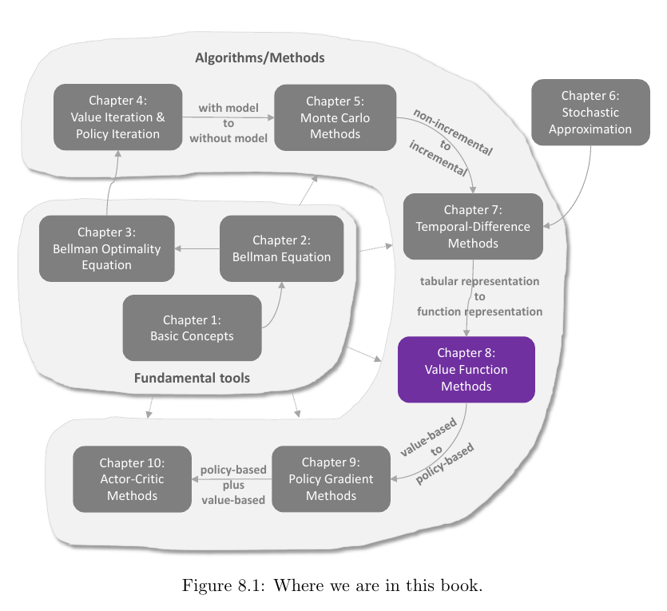

Chapter 8 是从表格型强化学习走向现代深度强化学习的桥梁：

$$
\text{表格型 TD}
\longrightarrow
\text{线性函数近似}
\longrightarrow
\text{状态价值与动作价值近似}
\longrightarrow
\text{神经网络近似}
\longrightarrow
\text{Deep Q-learning}.
$$

本章要解决四个层次的问题：

1. **表示**：如何用 $\hat v(s,w)$ 或 $\hat q(s,a,w)$ 代替价值表？
2. **学习**：如何仅依靠样本更新参数 $w$？
3. **理论**：线性 TD 到底收敛到什么，它最小化什么误差？
4. **工程**：非线性神经网络下，如何借助目标网络和经验回放稳定训练？

> [!important] 一句话总览
> 函数近似把“改一个表项”变成“沿梯度改参数”；参数是共享的，因此一次更新会同时改变许多状态的估计，这既是泛化能力的来源，也是训练不稳定和近似偏差的来源。

## 1. 从表格到函数

### 1.1 两种表示方式

若状态集合为 $\{s_i\}_{i=1}^n$，表格法直接保存：

| 状态 | $s_1$ | $s_2$ | $\cdots$ | $s_n$ |
|---|---:|---:|---:|---:|
| 估计值 | $\hat v(s_1)$ | $\hat v(s_2)$ | $\cdots$ | $\hat v(s_n)$ |

函数近似不保存每一个值，而是选定特征 $\phi(s)$，用参数 $w$ 计算价值。例如一阶函数：

$$
\hat v(s,w)
=as+b
=
\begin{bmatrix}s&1\end{bmatrix}
\begin{bmatrix}a\\b\end{bmatrix}
=\phi^{T}(s)w.
\tag{8.1}
$$

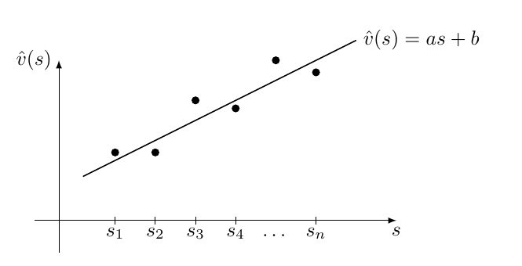

这里的“线性函数近似”是指 **关于参数 $w$ 线性**，并不要求关于状态 $s$ 线性。二阶多项式仍是线性函数近似：

$$
\hat v(s,w)
=as^2+bs+c
=
\begin{bmatrix}s^2&s&1\end{bmatrix}
\begin{bmatrix}a\\b\\c\end{bmatrix}
=\phi^{T}(s)w.
\tag{8.2}
$$

### 1.2 读取、更新与泛化

表格法读取一个值只需索引表项；函数法需要输入 $s$，计算 $\phi(s)$ 并执行一次函数前向计算：

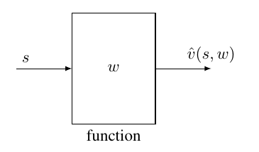

两种方法的核心差异如下：

| 维度 | 表格法 | 函数近似法 |
|---|---|---|
| 存储 | 保存约 $\lvert\mathcal S\rvert$ 个值 | 保存通常低维的参数 $w$ |
| 读取 | 直接索引 | 计算 $\hat v(s,w)$ |
| 更新 | 直接改一个表项 | 改参数 $w$，间接改变价值 |
| 泛化 | 一个表项通常不影响其他状态 | 共享参数使多个状态同时变化 |
| 误差 | 有限表格可精确表示 | 受函数族表达能力限制 |
| 连续状态 | 无法直接穷举 | 可由特征或神经网络处理 |

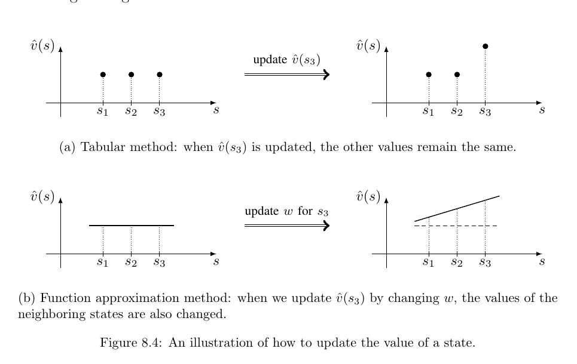

图 8.4 展示了泛化的机制：为改善 $s_3$ 的估计而改变 $w$ 后，$s_1,s_2$ 的估计也可能变化。若特征表达了合理的相似性，这种共享可显著提高样本效率；若特征不合适，则更新也可能错误地干扰其他状态。

> [!note] 补充理解：压缩与偏差
> 用 $m$ 维参数表示 $n$ 个价值，本质上把价值向量限制在一个低维函数族中。当 $m\ll n$ 时通常能节省存储并获得泛化，但真实价值未必属于该函数族，因此会产生无法靠更多样本消除的近似误差。

### 1.3 已知真实价值时的最小二乘

若暂时假设真实价值向量 $v_\pi$ 已知，且第 $i$ 行为 $\phi^T(s_i)$ 的特征矩阵为 $\Phi$，可以直接解：

$$
J_1(w)
=\sum_i\left(\hat v(s_i,w)-v_\pi(s_i)\right)^2
=\lVert\Phi w-v_\pi\rVert_2^2.
$$

当 $\Phi^T\Phi$ 可逆时，普通最小二乘解为：

$$
w^*=(\Phi^T\Phi)^{-1}\Phi^T v_\pi.
$$

强化学习的困难恰在于 $v_\pi$ 未知，只能用交互样本构造替代目标。

## 2. 状态分布与目标函数

### 2.1 均方价值误差

给定策略 $\pi$，最自然的目标是最小化真实价值与估计价值之间的均方误差：

$$
J(w)
=\mathbb E\left[
\left(v_\pi(S)-\hat v(S,w)\right)^2
\right].
\tag{8.3}
$$

期望必须基于某个状态分布。若所有状态等权：

$$
J(w)
=\frac{1}{\lvert\mathcal S\rvert}
\sum_{s\in\mathcal S}
\left(v_\pi(s)-\hat v(s,w)\right)^2.
\tag{8.4}
$$

更符合策略实际访问频率的选择是稳态分布 $d_\pi$：

$$
J(w)
=\sum_{s\in\mathcal S}d_\pi(s)
\left(v_\pi(s)-\hat v(s,w)\right)^2.
\tag{8.5}
$$

这表示经常访问的状态在目标函数中权重更高。

### 2.2 Box 8.1：稳态分布

固定策略 $\pi$ 后，MDP 变为转移矩阵 $P_\pi$ 所描述的马尔可夫链。矩阵 $P_\pi^k$ 的第 $(i,j)$ 个元素是从 $s_i$ 经 $k$ 步到达 $s_j$ 的概率：

$$
\left[P_\pi^k\right]_{ij}=p_{ij}^{(k)}.
$$

若初始分布为 $d_0$，第 $k$ 步访问 $s_i$ 的概率为：

$$
d_k(s_i)
=\sum_jd_0(s_j)\left[P_\pi^k\right]_{ji}.
\tag{8.6}
$$

向量形式为：

$$
d_k^T=d_0^TP_\pi^k.
\tag{8.7}
$$

对正则马尔可夫链，存在唯一稳态分布 $d_\pi$，且：

$$
\lim_{k\to\infty}P_\pi^k
=\mathbf 1_n d_\pi^T.
\tag{8.8}
$$

于是无论初始分布是什么：

$$
\lim_{k\to\infty}d_k^T
=d_0^T\mathbf 1_n d_\pi^T
=d_\pi^T.
\tag{8.9}
$$

稳态分布满足：

$$
d_\pi^T=d_\pi^TP_\pi,
\qquad
d_\pi^T\mathbf 1_n=1.
\tag{8.10}
$$

也就是说，$d_\pi^T$ 是 $P_\pi$ 对应特征值 $1$ 的左特征向量，并归一化为概率分布。

相关概念：

- **可达**：若存在某个 $k$ 使 $p_{ij}^{(k)}>0$，则 $s_j$ 可由 $s_i$ 到达。
- **互通**：$s_i$ 可达 $s_j$ 且 $s_j$ 也可达 $s_i$。
- **不可约**：任意两状态互通。
- **正则**：存在同一个 $k$，使 $P_\pi^k$ 的所有元素严格为正。
- 正则蕴含不可约；不可约链若存在适当的非周期性条件，例如教材示例中每个状态可自转移，则可得到正则性。

探索性策略通常让更多动作具有正概率，从而更容易使诱导的马尔可夫链不可约或正则。

### 2.3 稳态分布示例

教材示例的转移矩阵为：

$$
P_\pi^T=
\begin{bmatrix}
0.3&0.1&0.1&0\\
0.1&0.3&0&0.1\\
0.6&0&0.3&0.1\\
0&0.6&0.6&0.8
\end{bmatrix}.
$$

其特征值为 $\{-0.0449,0.3,0.4449,1\}$，由特征值 $1$ 对应的左特征向量得到：

$$
d_\pi=
\begin{bmatrix}
0.0345\\0.1084\\0.1330\\0.7241
\end{bmatrix}.
$$

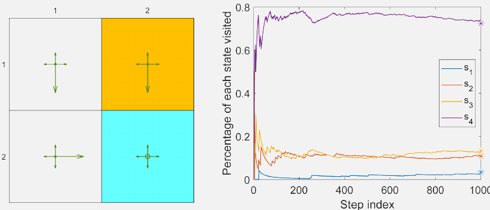

图 8.5 中，1000 步轨迹的经验访问比例逐渐接近理论值。轨迹越长，频率估计通常越稳定。

## 3. 基于函数近似的状态价值 TD

### 3.1 从梯度下降到样本更新

对式 (8.3) 求负梯度并把常数 $2$ 吸收到步长中：

$$
w_{k+1}
=w_k+2\alpha_k
\mathbb E\left[
\left(v_\pi(S)-\hat v(S,w_k)\right)
\nabla_w\hat v(S,w_k)
\right].
\tag{8.11}
$$

以样本 $s_t$ 代替期望可得随机梯度形式：

$$
w_{t+1}
=w_t+\alpha_t
\left[v_\pi(s_t)-\hat v(s_t,w_t)\right]
\nabla_w\hat v(s_t,w_t).
\tag{8.12}
$$

但 $v_\pi(s_t)$ 仍未知。可以有两种替代：

- Monte Carlo：用完整回报 $g_t$ 替代 $v_\pi(s_t)$；
- TD：用一步目标 $r_{t+1}+\gamma\hat v(s_{t+1},w_t)$ 替代。

因此得到一般的函数近似 TD 更新：

$$
w_{t+1}
=w_t+\alpha_t
\left[
r_{t+1}+\gamma\hat v(s_{t+1},w_t)-\hat v(s_t,w_t)
\right]
\nabla_w\hat v(s_t,w_t).
\tag{8.13}
$$

定义 TD 误差：

$$
\delta_t
=r_{t+1}+\gamma\hat v(s_{t+1},w_t)-\hat v(s_t,w_t),
$$

则参数更新只有一个骨架：

$$
w_{t+1}=w_t+\alpha_t\delta_t\nabla_w\hat v(s_t,w_t).
$$

> [!note] 补充理解：为什么常称为半梯度
> 在 TD 更新中，目标本身含有当前参数产生的下一状态估计，但算法只对当前状态的估计项取梯度，并把目标暂时视为常数。现代文献常称这种更新为 semi-gradient。教材正文主要直接从采样替代的角度推导，不依赖这一术语。

### 3.2 Algorithm 8.1：TD with function approximation

```text
输入：固定策略 π，初始参数 w0，步长序列 {αt}
对每个回合：
    生成初始状态 s0
    当尚未终止：
        按 π 在 st 选择 at
        与环境交互，得到 rt+1, st+1
        δt <- rt+1 + γ v_hat(st+1, wt) - v_hat(st, wt)
        wt+1 <- wt + αt δt grad_w v_hat(st, wt)
        st <- st+1
输出：v_hat(s, w)
```

终止状态的后继价值按 $0$ 处理。

### 3.3 线性 TD

选择：

$$
\hat v(s,w)=\phi^T(s)w,
\qquad
\nabla_w\hat v(s,w)=\phi(s).
$$

代入式 (8.13)：

$$
w_{t+1}
=w_t+\alpha_t
\left[
r_{t+1}
+\gamma\phi^T(s_{t+1})w_t
-\phi^T(s_t)w_t
\right]\phi(s_t).
\tag{8.14}
$$

这就是 TD-Linear。它每一步只需计算两个特征向量和一个向量加法，复杂度随特征维数 $m$ 增长，而不是随状态数增长。

### 3.4 Box 8.2：表格 TD 是线性 TD 的特例

为每个状态选 one-hot 特征：

$$
\phi(s)=e_s,
$$

其中 $e_s$ 仅在状态 $s$ 对应位置为 $1$。则：

$$
\hat v(s,w)=e_s^Tw=w(s).
$$

式 (8.14) 变为：

$$
w_{t+1}
=w_t+\alpha_t
\left[r_{t+1}+\gamma w_t(s_{t+1})-w_t(s_t)\right]e_{s_t}.
$$

只有 $s_t$ 对应分量发生变化：

$$
w_{t+1}(s_t)
=w_t(s_t)+\alpha_t
\left[r_{t+1}+\gamma w_t(s_{t+1})-w_t(s_t)\right],
$$

这正是表格型 TD。因此，表格法不是另一套互不相干的方法，而是函数近似中使用 one-hot 特征的特殊情形。

## 4. 特征选择与示例

### 4.1 示例设置

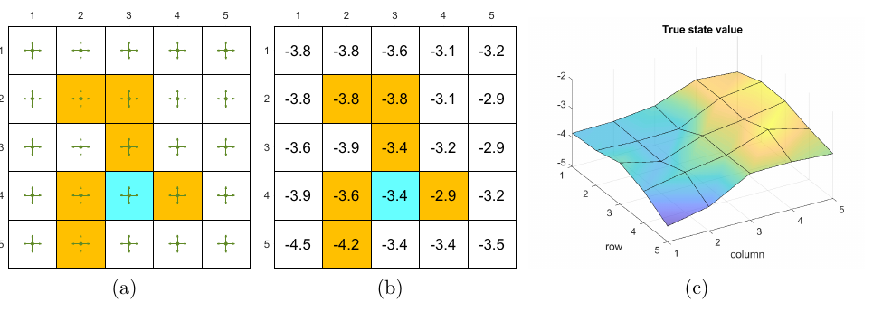

教材使用 $5\times5$ 网格世界。给定策略在每个状态以 $0.2$ 的概率选择任一动作。实验使用：

- 每次训练 500 个回合，每回合 500 步；
- 初始状态与动作均匀随机；
- $w$ 按标准正态分布初始化；
- $r_{\text{forbidden}}=r_{\text{boundary}}=-1$，$r_{\text{target}}=1$；
- $\gamma=0.9$。

### 4.2 多项式特征

令状态二维坐标为 $(x,y)$。一次特征：

$$
\phi(s)=\begin{bmatrix}1&x&y\end{bmatrix}^T\in\mathbb R^3.
\tag{8.15}
$$

二次特征：

$$
\phi(s)
=\begin{bmatrix}1&x&y&x^2&y^2&xy\end{bmatrix}^T
\in\mathbb R^6.
\tag{8.16}
$$

三次特征：

$$
\phi(s)
=\begin{bmatrix}
1&x&y&x^2&y^2&xy&x^3&y^3&x^2y&xy^2
\end{bmatrix}^T
\in\mathbb R^{10}.
\tag{8.17}
$$

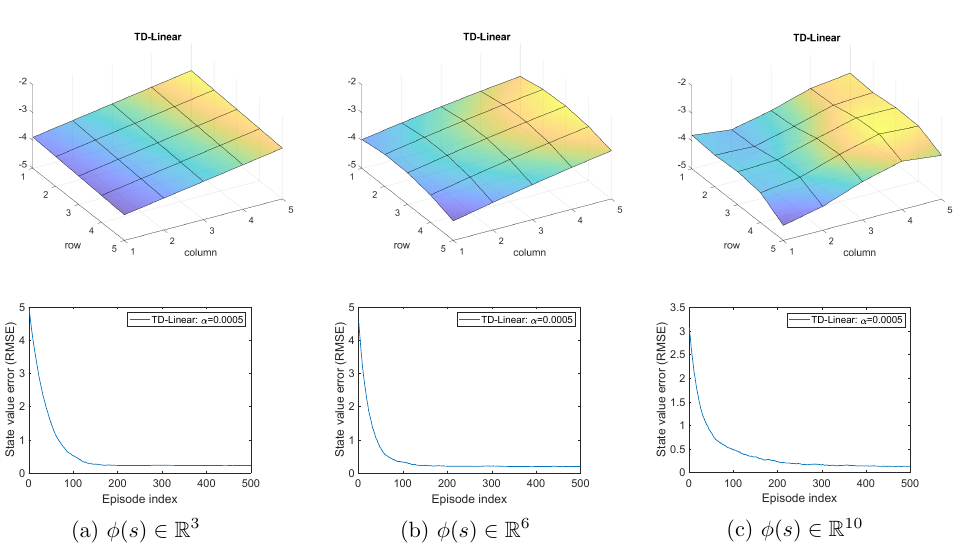

维数越高，拟合曲面越灵活，误差平台通常越低；但三种误差都没有降到零，说明误差平台可能是函数族的表达能力限制，而非优化尚未结束。

### 4.3 Fourier 特征

先把 $x,y$ 归一化至 $[0,1]$。令 $c_1,c_2\in\{0,1,\ldots,q\}$，Fourier 特征的各分量为：

$$
\phi(s)
=
\begin{bmatrix}
\vdots\\
\cos\!\left(\pi(c_1x+c_2y)\right)\\
\vdots
\end{bmatrix}
\in\mathbb R^{(q+1)^2}.
\tag{8.18}
$$

例如 $q=1$ 时：

$$
\phi(s)=
\begin{bmatrix}
1\\
\cos(\pi y)\\
\cos(\pi x)\\
\cos(\pi(x+y))
\end{bmatrix}
\in\mathbb R^4.
$$

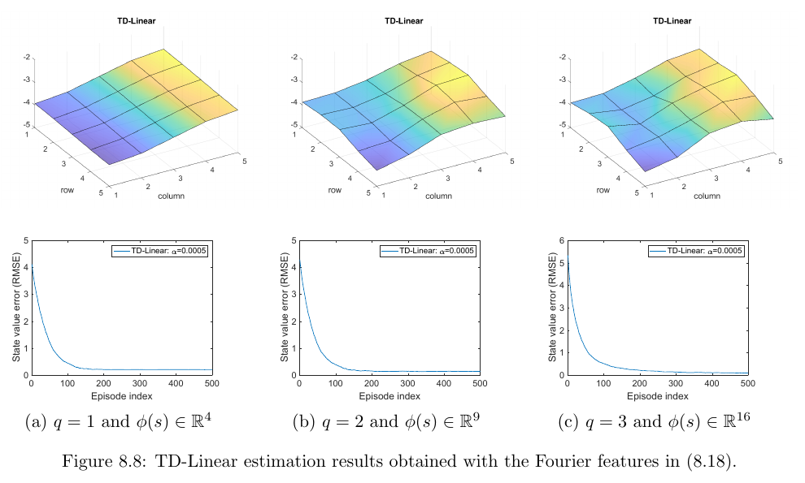

当 $q=1,2,3$ 时，特征维数分别为 $4,9,16$。实验同样显示，增加频率基函数可提升表达能力并降低误差，但也增加存储、计算以及选择超参数的负担。

> [!tip] 特征设计的实用判断
> 特征应让“价值相近或动力学相近”的状态拥有相近表示。多项式偏向全局平滑，Fourier 基能表示不同空间频率，one-hot 完全不泛化。不存在对所有任务都最好的固定特征。

## 5. TD-Linear 的理论分析

### 5.1 期望更新

为分析平均行为，把随机样本更新替换为条件期望：

$$
w_{t+1}
=w_t+\alpha_t
\mathbb E\left[
\left(
R+\gamma\phi^T(S')w_t-\phi^T(S)w_t
\right)\phi(S)
\right].
\tag{8.19}
$$

设共有 $n$ 个状态、$m$ 个特征：

$$
\Phi=
\begin{bmatrix}
\phi^T(s_1)\\
\phi^T(s_2)\\
\vdots\\
\phi^T(s_n)
\end{bmatrix}
\in\mathbb R^{n\times m},
\qquad
D=\operatorname{diag}
\left(d_\pi(s_1),\ldots,d_\pi(s_n)\right).
\tag{8.20}
$$

### 5.2 Lemma 8.1：期望更新是线性系统

式 (8.19) 中的期望可写成 $b-Aw_t$，其中：

$$
A=\Phi^TD(I-\gamma P_\pi)\Phi,
\qquad
b=\Phi^TDr_\pi.
\tag{8.21}
$$

于是确定性平均迭代为：

$$
w_{t+1}=w_t+\alpha_t(b-Aw_t).
\tag{8.22}
$$

若 $A$ 可逆，固定点是：

$$
w^*=A^{-1}b.
$$

当 $\Phi=I$，即表格表示时：

$$
w^*
=\left[D(I-\gamma P_\pi)\right]^{-1}Dr_\pi
=(I-\gamma P_\pi)^{-1}r_\pi
=v_\pi.
\tag{8.23}
$$

函数近似的一般情形中，$\Phi w^*$ 通常不等于 $v_\pi$，而是某个投影固定点。

### 5.3 Box 8.3：Lemma 8.1 的推导

利用全期望公式，奖励部分为：

$$
\mathbb E[R\phi(S)]
=\sum_s d_\pi(s)\phi(s)r_\pi(s)
=\Phi^TDr_\pi=b.
\tag{8.24}
$$

当前状态价值项为：

$$
\mathbb E[\phi(S)\phi^T(S)w_t]
=\Phi^TD\Phi w_t.
\tag{8.25}
$$

下一状态价值项为：

$$
\mathbb E[\phi(S)\phi^T(S')w_t]
=\Phi^TDP_\pi\Phi w_t.
\tag{8.26}
$$

合并三项：

$$
\mathbb E\left[
\left(R+\gamma\phi^T(S')w_t-\phi^T(S)w_t\right)\phi(S)
\right]
=b-Aw_t.
\tag{8.27}
$$

### 5.4 Box 8.4：$A$ 的正定性

假设 $P_\pi$ 正则，使 $d_\pi(s)>0$；再假设 $\Phi$ 满列秩。令：

$$
M=D(I-\gamma P_\pi).
\tag{8.28}
$$

教材通过对称部分 $M+M^T$ 的严格对角占优说明 $M$ 为正定矩阵。关键关系是：

$$
(M+M^T)\mathbf 1_n
=2(1-\gamma)d_\pi>0.
\tag{8.29}
$$

于是对任意非零 $x$，令 $y=\Phi x\ne0$：

$$
x^TAx
=x^T\Phi^TM\Phi x
=y^TMy>0.
$$

因此 $A$ 正定并可逆，固定点唯一。

### 5.5 两种收敛论证

定义参数误差 $\widetilde w_t=w_t-w^*$。由 $Aw^*=b$：

$$
\widetilde w_{t+1}
=(I-\alpha_tA)\widetilde w_t.
$$

教材给出两条思路：

1. **小常数步长的确定性迭代**：当步长足够小时，线性映射 $I-\alpha A$ 产生收缩，平均迭代趋向 $w^*$。
2. **随机逼近**：对真实随机更新，若噪声满足适当条件，且

$$
\sum_{t=0}^{\infty}\alpha_t=\infty,
\qquad
\sum_{t=0}^{\infty}\alpha_t^2<\infty,
$$

则可利用 Robbins-Monro 型结果证明几乎处处收敛。

> [!warning] 适用范围
> 这一节的保证依赖固定策略、线性函数近似、稳态采样、满秩特征以及步长与噪声条件。不能把结论直接推广为“任意非线性函数近似加任意 off-policy TD 都会收敛”。

## 6. TD-Linear 到底最小化什么

### 6.1 三种误差不能混为一谈

定义加权范数：

$$
\lVert x\rVert_D^2=x^TDx
=\lVert D^{1/2}x\rVert_2^2.
$$

**价值估计误差**：

$$
J_E(w)
=\lVert\Phi w-v_\pi\rVert_D^2.
$$

它直接衡量估计价值与真实价值的距离，但真实 $v_\pi$ 未知，通常不能直接优化。

定义 Bellman 算子：

$$
T_\pi(x)=r_\pi+\gamma P_\pi x.
$$

**Bellman 误差**：

$$
\begin{aligned}
J_{\mathrm{BE}}(w)
&=\lVert\Phi w-(r_\pi+\gamma P_\pi\Phi w)\rVert_D^2\\
&=\lVert\Phi w-T_\pi(\Phi w)\rVert_D^2.
\end{aligned}
\tag{8.30}
$$

但 $T_\pi(\Phi w)$ 往往不在 $\Phi$ 的列空间中。定义关于 $D$ 加权内积的投影：

$$
\mathcal M
=\Phi(\Phi^TD\Phi)^{-1}\Phi^TD.
$$

**投影 Bellman 误差**：

$$
J_{\mathrm{PBE}}(w)
=\lVert\Phi w-\mathcal M T_\pi(\Phi w)\rVert_D^2.
$$

TD-Linear 的固定点满足投影 Bellman 方程，因此它最小化的是 $J_{\mathrm{PBE}}$，不一定直接最小化 $J_E$ 或 $J_{\mathrm{BE}}$。

### 6.2 Box 8.5：投影 Bellman 固定点

固定点条件 $Aw^*=b$ 等价于：

$$
\Phi^TD
\left[
\Phi w^*-T_\pi(\Phi w^*)
\right]=0.
$$

再左乘 $\Phi(\Phi^TD\Phi)^{-1}$：

$$
\Phi w^*
=\mathcal M T_\pi(\Phi w^*).
\tag{8.31}
$$

几何意义是：先做一次 Bellman 更新，再投影回可表示子空间，最终得到的点不再移动。

### 6.3 误差界

TD 固定点与最佳可表示价值之间满足教材给出的界：

$$
\lVert\Phi w^*-v_\pi\rVert_D
\le
\frac{1}{1-\gamma}
\min_w\lVert\hat v(w)-v_\pi\rVert_D
=
\frac{1}{1-\gamma}
\min_w\sqrt{J_E(w)}.
\tag{8.32}
$$

这个界说明 TD 误差受函数族最佳近似误差控制，但 $\gamma$ 接近 $1$ 时系数很大，界可能很松。

### 6.4 Box 8.6：误差界的证明骨架

利用式 (8.31)、$v_\pi=T_\pi(v_\pi)$ 以及投影的非扩张性：

$$
\begin{aligned}
\lVert\Phi w^*-v_\pi\rVert_D
&\le
\lVert\mathcal M T_\pi(\Phi w^*)-\mathcal M v_\pi\rVert_D
+\lVert\mathcal M v_\pi-v_\pi\rVert_D\\
&\le
\gamma\lVert\Phi w^*-v_\pi\rVert_D
+\lVert\mathcal M v_\pi-v_\pi\rVert_D.
\end{aligned}
\tag{8.33}
$$

这里使用了：

$$
\lVert\mathcal M\rVert_D=1,
\qquad
\lVert P_\pi x\rVert_D\le\lVert x\rVert_D.
$$

第二个不等式可由 Jensen 不等式和稳态关系 $d_\pi^T=d_\pi^TP_\pi$ 得到。移项后即得式 (8.32)，而 $\mathcal Mv_\pi$ 正是列空间中对 $v_\pi$ 的最佳 $D$ 加权近似。

## 7. Least-Squares TD

式 (8.21) 也可写成样本期望：

$$
A
=\mathbb E\left[
\phi(s_t)
\left(\phi(s_t)-\gamma\phi(s_{t+1})\right)^T
\right],
\qquad
b=\mathbb E[r_{t+1}\phi(s_t)].
$$

LSTD 用所有已收集样本直接估计 $A,b$：

$$
\begin{aligned}
\hat A_t
&=\sum_{k=0}^{t-1}
\phi(s_k)
\left(\phi(s_k)-\gamma\phi(s_{k+1})\right)^T,\\
\hat b_t
&=\sum_{k=0}^{t-1}r_{k+1}\phi(s_k),\\
w_t&=\hat A_t^{-1}\hat b_t.
\end{aligned}
\tag{8.34}
$$

期望中的 $1/t$ 在 $\hat A_t^{-1}\hat b_t$ 中相消，因此教材直接使用求和形式。早期样本少、矩阵可能奇异时，可用：

$$
\hat A_t+\sigma I,
\qquad \sigma>0
$$

进行正则化。

LSTD 的特点：

- 充分重复利用全部历史样本，常比逐步 TD 更节省样本；
- 避免手工选择梯度步长来缓慢逼近固定点；
- 需要维护 $m\times m$ 矩阵；
- 直接求逆通常为 $O(m^3)$，高维时开销大；
- 可利用矩阵求逆引理递推更新逆矩阵，避免每步从头求逆；
- 本节形式针对线性状态价值近似。

## 8. 基于函数近似的动作价值学习

### 8.1 Sarsa with function approximation

把 $q(s,a)$ 替换为 $\hat q(s,a,w)$，on-policy Sarsa 更新为：

$$
w_{t+1}
=w_t+\alpha_t
\left[
r_{t+1}
+\gamma\hat q(s_{t+1},a_{t+1},w_t)
-\hat q(s_t,a_t,w_t)
\right]
\nabla_w\hat q(s_t,a_t,w_t).
\tag{8.35}
$$

若为线性近似 $\hat q(s,a,w)=\phi^T(s,a)w$，梯度就是 $\phi(s,a)$。

```text
Algorithm 8.2：Sarsa with function approximation
初始化 w0 与 ε-greedy 策略 π0
对每个回合：
    生成 s0，并按 π0 选择 a0
    当尚未到达目标：
        执行 at，观察 rt+1, st+1
        按当前策略在 st+1 选择 at+1
        用式 (8.35) 更新 w
        令 πt+1 对更新后的 q_hat 采取 ε-greedy
        st <- st+1，at <- at+1
```

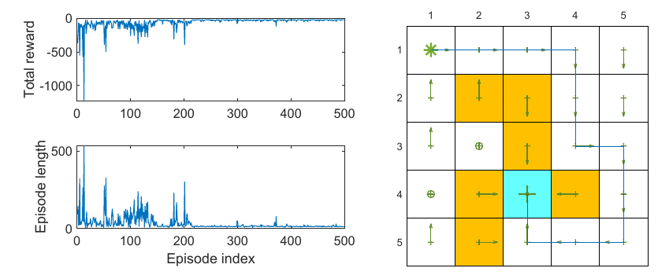

示例参数为 $\gamma=0.9$、$\epsilon=0.1$、$r_{\text{boundary}}=r_{\text{forbidden}}=-10$、$r_{\text{target}}=1$、$\alpha=0.001$，并使用五阶 Fourier 特征。总回报上升、回合长度下降，最终策略能到达目标。

### 8.2 Q-learning with function approximation

Q-learning 用贪心下一状态价值替换实际采样的 $a_{t+1}$：

$$
w_{t+1}
=w_t+\alpha_t
\left[
r_{t+1}
+\gamma\max_{a\in\mathcal A(s_{t+1})}
\hat q(s_{t+1},a,w_t)
-\hat q(s_t,a_t,w_t)
\right]
\nabla_w\hat q(s_t,a_t,w_t).
\tag{8.36}
$$

```text
Algorithm 8.3：Q-learning with function approximation（on-policy 采样版本）
初始化 w0 与 ε-greedy 策略 π0
对每个回合：
    当尚未到达目标：
        按 πt 在 st 选择 at
        执行 at，观察 rt+1, st+1
        以 max_a q_hat(st+1, a, wt) 构造目标并更新 w
        用更新后的 q_hat 改进 ε-greedy 策略
```

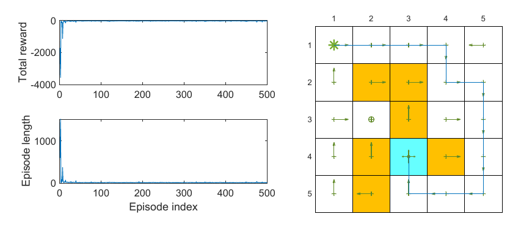

> [!warning] 教材的编号重复
> 教材把本节的函数近似 Q-learning 标为 Algorithm 8.3，后面的 Deep Q-learning 又再次标为 Algorithm 8.3。本文保留原编号，并用算法名称区分二者。

尽管价值已经用函数表示，Algorithm 8.2 和这里的 Algorithm 8.3 中，策略 $\pi(a\mid s)$ 仍按状态保存在表格中，所以仍隐含有限状态与有限动作的假设。下一章才进一步把策略本身也参数化。

## 9. Deep Q-learning

### 9.1 从 Q-learning 到 DQN

用神经网络 $\hat q(s,a,w)$ 近似最优动作价值，基本平方 TD 目标为：

$$
J(w)
=\mathbb E\left[
\left(
R+\gamma\max_{a\in\mathcal A(S')}
\hat q(S',a,w)
-\hat q(S,A,w)
\right)^2
\right].
\tag{8.37}
$$

若目标和当前估计都由同一个快速变化的网络产生，训练目标会随每次参数更新一起移动。DQN 使用两套参数：

- 主网络参数 $w$：每次迭代更新；
- 目标网络参数 $w_T$：在一段时间内固定，每隔 $C$ 次迭代复制 $w_T\leftarrow w$。

固定目标网络后，单个样本的目标为：

$$
y_T
=r+\gamma\max_{a\in\mathcal A(s')}
\hat q(s',a,w_T).
$$

把 $w_T$ 视为常数，忽略不影响方向的常数因子，梯度为：

$$
\nabla_wJ
=-\mathbb E\left[
\left(
R+\gamma\max_{a\in\mathcal A(S')}
\hat q(S',a,w_T)
-\hat q(S,A,w)
\right)
\nabla_w\hat q(S,A,w)
\right].
\tag{8.38}
$$

主网络实际通过神经网络训练工具，在 mini-batch 上最小化：

$$
\frac{1}{B}\sum_{i=1}^{B}
\left(y_{T,i}-\hat q(s_i,a_i,w)\right)^2.
$$

### 9.2 经验回放

经验样本写作 $(s,a,r,s')$，存入回放缓冲区：

$$
\mathcal B=\{(s,a,r,s')\}.
$$

训练时不按生成顺序使用数据，而是从 $\mathcal B$ 中均匀抽取 mini-batch。教材强调两点作用：

1. 打破连续轨迹样本之间的强相关性，使批次更接近目标函数所假定的抽样方式；
2. 一个样本可被重复使用，提高数据效率。

> [!note] 补充理解：均匀回放的边界
> 教材用均匀分布解释基本经验回放。实际算法也可采用非均匀采样，但这会改变采样分布，通常需要额外校正；这不属于本章基本 DQN 的讨论范围。

### 9.3 Algorithm 8.3：Deep Q-learning，off-policy 版本

```text
初始化：主网络 w，目标网络 wT <- w，回放缓冲区 B
由行为策略 πb 收集转移 (s, a, r, s') 并存入 B
对每次训练迭代：
    从 B 中均匀抽取 mini-batch
    对每个样本计算：
        yT <- r + γ max_a q_hat(s', a, wT)
    更新主网络 w，使 (yT - q_hat(s, a, w))^2 的批均值下降
    每隔 C 次迭代令 wT <- w
输出：近似最优动作价值与相应贪心策略
```

该算法是 off-policy：产生经验的行为策略 $\pi_b$ 与目标贪心策略可以不同。

### 9.4 示例一：覆盖充分

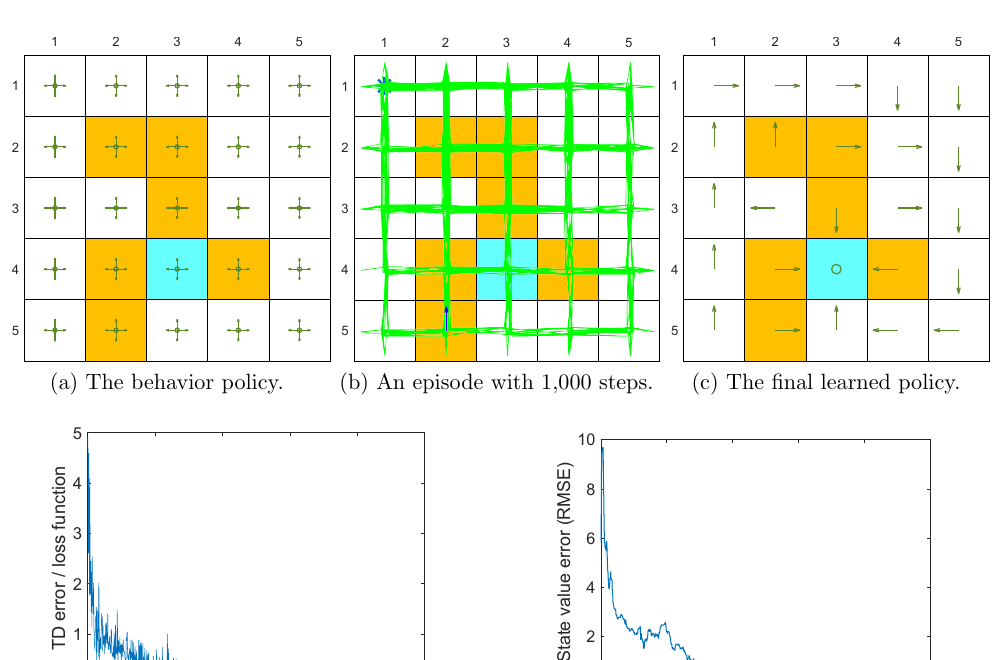

实验设置：

- 行为策略在每个状态对所有动作等概率，探索充分；
- 单条轨迹 1000 步，回放缓冲区含 1000 个样本；
- mini-batch 大小为 100；
- 主网络和目标网络均有一个 100 神经元的隐藏层；
- 输入为归一化的行索引、列索引、动作索引，共 3 维；输出为一个动作价值；
- $\gamma=0.9$，边界和禁区奖励为 $-10$，目标奖励为 $1$。

训练损失和真实价值 RMSE 都趋近于零，最终贪心策略正确。函数近似的泛化与样本重复利用，使 1000 步数据在该示例中已经足够。

### 9.5 示例二：覆盖不足与过拟合

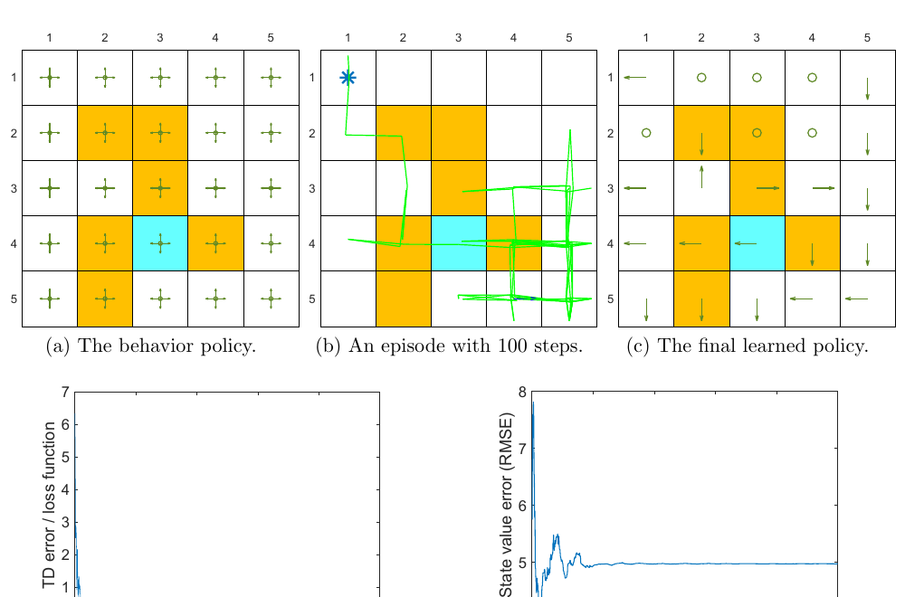

第二个示例只有 100 步经验，mini-batch 大小为 50。结果是：

- 训练损失仍趋近于零；
- 真实动作价值误差停在较高水平；
- 最终策略在未充分覆盖的状态中表现错误。

这揭示了一个重要诊断原则：

$$
\text{低训练 TD 损失}
\not\Rightarrow
\text{真实价值准确}
\not\Rightarrow
\text{策略最优}.
$$

网络只证明自己拟合了缓冲区中的样本；若数据没有覆盖关键状态-动作对，训练损失无法反映全局价值误差。

## 10. 方法关系与选择

| 方法 | 估计对象 | 表示 | 目标来源 | 主要特点 |
|---|---|---|---|---|
| 表格 TD | $v_\pi$ | 每状态一个表项 | 一步 TD | 无跨状态泛化 |
| TD-Linear | $v_\pi$ | $\phi^T(s)w$ | 一步 TD | 理论清晰，依赖特征 |
| LSTD | $v_\pi$ | $\phi^T(s)w$ | 线性方程样本估计 | 样本高效，矩阵开销大 |
| Sarsa + FA | $q_\pi$ 或改进策略 | $\hat q(s,a,w)$ | 实际下一动作 | on-policy |
| Q-learning + FA | $q_*$ | $\hat q(s,a,w)$ | 下一状态最大值 | 控制目标与行为可分离 |
| DQN | $q_*$ | 神经网络 | 固定一段时间的目标网络 | 回放、mini-batch、非线性泛化 |

> [!important] 三条贯穿全章的权衡
> 1. 表示维数越低，存储越省，但可能产生更大近似偏差。
> 2. 泛化越强，一个样本影响越广，既可能提高样本效率，也可能扩大错误更新。
> 3. 训练目标越自举、函数越非线性，越需要稳定目标与更合理的数据分布。

## 11. 本章 Q&A

### Q1：表格法与函数近似法有什么区别？

表格法直接读取和改写对应表项；函数近似法输入状态计算价值，并通过修改共享参数间接改变价值。后者需要前向计算，也会使一个状态的更新影响其他状态。

### Q2：函数近似相对表格法有什么优势？

第一，参数维数通常远小于状态数，存储更高效；第二，共享参数带来跨状态泛化，使一个状态的经验帮助估计其他状态；第三，可处理无法穷举的连续或巨大状态空间。代价是近似误差和训练稳定性问题。

### Q3：两种方法能统一吗？

能。取 $\phi(s)=e_s$ 的 one-hot 特征时，线性函数近似退化为价值表，TD-Linear 退化为表格 TD，见 Box 8.2。

### Q4：什么是稳态分布，为什么重要？

固定策略长期运行后，状态访问概率若收敛到与初始分布无关的 $d_\pi$，它就是稳态分布。它描述策略实际将时间花在哪里，并为均方价值误差提供自然的状态权重；后续策略梯度方法也会再次使用该概念。

### Q5：线性函数近似的优缺点是什么？

优点是形式简单、计算便宜、理论可较完整分析，并且包含表格法这一特例。缺点是表达能力有限，而且复杂任务中选择合适特征并不容易。神经网络表达力更强，但优化和理论更复杂。

### Q6：为什么 Deep Q-learning 需要经验回放？

顺序轨迹样本高度相关，从缓冲区随机抽样可削弱相关性并更接近训练目标假定的抽样分布；同一经验还能被多次利用，提高数据效率。

### Q7：表格 Q-learning 能使用经验回放吗？

可以。表格 Q-learning 本身并不要求按数据生成顺序更新，其 off-policy 性质允许重放由行为策略收集的样本。它不一定需要回放，但可以借此重复使用数据。

### Q8：为什么 DQN 要维护两套网络？

参数 $w$ 同时出现在当前估计和自举目标中，会让目标随更新快速移动。目标网络在一段时间内冻结 $w_T$，使主网络面对相对稳定的回归目标；随后周期性复制主网络参数，避免目标永久过时。

### Q9：神经网络作为非线性近似器时，如何更新参数？

把 mini-batch 的目标值 $y_T$ 和网络输出组成均方损失，使用成熟的反向传播与优化器更新主网络，而不是把标量网络参数误当成表项直接改写。目标网络则按周期整体复制参数。

## 12. 一页复习提纲

1. **表示**：$\hat v(s,w)$、$\hat q(s,a,w)$ 用参数替代价值表。
2. **线性不等于关于状态线性**：只要 $\hat v=\phi^Tw$ 对 $w$ 线性即可。
3. **目标权重**：$d_\pi$ 是策略长期访问分布，决定哪些状态误差更重要。
4. **TD 参数更新**：$w\leftarrow w+\alpha\delta\nabla_w\hat v$。
5. **TD-Linear**：梯度等于特征 $\phi(s)$。
6. **表格统一**：one-hot 特征使函数近似退化为表格。
7. **理论固定点**：$Aw^*=b$，其中 $A=\Phi^TD(I-\gamma P_\pi)\Phi$。
8. **真正的优化对象**：TD-Linear 对应投影 Bellman 固定点，而非一般意义下直接最小化价值误差。
9. **误差来源**：采样误差、优化误差、函数族近似误差必须区分。
10. **LSTD**：用样本累计估计 $A,b$ 并解线性方程。
11. **动作价值**：Sarsa 使用实际下一动作；Q-learning 使用下一状态最大动作价值。
12. **DQN 稳定组件**：目标网络稳定目标，经验回放改变样本使用方式。
13. **诊断警告**：低 TD 训练损失不保证真实价值准确，数据覆盖同样关键。

## 13. 公式速查

### 表示与目标

$$
\hat v(s,w)=\phi^T(s)w,
\qquad
J_E(w)=\lVert\Phi w-v_\pi\rVert_D^2.
$$

### 状态价值 TD

$$
\delta_t=r_{t+1}+\gamma\hat v(s_{t+1},w_t)-\hat v(s_t,w_t),
$$

$$
w_{t+1}=w_t+\alpha_t\delta_t\nabla_w\hat v(s_t,w_t).
$$

线性时：

$$
w_{t+1}=w_t+\alpha_t\delta_t\phi(s_t).
$$

### 线性 TD 固定点

$$
A=\Phi^TD(I-\gamma P_\pi)\Phi,
\qquad
b=\Phi^TDr_\pi,
\qquad
w^*=A^{-1}b.
$$

### 投影 Bellman 方程

$$
\mathcal M=\Phi(\Phi^TD\Phi)^{-1}\Phi^TD,
$$

$$
\Phi w^*=\mathcal MT_\pi(\Phi w^*).
$$

### Sarsa 与 Q-learning

$$
\delta_t^{\text{Sarsa}}
=r_{t+1}+\gamma\hat q(s_{t+1},a_{t+1},w_t)-\hat q(s_t,a_t,w_t),
$$

$$
\delta_t^{\text{Q}}
=r_{t+1}+\gamma\max_a\hat q(s_{t+1},a,w_t)-\hat q(s_t,a_t,w_t).
$$

### DQN 目标

$$
y_T=r+\gamma\max_a\hat q(s',a,w_T),
\qquad
L(w)=\frac{1}{B}\sum_i\left(y_{T,i}-\hat q(s_i,a_i,w)\right)^2.
$$

## 14. 符号表

| 符号 | 含义 |
|---|---|
| $\hat v(s,w)$ | 参数为 $w$ 的状态价值近似 |
| $\hat q(s,a,w)$ | 参数为 $w$ 的动作价值近似 |
| $\phi(s)$ | 状态特征向量 |
| $\Phi$ | 以 $\phi^T(s_i)$ 为行的特征矩阵 |
| $d_\pi$ | 策略 $\pi$ 诱导的稳态分布 |
| $D$ | $d_\pi$ 构成的对角权重矩阵 |
| $P_\pi$ | 固定策略后的状态转移矩阵 |
| $r_\pi$ | 固定策略下的期望即时奖励向量 |
| $T_\pi$ | 策略 Bellman 算子 |
| $\mathcal M$ | 到 $\Phi$ 列空间的 $D$ 加权投影 |
| $A,b$ | 线性 TD 平均更新中的矩阵和向量 |
| $w_T$ | DQN 目标网络参数 |
| $\mathcal B$ | 经验回放缓冲区 |
| $C$ | 目标网络同步间隔 |
| $B$ | mini-batch 大小 |

## 15. 易错点与辨析

1. **“线性近似”不是“价值关于状态坐标只能是一条直线”**。多项式、Fourier 特征都可保持对参数线性。
2. **稳态分布不是任意指定的均匀分布**。它由策略和环境转移共同决定，并满足 $d_\pi^T=d_\pi^TP_\pi$。
3. **TD-Linear 不直接最小化真实价值误差**。其固定点对应投影 Bellman 方程。
4. **更高维特征不保证误差为零**。真实价值可能仍不在特征张成的子空间中。
5. **低训练损失不等于策略正确**。图 8.12 展示了数据覆盖不足时的反例。
6. **目标网络不是第二个独立智能体**。它只是主网络参数的延迟副本，用来形成较稳定目标。
7. **经验回放不是凭空创造信息**。它提高样本复用率，却无法补足从未覆盖的关键状态-动作对。
8. **函数近似价值不代表策略也已函数化**。本章 Sarsa 和线性 Q-learning 的策略仍用表格表示。
9. **Sarsa 与 Q-learning 的区别仍在目标**。是否使用函数近似不会改变 on-policy 与 off-policy 的基本区别。
10. **教材存在 Algorithm 8.3 重复编号**。一个是函数近似 Q-learning，另一个是 Deep Q-learning，应按名称识别。

## 16. 自测题

### 概念题

1. 为什么共享参数同时带来样本效率和干扰风险？
2. 为什么目标函数需要指定状态分布？选择 $d_\pi$ 有什么含义？
3. 为什么 one-hot 特征没有跨状态泛化？
4. TD-Linear 的固定点为什么通常不等于真实 $v_\pi$？
5. 投影 Bellman 误差与 Bellman 误差的区别是什么？
6. 为什么 $\gamma$ 接近 $1$ 时式 (8.32) 的界会变松？
7. LSTD 与逐步 TD 在样本使用和计算开销上如何权衡？
8. 目标网络冻结过久或同步过频分别可能带来什么问题？
9. 为什么图 8.12 中训练损失为零却仍学不到正确价值？

### 推导题

1. 从式 (8.19) 展开全期望，推导 $b-Aw_t$。
2. 令 $\Phi=I$，从式 (8.21) 推导 $w^*=v_\pi$。
3. 从 $Aw^*=b$ 推导投影 Bellman 固定点式 (8.31)。
4. 使用 $\lVert\mathcal M\rVert_D=1$ 和 $\lVert P_\pi x\rVert_D\le\lVert x\rVert_D$ 推导式 (8.32)。
5. 分别写出 Sarsa、Q-learning 和 DQN 的一步目标，并指出哪一个参数被视为固定。

### 实践题

1. 在同一网格世界中比较 one-hot、多项式与 Fourier 特征的学习曲线和最终误差。
2. 固定网络结构，逐渐缩短经验轨迹，观察训练损失与全状态动作价值 RMSE 何时开始分离。
3. 改变目标网络同步间隔 $C$，比较训练振荡、收敛速度与最终策略。
4. 对 LSTD 加入不同正则化系数 $\sigma$，观察早期矩阵条件数和价值误差。

## 17. 本章结论

本章把强化学习价值估计重写成了一个参数化优化问题。表格法被包含在线性函数近似之中；稳态分布给出了误差权重；TD-Linear 的平均更新归结为 $Aw=b$，其真正目标是投影 Bellman 固定点；LSTD 通过直接估计线性方程提高样本利用率；Sarsa 和 Q-learning 把相同思想扩展到动作价值；DQN 又用神经网络扩大表示能力，并用目标网络与经验回放缓解移动目标和相关样本问题。

最值得带入后续章节的认识是：**函数近似不是简单地把表格换成神经网络，而是同时改变了表示空间、误差定义、样本分布、优化动力学和泛化方式。**
