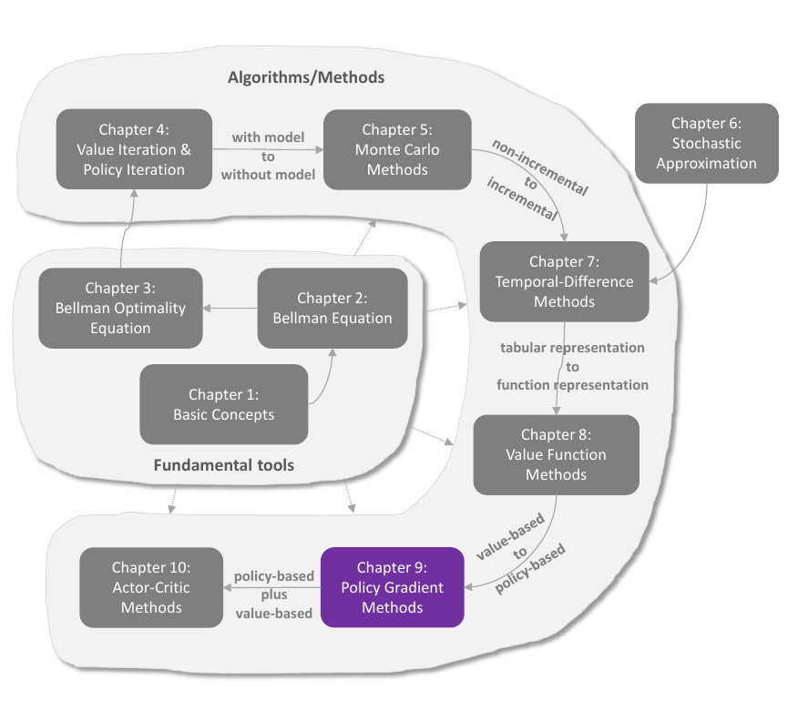
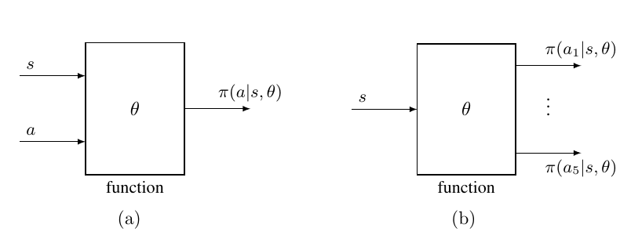

# Chapter 9 - Policy Gradient Methods

> [!abstract] 本章导读
> Chapter 8 用参数化函数表示价值，本章进一步用参数化函数直接表示策略（policy）。这使强化学习第一次从以价值为中心的方法转向以策略为中心的方法。主线非常清楚：先选择一个衡量策略优劣的标量指标 $J(\theta)$，再推导其关于策略参数 $\theta$ 的梯度，最后用经验样本近似真实梯度，得到 Monte Carlo policy gradient，也就是 REINFORCE。真正困难之处在于，策略变化会同时改变动作概率、状态价值和长期状态分布，因此教材分别处理折扣与无折扣情形，并用 Policy Gradient Theorem 将它们统一起来。

## 0. 本章知识结构



本章在全书中的逻辑位置是：

$$
\text{价值函数近似}
\longrightarrow
\text{策略函数近似}
\longrightarrow
\text{策略梯度}
\longrightarrow
\text{REINFORCE}
\longrightarrow
\text{Actor-Critic}.
$$

策略梯度方法围绕三个问题展开：

1. **优化什么？** 选择标量指标 $J(\theta)$。
2. **梯度是什么？** 推导 $\nabla_\theta J(\theta)$。
3. **怎样用样本计算？** 用随机梯度替代未知期望。

最基本的梯度上升骨架为：

$$
\theta_{t+1}
=\theta_t+\alpha\nabla_\theta J(\theta_t),
\qquad \alpha>0.
$$

> [!important] 一句话总览
> Policy Gradient Theorem 把一个看似需要对环境动力学和状态分布求导的问题，化成“得分函数 $\nabla_\theta\ln\pi(A\mid S,\theta)$ 乘动作价值 $q_\pi(S,A)$”的期望，从而可以直接用轨迹样本优化策略。

## 1. 策略表示：从表格到函数

### 1.1 表格型策略

若有 9 个状态，每个状态有 5 个动作，Table 9.1 的策略表示可转换为：

| 状态 | $a_1$ | $a_2$ | $a_3$ | $a_4$ | $a_5$ |
|---|---:|---:|---:|---:|---:|
| $s_1$ | $\pi(a_1\mid s_1)$ | $\pi(a_2\mid s_1)$ | $\pi(a_3\mid s_1)$ | $\pi(a_4\mid s_1)$ | $\pi(a_5\mid s_1)$ |
| $\vdots$ | $\vdots$ | $\vdots$ | $\vdots$ | $\vdots$ | $\vdots$ |
| $s_9$ | $\pi(a_1\mid s_9)$ | $\pi(a_2\mid s_9)$ | $\pi(a_3\mid s_9)$ | $\pi(a_4\mid s_9)$ | $\pi(a_5\mid s_9)$ |

表格中的每一行是给定状态后的动作概率分布，每行概率之和为 $1$。

### 1.2 参数化策略

本章将策略写成：

$$
\pi(a\mid s,\theta),
\qquad
\theta\in\mathbb R^m.
$$

教材也使用 $\pi_\theta(a\mid s)$、$\pi_\theta(a,s)$ 或 $\pi(a,s,\theta)$ 等等价写法。



**图解：**

- 图 9.2(a)：输入状态 $s$ 和动作 $a$，输出一个动作概率 $\pi(a\mid s,\theta)$。
- 图 9.2(b)：只输入状态 $s$，一次输出全部动作概率。
- 两种结构表达同一策略，区别只是函数接口和网络输出方式。

### 1.3 从表格到函数后，三个问题发生变化

| 问题 | 表格表示 | 函数表示 |
|---|---|---|
| 如何定义最优策略 | 同时最大化每个状态价值 | 最大化选定的标量指标 |
| 如何更新策略 | 直接修改表项 | 修改共享参数 $\theta$ |
| 如何读取动作概率 | 查表 | 执行函数前向计算 |

函数表示的优势是可应对更大的状态或动作空间，并利用共享参数进行泛化；相应代价是策略只能在参数化函数族内搜索，而且优化目标必须压缩为标量。

> [!note] 补充理解
> “最大化每个状态价值”给出了逐状态的偏序，而梯度法需要一个标量目标。引入 $J(\theta)$ 的实质，是先说明哪些状态更重要，再把整张价值图压缩为一个可优化的数。

## 2. 定义最优策略的标量指标

### 2.1 Metric 1：平均状态价值

给每个状态一个非负权重 $d(s)$，且 $\sum_{s\in\mathcal S}d(s)=1$。平均状态价值（average state value）定义为：

$$
\bar v_\pi
=\sum_{s\in\mathcal S}d(s)v_\pi(s)
=\mathbb E_{S\sim d}[v_\pi(S)].
$$

状态分布有两种选择。

#### 情形 A：$d$ 与策略无关

此时记作 $d_0$，对应指标记作 $\bar v_\pi^0$。常见例子：

- 所有状态等权：$d_0(s)=1/\lvert\mathcal S\rvert$；
- 只关心固定起点 $s_0$：

$$
d_0(s_0)=1,
\qquad
d_0(s)=0\quad(s\ne s_0).
$$

#### 情形 B：$d$ 依赖策略

常取策略 $\pi$ 诱导的稳态分布 $d_\pi$：

$$
d_\pi^TP_\pi=d_\pi^T.
$$

长期访问频繁的状态权重更高，罕见状态权重更低。此时 $\bar v_\pi=d_\pi^Tv_\pi$。

### 2.2 平均状态价值的轨迹表达

对折扣回报，教材给出常见指标：

$$
J(\theta)
=\lim_{n\to\infty}
\mathbb E\left[\sum_{t=0}^{n}\gamma^tR_{t+1}\right]
=\mathbb E\left[\sum_{t=0}^{\infty}\gamma^tR_{t+1}\right].
\tag{9.1}
$$

由全期望公式：

$$
\begin{aligned}
\mathbb E\left[\sum_{t=0}^{\infty}\gamma^tR_{t+1}\right]
&=\sum_{s\in\mathcal S}d(s)
\mathbb E\left[\sum_{t=0}^{\infty}\gamma^tR_{t+1}\mid S_0=s\right]\\
&=\sum_{s\in\mathcal S}d(s)v_\pi(s)
=\bar v_\pi.
\end{aligned}
$$

因此，“期望折扣累计奖励”就是按初始状态分布加权的平均状态价值。

### 2.3 Metric 2：平均奖励

平均一步奖励（average one-step reward），简称平均奖励（average reward），定义为：

$$
\bar r_\pi
:=\sum_{s\in\mathcal S}d_\pi(s)r_\pi(s)
=\mathbb E_{S\sim d_\pi}[r_\pi(S)].
\tag{9.2}
$$

其中，给定状态后的期望即时奖励为：

$$
r_\pi(s)
:=\sum_{a\in\mathcal A}\pi(a\mid s,\theta)r(s,a)
=\mathbb E_{A\sim\pi(s,\theta)}[r(s,A)\mid s].
\tag{9.3}
$$

并且：

$$
r(s,a)
:=\mathbb E[R\mid s,a]
=\sum_r r\,p(r\mid s,a).
$$

它的轨迹表达是长期时间平均：

$$
J(\theta)
=\lim_{n\to\infty}\frac{1}{n}
\mathbb E\left[\sum_{t=0}^{n-1}R_{t+1}\right].
\tag{9.4}
$$

在满足教材所用稳态条件时：

$$
\lim_{n\to\infty}\frac{1}{n}
\mathbb E\left[\sum_{t=0}^{n-1}R_{t+1}\right]
=\sum_{s\in\mathcal S}d_\pi(s)r_\pi(s)
=\bar r_\pi.
\tag{9.5}
$$

向量形式为：

$$
\bar v_\pi=d^Tv_\pi,
\qquad
\bar r_\pi=d_\pi^Tr_\pi.
$$

### 2.4 Box 9.1：式 (9.5) 的证明

证明分两步。

#### Step 1：任意固定起点都得到同一长期平均奖励

对任意 $s_0\in\mathcal S$：

$$
\bar r_\pi
=\lim_{n\to\infty}\frac{1}{n}
\mathbb E\left[\sum_{t=0}^{n-1}R_{t+1}\mid S_0=s_0\right].
\tag{9.6}
$$

把期望移入有限和，并使用 Cesaro mean 的性质：若 $a_t$ 收敛，则其算术平均也收敛到同一极限，得到：

$$
\begin{aligned}
\lim_{n\to\infty}\frac{1}{n}
\mathbb E\left[\sum_{t=0}^{n-1}R_{t+1}\mid S_0=s_0\right]
&=\lim_{n\to\infty}\frac{1}{n}
\sum_{t=0}^{n-1}\mathbb E[R_{t+1}\mid S_0=s_0]\\
&=\lim_{t\to\infty}\mathbb E[R_{t+1}\mid S_0=s_0].
\end{aligned}
\tag{9.7}
$$

再按时刻 $t$ 的状态分解：

$$
\begin{aligned}
\mathbb E[R_{t+1}\mid S_0=s_0]
&=\sum_{s\in\mathcal S}
\mathbb E[R_{t+1}\mid S_t=s,S_0=s_0]p^{(t)}(s\mid s_0)\\
&=\sum_{s\in\mathcal S}r_\pi(s)p^{(t)}(s\mid s_0).
\end{aligned}
$$

马尔可夫无记忆性使下一奖励只依赖当前状态；又因为 $p^{(t)}(s\mid s_0)\to d_\pi(s)$：

$$
\lim_{t\to\infty}\mathbb E[R_{t+1}\mid S_0=s_0]
=\sum_s r_\pi(s)d_\pi(s)
=\bar r_\pi.
$$

这说明长期平均与起点无关。

#### Step 2：推广到任意初始分布

对任意初始分布 $d$ 使用全期望：

$$
\begin{aligned}
\lim_{n\to\infty}\frac{1}{n}
\mathbb E\left[\sum_{t=0}^{n-1}R_{t+1}\right]
&=\sum_sd(s)
\lim_{n\to\infty}\frac{1}{n}
\mathbb E\left[\sum_{t=0}^{n-1}R_{t+1}\mid S_0=s\right]\\
&=\sum_sd(s)\bar r_\pi
=\bar r_\pi.
\end{aligned}
$$

### 2.5 Table 9.2：指标的等价表达

| 指标 | Expression 1 | Expression 2 | Expression 3 |
|---|---|---|---|
| $\bar v_\pi$ | $\sum_s d(s)v_\pi(s)$ | $\mathbb E_{S\sim d}[v_\pi(S)]$ | $\lim_{n\to\infty}\mathbb E[\sum_{t=0}^{n}\gamma^tR_{t+1}]$ |
| $\bar r_\pi$ | $\sum_s d_\pi(s)r_\pi(s)$ | $\mathbb E_{S\sim d_\pi}[r_\pi(S)]$ | $\lim_{n\to\infty}\frac{1}{n}\mathbb E[\sum_{t=0}^{n-1}R_{t+1}]$ |

三类标量指标是：

- $\bar v_\pi^0$：用与策略无关的 $d_0$ 加权；
- $\bar v_\pi$：用稳态分布 $d_\pi$ 加权；
- $\bar r_\pi$：稳态下的平均一步奖励。

它们都是 $\pi$ 的函数，而 $\pi$ 又由 $\theta$ 参数化，所以都可以作为 $J(\theta)$ 进行梯度优化。

## 3. Policy Gradient Theorem

> [!theorem] Theorem 9.1 - Policy Gradient Theorem
> 本章不同指标、不同折扣设定下的策略梯度都可以概括为相似形式。具体的 $J(\theta)$、状态权重 $\eta$ 以及等号是严格成立还是近似成立，要分别查看 Theorem 9.2、9.3 和 9.5。

求和形式为：

$$
\nabla_\theta J(\theta)
=\sum_{s\in\mathcal S}\eta(s)
\sum_{a\in\mathcal A}
\nabla_\theta\pi(a\mid s,\theta)q_\pi(s,a).
\tag{9.8}
$$

期望形式为：

$$
\nabla_\theta J(\theta)
=\mathbb E_{S\sim\eta,\,A\sim\pi(S,\theta)}
\left[
\nabla_\theta\ln\pi(A\mid S,\theta)q_\pi(S,A)
\right].
\tag{9.9}
$$

其中：

- $\eta$：由具体指标和折扣情形决定的状态权重；
- $A\sim\pi(S,\theta)$：动作必须按当前策略分布抽取；
- $\nabla_\theta\ln\pi(A\mid S,\theta)$：score function，指出怎样改变参数能提高所选动作概率；
- $q_\pi(S,A)$：为这个方向赋予正负和大小。

### 3.1 从求和式到期望式

按期望定义，式 (9.8) 可写成：

$$
\nabla_\theta J(\theta)
=\mathbb E_{S\sim\eta}
\left[
\sum_{a\in\mathcal A}
\nabla_\theta\pi(a\mid S,\theta)q_\pi(S,a)
\right].
\tag{9.10}
$$

对数导数恒等式为：

$$
\nabla_\theta\ln\pi(a\mid s,\theta)
=\frac{\nabla_\theta\pi(a\mid s,\theta)}
{\pi(a\mid s,\theta)}.
$$

因而：

$$
\nabla_\theta\pi(a\mid s,\theta)
=\pi(a\mid s,\theta)
\nabla_\theta\ln\pi(a\mid s,\theta).
\tag{9.11}
$$

代入式 (9.10)，内层求和正好成为对 $A\sim\pi(S,\theta)$ 的期望，从而得到式 (9.9)。这一步把无法直接枚举的真实梯度转化为可采样形式。

### 3.2 Softmax 策略

为了使 $\ln\pi(a\mid s,\theta)$ 对所有状态-动作对都有效，需要 $\pi(a\mid s,\theta)>0$。教材采用 softmax：

$$
\pi(a\mid s,\theta)
=\frac{e^{h(s,a,\theta)}}
{\sum_{a'\in\mathcal A}e^{h(s,a',\theta)}},
\qquad a\in\mathcal A.
\tag{9.12}
$$

$h(s,a,\theta)$ 是在状态 $s$ 选择动作 $a$ 的偏好（preference）。Softmax 保证：

$$
0<\pi(a\mid s,\theta)<1,
\qquad
\sum_a\pi(a\mid s,\theta)=1.
$$

策略因此是随机且具有探索性的；它不直接返回唯一动作，而是返回采样动作所依据的概率分布。神经网络实现时，可输入 $s$，用输出层 softmax 同时产生所有动作概率。

## 4. 折扣情形下的梯度推导

本节设 $\gamma\in(0,1)$，价值定义为：

$$
v_\pi(s)
=\mathbb E[R_{t+1}+\gamma R_{t+2}+\gamma^2R_{t+3}+\cdots\mid S_t=s],
$$

$$
q_\pi(s,a)
=\mathbb E[R_{t+1}+\gamma R_{t+2}+\gamma^2R_{t+3}+\cdots
\mid S_t=s,A_t=a].
$$

并且 $v_\pi(s)=\sum_a\pi(a\mid s,\theta)q_\pi(s,a)$。

### 4.1 Lemma 9.1：$\bar v_\pi$ 与 $\bar r_\pi$ 等价

> [!theorem] Lemma 9.1 - 折扣情形下两个指标的关系

$$
\bar r_\pi=(1-\gamma)\bar v_\pi.
\tag{9.13}
$$

证明从 Bellman 方程开始：

$$
v_\pi=r_\pi+\gamma P_\pi v_\pi.
$$

左乘 $d_\pi^T$，利用 $d_\pi^TP_\pi=d_\pi^T$：

$$
\bar v_\pi
=\bar r_\pi+\gamma d_\pi^TP_\pi v_\pi
=\bar r_\pi+\gamma\bar v_\pi,
$$

移项即得式 (9.13)。因此在折扣情形下，最大化其中一个也会最大化另一个。

### 4.2 Lemma 9.2：单个状态价值的梯度

> [!theorem] Lemma 9.2 - $\nabla_\theta v_\pi(s)$

$$
\nabla_\theta v_\pi(s)
=\sum_{s'\in\mathcal S}\Pr_\pi(s'\mid s)
\sum_{a\in\mathcal A}
\nabla_\theta\pi(a\mid s',\theta)q_\pi(s',a).
\tag{9.14}
$$

这里：

$$
\Pr_\pi(s'\mid s)
:=\sum_{k=0}^{\infty}\gamma^k[P_\pi^k]_{ss'}
=\left[(I_n-\gamma P_\pi)^{-1}\right]_{ss'}
$$

是从 $s$ 出发、经过任意步数到达 $s'$ 的折扣总转移权重。

### 4.3 Box 9.2：Lemma 9.2 的证明

对 $v_\pi(s)=\sum_a\pi(a\mid s,\theta)q_\pi(s,a)$ 求导：

$$
\begin{aligned}
\nabla_\theta v_\pi(s)
&=\nabla_\theta
\left[\sum_{a\in\mathcal A}\pi(a\mid s,\theta)q_\pi(s,a)\right]\\
&=\sum_{a\in\mathcal A}
\left[
\nabla_\theta\pi(a\mid s,\theta)q_\pi(s,a)
+\pi(a\mid s,\theta)\nabla_\theta q_\pi(s,a)
\right].
\end{aligned}
\tag{9.15}
$$

动作价值满足：

$$
q_\pi(s,a)
=r(s,a)+\gamma\sum_{s'}p(s'\mid s,a)v_\pi(s').
$$

环境奖励和转移模型不依赖 $\theta$，所以：

$$
\nabla_\theta q_\pi(s,a)
=\gamma\sum_{s'}p(s'\mid s,a)\nabla_\theta v_\pi(s').
$$

令：

$$
u(s):=\sum_a\nabla_\theta\pi(a\mid s,\theta)q_\pi(s,a),
$$

则：

$$
\nabla_\theta v_\pi(s)
=u(s)+\gamma\sum_{s'}p(s'\mid s)\nabla_\theta v_\pi(s').
\tag{9.16}
$$

因为每个 $\nabla_\theta v_\pi(s)$ 是 $m$ 维向量，堆叠后使用 Kronecker product：

$$
\nabla_\theta v_\pi
=u+\gamma(P_\pi\otimes I_m)\nabla_\theta v_\pi.
$$

解该线性方程：

$$
\begin{aligned}
\nabla_\theta v_\pi
&=(I_{nm}-\gamma P_\pi\otimes I_m)^{-1}u\\
&=\left[(I_n-\gamma P_\pi)^{-1}\otimes I_m\right]u.
\end{aligned}
\tag{9.17}
$$

取对应状态 $s$ 的分块：

$$
\begin{aligned}
\nabla_\theta v_\pi(s)
&=\sum_{s'}
\left[(I_n-\gamma P_\pi)^{-1}\right]_{ss'}u(s')\\
&=\sum_{s'}
\left[(I_n-\gamma P_\pi)^{-1}\right]_{ss'}
\sum_a\nabla_\theta\pi(a\mid s',\theta)q_\pi(s',a).
\end{aligned}
\tag{9.18}
$$

最后使用 Neumann series：

$$
(I_n-\gamma P_\pi)^{-1}
=I_n+\gamma P_\pi+\gamma^2P_\pi^2+\cdots,
$$

便得到式 (9.14) 的概率解释。

> [!tip] 推导的核心思想
> 对策略求导后，$\nabla_\theta v_\pi$ 会再次出现在下一状态价值中。把递归关系写成线性方程，再用 $(I-\gamma P_\pi)^{-1}$ 汇总所有未来传播路径，就能消除递归。

### 4.4 Theorem 9.2：$\bar v_\pi^0$ 的严格梯度

当 $d_0$ 与策略无关时：

$$
\nabla_\theta\bar v_\pi^0
=\mathbb E
\left[
\nabla_\theta\ln\pi(A\mid S,\theta)q_\pi(S,A)
\right],
$$

其中 $S\sim\rho_\pi$、$A\sim\pi(S,\theta)$，且：

$$
\rho_\pi(s)
=\sum_{s'\in\mathcal S}d_0(s')\Pr_\pi(s\mid s'),
\qquad s\in\mathcal S.
\tag{9.19}
$$

### 4.5 Box 9.3：Theorem 9.2 的证明

因为 $d_0$ 不依赖 $\theta$：

$$
\nabla_\theta\bar v_\pi^0
=\sum_sd_0(s)\nabla_\theta v_\pi(s).
$$

代入 Lemma 9.2，交换 $s,s'$ 的求和次序：

$$
\begin{aligned}
\nabla_\theta\bar v_\pi^0
&=\sum_{s'}
\left(\sum_sd_0(s)\Pr_\pi(s'\mid s)\right)
\sum_a\nabla_\theta\pi(a\mid s',\theta)q_\pi(s',a)\\
&=\sum_{s'}\rho_\pi(s')
\sum_a\nabla_\theta\pi(a\mid s',\theta)q_\pi(s',a).
\end{aligned}
$$

再用式 (9.11) 和期望定义得到定理结论。

> [!info] 推论：$\rho_\pi$ 更像折扣访问权重
> 按式 (9.19) 和教材对 $\Pr_\pi$ 的定义可推出 $\sum_s\rho_\pi(s)=1/(1-\gamma)$。因此它不是通常归一化为 1 的概率分布，而是未归一化的 discounted occupancy weights。教材仍使用 $S\sim\rho_\pi$ 和 expectation 的记号，未另行讨论归一化；本文保留原式，不擅自加入缺失的归一化因子。

### 4.6 Theorem 9.3：$\bar r_\pi$ 与 $\bar v_\pi$ 的近似梯度

折扣情形下：

$$
\begin{aligned}
\nabla_\theta\bar r_\pi
&=(1-\gamma)\nabla_\theta\bar v_\pi\\
&\approx\sum_sd_\pi(s)
\sum_a\nabla_\theta\pi(a\mid s,\theta)q_\pi(s,a)\\
&=\mathbb E
\left[
\nabla_\theta\ln\pi(A\mid S,\theta)q_\pi(S,A)
\right],
\end{aligned}
$$

其中 $S\sim d_\pi$、$A\sim\pi(S,\theta)$。该近似在 $\gamma$ 更接近 $1$ 时更准确。

### 4.7 Box 9.4：近似从哪里产生

因为 $d_\pi$ 也依赖策略：

$$
\begin{aligned}
\nabla_\theta\bar v_\pi
&=\nabla_\theta\sum_sd_\pi(s)v_\pi(s)\\
&=\sum_s\nabla_\theta d_\pi(s)v_\pi(s)
+\sum_sd_\pi(s)\nabla_\theta v_\pi(s).
\end{aligned}
\tag{9.20}
$$

第二项代入式 (9.17)：

$$
\begin{aligned}
\sum_sd_\pi(s)\nabla_\theta v_\pi(s)
&=(d_\pi^T\otimes I_m)\nabla_\theta v_\pi\\
&=\left[d_\pi^T(I_n-\gamma P_\pi)^{-1}\otimes I_m\right]u.
\end{aligned}
\tag{9.21}
$$

由稳态关系可验证：

$$
d_\pi^T(I_n-\gamma P_\pi)^{-1}
=\frac{1}{1-\gamma}d_\pi^T.
$$

所以第二项带有 $1/(1-\gamma)$。教材在 $\gamma\to1$ 时把它视为主导项，并忽略式 (9.20) 中含 $\nabla_\theta d_\pi$ 的第一项，从而得到 Theorem 9.3 的近似。教材明确指出，这要求被忽略的第一项在 $\gamma\to1$ 时不发散。

> [!warning] 易错点
> $\bar r_\pi=(1-\gamma)\bar v_\pi$ 是严格关系，因此两边的梯度关系也是严格的；近似发生在用稳态分布加权的 score-function 表达去替代完整梯度时，而不是发生在 Lemma 9.1 本身。

## 5. 无折扣情形：差分价值与 Poisson 方程

本节设 $\gamma=1$。直接累加 $R_{t+1}+R_{t+2}+\cdots$ 可能发散，因此需要减去长期平均奖励。

### 5.1 重新定义状态价值和动作价值

$$
v_\pi(s)
:=\mathbb E\left[
\sum_{k=1}^{\infty}(R_{t+k}-\bar r_\pi)
\mid S_t=s
\right],
$$

$$
q_\pi(s,a)
:=\mathbb E\left[
\sum_{k=1}^{\infty}(R_{t+k}-\bar r_\pi)
\mid S_t=s,A_t=a
\right].
$$

教材指出，这种 $v_\pi$ 在文献中也称 differential reward 或 bias。

它满足 Bellman-like equation：

$$
v_\pi(s)
=\sum_a\pi(a\mid s,\theta)
\left[
\sum_rp(r\mid s,a)(r-\bar r_\pi)
+\sum_{s'}p(s'\mid s,a)v_\pi(s')
\right].
\tag{9.22}
$$

矩阵形式称为 Poisson equation：

$$
v_\pi
=r_\pi-\bar r_\pi\mathbf 1_n+P_\pi v_\pi.
\tag{9.23}
$$

### 5.2 Theorem 9.4：Poisson 方程的解

定义：

$$
v_\pi^*
=\left(I_n-P_\pi+\mathbf 1_nd_\pi^T\right)^{-1}r_\pi.
\tag{9.24}
$$

则 $v_\pi^*$ 是 Poisson 方程的一个解，而且任意解都可写成：

$$
v_\pi=v_\pi^*+c\mathbf 1_n,
\qquad c\in\mathbb R.
$$

所以无折扣差分价值只确定到一个加性常数。

### 5.3 Box 9.5：Theorem 9.4 的证明结构

#### Step 1：验证给出的向量确实是解

令：

$$
A:=I_n-P_\pi+\mathbf 1_nd_\pi^T.
$$

将 $v_\pi^*=A^{-1}r_\pi$ 代入式 (9.23)，再使用 $d_\pi^Tr_\pi=\bar r_\pi$、$d_\pi^TP_\pi=d_\pi^T$ 与 $P_\pi\mathbf 1_n=\mathbf 1_n$，可验证等式成立。

#### Step 2：说明解为什么不唯一

代入 $\bar r_\pi=d_\pi^Tr_\pi$：

$$
v_\pi
=r_\pi-\mathbf 1_nd_\pi^Tr_\pi+P_\pi v_\pi.
\tag{9.25}
$$

整理为：

$$
(I_n-P_\pi)v_\pi
=(I_n-\mathbf 1_nd_\pi^T)r_\pi.
\tag{9.26}
$$

由于 $(I_n-P_\pi)\mathbf 1_n=0$，矩阵 $I_n-P_\pi$ 奇异。若 $P_\pi$ 不可约，则：

$$
\operatorname{Null}(I_n-P_\pi)
=\operatorname{span}\{\mathbf 1_n\}.
$$

因此给任意一个解加上 $c\mathbf 1_n$ 仍是解。

#### Step 3：证明 $A$ 可逆

这一步由 Lemma 9.3 完成。

### 5.4 Lemma 9.3：矩阵逆的级数表达

矩阵 $I_n-P_\pi+\mathbf 1_nd_\pi^T$ 可逆，且：

$$
\left[I_n-(P_\pi-\mathbf 1_nd_\pi^T)\right]^{-1}
=\sum_{k=1}^{\infty}(P_\pi^k-\mathbf 1_nd_\pi^T)+I_n.
$$

关键恒等式是：

$$
(P_\pi-\mathbf 1_nd_\pi^T)^k
=P_\pi^k-\mathbf 1_nd_\pi^T,
\qquad k\ge1.
\tag{9.27}
$$

它可由归纳法证明。又因为 $P_\pi^k\to\mathbf 1_nd_\pi^T$：

$$
(P_\pi-\mathbf 1_nd_\pi^T)^k\to0.
$$

故该矩阵谱半径小于 $1$，Neumann series 收敛，矩阵可逆。

> [!warning] 教材对参考文献的更正
> 教材明确指出参考文献 [66] 中把逆矩阵写成 $\sum_{k=0}^{\infty}(P_\pi^k-\mathbf 1_nd_\pi^T)$ 是不准确的，因为该和式乘 $\mathbf 1_n$ 为零，因而奇异。Lemma 9.3 的正确表达额外保留了 $I_n$，等价于从 $k=1$ 开始求和再加 $I_n$。

### 5.5 为什么平均奖励唯一而差分价值不唯一

由 Poisson 方程：

$$
\bar r_\pi\mathbf 1_n
=r_\pi+(P_\pi-I_n)v_\pi.
$$

若 $v_\pi=v_\pi^*+c\mathbf 1_n$，则：

$$
(P_\pi-I_n)c\mathbf 1_n=0.
$$

未定常数被消掉，所以 $\bar r_\pi$ 唯一；但 $v_\pi$ 和 $\bar v_\pi$ 在未增加归一化约束时不唯一。因此教材只研究无折扣情形下 $\bar r_\pi$ 的梯度。

### 5.6 Theorem 9.5：平均奖励的严格梯度

无折扣情形下：

$$
\begin{aligned}
\nabla_\theta\bar r_\pi
&=\sum_sd_\pi(s)
\sum_a\nabla_\theta\pi(a\mid s,\theta)q_\pi(s,a)\\
&=\mathbb E
\left[
\nabla_\theta\ln\pi(A\mid S,\theta)q_\pi(S,A)
\right],
\end{aligned}
\tag{9.28}
$$

其中 $S\sim d_\pi$、$A\sim\pi(S,\theta)$。与 Theorem 9.3 不同，这里是严格等式。

### 5.7 Box 9.6：Theorem 9.5 的证明

再次从乘积求导开始：

$$
\begin{aligned}
\nabla_\theta v_\pi(s)
&=\nabla_\theta
\left[\sum_a\pi(a\mid s,\theta)q_\pi(s,a)\right]\\
&=\sum_a
\left[
\nabla_\theta\pi(a\mid s,\theta)q_\pi(s,a)
+\pi(a\mid s,\theta)\nabla_\theta q_\pi(s,a)
\right].
\end{aligned}
\tag{9.29}
$$

无折扣动作价值满足：

$$
q_\pi(s,a)
=r(s,a)-\bar r_\pi
+\sum_{s'}p(s'\mid s,a)v_\pi(s').
$$

所以：

$$
\nabla_\theta q_\pi(s,a)
=-\nabla_\theta\bar r_\pi
+\sum_{s'}p(s'\mid s,a)\nabla_\theta v_\pi(s').
$$

代回式 (9.29)，并使用 $\sum_a\pi(a\mid s,\theta)=1$：

$$
\begin{aligned}
\nabla_\theta v_\pi(s)
&=\sum_a\nabla_\theta\pi(a\mid s,\theta)q_\pi(s,a)
-\nabla_\theta\bar r_\pi\\
&\quad+\sum_a\pi(a\mid s,\theta)
\sum_{s'}p(s'\mid s,a)\nabla_\theta v_\pi(s').
\end{aligned}
\tag{9.30}
$$

令 $u(s)=\sum_a\nabla_\theta\pi(a\mid s,\theta)q_\pi(s,a)$，堆叠成向量后：

$$
\nabla_\theta v_\pi
=u-\mathbf 1_n\otimes\nabla_\theta\bar r_\pi
+(P_\pi\otimes I_m)\nabla_\theta v_\pi.
$$

整理并左乘 $d_\pi^T\otimes I_m$。因为：

$$
d_\pi^T\mathbf 1_n=1,
\qquad
d_\pi^TP_\pi=d_\pi^T,
$$

含 $\nabla_\theta v_\pi$ 的两项相互抵消，得到：

$$
\nabla_\theta\bar r_\pi
=\sum_sd_\pi(s)u(s),
$$

也就是式 (9.28)。

## 6. 三种策略梯度情形的统一与区别

| 情形 | 指标 $J(\theta)$ | 状态权重 | 结论性质 |
|---|---|---|---|
| 折扣，固定 $d_0$ | $\bar v_\pi^0$ | $\rho_\pi$ | Theorem 9.2，严格形式 |
| 折扣，稳态 $d_\pi$ | $\bar r_\pi$ 或 $\bar v_\pi$ | $d_\pi$ | Theorem 9.3，score-function 形式为近似，$\gamma\to1$ 时更准 |
| 无折扣，平均奖励 | $\bar r_\pi$ | $d_\pi$ | Theorem 9.5，严格形式 |

三者都能写成 Theorem 9.1 的外观，但不能忽略状态权重和严格性条件。

## 7. Monte Carlo Policy Gradient：REINFORCE

### 7.1 从真实梯度到随机梯度

真实梯度上升为：

$$
\begin{aligned}
\theta_{t+1}
&=\theta_t+\alpha\nabla_\theta J(\theta_t)\\
&=\theta_t+\alpha\mathbb E
\left[
\nabla_\theta\ln\pi(A\mid S,\theta_t)q_\pi(S,A)
\right].
\end{aligned}
\tag{9.31}
$$

期望未知时，用样本 $(s_t,a_t)$ 以及动作价值估计 $q_t(s_t,a_t)$ 替代：

$$
\theta_{t+1}
=\theta_t+\alpha
\nabla_\theta\ln\pi(a_t\mid s_t,\theta_t)
q_t(s_t,a_t).
\tag{9.32}
$$

当 $q_t$ 用完整回合的 Monte Carlo return 估计时，该算法称为 REINFORCE 或 Monte Carlo policy gradient。

### 7.2 更新的数学解释

使用对数导数恒等式：

$$
\theta_{t+1}
=\theta_t+\alpha
\frac{q_t(s_t,a_t)}{\pi(a_t\mid s_t,\theta_t)}
\nabla_\theta\pi(a_t\mid s_t,\theta_t).
$$

定义：

$$
\beta_t
:=\frac{q_t(s_t,a_t)}{\pi(a_t\mid s_t,\theta_t)},
$$

则：

$$
\theta_{t+1}
=\theta_t+\alpha\beta_t
\nabla_\theta\pi(a_t\mid s_t,\theta_t).
\tag{9.33}
$$

当步长足够小时，对 $\pi(a_t\mid s_t,\theta_{t+1})$ 作一阶 Taylor 展开：

$$
\begin{aligned}
\pi(a_t\mid s_t,\theta_{t+1})
&\approx\pi(a_t\mid s_t,\theta_t)
+\left(\nabla_\theta\pi(a_t\mid s_t,\theta_t)\right)^T
(\theta_{t+1}-\theta_t)\\
&=\pi(a_t\mid s_t,\theta_t)
+\alpha\beta_t
\left\lVert\nabla_\theta\pi(a_t\mid s_t,\theta_t)\right\rVert_2^2.
\end{aligned}
$$

因此：

- 若 $\beta_t\ge0$，所选动作概率增大；
- 若 $\beta_t<0$，所选动作概率减小；
- $\lvert\beta_t\rvert$ 越大，局部改变越强。

教材还从 $\beta_t=q_t/\pi$ 解释探索与利用：

- $q_t$ 较大时，提高高价值动作概率，体现 exploitation；
- 在 $q_t>0$ 时，原概率较小会使 $\beta_t$ 较大，从而更强地提高低概率动作，体现一定程度的 exploration。

### 7.3 Algorithm 9.1：Policy Gradient by Monte Carlo

#### 目标

学习最大化 $J(\theta)$ 的策略。

#### 输入

- 初始参数 $\theta$；
- 折扣因子 $\gamma\in(0,1)$；
- 学习率 $\alpha>0$。

#### 核心步骤

```text
对每个回合：
    按当前策略 π(θ) 生成完整回合
        {s0, a0, r1, ..., sT-1, aT-1, rT}

    对 t = 0, 1, ..., T-1：
        q_t(st, at) <- Σ_{k=t+1}^{T} γ^(k-t-1) r_k
        θ <- θ + α grad_θ ln π(at | st, θ) q_t(st, at)
```

完整 Monte Carlo 回报为：

$$
q_t(s_t,a_t)
=\sum_{k=t+1}^{T}\gamma^{k-t-1}r_k.
$$

#### 输出

优化后的随机策略 $\pi(a\mid s,\theta)$。

#### 停止条件

教材按回合重复，没有指定唯一停止规则；实现中可使用固定回合数、指标稳定或参数变化足够小等外部条件。

### 7.4 怎样采样 $S$ 和 $A$

理论期望要求：

- $S$ 服从 $\eta$，即 $d_\pi$ 或式 (9.19) 的 $\rho_\pi$；
- $A$ 服从当前策略 $\pi(A\mid S,\theta)$。

因此基本策略梯度是 **on-policy**。实践中的 Algorithm 9.1 先按当前策略生成整条回合，再复用回合中的每个样本多次更新参数。教材指出，这提高了样本利用率，但并不严格遵循每一步都从理想长期分布重新独立采样的方式。

> [!note] 补充理解
> REINFORCE 的价值估计来自完整回报，因此无需价值网络，但必须等回合结束，而且 Monte Carlo 回报通常方差较大。下一章 Actor-Critic 将引入 critic，用学习到的价值估计替代完整回报。这一联系由教材在总结中指出；有关方差降低的具体技术不在本章展开。

## 8. 本章 Q&A

### Q1：策略梯度方法的基本思想是什么？

定义合适的标量指标，推导其梯度，再用梯度上升优化策略参数。最关键的理论结果是 Theorem 9.1。

### Q2：最复杂的部分是什么？

不是梯度上升本身，而是对不同指标以及折扣、无折扣情形分别推导梯度。Theorem 9.1 统一了这些结果的外观。

### Q3：可以使用哪些指标？

教材介绍 $\bar v_\pi$、$\bar v_\pi^0$ 和 $\bar r_\pi$。它们都能导出相似的策略梯度。文献中尤其常见式 (9.1) 的期望折扣回报和式 (9.4) 的长期平均奖励。

### Q4：策略梯度中为什么有自然对数？

因为：

$$
\nabla_\theta\pi
=\pi\nabla_\theta\ln\pi.
$$

它把对概率的梯度改写成策略分布下的期望，使真实梯度可以用随机样本近似。

### Q5：为什么还要研究无折扣情形？

平均奖励 $\bar r_\pi$ 对折扣和无折扣情形都有效。折扣情形的稳态 score-function 表达在教材中是近似，而无折扣平均奖励梯度的 Theorem 9.5 是严格等式。

### Q6：式 (9.32) 在数学上做了什么？

它沿 $\nabla_\theta\pi(a_t\mid s_t,\theta_t)$ 的方向调整参数。系数 $\beta_t$ 为正时提高所选动作概率，为负时降低概率，绝对值决定局部更新强度。

## 9. 本章总结

本章从表格型策略在大空间中难以存储和泛化的问题出发，把策略参数化为 $\pi(a\mid s,\theta)$。参数化之后，“最优”必须由一个标量指标定义，于是引入平均状态价值和平均奖励。策略变化会改变动作概率、价值以及状态访问分布，导致梯度推导复杂；Policy Gradient Theorem 最终把这些依赖压缩成 score function 与动作价值的乘积期望。折扣情形下，教材分别给出固定初始分布的严格梯度和稳态分布下的近似梯度；无折扣情形通过差分价值和 Poisson 方程得到平均奖励的严格梯度。最后，用轨迹回报近似 $q_\pi$，便得到 REINFORCE。

整章的因果链是：

$$
\text{参数化策略}
\to
\text{标量指标}
\to
\text{Policy Gradient Theorem}
\to
\text{样本化梯度}
\to
\text{REINFORCE}.
$$

## 10. 一页式复习

1. 策略函数：$\pi(a\mid s,\theta)$，参数为 $\theta$。
2. 策略梯度三步：选指标、求梯度、用样本近似。
3. 平均状态价值：$\bar v_\pi=\sum_sd(s)v_\pi(s)$。
4. 平均奖励：$\bar r_\pi=\sum_sd_\pi(s)r_\pi(s)$。
5. 折扣情形：$\bar r_\pi=(1-\gamma)\bar v_\pi$。
6. 核心定理：$\nabla J=\mathbb E[\nabla\ln\pi\,q_\pi]$。
7. Softmax 保证所有动作概率为正且和为 1。
8. Theorem 9.2：固定 $d_0$ 的 $\bar v_\pi^0$ 梯度为严格形式，状态权重是 $\rho_\pi$。
9. Theorem 9.3：稳态折扣梯度的 score-function 表达是近似，$\gamma$ 接近 1 时更准确。
10. 无折扣价值要减去 $\bar r_\pi$，并满足 Poisson 方程。
11. 差分价值只确定到常数 $c\mathbf 1_n$，平均奖励仍唯一。
12. Theorem 9.5：无折扣平均奖励梯度是严格等式。
13. REINFORCE：$\theta\leftarrow\theta+\alpha\nabla\ln\pi\,G_t$。
14. 基本 REINFORCE 是 on-policy，并使用完整回报。

## 11. 公式清单

| 公式 | 名称 | 作用 |
|---|---|---|
| $\bar v_\pi=\sum_sd(s)v_\pi(s)$ | 平均状态价值 | 把逐状态价值压缩成标量 |
| $\bar r_\pi=\sum_sd_\pi(s)r_\pi(s)$ | 平均奖励 | 衡量稳态长期一步奖励 |
| $\bar r_\pi=(1-\gamma)\bar v_\pi$ | 指标等价关系 | 连接折扣平均价值与平均奖励 |
| $\nabla_\theta\pi=\pi\nabla_\theta\ln\pi$ | Log-derivative trick | 把求和式化为可采样期望 |
| $\nabla J=\mathbb E[\nabla\ln\pi\,q_\pi]$ | Policy Gradient Theorem | 给出策略参数的上升方向 |
| $v_\pi=r_\pi-\bar r_\pi\mathbf1_n+P_\pi v_\pi$ | Poisson equation | 描述无折扣差分价值 |
| $\theta_{t+1}=\theta_t+\alpha\nabla\ln\pi(a_t\mid s_t,\theta_t)q_t$ | REINFORCE update | 用单个样本近似真实梯度 |

## 12. 符号表

| 符号 | 含义 |
|---|---|
| $\theta\in\mathbb R^m$ | 策略函数的参数向量 |
| $\pi(a\mid s,\theta)$ | 参数化随机策略 |
| $h(s,a,\theta)$ | Softmax 中的动作偏好 |
| $J(\theta)$ | 要最大化的标量策略指标 |
| $d_0$ | 与策略无关的状态分布 |
| $d_\pi$ | 策略诱导的稳态分布 |
| $\rho_\pi$ | 由 $d_0$ 与折扣总转移权重得到的状态权重 |
| $\eta$ | Theorem 9.1 中概括性的状态权重 |
| $\bar v_\pi^0$ | 按 $d_0$ 加权的平均状态价值 |
| $\bar v_\pi$ | 按 $d_\pi$ 加权的平均状态价值 |
| $\bar r_\pi$ | 稳态平均一步奖励 |
| $q_\pi(s,a)$ | 策略 $\pi$ 下的动作价值 |
| $\Pr_\pi(s'\mid s)$ | 从 $s$ 到 $s'$ 的折扣总转移权重 |
| $\otimes$ | Kronecker product |
| $\mathbf 1_n$ | $n$ 维全 1 向量 |
| $\beta_t$ | $q_t(s_t,a_t)/\pi(a_t\mid s_t,\theta_t)$ |

## 13. 术语表

| English | 中文 | 简要解释 |
|---|---|---|
| policy-based method | 基于策略的方法 | 直接表示和优化策略 |
| policy gradient | 策略梯度 | 指标对策略参数的梯度 |
| average state value | 平均状态价值 | 按状态分布加权的价值均值 |
| average reward | 平均奖励 | 稳态下每一步奖励的长期平均 |
| score function | 得分函数 | $\nabla_\theta\ln\pi(a\mid s,\theta)$ |
| softmax policy | Softmax 策略 | 将偏好归一化为正概率 |
| discounted total probability | 折扣总转移权重 | 对各步转移概率按 $\gamma^k$ 加权求和 |
| differential reward | 差分奖励价值 | 以 $R-\bar r_\pi$ 为增量定义的价值 |
| bias | 偏差函数 | 无折扣差分状态价值的另一名称 |
| Poisson equation | Poisson 方程 | 无折扣差分价值的 Bellman-like 方程 |
| REINFORCE | REINFORCE | 用 Monte Carlo 回报更新策略的算法 |
| on-policy | 同策略 | 生成样本的策略就是被优化的策略 |

## 14. 常见误区

> [!warning] 易错点 1：策略梯度不是对动作求梯度
> 梯度变量是策略参数 $\theta$，不是离散动作 $a$。动作由策略概率分布采样。

> [!warning] 易错点 2：Theorem 9.1 的所有实例并非都严格相等
> Theorem 9.2 和无折扣 Theorem 9.5 给出严格结果；Theorem 9.3 的稳态 score-function 表达在教材中是 $\gamma\to1$ 时的近似。

> [!warning] 易错点 3：$\bar v_\pi^0$ 与 $\bar v_\pi$ 的权重不同
> 前者使用与策略无关的 $d_0$，后者使用会随参数变化的 $d_\pi$。对后者求导必须注意 $\nabla_\theta d_\pi$。

> [!warning] 易错点 4：对数不是改变了优化目标
> $\ln\pi$ 来自恒等式 $\nabla\pi=\pi\nabla\ln\pi$，用于把梯度写成策略分布下的期望。

> [!warning] 易错点 5：无折扣价值不能直接定义为无限奖励和
> 该和可能发散，必须使用中心化奖励 $R-\bar r_\pi$。

> [!warning] 易错点 6：Poisson 方程的价值解不唯一
> $v_\pi$ 可以整体平移 $c\mathbf 1_n$，但这不影响唯一的平均奖励。

> [!warning] 易错点 7：REINFORCE 不是 value-based 方法
> 虽然更新中使用 $q_\pi$ 的估计，真正被直接参数化和优化的是策略；Chapter 10 才把 policy-based actor 与 value-based critic 结合起来。

## 15. 自测题

### 15.1 概念题

1. 为什么把策略从表格换成函数后，需要标量指标定义“最优”？
2. $d_0$ 与 $d_\pi$ 的区别是什么？
3. 为什么 log-derivative trick 能让策略梯度可采样？
4. Softmax 策略为什么天然是随机策略？
5. Theorem 9.3 的近似来自哪一项被忽略？
6. 为什么无折扣差分价值不唯一，而平均奖励唯一？

> [!success]- 点击查看答案
>
> 1. 梯度法一次只能优化标量，函数参数又被多个状态共享，因此必须先用状态分布把各状态表现汇总为 $J(\theta)$。
> 2. $d_0$ 不随策略参数变化，$d_\pi$ 是策略诱导的稳态分布，会随 $\theta$ 改变。
> 3. $\nabla\pi=\pi\nabla\ln\pi$ 把动作求和写成 $A\sim\pi$ 的期望，进而能用动作样本估计。
> 4. 有限偏好经过 softmax 后每个动作概率都严格为正，且所有概率之和为 1。
> 5. 式 (9.20) 中的 $\sum_s\nabla_\theta d_\pi(s)v_\pi(s)$ 被忽略，另一项在 $\gamma\to1$ 时含主导因子 $1/(1-\gamma)$。
> 6. $I-P_\pi$ 的零空间包含 $\mathbf1_n$，所以价值可整体平移；在平均奖励公式中 $(P_\pi-I)c\mathbf1_n=0$，常数被消掉。

### 15.2 判断题

1. 只要使用函数表示策略，Policy Gradient Theorem 的期望式在所有情形都严格成立。
2. 在基本 REINFORCE 中，动作应由当前策略采样。
3. 若 $\beta_t<0$，式 (9.33) 的局部效果是降低所选动作概率。
4. 无折扣 Poisson 方程总能唯一确定 $v_\pi$。

> [!success]- 点击查看答案
>
> 1. 错。Theorem 9.3 中教材给出的稳态 score-function 形式是近似。
> 2. 对，因此基本算法是 on-policy。
> 3. 对，在一阶 Taylor 近似和足够小步长下成立。
> 4. 错。任意解加 $c\mathbf1_n$ 仍是解。

### 15.3 推导题

1. 从 Bellman 方程推导 $\bar r_\pi=(1-\gamma)\bar v_\pi$。
2. 从 $\nabla_\theta\pi=\pi\nabla_\theta\ln\pi$ 推导式 (9.9)。
3. 从式 (9.16) 写出矩阵方程并推导式 (9.17)。
4. 证明 $(P_\pi-\mathbf1_nd_\pi^T)^2=P_\pi^2-\mathbf1_nd_\pi^T$。
5. 从式 (9.30) 左乘 $d_\pi^T\otimes I_m$，说明为什么价值梯度项抵消。

> [!success]- 点击查看答案
>
> 1. 左乘 $d_\pi^T$ 并使用 $d_\pi^TP_\pi=d_\pi^T$。
> 2. 在式 (9.8) 中乘入 $\pi(a\mid s,\theta)$，再把动作求和识别为条件期望。
> 3. 堆叠各状态的 $m$ 维梯度，得到 $\nabla v=u+\gamma(P_\pi\otimes I_m)\nabla v$。
> 4. 展开平方，并使用 $P_\pi\mathbf1_n=\mathbf1_n$、$d_\pi^TP_\pi=d_\pi^T$、$d_\pi^T\mathbf1_n=1$。
> 5. 同样使用稳态关系，$(d_\pi^TP_\pi)\otimes I_m$ 与 $d_\pi^T\otimes I_m$ 产生相同项。

### 15.4 算法题

给定长度为 $T$ 的回合，写出 REINFORCE 在时刻 $t$ 的回报和参数更新，并说明为什么必须等回合结束后才能得到该教材版本的 $q_t$。

> [!success]- 点击查看答案
>
> $$
> q_t(s_t,a_t)=\sum_{k=t+1}^{T}\gamma^{k-t-1}r_k,
> $$
>
> $$
> \theta\leftarrow\theta
> +\alpha\nabla_\theta\ln\pi(a_t\mid s_t,\theta)q_t(s_t,a_t).
> $$
>
> $q_t$ 包含从 $t+1$ 到终点 $T$ 的全部未来奖励，因此在完整回合结束前无法精确计算。
